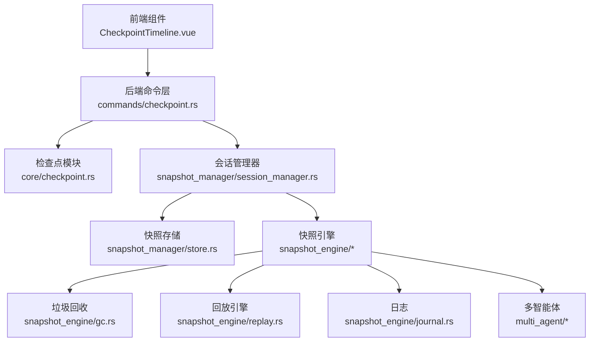
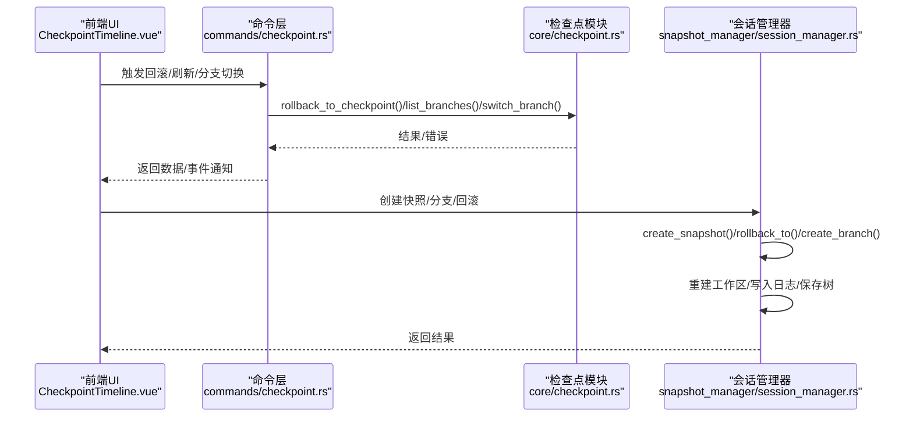
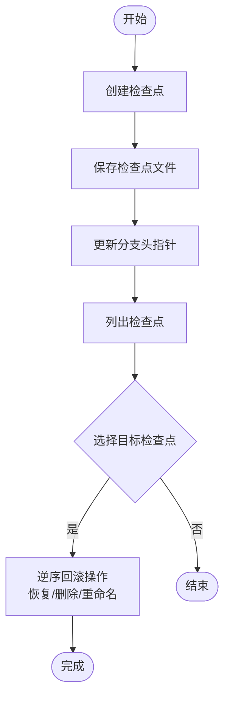
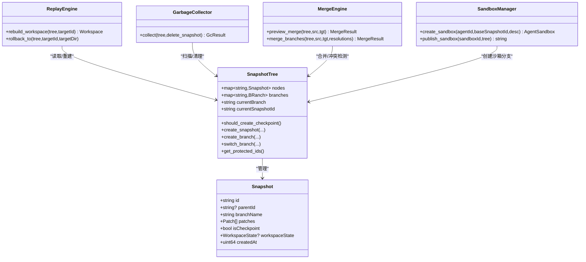
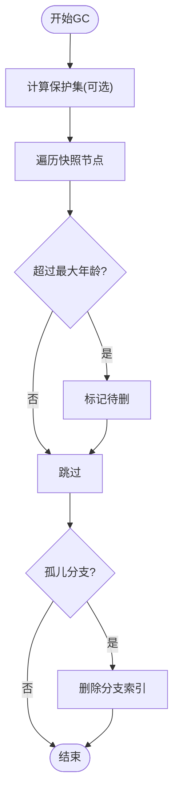
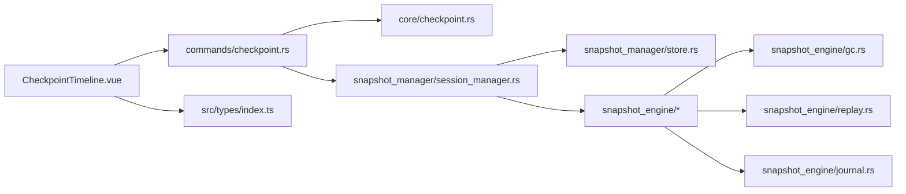

# 检查点管理

<cite>
**本文引用的文件**
- [checkpoint.rs](file://src-tauri/src/core/checkpoint.rs)
- [gc.rs](file://src-tauri/src/core/snapshot_engine/gc.rs)
- [snapshot.rs](file://src-tauri/src/core/snapshot_engine/snapshot.rs)
- [replay.rs](file://src-tauri/src/core/snapshot_engine/replay.rs)
- [journal.rs](file://src-tauri/src/core/snapshot_engine/journal.rs)
- [session_manager.rs](file://src-tauri/src/core/snapshot_manager/session_manager.rs)
- [store.rs](file://src-tauri/src/core/snapshot_manager/store.rs)
- [sandbox.rs](file://src-tauri/src/core/snapshot_engine/multi_agent/sandbox.rs)
- [merge.rs](file://src-tauri/src/core/snapshot_engine/multi_agent/merge.rs)
- [CheckpointTimeline.vue](file://src/components/checkpoint/CheckpointTimeline.vue)
- [index.ts](file://src/types/index.ts)
- [checkpoint.rs（命令）](file://src-tauri/src/core/commands/checkpoint.rs)
</cite>

## 目录
1. [简介](#简介)
2. [项目结构](#项目结构)
3. [核心组件](#核心组件)
4. [架构总览](#架构总览)
5. [详细组件分析](#详细组件分析)
6. [依赖关系分析](#依赖关系分析)
7. [性能考量](#性能考量)
8. [故障排查指南](#故障排查指南)
9. [结论](#结论)
10. [附录](#附录)

## 简介
本文件面向“检查点管理系统”，系统同时包含两套并行演进的版本化能力：
- 旧版检查点（Checkpoint）：以文件操作为粒度，记录变更并支持回滚。
- 新版快照（Snapshot）：以补丁（Patch）为粒度，构建可重放的工作区，支持自动检查点、分支合并、多智能体沙箱等。

本文围绕以下主题展开：
- 检查点的创建、维护与管理机制（自动触发、手动操作、命名规则、生命周期）
- 垃圾回收机制（GC）配置与策略、内存优化
- 检查点与快照的关系、版本控制集成、存储空间管理
- 最佳实践、故障恢复方案与性能监控方法

## 项目结构
系统采用前后端分离与模块化组织：
- 前端：Vue 组件负责展示检查点时间线与交互（如回滚确认、分支切换）
- 后端：Rust 提供两类版本化引擎与管理器
  - 旧版检查点引擎：文件级操作记录与回滚
  - 新版快照引擎：补丁级增量、工作区重建、回滚、日志与合并

图表来源
- [CheckpointTimeline.vue:1-616](file://src/components/checkpoint/CheckpointTimeline.vue#L1-L616)
- [checkpoint.rs（命令）:1-39](file://src-tauri/src/core/commands/checkpoint.rs#L1-L39)
- [checkpoint.rs:1-514](file://src-tauri/src/core/checkpoint.rs#L1-L514)
- [session_manager.rs:1-409](file://src-tauri/src/core/snapshot_manager/session_manager.rs#L1-L409)
- [store.rs:1-104](file://src-tauri/src/core/snapshot_manager/store.rs#L1-L104)
- [gc.rs:1-107](file://src-tauri/src/core/snapshot_engine/gc.rs#L1-L107)
- [replay.rs:1-344](file://src-tauri/src/core/snapshot_engine/replay.rs#L1-L344)
- [journal.rs:1-157](file://src-tauri/src/core/snapshot_engine/journal.rs#L1-L157)
- [sandbox.rs:1-248](file://src-tauri/src/core/snapshot_engine/multi_agent/sandbox.rs#L1-L248)
- [merge.rs:1-392](file://src-tauri/src/core/snapshot_engine/multi_agent/merge.rs#L1-L392)

章节来源
- [CheckpointTimeline.vue:1-616](file://src/components/checkpoint/CheckpointTimeline.vue#L1-L616)
- [checkpoint.rs（命令）:1-39](file://src-tauri/src/core/commands/checkpoint.rs#L1-L39)
- [checkpoint.rs:1-514](file://src-tauri/src/core/checkpoint.rs#L1-L514)
- [session_manager.rs:1-409](file://src-tauri/src/core/snapshot_manager/session_manager.rs#L1-L409)
- [store.rs:1-104](file://src-tauri/src/core/snapshot_manager/store.rs#L1-L104)
- [gc.rs:1-107](file://src-tauri/src/core/snapshot_engine/gc.rs#L1-L107)
- [replay.rs:1-344](file://src-tauri/src/core/snapshot_engine/replay.rs#L1-L344)
- [journal.rs:1-157](file://src-tauri/src/core/snapshot_engine/journal.rs#L1-L157)
- [sandbox.rs:1-248](file://src-tauri/src/core/snapshot_engine/multi_agent/sandbox.rs#L1-L248)
- [merge.rs:1-392](file://src-tauri/src/core/snapshot_engine/multi_agent/merge.rs#L1-L392)

## 核心组件
- 检查点模块（旧版）
  - 数据模型：检查点、分支、文件操作类型
  - 能力：创建、列出、回滚、分支管理、文件备份与恢复
- 快照引擎（新版）
  - 数据模型：快照、补丁、工作区、分支视图
  - 能力：自动检查点、工作区重建、回滚、日志、合并、沙箱
- 会话管理器
  - 生命周期：创建快照、分支切换、回滚、沙箱与合并
  - 存储：树与快照持久化
- 垃圾回收
  - 配置：最大检查点数、最大年龄、最大总大小、是否保留分支头
  - 策略：基于保护集与年龄判定清理
- 前端时间线
  - 展示检查点列表、分支标签、回滚确认与结果反馈

章节来源
- [checkpoint.rs:1-514](file://src-tauri/src/core/checkpoint.rs#L1-L514)
- [snapshot.rs:1-425](file://src-tauri/src/core/snapshot_engine/snapshot.rs#L1-L425)
- [session_manager.rs:1-409](file://src-tauri/src/core/snapshot_manager/session_manager.rs#L1-L409)
- [gc.rs:1-107](file://src-tauri/src/core/snapshot_engine/gc.rs#L1-L107)
- [CheckpointTimeline.vue:1-616](file://src/components/checkpoint/CheckpointTimeline.vue#L1-L616)

## 架构总览
系统通过命令层桥接前端与后端引擎，实现统一的版本化管理与回滚能力。

图表来源
- [CheckpointTimeline.vue:1-616](file://src/components/checkpoint/CheckpointTimeline.vue#L1-L616)
- [checkpoint.rs（命令）:1-39](file://src-tauri/src/core/commands/checkpoint.rs#L1-L39)
- [checkpoint.rs:1-514](file://src-tauri/src/core/checkpoint.rs#L1-L514)
- [session_manager.rs:1-409](file://src-tauri/src/core/snapshot_manager/session_manager.rs#L1-L409)

## 详细组件分析

### 检查点模块（旧版）
- 数据结构
  - 检查点：包含父节点、分支名、代理与工作区标识、创建时间、触发消息、文件操作集合与元数据
  - 分支：包含头检查点、描述、是否激活等
  - 文件操作：编辑/写入/创建/删除/重命名，携带哈希与差异摘要
- 关键流程
  - 创建检查点：生成唯一ID、写入分支目录、更新分支头
  - 列表与树：遍历分支目录、排序、聚合
  - 回滚：逆序处理操作，按类型恢复或删除文件
  - 分支管理：创建/切换/删除、默认主分支保护
  - 文件备份：按内容哈希去重存储，避免重复占用

图表来源
- [checkpoint.rs:281-314](file://src-tauri/src/core/checkpoint.rs#L281-L314)
- [checkpoint.rs:455-500](file://src-tauri/src/core/checkpoint.rs#L455-L500)

章节来源
- [checkpoint.rs:1-514](file://src-tauri/src/core/checkpoint.rs#L1-L514)

### 快照引擎（新版）
- 自动检查点
  - 基于补丁计数阈值（每若干补丁创建一次检查点）
  - 检查点包含工作区状态（文件哈希与大小），便于快速重建
- 工作区重建与回滚
  - 从目标快照向上回溯，优先使用最近检查点的完整工作区状态
  - 支持原子式回滚（临时目录+撤销日志），保证一致性
- 日志与持久化
  - 日志记录快照/分支/切换等事件，支持压缩与重放
  - 树与快照持久化到磁盘，支持增量保存
- 合并与沙箱
  - 预览/执行分支合并，检测冲突并支持多种解决策略
  - 多智能体沙箱：为每个代理创建独立分支与工作区，支持完成/发布/放弃

图表来源
- [snapshot.rs:6-425](file://src-tauri/src/core/snapshot_engine/snapshot.rs#L6-L425)
- [replay.rs:1-344](file://src-tauri/src/core/snapshot_engine/replay.rs#L1-L344)
- [gc.rs:1-107](file://src-tauri/src/core/snapshot_engine/gc.rs#L1-L107)
- [merge.rs:1-392](file://src-tauri/src/core/snapshot_engine/multi_agent/merge.rs#L1-L392)
- [sandbox.rs:1-248](file://src-tauri/src/core/snapshot_engine/multi_agent/sandbox.rs#L1-L248)

章节来源
- [snapshot.rs:1-425](file://src-tauri/src/core/snapshot_engine/snapshot.rs#L1-L425)
- [replay.rs:1-344](file://src-tauri/src/core/snapshot_engine/replay.rs#L1-L344)
- [journal.rs:1-157](file://src-tauri/src/core/snapshot_engine/journal.rs#L1-L157)
- [store.rs:1-104](file://src-tauri/src/core/snapshot_manager/store.rs#L1-L104)
- [session_manager.rs:1-409](file://src-tauri/src/core/snapshot_manager/session_manager.rs#L1-L409)
- [merge.rs:1-392](file://src-tauri/src/core/snapshot_engine/multi_agent/merge.rs#L1-L392)
- [sandbox.rs:1-248](file://src-tauri/src/core/snapshot_engine/multi_agent/sandbox.rs#L1-L248)

### 垃圾回收机制（GC）
- 配置参数
  - 最大检查点数量
  - 最大年龄（天）
  - 最大总大小（MB）
  - 是否保留分支头（保护集）
- 清理策略
  - 计算保护集（分支头与其祖先链）
  - 基于年龄判定移除；孤儿分支清理
  - 回调删除快照文件，统计释放空间
- 内存优化
  - 仅在必要时加载树与快照
  - 使用哈希集合进行快速判定

图表来源
- [gc.rs:39-98](file://src-tauri/src/core/snapshot_engine/gc.rs#L39-L98)

章节来源
- [gc.rs:1-107](file://src-tauri/src/core/snapshot_engine/gc.rs#L1-L107)

### 会话管理器与存储
- 会话管理器职责
  - 创建快照（含自动检查点）、分支创建/切换、回滚
  - 重建工作区、写入日志、保存树与内容存储
  - 多智能体沙箱生命周期管理与发布
- 存储层
  - 快照文件按分支目录存放，树文件单独保存
  - 列表按创建时间排序，支持增量读取

章节来源
- [session_manager.rs:1-409](file://src-tauri/src/core/snapshot_manager/session_manager.rs#L1-L409)
- [store.rs:1-104](file://src-tauri/src/core/snapshot_manager/store.rs#L1-L104)

### 前端检查点时间线
- 功能
  - 列出检查点、显示分支标签、回滚确认、创建分支
  - 监听“检查点创建”事件自动刷新
- 交互
  - 点击展开查看操作详情（类型、路径、差异摘要）
  - 成功回滚弹窗展示受影响文件

章节来源
- [CheckpointTimeline.vue:1-616](file://src/components/checkpoint/CheckpointTimeline.vue#L1-L616)
- [index.ts:173-221](file://src/types/index.ts#L173-L221)

## 依赖关系分析
- 命令层依赖检查点模块与会话管理器
- 会话管理器依赖快照引擎、存储与日志
- 快照引擎内部协作：树/补丁/回放/合并/沙箱
- 前端组件依赖命令层与类型定义

图表来源
- [checkpoint.rs（命令）:1-39](file://src-tauri/src/core/commands/checkpoint.rs#L1-L39)
- [checkpoint.rs:1-514](file://src-tauri/src/core/checkpoint.rs#L1-L514)
- [session_manager.rs:1-409](file://src-tauri/src/core/snapshot_manager/session_manager.rs#L1-L409)
- [store.rs:1-104](file://src-tauri/src/core/snapshot_manager/store.rs#L1-L104)
- [gc.rs:1-107](file://src-tauri/src/core/snapshot_engine/gc.rs#L1-L107)
- [replay.rs:1-344](file://src-tauri/src/core/snapshot_engine/replay.rs#L1-L344)
- [journal.rs:1-157](file://src-tauri/src/core/snapshot_engine/journal.rs#L1-L157)
- [CheckpointTimeline.vue:1-616](file://src/components/checkpoint/CheckpointTimeline.vue#L1-L616)
- [index.ts:173-221](file://src/types/index.ts#L173-L221)

## 性能考量
- 自动检查点间隔
  - 新版快照引擎以补丁数量作为阈值，减少检查点数量，降低存储压力
- 工作区重建优化
  - 检查点包含工作区状态，回放时直接加载哈希对应内容，避免全量重放
- 垃圾回收
  - 基于保护集与年龄快速筛选，避免全量扫描
- IO 优化
  - 内容按哈希去重存储，减少重复写入
  - 日志分段与压缩，降低磁盘占用

[本节为通用指导，无需特定文件引用]

## 故障排查指南
- 回滚失败
  - 检查备份文件是否存在与可读
  - 确认目标检查点存在且在当前分支链上
- 分支删除失败
  - 主分支不可删除；当前活跃分支需先切换
- 快照/树加载失败
  - 检查树文件是否存在；必要时重建工作区
- 日志过大
  - 触发压缩流程，重新写入日志文件
- 合并冲突过多
  - 预览合并后根据冲突类型选择保留源/目标/两者并行或手动解决

章节来源
- [checkpoint.rs:455-500](file://src-tauri/src/core/checkpoint.rs#L455-L500)
- [checkpoint.rs:254-277](file://src-tauri/src/core/checkpoint.rs#L254-L277)
- [store.rs:63-76](file://src-tauri/src/core/snapshot_manager/store.rs#L63-L76)
- [journal.rs:106-151](file://src-tauri/src/core/snapshot_engine/journal.rs#L106-L151)
- [merge.rs:113-145](file://src-tauri/src/core/snapshot_engine/multi_agent/merge.rs#L113-L145)

## 结论
本系统提供了双轨并行的版本化能力：
- 旧版检查点适合细粒度文件级回滚与分支管理
- 新版快照引擎提供更高效的工作区重建、自动检查点与多智能体协作能力
配合完善的日志、存储与垃圾回收机制，系统在功能完整性与性能之间取得平衡。建议结合业务场景选择合适的版本化方式，并合理配置 GC 参数与检查点间隔，确保长期运行的稳定性与可维护性。

[本节为总结性内容，无需特定文件引用]

## 附录

### 检查点与快照的关系
- 检查点（旧版）：以文件操作为单位，记录变更与备份，支持回滚
- 快照（新版）：以补丁为单位，记录增量变更，支持自动检查点与工作区重建
- 迁移建议：逐步向快照引擎迁移，利用检查点工作区状态提升回滚效率

章节来源
- [checkpoint.rs:1-514](file://src-tauri/src/core/checkpoint.rs#L1-L514)
- [snapshot.rs:1-425](file://src-tauri/src/core/snapshot_engine/snapshot.rs#L1-L425)

### 版本控制集成与存储空间管理
- 版本控制集成
  - 日志记录关键事件，支持重放与审计
  - 合并引擎提供冲突检测与解决策略
- 存储空间管理
  - 内容按哈希去重；GC 基于年龄与保护集清理
  - 建议定期执行 GC 并监控空间使用趋势

章节来源
- [journal.rs:1-157](file://src-tauri/src/core/snapshot_engine/journal.rs#L1-L157)
- [gc.rs:1-107](file://src-tauri/src/core/snapshot_engine/gc.rs#L1-L107)
- [store.rs:1-104](file://src-tauri/src/core/snapshot_manager/store.rs#L1-L104)

### 最佳实践
- 自动检查点
  - 根据补丁数量设置阈值，避免检查点过于频繁
- 回滚前备份
  - 对重要工作区进行外部备份，防止不可逆操作
- 合理使用分支
  - 主分支用于稳定版本，开发在特性分支进行
- 定期清理
  - 配置 GC 参数，定期清理过期快照与孤儿分支

[本节为通用指导，无需特定文件引用]