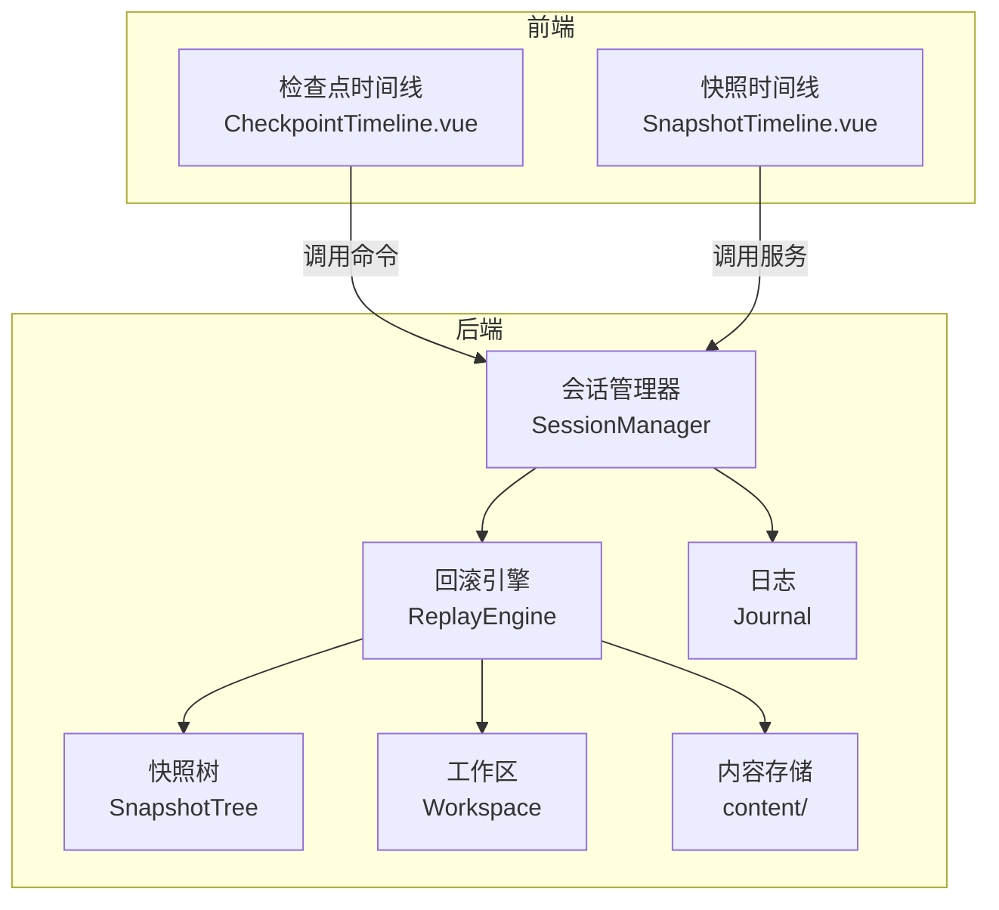
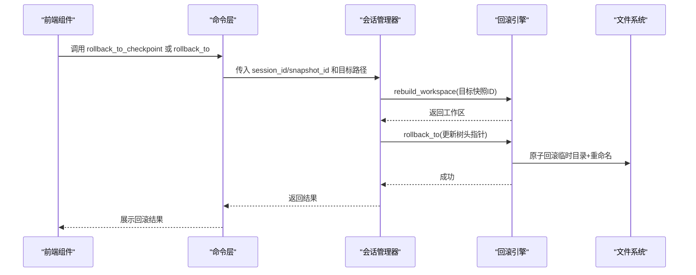
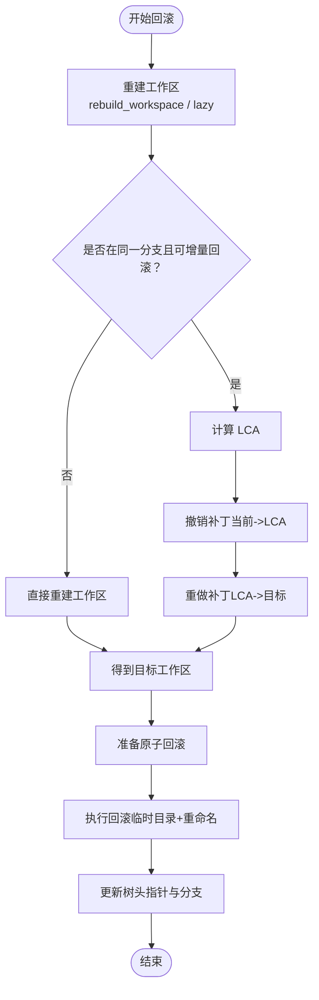
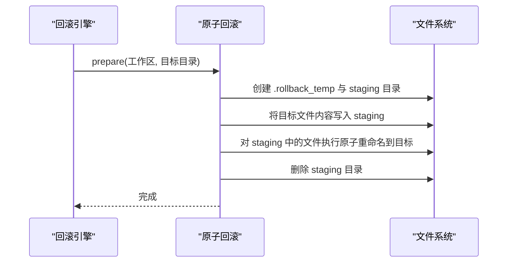
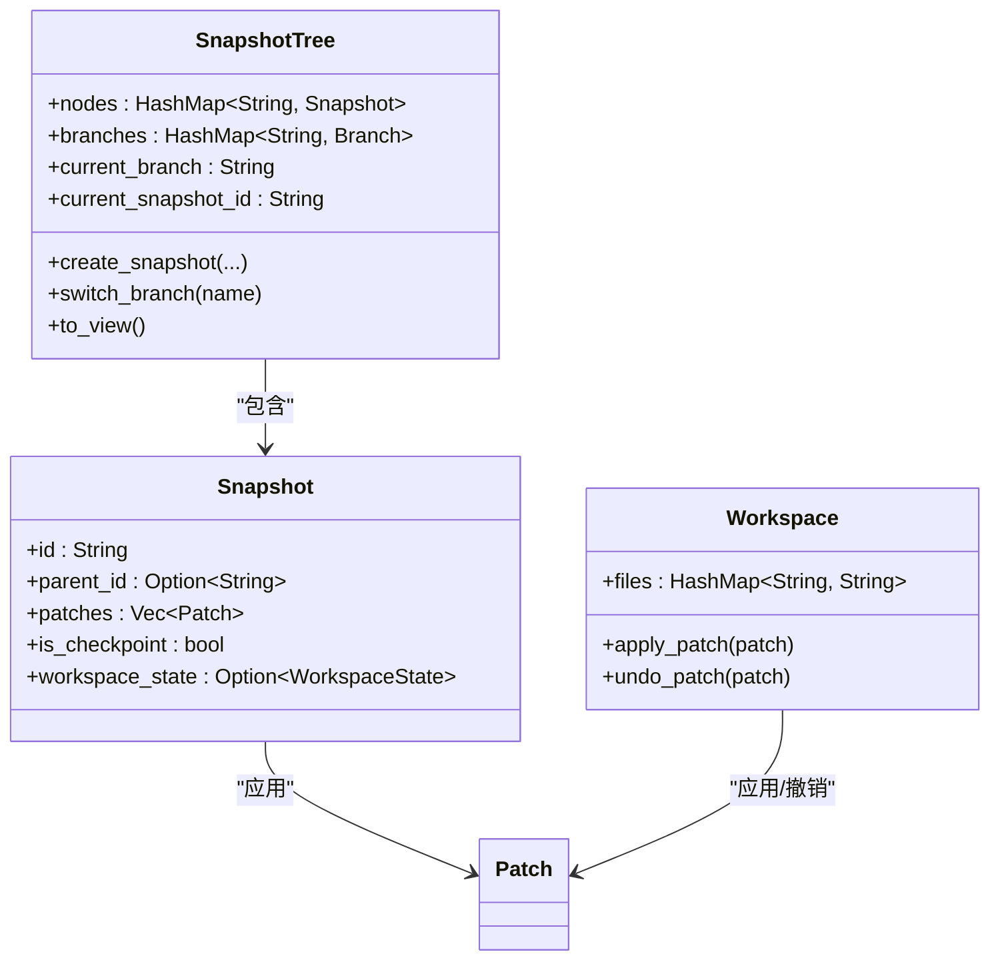
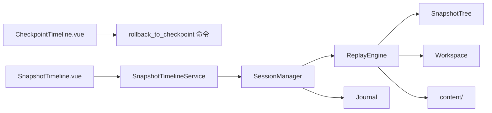

# 版本回滚与恢复

<cite>
**本文档引用的文件**
- [replay.rs](file://src-tauri/src/core/snapshot_engine/replay.rs)
- [snapshot.rs](file://src-tauri/src/core/snapshot_engine/snapshot.rs)
- [patch.rs](file://src-tauri/src/core/snapshot_engine/patch.rs)
- [journal.rs](file://src-tauri/src/core/snapshot_engine/journal.rs)
- [mod.rs](file://src-tauri/src/core/snapshot_engine/mod.rs)
- [session_manager.rs](file://src-tauri/src/core/snapshot_manager/session_manager.rs)
- [checkpoint.rs](file://src-tauri/src/core/checkpoint.rs)
- [checkpoint.rs（命令）](file://src-tauri/src/core/commands/checkpoint.rs)
- [CheckpointTimeline.vue](file://src/components/checkpoint/CheckpointTimeline.vue)
- [SnapshotTimeline.vue](file://src/components/snapshot/SnapshotTimeline.vue)
</cite>

## 目录
1. [简介](#简介)
2. [项目结构](#项目结构)
3. [核心组件](#核心组件)
4. [架构总览](#架构总览)
5. [组件详解](#组件详解)
6. [依赖关系分析](#依赖关系分析)
7. [性能考量](#性能考量)
8. [故障排查指南](#故障排查指南)
9. [结论](#结论)
10. [附录](#附录)

## 简介
本文件面向“版本回滚与恢复”系统，聚焦于回滚引擎（ReplayEngine）的设计与实现，涵盖以下主题：
- 原子文件回滚（AtomicFileRollback）机制与撤销条目（UndoEntry、UndoAction）模型
- 安全回滚策略、数据一致性保证、冲突检测与处理
- 重放机制的实现细节、时间线管理、状态恢复流程
- 回滚操作的安全考虑、性能影响、错误处理与最佳实践

## 项目结构
回滚与恢复能力由 Rust 后端的快照引擎与前端交互组件共同构成：
- 后端快照引擎位于 src-tauri/src/core/snapshot_engine，包含补丁（Patch）、快照树（SnapshotTree）、工作区（Workspace）、重放（ReplayEngine）等模块
- 会话管理器（SessionManager）负责协调快照树、日志（Journal）、内容存储与回滚执行
- 前端提供检查点（Checkpoint）与快照（Snapshot）时间线组件，支持用户触发回滚操作

**图表来源**
- [session_manager.rs:18-56](file://src-tauri/src/core/snapshot_manager/session_manager.rs#L18-L56)
- [replay.rs:23-31](file://src-tauri/src/core/snapshot_engine/replay.rs#L23-L31)
- [journal.rs:47-51](file://src-tauri/src/core/snapshot_engine/journal.rs#L47-L51)
- [CheckpointTimeline.vue:56-73](file://src/components/checkpoint/CheckpointTimeline.vue#L56-L73)
- [SnapshotTimeline.vue:83-111](file://src/components/snapshot/SnapshotTimeline.vue#L83-L111)

**章节来源**
- [mod.rs:1-14](file://src-tauri/src/core/snapshot_engine/mod.rs#L1-L14)
- [session_manager.rs:18-56](file://src-tauri/src/core/snapshot_manager/session_manager.rs#L18-L56)

## 核心组件
- 回滚引擎（ReplayEngine）：负责根据快照树重建工作区、计算 LCA、收集撤销/重做补丁、驱动原子回滚
- 原子文件回滚（AtomicFileRollback）：在临时目录准备文件变更，再通过原子重命名完成最终落盘，支持撤销日志持久化
- 撤销条目（UndoEntry）与动作（UndoAction）：记录每个文件在回滚前的状态，用于失败恢复
- 快照树（SnapshotTree）与工作区（Workspace）：前者维护分支与父子关系，后者以补丁序列表示文件集合
- 日志（Journal）：记录快照、分支等事件，支持重放与压缩

**章节来源**
- [replay.rs:23-50](file://src-tauri/src/core/snapshot_engine/replay.rs#L23-L50)
- [snapshot.rs:33-46](file://src-tauri/src/core/snapshot_engine/snapshot.rs#L33-L46)
- [journal.rs:47-51](file://src-tauri/src/core/snapshot_engine/journal.rs#L47-L51)

## 架构总览
回滚流程自上而下分为三层：
- 前端交互层：用户在检查点或快照时间线上选择目标，触发回滚命令
- 会话管理层：调用会话管理器，协调回滚引擎与存储
- 引擎与存储层：回滚引擎重建工作区，执行原子回滚，更新快照树与分支指针

**图表来源**
- [checkpoint.rs（命令）:19-88](file://src-tauri/src/core/commands/checkpoint.rs#L19-L88)
- [session_manager.rs:185-199](file://src-tauri/src/core/snapshot_manager/session_manager.rs#L185-L199)
- [replay.rs:227-246](file://src-tauri/src/core/snapshot_engine/replay.rs#L227-L246)

## 组件详解

### 回滚引擎（ReplayEngine）
- 作用：基于快照树重建指定时间点的工作区；在当前工作区与目标之间进行增量回滚（撤销/重做）
- 关键方法：
  - rebuild_workspace：沿父链收集补丁，或从最近检查点直接加载文件内容
  - rebuild_workspace_lazy：计算 LCA，撤销当前到 LCA 的补丁，再重做 LCA 到目标的补丁
  - find_lowest_common_ancestor：求两个快照的最近公共祖先
  - collect_undo_patches/collect_redo_patches：按方向遍历快照链收集补丁
  - rollback_to：重建工作区，准备原子回滚，更新树头指针

**图表来源**
- [replay.rs:57-92](file://src-tauri/src/core/snapshot_engine/replay.rs#L57-L92)
- [replay.rs:123-149](file://src-tauri/src/core/snapshot_engine/replay.rs#L123-L149)
- [replay.rs:151-225](file://src-tauri/src/core/snapshot_engine/replay.rs#L151-L225)
- [replay.rs:227-246](file://src-tauri/src/core/snapshot_engine/replay.rs#L227-L246)

**章节来源**
- [replay.rs:52-246](file://src-tauri/src/core/snapshot_engine/replay.rs#L52-L246)

### 原子文件回滚（AtomicFileRollback）
- 设计要点：
  - 在目标目录下创建 .rollback_temp/staging-{uuid} 作为中间态
  - 预写入 staging，再对 staging 与目标执行原子重命名，确保回滚要么全部成功，要么完全不生效
  - 支持撤销日志持久化/加载，便于离线恢复
- 动作类型（UndoAction）：
  - Create：目标不存在，回滚时需删除
  - Update：目标存在，回滚时需恢复旧内容
  - Delete：目标存在，回滚时需删除（当前实现中 Delete 不写入 staging）

**图表来源**
- [replay.rs:248-343](file://src-tauri/src/core/snapshot_engine/replay.rs#L248-L343)

**章节来源**
- [replay.rs:248-343](file://src-tauri/src/core/snapshot_engine/replay.rs#L248-L343)

### 撤销条目与动作（UndoEntry / UndoAction）
- UndoEntry：记录单个文件的回滚前状态与动作类型
- UndoAction：Create/Delete/Update 三类，分别对应新建、删除、更新
- 用途：在回滚失败或中断时，依据撤销日志恢复现场

**章节来源**
- [replay.rs:33-44](file://src-tauri/src/core/snapshot_engine/replay.rs#L33-L44)
- [replay.rs:248-343](file://src-tauri/src/core/snapshot_engine/replay.rs#L248-L343)

### 快照树与工作区（SnapshotTree / Workspace）
- SnapshotTree：维护节点（快照）、分支、当前分支与当前快照 ID；提供分支切换、树视图生成、受保护 ID 计算等
- Workspace：以补丁序列表示文件集合，提供 apply_patch/undo_patch，保障操作幂等与一致性

**图表来源**
- [snapshot.rs:33-46](file://src-tauri/src/core/snapshot_engine/snapshot.rs#L33-L46)
- [snapshot.rs:6-20](file://src-tauri/src/core/snapshot_engine/snapshot.rs#L6-L20)
- [snapshot.rs:101-178](file://src-tauri/src/core/snapshot_engine/snapshot.rs#L101-L178)

**章节来源**
- [snapshot.rs:33-178](file://src-tauri/src/core/snapshot_engine/snapshot.rs#L33-L178)

### 补丁与差异（Patch / TextDiff）
- Patch：Create/Delete/Update/Rename 四种操作，携带内容哈希与可选差异
- Workspace.apply_patch/undo_patch：在 Apply/Undo 时校验内容哈希，防止并发覆盖导致的数据不一致

**章节来源**
- [patch.rs:5-25](file://src-tauri/src/core/snapshot_engine/patch.rs#L5-L25)
- [snapshot.rs:108-177](file://src-tauri/src/core/snapshot_engine/snapshot.rs#L108-L177)

### 日志与重放（Journal / JournalEntry）
- Journal：以 JSON 行格式记录事件，支持追加、重放、压缩
- JournalEntry：CreateSnapshot/CreateBranch/SwitchBranch/DeleteBranch/Compact 等事件类型
- 用途：审计、恢复、迁移与性能优化（压缩）

**章节来源**
- [journal.rs:9-35](file://src-tauri/src/core/snapshot_engine/journal.rs#L9-L35)
- [journal.rs:76-151](file://src-tauri/src/core/snapshot_engine/journal.rs#L76-L151)

### 会话管理器（SessionManager）
- 负责：
  - 初始化回滚引擎、日志与存储
  - 提供 rollback_to 接口，协调重建工作区与执行回滚
  - 保存树状态与日志，必要时触发日志压缩

**章节来源**
- [session_manager.rs:18-56](file://src-tauri/src/core/snapshot_manager/session_manager.rs#L18-L56)
- [session_manager.rs:185-199](file://src-tauri/src/core/snapshot_manager/session_manager.rs#L185-L199)

### 前端交互（检查点与快照时间线）
- CheckpointTimeline.vue：展示检查点树，支持回滚到指定检查点，触发后端命令
- SnapshotTimeline.vue：展示快照树，支持回滚到指定快照，自动获取工作区路径并调用服务

**章节来源**
- [CheckpointTimeline.vue:56-73](file://src/components/checkpoint/CheckpointTimeline.vue#L56-L73)
- [SnapshotTimeline.vue:83-111](file://src/components/snapshot/SnapshotTimeline.vue#L83-L111)

## 依赖关系分析
- ReplayEngine 依赖 SnapshotTree、Workspace、Patch、内容存储目录
- SessionManager 依赖 ReplayEngine、SnapshotStore、Journal
- 前端组件通过命令/服务调用 SessionManager，间接依赖后端引擎

**图表来源**
- [checkpoint.rs（命令）:19-88](file://src-tauri/src/core/commands/checkpoint.rs#L19-L88)
- [session_manager.rs:185-199](file://src-tauri/src/core/snapshot_manager/session_manager.rs#L185-L199)
- [replay.rs:23-31](file://src-tauri/src/core/snapshot_engine/replay.rs#L23-L31)

**章节来源**
- [mod.rs:1-14](file://src-tauri/src/core/snapshot_engine/mod.rs#L1-L14)

## 性能考量
- 增量回滚（lazy）：当当前快照与目标快照在同一分支或共享祖先时，通过撤销/重做补丁减少 IO，提升性能
- 检查点（Checkpoint）：定期将完整工作区状态写入内容存储，重建时可直接加载文件内容，避免逐补丁重放
- 日志压缩：当事件数量超过阈值时压缩日志，降低读取成本
- 原子回滚：通过 staging 与重命名避免部分写入，减少失败场景下的修复成本

[本节为通用性能讨论，无需具体文件分析]

## 故障排查指南
- 常见错误类型（ReplayError）：
  - 快照缺失：SnapshotNotFound
  - 无公共祖先：NoCommonAncestor
  - 补丁错误：PatchError（如文件不存在、内容哈希不匹配）
  - IO/JSON 错误
- 排查步骤：
  - 确认目标快照 ID 存在于快照树中
  - 若报“无公共祖先”，检查分支关系与快照链连通性
  - 若 Apply/Undo 报错，检查文件是否被外部修改导致哈希不一致
  - 若回滚失败，使用撤销日志（save/load_undo_log）恢复现场
  - 检查内容存储目录是否存在目标文件哈希对应的文件

**章节来源**
- [replay.rs:9-21](file://src-tauri/src/core/snapshot_engine/replay.rs#L9-L21)
- [patch.rs:58-68](file://src-tauri/src/core/snapshot_engine/patch.rs#L58-L68)

## 结论
本系统通过补丁化的快照树与工作区、严格的哈希校验、增量回滚与原子回滚机制，实现了高可靠性的版本回滚与恢复能力。配合日志重放与检查点策略，既保证了数据一致性，又兼顾了性能与可审计性。前端时间线组件提供了直观的操作入口，结合完善的错误处理与撤销日志，使回滚过程可控、可追踪。

[本节为总结性内容，无需具体文件分析]

## 附录

### 安全回滚策略与最佳实践
- 回滚前提示：前端在回滚前弹窗确认，明确提示可能丢失未保存更改
- 权限与路径：确保目标工作区路径有效，必要时引导用户设置
- 并发控制：回滚过程中避免外部修改目标文件，否则可能导致哈希不一致
- 失败恢复：启用撤销日志持久化，失败时可依据日志回滚到上一个稳定状态
- 审计与压缩：定期检查日志大小，必要时触发压缩，保持系统健康运行

**章节来源**
- [CheckpointTimeline.vue:230-252](file://src/components/checkpoint/CheckpointTimeline.vue#L230-L252)
- [SnapshotTimeline.vue:363-434](file://src/components/snapshot/SnapshotTimeline.vue#L363-L434)
- [journal.rs:102-151](file://src-tauri/src/core/snapshot_engine/journal.rs#L102-L151)