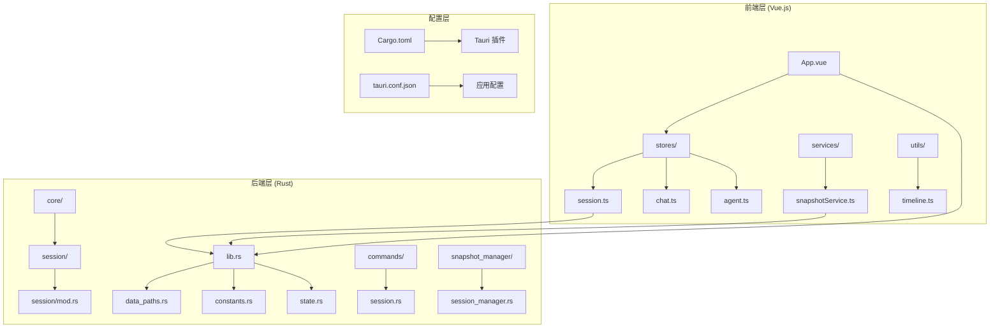
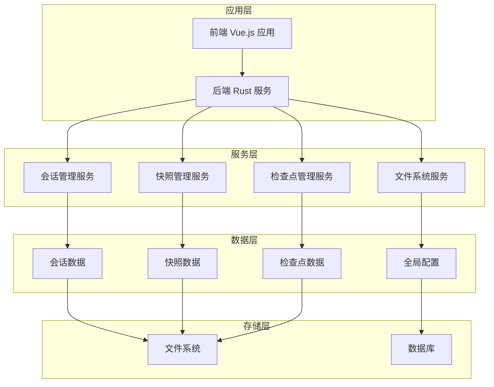
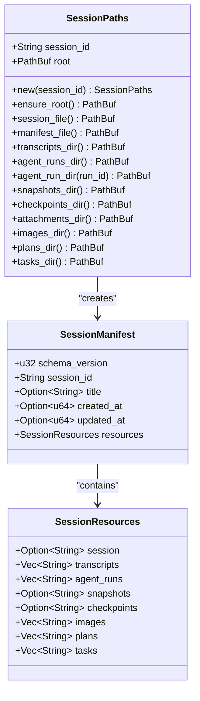
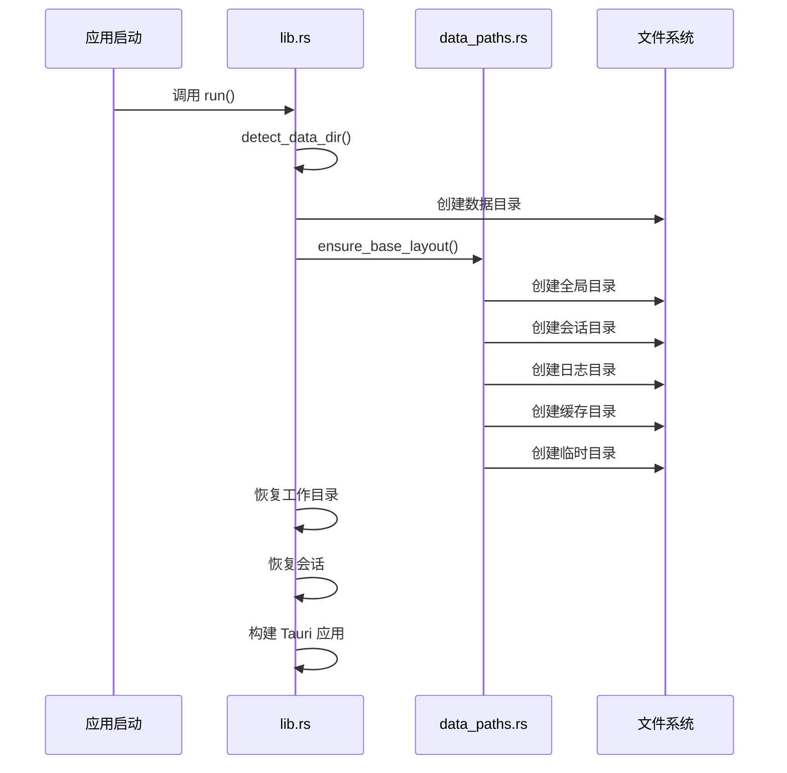
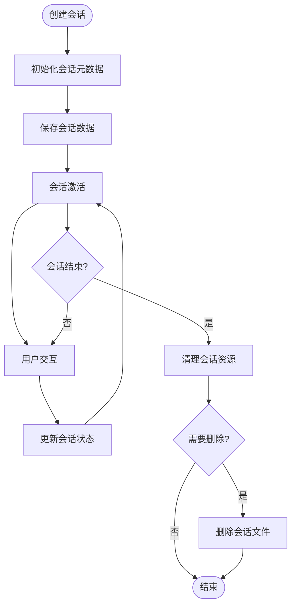
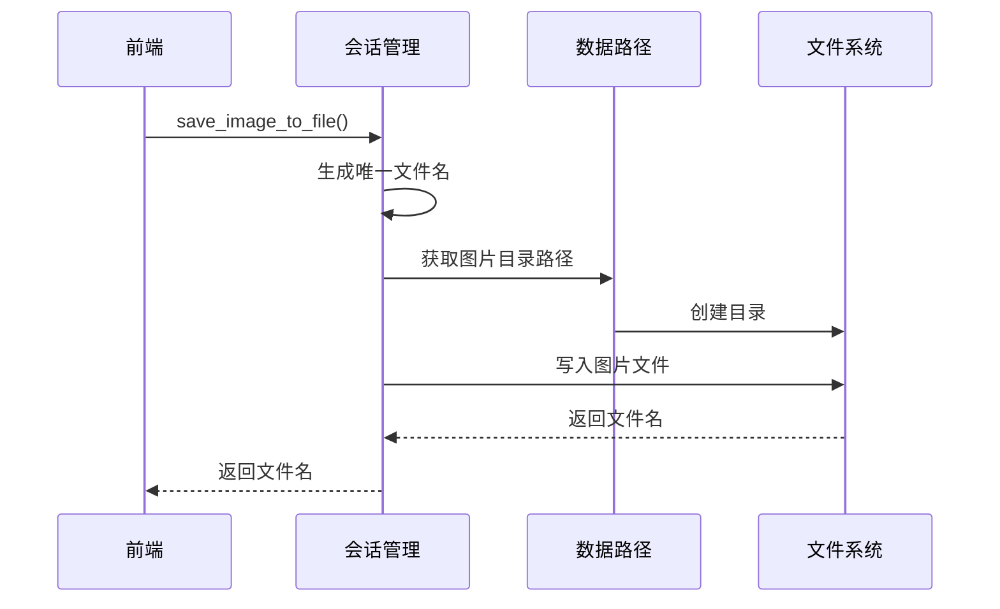
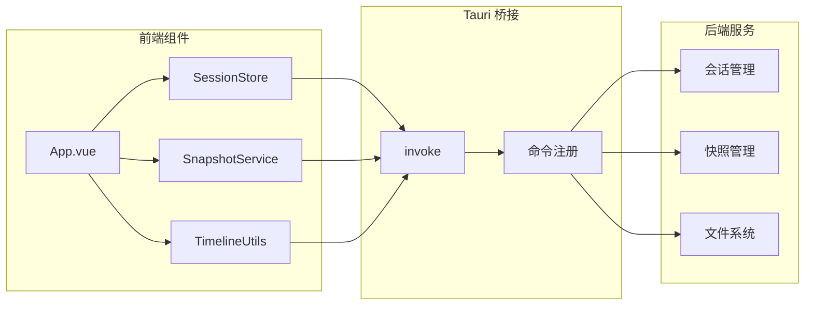
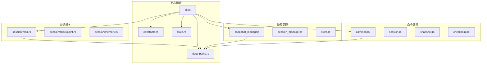

# 数据路径管理系统

<cite>
**本文档引用的文件**
- [src-tauri/src/core/data_paths.rs](file://src-tauri/src/core/data_paths.rs)
- [src-tauri/src/lib.rs](file://src-tauri/src/lib.rs)
- [src-tauri/src/core/constants.rs](file://src-tauri/src/core/constants.rs)
- [src-tauri/src/core/session/mod.rs](file://src-tauri/src/core/session/mod.rs)
- [src-tauri/src/core/state.rs](file://src-tauri/src/core/state.rs)
- [src-tauri/Cargo.toml](file://src-tauri/Cargo.toml)
- [src-tauri/tauri.conf.json](file://src-tauri/tauri.conf.json)
- [src/App.vue](file://src/App.vue)
- [src/stores/session.ts](file://src/stores/session.ts)
- [src/services/snapshotService.ts](file://src/services/snapshotService.ts)
- [src/utils/timeline.ts](file://src/utils/timeline.ts)
- [README.md](file://README.md)
</cite>

## 目录
1. [简介](#简介)
2. [项目结构](#项目结构)
3. [核心组件](#核心组件)
4. [架构概览](#架构概览)
5. [详细组件分析](#详细组件分析)
6. [依赖关系分析](#依赖关系分析)
7. [性能考虑](#性能考虑)
8. [故障排除指南](#故障排除指南)
9. [结论](#结论)

## 简介

数据路径管理系统是 JarvisAgent 桌面应用的核心基础设施，负责管理应用程序运行时产生的所有数据文件和目录结构。该系统采用 Rust 编写，为前端 Vue.js 应用提供可靠的数据持久化和文件管理能力。

系统的主要目标包括：
- 统一管理会话数据、快照、检查点等运行时数据
- 提供安全的文件系统访问接口
- 支持多会话并发管理
- 实现数据的可靠持久化和恢复
- 提供灵活的目录结构组织方式

## 项目结构

JarvisAgent 采用前后端分离的架构设计，数据路径管理主要位于 Rust 后端的 `src-tauri/src/core/` 目录中：



**图表来源**
- [src-tauri/src/lib.rs:1-213](file://src-tauri/src/lib.rs#L1-L213)
- [src-tauri/src/core/data_paths.rs:1-337](file://src-tauri/src/core/data_paths.rs#L1-L337)

**章节来源**
- [src-tauri/src/lib.rs:1-213](file://src-tauri/src/lib.rs#L1-L213)
- [src-tauri/Cargo.toml:1-42](file://src-tauri/Cargo.toml#L1-L42)
- [src-tauri/tauri.conf.json:1-40](file://src-tauri/tauri.conf.json#L1-L40)

## 核心组件

### 数据路径管理器 (Data Paths Manager)

数据路径管理器是系统的核心组件，负责定义和管理所有数据目录的结构和访问方法。

#### 主要功能
- **目录结构定义**：定义全局、会话、日志、缓存等标准目录
- **路径生成**：为每个会话生成唯一的路径结构
- **文件管理**：提供文件的创建、读取、删除等操作
- **数据验证**：确保数据的一致性和完整性

#### 关键常量
系统定义了以下标准目录常量：
- `DIR_GLOBAL`: 全局数据目录
- `DIR_SESSIONS`: 会话数据目录
- `DIR_LOGS`: 日志目录
- `DIR_CACHE`: 缓存目录
- `DIR_TMP`: 临时文件目录

**章节来源**
- [src-tauri/src/core/data_paths.rs:17-31](file://src-tauri/src/core/data_paths.rs#L17-L31)
- [src-tauri/src/core/constants.rs:17-26](file://src-tauri/src/core/constants.rs#L17-L26)

### 会话路径管理器 (Session Paths Manager)

会话路径管理器专门处理会话相关的数据路径管理，为每个会话提供独立的数据存储空间。

#### 会话目录结构
每个会话都会创建以下目录结构：
```
<sessions_dir>/<session_id>/
├── session.json          # 会话元数据
├── manifest.json         # 会话清单
├── transcripts/          # 对话转录
├── agent_runs/           # Agent 运行记录
├── snapshots/            # 快照数据
├── checkpoints/          # 检查点数据
├── attachments/          # 附件文件
│   └── images/           # 图片附件
├── plans/                # 方案文档
├── tasks/                # 任务数据
└── transcripts/          # 对话记录
```

**章节来源**
- [src-tauri/src/core/data_paths.rs:35-132](file://src-tauri/src/core/data_paths.rs#L35-L132)
- [src-tauri/src/core/session/mod.rs:31-86](file://src-tauri/src/core/session/mod.rs#L31-L86)

### 全局状态管理器 (Global State Manager)

全局状态管理器负责协调各个组件之间的状态同步，确保数据的一致性。

#### 状态组件
- **SessionManager**: 管理所有活跃会话的上下文
- **WorkspaceState**: 记录当前工作目录状态
- **SnapshotRegistry**: 管理会话级快照注册表

**章节来源**
- [src-tauri/src/core/state.rs:29-103](file://src-tauri/src/core/state.rs#L29-L103)

## 架构概览

数据路径管理系统采用分层架构设计，确保各层职责清晰、耦合度低：



**图表来源**
- [src-tauri/src/lib.rs:81-212](file://src-tauri/src/lib.rs#L81-L212)
- [src-tauri/src/core/data_paths.rs:186-193](file://src-tauri/src/core/data_paths.rs#L186-L193)

## 详细组件分析

### 数据路径核心模块

#### SessionPaths 结构体
SessionPaths 是会话路径管理的核心结构体，提供了完整的会话数据管理功能：



**图表来源**
- [src-tauri/src/core/data_paths.rs:35-74](file://src-tauri/src/core/data_paths.rs#L35-L74)
- [src-tauri/src/core/data_paths.rs:134-136](file://src-tauri/src/core/data_paths.rs#L134-L136)

#### 数据目录初始化流程

系统启动时会自动初始化必要的数据目录结构：



**图表来源**
- [src-tauri/src/lib.rs:90-120](file://src-tauri/src/lib.rs#L90-L120)
- [src-tauri/src/core/data_paths.rs:186-193](file://src-tauri/src/core/data_paths.rs#L186-L193)

**章节来源**
- [src-tauri/src/core/data_paths.rs:76-132](file://src-tauri/src/core/data_paths.rs#L76-L132)
- [src-tauri/src/lib.rs:90-120](file://src-tauri/src/lib.rs#L90-L120)

### 会话数据管理

#### 会话生命周期管理

会话管理系统提供了完整的会话生命周期管理功能：



**图表来源**
- [src-tauri/src/core/session/mod.rs:222-255](file://src-tauri/src/core/session/mod.rs#L222-L255)
- [src-tauri/src/core/session/mod.rs:529-535](file://src-tauri/src/core/session/mod.rs#L529-L535)

#### 图片文件管理

系统提供了专门的图片文件管理功能，支持 Base64 编码的图片数据存储：



**图表来源**
- [src-tauri/src/core/session/mod.rs:33-52](file://src-tauri/src/core/session/mod.rs#L33-L52)
- [src-tauri/src/core/data_paths.rs:117-123](file://src-tauri/src/core/data_paths.rs#L117-L123)

**章节来源**
- [src-tauri/src/core/session/mod.rs:33-86](file://src-tauri/src/core/session/mod.rs#L33-L86)
- [src-tauri/src/core/session/mod.rs:198-255](file://src-tauri/src/core/session/mod.rs#L198-L255)

### 前端集成

#### Vue.js 应用集成

前端应用通过 Tauri 的 invoke 机制与后端进行通信：



**图表来源**
- [src/App.vue:1-357](file://src/App.vue#L1-L357)
- [src/stores/session.ts:64-175](file://src/stores/session.ts#L64-L175)
- [src/services/snapshotService.ts:14-248](file://src/services/snapshotService.ts#L14-L248)

**章节来源**
- [src/App.vue:1-357](file://src/App.vue#L1-L357)
- [src/stores/session.ts:64-175](file://src/stores/session.ts#L64-L175)
- [src/services/snapshotService.ts:14-248](file://src/services/snapshotService.ts#L14-L248)

## 依赖关系分析

### 外部依赖

系统使用了多个关键的 Rust 依赖库：

```mermaid
graph TB
subgraph "核心依赖"
A[tauri = "2.1.1"]
B[serde = "1"]
C[tokio = "1"]
D[reqwest = "0.12"]
end
subgraph "插件依赖"
E[tauri-plugin-opener]
F[tauri-plugin-dialog]
G[tauri-plugin-fs]
H[tauri-plugin-window-state]
end
subgraph "工具依赖"
I[uuid = "1.23.1"]
J[chrono = "0.4.44"]
K[regex = "1"]
L[base64 = "0.22"]
end
A --> E
A --> F
A --> G
A --> H
B --> I
C --> J
D --> K
L --> M[Base64 编码]
```

**图表来源**
- [src-tauri/Cargo.toml:20-42](file://src-tauri/Cargo.toml#L20-L42)

### 内部模块依赖

系统内部模块之间存在清晰的依赖关系：



**图表来源**
- [src-tauri/src/lib.rs:22-36](file://src-tauri/src/lib.rs#L22-L36)
- [src-tauri/src/core/data_paths.rs:8-14](file://src-tauri/src/core/data_paths.rs#L8-L14)

**章节来源**
- [src-tauri/Cargo.toml:20-42](file://src-tauri/Cargo.toml#L20-L42)
- [src-tauri/src/lib.rs:22-36](file://src-tauri/src/lib.rs#L22-L36)

## 性能考虑

### 文件系统性能优化

系统采用了多种策略来优化文件系统的性能：

1. **目录结构优化**：合理的目录层次结构减少了文件系统查询时间
2. **缓存机制**：会话状态和快照数据采用内存缓存
3. **异步操作**：大量使用 Tokio 异步运行时提高并发性能
4. **增量更新**：只更新发生变化的数据部分

### 内存管理

系统实现了高效的内存管理策略：
- 使用 `Arc<Mutex<T>>` 和 `RwLock` 实现线程安全的共享状态
- 会话数据采用延迟加载机制
- 大文件采用流式处理避免内存溢出

## 故障排除指南

### 常见问题及解决方案

#### 数据目录权限问题
**症状**：应用无法创建或写入数据文件
**解决方案**：
1. 检查数据目录的写入权限
2. 确认磁盘空间充足
3. 验证路径的有效性

#### 会话数据损坏
**症状**：会话加载失败或数据不完整
**解决方案**：
1. 检查 `session.json` 文件的完整性
2. 验证 JSON 格式的正确性
3. 如有必要，删除损坏的会话文件重新创建

#### 文件路径问题
**症状**：文件无法找到或路径错误
**解决方案**：
1. 使用 `safe_component` 函数处理特殊字符
2. 验证路径的相对性和绝对性
3. 检查文件系统权限

**章节来源**
- [src-tauri/src/core/data_paths.rs:256-272](file://src-tauri/src/core/data_paths.rs#L256-L272)
- [src-tauri/src/core/session/mod.rs:436-446](file://src-tauri/src/core/session/mod.rs#L436-L446)

## 结论

数据路径管理系统为 JarvisAgent 提供了强大而可靠的数据管理基础设施。通过精心设计的目录结构、完善的错误处理机制和高效的性能优化策略，系统能够满足复杂桌面应用的数据管理需求。

### 主要优势

1. **结构化设计**：清晰的目录结构和模块划分
2. **安全性**：严格的权限控制和路径验证
3. **可扩展性**：模块化的架构便于功能扩展
4. **性能优化**：多种策略确保系统高效运行
5. **可靠性**：完善的错误处理和数据备份机制

### 未来发展方向

1. **分布式存储**：支持云端数据同步
2. **数据压缩**：进一步优化存储空间使用
3. **备份策略**：增强数据备份和恢复能力
4. **监控告警**：添加系统健康监控功能

该系统为 JarvisAgent 的成功运行奠定了坚实的基础，为用户提供了一个稳定、可靠的 AI 编程助手平台。