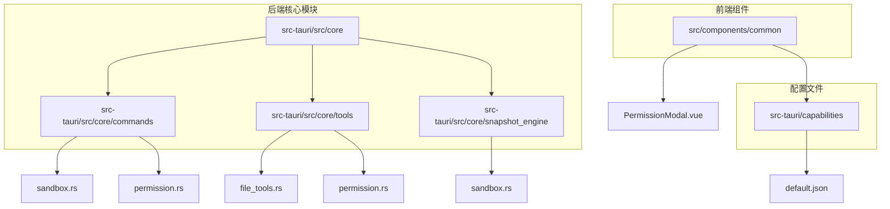
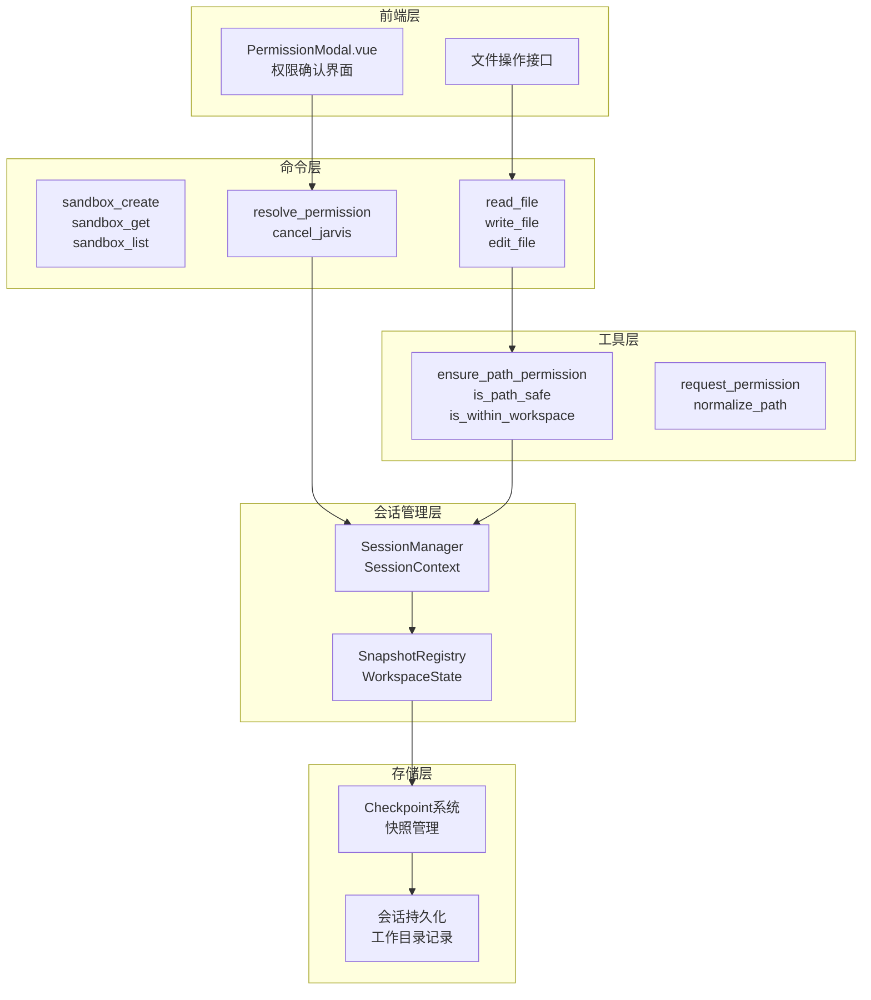
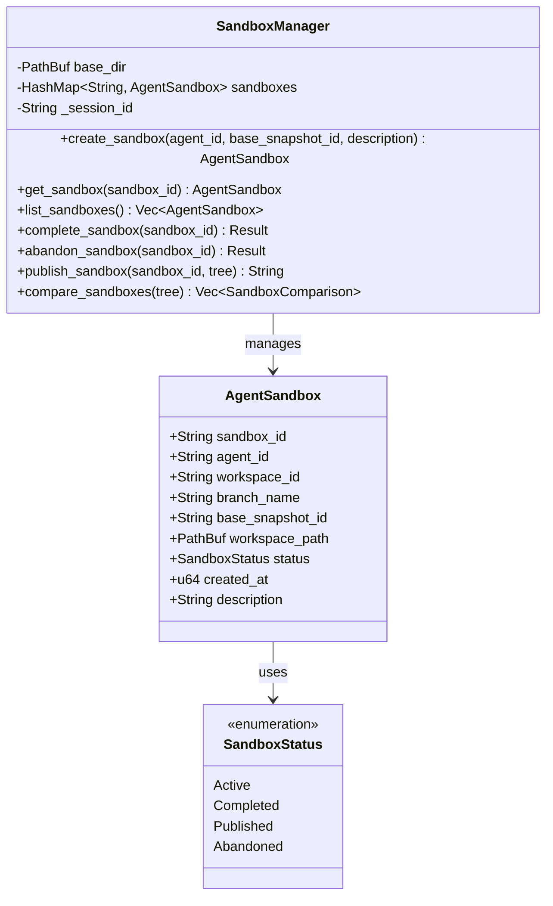
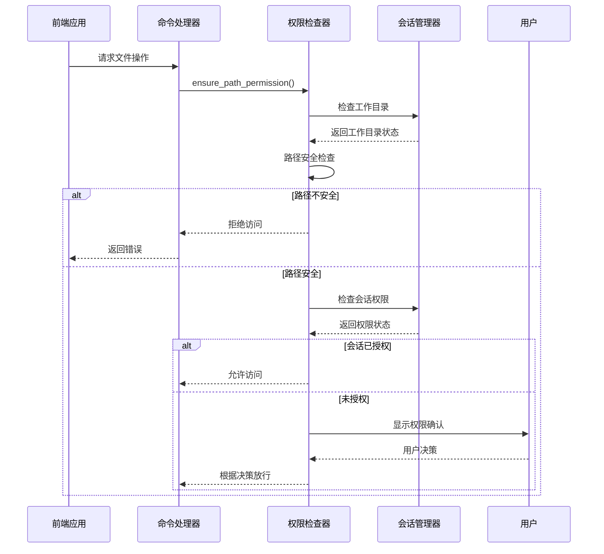
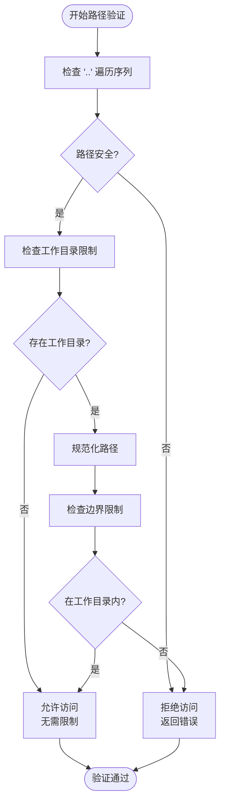
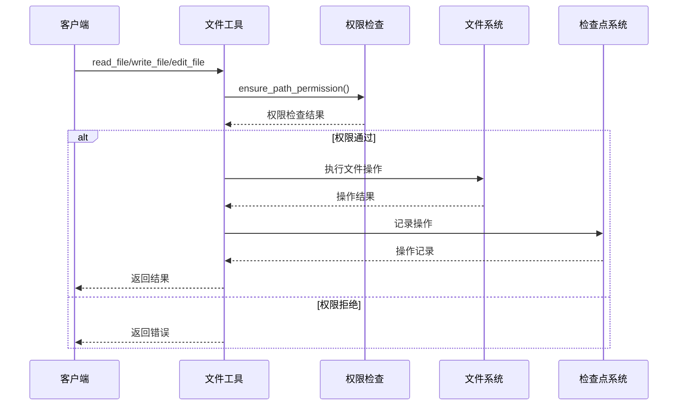
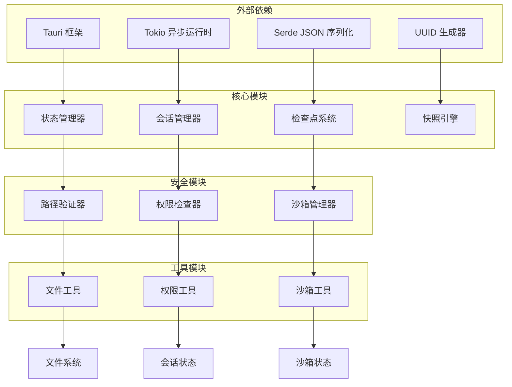

# 文件安全控制

<cite>
**本文档引用的文件**
- [sandbox.rs](file://src-tauri/src/core/commands/sandbox.rs)
- [permission.rs](file://src-tauri/src/core/commands/permission.rs)
- [file_tools.rs](file://src-tauri/src/core/tools/file_tools.rs)
- [permission.rs](file://src-tauri/src/core/tools/permission.rs)
- [default.json](file://src-tauri/capabilities/default.json)
- [sandbox.rs](file://src-tauri/src/core/snapshot_engine/multi_agent/sandbox.rs)
- [state.rs](file://src-tauri/src/core/state.rs)
- [checkpoint.rs](file://src-tauri/src/core/checkpoint.rs)
- [sessions.rs](file://src-tauri/src/core/sessions.rs)
- [PermissionModal.vue](file://src/components/common/PermissionModal.vue)
- [lib.rs](file://src-tauri/src/lib.rs)
</cite>

## 目录
1. [简介](#简介)
2. [项目结构](#项目结构)
3. [核心组件](#核心组件)
4. [架构概览](#架构概览)
5. [详细组件分析](#详细组件分析)
6. [依赖关系分析](#依赖关系分析)
7. [性能考虑](#性能考虑)
8. [故障排除指南](#故障排除指南)
9. [结论](#结论)

## 简介

JarvisAgent 的文件安全控制模块是一个多层次的安全防护系统，旨在保护系统免受恶意文件操作攻击。该模块通过沙箱机制、权限控制系统和路径安全验证三大核心组件，构建了完整的文件操作安全防护体系。

系统采用"最小权限原则"和"深度防御"策略，结合前端可视化权限确认界面，为用户提供透明、可控的文件操作体验。通过会话级别的工作目录限制、路径规范化检查、危险路径过滤等技术手段，有效防止路径遍历攻击和越权访问。

## 项目结构

文件安全控制模块主要分布在以下目录结构中：

**图表来源**
- [sandbox.rs:1-73](file://src-tauri/src/core/commands/sandbox.rs#L1-L73)
- [permission.rs:1-71](file://src-tauri/src/core/commands/permission.rs#L1-L71)
- [file_tools.rs:1-491](file://src-tauri/src/core/tools/file_tools.rs#L1-L491)
- [permission.rs:1-103](file://src-tauri/src/core/tools/permission.rs#L1-L103)

**章节来源**
- [sandbox.rs:1-73](file://src-tauri/src/core/commands/sandbox.rs#L1-L73)
- [permission.rs:1-71](file://src-tauri/src/core/commands/permission.rs#L1-L71)
- [file_tools.rs:1-491](file://src-tauri/src/core/tools/file_tools.rs#L1-L491)
- [permission.rs:1-103](file://src-tauri/src/core/tools/permission.rs#L1-L103)

## 核心组件

### 沙箱管理系统

沙箱系统提供隔离的文件操作环境，通过会话级别的工作目录限制实现安全隔离：

- **AgentSandbox**: 沙箱实体，包含工作目录路径、状态管理和描述信息
- **SandboxManager**: 沙箱管理器，负责沙箱的创建、查询、状态管理和生命周期控制
- **SandboxStatus**: 沙箱状态枚举，支持 Active、Completed、Published、Abandoned 状态

### 权限控制系统

权限控制模块提供细粒度的访问控制和用户确认机制：

- **SessionContext**: 会话上下文，维护每个会话的权限状态和工作目录
- **SessionManager**: 会话管理器，管理活跃会话的生命周期和状态
- **权限请求机制**: 支持一次性允许、会话级允许和拒绝三种权限决策

### 路径安全验证

路径验证模块确保所有文件操作都在安全范围内执行：

- **路径规范化**: 处理相对路径、父目录引用和重复分隔符
- **工作目录边界检查**: 验证路径是否在允许的工作目录范围内
- **危险路径过滤**: 过滤包含危险序列的路径

**章节来源**
- [sandbox.rs:1-248](file://src-tauri/src/core/snapshot_engine/multi_agent/sandbox.rs#L1-L248)
- [state.rs:1-78](file://src-tauri/src/core/state.rs#L1-L78)
- [permission.rs:1-103](file://src-tauri/src/core/tools/permission.rs#L1-L103)

## 架构概览

文件安全控制系统的整体架构采用分层设计，确保各组件职责清晰、耦合度低：

**图表来源**
- [PermissionModal.vue:1-339](file://src/components/common/PermissionModal.vue#L1-L339)
- [sandbox.rs:1-73](file://src-tauri/src/core/commands/sandbox.rs#L1-L73)
- [permission.rs:1-71](file://src-tauri/src/core/commands/permission.rs#L1-L71)
- [file_tools.rs:1-491](file://src-tauri/src/core/tools/file_tools.rs#L1-L491)
- [permission.rs:1-103](file://src-tauri/src/core/tools/permission.rs#L1-L103)
- [state.rs:1-78](file://src-tauri/src/core/state.rs#L1-L78)

## 详细组件分析

### 沙箱机制实现

沙箱机制通过会话级别的工作目录限制实现文件操作隔离：

#### AgentSandbox 结构体

**图表来源**
- [sandbox.rs:8-248](file://src-tauri/src/core/snapshot_engine/multi_agent/sandbox.rs#L8-L248)

#### 沙箱命令接口
沙箱命令通过 Tauri 命令系统提供统一的接口：

- `sandbox_create`: 创建新的沙箱实例
- `sandbox_get`: 获取指定沙箱信息
- `sandbox_list`: 列出所有沙箱
- `sandbox_complete`: 完成沙箱操作
- `sandbox_abandon`: 放弃沙箱操作
- `sandbox_publish`: 发布沙箱变更
- `sandbox_compare`: 比较沙箱差异

**章节来源**
- [sandbox.rs:1-73](file://src-tauri/src/core/commands/sandbox.rs#L1-L73)
- [sandbox.rs:1-248](file://src-tauri/src/core/snapshot_engine/multi_agent/sandbox.rs#L1-L248)

### 权限控制系统

权限控制系统提供多层次的访问控制和用户确认机制：

#### 权限检查流程

**图表来源**
- [permission.rs:49-103](file://src-tauri/src/core/tools/permission.rs#L49-L103)
- [permission.rs:1-71](file://src-tauri/src/core/commands/permission.rs#L1-L71)

#### 权限请求机制
权限请求通过异步通道实现，支持多种权限决策：

- **一次性允许**: 仅对当前操作允许
- **会话级允许**: 对当前会话的所有操作允许
- **拒绝**: 拒绝当前操作和后续类似操作

**章节来源**
- [permission.rs:74-103](file://src-tauri/src/core/tools/permission.rs#L74-L103)
- [permission.rs:1-71](file://src-tauri/src/core/commands/permission.rs#L1-L71)

### 路径安全验证

路径安全验证模块提供多层次的路径检查和规范化：

#### 路径验证算法

**图表来源**
- [permission.rs:12-72](file://src-tauri/src/core/tools/permission.rs#L12-L72)

#### 路径规范化实现
路径规范化处理各种路径格式问题：

- **相对路径处理**: 将相对路径转换为绝对路径
- **父目录引用**: 处理 `..` 父目录引用
- **重复分隔符**: 规范化路径分隔符
- **大小写处理**: 统一路径大小写

**章节来源**
- [permission.rs:16-47](file://src-tauri/src/core/tools/permission.rs#L16-L47)

### 文件操作安全集成

文件操作安全集成通过统一的工具函数实现：

#### 文件操作流程

**图表来源**
- [file_tools.rs:44-94](file://src-tauri/src/core/tools/file_tools.rs#L44-L94)
- [file_tools.rs:149-223](file://src-tauri/src/core/tools/file_tools.rs#L149-L223)

#### 操作类型定义
系统支持多种文件操作类型：

- **读取操作**: `read_file` - 安全读取文件内容
- **写入操作**: `write_file` - 安全写入文件内容，自动备份
- **编辑操作**: `edit_file` - 基于搜索替换的安全编辑
- **骨架提取**: `read_file_skeleton` - 提取文件结构骨架
- **目录操作**: `list_directory` - 安全列出目录内容
- **搜索操作**: `search_repo` - 安全搜索文件内容

**章节来源**
- [file_tools.rs:44-305](file://src-tauri/src/core/tools/file_tools.rs#L44-L305)

## 依赖关系分析

文件安全控制模块的依赖关系呈现清晰的层次结构：

**图表来源**
- [lib.rs:13-25](file://src-tauri/src/lib.rs#L13-L25)
- [state.rs:1-78](file://src-tauri/src/core/state.rs#L1-L78)

**章节来源**
- [lib.rs:1-186](file://src-tauri/src/lib.rs#L1-L186)
- [state.rs:1-78](file://src-tauri/src/core/state.rs#L1-L78)

## 性能考虑

文件安全控制模块在保证安全性的同时，充分考虑了性能优化：

### 路径检查优化
- **早期拒绝**: 在路径规范化之前快速检查危险序列
- **缓存机制**: 会话级别的权限状态缓存
- **异步处理**: 使用 Tokio 异步运行时处理并发请求

### 文件操作优化
- **增量备份**: 仅在必要时创建文件备份
- **内存映射**: 大文件读取使用内存映射技术
- **批量操作**: 支持批量文件操作减少系统调用

### 内存管理
- **智能指针**: 使用 Arc 和 Mutex 实现线程安全共享
- **延迟初始化**: 按需初始化昂贵资源
- **资源池**: 复用连接和文件句柄

## 故障排除指南

### 常见安全威胁及防护

#### 路径遍历攻击
**症状**: 文件操作失败或访问意外文件
**防护措施**:
- 启用路径安全检查
- 严格的工作目录限制
- 路径规范化处理

#### 权限绕过攻击
**症状**: 未授权的文件访问
**防护措施**:
- 多层权限检查
- 用户确认机制
- 会话级权限跟踪

#### 拒绝服务攻击
**症状**: 系统响应缓慢或无响应
**防护措施**:
- 操作超时控制
- 并发限制
- 资源使用监控

### 调试技巧

#### 日志记录
启用详细的日志记录来追踪安全事件：
- 权限请求日志
- 路径验证日志
- 文件操作审计日志

#### 性能监控
监控系统性能指标：
- 操作延迟分布
- 内存使用情况
- 并发请求处理能力

**章节来源**
- [file_tools.rs:87-93](file://src-tauri/src/core/tools/file_tools.rs#L87-L93)
- [file_tools.rs:216-222](file://src-tauri/src/core/tools/file_tools.rs#L216-L222)

## 结论

JarvisAgent 的文件安全控制模块通过精心设计的三层防护体系，为文件操作提供了全面的安全保障。沙箱机制实现了有效的文件操作隔离，权限控制系统确保了细粒度的访问控制，路径安全验证则防止了各种路径相关的安全威胁。

系统的设计充分考虑了易用性和安全性之间的平衡，通过透明的权限确认界面和详细的错误反馈，为用户提供了良好的使用体验。同时，通过完善的日志记录和监控机制，系统能够及时发现和响应潜在的安全威胁。

未来可以进一步增强的功能包括：
- 更精细的权限粒度控制
- 实时威胁检测和响应
- 更强大的审计和合规功能
- 与外部安全系统的集成