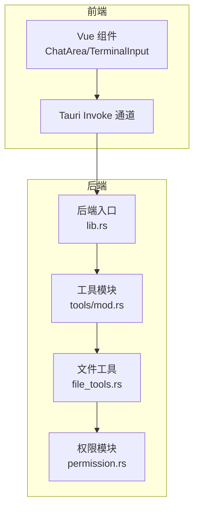
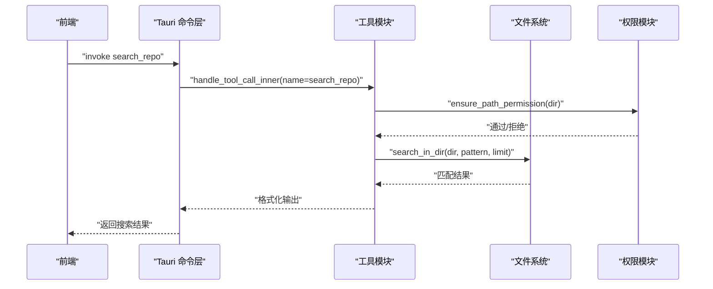
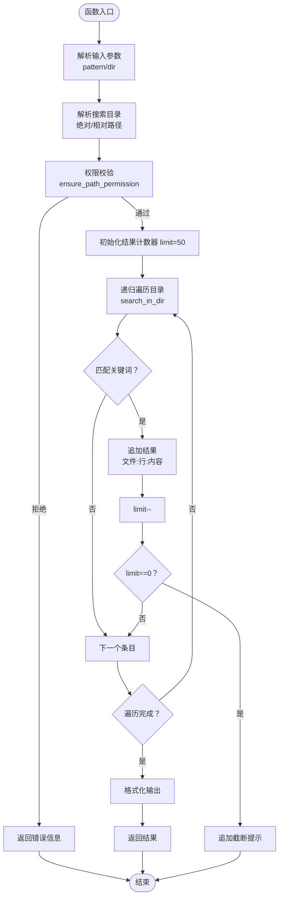
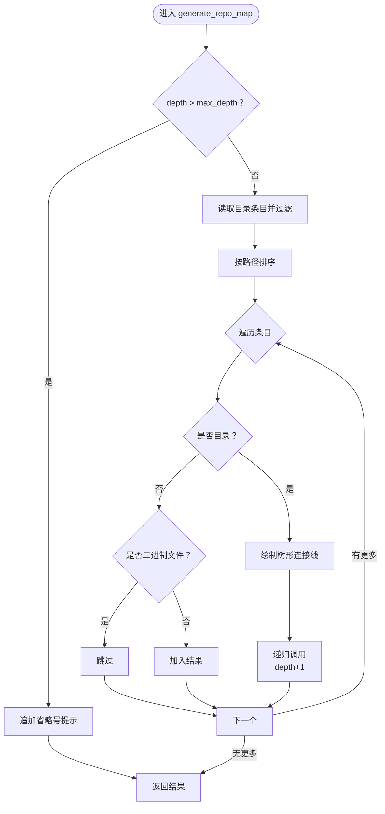
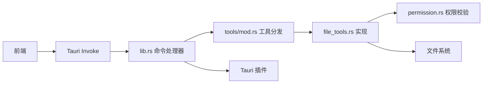

# 文件搜索功能

<cite>
**本文引用的文件**
- [README.md](file://README.md)
- [file_tools.rs](file://src-tauri/src/core/tools/file_tools.rs)
- [mod.rs](file://src-tauri/src/core/tools/mod.rs)
- [permission.rs](file://src-tauri/src/core/tools/permission.rs)
- [Cargo.toml](file://src-tauri/Cargo.toml)
- [lib.rs](file://src-tauri/src/lib.rs)
</cite>

## 目录
1. [简介](#简介)
2. [项目结构](#项目结构)
3. [核心组件](#核心组件)
4. [架构概览](#架构概览)
5. [详细组件分析](#详细组件分析)
6. [依赖关系分析](#依赖关系分析)
7. [性能考虑](#性能考虑)
8. [故障排除指南](#故障排除指南)
9. [结论](#结论)
10. [附录](#附录)

## 简介
本文件面向 JarvisAgent 的文件搜索功能，系统性阐述仓库搜索机制（递归搜索、关键词匹配、结果限制）、目录列表功能（目录遍历、文件类型标识）、以及仓库目录树生成（深度控制、过滤规则、可视化展示）。文档同时覆盖搜索算法实现、性能优化策略、文件类型过滤机制、搜索模式配置、结果格式化输出与截断处理，并提供具体使用示例、搜索效率优化建议与常见搜索场景的最佳实践。

## 项目结构
文件搜索功能主要由 Rust 后端的工具模块提供，前端通过 Tauri 的 invoke 通道调用后端命令。核心文件分布如下：
- 后端工具模块：src-tauri/src/core/tools/file_tools.rs（文件搜索、目录列表、目录树生成）
- 工具路由与注册：src-tauri/src/core/tools/mod.rs（工具分发与路由）
- 权限与沙箱：src-tauri/src/core/tools/permission.rs（路径安全检查、工作区边界校验）
- Tauri 启动与命令注册：src-tauri/src/lib.rs（后端入口与命令暴露）
- 项目说明与工具清单：README.md（工具能力与使用说明）

**图表来源**
- [mod.rs:158-236](file://src-tauri/src/core/tools/mod.rs#L158-L236)
- [file_tools.rs:307-334](file://src-tauri/src/core/tools/file_tools.rs#L307-L334)
- [permission.rs:49-72](file://src-tauri/src/core/tools/permission.rs#L49-L72)
- [lib.rs:102-182](file://src-tauri/src/lib.rs#L102-L182)

**章节来源**
- [README.md:208-234](file://README.md#L208-L234)
- [mod.rs:158-236](file://src-tauri/src/core/tools/mod.rs#L158-L236)
- [file_tools.rs:307-334](file://src-tauri/src/core/tools/file_tools.rs#L307-L334)
- [permission.rs:49-72](file://src-tauri/src/core/tools/permission.rs#L49-L72)
- [lib.rs:102-182](file://src-tauri/src/lib.rs#L102-L182)

## 核心组件
- 仓库搜索（search_repo）：在指定目录下递归搜索包含关键词的文件内容，内置结果数量限制与截断提示。
- 目录列表（list_directory）：列出指定路径下的文件与目录项，标注类型（文件/目录）。
- 目录树生成（generate_repo_map）：以树形结构展示目录层级，支持深度控制与文件类型过滤。
- 权限与沙箱（ensure_path_permission）：确保搜索路径在沙箱工作区内，防止越权访问。
- 工具路由（handle_tool_call）：将前端调用映射到具体工具实现。

**章节来源**
- [file_tools.rs:307-334](file://src-tauri/src/core/tools/file_tools.rs#L307-L334)
- [file_tools.rs:336-365](file://src-tauri/src/core/tools/file_tools.rs#L336-L365)
- [file_tools.rs:367-430](file://src-tauri/src/core/tools/file_tools.rs#L367-L430)
- [permission.rs:49-72](file://src-tauri/src/core/tools/permission.rs#L49-L72)
- [mod.rs:158-236](file://src-tauri/src/core/tools/mod.rs#L158-L236)

## 架构概览
文件搜索功能遵循“前端发起请求 → Tauri 命令分发 → 工具模块处理 → 权限校验 → 文件系统操作 → 结果返回”的流程。工具模块统一注册与分发，权限模块贯穿所有文件操作，确保安全与合规。

**图表来源**
- [mod.rs:158-236](file://src-tauri/src/core/tools/mod.rs#L158-L236)
- [file_tools.rs:307-334](file://src-tauri/src/core/tools/file_tools.rs#L307-L334)
- [permission.rs:49-72](file://src-tauri/src/core/tools/permission.rs#L49-L72)

## 详细组件分析

### 仓库搜索（search_repo）
- 功能概述：在指定目录下递归搜索包含关键词的文件内容，默认限制最多返回 50 条结果，超过限制时进行截断并提示。
- 关键实现要点：
  - 输入参数：pattern（关键词）、dir（搜索目录，默认当前目录）。
  - 路径解析：支持绝对/相对路径，相对路径基于当前工作目录拼接。
  - 权限校验：调用 ensure_path_permission 确保路径安全与沙箱边界。
  - 递归搜索：调用 search_in_dir 实现深度优先遍历与内容匹配。
  - 结果格式：每条匹配以“文件路径:行号:匹配行”的形式输出；空结果时返回友好提示。
- 性能与限制：
  - 通过 limit 参数控制结果数量，避免大量 IO 与内存占用。
  - 对常见构建产物与二进制文件类型进行过滤，减少无效扫描。
- 使用示例（路径参考）：
  - 调用路径：[search_repo:307-334](file://src-tauri/src/core/tools/file_tools.rs#L307-L334)
  - 路由分发：[handle_tool_call_inner:195-202](file://src-tauri/src/core/tools/mod.rs#L195-L202)

**图表来源**
- [file_tools.rs:307-334](file://src-tauri/src/core/tools/file_tools.rs#L307-L334)
- [file_tools.rs:432-490](file://src-tauri/src/core/tools/file_tools.rs#L432-L490)

**章节来源**
- [file_tools.rs:307-334](file://src-tauri/src/core/tools/file_tools.rs#L307-L334)
- [file_tools.rs:432-490](file://src-tauri/src/core/tools/file_tools.rs#L432-L490)

### 目录列表（list_directory）
- 功能概述：列出指定路径下的文件与目录项，标注类型（[FILE]/[DIR]），空目录返回提示信息。
- 关键实现要点：
  - 输入参数：path（默认当前目录）。
  - 权限校验：ensure_path_permission。
  - 遍历与标识：读取目录条目，判断文件/目录类型并格式化输出。
- 使用示例（路径参考）：
  - 调用路径：[list_directory:336-365](file://src-tauri/src/core/tools/file_tools.rs#L336-L365)
  - 路由分发：[handle_tool_call_inner:195-202](file://src-tauri/src/core/tools/mod.rs#L195-L202)

**章节来源**
- [file_tools.rs:336-365](file://src-tauri/src/core/tools/file_tools.rs#L336-L365)

### 目录树生成（generate_repo_map）
- 功能概述：以树形结构展示目录层级，支持最大深度控制，自动过滤常见构建产物与二进制文件类型，美化输出样式。
- 关键实现要点：
  - 输入参数：dir、prefix（缩进前缀）、depth（当前深度）、max_depth（最大深度）。
  - 过滤规则：跳过 node_modules、target、dist、隐藏目录（以 . 开头），以及图片、音视频、字体等二进制文件。
  - 可视化：使用 ├─、└─、│ 等字符绘制树形连接线。
- 使用示例（路径参考）：
  - 调用路径：[generate_repo_map:367-430](file://src-tauri/src/core/tools/file_tools.rs#L367-L430)
  - 路由分发：[handle_tool_call_inner:195-202](file://src-tauri/src/core/tools/mod.rs#L195-L202)

**图表来源**
- [file_tools.rs:367-430](file://src-tauri/src/core/tools/file_tools.rs#L367-L430)

**章节来源**
- [file_tools.rs:367-430](file://src-tauri/src/core/tools/file_tools.rs#L367-L430)

### 权限与沙箱（ensure_path_permission）
- 功能概述：确保路径不包含路径穿越（..），并在沙箱会话中限制访问范围，防止越权访问。
- 关键实现要点：
  - 路径安全检查：is_path_safe 检测路径是否包含 ..。
  - 工作区边界：is_within_workspace 对相对路径进行规范化并判断是否在工作区范围内。
  - 沙箱策略：当 workspace_dir 存在时强制边界检查；非沙箱会话允许更大范围访问。
- 使用示例（路径参考）：
  - 调用路径：[ensure_path_permission:49-72](file://src-tauri/src/core/tools/permission.rs#L49-L72)

**章节来源**
- [permission.rs:49-72](file://src-tauri/src/core/tools/permission.rs#L49-L72)

### 工具路由与注册（handle_tool_call）
- 功能概述：根据工具名将前端调用分发到对应实现，search_repo 通过 handle_tool_call_inner 路由到 file_tools::search_repo。
- 关键实现要点：
  - 工具分发：match 分支匹配工具名，调用相应模块的实现。
  - 返回值：非子代理工具返回字符串结果，子代理工具返回异步任务句柄。
- 使用示例（路径参考）：
  - 路由实现：[handle_tool_call_inner:187-236](file://src-tauri/src/core/tools/mod.rs#L187-L236)

**章节来源**
- [mod.rs:187-236](file://src-tauri/src/core/tools/mod.rs#L187-L236)

## 依赖关系分析
- 模块耦合：
  - tools/mod.rs 作为工具入口，集中注册与分发，降低前端与具体实现的耦合度。
  - file_tools.rs 依赖 permission.rs 进行路径安全与沙箱校验。
  - lib.rs 通过 generate_handler! 注册命令，使前端可通过 invoke 调用后端工具。
- 外部依赖：
  - Tauri 插件：tauri-plugin-fs 提供文件系统操作能力。
  - 异步运行时：Tokio 提供异步执行环境。
  - 序列化：Serde/serde_json 用于 JSON 输入输出处理。

**图表来源**
- [lib.rs:102-182](file://src-tauri/src/lib.rs#L102-L182)
- [mod.rs:158-236](file://src-tauri/src/core/tools/mod.rs#L158-L236)
- [file_tools.rs:307-334](file://src-tauri/src/core/tools/file_tools.rs#L307-L334)
- [permission.rs:49-72](file://src-tauri/src/core/tools/permission.rs#L49-L72)
- [Cargo.toml:20-40](file://src-tauri/Cargo.toml#L20-L40)

**章节来源**
- [lib.rs:102-182](file://src-tauri/src/lib.rs#L102-L182)
- [mod.rs:158-236](file://src-tauri/src/core/tools/mod.rs#L158-L236)
- [file_tools.rs:307-334](file://src-tauri/src/core/tools/file_tools.rs#L307-L334)
- [permission.rs:49-72](file://src-tauri/src/core/tools/permission.rs#L49-L72)
- [Cargo.toml:20-40](file://src-tauri/Cargo.toml#L20-L40)

## 性能考虑
- 递归搜索优化：
  - 结果数量限制：search_repo 默认 limit=50，避免大规模 IO 与内存占用。
  - 文件类型过滤：在 search_in_dir 中跳过常见构建产物与二进制文件，减少无效扫描。
  - 目录树深度控制：generate_repo_map 通过 max_depth 限制遍历深度，避免深层目录带来的性能问题。
- I/O 与内存：
  - 逐行读取文件内容进行匹配，避免一次性加载大文件导致内存峰值过高。
  - 目录树生成阶段对条目进行排序与过滤，减少后续处理成本。
- 建议：
  - 对于大型仓库，优先使用更精确的关键词或限定目录范围。
  - 在需要更广泛搜索时，适当提高 limit，但注意控制结果数量以免影响前端渲染与上下文长度。
  - 结合目录树生成先期定位目标目录，再进行精确搜索。

[本节为通用性能指导，无需特定文件引用]

## 故障排除指南
- 权限错误：
  - 症状：返回“路径不安全”或“沙箱限制”错误。
  - 处理：检查路径是否包含 ..；在沙箱会话中确保路径位于工作区内。
  - 参考：[ensure_path_permission:49-72](file://src-tauri/src/core/tools/permission.rs#L49-L72)
- 文件被占用：
  - 症状：读取/写入失败，提示文件被其他进程占用。
  - 处理：稍后重试或关闭占用文件的程序。
  - 参考：[read_file:57-94](file://src-tauri/src/core/tools/file_tools.rs#L57-L94)、[write_file:192-223](file://src-tauri/src/core/tools/file_tools.rs#L192-L223)
- 搜索结果为空：
  - 症状：未找到包含关键词的内容。
  - 处理：确认关键词大小写、是否在过滤列表中被排除、目录是否正确。
  - 参考：[search_repo:307-334](file://src-tauri/src/core/tools/file_tools.rs#L307-L334)、[search_in_dir:432-490](file://src-tauri/src/core/tools/file_tools.rs#L432-L490)
- 目录树显示异常：
  - 症状：某些目录未显示或显示不完整。
  - 处理：检查 max_depth 设置、过滤规则是否过于严格。
  - 参考：[generate_repo_map:367-430](file://src-tauri/src/core/tools/file_tools.rs#L367-L430)

**章节来源**
- [permission.rs:49-72](file://src-tauri/src/core/tools/permission.rs#L49-L72)
- [file_tools.rs:57-94](file://src-tauri/src/core/tools/file_tools.rs#L57-L94)
- [file_tools.rs:192-223](file://src-tauri/src/core/tools/file_tools.rs#L192-L223)
- [file_tools.rs:307-334](file://src-tauri/src/core/tools/file_tools.rs#L307-L334)
- [file_tools.rs:432-490](file://src-tauri/src/core/tools/file_tools.rs#L432-L490)
- [file_tools.rs:367-430](file://src-tauri/src/core/tools/file_tools.rs#L367-L430)

## 结论
JarvisAgent 的文件搜索功能以安全（权限与沙箱）、高效（结果限制与过滤）、易用（树形展示与格式化输出）为核心设计原则。通过工具模块化与统一路由，结合严格的路径安全检查，实现了稳定可靠的仓库搜索体验。在实际使用中，建议结合目录树生成与精确关键词，合理设置搜索范围与结果数量，以获得最佳性能与用户体验。

[本节为总结性内容，无需特定文件引用]

## 附录

### 使用示例（路径参考）
- 仓库搜索：[search_repo:307-334](file://src-tauri/src/core/tools/file_tools.rs#L307-L334)
- 目录列表：[list_directory:336-365](file://src-tauri/src/core/tools/file_tools.rs#L336-L365)
- 目录树生成：[generate_repo_map:367-430](file://src-tauri/src/core/tools/file_tools.rs#L367-L430)
- 工具路由：[handle_tool_call_inner:187-236](file://src-tauri/src/core/tools/mod.rs#L187-L236)

### 搜索模式配置与结果格式
- 搜索模式：
  - 关键词匹配：search_in_dir 对文件内容逐行匹配，支持大小写敏感。
  - 目录范围：search_repo 支持绝对/相对路径，相对路径基于当前工作目录。
  - 结果限制：默认 limit=50，超过时追加截断提示。
- 结果格式：
  - 匹配行格式：“文件路径:行号:匹配行”，便于快速定位。
  - 目录树格式：树形连接线与层级缩进，直观展示目录结构。
  - 目录列表格式：类型标识 + 名称，便于浏览。

**章节来源**
- [file_tools.rs:307-334](file://src-tauri/src/core/tools/file_tools.rs#L307-L334)
- [file_tools.rs:336-365](file://src-tauri/src/core/tools/file_tools.rs#L336-L365)
- [file_tools.rs:367-430](file://src-tauri/src/core/tools/file_tools.rs#L367-L430)
- [file_tools.rs:432-490](file://src-tauri/src/core/tools/file_tools.rs#L432-L490)