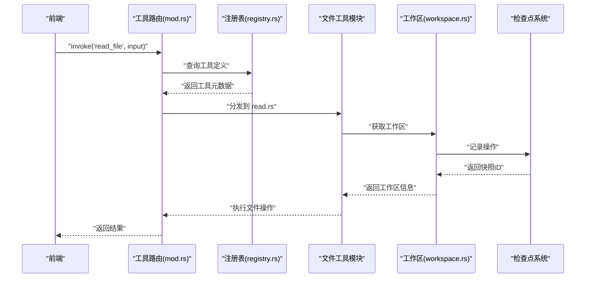
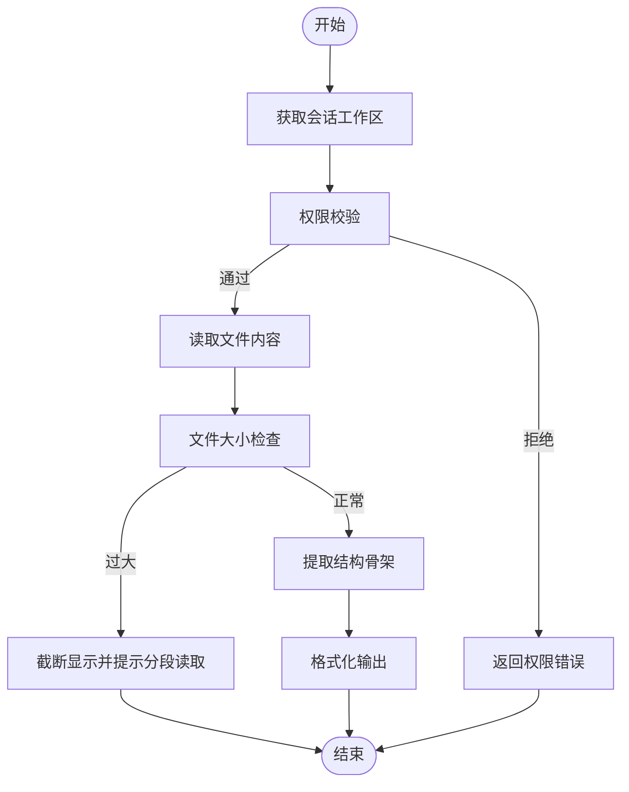
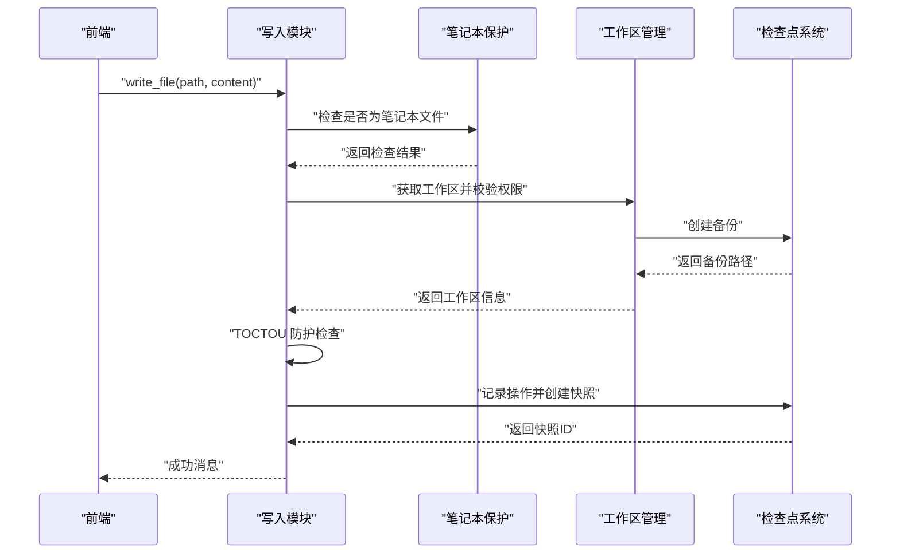
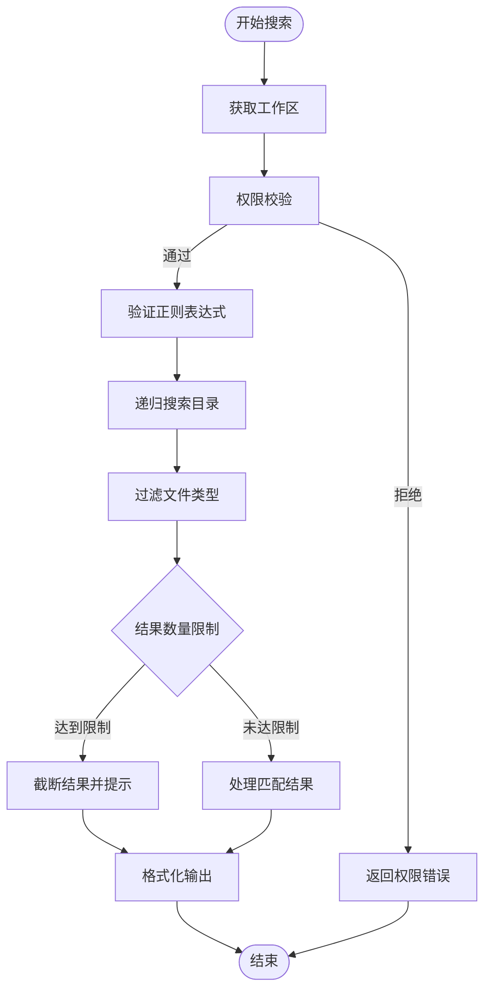
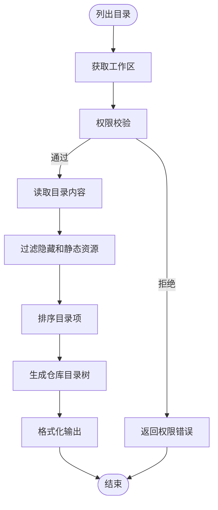
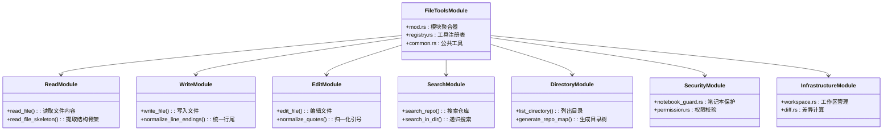
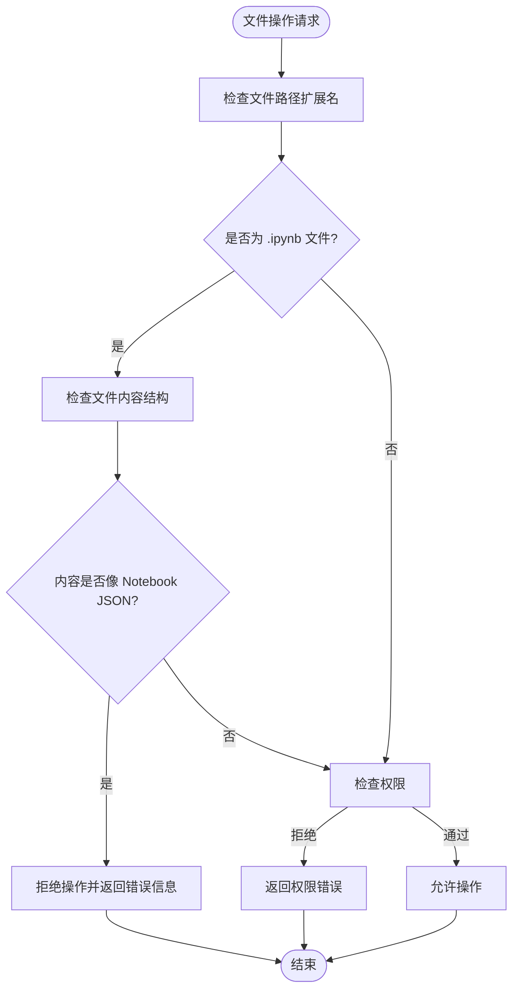

# 文件管理系统

<cite>
**本文档引用的文件**
- [mod.rs](file://src-tauri/src/core/tools/file_tools/mod.rs)
- [registry.rs](file://src-tauri/src/core/tools/file_tools/registry.rs)
- [notebook_guard.rs](file://src-tauri/src/core/tools/file_tools/notebook_guard.rs)
- [read.rs](file://src-tauri/src/core/tools/file_tools/read.rs)
- [write.rs](file://src-tauri/src/core/tools/file_tools/write.rs)
- [edit.rs](file://src-tauri/src/core/tools/file_tools/edit.rs)
- [search.rs](file://src-tauri/src/core/tools/file_tools/search.rs)
- [directory.rs](file://src-tauri/src/core/tools/file_tools/directory.rs)
- [common.rs](file://src-tauri/src/core/tools/file_tools/common.rs)
- [workspace.rs](file://src-tauri/src/core/tools/file_tools/workspace.rs)
- [diff.rs](file://src-tauri/src/core/tools/file_tools/diff.rs)
- [mod.rs](file://src-tauri/src/core/tools/mod.rs)
- [permission.rs](file://src-tauri/src/core/tools/permission.rs)
- [sandbox.rs](file://src-tauri/src/core/snapshot_engine/multi_agent/sandbox.rs)
- [checkpoint.rs](file://src-tauri/src/core/checkpoint.rs)
- [lib.rs](file://src-tauri/src/lib.rs)
- [useJarvis.ts](file://src/composables/useJarvis.ts)
- [PermissionModal.vue](file://src/components/common/PermissionModal.vue)
- [index.ts](file://src/types/index.ts)
</cite>

## 更新摘要
**所做更改**
- 重构文件工具模块为完全模块化架构，从单一 monolithic 实现转变为清晰的子模块设计
- 新增文件工具注册表系统，提供标准化的工具定义和元数据管理
- 引入笔记本保护机制，防止对 Jupyter Notebook 文件的直接文本编辑
- 增强骨架提取功能，支持更多编程语言的结构识别
- 完善模块间依赖关系和职责分离，提高代码可维护性和扩展性

## 目录
1. [简介](#简介)
2. [项目结构](#项目结构)
3. [核心组件](#核心组件)
4. [架构总览](#架构总览)
5. [详细组件分析](#详细组件分析)
6. [模块化设计详解](#模块化设计详解)
7. [笔记本保护机制](#笔记本保护机制)
8. [依赖关系分析](#依赖关系分析)
9. [性能考虑](#性能考虑)
10. [故障排除指南](#故障排除指南)
11. [结论](#结论)
12. [附录](#附录)

## 简介
本文件管理系统为 JarvisAgent 的核心能力之一，现已重构为完全模块化的架构设计。系统提供安全可控的文件读写、搜索与编辑能力，并与会话沙箱、检查点与快照机制深度集成，确保操作可追踪、可回滚、可审计。新的模块化设计引入了文件工具注册表、笔记本保护机制等新特性，进一步增强了系统的安全性、可维护性和扩展性。

## 项目结构
文件管理相关代码已重构为模块化架构，主要分布在以下结构中：

```mermaid
graph TB
subgraph "模块化文件工具架构"
FT["file_tools/mod.rs<br/>模块聚合器"]
REG["registry.rs<br/>工具注册表"]
NBG["notebook_guard.rs<br/>笔记本保护机制"]
READ["read.rs<br/>文件读取与骨架提取"]
WRITE["write.rs<br/>文件写入"]
EDIT["edit.rs<br/>文件编辑"]
SEARCH["search.rs<br/>仓库搜索"]
DIR["directory.rs<br/>目录操作"]
COMMON["common.rs<br/>公共工具"]
WORKSPACE["workspace.rs<br/>工作区管理"]
DIFF["diff.rs<br/>差异计算"]
END
subgraph "工具系统核心"
TOOLS["tools/mod.rs<br/>工具路由与分发"]
PERM["permission.rs<br/>权限校验"]
SANDBOX["sandbox.rs<br/>沙箱机制"]
CHECKPOINT["checkpoint.rs<br/>检查点管理"]
LIB["lib.rs<br/>应用入口"]
END
subgraph "前端交互"
USEJ["useJarvis.ts<br/>全局状态"]
PMDLG["PermissionModal.vue<br/>权限确认"]
TYPES["index.ts<br/>类型定义"]
END
```

**图表来源**
- [mod.rs:1-33](file://src-tauri/src/core/tools/file_tools/mod.rs#L1-L33)
- [registry.rs:1-147](file://src-tauri/src/core/tools/file_tools/registry.rs#L1-L147)
- [notebook_guard.rs:1-65](file://src-tauri/src/core/tools/file_tools/notebook_guard.rs#L1-L65)
- [read.rs:1-154](file://src-tauri/src/core/tools/file_tools/read.rs#L1-L154)
- [write.rs:1-134](file://src-tauri/src/core/tools/file_tools/write.rs#L1-L134)
- [edit.rs:1-193](file://src-tauri/src/core/tools/file_tools/edit.rs#L1-L193)
- [search.rs:1-140](file://src-tauri/src/core/tools/file_tools/search.rs#L1-L140)
- [directory.rs:1-106](file://src-tauri/src/core/tools/file_tools/directory.rs#L1-L106)
- [common.rs:1-74](file://src-tauri/src/core/tools/file_tools/common.rs#L1-L74)
- [workspace.rs:1-70](file://src-tauri/src/core/tools/file_tools/workspace.rs#L1-L70)
- [diff.rs:1-52](file://src-tauri/src/core/tools/file_tools/diff.rs#L1-L52)

**章节来源**
- [mod.rs:1-33](file://src-tauri/src/core/tools/file_tools/mod.rs#L1-L33)
- [registry.rs:1-147](file://src-tauri/src/core/tools/file_tools/registry.rs#L1-L147)
- [notebook_guard.rs:1-65](file://src-tauri/src/core/tools/file_tools/notebook_guard.rs#L1-L65)
- [read.rs:1-154](file://src-tauri/src/core/tools/file_tools/read.rs#L1-L154)
- [write.rs:1-134](file://src-tauri/src/core/tools/file_tools/write.rs#L1-L134)
- [edit.rs:1-193](file://src-tauri/src/core/tools/file_tools/edit.rs#L1-L193)
- [search.rs:1-140](file://src-tauri/src/core/tools/file_tools/search.rs#L1-L140)
- [directory.rs:1-106](file://src-tauri/src/core/tools/file_tools/directory.rs#L1-L106)
- [common.rs:1-74](file://src-tauri/src/core/tools/file_tools/common.rs#L1-L74)
- [workspace.rs:1-70](file://src-tauri/src/core/tools/file_tools/workspace.rs#L1-L70)
- [diff.rs:1-52](file://src-tauri/src/core/tools/file_tools/diff.rs#L1-L52)

## 核心组件
- **模块化文件工具系统**：完全重构的子模块架构，包括读取、写入、编辑、搜索、目录操作等专门模块
- **文件工具注册表**：标准化的工具定义、元数据管理和路由机制
- **笔记本保护机制**：智能识别和阻止对 Jupyter Notebook 文件的直接文本编辑
- **增强骨架提取**：支持更多编程语言的结构识别和代码导航
- **工作区管理**：统一的会话工作区查询和快照记录接口
- **公共工具库**：文件大小限制、文本归一化、路径过滤等共享功能

**章节来源**
- [mod.rs:16-33](file://src-tauri/src/core/tools/file_tools/mod.rs#L16-L33)
- [registry.rs:17-146](file://src-tauri/src/core/tools/file_tools/registry.rs#L17-L146)
- [notebook_guard.rs:15-43](file://src-tauri/src/core/tools/file_tools/notebook_guard.rs#L15-L43)
- [common.rs:15-74](file://src-tauri/src/core/tools/file_tools/common.rs#L15-L74)

## 架构总览
新的模块化架构提供了更清晰的职责分离和更强的扩展性：



**图表来源**
- [mod.rs:275-326](file://src-tauri/src/core/tools/mod.rs#L275-L326)
- [registry.rs:17-146](file://src-tauri/src/core/tools/file_tools/registry.rs#L17-L146)
- [workspace.rs:20-70](file://src-tauri/src/core/tools/file_tools/workspace.rs#L20-L70)

**章节来源**
- [mod.rs:188-326](file://src-tauri/src/core/tools/mod.rs#L188-L326)

## 详细组件分析

### 文件读取与骨架提取增强
新的模块化设计提供了更强大的文件读取和骨架提取功能：



**图表来源**
- [read.rs:18-98](file://src-tauri/src/core/tools/file_tools/read.rs#L18-L98)
- [read.rs:101-153](file://src-tauri/src/core/tools/file_tools/read.rs#L101-L153)
- [common.rs:15-19](file://src-tauri/src/core/tools/file_tools/common.rs#L15-L19)

**章节来源**
- [read.rs:17-154](file://src-tauri/src/core/tools/file_tools/read.rs#L17-L154)

### 文件写入与编辑安全增强
模块化设计引入了更严格的安全检查和防护机制：



**图表来源**
- [write.rs:26-133](file://src-tauri/src/core/tools/file_tools/write.rs#L26-L133)
- [notebook_guard.rs:15-43](file://src-tauri/src/core/tools/file_tools/notebook_guard.rs#L15-L43)
- [workspace.rs:33-70](file://src-tauri/src/core/tools/file_tools/workspace.rs#L33-L70)

**章节来源**
- [write.rs:25-134](file://src-tauri/src/core/tools/file_tools/write.rs#L25-L134)

### 仓库搜索与目录遍历优化
搜索功能现在具有更好的性能和用户体验：



**图表来源**
- [search.rs:21-68](file://src-tauri/src/core/tools/file_tools/search.rs#L21-L68)
- [search.rs:71-140](file://src-tauri/src/core/tools/file_tools/search.rs#L71-L140)

**章节来源**
- [search.rs:20-140](file://src-tauri/src/core/tools/file_tools/search.rs#L20-L140)

### 目录操作与仓库映射
目录操作现在更加智能和高效：



**图表来源**
- [directory.rs:20-50](file://src-tauri/src/core/tools/file_tools/directory.rs#L20-L50)
- [directory.rs:53-105](file://src-tauri/src/core/tools/file_tools/directory.rs#L53-L105)

**章节来源**
- [directory.rs:19-106](file://src-tauri/src/core/tools/file_tools/directory.rs#L19-L106)

## 模块化设计详解

### 模块职责分离
新的模块化架构实现了清晰的职责分离：



**图表来源**
- [mod.rs:16-33](file://src-tauri/src/core/tools/file_tools/mod.rs#L16-L33)
- [registry.rs:17-146](file://src-tauri/src/core/tools/file_tools/registry.rs#L17-L146)
- [common.rs:21-74](file://src-tauri/src/core/tools/file_tools/common.rs#L21-L74)

### 工具注册表系统
标准化的工具定义和元数据管理：

| 工具名称 | 描述 | 只读属性 | 并发安全 | 启用状态 |
|---------|------|----------|----------|----------|
| read_file | 读取文件内容，支持按行号精确读取 | ✓ | ✓ | ✓ |
| read_file_skeleton | 提取文件结构骨架（类、函数签名及行号） | ✓ | ✓ | ✓ |
| write_file | 写入普通文本文件内容 | ✗ | ✗ | ✓ |
| edit_file | 基于搜索与替换修改普通文本 | ✗ | ✗ | ✓ |
| search_repo | 在指定目录下全局搜索包含关键词的文本 | ✓ | ✓ | ✓ |
| list_directory | 列出指定目录下的所有文件和文件夹 | ✓ | ✓ | ✓ |

**章节来源**
- [registry.rs:17-146](file://src-tauri/src/core/tools/file_tools/registry.rs#L17-L146)

## 笔记本保护机制
新引入的笔记本保护机制确保 Jupyter Notebook 文件的安全：



**图表来源**
- [notebook_guard.rs:15-43](file://src-tauri/src/core/tools/file_tools/notebook_guard.rs#L15-L43)

**章节来源**
- [notebook_guard.rs:1-65](file://src-tauri/src/core/tools/file_tools/notebook_guard.rs#L1-65)

## 依赖关系分析
模块化架构显著改善了依赖关系和耦合度：

```mermaid
graph LR
subgraph "文件工具模块"
MOD["file_tools/mod.rs"] --> READ["read.rs"]
MOD --> WRITE["write.rs"]
MOD --> EDIT["edit.rs"]
MOD --> SEARCH["search.rs"]
MOD --> DIR["directory.rs"]
MOD --> REG["registry.rs"]
MOD --> NBG["notebook_guard.rs"]
MOD --> COMMON["common.rs"]
MOD --> WS["workspace.rs"]
MOD --> DIFF["diff.rs"]
END
subgraph "工具系统核心"
TOOLS["tools/mod.rs"] --> MOD
TOOLS --> PERM["permission.rs"]
TOOLS --> CHECKPOINT["checkpoint.rs"]
TOOLS --> SANDBOX["sandbox.rs"]
END
subgraph "前端交互"
USEJ["useJarvis.ts"] --> LIB["lib.rs"]
LIB --> TOOLS
USEJ --> PMDLG["PermissionModal.vue"]
USEJ --> TYPES["index.ts"]
END
```

**图表来源**
- [mod.rs:1-33](file://src-tauri/src/core/tools/file_tools/mod.rs#L1-L33)
- [mod.rs:275-326](file://src-tauri/src/core/tools/mod.rs#L275-L326)

**章节来源**
- [mod.rs:20-32](file://src-tauri/src/core/tools/mod.rs#L20-L32)

## 性能考虑
模块化设计带来了多项性能优化：

- **模块化加载**：按需加载文件工具模块，减少启动时间和内存占用
- **增强的文件大小限制**：256KB 单次读取限制，避免大文件操作影响性能
- **智能搜索限制**：默认 50 个搜索结果限制，防止大量输出影响性能
- **目录树深度控制**：递归深度限制减少深层嵌套带来的遍历成本
- **TOCTOU 防护优化**：文件修改时间检查避免竞态条件，提高操作安全性
- **差异计算缓存**：使用 `similar` 库进行高效的文本差异计算

## 故障排除指南
模块化架构提供了更好的错误诊断和处理：

- **模块加载失败**：检查 `file_tools/mod.rs` 中的模块导入和导出配置
- **工具注册错误**：验证 `registry.rs` 中的工具定义和元数据完整性
- **笔记本保护误报**：确认文件扩展名和内容结构是否符合 Notebook 格式
- **权限检查失败**：检查工作区边界和沙箱环境配置
- **文件操作锁定**：等待文件解锁或检查是否有其他进程占用

**章节来源**
- [common.rs:68-74](file://src-tauri/src/core/tools/file_tools/common.rs#L68-L74)
- [notebook_guard.rs:36-43](file://src-tauri/src/core/tools/file_tools/notebook_guard.rs#L36-L43)

## 结论
文件管理系统经过完全重构，现已发展为一个高度模块化、安全可靠且易于扩展的现代化架构。新的设计不仅保持了原有的安全特性和功能完整性，还通过引入工具注册表、笔记本保护机制等创新特性，显著提升了系统的可用性、可维护性和安全性。模块化架构为未来的功能扩展和性能优化奠定了坚实基础。

## 附录

### API 接口规范（模块化工具定义）
- **读取文件**：支持行号范围读取和超大文件截断
- **读取骨架**：提取 import、类型、函数等结构签名
- **写入文件**：自动备份与快照，支持 TOCTOU 防护
- **编辑文件**：基于唯一匹配的搜索替换，支持引号归一化
- **搜索仓库**：递归搜索关键词，支持正则表达式
- **目录操作**：列出目录内容和生成仓库目录树
- **笔记本保护**：智能识别和阻止 Notebook 文件编辑

**章节来源**
- [registry.rs:17-146](file://src-tauri/src/core/tools/file_tools/registry.rs#L17-L146)

### 使用示例（模块化架构）
- **读取文件片段**：[read_file:18-98](file://src-tauri/src/core/tools/file_tools/read.rs#L18-L98)
- **写入文件并创建快照**：[write_file:26-133](file://src-tauri/src/core/tools/file_tools/write.rs#L26-L133)
- **编辑文件并记录差异**：[edit_file:26-193](file://src-tauri/src/core/tools/file_tools/edit.rs#L26-L193)
- **搜索关键词**：[search_repo:21-68](file://src-tauri/src/core/tools/file_tools/search.rs#L21-L68)
- **生成目录树**：[generate_repo_map:53-105](file://src-tauri/src/core/tools/file_tools/directory.rs#L53-L105)
- **笔记本保护**：[notebook_guard:15-43](file://src-tauri/src/core/tools/file_tools/notebook_guard.rs#L15-L43)

### 安全注意事项
- **模块化安全**：每个模块都有明确的职责边界和安全检查
- **工具注册表**：标准化的工具定义和元数据管理，防止恶意工具注入
- **笔记本保护**：智能识别 Notebook 文件，防止结构损坏
- **权限分离**：工作区管理和权限校验分离，提高安全性
- **TOCTOU 防护**：文件修改时间检查，防止竞态条件攻击

**章节来源**
- [registry.rs:17-146](file://src-tauri/src/core/tools/file_tools/registry.rs#L17-L146)
- [notebook_guard.rs:15-43](file://src-tauri/src/core/tools/file_tools/notebook_guard.rs#L15-L43)

### 最佳实践
- **模块化开发**：遵循现有模块结构进行功能扩展
- **工具注册**：使用注册表系统标准化工具定义
- **安全优先**：始终启用笔记本保护和权限检查
- **性能优化**：合理设置文件大小和搜索结果限制
- **错误处理**：利用模块化的错误处理机制进行故障诊断