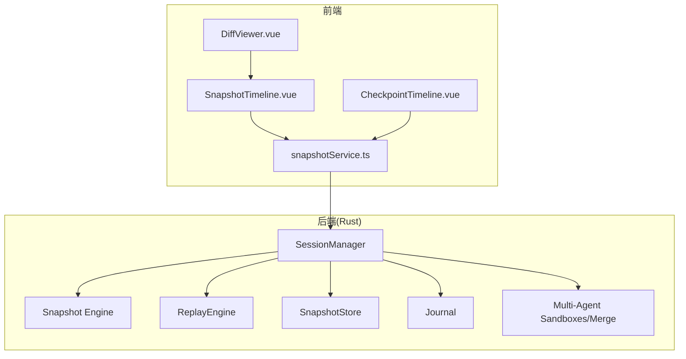
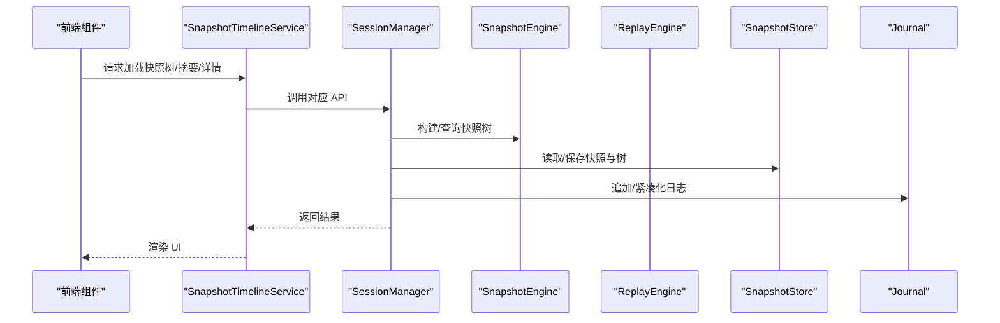
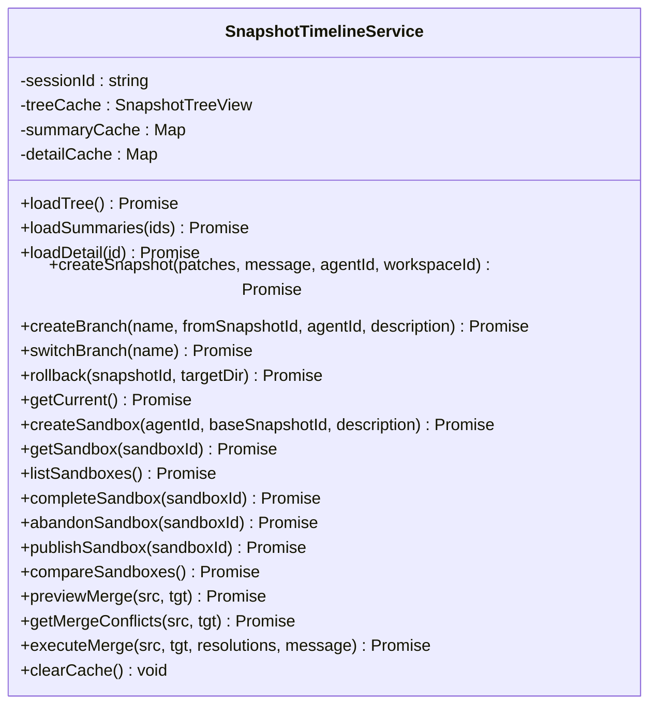
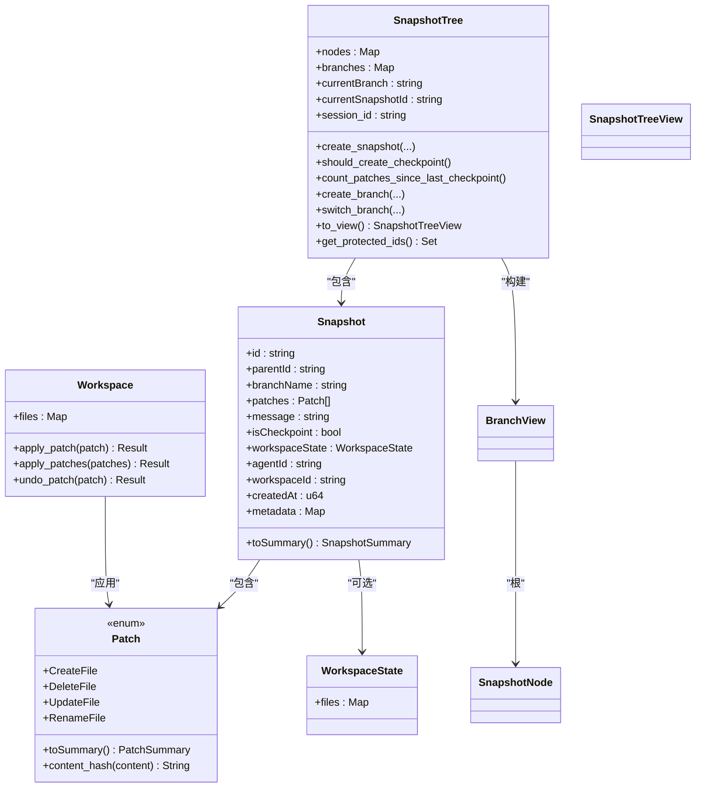
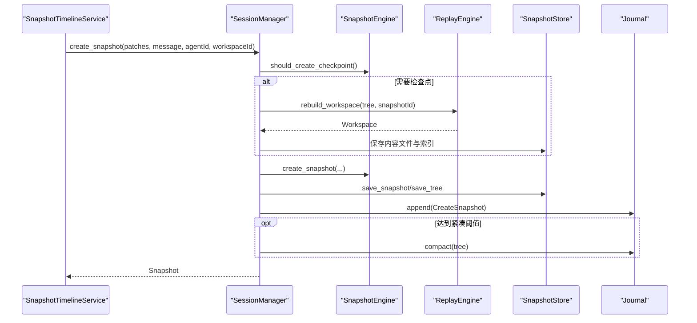
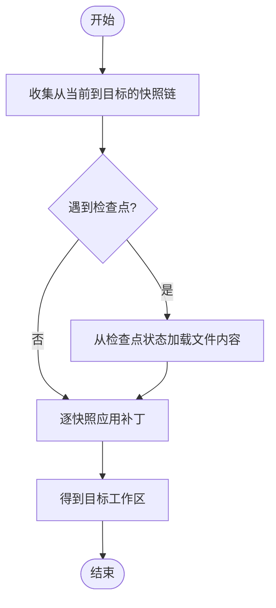
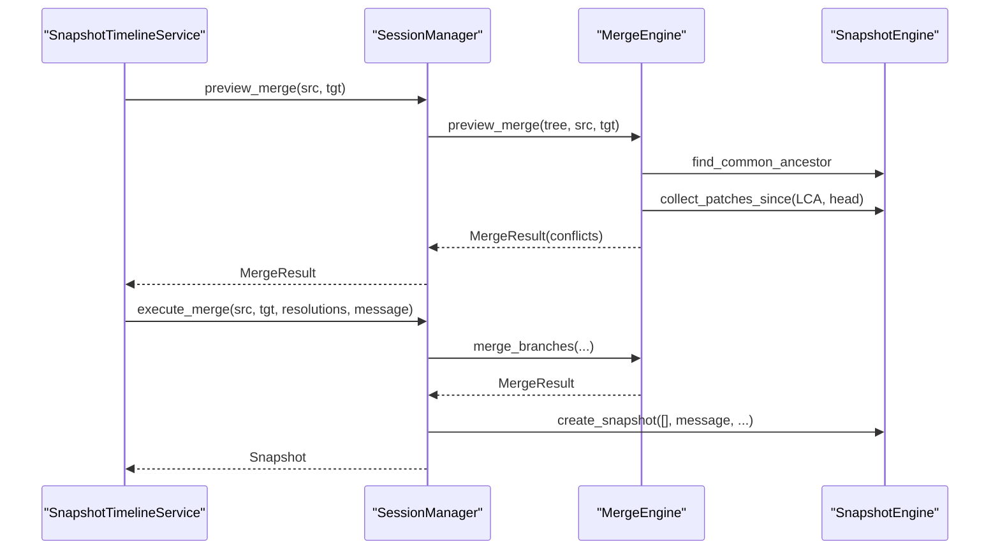
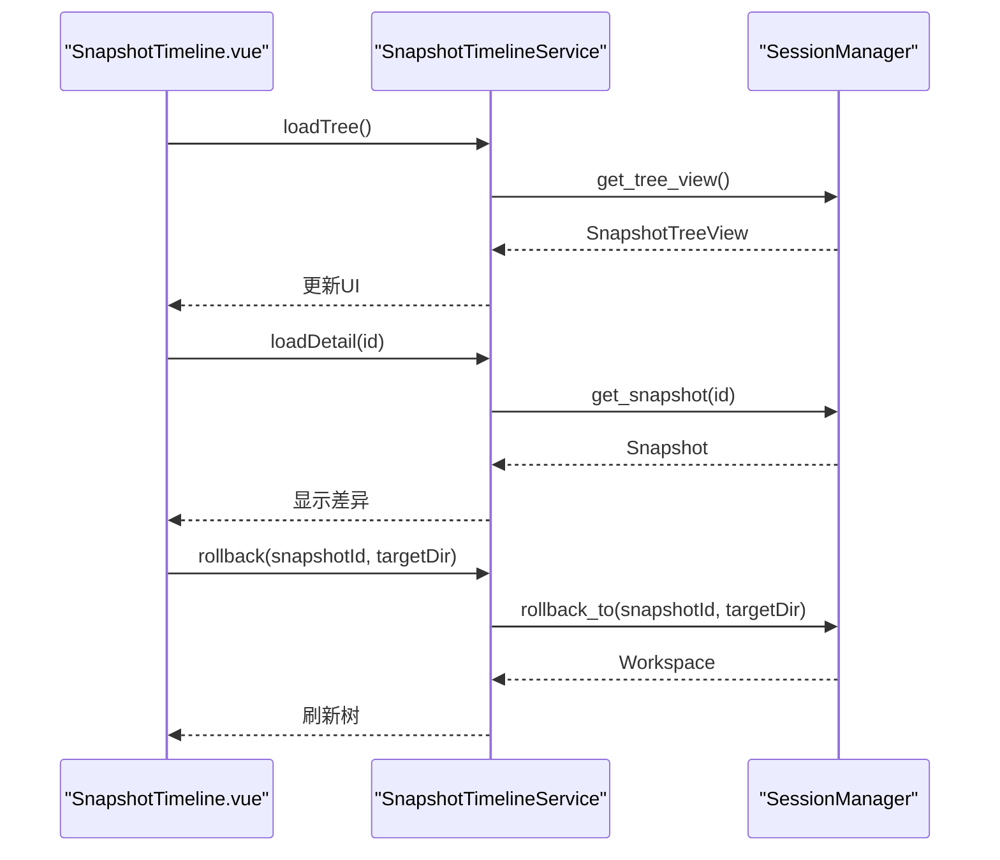
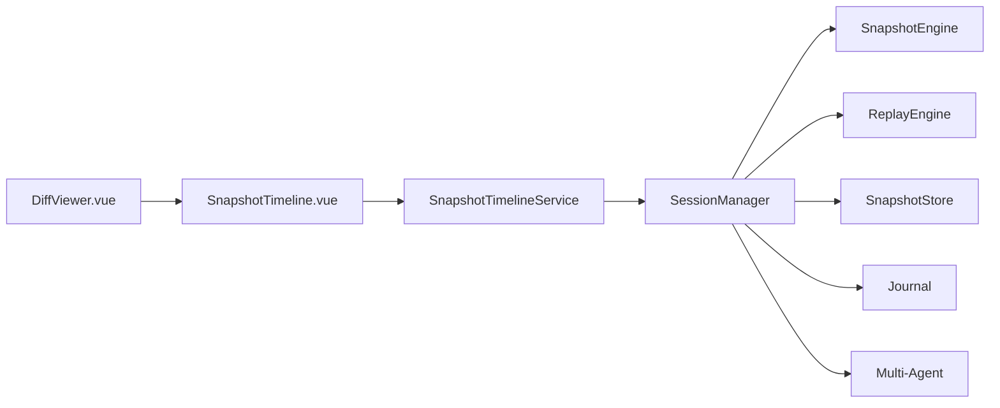

# 文件系统集成

<cite>
**本文引用的文件**
- [src/services/snapshotService.ts](file://src/services/snapshotService.ts)
- [src-tauri/src/core/snapshot_engine/mod.rs](file://src-tauri/src/core/snapshot_engine/mod.rs)
- [src-tauri/src/core/snapshot_engine/snapshot.rs](file://src-tauri/src/core/snapshot_engine/snapshot.rs)
- [src-tauri/src/core/snapshot_engine/patch.rs](file://src-tauri/src/core/snapshot_engine/patch.rs)
- [src-tauri/src/core/snapshot_engine/journal.rs](file://src-tauri/src/core/snapshot_engine/journal.rs)
- [src-tauri/src/core/snapshot_engine/multi_agent/mod.rs](file://src-tauri/src/core/snapshot_engine/multi_agent/mod.rs)
- [src-tauri/src/core/snapshot_engine/multi_agent/merge.rs](file://src-tauri/src/core/snapshot_engine/multi_agent/merge.rs)
- [src-tauri/src/core/snapshot_engine/multi_agent/sandbox.rs](file://src-tauri/src/core/snapshot_engine/multi_agent/sandbox.rs)
- [src-tauri/src/core/snapshot_manager/store.rs](file://src-tauri/src/core/snapshot_manager/store.rs)
- [src-tauri/src/core/snapshot_manager/session_manager.rs](file://src-tauri/src/core/snapshot_manager/session_manager.rs)
- [src-tauri/src/core/snapshot_engine/replay.rs](file://src-tauri/src/core/snapshot_engine/replay.rs)
- [src/components/snapshot/SnapshotTimeline.vue](file://src/components/snapshot/SnapshotTimeline.vue)
- [src/components/snapshot/DiffViewer.vue](file://src/components/snapshot/DiffViewer.vue)
- [src/components/checkpoint/CheckpointTimeline.vue](file://src/components/checkpoint/CheckpointTimeline.vue)
- [src/types/index.ts](file://src/types/index.ts)
</cite>

## 目录
1. [简介](#简介)
2. [项目结构](#项目结构)
3. [核心组件](#核心组件)
4. [架构总览](#架构总览)
5. [详细组件分析](#详细组件分析)
6. [依赖关系分析](#依赖关系分析)
7. [性能考量](#性能考量)
8. [故障排除指南](#故障排除指南)
9. [结论](#结论)
10. [附录](#附录)

## 简介
本文件系统集成功能围绕“快照与检查点”体系展开，提供文件操作的生命周期管理、自动备份与快照创建、差异记录与回滚能力，并支持多 Agent 沙箱与分支合并。系统通过 Rust 后端的快照引擎与前端 Vue 组件协同，实现从文件变更捕获、补丁应用、内容持久化、差异展示到回滚与合并的完整闭环。

## 项目结构
- 前端
  - 快照时间线组件：负责展示快照树、分支切换、回滚、详情查看与差异可视化。
  - 检查点时间线组件：面向旧版检查点体系，提供检查点列表、分支切换与回滚。
  - 服务层：封装 Tauri 调用，统一快照树、摘要、详情、分支、合并等 API。
- 后端（Rust）
  - 快照引擎：定义补丁、快照、分支、树结构与视图；提供补丁应用、树构建、检查点判定与序列化。
  - 会话管理器：协调快照树、日志、内容存储、回放引擎、沙箱与合并引擎。
  - 存储层：以 JSON 文件形式持久化快照与树。
  - 日志：基于 JSON 行式日志，支持紧凑化压缩。
  - 回放引擎：重建工作区、原子回滚、撤销/重做补丁收集。
  - 多 Agent 沙箱与合并：沙箱生命周期管理、跨 Agent 内容比较与自动/手动冲突解析。

图表来源
- [src/components/snapshot/SnapshotTimeline.vue](file://src/components/snapshot/SnapshotTimeline.vue)
- [src/components/snapshot/DiffViewer.vue](file://src/components/snapshot/DiffViewer.vue)
- [src/components/checkpoint/CheckpointTimeline.vue](file://src/components/checkpoint/CheckpointTimeline.vue)
- [src/services/snapshotService.ts](file://src/services/snapshotService.ts)
- [src-tauri/src/core/snapshot_manager/session_manager.rs](file://src-tauri/src/core/snapshot_manager/session_manager.rs)
- [src-tauri/src/core/snapshot_engine/mod.rs](file://src-tauri/src/core/snapshot_engine/mod.rs)
- [src-tauri/src/core/snapshot_engine/replay.rs](file://src-tauri/src/core/snapshot_engine/replay.rs)
- [src-tauri/src/core/snapshot_manager/store.rs](file://src-tauri/src/core/snapshot_manager/store.rs)
- [src-tauri/src/core/snapshot_engine/journal.rs](file://src-tauri/src/core/snapshot_engine/journal.rs)
- [src-tauri/src/core/snapshot_engine/multi_agent/mod.rs](file://src-tauri/src/core/snapshot_engine/multi_agent/mod.rs)

章节来源
- [src/services/snapshotService.ts:14-248](file://src/services/snapshotService.ts#L14-L248)
- [src-tauri/src/core/snapshot_manager/session_manager.rs:18-409](file://src-tauri/src/core/snapshot_manager/session_manager.rs#L18-L409)

## 核心组件
- 快照服务（前端）：封装 Tauri 调用，提供树加载、摘要批量加载、详情加载、创建快照/分支、切换分支、回滚、沙箱与合并相关接口，并内置缓存与事件监听。
- 快照引擎（后端）：定义补丁、快照、分支、树与视图数据结构；提供补丁应用/撤销、树构建、检查点判定、序列化与反序列化。
- 会话管理器（后端）：协调快照树、日志、内容存储、回放引擎、沙箱与合并引擎；负责自动检查点创建、内容持久化、回滚执行与合并流程。
- 存储层（后端）：以 JSON 文件持久化快照与树；提供读取、写入、删除与枚举。
- 日志（后端）：基于 JSON 行式日志，支持紧凑化压缩，保障可重放性。
- 回放引擎（后端）：重建工作区、原子回滚、撤销/重做补丁收集与 LCA 计算。
- 多 Agent 沙箱与合并（后端）：沙箱生命周期管理、跨 Agent 比较、冲突检测与自动/手动解析。

章节来源
- [src/services/snapshotService.ts:14-248](file://src/services/snapshotService.ts#L14-L248)
- [src-tauri/src/core/snapshot_engine/snapshot.rs:6-425](file://src-tauri/src/core/snapshot_engine/snapshot.rs#L6-L425)
- [src-tauri/src/core/snapshot_manager/session_manager.rs:18-409](file://src-tauri/src/core/snapshot_manager/session_manager.rs#L18-L409)
- [src-tauri/src/core/snapshot_manager/store.rs:13-104](file://src-tauri/src/core/snapshot_manager/store.rs#L13-L104)
- [src-tauri/src/core/snapshot_engine/journal.rs:47-157](file://src-tauri/src/core/snapshot_engine/journal.rs#L47-L157)
- [src-tauri/src/core/snapshot_engine/replay.rs:23-344](file://src-tauri/src/core/snapshot_engine/replay.rs#L23-L344)
- [src-tauri/src/core/snapshot_engine/multi_agent/sandbox.rs:60-248](file://src-tauri/src/core/snapshot_engine/multi_agent/sandbox.rs#L60-L248)
- [src-tauri/src/core/snapshot_engine/multi_agent/merge.rs:60-392](file://src-tauri/src/core/snapshot_engine/multi_agent/merge.rs#L60-L392)

## 架构总览
系统采用前后端分层设计：
- 前端通过 snapshotService.ts 统一调用后端 API，负责 UI 展示与用户交互。
- 后端以 SessionManager 为核心协调者，结合快照引擎、回放引擎、存储与日志，完成快照创建、检查点生成、差异记录、回滚与合并。
- 多 Agent 场景下，沙箱与合并模块提供跨 Agent 的隔离与协作能力。

图表来源
- [src/services/snapshotService.ts:24-127](file://src/services/snapshotService.ts#L24-L127)
- [src-tauri/src/core/snapshot_manager/session_manager.rs:138-148](file://src-tauri/src/core/snapshot_manager/session_manager.rs#L138-L148)
- [src-tauri/src/core/snapshot_manager/store.rs:55-76](file://src-tauri/src/core/snapshot_manager/store.rs#L55-L76)
- [src-tauri/src/core/snapshot_engine/journal.rs:76-100](file://src-tauri/src/core/snapshot_engine/journal.rs#L76-L100)

## 详细组件分析

### 快照服务（前端）
- 功能要点
  - 缓存：树视图、摘要与详情分别缓存，避免重复请求。
  - 异步调用：通过 Tauri invoke 调用后端 API，返回 Promise。
  - 事件监听：监听“snapshot-created”事件，自动刷新 UI。
  - 多 Agent 沙箱与合并：提供沙箱创建/完成/发布/比较与合并预览/冲突/执行。
- 生命周期
  - 初始化：根据 sessionId 构造服务实例并加载树。
  - 数据加载：按需批量加载摘要与详情。
  - 操作：创建快照、分支、切换分支、回滚、沙箱与合并。
  - 清理：提供 clearCache 清空缓存。

图表来源
- [src/services/snapshotService.ts:14-248](file://src/services/snapshotService.ts#L14-L248)

章节来源
- [src/services/snapshotService.ts:14-248](file://src/services/snapshotService.ts#L14-L248)

### 快照引擎（后端）
- 数据模型
  - 补丁（Patch）：创建/删除/更新/重命名文件，携带内容与差异信息。
  - 快照（Snapshot）：包含父节点、分支名、补丁集合、消息、是否检查点、工作区状态、元数据等。
  - 快照树（SnapshotTree）：节点映射、分支表、当前分支与快照 ID、会话 ID。
  - 视图（SnapshotTreeView/BranchView/SnapshotNode）：用于前端渲染的树形结构。
- 核心逻辑
  - 补丁应用：在 Workspace 上顺序应用补丁，支持撤销。
  - 检查点判定：基于补丁计数阈值判断是否创建检查点。
  - 树构建：从分支头节点向上构建树视图。
  - 序列化：导出/导入快照与树。

图表来源
- [src-tauri/src/core/snapshot_engine/patch.rs:5-105](file://src-tauri/src/core/snapshot_engine/patch.rs#L5-L105)
- [src-tauri/src/core/snapshot_engine/snapshot.rs:6-425](file://src-tauri/src/core/snapshot_engine/snapshot.rs#L6-L425)

章节来源
- [src-tauri/src/core/snapshot_engine/patch.rs:5-105](file://src-tauri/src/core/snapshot_engine/patch.rs#L5-L105)
- [src-tauri/src/core/snapshot_engine/snapshot.rs:6-425](file://src-tauri/src/core/snapshot_engine/snapshot.rs#L6-L425)

### 会话管理器（后端）
- 职责
  - 快照创建：自动检查点判定、工作区重建、内容持久化、树与日志更新。
  - 分支管理：创建分支、切换分支、列出分支。
  - 回滚：重建工作区、原子回滚到目标快照。
  - 沙箱：为多 Agent 创建隔离分支与工作区，支持完成、发布与比较。
  - 合并：预览合并、检测冲突、应用人工/自动解析并创建合并快照。
- 并发与持久化
  - 使用 RwLock 保护快照树与日志。
  - 通过 SnapshotStore 与 Journal 实现持久化与紧凑化。

图表来源
- [src-tauri/src/core/snapshot_manager/session_manager.rs:59-131](file://src-tauri/src/core/snapshot_manager/session_manager.rs#L59-L131)
- [src-tauri/src/core/snapshot_engine/replay.rs:57-92](file://src-tauri/src/core/snapshot_engine/replay.rs#L57-L92)
- [src-tauri/src/core/snapshot_manager/store.rs:22-31](file://src-tauri/src/core/snapshot_manager/store.rs#L22-L31)
- [src-tauri/src/core/snapshot_engine/journal.rs:76-100](file://src-tauri/src/core/snapshot_engine/journal.rs#L76-L100)

章节来源
- [src-tauri/src/core/snapshot_manager/session_manager.rs:59-131](file://src-tauri/src/core/snapshot_manager/session_manager.rs#L59-L131)

### 回放引擎（后端）
- 能力
  - 重建工作区：从任意快照向上遍历，应用或撤销补丁，支持检查点加速。
  - 原子回滚：准备临时目录，按 UndoLog 执行回滚，确保一致性。
  - LCA 计算：用于增量重建与撤销/重做补丁收集。
- 错误处理
  - 快照缺失、无公共祖先、IO/JSON 错误等。

图表来源
- [src-tauri/src/core/snapshot_engine/replay.rs:57-92](file://src-tauri/src/core/snapshot_engine/replay.rs#L57-L92)

章节来源
- [src-tauri/src/core/snapshot_engine/replay.rs:57-92](file://src-tauri/src/core/snapshot_engine/replay.rs#L57-L92)

### 多 Agent 沙箱与合并（后端）
- 沙箱
  - 创建：为指定 Agent 在 base 快照上创建分支与工作区。
  - 状态：Active/Completed/Published/Abandoned。
  - 比较：统计变更文件数、增删行数、快照数量与最后快照信息。
- 合并
  - 预览：计算源/目标分支自 LCA 以来的补丁集合，检测冲突。
  - 冲突：支持多种类型，提供自动/手动解析策略。
  - 执行：应用解析后的补丁，创建合并快照。

图表来源
- [src-tauri/src/core/snapshot_engine/multi_agent/merge.rs:113-145](file://src-tauri/src/core/snapshot_engine/multi_agent/merge.rs#L113-L145)
- [src-tauri/src/core/snapshot_engine/multi_agent/merge.rs:302-384](file://src-tauri/src/core/snapshot_engine/multi_agent/merge.rs#L302-L384)
- [src-tauri/src/core/snapshot_manager/session_manager.rs:308-370](file://src-tauri/src/core/snapshot_manager/session_manager.rs#L308-L370)

章节来源
- [src-tauri/src/core/snapshot_engine/multi_agent/sandbox.rs:60-248](file://src-tauri/src/core/snapshot_engine/multi_agent/sandbox.rs#L60-L248)
- [src-tauri/src/core/snapshot_engine/multi_agent/merge.rs:60-392](file://src-tauri/src/core/snapshot_engine/multi_agent/merge.rs#L60-L392)

### 前端组件与差异展示
- 快照时间线
  - 加载树与摘要，支持分支切换、回滚、创建分支、查看详情与差异展示。
  - 监听“snapshot-created”事件，自动刷新。
- 差异查看器
  - 支持创建/删除/更新/重命名的差异渲染，统计新增/删除行数。
- 检查点时间线
  - 面向旧版检查点体系，提供检查点列表、分支切换与回滚。

图表来源
- [src/components/snapshot/SnapshotTimeline.vue:40-111](file://src/components/snapshot/SnapshotTimeline.vue#L40-L111)
- [src/components/snapshot/DiffViewer.vue:16-89](file://src/components/snapshot/DiffViewer.vue#L16-L89)
- [src-tauri/src/core/snapshot_manager/session_manager.rs:186-199](file://src-tauri/src/core/snapshot_manager/session_manager.rs#L186-L199)

章节来源
- [src/components/snapshot/SnapshotTimeline.vue:40-111](file://src/components/snapshot/SnapshotTimeline.vue#L40-L111)
- [src/components/snapshot/DiffViewer.vue:16-89](file://src/components/snapshot/DiffViewer.vue#L16-L89)
- [src/components/checkpoint/CheckpointTimeline.vue:27-88](file://src/components/checkpoint/CheckpointTimeline.vue#L27-L88)

## 依赖关系分析
- 组件耦合
  - 前端 SnapshotTimelineService 仅依赖 Tauri invoke 与类型定义，与后端具体实现解耦。
  - 后端 SessionManager 作为协调者，聚合快照引擎、回放引擎、存储与日志，职责清晰。
- 外部依赖
  - Tauri invoke 与 event：用于前后端通信与事件通知。
  - 文件系统：内容存储、快照文件与日志文件的读写。
  - UUID：生成唯一标识符（如沙箱 ID、临时目录）。

图表来源
- [src/services/snapshotService.ts:14-248](file://src/services/snapshotService.ts#L14-L248)
- [src-tauri/src/core/snapshot_manager/session_manager.rs:18-409](file://src-tauri/src/core/snapshot_manager/session_manager.rs#L18-L409)
- [src-tauri/src/core/snapshot_engine/mod.rs:1-14](file://src-tauri/src/core/snapshot_engine/mod.rs#L1-L14)

章节来源
- [src-tauri/src/core/snapshot_engine/mod.rs:1-14](file://src-tauri/src/core/snapshot_engine/mod.rs#L1-L14)

## 性能考量
- 检查点策略
  - 基于补丁计数阈值自动创建检查点，减少回放时的补丁应用开销，提升重建效率。
- 缓存与懒加载
  - 前端对树视图、摘要与详情进行缓存，批量加载摘要降低网络/IPC 调用次数。
- 日志紧凑化
  - 当日志行数达到阈值时进行紧凑化，减少磁盘占用与重放成本。
- 内容去重
  - 检查点阶段对文件内容进行哈希并去重存储，避免重复内容写入。
- 并发与锁粒度
  - 使用 RwLock 对快照树与日志进行读写分离，提高并发访问性能。

章节来源
- [src-tauri/src/core/snapshot_engine/snapshot.rs:412-412](file://src-tauri/src/core/snapshot_engine/snapshot.rs#L412-L412)
- [src-tauri/src/core/snapshot_manager/session_manager.rs:124-128](file://src-tauri/src/core/snapshot_manager/session_manager.rs#L124-L128)
- [src-tauri/src/core/snapshot_engine/journal.rs:102-104](file://src-tauri/src/core/snapshot_engine/journal.rs#L102-L104)
- [src-tauri/src/core/snapshot_manager/session_manager.rs:86-98](file://src-tauri/src/core/snapshot_manager/session_manager.rs#L86-L98)

## 故障排除指南
- 快照创建失败
  - 检查补丁合法性（文件是否存在、内容哈希是否匹配）。
  - 确认会话目录可写，内容存储目录创建成功。
- 回滚失败
  - 确认目标快照存在且工作区重建成功。
  - 检查目标目录权限与磁盘空间。
- 合并冲突过多
  - 优先使用自动解析策略，剩余冲突通过手动解析。
  - 控制冲突阈值，避免一次性处理过多冲突导致失败。
- 日志异常
  - 触发紧凑化后检查日志文件替换是否成功。
  - 若日志损坏，可通过树与快照文件进行恢复。
- 前端 UI 不刷新
  - 确认“snapshot-created”事件监听正常，调用 clearCache 后重新加载。

章节来源
- [src-tauri/src/core/snapshot_engine/patch.rs:58-68](file://src-tauri/src/core/snapshot_engine/patch.rs#L58-L68)
- [src-tauri/src/core/snapshot_manager/session_manager.rs:186-199](file://src-tauri/src/core/snapshot_manager/session_manager.rs#L186-L199)
- [src-tauri/src/core/snapshot_engine/journal.rs:142-148](file://src-tauri/src/core/snapshot_engine/journal.rs#L142-L148)
- [src/components/snapshot/SnapshotTimeline.vue:181-195](file://src/components/snapshot/SnapshotTimeline.vue#L181-L195)

## 结论
本文件系统集成功能通过“补丁驱动”的快照引擎与“检查点加速”的回放机制，实现了高效、可追溯、可合并的文件变更管理。前端以直观的时间线与差异展示增强用户体验，后端以严谨的数据结构与事务性回滚保障可靠性。多 Agent 沙箱与合并模块进一步扩展了系统的协作与演进能力。

## 附录
- 类型定义概览
  - 补丁与差异：Patch、TextDiff、DiffHunk、DiffLine、PatchSummary。
  - 快照与树：Snapshot、SnapshotTree、SnapshotNode、SnapshotTreeView、Branch。
  - 工作区与文件信息：Workspace、WorkspaceState、FileInfo。
  - 多 Agent 与合并：AgentSandbox、SandboxComparison、MergeResult、Conflict、ConflictResolution。
  - 事件与工具：UndoEntry、UndoAction、AtomicFileRollback。

章节来源
- [src/types/index.ts:224-371](file://src/types/index.ts#L224-L371)