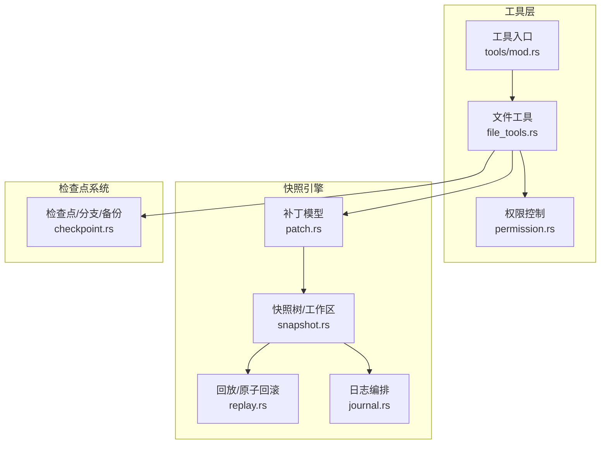
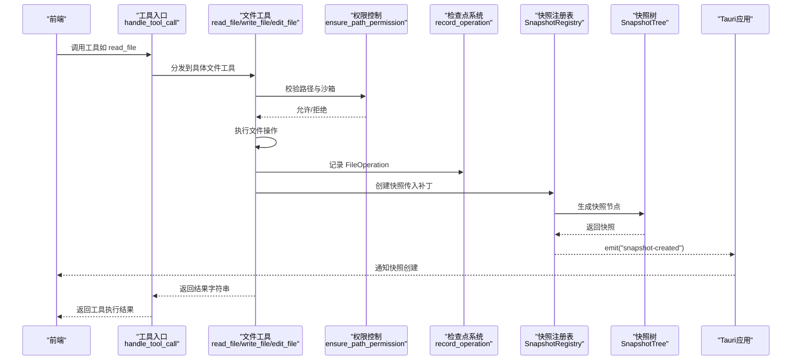
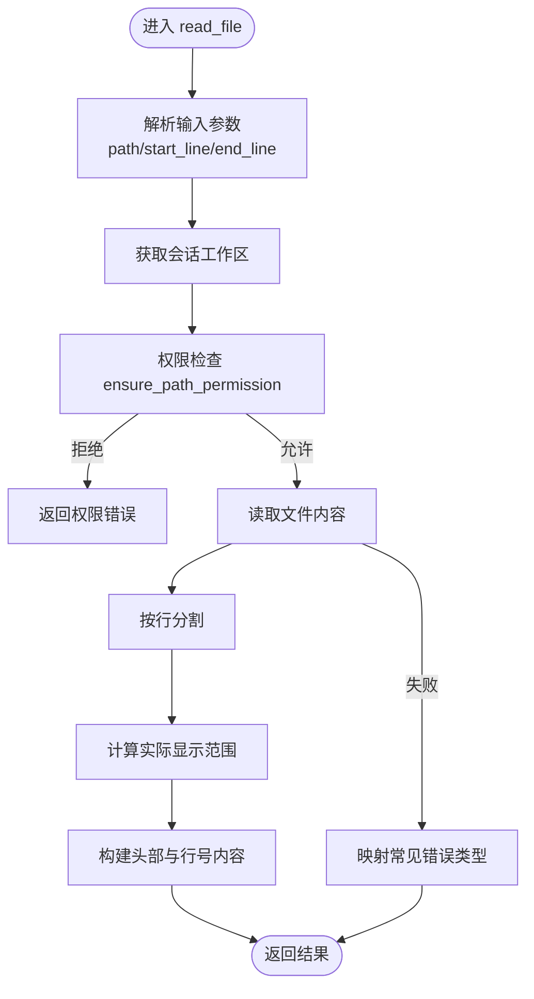
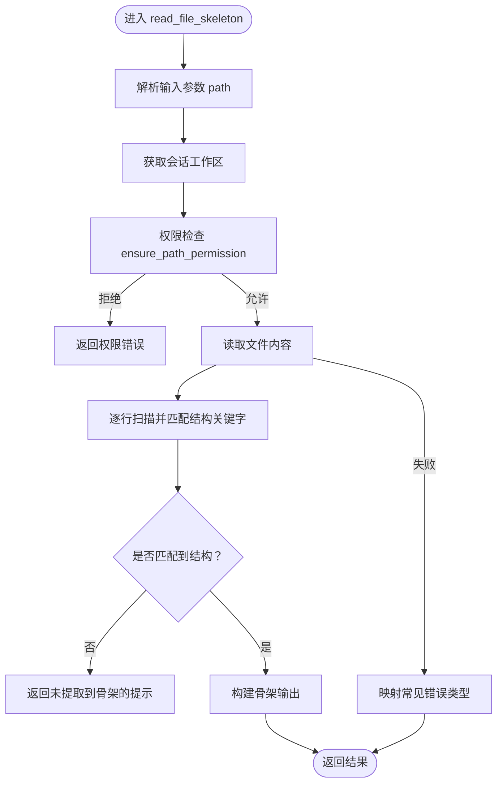
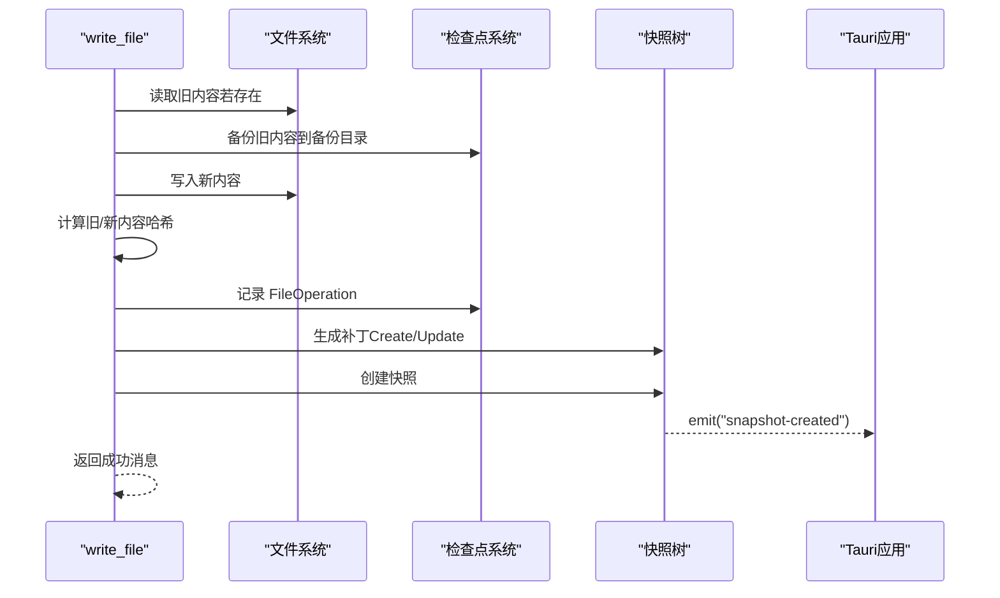
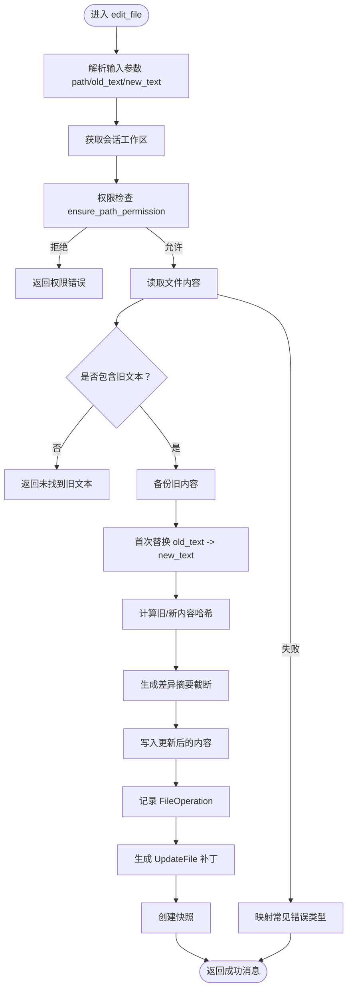
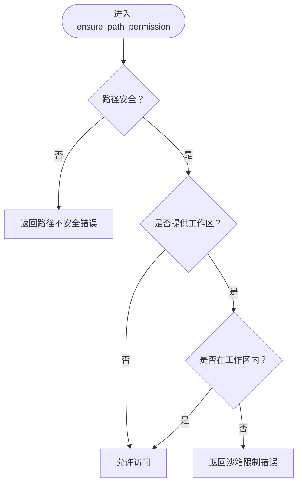
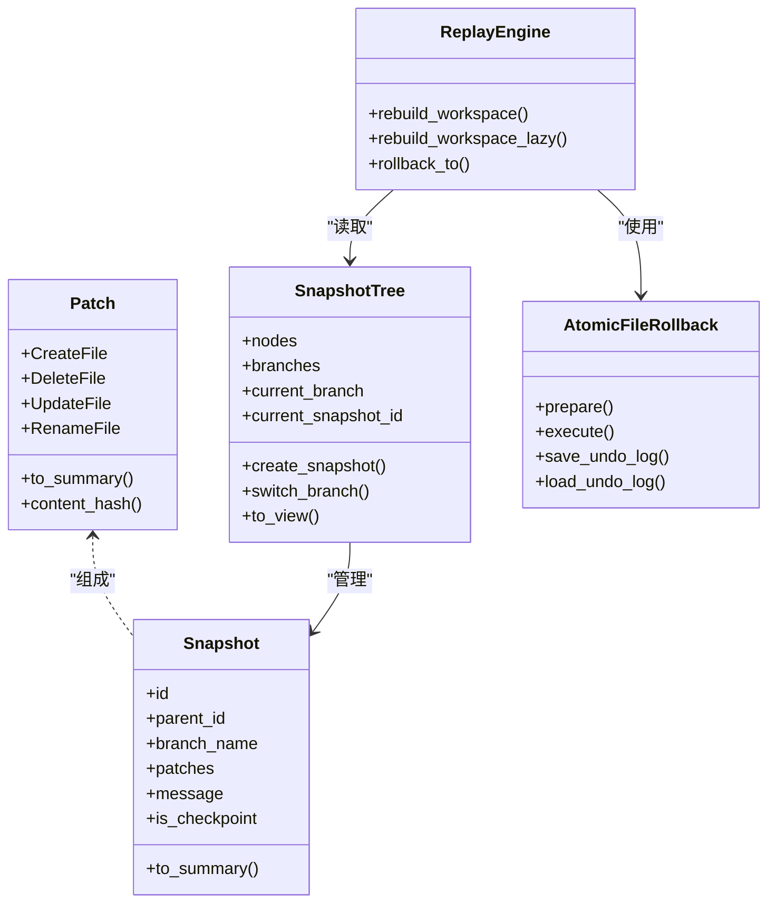
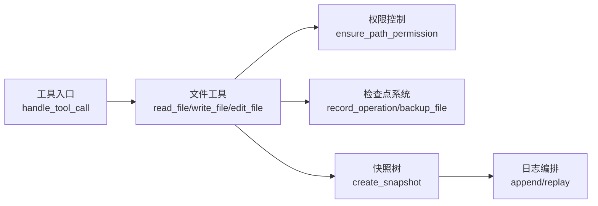

# 文件读写操作

<cite>
**本文引用的文件**
- [file_tools.rs](file://src-tauri/src/core/tools/file_tools.rs)
- [permission.rs](file://src-tauri/src/core/tools/permission.rs)
- [patch.rs](file://src-tauri/src/core/snapshot_engine/patch.rs)
- [snapshot.rs](file://src-tauri/src/core/snapshot_engine/snapshot.rs)
- [checkpoint.rs](file://src-tauri/src/core/checkpoint.rs)
- [mod.rs（工具系统入口）](file://src-tauri/src/core/tools/mod.rs)
- [replay.rs](file://src-tauri/src/core/snapshot_engine/replay.rs)
- [journal.rs](file://src-tauri/src/core/snapshot_engine/journal.rs)
</cite>

## 目录
1. [简介](#简介)
2. [项目结构](#项目结构)
3. [核心组件](#核心组件)
4. [架构总览](#架构总览)
5. [详细组件分析](#详细组件分析)
6. [依赖分析](#依赖分析)
7. [性能考虑](#性能考虑)
8. [故障排查指南](#故障排查指南)
9. [结论](#结论)
10. [附录](#附录)

## 简介
本章节面向 JarvisAgent 的文件读写操作模块，系统性阐述以下能力：
- 文件读取：支持行号范围读取、文件内容骨架提取
- 文件写入：自动备份、快照创建、权限检查
- 文件编辑：基于搜索替换的编辑、差异摘要生成
- 权限控制：路径安全检查、沙箱边界校验、工作区外访问授权
- 与检查点/快照系统的集成：记录操作、生成补丁、触发快照、事件通知

本模块以 Rust 实现，通过 Tauri 应用句柄与前端交互，提供稳定、可审计、可回滚的文件操作能力。

## 项目结构
文件读写相关代码主要分布在如下位置：
- 工具入口与分发：tools/mod.rs
- 文件工具实现：core/tools/file_tools.rs
- 权限控制：core/tools/permission.rs
- 快照引擎（补丁、树、回放）：core/snapshot_engine/{patch,snapshot,replay}.rs
- 检查点系统：core/checkpoint.rs
- 日志与编排：core/snapshot_engine/journal.rs

图表来源
- [mod.rs（工具系统入口）:157-236](file://src-tauri/src/core/tools/mod.rs#L157-L236)
- [file_tools.rs:44-305](file://src-tauri/src/core/tools/file_tools.rs#L44-L305)
- [permission.rs:49-72](file://src-tauri/src/core/tools/permission.rs#L49-L72)
- [patch.rs:5-25](file://src-tauri/src/core/snapshot_engine/patch.rs#L5-L25)
- [snapshot.rs:6-46](file://src-tauri/src/core/snapshot_engine/snapshot.rs#L6-L46)
- [replay.rs:23-344](file://src-tauri/src/core/snapshot_engine/replay.rs#L23-L344)
- [journal.rs:47-156](file://src-tauri/src/core/snapshot_engine/journal.rs#L47-L156)
- [checkpoint.rs:14-127](file://src-tauri/src/core/checkpoint.rs#L14-L127)

章节来源
- [mod.rs（工具系统入口）:157-236](file://src-tauri/src/core/tools/mod.rs#L157-L236)
- [file_tools.rs:44-305](file://src-tauri/src/core/tools/file_tools.rs#L44-L305)
- [permission.rs:49-72](file://src-tauri/src/core/tools/permission.rs#L49-L72)
- [patch.rs:5-25](file://src-tauri/src/core/snapshot_engine/patch.rs#L5-L25)
- [snapshot.rs:6-46](file://src-tauri/src/core/snapshot_engine/snapshot.rs#L6-L46)
- [replay.rs:23-344](file://src-tauri/src/core/snapshot_engine/replay.rs#L23-L344)
- [journal.rs:47-156](file://src-tauri/src/core/snapshot_engine/journal.rs#L47-L156)
- [checkpoint.rs:14-127](file://src-tauri/src/core/checkpoint.rs#L14-L127)

## 核心组件
- 文件读取 read_file：支持指定起止行号，输出带行号的片段与总行数统计
- 文件骨架提取 read_file_skeleton：按语言关键字提取函数/类/导入等结构骨架
- 文件写入 write_file：写入前备份、记录操作、生成补丁并创建快照
- 文件编辑 edit_file：基于搜索替换，生成差异摘要，备份并创建快照
- 权限控制 ensure_path_permission：路径安全检查、沙箱边界校验
- 快照与检查点：补丁模型、快照树、回放与原子回滚、日志编排

章节来源
- [file_tools.rs:44-305](file://src-tauri/src/core/tools/file_tools.rs#L44-L305)
- [permission.rs:49-72](file://src-tauri/src/core/tools/permission.rs#L49-L72)
- [patch.rs:5-25](file://src-tauri/src/core/snapshot_engine/patch.rs#L5-L25)
- [snapshot.rs:6-46](file://src-tauri/src/core/snapshot_engine/snapshot.rs#L6-L46)
- [checkpoint.rs:14-127](file://src-tauri/src/core/checkpoint.rs#L14-L127)
- [replay.rs:23-344](file://src-tauri/src/core/snapshot_engine/replay.rs#L23-L344)
- [journal.rs:47-156](file://src-tauri/src/core/snapshot_engine/journal.rs#L47-L156)

## 架构总览
文件操作的端到端流程如下：
- 工具入口接收前端请求，解析输入参数
- 权限模块进行路径安全与沙箱边界校验
- 文件工具执行具体操作（读取/写入/编辑）
- 记录文件操作到会话上下文的待提交检查点队列
- 生成补丁并创建快照，向前端发出“快照创建”事件
- 快照引擎负责补丁应用、回放与原子回滚

图表来源
- [mod.rs（工具系统入口）:157-236](file://src-tauri/src/core/tools/mod.rs#L157-L236)
- [file_tools.rs:19-41](file://src-tauri/src/core/tools/file_tools.rs#L19-L41)
- [checkpoint.rs:183-190](file://src-tauri/src/core/checkpoint.rs#L183-L190)
- [snapshot.rs:218-256](file://src-tauri/src/core/snapshot_engine/snapshot.rs#L218-L256)
- [journal.rs:76-83](file://src-tauri/src/core/snapshot_engine/journal.rs#L76-L83)

## 详细组件分析

### 文件读取 read_file
- 功能要点
  - 支持 start_line、end_line 行号范围读取
  - 输出文件头（含总行数）与行号对齐的内容
  - 错误处理：文件被占用/无权限等场景给出友好提示
- 输入参数
  - path：必填，目标文件路径
  - start_line：可选，起始行（从 1 开始）
  - end_line：可选，结束行（包含）
- 返回值
  - 成功：形如“[File: ...] (Total: N lines[, Showing: S-E])\n行号 | 内容\n...”
  - 失败：错误信息字符串（区分不同系统错误类型）
- 性能与健壮性
  - 使用一次性读取到内存，按行切片输出；大文件建议配合行号范围
  - 对文件被占用/权限不足等常见错误进行分类提示

图表来源
- [file_tools.rs:44-94](file://src-tauri/src/core/tools/file_tools.rs#L44-L94)
- [permission.rs:49-72](file://src-tauri/src/core/tools/permission.rs#L49-L72)

章节来源
- [file_tools.rs:44-94](file://src-tauri/src/core/tools/file_tools.rs#L44-L94)

### 文件骨架提取 read_file_skeleton
- 功能要点
  - 识别常见语言的关键字（函数、类、导入、实现、接口、类型、导出等）
  - 输出匹配行的行号与内容，便于快速了解文件结构
- 输入参数
  - path：必填，目标文件路径
- 返回值
  - 成功：骨架列表（含总行数）
  - 失败：错误信息字符串（含常见错误映射）

图表来源
- [file_tools.rs:96-146](file://src-tauri/src/core/tools/file_tools.rs#L96-L146)
- [permission.rs:49-72](file://src-tauri/src/core/tools/permission.rs#L49-L72)

章节来源
- [file_tools.rs:96-146](file://src-tauri/src/core/tools/file_tools.rs#L96-L146)

### 文件写入 write_file（自动备份 + 快照）
- 功能要点
  - 写入前备份原始内容至检查点备份目录
  - 记录 FileOperation（类型、路径、哈希、备份路径、新内容哈希）
  - 生成补丁（CreateFile 或 UpdateFile），创建快照并向前端发出事件
  - 错误处理：文件被占用/权限不足等场景给出友好提示
- 输入参数
  - path：必填，目标文件路径
  - content：必填，新内容
- 返回值
  - 成功：形如“成功写入/创建 路径”的消息
  - 失败：错误信息字符串

图表来源
- [file_tools.rs:148-223](file://src-tauri/src/core/tools/file_tools.rs#L148-L223)
- [checkpoint.rs:416-440](file://src-tauri/src/core/checkpoint.rs#L416-L440)
- [snapshot.rs:218-256](file://src-tauri/src/core/snapshot_engine/snapshot.rs#L218-L256)

章节来源
- [file_tools.rs:148-223](file://src-tauri/src/core/tools/file_tools.rs#L148-L223)
- [checkpoint.rs:416-440](file://src-tauri/src/core/checkpoint.rs#L416-L440)
- [snapshot.rs:218-256](file://src-tauri/src/core/snapshot_engine/snapshot.rs#L218-L256)

### 文件编辑 edit_file（搜索替换 + 差异摘要）
- 功能要点
  - 仅替换首次出现的旧文本块
  - 生成差异摘要（截断展示前后片段）
  - 写入前备份，记录 FileOperation，生成补丁并创建快照
- 输入参数
  - path：必填，目标文件路径
  - old_text：必填，要被替换的旧文本
  - new_text：必填，替换后的文本
- 返回值
  - 成功：形如“成功编辑 路径”的消息
  - 失败：错误信息字符串（包含“未找到旧文本”等）

图表来源
- [file_tools.rs:225-305](file://src-tauri/src/core/tools/file_tools.rs#L225-L305)
- [checkpoint.rs:416-440](file://src-tauri/src/core/checkpoint.rs#L416-L440)
- [snapshot.rs:218-256](file://src-tauri/src/core/snapshot_engine/snapshot.rs#L218-L256)

章节来源
- [file_tools.rs:225-305](file://src-tauri/src/core/tools/file_tools.rs#L225-L305)

### 权限控制 ensure_path_permission
- 路径安全检查：禁止路径遍历（包含“..”）
- 沙箱边界校验：在工作区会话中强制限制访问范围
- 非沙箱会话：默认允许更广范围访问
- 用户授权：支持弹窗请求用户决策（用于工作区外访问）

图表来源
- [permission.rs:49-72](file://src-tauri/src/core/tools/permission.rs#L49-L72)

章节来源
- [permission.rs:49-72](file://src-tauri/src/core/tools/permission.rs#L49-L72)

### 快照与检查点系统集成
- 补丁模型：CreateFile/DeleteFile/UpdateFile/RenameFile
- 快照树：节点、分支、父子关系、视图转换
- 回放与原子回滚：重建工作区、撤销/重做补丁链
- 日志编排：条目持久化、紧凑化、重放

图表来源
- [patch.rs:5-25](file://src-tauri/src/core/snapshot_engine/patch.rs#L5-L25)
- [snapshot.rs:6-46](file://src-tauri/src/core/snapshot_engine/snapshot.rs#L6-L46)
- [replay.rs:23-344](file://src-tauri/src/core/snapshot_engine/replay.rs#L23-L344)

章节来源
- [patch.rs:5-25](file://src-tauri/src/core/snapshot_engine/patch.rs#L5-L25)
- [snapshot.rs:6-46](file://src-tauri/src/core/snapshot_engine/snapshot.rs#L6-L46)
- [replay.rs:23-344](file://src-tauri/src/core/snapshot_engine/replay.rs#L23-L344)

## 依赖分析
- 工具入口 handle_tool_call 将工具名映射到具体实现
- 文件工具依赖权限模块进行路径与沙箱校验
- 文件工具在写入/编辑后，通过检查点模块记录操作，并生成补丁交由快照树管理
- 快照树负责创建快照并向前端发出事件通知

图表来源
- [mod.rs（工具系统入口）:157-236](file://src-tauri/src/core/tools/mod.rs#L157-L236)
- [file_tools.rs:19-41](file://src-tauri/src/core/tools/file_tools.rs#L19-L41)
- [checkpoint.rs:183-190](file://src-tauri/src/core/checkpoint.rs#L183-L190)
- [snapshot.rs:218-256](file://src-tauri/src/core/snapshot_engine/snapshot.rs#L218-L256)
- [journal.rs:76-100](file://src-tauri/src/core/snapshot_engine/journal.rs#L76-L100)

章节来源
- [mod.rs（工具系统入口）:157-236](file://src-tauri/src/core/tools/mod.rs#L157-L236)
- [file_tools.rs:19-41](file://src-tauri/src/core/tools/file_tools.rs#L19-L41)
- [checkpoint.rs:183-190](file://src-tauri/src/core/checkpoint.rs#L183-L190)
- [snapshot.rs:218-256](file://src-tauri/src/core/snapshot_engine/snapshot.rs#L218-L256)
- [journal.rs:76-100](file://src-tauri/src/core/snapshot_engine/journal.rs#L76-L100)

## 性能考虑
- 大文件读取：优先使用行号范围读取，避免一次性加载整文件
- 写入与编辑：仅在必要时备份，避免重复 IO；对频繁写入场景可合并多次变更后再写入
- 快照创建：批量变更达到一定阈值再创建快照，减少快照数量
- 回放与回滚：使用增量补丁与懒加载策略，避免全量重建

## 故障排查指南
- 文件被占用/权限不足
  - 现象：读取/写入/编辑失败，错误信息包含“Access is denied”“os error 32/5”“被其他进程占用”
  - 处理：等待文件释放、检查权限、避免并发写入
- 未找到旧文本
  - 现象：编辑失败提示未找到旧文本
  - 处理：确认 old_text 是否存在于文件中，注意大小写与空白字符
- 路径不安全/沙箱限制
  - 现象：返回“包含‘..’遍历”或“不在沙箱目录内”
  - 处理：使用相对路径或绝对路径但确保在工作区内；必要时切换到非沙箱会话

章节来源
- [file_tools.rs:87-92](file://src-tauri/src/core/tools/file_tools.rs#L87-L92)
- [file_tools.rs:296-303](file://src-tauri/src/core/tools/file_tools.rs#L296-L303)
- [permission.rs:55-68](file://src-tauri/src/core/tools/permission.rs#L55-L68)

## 结论
文件读写操作模块通过严格的权限控制、完善的备份与快照机制，实现了安全、可观测、可回滚的文件操作能力。结合检查点与快照引擎，用户可以对文件变更进行精细追踪与回滚，满足复杂开发与协作场景的需求。

## 附录

### API 接口规范与参数
- read_file
  - 输入：path（必填）、start_line（可选）、end_line（可选）
  - 输出：字符串（文件片段+统计）
- read_file_skeleton
  - 输入：path（必填）
  - 输出：字符串（骨架列表或未提取到骨架的提示）
- write_file
  - 输入：path（必填）、content（必填）
  - 输出：字符串（成功/失败消息）
- edit_file
  - 输入：path（必填）、old_text（必填）、new_text（必填）
  - 输出：字符串（成功/失败消息）

章节来源
- [mod.rs（工具系统入口）:108-129](file://src-tauri/src/core/tools/mod.rs#L108-L129)
- [file_tools.rs:44-305](file://src-tauri/src/core/tools/file_tools.rs#L44-L305)