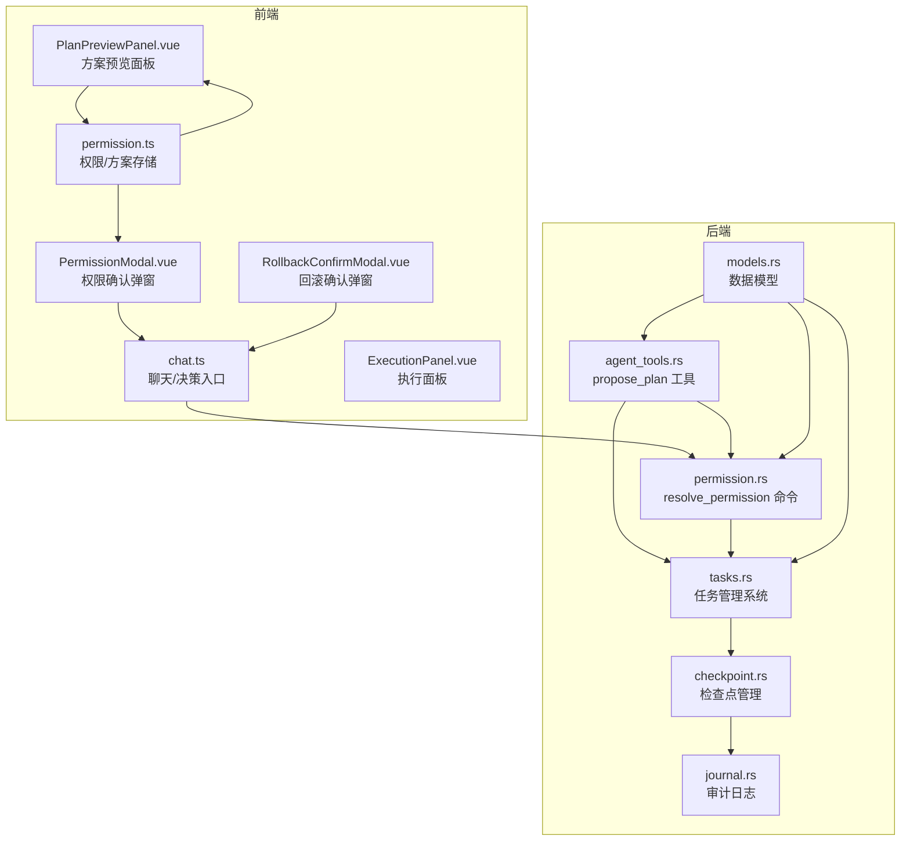
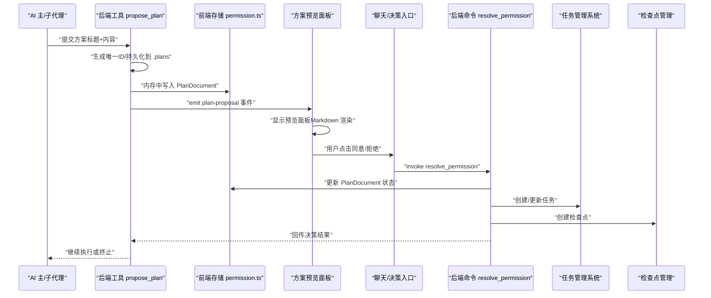
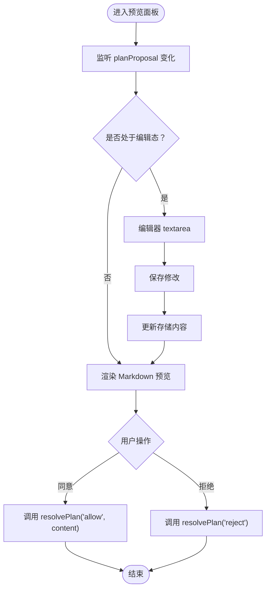
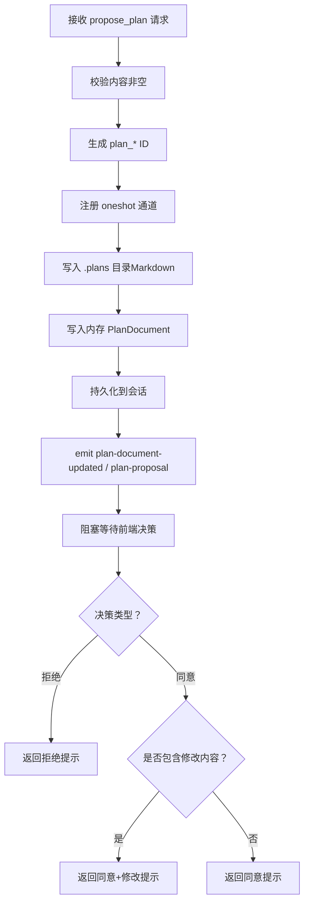
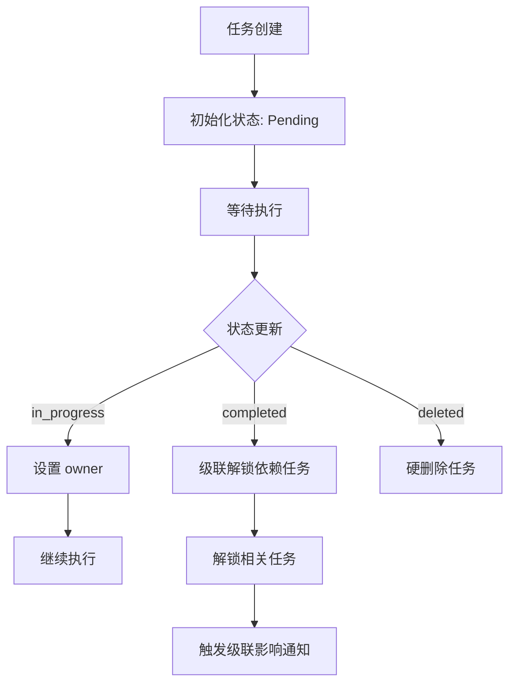
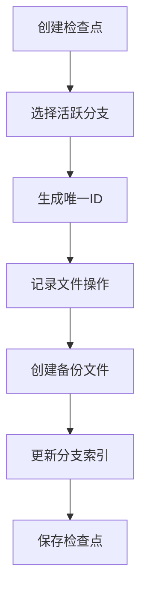
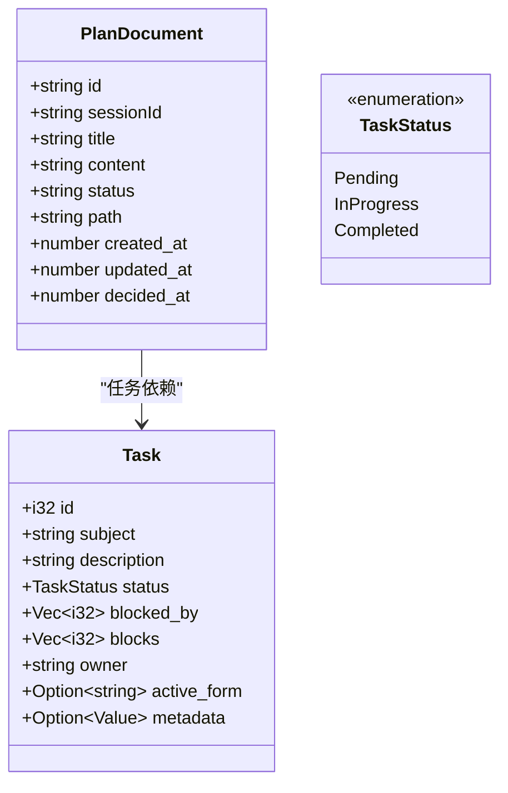
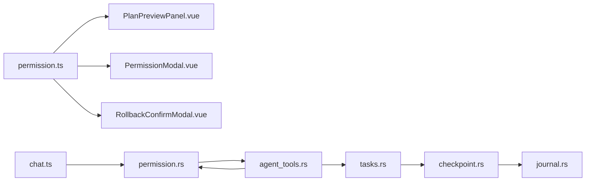

# 方案审批机制

<cite>
**本文引用的文件**
- [README.md](file://README.md)
- [PlanPreviewPanel.vue](file://src/components/common/PlanPreviewPanel.vue)
- [PermissionModal.vue](file://src/components/common/PermissionModal.vue)
- [RollbackConfirmModal.vue](file://src/components/common/RollbackConfirmModal.vue)
- [permission.ts](file://src/stores/permission.ts)
- [chat.ts](file://src/stores/chat.ts)
- [permission.rs](file://src-tauri/src/core/commands/permission.rs)
- [agent_tools.rs](file://src-tauri/src/core/tools/agent_tools.rs)
- [tasks.rs](file://src-tauri/src/core/orchestration/tasks.rs)
- [checkpoint.rs](file://src-tauri/src/core/session/checkpoint.rs)
- [journal.rs](file://src-tauri/src/core/snapshot_engine/journal.rs)
- [models.rs](file://src-tauri/src/core/models.rs)
- [ExecutionPanel.vue](file://src/components/chat/ExecutionPanel.vue)
- [index.ts](file://src/types/index.ts)
</cite>

## 更新摘要
**变更内容**
- 新增复杂的任务审批流程管理，支持多级审批和任务依赖关系
- 增强用户预览编辑功能，提供更丰富的方案审查体验
- 完善批准执行机制，集成任务管理系统和回滚控制
- 引入企业级功能，包括检查点管理和审计日志

## 目录
1. [简介](#简介)
2. [项目结构](#项目结构)
3. [核心组件](#核心组件)
4. [架构总览](#架构总览)
5. [详细组件分析](#详细组件分析)
6. [依赖关系分析](#依赖关系分析)
7. [性能考量](#性能考量)
8. [故障排查指南](#故障排查指南)
9. [结论](#结论)
10. [附录](#附录)

## 简介
本文件面向 JarvisAgent 的"方案审批机制"，系统性阐述从"AI 提交方案"到"用户审阅与决策"的全流程，覆盖提案创建、内容审核、风险评估、审批流程管理（多级审批、权限控制、流转规则）、预览功能实现（方案展示、变更预览、影响分析）、执行控制机制（审批通过后的执行授权、回滚机制）。同时给出提案数据结构、审批状态管理、与代理系统的集成方式、安全控制措施、使用示例、工作流程设计、合规性要求与最佳实践。

**更新** 新增企业级功能，包括复杂的任务审批流程、用户预览编辑、批准执行等高级特性。

## 项目结构
方案审批机制涉及前后端协同的关键位置如下：
- 前端组件层：方案预览面板、权限确认弹窗、回滚确认弹窗、状态存储与事件派发
- 后端工具层：方案审批工具、权限决策命令、任务管理系统、检查点管理
- 类型与状态：统一的数据结构与状态枚举

**图表来源**
- [PlanPreviewPanel.vue:1-170](file://src/components/common/PlanPreviewPanel.vue#L1-L170)
- [PermissionModal.vue:1-120](file://src/components/common/PermissionModal.vue#L1-L120)
- [RollbackConfirmModal.vue:1-121](file://src/components/common/RollbackConfirmModal.vue#L1-L121)
- [permission.ts:1-66](file://src/stores/permission.ts#L1-L66)
- [chat.ts:336-367](file://src/stores/chat.ts#L336-L367)
- [ExecutionPanel.vue:1-215](file://src/components/chat/ExecutionPanel.vue#L1-L215)
- [agent_tools.rs:874-919](file://src-tauri/src/core/tools/agent_tools.rs#L874-L919)
- [permission.rs:4-71](file://src-tauri/src/core/commands/permission.rs#L4-L71)
- [tasks.rs:1-438](file://src-tauri/src/core/orchestration/tasks.rs#L1-L438)
- [checkpoint.rs:1-514](file://src-tauri/src/core/session/checkpoint.rs#L1-L514)
- [journal.rs:1-157](file://src-tauri/src/core/snapshot_engine/journal.rs#L1-L157)
- [models.rs:222-262](file://src-tauri/src/core/models.rs#L222-L262)

**章节来源**
- [README.md:191-201](file://README.md#L191-L201)
- [PlanPreviewPanel.vue:1-170](file://src/components/common/PlanPreviewPanel.vue#L1-L170)
- [PermissionModal.vue:1-120](file://src/components/common/PermissionModal.vue#L1-L120)
- [RollbackConfirmModal.vue:1-121](file://src/components/common/RollbackConfirmModal.vue#L1-L121)
- [permission.ts:1-66](file://src/stores/permission.ts#L1-L66)
- [chat.ts:336-367](file://src/stores/chat.ts#L336-L367)
- [ExecutionPanel.vue:1-215](file://src/components/chat/ExecutionPanel.vue#L1-L215)
- [agent_tools.rs:874-919](file://src-tauri/src/core/tools/agent_tools.rs#L874-L919)
- [permission.rs:4-71](file://src-tauri/src/core/commands/permission.rs#L4-L71)
- [tasks.rs:1-438](file://src-tauri/src/core/orchestration/tasks.rs#L1-L438)
- [checkpoint.rs:1-514](file://src-tauri/src/core/session/checkpoint.rs#L1-L514)
- [journal.rs:1-157](file://src-tauri/src/core/snapshot_engine/journal.rs#L1-L157)
- [models.rs:222-262](file://src-tauri/src/core/models.rs#L222-L262)

## 核心组件
- 方案预览面板：负责渲染 Markdown 方案、提供编辑/预览切换、发起同意/拒绝决策。
- 权限确认弹窗：用于敏感操作的即时权限请求与决策。
- 回滚确认弹窗：用于执行风险操作前的最终确认，支持详细的操作详情展示。
- 权限/方案存储：集中管理当前会话的权限请求与方案提案，支持更新与去重排序。
- 聊天/决策入口：封装 invoke 调用 resolve_permission，桥接前端决策与后端通道。
- 方案审批工具：在后端生成唯一 ID、持久化方案、广播事件触发前端预览、阻塞等待用户决策。
- 权限决策命令：处理前端决策，更新方案文档状态并回传响应。
- 任务管理系统：支持复杂任务审批流程，包括依赖关系管理、状态流转和级联解锁。
- 检查点管理：提供文件操作的备份和回滚功能，支持多分支管理。
- 执行面板：展示代理执行过程，包括思考过程、工具调用和执行日志。

**章节来源**
- [PlanPreviewPanel.vue:1-170](file://src/components/common/PlanPreviewPanel.vue#L1-L170)
- [PermissionModal.vue:1-120](file://src/components/common/PermissionModal.vue#L1-L120)
- [RollbackConfirmModal.vue:1-121](file://src/components/common/RollbackConfirmModal.vue#L1-L121)
- [permission.ts:1-66](file://src/stores/permission.ts#L1-L66)
- [chat.ts:336-367](file://src/stores/chat.ts#L336-L367)
- [agent_tools.rs:874-919](file://src-tauri/src/core/tools/agent_tools.rs#L874-L919)
- [permission.rs:4-71](file://src-tauri/src/core/commands/permission.rs#L4-L71)
- [tasks.rs:1-438](file://src-tauri/src/core/orchestration/tasks.rs#L1-L438)
- [checkpoint.rs:1-514](file://src-tauri/src/core/session/checkpoint.rs#L1-L514)
- [ExecutionPanel.vue:1-215](file://src/components/chat/ExecutionPanel.vue#L1-L215)

## 架构总览
方案审批的端到端流程如下：

**图表来源**
- [agent_tools.rs:874-919](file://src-tauri/src/core/tools/agent_tools.rs#L874-L919)
- [permission.rs:4-71](file://src-tauri/src/core/commands/permission.rs#L4-L71)
- [PlanPreviewPanel.vue:1-170](file://src/components/common/PlanPreviewPanel.vue#L1-L170)
- [permission.ts:1-66](file://src/stores/permission.ts#L1-L66)
- [chat.ts:336-367](file://src/stores/chat.ts#L336-L367)
- [tasks.rs:70-109](file://src-tauri/src/core/orchestration/tasks.rs#L70-L109)
- [checkpoint.rs:281-314](file://src-tauri/src/core/session/checkpoint.rs#L281-L314)

## 详细组件分析

### 方案预览面板（PlanPreviewPanel.vue）
- 功能要点
  - 监听权限存储中的 planProposal，自动填充预览内容。
  - 支持 Markdown 编辑与预览切换，编辑状态下允许用户修改内容。
  - 统计章节与行数，辅助用户快速了解方案体量。
  - 同意时将最终内容传递给聊天决策入口；拒绝则直接回传拒绝决策。
- 关键交互
  - 编辑/保存：在编辑态保存修改内容至存储。
  - 同意/拒绝：调用 chat.resolvePlan，触发 invoke resolve_permission。
- 设计细节
  - 使用 marked 渲染 Markdown，保证预览一致性。
  - 响应式计算 activeContent 与 renderedContent，避免重复解析。

**图表来源**
- [PlanPreviewPanel.vue:1-170](file://src/components/common/PlanPreviewPanel.vue#L1-L170)
- [chat.ts:352-367](file://src/stores/chat.ts#L352-L367)

**章节来源**
- [PlanPreviewPanel.vue:1-170](file://src/components/common/PlanPreviewPanel.vue#L1-L170)
- [chat.ts:352-367](file://src/stores/chat.ts#L352-L367)

### 权限确认弹窗（PermissionModal.vue）
- 用途：对敏感操作（如 Shell 命令）进行即时确认，支持一次性允许、会话级允许与拒绝。
- 智能解析：从消息中抽取"原因"与"命令"两部分，必要时截断过长内容，避免界面溢出。
- 快捷键：A（一次性允许）、S（会话级允许）、R/Esc（拒绝）。

**章节来源**
- [PermissionModal.vue:1-120](file://src/components/common/PermissionModal.vue#L1-L120)

### 回滚确认弹窗（RollbackConfirmModal.vue）
- 用途：对可能造成不可逆影响的操作提供最终确认，支持详细的操作详情展示。
- 功能特性：支持自定义标题、消息内容、详细列表和加载状态。
- 安全控制：提供确认和取消两种操作，确保用户充分理解操作后果。

**章节来源**
- [RollbackConfirmModal.vue:1-121](file://src/components/common/RollbackConfirmModal.vue#L1-L121)

### 权限/方案存储（permission.ts）
- 数据结构
  - permissionRequests：按会话维护权限请求。
  - planProposals：按会话维护方案提案。
  - planDocumentsBySession：按会话维护已持久化的方案文档列表。
- 能力
  - 计算属性 permissionRequest、planProposal、currentPlanDocuments。
  - upsertPlanDocument：插入或更新方案文档并按更新时间排序。
  - updatePlanProposalContent：在编辑态更新提案内容。

**章节来源**
- [permission.ts:1-66](file://src/stores/permission.ts#L1-L66)

### 聊天/决策入口（chat.ts）
- resolvePlan：封装 invoke resolve_permission，携带决策与可选修改内容。
- resolvePermission：处理权限请求的决策。
- cancelJarvis：在取消执行时清理当前会话的权限请求与方案提案。

**章节来源**
- [chat.ts:336-367](file://src/stores/chat.ts#L336-L367)

### 方案审批工具（agent_tools.rs）
- propose_plan
  - 校验内容非空，生成唯一 plan_* ID。
  - 注册 oneshot 通道等待用户决策。
  - 持久化方案至 .plans 目录（标题安全化、写入 Markdown 文件）。
  - 写入内存 PlanDocument 并持久化到会话。
  - 发出 plan-document-updated 与 plan-proposal 事件，触发前端预览。
  - 阻塞等待前端决策，解析"同意/拒绝"与"修改后的内容"。
  - 返回下一步提示（可创建任务或继续调整）。
- 与 sessions.rs 协同：upsert_plan_document 与 get_agent_home/DIR_PLANS。

**图表来源**
- [agent_tools.rs:874-919](file://src-tauri/src/core/tools/agent_tools.rs#L874-L919)

**章节来源**
- [agent_tools.rs:874-919](file://src-tauri/src/core/tools/agent_tools.rs#L874-L919)

### 权限决策命令（permission.rs）
- resolve_permission
  - 若 ID 以 plan_ 开头，更新 PlanDocument 状态为 approved/rejected，同步内存与 emit plan-document-updated。
  - 从 pending_permissions 中取出 oneshot 通道，回传决策字符串（若包含修改内容，使用"|||"分隔）。
- cancel_jarvis
  - 取消会话中的所有 pending_permissions，逐个回传 reject。

**章节来源**
- [permission.rs:4-71](file://src-tauri/src/core/commands/permission.rs#L4-L71)

### 任务管理系统（tasks.rs）
- 任务创建：支持 subject、description、activeForm、metadata、owner 字段。
- 任务更新：支持 status、subject、description、activeForm、owner、metadata 的增量更新。
- 依赖管理：支持 add_blocked_by 和 add_blocks 字段，自动维护双向依赖关系。
- 状态流转：支持 pending → in_progress → completed 的状态转换。
- 级联解锁：当任务状态变为 completed 时，自动解锁依赖该任务的其他任务。
- 元数据合并：支持 JSON 对象的智能合并，null 值用于删除键。

**图表来源**
- [tasks.rs:70-109](file://src-tauri/src/core/orchestration/tasks.rs#L70-L109)
- [tasks.rs:100-217](file://src-tauri/src/core/orchestration/tasks.rs#L100-L217)

**章节来源**
- [tasks.rs:1-438](file://src-tauri/src/core/orchestration/tasks.rs#L1-L438)

### 检查点管理系统（checkpoint.rs）
- 分支管理：支持多分支创建、切换和删除，主分支默认为"main"。
- 检查点创建：记录文件操作的备份，支持编辑、写入、创建、删除、重命名操作。
- 回滚功能：支持将文件系统回滚到指定检查点，自动处理不同类型的文件操作。
- 备份机制：为每个文件操作创建哈希标识的备份文件，确保安全回滚。

**图表来源**
- [checkpoint.rs:281-314](file://src-tauri/src/core/session/checkpoint.rs#L281-L314)
- [checkpoint.rs:455-500](file://src-tauri/src/core/session/checkpoint.rs#L455-L500)

**章节来源**
- [checkpoint.rs:1-514](file://src-tauri/src/core/session/checkpoint.rs#L1-L514)

### 审计日志系统（journal.rs）
- 日志条目：支持 CreateSnapshot、CreateBranch、SwitchBranch、DeleteBranch、Compact 等类型。
- 追加写入：采用 JSON Lines 格式，支持顺序追加和重放。
- 压缩机制：当日志条目数量超过阈值时，自动进行压缩优化。
- 重放功能：支持从日志文件重放所有操作，重建系统状态。

**章节来源**
- [journal.rs:1-157](file://src-tauri/src/core/snapshot_engine/journal.rs#L1-L157)

### 执行面板（ExecutionPanel.vue）
- 执行监控：实时显示代理执行状态，包括思考过程、工具调用和执行日志。
- 详细信息：支持开发者模式查看详细的工具调用参数、输出和错误信息。
- 状态分类：区分 completed、error、running、pending 等不同执行状态。
- 子代理识别：自动识别子代理工具调用，提供专门的显示样式。

**章节来源**
- [ExecutionPanel.vue:1-215](file://src/components/chat/ExecutionPanel.vue#L1-L215)

### 提案数据结构与状态管理（models.rs）
- PlanDocument：持久化结构（id/sessionId/title/content/status/path/时间戳等）。
- Task：任务结构（id/subject/description/status/blocked_by/blocks/owner/metadata）。
- TaskStatus：任务状态枚举（Pending/InProgress/Completed）。
- SessionMemory：会话内存结构，包含 agent_steps 和 plan_documents。

**图表来源**
- [models.rs:222-262](file://src-tauri/src/core/models.rs#L222-L262)

**章节来源**
- [models.rs:222-262](file://src-tauri/src/core/models.rs#L222-L262)

## 依赖关系分析
- 前端组件依赖
  - PlanPreviewPanel.vue 依赖 permission.ts 的 planProposal 与 chat.ts 的 resolvePlan。
  - PermissionModal.vue 依赖 permission.ts 的 permissionRequest 与 chat.ts 的 resolvePermission。
  - RollbackConfirmModal.vue 依赖 chat.ts 的执行控制功能。
- 后端工具依赖
  - propose_plan 依赖 SessionManager、内存与 sessions.rs 的 upsert_plan_document。
  - resolve_permission 依赖 pending_permissions 通道与内存 plan_documents。
  - 任务管理依赖文件系统和 JSON 序列化。
- 事件与状态
  - 前端通过 Pinia 管理状态；后端通过 oneshot 通道与事件驱动前端 UI 更新。
  - 检查点管理通过文件系统提供持久化存储。

**图表来源**
- [permission.ts:1-66](file://src/stores/permission.ts#L1-L66)
- [PlanPreviewPanel.vue:1-170](file://src/components/common/PlanPreviewPanel.vue#L1-L170)
- [PermissionModal.vue:1-120](file://src/components/common/PermissionModal.vue#L1-L120)
- [RollbackConfirmModal.vue:1-121](file://src/components/common/RollbackConfirmModal.vue#L1-L121)
- [chat.ts:336-367](file://src/stores/chat.ts#L336-L367)
- [agent_tools.rs:874-919](file://src-tauri/src/core/tools/agent_tools.rs#L874-L919)
- [permission.rs:4-71](file://src-tauri/src/core/commands/permission.rs#L4-L71)
- [tasks.rs:1-438](file://src-tauri/src/core/orchestration/tasks.rs#L1-L438)
- [checkpoint.rs:1-514](file://src-tauri/src/core/session/checkpoint.rs#L1-L514)
- [journal.rs:1-157](file://src-tauri/src/core/snapshot_engine/journal.rs#L1-L157)

**章节来源**
- [permission.ts:1-66](file://src/stores/permission.ts#L1-L66)
- [PlanPreviewPanel.vue:1-170](file://src/components/common/PlanPreviewPanel.vue#L1-L170)
- [PermissionModal.vue:1-120](file://src/components/common/PermissionModal.vue#L1-L120)
- [RollbackConfirmModal.vue:1-121](file://src/components/common/RollbackConfirmModal.vue#L1-L121)
- [chat.ts:336-367](file://src/stores/chat.ts#L336-L367)
- [agent_tools.rs:874-919](file://src-tauri/src/core/tools/agent_tools.rs#L874-L919)
- [permission.rs:4-71](file://src-tauri/src/core/commands/permission.rs#L4-L71)
- [tasks.rs:1-438](file://src-tauri/src/core/orchestration/tasks.rs#L1-L438)
- [checkpoint.rs:1-514](file://src-tauri/src/core/session/checkpoint.rs#L1-L514)
- [journal.rs:1-157](file://src-tauri/src/core/snapshot_engine/journal.rs#L1-L157)

## 性能考量
- 前端渲染
  - PlanPreviewPanel.vue 使用 marked 渲染 Markdown，建议在大体量方案时启用分页或懒加载策略，避免一次性渲染造成卡顿。
- 事件与状态
  - permission.ts 的 upsertPlanDocument 对列表进行排序与去重，注意在高并发场景下的键空间增长与排序成本。
- 后端阻塞
  - propose_plan 在等待前端决策时阻塞当前任务线程，建议在高并发场景下配合队列与超时策略，避免长时间阻塞。
- 任务管理性能
  - 任务依赖关系的维护涉及文件系统操作，建议在大量任务场景下考虑批量操作和缓存策略。
- 检查点管理
  - 文件备份和回滚操作可能影响磁盘 I/O，建议合理设置检查点频率和备份策略。

## 故障排查指南
- 前端无法显示方案预览
  - 检查 permission.ts 是否正确写入 planProposals，以及 PlanPreviewPanel.vue 是否监听到 planProposal。
  - 确认后端是否发出 plan-proposal 事件，前端是否订阅该事件。
- 决策未生效
  - 检查 chat.ts 的 resolvePlan 是否正确调用 invoke resolve_permission。
  - 确认 permission.rs 是否从 pending_permissions 取出通道并回传决策。
- 方案未持久化
  - 检查 agent_tools.rs 是否成功写入 .plans 目录与内存 PlanDocument。
  - 确认 sessions.rs 的 upsert_plan_document 是否被调用。
- 取消执行导致决策丢失
  - cancelJarvis 会清理当前会话的权限请求与方案提案，确认调用时机与会话切换逻辑。
- 任务状态异常
  - 检查 tasks.rs 的 update 方法是否正确处理状态转换和依赖关系。
  - 确认文件系统权限和 JSON 文件完整性。
- 检查点回滚失败
  - 检查备份文件是否存在和完整性。
  - 确认文件路径权限和磁盘空间。

**章节来源**
- [PlanPreviewPanel.vue:1-170](file://src/components/common/PlanPreviewPanel.vue#L1-L170)
- [chat.ts:336-367](file://src/stores/chat.ts#L336-L367)
- [permission.rs:4-71](file://src-tauri/src/core/commands/permission.rs#L4-L71)
- [agent_tools.rs:874-919](file://src-tauri/src/core/tools/agent_tools.rs#L874-L919)
- [tasks.rs:1-438](file://src-tauri/src/core/orchestration/tasks.rs#L1-L438)
- [checkpoint.rs:1-514](file://src-tauri/src/core/session/checkpoint.rs#L1-L514)

## 结论
JarvisAgent 的方案审批机制通过"AI 提案—前端预览—用户决策—后端执行"的闭环，实现了对复杂任务的安全可控执行。前端以组件化的方式提供直观的预览与编辑能力，后端以工具与命令的形式保障决策通道与持久化，配合会话与状态管理，形成清晰、可审计、可回溯的审批体系。

**更新** 新增的企业级功能包括复杂的任务审批流程、用户预览编辑、批准执行控制、检查点管理和审计日志，进一步增强了系统的安全性和可追溯性。建议在生产环境中结合多级审批、权限分级与审计日志，进一步强化合规性与安全性。

## 附录

### 使用示例（概念性步骤）
- AI 生成方案：调用 propose_plan 工具，传入标题与内容。
- 前端预览：收到 plan-proposal 事件后打开方案预览面板，Markdown 渲染。
- 用户审阅：可编辑或直接同意/拒绝。
- 同意执行：前端调用 resolvePlan('allow', 修改后内容)，后端创建任务并委派子代理执行。
- 拒绝处理：前端调用 resolvePlan('reject')，后端返回终止提示，AI 可据此调整方案。
- 任务跟踪：通过 ExecutionPanel.vue 实时监控任务执行状态和工具调用详情。

**章节来源**
- [README.md:191-201](file://README.md#L191-L201)
- [PlanPreviewPanel.vue:58-65](file://src/components/common/PlanPreviewPanel.vue#L58-L65)
- [chat.ts:352-367](file://src/stores/chat.ts#L352-L367)
- [agent_tools.rs:874-919](file://src-tauri/src/core/tools/agent_tools.rs#L874-L919)
- [ExecutionPanel.vue:26-32](file://src/components/chat/ExecutionPanel.vue#L26-L32)

### 合规性与最佳实践
- 合规性
  - 方案文档持久化至 .plans 目录，便于审计与追溯。
  - 决策通道采用 oneshot 通道与明确的状态枚举，避免歧义。
  - 检查点系统提供完整的操作审计和回滚能力。
- 最佳实践
  - 在 AI 侧对方案进行"风险评估摘要"与"影响分析摘要"，帮助用户快速决策。
  - 对于高风险方案，建议引入多级审批与会话级白名单控制。
  - 前端预览支持变更对比与差异展示，提升审阅效率。
  - 后端对方案标题进行安全化处理，防止路径注入。
  - 合理设置检查点频率，平衡性能和安全性。
  - 使用任务依赖关系管理复杂的工作流程，确保执行顺序正确。

**章节来源**
- [agent_tools.rs:904-910](file://src-tauri/src/core/tools/agent_tools.rs#L904-L910)
- [tasks.rs:111-126](file://src-tauri/src/core/orchestration/tasks.rs#L111-L126)
- [checkpoint.rs:281-314](file://src-tauri/src/core/session/checkpoint.rs#L281-L314)
- [journal.rs:76-83](file://src-tauri/src/core/snapshot_engine/journal.rs#L76-L83)