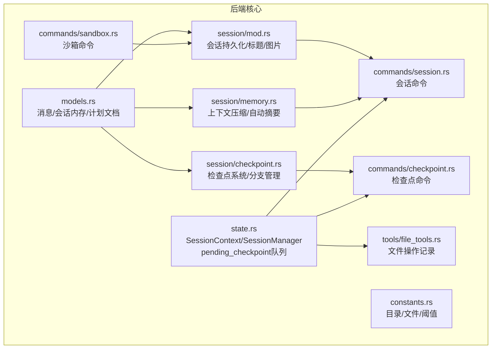
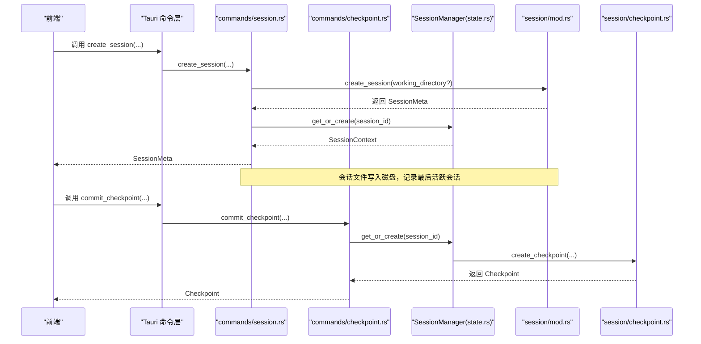
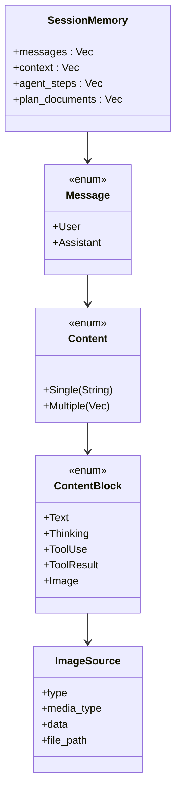
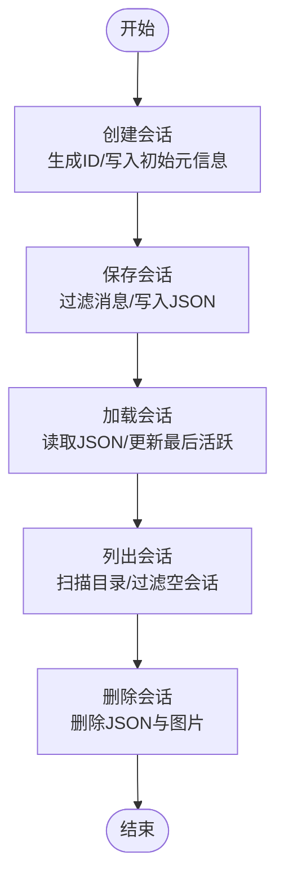
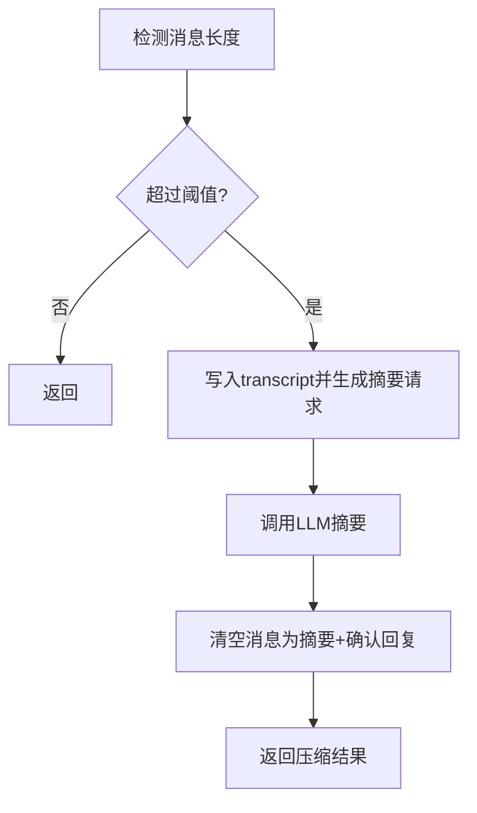
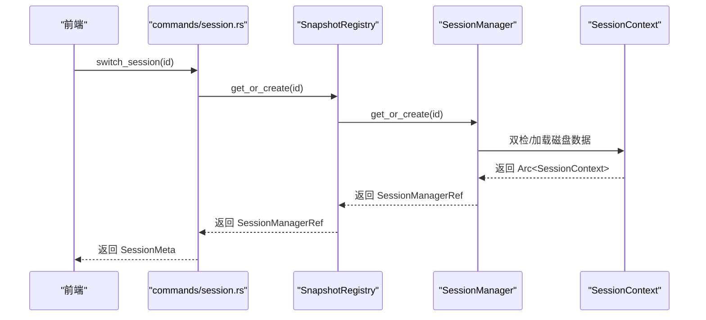
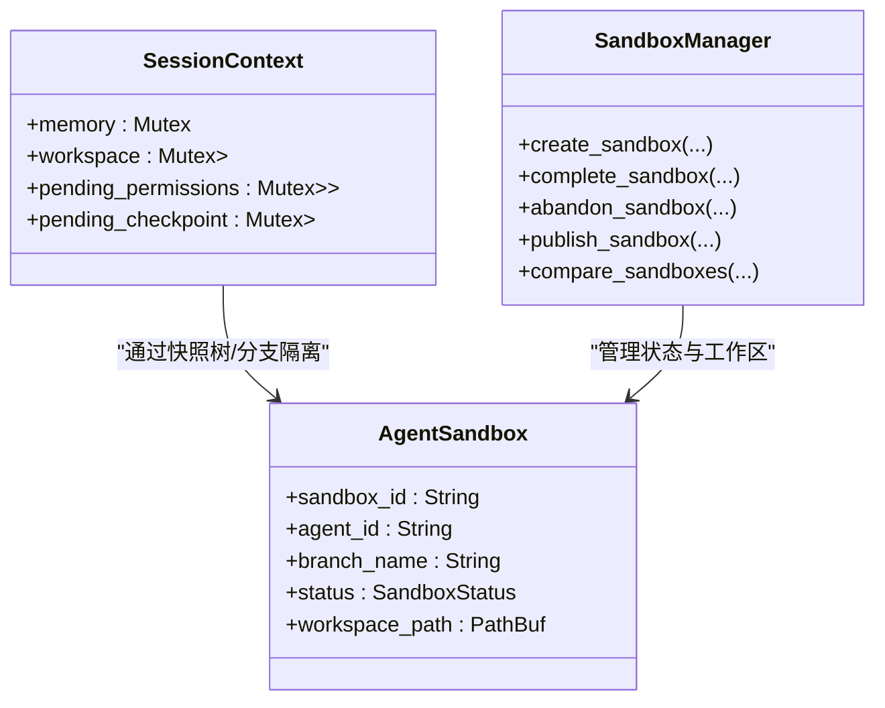
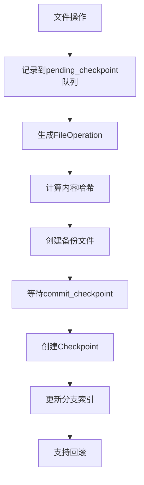
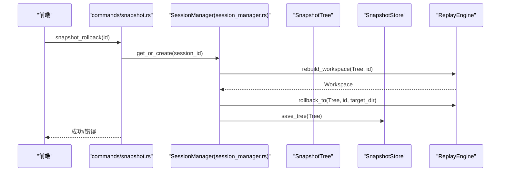
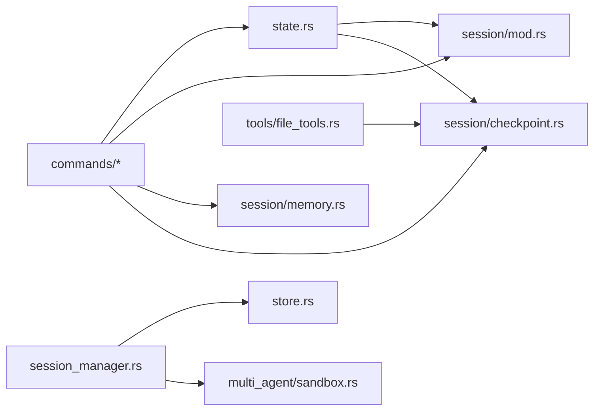

# 会话管理

<cite>
**本文引用的文件**
- [src-tauri/src/core/models.rs](file://src-tauri/src/core/models.rs)
- [src-tauri/src/core/session/mod.rs](file://src-tauri/src/core/session/mod.rs)
- [src-tauri/src/core/session/memory.rs](file://src-tauri/src/core/session/memory.rs)
- [src-tauri/src/core/session/checkpoint.rs](file://src-tauri/src/core/session/checkpoint.rs)
- [src-tauri/src/core/state.rs](file://src-tauri/src/core/state.rs)
- [src-tauri/src/core/constants.rs](file://src-tauri/src/core/constants.rs)
- [src-tauri/src/core/commands/session.rs](file://src-tauri/src/core/commands/session.rs)
- [src-tauri/src/core/commands/checkpoint.rs](file://src-tauri/src/core/commands/checkpoint.rs)
- [src-tauri/src/core/commands/sandbox.rs](file://src-tauri/src/core/commands/sandbox.rs)
- [src-tauri/src/core/snapshot_manager/session_manager.rs](file://src-tauri/src/core/snapshot_manager/session_manager.rs)
- [src-tauri/src/core/snapshot_manager/store.rs](file://src-tauri/src/core/snapshot_manager/store.rs)
- [src-tauri/src/core/snapshot_engine/multi_agent/sandbox.rs](file://src-tauri/src/core/snapshot_engine/multi_agent/sandbox.rs)
- [src-tauri/src/core/tools/file_tools.rs](file://src-tauri/src/core/tools/file_tools.rs)
- [src-tauri/src/lib.rs](file://src-tauri/src/lib.rs)
</cite>

## 更新摘要
**变更内容**
- 新增检查点系统模块，提供文件级操作记录、分支管理和回滚功能
- 增强内存管理功能，改进上下文压缩算法和记忆系统
- 集成检查点到文件工具，实现自动化的文件操作跟踪
- 新增检查点管理命令，支持分支创建、切换、回滚等操作
- 扩展会话状态管理，增加待处理检查点队列

## 目录
1. [简介](#简介)
2. [项目结构](#项目结构)
3. [核心组件](#核心组件)
4. [架构总览](#架构总览)
5. [详细组件分析](#详细组件分析)
6. [依赖关系分析](#依赖关系分析)
7. [性能考量](#性能考量)
8. [故障排查指南](#故障排查指南)
9. [结论](#结论)
10. [附录](#附录)

## 简介
本文件面向 JarvisAgent 的会话管理系统，围绕以下目标展开：
- SessionMemory 数据结构与消息历史的存储/检索
- 上下文压缩机制与自动压缩流程
- 会话状态持久化与会话恢复
- 会话沙箱的安全限制、工作目录隔离与权限控制
- **新增** 检查点系统：文件级操作记录、分支管理与回滚功能
- 并发访问控制、内存优化策略与会话迁移方案
- 提供具体命令调用路径与实现要点，便于集成与扩展

## 项目结构
会话管理涉及后端 Rust 模块中的多个子模块：
- 模型定义与常量：消息、会话内存、计划文档等类型定义
- 会话持久化：会话元信息与完整数据的读写、标题生成、图片资源管理
- 内存与上下文压缩：微压缩、自动压缩（远程摘要）、全局/项目记忆
- 会话状态与生命周期：内存态、工作目录、权限请求队列、**检查点队列**
- **新增** 检查点系统：树状检查点管理、分支索引、文件备份与回滚
- 快照与沙箱：会话级快照树、分支、回滚、多智能体沙箱
- 前端命令桥接：Tauri 命令封装，暴露给前端调用

**图表来源**
- [src-tauri/src/core/session/mod.rs:1-519](file://src-tauri/src/core/session/mod.rs#L1-L519)
- [src-tauri/src/core/session/memory.rs:1-566](file://src-tauri/src/core/session/memory.rs#L1-L566)
- [src-tauri/src/core/session/checkpoint.rs:1-544](file://src-tauri/src/core/session/checkpoint.rs#L1-L544)
- [src-tauri/src/core/state.rs:1-99](file://src-tauri/src/core/state.rs#L1-L99)
- [src-tauri/src/core/commands/checkpoint.rs:1-297](file://src-tauri/src/core/commands/checkpoint.rs#L1-L297)
- [src-tauri/src/core/tools/file_tools.rs:101-107](file://src-tauri/src/core/tools/file_tools.rs#L101-L107)

**章节来源**
- [src-tauri/src/core/session/mod.rs:1-519](file://src-tauri/src/core/session/mod.rs#L1-L519)
- [src-tauri/src/core/session/memory.rs:1-566](file://src-tauri/src/core/session/memory.rs#L1-L566)
- [src-tauri/src/core/session/checkpoint.rs:1-544](file://src-tauri/src/core/session/checkpoint.rs#L1-L544)
- [src-tauri/src/core/state.rs:1-99](file://src-tauri/src/core/state.rs#L1-L99)
- [src-tauri/src/core/commands/checkpoint.rs:1-297](file://src-tauri/src/core/commands/checkpoint.rs#L1-L297)
- [src-tauri/src/core/tools/file_tools.rs:101-107](file://src-tauri/src/core/tools/file_tools.rs#L101-L107)

## 核心组件
- SessionMemory：承载一次会话的消息历史、上下文片段、Agent 步骤与计划文档
- SessionMeta：会话元信息（标题、时间戳、消息数、令牌用量、工作目录等）
- SessionContext：每个会话在内存中的上下文，包含消息、工作目录、取消令牌、权限等待队列、**检查点操作队列**
- SessionManager：全局会话注册表，按需加载/创建会话上下文
- **新增** Checkpoint：检查点系统，记录文件操作、支持分支管理与回滚
- 会话持久化：基于 JSON 的会话文件，含元信息与内存数据；图片资源独立存储
- 上下文压缩：微压缩（本地裁剪工具结果）、自动压缩（远程摘要+转存）
- 快照与沙箱：会话级快照树、分支、回滚、多智能体沙箱与发布合并

**章节来源**
- [src-tauri/src/core/session/mod.rs:74-102](file://src-tauri/src/core/session/mod.rs#L74-L102)
- [src-tauri/src/core/state.rs:40-48](file://src-tauri/src/core/state.rs#L40-L48)
- [src-tauri/src/core/session/checkpoint.rs:32-105](file://src-tauri/src/core/session/checkpoint.rs#L32-L105)
- [src-tauri/src/core/session/memory.rs:10-11](file://src-tauri/src/core/session/memory.rs#L10-L11)

## 架构总览
后端通过 Tauri 管理状态与命令，前端通过 invoke 调用命令，命令再委托到会话与快照引擎。**新增的检查点系统通过文件工具自动记录操作，支持精确的回滚功能。**

**图表来源**
- [src-tauri/src/core/commands/session.rs:19-43](file://src-tauri/src/core/commands/session.rs#L19-L43)
- [src-tauri/src/core/commands/checkpoint.rs:265-286](file://src-tauri/src/core/commands/checkpoint.rs#L265-L286)
- [src-tauri/src/core/state.rs:72-97](file://src-tauri/src/core/state.rs#L72-L97)
- [src-tauri/src/core/session/mod.rs:211-235](file://src-tauri/src/core/session/mod.rs#L211-L235)
- [src-tauri/src/core/session/checkpoint.rs:306-339](file://src-tauri/src/core/session/checkpoint.rs#L306-L339)

## 详细组件分析

### 1) SessionMemory 数据结构与消息历史
- 数据结构
  - SessionMemory：messages、context、agent_steps、plan_documents
  - Message/Content/ContentBlock：支持单文本、多块（文本/思考/工具/图片）
  - ImageSource：支持 data 或 file_path 两种图片来源
- 消息历史存储与过滤
  - 保存时过滤工具调用与工具结果，仅保留用户输入与助手文本回复，大幅减小文件体积
  - 图片以 base64 解码后落盘，仅在 JSON 中保留文件名
- 元信息与标题
  - 默认标题来源标记、自动/手动命名区分
  - 从第一条用户消息提取标题，去除动态注入前缀，截断至最大长度

**图表来源**
- [src-tauri/src/core/models.rs:196-235](file://src-tauri/src/core/models.rs#L196-L235)
- [src-tauri/src/core/models.rs:144-188](file://src-tauri/src/core/models.rs#L144-L188)

**章节来源**
- [src-tauri/src/core/models.rs:196-235](file://src-tauri/src/core/models.rs#L196-L235)
- [src-tauri/src/core/session/mod.rs:386-396](file://src-tauri/src/core/session/mod.rs#L386-L396)

### 2) 会话持久化与会话恢复
- 目录与文件
  - 会话目录：.sessions；图片目录：.images；最后活跃会话文件：_last_active.txt
  - 会话文件：SessionMeta + SessionMemory
- 关键流程
  - 列表：扫描 .sessions 下的 JSON，过滤空会话；按更新时间倒序
  - 创建：生成随机 ID，写入初始 SessionMeta 与空 SessionMemory，记录最后活跃
  - 保存：过滤消息，写入 SessionFile；更新时间戳、消息计数、标题（默认来源时）
  - 加载：读取 JSON，返回 SessionMemory；更新最后活跃
  - 删除：删除会话 JSON 与对应图片文件
  - 重命名：更新标题与来源标记
  - 最后活跃：读取 _last_active.txt

**图表来源**
- [src-tauri/src/core/session/mod.rs:181-208](file://src-tauri/src/core/session/mod.rs#L181-L208)
- [src-tauri/src/core/session/mod.rs:211-235](file://src-tauri/src/core/session/mod.rs#L211-L235)
- [src-tauri/src/core/session/mod.rs:238-383](file://src-tauri/src/core/session/mod.rs#L238-L383)
- [src-tauri/src/core/session/mod.rs:385-396](file://src-tauri/src/core/session/mod.rs#L385-L396)
- [src-tauri/src/core/session/mod.rs:465-482](file://src-tauri/src/core/session/mod.rs#L465-L482)

**章节来源**
- [src-tauri/src/core/session/mod.rs:74-102](file://src-tauri/src/core/session/mod.rs#L74-L102)
- [src-tauri/src/core/session/mod.rs:181-208](file://src-tauri/src/core/session/mod.rs#L181-L208)
- [src-tauri/src/core/session/mod.rs:211-235](file://src-tauri/src/core/session/mod.rs#L211-L235)
- [src-tauri/src/core/session/mod.rs:238-383](file://src-tauri/src/core/session/mod.rs#L238-L383)
- [src-tauri/src/core/session/mod.rs:385-396](file://src-tauri/src/core/session/mod.rs#L385-L396)
- [src-tauri/src/core/session/mod.rs:465-482](file://src-tauri/src/core/session/mod.rs#L465-L482)
- [src-tauri/src/core/constants.rs:4-18](file://src-tauri/src/core/constants.rs#L4-L18)

### 3) 上下文压缩机制
- 微压缩（micro_compact）
  - 保留最近 N 条工具结果，其余工具结果替换为"Previous: used 工具名"占位，降低体积
- 自动压缩（auto_compact）
  - 当消息 JSON 长度超过阈值时，截断并写入 .transcripts；调用 LLM 生成摘要
  - 将历史清空为一条"压缩摘要"消息与一条确认回复，保留摘要路径
- 全局/项目记忆
  - 通过记忆 Agent 调用 LLM，将最新对话与现有全局/项目记忆融合，写回对应 Markdown 文件

**图表来源**
- [src-tauri/src/core/session/memory.rs:133-265](file://src-tauri/src/core/session/memory.rs#L133-L265)
- [src-tauri/src/core/session/memory.rs:268-365](file://src-tauri/src/core/session/memory.rs#L268-L365)
- [src-tauri/src/core/session/memory.rs:397-565](file://src-tauri/src/core/session/memory.rs#L397-L565)

**章节来源**
- [src-tauri/src/core/session/memory.rs:58-114](file://src-tauri/src/core/session/memory.rs#L58-L114)
- [src-tauri/src/core/session/memory.rs:133-265](file://src-tauri/src/core/session/memory.rs#L133-L265)
- [src-tauri/src/core/session/memory.rs:268-365](file://src-tauri/src/core/session/memory.rs#L268-L365)
- [src-tauri/src/core/session/memory.rs:397-565](file://src-tauri/src/core/session/memory.rs#L397-L565)
- [src-tauri/src/core/constants.rs:22-29](file://src-tauri/src/core/constants.rs#L22-L29)

### 4) 会话生命周期与并发控制
- 生命周期
  - 创建：命令层校验工作目录（如提供），写入会话元信息，初始化 SessionContext
  - 切换：预加载到内存，返回元信息（含工作目录）
  - 删除：删除空会话时自动切换到下一个会话或新建会话
- 并发与锁
  - SessionContext.memory 使用 Mutex 保护
  - SessionManager 使用 RwLock 维护活跃会话映射
  - **新增** SessionContext.pending_checkpoint 使用 Mutex 保护检查点操作队列
  - SnapshotRegistry 使用 RwLock 管理会会话级 SessionManager 实例
- 会话恢复
  - 应用启动时读取最后活跃会话 ID，若有效则恢复，否则新建

**图表来源**
- [src-tauri/src/core/commands/session.rs:45-55](file://src-tauri/src/core/commands/session.rs#L45-L55)
- [src-tauri/src/core/state.rs:72-97](file://src-tauri/src/core/state.rs#L72-L97)
- [src-tauri/src/core/snapshot_manager/session_manager.rs:386-402](file://src-tauri/src/core/snapshot_manager/session_manager.rs#L386-L402)

**章节来源**
- [src-tauri/src/core/commands/session.rs:45-55](file://src-tauri/src/core/commands/session.rs#L45-L55)
- [src-tauri/src/core/state.rs:40-48](file://src-tauri/src/core/state.rs#L40-L48)
- [src-tauri/src/core/state.rs:72-97](file://src-tauri/src/core/state.rs#L72-L97)
- [src-tauri/src/lib.rs:79-84](file://src-tauri/src/lib.rs#L79-L84)

### 5) 会话沙箱、工作目录隔离与权限控制
- 工作目录隔离
  - 会话元信息包含 working_directory 字段；命令层在创建会话时校验目录有效性
  - 通过 SessionContext.workspace 记录当前工作目录，提供查询接口
- 沙箱
  - 多智能体沙箱：每个 Agent 在会话内拥有独立分支与工作区，状态枚举（Active/Completed/Published/Abandoned）
  - 支持创建、完成、放弃、发布（合并到主干）与沙箱对比
- 权限控制
  - SessionContext.pending_permissions 维护"待决权限请求"的发送者通道
  - 前端弹出权限确认模态，后端通过 resolve_permission 命令回传授权结果

**图表来源**
- [src-tauri/src/core/state.rs:40-48](file://src-tauri/src/core/state.rs#L40-L48)
- [src-tauri/src/core/snapshot_engine/multi_agent/sandbox.rs:8-64](file://src-tauri/src/core/snapshot_engine/multi_agent/sandbox.rs#L8-L64)
- [src-tauri/src/core/snapshot_engine/multi_agent/sandbox.rs:60-239](file://src-tauri/src/core/snapshot_engine/multi_agent/sandbox.rs#L60-L239)

**章节来源**
- [src-tauri/src/core/commands/session.rs:20-43](file://src-tauri/src/core/commands/session.rs#L20-L43)
- [src-tauri/src/core/commands/session.rs:213-225](file://src-tauri/src/core/commands/session.rs#L213-L225)
- [src-tauri/src/core/snapshot_engine/multi_agent/sandbox.rs:75-107](file://src-tauri/src/core/snapshot_engine/multi_agent/sandbox.rs#L75-L107)
- [src-tauri/src/core/snapshot_engine/multi_agent/sandbox.rs:153-175](file://src-tauri/src/core/snapshot_engine/multi_agent/sandbox.rs#L153-L175)
- [src-tauri/src/core/snapshot_engine/multi_agent/sandbox.rs:177-210](file://src-tauri/src/core/snapshot_engine/multi_agent/sandbox.rs#L177-L210)

### 6) 检查点系统与文件操作追踪
**新增功能** 检查点系统提供精确的文件级操作记录、分支管理和回滚能力。

- 检查点数据结构
  - Checkpoint：包含操作ID、父ID、分支名称、触发消息、文件操作列表
  - FileOperation：记录操作类型（编辑/创建/删除/重命名）、路径、内容哈希、备份路径
  - Branch：分支索引，支持主分支和自定义分支
- 文件操作记录
  - 文件读取、写入、编辑操作自动记录到 SessionContext.pending_checkpoint 队列
  - 每次操作生成内容哈希和备份文件，支持精确回滚
- 分支管理
  - 支持创建、切换、删除分支
  - 默认分支为 "main"，支持从指定检查点创建新分支
- 回滚功能
  - 支持精确到检查点级别的回滚
  - 自动恢复备份文件，截断消息历史，清理后续元数据

**图表来源**
- [src-tauri/src/core/session/checkpoint.rs:32-105](file://src-tauri/src/core/session/checkpoint.rs#L32-L105)
- [src-tauri/src/core/session/checkpoint.rs:306-339](file://src-tauri/src/core/session/checkpoint.rs#L306-L339)
- [src-tauri/src/core/tools/file_tools.rs:101-107](file://src-tauri/src/core/tools/file_tools.rs#L101-L107)

**章节来源**
- [src-tauri/src/core/session/checkpoint.rs:1-544](file://src-tauri/src/core/session/checkpoint.rs#L1-L544)
- [src-tauri/src/core/state.rs:44](file://src-tauri/src/core/state.rs#L44)
- [src-tauri/src/core/tools/file_tools.rs:101-107](file://src-tauri/src/core/tools/file_tools.rs#L101-L107)
- [src-tauri/src/core/commands/checkpoint.rs:265-286](file://src-tauri/src/core/commands/checkpoint.rs#L265-L286)

### 7) 快照与分支、回滚与合并
- 快照树与存储
  - SnapshotTree/Store：树与快照的持久化，按分支目录组织
- 回滚与重建
  - 通过 ReplayEngine 重建工作区，支持回滚到指定快照
- 分支与合并
  - 创建/切换分支、预览合并、获取冲突、执行合并并生成合并快照
- 沙箱发布
  - 将已完成沙箱合并到主干，生成合并分支名

**图表来源**
- [src-tauri/src/core/snapshot_manager/session_manager.rs:186-199](file://src-tauri/src/core/snapshot_manager/session_manager.rs#L186-L199)
- [src-tauri/src/core/snapshot_manager/store.rs:55-76](file://src-tauri/src/core/snapshot_manager/store.rs#L55-L76)

**章节来源**
- [src-tauri/src/core/snapshot_manager/session_manager.rs:18-56](file://src-tauri/src/core/snapshot_manager/session_manager.rs#L18-L56)
- [src-tauri/src/core/snapshot_manager/session_manager.rs:186-199](file://src-tauri/src/core/snapshot_manager/session_manager.rs#L186-L199)
- [src-tauri/src/core/snapshot_manager/session_manager.rs:308-370](file://src-tauri/src/core/snapshot_manager/session_manager.rs#L308-L370)
- [src-tauri/src/core/snapshot_manager/store.rs:13-76](file://src-tauri/src/core/snapshot_manager/store.rs#L13-L76)

### 8) 前端命令与调用路径
- 会话命令
  - 列表、创建、切换、删除、重命名、更新模型预设、获取元信息、获取工作目录、保存/读取 Agent 步骤、计划文档 CRUD、会话恢复等
- **新增** 检查点命令
  - 列表检查点、获取检查点树、回滚到检查点、回滚并撤回消息、创建/切换/删除分支、手动提交检查点、清空待处理操作
- 沙箱命令
  - 创建、获取、列举、完成、放弃、发布、沙箱对比
- 调用链
  - 命令层 -> 业务模块（sessions/memory/checkpoint/state）-> 文件系统/网络请求 -> 返回结果

**章节来源**
- [src-tauri/src/core/commands/session.rs:14-43](file://src-tauri/src/core/commands/session.rs#L14-L43)
- [src-tauri/src/core/commands/session.rs:188-205](file://src-tauri/src/core/commands/session.rs#L188-L205)
- [src-tauri/src/core/commands/session.rs:227-253](file://src-tauri/src/core/commands/session.rs#L227-L253)
- [src-tauri/src/core/commands/session.rs:255-260](file://src-tauri/src/core/commands/session.rs#L255-L260)
- [src-tauri/src/core/commands/checkpoint.rs:1-297](file://src-tauri/src/core/commands/checkpoint.rs#L1-L297)
- [src-tauri/src/core/commands/sandbox.rs:4-33](file://src-tauri/src/core/commands/sandbox.rs#L4-L33)
- [src-tauri/src/core/commands/sandbox.rs:55-72](file://src-tauri/src/core/commands/sandbox.rs#L55-L72)

## 依赖关系分析
- 模块耦合
  - commands 依赖 state 与 sessions/memory/checkpoint
  - state 依赖 sessions（加载/恢复）
  - **新增** file_tools 依赖 checkpoint 系统进行文件操作记录
  - snapshot_manager 依赖 snapshot_engine（快照/分支/回滚/合并）
- 外部依赖
  - 文件系统：会话 JSON、图片、快照树、transcript、**检查点树**
  - 网络：自动压缩调用 LLM 接口
- 潜在循环
  - 通过命令层解耦业务模块，避免直接循环依赖

**图表来源**
- [src-tauri/src/core/commands/session.rs:1-10](file://src-tauri/src/core/commands/session.rs#L1-L10)
- [src-tauri/src/core/state.rs:1-10](file://src-tauri/src/core/state.rs#L1-L10)
- [src-tauri/src/core/session/mod.rs:1-10](file://src-tauri/src/core/session/mod.rs#L1-L10)
- [src-tauri/src/core/session/memory.rs:1-10](file://src-tauri/src/core/session/memory.rs#L1-L10)
- [src-tauri/src/core/session/checkpoint.rs:1-10](file://src-tauri/src/core/session/checkpoint.rs#L1-L10)
- [src-tauri/src/core/tools/file_tools.rs:101-107](file://src-tauri/src/core/tools/file_tools.rs#L101-L107)
- [src-tauri/src/core/snapshot_manager/session_manager.rs:1-10](file://src-tauri/src/core/snapshot_manager/session_manager.rs#L1-L10)
- [src-tauri/src/core/snapshot_manager/store.rs:1-10](file://src-tauri/src/core/snapshot_manager/store.rs#L1-L10)
- [src-tauri/src/core/snapshot_engine/multi_agent/sandbox.rs:1-10](file://src-tauri/src/core/snapshot_engine/multi_agent/sandbox.rs#L1-L10)

**章节来源**
- [src-tauri/src/core/commands/session.rs:1-10](file://src-tauri/src/core/commands/session.rs#L1-L10)
- [src-tauri/src/core/state.rs:1-10](file://src-tauri/src/core/state.rs#L1-L10)
- [src-tauri/src/core/session/mod.rs:1-10](file://src-tauri/src/core/session/mod.rs#L1-L10)
- [src-tauri/src/core/session/memory.rs:1-10](file://src-tauri/src/core/session/memory.rs#L1-L10)
- [src-tauri/src/core/session/checkpoint.rs:1-10](file://src-tauri/src/core/session/checkpoint.rs#L1-L10)
- [src-tauri/src/core/tools/file_tools.rs:101-107](file://src-tauri/src/core/tools/file_tools.rs#L101-L107)
- [src-tauri/src/core/snapshot_manager/session_manager.rs:1-10](file://src-tauri/src/core/snapshot_manager/session_manager.rs#L1-L10)
- [src-tauri/src/core/snapshot_manager/store.rs:1-10](file://src-tauri/src/core/snapshot_manager/store.rs#L1-L10)
- [src-tauri/src/core/snapshot_engine/multi_agent/sandbox.rs:1-10](file://src-tauri/src/core/snapshot_engine/multi_agent/sandbox.rs#L1-L10)

## 性能考量
- 消息体积控制
  - 保存时过滤工具消息，仅保留文本/图片块，显著降低文件大小
  - 图片 base64 解码后落盘，JSON 中仅保留文件名
- 上下文压缩
  - 微压缩：保留最近工具结果，其余替换为短占位
  - 自动压缩：长对话触发远程摘要，清空历史为一条摘要消息
- **新增** 检查点优化
  - 文件内容按哈希去重存储，相同内容只保存一份备份
  - 支持分支索引快速定位检查点链
  - 操作队列异步处理，避免阻塞主线程
- 并发与锁
  - 使用 Mutex/RwLock 保护共享状态，避免竞态
  - 会话按需加载，避免一次性加载全部会话
- I/O 优化
  - 快照树与存储分离，按分支目录组织，便于增量写入与清理

## 故障排查指南
- 会话不存在
  - 加载会话时检查文件是否存在，返回明确错误
- 工作目录无效
  - 创建会话时校验目录存在且为目录，否则报错
- 自动压缩失败
  - 检查 LLM 接口连通性、鉴权头、响应解析；必要时降级为微压缩
- 沙箱状态异常
  - 发布前必须为 Completed；状态不合法时报错
- 权限拒绝
  - 前端未及时响应权限请求导致阻塞；检查 pending_permissions 队列
- **新增** 检查点相关问题
  - 检查点不存在：确认分支名称和检查点ID正确
  - 回滚失败：检查备份文件是否存在，权限是否足够
  - 分支删除失败：确保不是主分支且未被激活
  - 文件操作丢失：检查 pending_checkpoint 队列是否正确消费

**章节来源**
- [src-tauri/src/core/session/mod.rs:386-396](file://src-tauri/src/core/session/mod.rs#L386-L396)
- [src-tauri/src/core/commands/session.rs:26-34](file://src-tauri/src/core/commands/session.rs#L26-L34)
- [src-tauri/src/core/snapshot_engine/multi_agent/sandbox.rs:153-175](file://src-tauri/src/core/snapshot_engine/multi_agent/sandbox.rs#L153-L175)
- [src-tauri/src/core/session/checkpoint.rs:278-301](file://src-tauri/src/core/session/checkpoint.rs#L278-L301)
- [src-tauri/src/core/commands/checkpoint.rs:128-171](file://src-tauri/src/core/commands/checkpoint.rs#L128-L171)

## 结论
本会话管理系统以 SessionMemory 为核心，结合会话持久化、上下文压缩、**检查点系统**、快照与沙箱能力，提供了完整的会话生命周期管理。**新增的检查点系统通过精确的文件操作记录和分支管理，为会话提供了强大的版本控制和回滚能力。**通过命令层与状态管理器的清晰分层，既保证了易用性，也兼顾了性能与安全性。建议在生产环境中：
- 合理设置自动压缩阈值与频率
- 对工作目录进行严格的白名单校验
- 使用快照与分支进行变更追踪与回滚
- **充分利用检查点系统进行精确的版本控制**
- 通过权限队列与前端模态保障用户知情同意

## 附录
- 常用命令路径参考
  - 创建会话：commands/session.rs -> create_session
  - 切换会话：commands/session.rs -> switch_session
  - 保存会话：commands/session.rs -> 间接调用 session/mod.rs::save_session
  - 自动压缩：session/memory.rs::auto_compact
  - **新增** 检查点提交：commands/checkpoint.rs -> commit_checkpoint
  - **新增** 回滚检查点：commands/checkpoint.rs -> rollback_to_checkpoint
  - **新增** 分支管理：commands/checkpoint.rs -> create_branch/switch_branch/delete_branch
  - 沙箱创建：commands/sandbox.rs -> sandbox_create
  - 回滚快照：commands/snapshot.rs -> snapshot_rollback（由 session_manager.rs 实现）