# 多模型支持

<cite>
**本文引用的文件**
- [model_registry.json](file://src-tauri/model_registry.json)
- [registry.rs](file://src-tauri/src/core/registry.rs)
- [models.rs](file://src-tauri/src/core/models.rs)
- [adapters.rs](file://src-tauri/src/core/adapters.rs)
- [api_format.rs](file://src-tauri/src/core/llm/api_format.rs)
- [api_client.rs](file://src-tauri/src/core/llm/api_client.rs)
- [state.rs](file://src-tauri/src/core/state.rs)
- [error.rs](file://src-tauri/src/core/error.rs)
- [traits.rs](file://src-tauri/src/core/traits.rs)
- [openai.rs](file://src-tauri/src/core/providers/openai.rs)
- [anthropic.rs](file://src-tauri/src/core/providers/anthropic.rs)
- [mod.rs](file://src-tauri/src/core/providers/mod.rs)
- [agent_tools.rs](file://src-tauri/src/core/tools/agent_tools.rs)
</cite>

## 更新摘要
**变更内容**
- 新增 LlmProvider trait 抽象层，统一 OpenAI/Anthropic API 差异
- 新增 OpenAIProvider 和 AnthropicProvider 实现类
- 扩展模型注册表至 496 行，支持 20+ 主流 LLM 模型
- 保持原有适配器模式和统一 API 格式架构

## 目录
1. [简介](#简介)
2. [项目结构](#项目结构)
3. [核心组件](#核心组件)
4. [架构总览](#架构总览)
5. [详细组件分析](#详细组件分析)
6. [依赖关系分析](#依赖关系分析)
7. [性能考量](#性能考量)
8. [故障排查指南](#故障排查指南)
9. [结论](#结论)
10. [附录](#附录)

## 简介
本文件面向 JarvisAgent 的多模型支持系统，系统通过"模型能力注册表 + LlmProvider 抽象层 + 适配器模式 + 统一 API 格式"的方式，统一接入 20+ LLM 提供商（DeepSeek、Claude、GPT、Gemini、Qwen、Anthropic、Google、Alibaba、ByteDance、XiaoMi 等）。文档重点覆盖：
- LlmProvider trait 抽象层的设计与实现
- OpenAIProvider 和 AnthropicProvider 的具体实现
- 模型注册表的配置格式与查询策略
- API 格式适配（OpenAI、Anthropic、Ollama 等）与请求体转换
- 模型切换机制与参数映射（思考模式、温度、最大输出等）
- Token 计费统计与会话级累计
- 新模型接入流程与最佳实践
- 性能对比、成本控制策略与故障转移机制

## 项目结构
JarvisAgent 的多模型支持主要位于 Rust 后端核心模块，前端通过 Tauri 命令与后端交互，后端负责：
- 编译时内嵌模型注册表
- LlmProvider 抽象层统一 API 差异
- 请求体格式适配与消息翻译
- API 调用与重试、错误处理
- 会话状态与计费统计

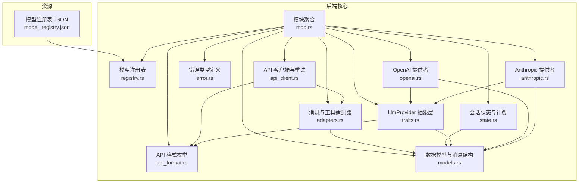

**图表来源**
- [registry.rs:1-103](file://src-tauri/src/core/registry.rs#L1-L103)
- [api_format.rs:1-93](file://src-tauri/src/core/llm/api_format.rs#L1-L93)
- [adapters.rs:1-259](file://src-tauri/src/core/adapters.rs#L1-L259)
- [models.rs:1-256](file://src-tauri/src/core/models.rs#L1-L256)
- [api_client.rs:1-189](file://src-tauri/src/core/llm/api_client.rs#L1-L189)
- [state.rs:1-78](file://src-tauri/src/core/state.rs#L1-L78)
- [error.rs:1-141](file://src-tauri/src/core/error.rs#L1-L141)
- [traits.rs:1-42](file://src-tauri/src/core/traits.rs#L1-L42)
- [openai.rs:1-105](file://src-tauri/src/core/providers/openai.rs#L1-L105)
- [anthropic.rs:1-52](file://src-tauri/src/core/providers/anthropic.rs#L1-L52)
- [model_registry.json:1-496](file://src-tauri/model_registry.json#L1-L496)

**章节来源**
- [mod.rs:1-64](file://src-tauri/src/core/mod.rs#L1-L64)
- [model_registry.json:1-496](file://src-tauri/model_registry.json#L1-L496)

## 核心组件
- LlmProvider 抽象层
  - 定义统一的 LLM 提供者接口，支持 OpenAI 和 Anthropic API 差异
  - 提供请求体构建、API 格式识别、流式支持等功能
- OpenAIProvider 实现
  - 支持 DeepSeek、GPT、Gemini、Qwen、豆包、MIMO 等 OpenAI 兼容 API
  - 统一思考模式参数（reasoning_effort、thinking、thinkingBudget、enable_thinking）
- AnthropicProvider 实现
  - 支持 Claude 系列模型的扩展思考功能
  - 处理 Anthropic 特有的 thinking 参数和预算配置
- 模型注册表与查询
  - 编译时内嵌 JSON，提供模型能力查询与前端下拉列表
  - 支持精确匹配与双向模糊匹配
- API 格式与认证头
  - 枚举化 API 格式（OpenAI、Anthropic），自动设置认证头与版本头
- 消息与工具适配器
  - 将内部消息格式翻译为 OpenAI/Anthropic 请求体
  - 工具定义转换与流式工具输入解析
- API 客户端与重试
  - 统一封装 HTTP 调用、指数退避重试、错误分类
- 会话状态与计费
  - 会话内存、取消令牌、权限队列
  - 子代理流式响应中累计 input/output tokens

**章节来源**
- [traits.rs:7-29](file://src-tauri/src/core/traits.rs#L7-L29)
- [openai.rs:12-105](file://src-tauri/src/core/providers/openai.rs#L12-L105)
- [anthropic.rs:7-52](file://src-tauri/src/core/providers/anthropic.rs#L7-L52)
- [registry.rs:53-103](file://src-tauri/src/core/registry.rs#L53-L103)
- [api_format.rs:3-43](file://src-tauri/src/core/llm/api_format.rs#L3-L43)
- [adapters.rs:84-259](file://src-tauri/src/core/adapters.rs#L84-L259)
- [api_client.rs:7-189](file://src-tauri/src/core/llm/api_client.rs#L7-L189)
- [state.rs:19-77](file://src-tauri/src/core/state.rs#L19-L77)
- [models.rs:3-256](file://src-tauri/src/core/models.rs#L3-L256)

## 架构总览
系统采用"注册表驱动 + LlmProvider 抽象层 + 适配器 + 统一客户端"的分层设计：
- 注册表层：提供模型能力元数据（是否支持思考、温度、最大输出、视觉等）
- 抽象层：LlmProvider trait 统一不同供应商的 API 差异
- 适配层：根据 API 格式与模型能力，构造请求体并处理响应差异
- 客户端层：封装网络调用、重试与错误处理
- 会话层：维护会话上下文、权限与计费统计

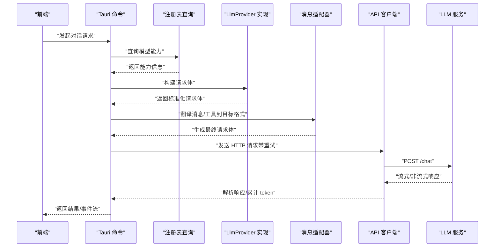

**图表来源**
- [registry.rs:91-103](file://src-tauri/src/core/registry.rs#L91-L103)
- [traits.rs:8-29](file://src-tauri/src/core/traits.rs#L8-L29)
- [openai.rs:23-105](file://src-tauri/src/core/providers/openai.rs#L23-L105)
- [anthropic.rs:10-52](file://src-tauri/src/core/providers/anthropic.rs#L10-L52)
- [adapters.rs:84-259](file://src-tauri/src/core/adapters.rs#L84-L259)
- [api_client.rs:7-189](file://src-tauri/src/core/llm/api_client.rs#L7-L189)
- [agent_tools.rs:325-363](file://src-tauri/src/core/tools/agent_tools.rs#L325-L363)

## 详细组件分析

### LlmProvider 抽象层
LlmProvider trait 是本次更新的核心抽象，统一了不同 LLM 提供商的 API 差异：

- **统一接口设计**
  - `api_format()` 返回 API 格式枚举
  - `build_request_body()` 统一构建请求体
  - `stream()` 默认返回 true，支持流式请求
- **实现类对比**
  - OpenAIProvider：支持 DeepSeek、GPT、Gemini、Qwen 等 OpenAI 兼容 API
  - AnthropicProvider：专注 Claude 系列模型的扩展思考功能

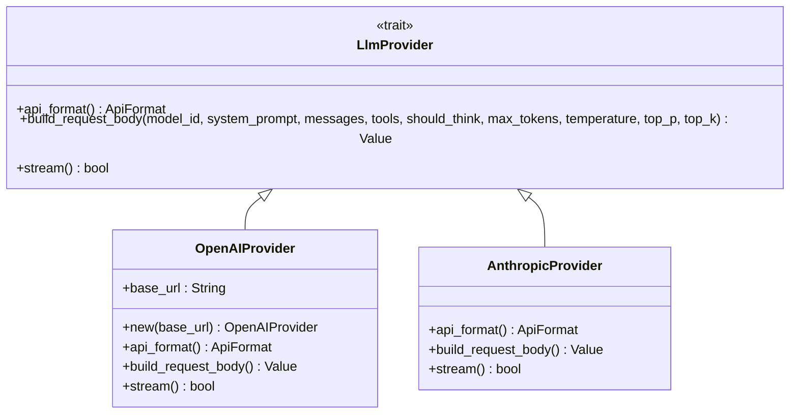

**图表来源**
- [traits.rs:7-29](file://src-tauri/src/core/traits.rs#L7-L29)
- [openai.rs:12-21](file://src-tauri/src/core/providers/openai.rs#L12-L21)
- [anthropic.rs:7-8](file://src-tauri/src/core/providers/anthropic.rs#L7-L8)

**章节来源**
- [traits.rs:7-29](file://src-tauri/src/core/traits.rs#L7-L29)
- [openai.rs:12-105](file://src-tauri/src/core/providers/openai.rs#L12-L105)
- [anthropic.rs:7-52](file://src-tauri/src/core/providers/anthropic.rs#L7-L52)

### OpenAIProvider 实现
OpenAIProvider 支持多种 OpenAI 兼容的 LLM 提供商：

- **支持的模型系列**
  - DeepSeek：V4 Pro、V4 Flash、Chat、Reasoner
  - GPT：5.5、5.4、o3、o4-mini、o1 等
  - Gemini：2.5 Pro、2.5 Flash、2.0 Flash
  - Qwen：3-235B-A22B、3-32B、3-14B、Plus、Turbo
  - 豆包：Seed 2.0 Pro、Lite
  - MIMO：V2 Flash
- **思考模式参数支持**
  - reasoning_effort：none、low、medium、high、xhigh
  - thinking：enabled/disabled
  - thinkingBudget：0-32768
  - enable_thinking：true/false
- **推理内容回填**
  - DeepSeek 模型的推理内容回填支持

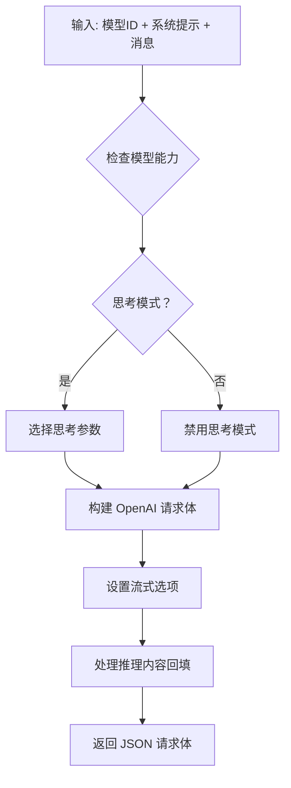

**图表来源**
- [openai.rs:28-105](file://src-tauri/src/core/providers/openai.rs#L28-L105)

**章节来源**
- [openai.rs:12-105](file://src-tauri/src/core/providers/openai.rs#L12-L105)
- [model_registry.json:5-496](file://src-tauri/model_registry.json#L5-L496)

### AnthropicProvider 实现
AnthropicProvider 专门处理 Claude 系列模型：

- **支持的 Claude 模型**
  - Opus 4.5、Sonnet 4.5、3.7 Sonnet、3.5 Sonnet、3.5 Haiku
- **扩展思考功能**
  - thinking 参数：enabled/disabled
  - budget_tokens：1024（默认）
  - 自动调整 max_tokens：<=1024 时提升到 4096
- **视觉支持**
  - 部分 Claude 模型支持视觉理解

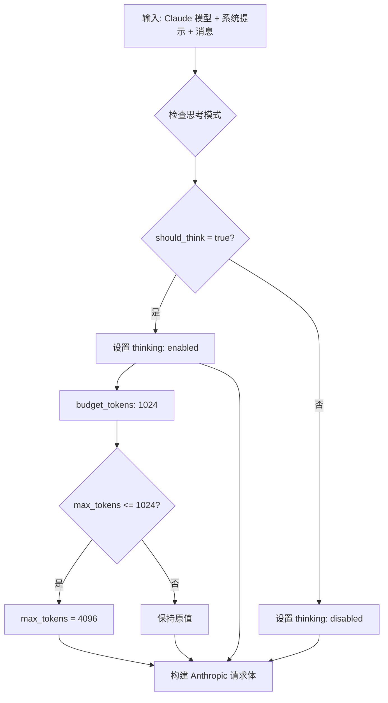

**图表来源**
- [anthropic.rs:15-52](file://src-tauri/src/core/providers/anthropic.rs#L15-L52)

**章节来源**
- [anthropic.rs:7-52](file://src-tauri/src/core/providers/anthropic.rs#L7-L52)
- [model_registry.json:64-135](file://src-tauri/model_registry.json#L64-L135)

### 模型注册表与查询
- 数据来源：编译时内嵌 model_registry.json，避免运行时文件依赖
- 结构要点：
  - 模型唯一标识、提供商、显示名、推荐 API 格式
  - 能力字段：是否支持流式、思考模式、思考参数名、温度、最大输出、视觉、备注
- 查询策略：
  - 精确匹配优先
  - 双向模糊匹配（注册表 id 包含输入 或 输入包含注册表 id）
- 对前端的暴露：
  - 提供查询能力与完整列表命令，便于 UI 下拉选择与动态配置

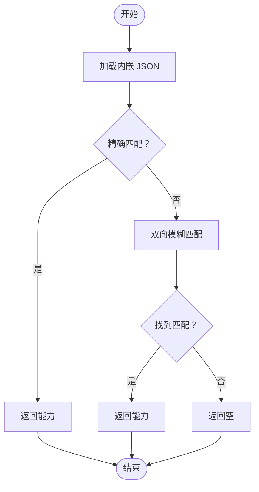

**图表来源**
- [registry.rs:57-89](file://src-tauri/src/core/registry.rs#L57-L89)

**章节来源**
- [registry.rs:53-103](file://src-tauri/src/core/registry.rs#L53-L103)
- [model_registry.json:1-496](file://src-tauri/model_registry.json#L1-L496)

### API 格式与认证头
- 枚举化 API 格式（OpenAI、Anthropic），支持字符串互转与快速判断
- 认证头：
  - OpenAI：Authorization: Bearer {key}
  - Anthropic：x-api-key: {key}
- 版本头：
  - Anthropic 需要 anthropic-version: 2023-06-01

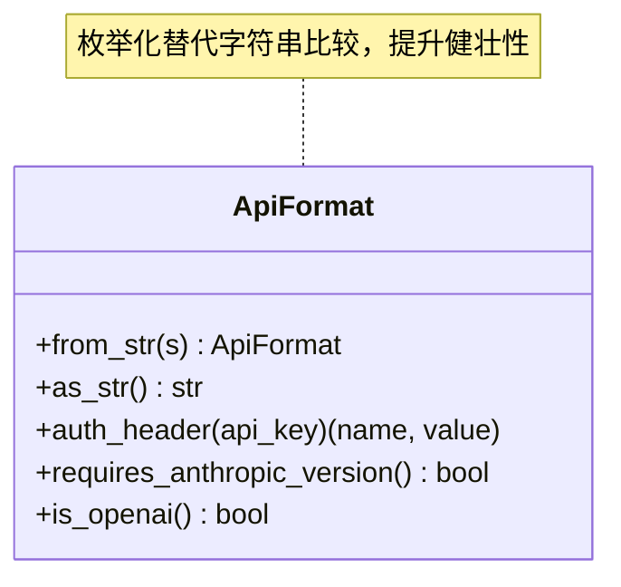

**图表来源**
- [api_format.rs:3-43](file://src-tauri/src/core/llm/api_format.rs#L3-L43)

**章节来源**
- [api_format.rs:3-43](file://src-tauri/src/core/llm/api_format.rs#L3-L43)

### 消息与工具适配器
- 消息翻译：
  - 将内部 Message/Content/ContentBlock 翻译为 OpenAIMessage（支持文本、图片、工具结果、思考块）
  - 支持"思考内容回填"以兼容非 DeepSeek 模型的推理占位
- 工具翻译：
  - 将工具定义从 Anthropic/OpenAI 风格转换为 OpenAI function 类型
- 流式工具输入解析：
  - 针对特殊控制字符进行规范化，提升解析鲁棒性

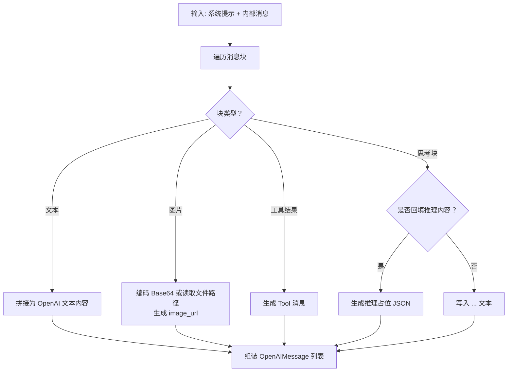

**图表来源**
- [adapters.rs:84-223](file://src-tauri/src/core/adapters.rs#L84-L223)

**章节来源**
- [adapters.rs:84-259](file://src-tauri/src/core/adapters.rs#L84-L259)
- [models.rs:144-188](file://src-tauri/src/core/models.rs#L144-L188)

### API 客户端与重试
- 统一请求入口：
  - 自动设置认证头与版本头
  - 根据 API 格式决定请求体与响应解析键位
- 重试机制：
  - 指数退避（2^attempt 秒），最多 N 次
  - 发送 UI 事件提示重试进度
- 错误分类：
  - 缺少 API Key、HTTP 错误、网络错误、解析错误、重试耗尽

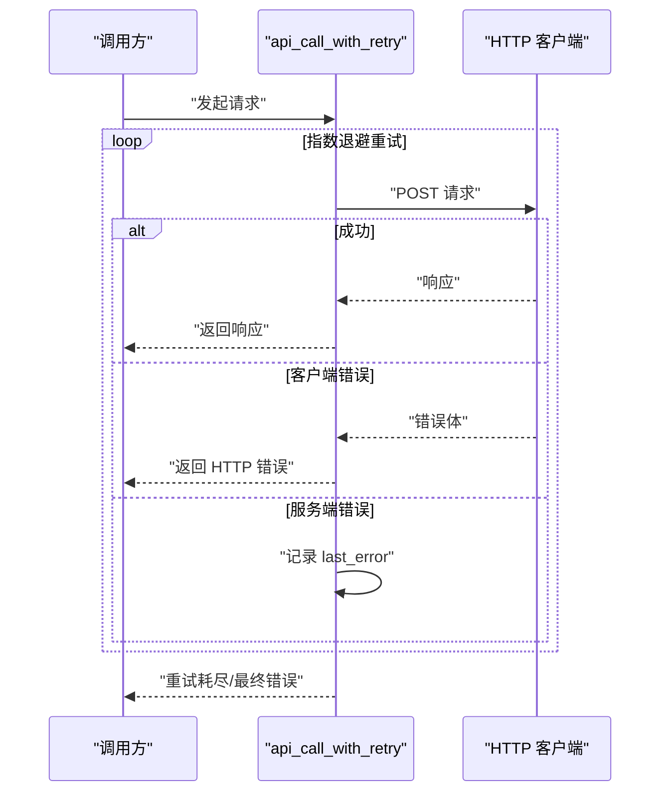

**图表来源**
- [api_client.rs:7-76](file://src-tauri/src/core/llm/api_client.rs#L7-L76)
- [error.rs:38-55](file://src-tauri/src/core/error.rs#L38-L55)

**章节来源**
- [api_client.rs:7-189](file://src-tauri/src/core/llm/api_client.rs#L7-L189)
- [error.rs:38-55](file://src-tauri/src/core/error.rs#L38-L55)

### 会话状态与计费统计
- 会话上下文：
  - 维护 SessionMemory（消息、上下文、步骤、计划文档）
  - 取消令牌、权限队列、工作目录
- 计费统计：
  - 在子代理流式处理中累计 input/output tokens
  - 支持取消与中断场景下的统计一致性

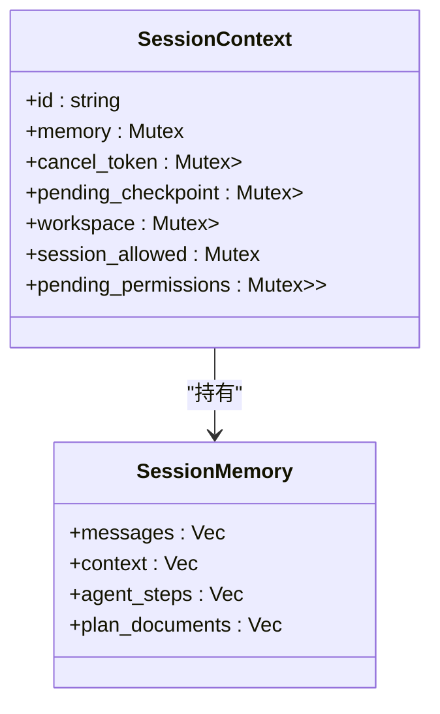

**图表来源**
- [state.rs:19-77](file://src-tauri/src/core/state.rs#L19-L77)
- [models.rs:196-256](file://src-tauri/src/core/models.rs#L196-L256)

**章节来源**
- [state.rs:19-77](file://src-tauri/src/core/state.rs#L19-L77)
- [models.rs:196-256](file://src-tauri/src/core/models.rs#L196-L256)
- [agent_tools.rs:355-363](file://src-tauri/src/core/tools/agent_tools.rs#L355-L363)

## 依赖关系分析
- 模块耦合
  - registry.rs 依赖 model_registry.json（编译时内嵌）
  - api_client.rs 依赖 api_format.rs 与 adapters.rs
  - adapters.rs 依赖 models.rs 的消息结构
  - state.rs 依赖 models.rs 的会话数据结构
  - traits.rs 定义 LlmProvider 抽象层
  - openai.rs 和 anthropic.rs 实现 LlmProvider
- 外部依赖
  - reqwest（HTTP 客户端）
  - serde/serde_json（序列化/反序列化）
  - tokio（异步与退避）

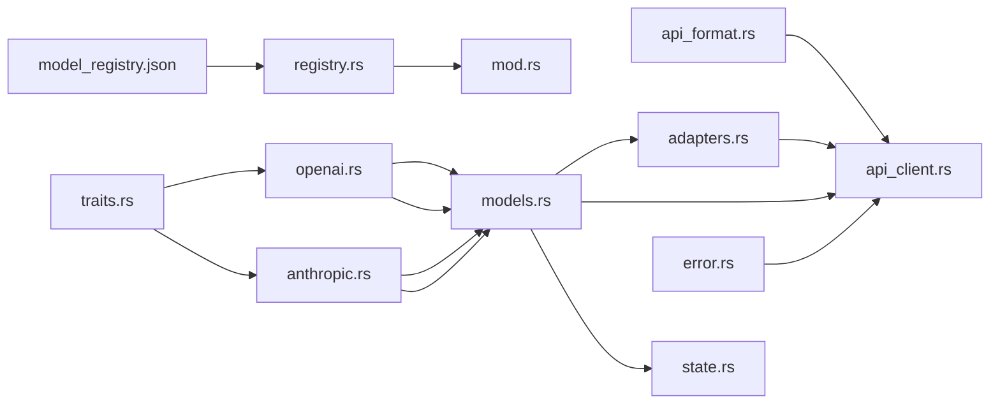

**图表来源**
- [registry.rs:53-66](file://src-tauri/src/core/registry.rs#L53-L66)
- [api_client.rs:4-6](file://src-tauri/src/core/llm/api_client.rs#L4-L6)
- [adapters.rs:2-6](file://src-tauri/src/core/adapters.rs#L2-L6)
- [models.rs:1-1](file://src-tauri/src/core/models.rs#L1-L1)
- [state.rs:5-6](file://src-tauri/src/core/state.rs#L5-L6)
- [error.rs:1-2](file://src-tauri/src/core/error.rs#L1-L2)
- [traits.rs:1-5](file://src-tauri/src/core/traits.rs#L1-L5)
- [openai.rs:1-5](file://src-tauri/src/core/providers/openai.rs#L1-L5)
- [anthropic.rs:1-5](file://src-tauri/src/core/providers/anthropic.rs#L1-L5)

**章节来源**
- [mod.rs:1-27](file://src-tauri/src/core/mod.rs#L1-L27)

## 性能考量
- 流式输出
  - OpenAI/Anthropic 均支持流式，建议在长对话与工具调用场景启用，降低首字延迟
- 思考模式与温度
  - 部分推理模型开启思考后不可调温度；应依据注册表能力动态调整参数
- 最大输出与上下文
  - 不同模型 max_tokens 与上下文长度差异较大，需结合任务复杂度选择合适模型
- 重试与退避
  - 指数退避可缓解瞬时抖动，但应限制最大重试次数与等待时间，避免阻塞 UI
- 图像与多模态
  - 图片 Base64 编码会增加体积，建议优先使用文件路径或 CDN 地址
- LlmProvider 抽象层优势
  - 统一接口减少分支判断开销
  - 提供默认实现，简化新提供者接入

## 故障排查指南
- 常见错误类型
  - 缺少 API Key、HTTP 错误、网络错误、解析错误、重试耗尽
- 排查步骤
  - 确认 API Key 与认证头正确
  - 检查 Anthropic 版本头是否设置
  - 查看重试日志与 UI 事件提示
  - 核对模型能力与请求参数是否冲突（如思考模式与温度）
- 相关实现参考
  - 错误类型定义与重试逻辑

**章节来源**
- [error.rs:38-55](file://src-tauri/src/core/error.rs#L38-L55)
- [api_client.rs:7-76](file://src-tauri/src/core/llm/api_client.rs#L7-L76)

## 结论
JarvisAgent 的多模型支持通过"编译时内嵌注册表 + LlmProvider 抽象层 + 适配器 + 统一客户端"的架构，实现了对多家 LLM 的统一接入与灵活切换。新增的 LlmProvider 抽象层有效统一了 OpenAI/Anthropic 的 API 差异，配合扩展的 496 行模型注册表，现已支持 20+ 主流 LLM 模型。借助能力查询与参数映射，系统可在不同模型间平滑迁移；通过流式处理与计费统计，兼顾性能与成本控制。建议在新增模型时严格遵循注册表规范与适配器约定，确保一致的用户体验与可观测性。

## 附录

### 如何添加新模型
- 步骤
  - 在 model_registry.json 中新增一条记录，填写 id/provider/displayName/apiFormat/capabilities
  - 若模型有独特的思考参数或能力，完善 capabilities 字段
  - 如需新的 API 格式，请扩展 ApiFormat 并在 api_client.rs 中补充对应请求体构造与响应解析
  - 如内部消息结构有变化，更新 models.rs 并同步 adapters.rs 的翻译逻辑
- 示例参考
  - 注册表新增项位置：[model_registry.json:495-496](file://src-tauri/model_registry.json#L495-L496)
  - 能力查询与命令暴露：[registry.rs:91-103](file://src-tauri/src/core/registry.rs#L91-L103)
  - API 格式扩展：[api_format.rs:3-43](file://src-tauri/src/core/llm/api_format.rs#L3-L43)
  - 请求体构造与响应解析：[api_client.rs:78-189](file://src-tauri/src/core/llm/api_client.rs#L78-L189)

**章节来源**
- [model_registry.json:1-496](file://src-tauri/model_registry.json#L1-L496)
- [registry.rs:91-103](file://src-tauri/src/core/registry.rs#L91-L103)
- [api_format.rs:3-43](file://src-tauri/src/core/llm/api_format.rs#L3-L43)
- [api_client.rs:78-189](file://src-tauri/src/core/llm/api_client.rs#L78-L189)

### 如何添加新 LLM 提供商
- 步骤
  - 创建新的提供者结构体，实现 LlmProvider trait
  - 在 providers/mod.rs 中导出新提供者
  - 在模型注册表中添加支持该提供者的模型条目
  - 如需特殊的请求体构造逻辑，在新提供者中实现
- 示例参考
  - OpenAIProvider 实现：[openai.rs:12-105](file://src-tauri/src/core/providers/openai.rs#L12-L105)
  - AnthropicProvider 实现：[anthropic.rs:7-52](file://src-tauri/src/core/providers/anthropic.rs#L7-L52)
  - LlmProvider 抽象层：[traits.rs:7-29](file://src-tauri/src/core/traits.rs#L7-L29)

**章节来源**
- [openai.rs:12-105](file://src-tauri/src/core/providers/openai.rs#L12-L105)
- [anthropic.rs:7-52](file://src-tauri/src/core/providers/anthropic.rs#L7-L52)
- [traits.rs:7-29](file://src-tauri/src/core/traits.rs#L7-L29)

### 模型切换与参数映射
- 切换机制
  - 前端通过 Tauri 命令查询模型能力，后端返回能力信息，前端据此渲染参数面板
- 参数映射
  - 思考模式：根据 apiFormat 与 capabilities.thinkingParam 设置相应字段
  - 温度与采样：受模型能力限制，需在注册表中声明
  - 最大输出：按模型 max_tokens 限制
- 参考实现
  - 能力查询与命令：[registry.rs:68-96](file://src-tauri/src/core/registry.rs#L68-L96)
  - 请求体构造（OpenAI/Anthropic）：[api_client.rs:105-139](file://src-tauri/src/core/llm/api_client.rs#L105-L139)
  - 消息翻译（思考回填）：[adapters.rs:163-215](file://src-tauri/src/core/adapters.rs#L163-L215)

**章节来源**
- [registry.rs:68-96](file://src-tauri/src/core/registry.rs#L68-L96)
- [api_client.rs:105-139](file://src-tauri/src/core/llm/api_client.rs#L105-L139)
- [adapters.rs:163-215](file://src-tauri/src/core/adapters.rs#L163-L215)

### Token 计费统计与成本控制
- 统计位置
  - 子代理流式处理中累计 input/output tokens
- 成本控制策略
  - 优先选择具备"思考预算/思考参数"的模型，合理设置思考强度
  - 控制 max_tokens 与上下文长度，避免不必要的长上下文
  - 对高频工具代理使用低成本模型（如 mini/lite）
- 参考实现
  - 流式统计：[agent_tools.rs:355-363](file://src-tauri/src/core/tools/agent_tools.rs#L355-L363)

**章节来源**
- [agent_tools.rs:355-363](file://src-tauri/src/core/tools/agent_tools.rs#L355-L363)

### 故障转移机制
- 重试策略
  - 指数退避、最大重试次数限制、UI 事件提示
- 失败分类
  - 客户端错误（4xx）直接返回，服务端错误记录 last_error
- 参考实现
  - 重试与错误处理：[api_client.rs:7-76](file://src-tauri/src/core/llm/api_client.rs#L7-L76)
  - 错误类型：[error.rs:38-55](file://src-tauri/src/core/error.rs#L38-L55)

**章节来源**
- [api_client.rs:7-76](file://src-tauri/src/core/llm/api_client.rs#L7-L76)
- [error.rs:38-55](file://src-tauri/src/core/error.rs#L38-L55)

### 支持的模型列表
系统现已支持以下主流 LLM 模型：

- **DeepSeek 系列**
  - V4 Pro、V4 Flash、Chat、Reasoner
- **Anthropic Claude 系列**
  - Opus 4.5、Sonnet 4.5、3.7 Sonnet、3.5 Sonnet、3.5 Haiku
- **OpenAI GPT 系列**
  - 5.5、5.4、o3、o4-mini、o1、4.1、4o 等
- **Google Gemini 系列**
  - 2.5 Pro、2.5 Flash、2.0 Flash
- **Alibaba Qwen 系列**
  - 3-235B-A22B、3-32B、3-14B、Plus、Turbo
- **ByteDance 豆包系列**
  - Seed 2.0 Pro、Lite
- **XiaoMi MIMO 系列**
  - V2 Flash

**章节来源**
- [model_registry.json:1-496](file://src-tauri/model_registry.json#L1-L496)