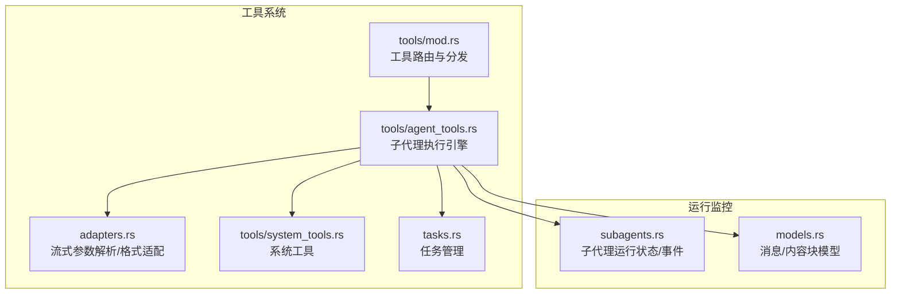
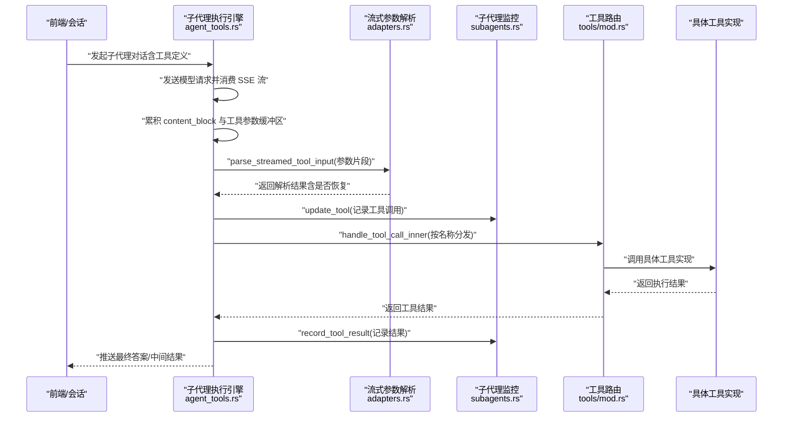
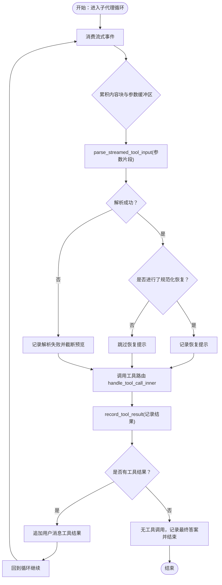
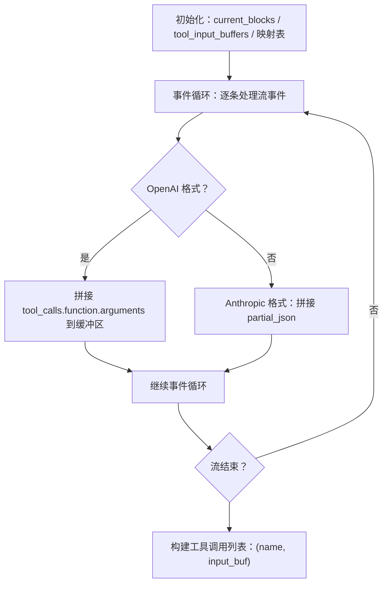
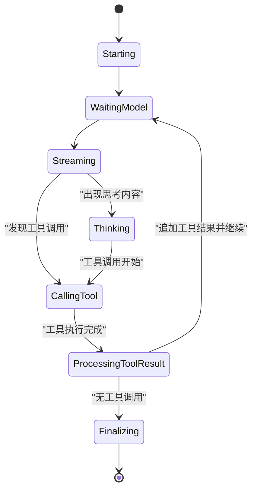
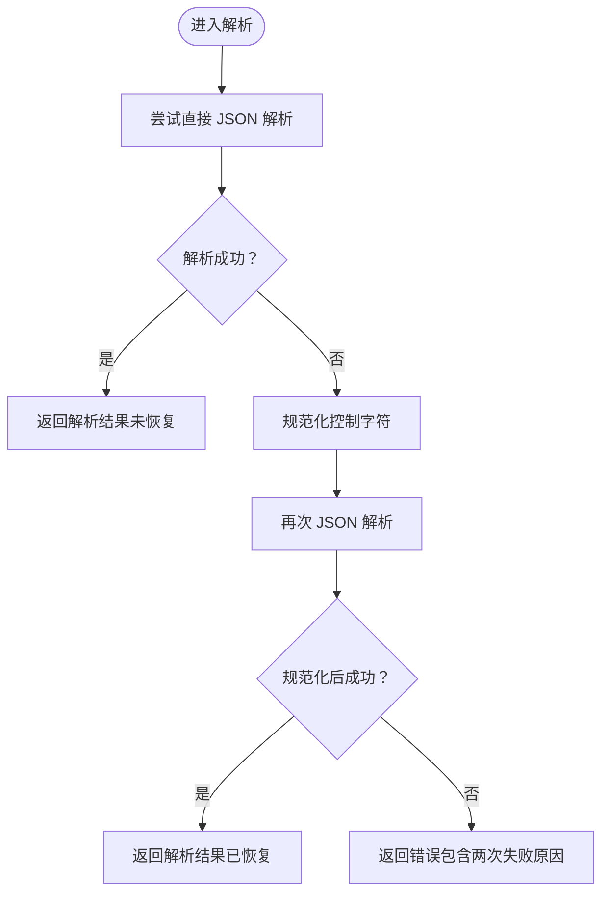
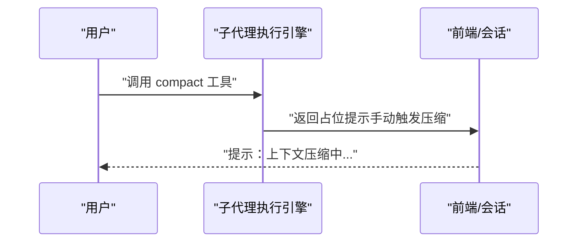
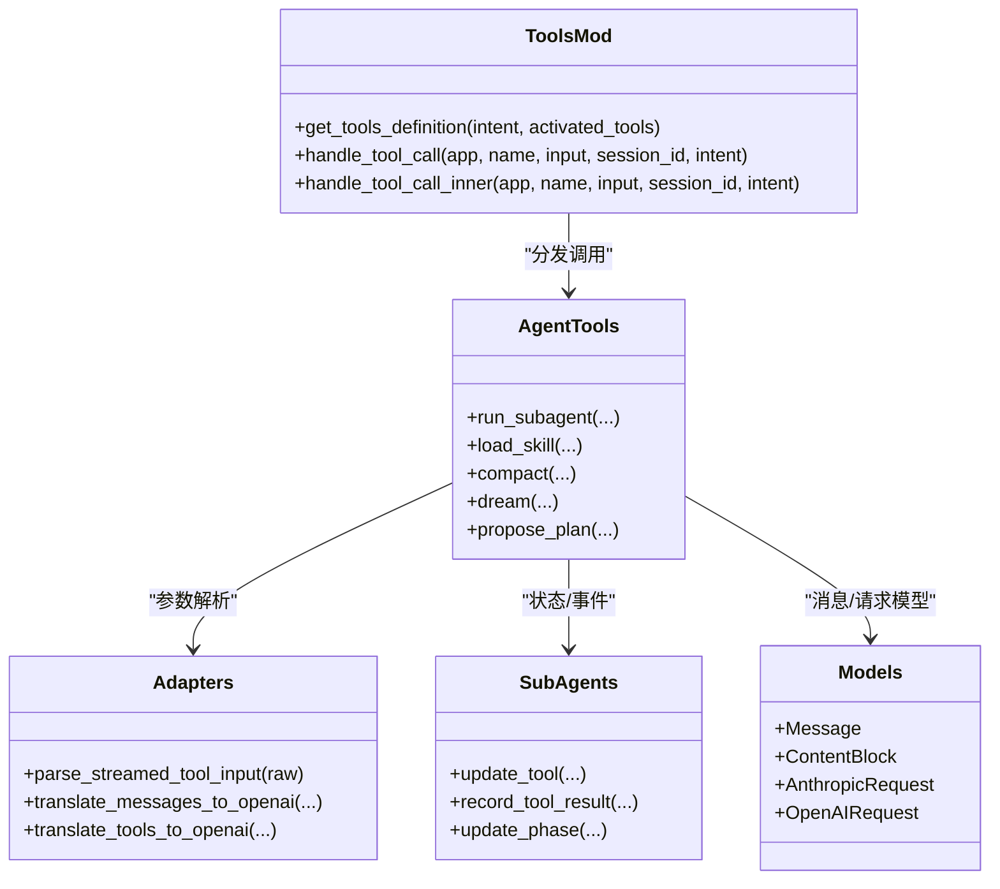
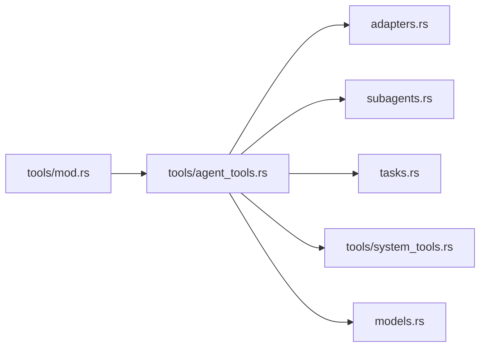

# 工具调用执行

<cite>
**本文引用的文件**   
- [src-tauri/src/core/tools/mod.rs](file://src-tauri/src/core/tools/mod.rs)
- [src-tauri/src/core/tools/agent_tools.rs](file://src-tauri/src/core/tools/agent_tools.rs)
- [src-tauri/src/core/adapters.rs](file://src-tauri/src/core/adapters.rs)
- [src-tauri/src/core/subagents.rs](file://src-tauri/src/core/subagents.rs)
- [src-tauri/src/core/models.rs](file://src-tauri/src/core/models.rs)
- [src-tauri/src/core/tasks.rs](file://src-tauri/src/core/tasks.rs)
- [src-tauri/src/core/tools/system_tools.rs](file://src-tauri/src/core/tools/system_tools.rs)
</cite>

## 目录
1. [简介](#简介)
2. [项目结构](#项目结构)
3. [核心组件](#核心组件)
4. [架构总览](#架构总览)
5. [详细组件分析](#详细组件分析)
6. [依赖关系分析](#依赖关系分析)
7. [性能考量](#性能考量)
8. [故障排除指南](#故障排除指南)
9. [结论](#结论)
10. [附录](#附录)

## 简介
本文件聚焦于 JarvisAgent 的“工具调用执行系统”，围绕以下目标展开：
- 深入解释 execute_tool_calls 的工作流程（在子代理执行引擎中体现）
- 工具输入缓冲区的管理策略与流式参数解析
- 工具调用的生命周期：从流式接收、参数解析、执行到结果记录
- 参数解析、错误恢复机制与手动压缩触发
- 自定义工具开发指南、异步执行与上下文管理
- 性能监控方案与故障排除技巧

## 项目结构
工具调用执行系统主要位于 Rust 后端核心模块中，关键文件如下：
- 工具路由与分发：tools/mod.rs
- 子代理执行引擎与工具调用生命周期：tools/agent_tools.rs
- 流式参数解析与格式适配：adapters.rs
- 子代理运行期状态与事件：subagents.rs
- 数据模型与消息结构：models.rs
- 任务管理（用于 dream 工具的摘要输出）：tasks.rs
- 系统工具（工作区与系统信息）：tools/system_tools.rs

**图表来源**
- [src-tauri/src/core/tools/mod.rs:157-236](file://src-tauri/src/core/tools/mod.rs#L157-L236)
- [src-tauri/src/core/tools/agent_tools.rs:61-720](file://src-tauri/src/core/tools/agent_tools.rs#L61-L720)
- [src-tauri/src/core/adapters.rs:42-62](file://src-tauri/src/core/adapters.rs#L42-L62)
- [src-tauri/src/core/subagents.rs:73-200](file://src-tauri/src/core/subagents.rs#L73-L200)
- [src-tauri/src/core/models.rs:143-178](file://src-tauri/src/core/models.rs#L143-L178)
- [src-tauri/src/core/tasks.rs:144-200](file://src-tauri/src/core/tasks.rs#L144-L200)
- [src-tauri/src/core/tools/system_tools.rs:18-89](file://src-tauri/src/core/tools/system_tools.rs#L18-L89)

**章节来源**
- [src-tauri/src/core/tools/mod.rs:157-236](file://src-tauri/src/core/tools/mod.rs#L157-L236)
- [src-tauri/src/core/tools/agent_tools.rs:61-720](file://src-tauri/src/core/tools/agent_tools.rs#L61-L720)
- [src-tauri/src/core/adapters.rs:42-62](file://src-tauri/src/core/adapters.rs#L42-L62)
- [src-tauri/src/core/subagents.rs:73-200](file://src-tauri/src/core/subagents.rs#L73-L200)
- [src-tauri/src/core/models.rs:143-178](file://src-tauri/src/core/models.rs#L143-L178)
- [src-tauri/src/core/tasks.rs:144-200](file://src-tauri/src/core/tasks.rs#L144-L200)
- [src-tauri/src/core/tools/system_tools.rs:18-89](file://src-tauri/src/core/tools/system_tools.rs#L18-L89)

## 核心组件
- 工具路由与分发：根据工具名将调用分发至具体模块，支持子代理专用工具与通用工具。
- 子代理执行引擎：负责构建请求、消费流式响应、管理工具输入缓冲区、解析参数、执行工具、记录结果与事件。
- 流式参数解析：对 OpenAI/Anthropic 流中的工具参数进行拼接与 JSON 规范化解析。
- 子代理监控：维护运行状态、阶段、令牌用量、事件推送与取消令牌。
- 数据模型：统一的消息与内容块结构，支撑工具调用的多模态内容。
- 任务管理：为 dream 工具提供项目全局任务摘要。

**章节来源**
- [src-tauri/src/core/tools/mod.rs:157-236](file://src-tauri/src/core/tools/mod.rs#L157-L236)
- [src-tauri/src/core/tools/agent_tools.rs:61-720](file://src-tauri/src/core/tools/agent_tools.rs#L61-L720)
- [src-tauri/src/core/adapters.rs:42-62](file://src-tauri/src/core/adapters.rs#L42-L62)
- [src-tauri/src/core/subagents.rs:73-200](file://src-tauri/src/core/subagents.rs#L73-L200)
- [src-tauri/src/core/models.rs:143-178](file://src-tauri/src/core/models.rs#L143-L178)
- [src-tauri/src/core/tasks.rs:144-200](file://src-tauri/src/core/tasks.rs#L144-L200)

## 架构总览
下图展示了从工具调用到结果记录的端到端流程，包括流式解析、参数恢复、工具执行与事件上报。

**图表来源**
- [src-tauri/src/core/tools/agent_tools.rs:316-720](file://src-tauri/src/core/tools/agent_tools.rs#L316-L720)
- [src-tauri/src/core/adapters.rs:42-62](file://src-tauri/src/core/adapters.rs#L42-L62)
- [src-tauri/src/core/subagents.rs:234-302](file://src-tauri/src/core/subagents.rs#L234-L302)
- [src-tauri/src/core/tools/mod.rs:157-236](file://src-tauri/src/core/tools/mod.rs#L157-L236)

## 详细组件分析

### 组件一：execute_tool_calls 的工作流程（在子代理执行引擎中体现）
- 流式接收与内容块累积：引擎在消费 SSE 流时，根据事件类型将文本、思考与工具调用分别累积到内容块列表。
- 工具输入缓冲区管理：针对 OpenAI/Anthropic 不同格式，分别维护索引映射与字符串缓冲区，逐步拼接参数片段。
- 参数解析与恢复：使用解析器对拼接的参数字符串进行 JSON 解析；若首次失败则进行控制字符规范化后再试，标记“是否恢复”。
- 工具调用与结果记录：解析成功后更新监控状态、发出事件；调用工具路由分发到具体实现；记录工具结果并推进消息历史。

**图表来源**
- [src-tauri/src/core/tools/agent_tools.rs:316-720](file://src-tauri/src/core/tools/agent_tools.rs#L316-L720)
- [src-tauri/src/core/adapters.rs:42-62](file://src-tauri/src/core/adapters.rs#L42-L62)
- [src-tauri/src/core/subagents.rs:269-302](file://src-tauri/src/core/subagents.rs#L269-L302)

**章节来源**
- [src-tauri/src/core/tools/agent_tools.rs:316-720](file://src-tauri/src/core/tools/agent_tools.rs#L316-L720)
- [src-tauri/src/core/adapters.rs:42-62](file://src-tauri/src/core/adapters.rs#L42-L62)
- [src-tauri/src/core/subagents.rs:234-302](file://src-tauri/src/core/subagents.rs#L234-L302)

### 组件二：工具输入缓冲区的管理
- OpenAI 格式：通过索引映射将不同工具调用的参数片段映射到同一内容块索引，使用字符串缓冲区逐步拼接。
- Anthropic 格式：在 content_block_delta 中监听 partial_json 片段，同样写入对应索引的缓冲区。
- 缓冲区与内容块一一对应，便于后续解析与结果组装。

**图表来源**
- [src-tauri/src/core/tools/agent_tools.rs:406-437](file://src-tauri/src/core/tools/agent_tools.rs#L406-L437)
- [src-tauri/src/core/tools/agent_tools.rs:482-522](file://src-tauri/src/core/tools/agent_tools.rs#L482-L522)

**章节来源**
- [src-tauri/src/core/tools/agent_tools.rs:406-437](file://src-tauri/src/core/tools/agent_tools.rs#L406-L437)
- [src-tauri/src/core/tools/agent_tools.rs:482-522](file://src-tauri/src/core/tools/agent_tools.rs#L482-L522)

### 组件三：工具调用的生命周期
- 阶段划分：Starting → WaitingModel → Streaming → Thinking → CallingTool → ProcessingToolResult → Finalizing
- 生命周期事件：每次阶段变更与工具调用/结果记录都会产生事件，包含工具名、输入/输出摘要、令牌用量与轮次计数。
- 取消机制：每个运行实例持有取消令牌，可在任意阶段检测并优雅退出。

**图表来源**
- [src-tauri/src/core/subagents.rs:19-29](file://src-tauri/src/core/subagents.rs#L19-L29)
- [src-tauri/src/core/subagents.rs:234-302](file://src-tauri/src/core/subagents.rs#L234-L302)

**章节来源**
- [src-tauri/src/core/subagents.rs:19-29](file://src-tauri/src/core/subagents.rs#L19-L29)
- [src-tauri/src/core/subagents.rs:234-302](file://src-tauri/src/core/subagents.rs#L234-L302)

### 组件四：参数解析与错误恢复
- 解析流程：先尝试直接 JSON 解析；失败则对字符串中的控制字符进行规范化后再试；返回值包含“是否恢复”的布尔标记。
- 失败处理：记录工具名、错误原因与截断的参数片段，同时向前端推送错误提示事件。
- 恢复提示：若发生恢复，会向聊天流推送一条提示，告知参数格式已被自动修复。

**图表来源**
- [src-tauri/src/core/adapters.rs:42-62](file://src-tauri/src/core/adapters.rs#L42-L62)
- [src-tauri/src/core/tools/agent_tools.rs:620-665](file://src-tauri/src/core/tools/agent_tools.rs#L620-L665)

**章节来源**
- [src-tauri/src/core/adapters.rs:42-62](file://src-tauri/src/core/adapters.rs#L42-L62)
- [src-tauri/src/core/tools/agent_tools.rs:620-665](file://src-tauri/src/core/tools/agent_tools.rs#L620-L665)

### 组件五：手动压缩触发
- compact 工具：在子代理执行引擎中预留“手动触发上下文压缩”的占位逻辑，实际行为由上层会话或前端处理。
- 压缩策略：在无限会话场景中，通常采用多层压缩（微压缩、自动压缩、手动压缩），以控制上下文长度与成本。

**图表来源**
- [src-tauri/src/core/tools/agent_tools.rs:40-59](file://src-tauri/src/core/tools/agent_tools.rs#L40-L59)

**章节来源**
- [src-tauri/src/core/tools/agent_tools.rs:40-59](file://src-tauri/src/core/tools/agent_tools.rs#L40-L59)

### 组件六：自定义工具开发指南
- 工具定义：在工具模块中新增实现，并在工具路由中注册名称与分发逻辑。
- 输入解析：遵循统一的 JSON Schema，确保参数可被流式拼接与解析。
- 异步执行：工具内部可使用异步任务与通道，结合取消令牌实现可中断执行。
- 上下文管理：通过会话管理器获取工作目录、权限与内存状态，保证工具在沙箱内安全执行。
- 事件上报：在关键节点推送事件到前端，便于可视化与调试。

**图表来源**
- [src-tauri/src/core/tools/mod.rs:157-236](file://src-tauri/src/core/tools/mod.rs#L157-L236)
- [src-tauri/src/core/tools/agent_tools.rs:61-720](file://src-tauri/src/core/tools/agent_tools.rs#L61-L720)
- [src-tauri/src/core/adapters.rs:84-258](file://src-tauri/src/core/adapters.rs#L84-L258)
- [src-tauri/src/core/subagents.rs:234-302](file://src-tauri/src/core/subagents.rs#L234-L302)
- [src-tauri/src/core/models.rs:143-178](file://src-tauri/src/core/models.rs#L143-L178)

**章节来源**
- [src-tauri/src/core/tools/mod.rs:157-236](file://src-tauri/src/core/tools/mod.rs#L157-L236)
- [src-tauri/src/core/tools/agent_tools.rs:61-720](file://src-tauri/src/core/tools/agent_tools.rs#L61-L720)
- [src-tauri/src/core/adapters.rs:84-258](file://src-tauri/src/core/adapters.rs#L84-L258)
- [src-tauri/src/core/subagents.rs:234-302](file://src-tauri/src/core/subagents.rs#L234-L302)
- [src-tauri/src/core/models.rs:143-178](file://src-tauri/src/core/models.rs#L143-L178)

## 依赖关系分析
- 工具路由依赖：tools/mod.rs 作为入口，将调用分发到各工具模块。
- 子代理引擎依赖：agent_tools.rs 依赖 adapters.rs 进行参数解析，依赖 subagents.rs 进行状态与事件管理，依赖 tasks.rs 提供摘要能力，依赖 system_tools.rs 提供系统信息与工作区设置。
- 数据模型依赖：models.rs 提供统一的消息与内容块结构，贯穿整个工具调用链路。

**图表来源**
- [src-tauri/src/core/tools/mod.rs:157-236](file://src-tauri/src/core/tools/mod.rs#L157-L236)
- [src-tauri/src/core/tools/agent_tools.rs:61-720](file://src-tauri/src/core/tools/agent_tools.rs#L61-L720)
- [src-tauri/src/core/adapters.rs:42-62](file://src-tauri/src/core/adapters.rs#L42-L62)
- [src-tauri/src/core/subagents.rs:73-200](file://src-tauri/src/core/subagents.rs#L73-L200)
- [src-tauri/src/core/tasks.rs:144-200](file://src-tauri/src/core/tasks.rs#L144-L200)
- [src-tauri/src/core/tools/system_tools.rs:18-89](file://src-tauri/src/core/tools/system_tools.rs#L18-L89)
- [src-tauri/src/core/models.rs:143-178](file://src-tauri/src/core/models.rs#L143-L178)

**章节来源**
- [src-tauri/src/core/tools/mod.rs:157-236](file://src-tauri/src/core/tools/mod.rs#L157-L236)
- [src-tauri/src/core/tools/agent_tools.rs:61-720](file://src-tauri/src/core/tools/agent_tools.rs#L61-L720)
- [src-tauri/src/core/adapters.rs:42-62](file://src-tauri/src/core/adapters.rs#L42-L62)
- [src-tauri/src/core/subagents.rs:73-200](file://src-tauri/src/core/subagents.rs#L73-L200)
- [src-tauri/src/core/tasks.rs:144-200](file://src-tauri/src/core/tasks.rs#L144-L200)
- [src-tauri/src/core/tools/system_tools.rs:18-89](file://src-tauri/src/core/tools/system_tools.rs#L18-L89)
- [src-tauri/src/core/models.rs:143-178](file://src-tauri/src/core/models.rs#L143-L178)

## 性能考量
- 流式处理与增量解析：通过缓冲区与增量拼接减少一次性大对象解析开销。
- 令牌统计：在 OpenAI/Anthropic 流中分别统计 prompt/completion 令牌，便于成本控制与上限预警。
- 循环上限与取消：子代理循环设置最大轮次，配合取消令牌避免长时间阻塞。
- 事件驱动：通过事件推送前端，降低轮询成本，提升交互体验。

[本节为通用指导，无需列出具体文件来源]

## 故障排除指南
- 参数解析失败：检查工具参数片段是否包含非法控制字符；查看是否触发了规范化恢复；关注前端推送的错误提示。
- 工具执行异常：确认工具名称正确、输入参数符合 Schema；检查权限与沙箱限制；查看工具实现的日志与错误返回。
- 会话卡死：检查取消令牌是否生效；确认循环次数未达上限；核对事件日志中最近一次阶段变化。
- 令牌超限：启用自动压缩或手动压缩；优化提示词与上下文长度；监控令牌用量趋势。

**章节来源**
- [src-tauri/src/core/adapters.rs:42-62](file://src-tauri/src/core/adapters.rs#L42-L62)
- [src-tauri/src/core/subagents.rs:234-302](file://src-tauri/src/core/subagents.rs#L234-L302)
- [src-tauri/src/core/tools/agent_tools.rs:695-709](file://src-tauri/src/core/tools/agent_tools.rs#L695-L709)

## 结论
JarvisAgent 的工具调用执行系统以子代理执行引擎为核心，结合流式参数解析、状态监控与事件上报，实现了高鲁棒性的工具调用生命周期管理。通过缓冲区与增量解析、错误恢复与取消机制，系统能够在复杂场景下稳定运行。开发者可基于现有框架快速扩展自定义工具，并利用统一的数据模型与事件机制实现良好的可观测性与可维护性。

[本节为总结性内容，无需列出具体文件来源]

## 附录
- 数据模型要点：消息与内容块结构支持文本、思考、工具调用与工具结果等多模态内容，便于在工具调用链路中传递与渲染。
- 任务管理要点：dream 工具依赖任务管理器生成项目全局任务摘要，辅助子代理做出更高层的决策。

**章节来源**
- [src-tauri/src/core/models.rs:143-178](file://src-tauri/src/core/models.rs#L143-L178)
- [src-tauri/src/core/tasks.rs:144-200](file://src-tauri/src/core/tasks.rs#L144-L200)