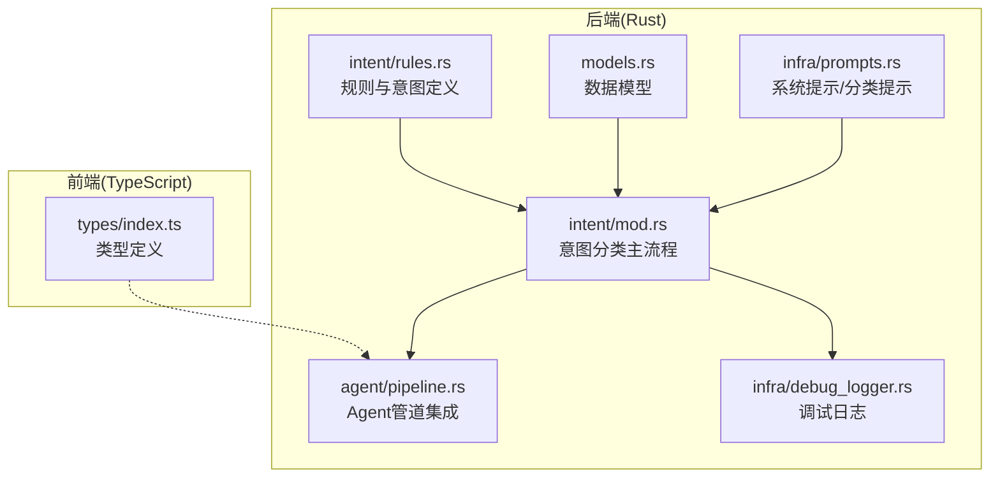
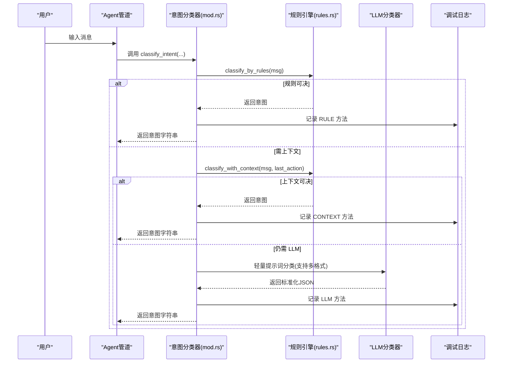
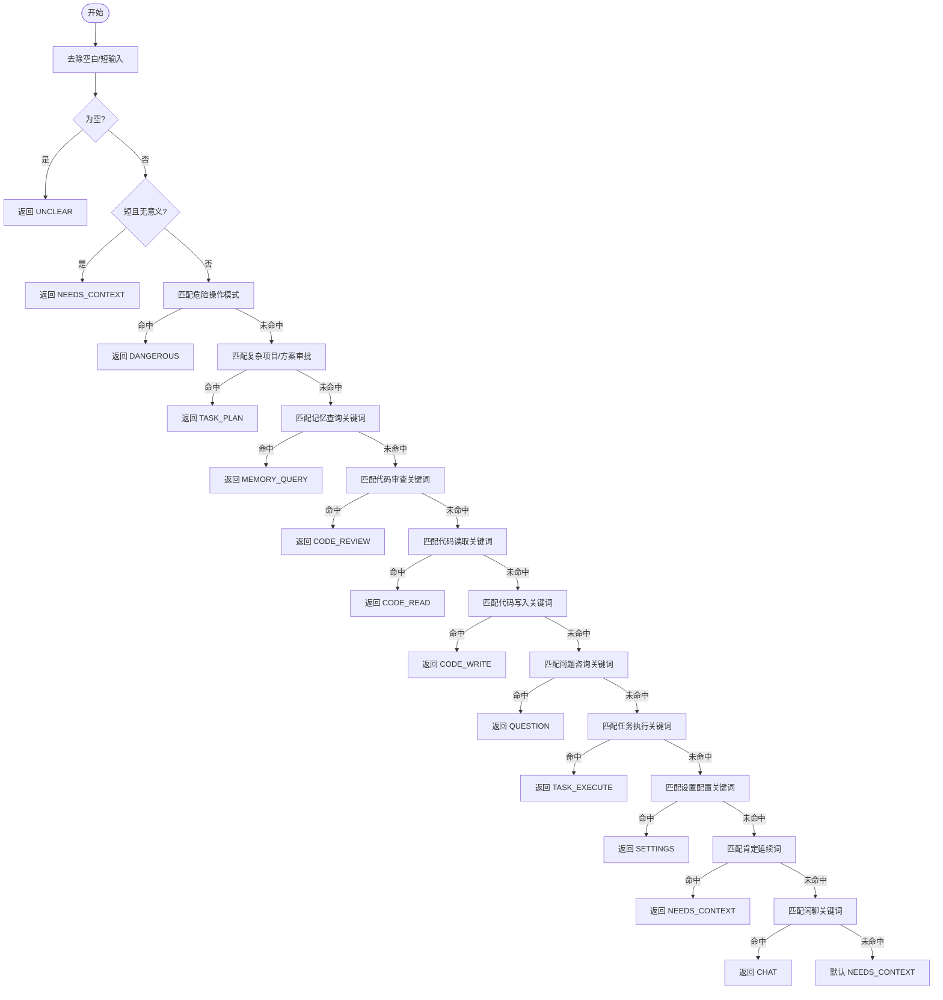
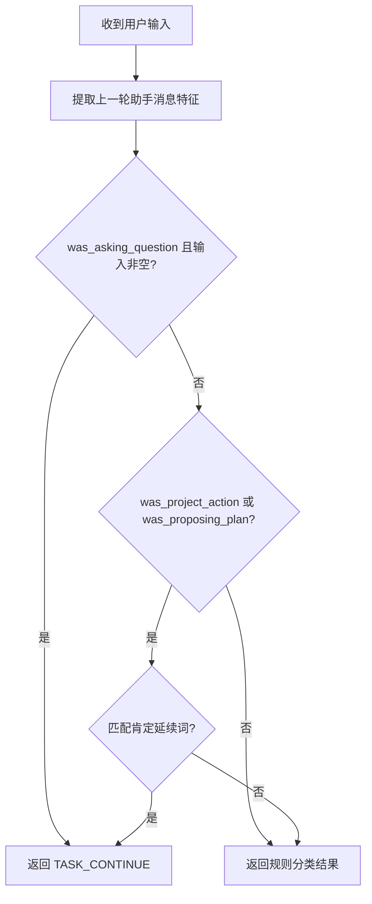
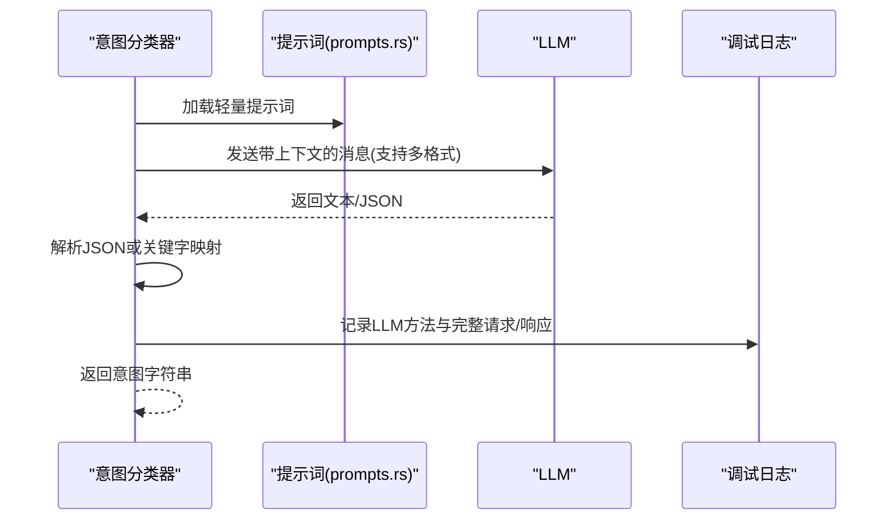
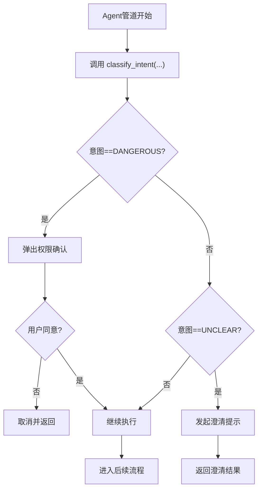
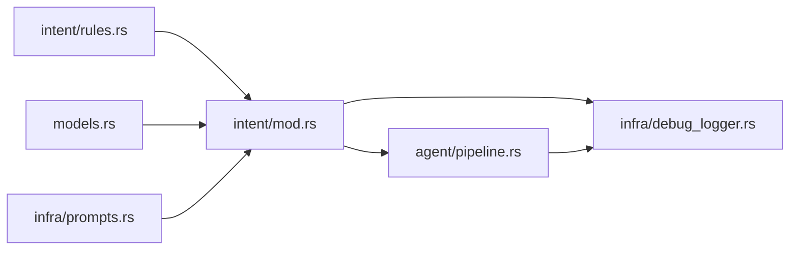

# 意图识别机制

<cite>
**本文档引用的文件**
- [mod.rs](file://src-tauri/src/core/intent/mod.rs)
- [rules.rs](file://src-tauri/src/core/intent/rules.rs)
- [models.rs](file://src-tauri/src/core/models.rs)
- [prompts.rs](file://src-tauri/src/core/infra/prompts.rs)
- [pipeline.rs](file://src-tauri/src/core/agent/pipeline.rs)
- [debug_logger.rs](file://src-tauri/src/core/infra/debug_logger.rs)
- [index.ts](file://src/types/index.ts)
</cite>

## 更新摘要
**变更内容**
- 重构了意图识别系统的模块结构，将原本分离的 intent.rs 和 intent_rules.rs 合并为新的模块化设计
- 更新了规则引擎的实现，增强了上下文分析能力和危险操作检测机制
- 改进了 LLM 兜底分类器的实现，支持多种 API 格式适配
- 优化了调试日志记录功能，提供更详细的意图分类过程跟踪

## 目录
1. [简介](#简介)
2. [项目结构](#项目结构)
3. [核心组件](#核心组件)
4. [架构总览](#架构总览)
5. [详细组件分析](#详细组件分析)
6. [依赖关系分析](#依赖关系分析)
7. [性能考量](#性能考量)
8. [故障排查指南](#故障排查指南)
9. [结论](#结论)
10. [附录](#附录)

## 简介
本文件面向 JarvisAgent 的意图识别机制，系统性阐述其"规则前置 + 轻量模型兜底"的三层分类架构，重点解析 CHAT（闲聊）、PROJECT_ACTION（项目操作）、MEMORY_QUERY（记忆查询）、QUESTION（问题咨询）、DANGEROUS（危险操作）、UNCLEAR（意图不明确）等核心意图类型的识别规则与判断逻辑；同时给出重构后的规则匹配算法、上下文分析方法、危险操作检测机制的技术细节，并提供扩展新意图类型、自定义识别规则、处理模糊输入场景的实践指导与性能优化建议。

## 项目结构
重构后的意图识别系统采用模块化设计，主要位于 Rust 后端的 core 模块中，前端类型定义位于 src/types/index.ts。关键文件分布如下：
- 规则与意图定义：src-tauri/src/core/intent/rules.rs
- 意图分类主流程：src-tauri/src/core/intent/mod.rs
- 数据模型与请求封装：src-tauri/src/core/models.rs
- 系统提示与意图分类提示：src-tauri/src/core/infra/prompts.rs
- Agent 管道集成与权限校验：src-tauri/src/core/agent/pipeline.rs
- 调试日志与意图分类记录：src-tauri/src/core/infra/debug_logger.rs
- 前端类型定义：src/types/index.ts

**图表来源**
- [mod.rs:1-261](file://src-tauri/src/core/intent/mod.rs#L1-L261)
- [rules.rs:1-666](file://src-tauri/src/core/intent/rules.rs#L1-L666)
- [models.rs:1-284](file://src-tauri/src/core/models.rs#L1-L284)
- [prompts.rs:1-89](file://src-tauri/src/core/infra/prompts.rs#L1-L89)
- [pipeline.rs:1-800](file://src-tauri/src/core/agent/pipeline.rs#L1-L800)
- [debug_logger.rs:1-237](file://src-tauri/src/core/infra/debug_logger.rs#L1-L237)
- [index.ts:1-449](file://src/types/index.ts#L1-L449)

**章节来源**
- [mod.rs:1-261](file://src-tauri/src/core/intent/mod.rs#L1-L261)
- [rules.rs:1-666](file://src-tauri/src/core/intent/rules.rs#L1-L666)
- [models.rs:1-284](file://src-tauri/src/core/models.rs#L1-L284)
- [prompts.rs:1-89](file://src-tauri/src/core/infra/prompts.rs#L1-L89)
- [pipeline.rs:1-800](file://src-tauri/src/core/agent/pipeline.rs#L1-L800)
- [debug_logger.rs:1-237](file://src-tauri/src/core/infra/debug_logger.rs#L1-L237)
- [index.ts:1-449](file://src/types/index.ts#L1-L449)

## 核心组件
- **模块化规则引擎**：重构后的规则引擎采用模块化设计，包含12种意图类型（含 NEEDS_CONTEXT、UNCLEAR 等），并以静态正则集合进行关键词匹配，形成"规则前置"的第一层分类。
- **增强上下文分析器**：从上一轮助手消息中提取特征（项目操作、提问、计划），用于判断"好的/继续"等短回复的真实意图，支持更复杂的上下文场景。
- **多格式 LLM 兜底分类器**：重构后的 LLM 分类器支持 Anthropic 和 OpenAI 两种 API 格式，当规则无法确定时，使用轻量提示词引导 LLM 输出标准化 JSON，作为第三层兜底。
- **Agent 管道集成**：在 Agent 主流程中调用意图分类，针对 DANGEROUS 和 UNCLEAR 意图执行权限确认与澄清流程。
- **详细调试日志**：记录规则/上下文/LLM 三类方法的决策过程与结果，包括完整的请求 JSON 和 LLM 原始响应，便于定位问题与优化规则。

**章节来源**
- [rules.rs:241-277](file://src-tauri/src/core/intent/rules.rs#L241-L277)
- [rules.rs:458-506](file://src-tauri/src/core/intent/rules.rs#L458-L506)
- [mod.rs:17-81](file://src-tauri/src/core/intent/mod.rs#L17-L81)
- [mod.rs:83-260](file://src-tauri/src/core/intent/mod.rs#L83-L260)
- [pipeline.rs:311-355](file://src-tauri/src/core/agent/pipeline.rs#L311-L355)
- [debug_logger.rs:156-191](file://src-tauri/src/core/infra/debug_logger.rs#L156-L191)

## 架构总览
重构后的意图识别采用三层流水线，具有更强的模块化和可扩展性：
1) **规则前置（关键词正则）**：覆盖绝大多数常见意图，避免 LLM 开销。
2) **上下文增强（LastAssistantAction）**：解决短回复歧义，如"继续/好的"是任务延续还是闲聊。
3) **多格式 LLM 兜底（轻量提示词）**：处理真正模糊或边界输入，输出标准化 JSON，支持 Anthropic 和 OpenAI 格式。

**图表来源**
- [mod.rs:17-81](file://src-tauri/src/core/intent/mod.rs#L17-L81)
- [rules.rs:311-406](file://src-tauri/src/core/intent/rules.rs#L311-L406)
- [rules.rs:419-447](file://src-tauri/src/core/intent/rules.rs#L419-L447)
- [mod.rs:83-260](file://src-tauri/src/core/intent/mod.rs#L83-L260)
- [prompts.rs:82-88](file://src-tauri/src/core/infra/prompts.rs#L82-L88)
- [debug_logger.rs:156-191](file://src-tauri/src/core/infra/debug_logger.rs#L156-L191)

## 详细组件分析

### 模块化规则引擎与意图类型
重构后的规则引擎采用模块化设计，包含完整的意图枚举和分类函数：
- **意图枚举**：包含 CODE_READ、CODE_WRITE、CODE_REVIEW、TASK_EXECUTE、TASK_PLAN、TASK_CONTINUE、QUESTION、MEMORY_QUERY、SETTINGS、GENERAL_CHAT、DANGEROUS_ACTION、UNCLEAR、NEEDS_CONTEXT 等。
- **关键词正则集**：
  - **危险操作模式**：删除、清空、格式化、rm -rf、Windows del /s 等。
  - **复杂项目/方案审批**：先不要直接、方案、计划、审批等。
  - **代码读取/写入/审查**：查看、读取、创建、修改、审查、优化等。
  - **任务执行**：运行、执行、启动、构建、部署、git/npm/cargo/docker 等命令族。
  - **问题咨询**：什么是、怎么用、为什么、如何、假设性问句等。
  - **设置配置**：设置、配置、偏好、切换、主题、语言等。
  - **记忆查询**：之前、上次、记得、回忆、历史、记录、对话记录等。
  - **闲聊**：问候、感谢、再见、笑话、天气、时间、身份、娱乐等。
  - **肯定延续词**：继续、可以、需要、好、yes、ok、改一下、换成、加上、去掉、然后呢、接下来、下一步、还需要、也要等。
  - **短输入模糊**：纯数字/纯符号、单字母、非中英字符等。
- **规则优先级**：危险操作 > 复杂项目/方案审批 > 记忆查询 > 代码审查 > 代码读取 > 代码写入 > 问题咨询 > 任务执行 > 设置配置 > 肯定延续词 > 闲聊 > 默认 NeedsContext。

**图表来源**
- [rules.rs:311-406](file://src-tauri/src/core/intent/rules.rs#L311-L406)

**章节来源**
- [rules.rs:241-277](file://src-tauri/src/core/intent/rules.rs#L241-L277)
- [rules.rs:20-37](file://src-tauri/src/core/intent/rules.rs#L20-L37)
- [rules.rs:42-53](file://src-tauri/src/core/intent/rules.rs#L42-L53)
- [rules.rs:58-68](file://src-tauri/src/core/intent/rules.rs#L58-L68)
- [rules.rs:73-82](file://src-tauri/src/core/intent/rules.rs#L73-L82)
- [rules.rs:87-97](file://src-tauri/src/core/intent/rules.rs#L87-L97)
- [rules.rs:102-115](file://src-tauri/src/core/intent/rules.rs#L102-L115)
- [rules.rs:120-134](file://src-tauri/src/core/intent/rules.rs#L120-L134)
- [rules.rs:139-147](file://src-tauri/src/core/intent/rules.rs#L139-L147)
- [rules.rs:153-175](file://src-tauri/src/core/intent/rules.rs#L153-L175)
- [rules.rs:181-204](file://src-tauri/src/core/intent/rules.rs#L181-L204)
- [rules.rs:211-226](file://src-tauri/src/core/intent/rules.rs#L211-L226)
- [rules.rs:232-235](file://src-tauri/src/core/intent/rules.rs#L232-L235)

### 增强上下文分析与短回复处理
重构后的上下文分析器提供了更强大的 LastAssistantAction 特征提取：
- **LastAssistantAction 特征**：
  - was_project_action：是否涉及创建/写入/修改/删除/运行等项目操作。
  - was_asking_question：是否在提问（需要用户回答）。
  - was_proposing_plan：是否在提出计划（需要用户确认）。
  - action_summary：操作摘要（用于调试日志）。
- **classify_with_context**：
  - 若上一轮是提问且当前输入非空，则视为任务延续。
  - 若上一轮是项目操作或计划提议，且当前输入匹配"肯定延续词"，则视为任务延续。
  - 否则沿用规则分类结果，若仍为 NEEDS_CONTEXT 则进入 LLM 兜底。

**图表来源**
- [rules.rs:419-447](file://src-tauri/src/core/intent/rules.rs#L419-L447)
- [rules.rs:458-506](file://src-tauri/src/core/intent/rules.rs#L458-L506)

**章节来源**
- [rules.rs:283-295](file://src-tauri/src/core/intent/rules.rs#L283-L295)
- [rules.rs:419-447](file://src-tauri/src/core/intent/rules.rs#L419-L447)
- [rules.rs:458-506](file://src-tauri/src/core/intent/rules.rs#L458-L506)

### 多格式 LLM 兜底分类与提示词
重构后的 LLM 兜底分类器支持多种 API 格式：
- **轻量提示词**：要求 LLM 输出 JSON，包含 category 与简短 reason，支持的 category 与规则一致。
- **多格式支持**：支持 Anthropic 和 OpenAI 两种 API 格式，自动适配不同的请求体结构。
- **兜底触发条件**：规则分类为 NEEDS_CONTEXT 且上下文分类仍为 NEEDS_CONTEXT。
- **输出解析**：优先解析 JSON 字段 category；若非 JSON，按包含关键字回退映射；失败则回退到规则分类结果。
- **详细调试记录**：记录原始请求 JSON、LLM 响应与最终意图，包括完整的请求和响应详情。

**图表来源**
- [mod.rs:83-260](file://src-tauri/src/core/intent/mod.rs#L83-L260)
- [prompts.rs:82-88](file://src-tauri/src/core/infra/prompts.rs#L82-L88)
- [debug_logger.rs:156-191](file://src-tauri/src/core/infra/debug_logger.rs#L156-L191)

**章节来源**
- [mod.rs:83-260](file://src-tauri/src/core/intent/mod.rs#L83-L260)
- [prompts.rs:82-88](file://src-tauri/src/core/infra/prompts.rs#L82-L88)
- [debug_logger.rs:156-191](file://src-tauri/src/core/infra/debug_logger.rs#L156-L191)

### Agent 管道集成与危险/不明确处理
重构后的 Agent 管道集成了增强的意图分类功能：
- **管道入口**：在构建 AgentRun 前调用 classify_intent 获取意图字符串。
- **危险操作**：检测到 DANGEROUS 时弹出权限确认对话框，用户拒绝则取消并返回标准结果。
- **不明确意图**：检测到 UNCLEAR 时向用户发起澄清提示，引导用户提供更清晰的需求描述。
- **图片输入**：检测到图片时跳过意图分类，直接进入对话流程。
- **增强的错误处理**：重构后的实现提供了更好的错误处理和回退机制。

**图表来源**
- [pipeline.rs:260-275](file://src-tauri/src/core/agent/pipeline.rs#L260-L275)
- [pipeline.rs:311-355](file://src-tauri/src/core/agent/pipeline.rs#L311-L355)

**章节来源**
- [pipeline.rs:260-275](file://src-tauri/src/core/agent/pipeline.rs#L260-L275)
- [pipeline.rs:311-355](file://src-tauri/src/core/agent/pipeline.rs#L311-L355)

### 数据模型与请求封装
重构后的数据模型提供了更完整的 API 格式支持：
- **Message/Content**：统一表示用户/助手消息，支持单文本与多内容块。
- **AnthropicRequest/OpenAIRequest**：封装不同 API 格式的请求体，便于适配不同后端。
- **多格式适配**：支持 Anthropic 和 OpenAI 两种格式的自动转换。
- **AgentRun/PlanDocument**：会话与计划相关类型，支撑意图识别后的后续执行。

**章节来源**
- [models.rs:43-58](file://src-tauri/src/core/models.rs#L43-L58)
- [models.rs:68-90](file://src-tauri/src/core/models.rs#L68-L90)
- [models.rs:165-200](file://src-tauri/src/core/models.rs#L165-L200)
- [models.rs:218-257](file://src-tauri/src/core/models.rs#L218-L257)

### 前端类型定义
前端类型定义保持不变，确保与后端交互的类型一致性：
- 与后端交互的类型定义，确保消息结构与枚举值在前后端保持一致，便于调试与日志输出。

**章节来源**
- [index.ts:1-449](file://src/types/index.ts#L1-L449)

## 依赖关系分析
重构后的依赖关系更加清晰和模块化：
- **intent/mod.rs** 依赖 **intent/rules.rs** 的规则与意图枚举，并调用 **models.rs** 的消息结构与请求封装。
- **pipeline.rs** 依赖 **intent** 模块的分类结果，并在 detect 阶段根据意图执行权限确认与澄清。
- **debug_logger.rs** 为 **intent** 模块与 **pipeline.rs** 提供统一的日志记录能力，记录完整的请求和响应详情。
- **prompts.rs** 提供轻量提示词，驱动 LLM 兜底分类。

**图表来源**
- [mod.rs:1-261](file://src-tauri/src/core/intent/mod.rs#L1-L261)
- [rules.rs:1-666](file://src-tauri/src/core/intent/rules.rs#L1-L666)
- [models.rs:1-284](file://src-tauri/src/core/models.rs#L1-L284)
- [prompts.rs:1-89](file://src-tauri/src/core/infra/prompts.rs#L1-L89)
- [pipeline.rs:1-800](file://src-tauri/src/core/agent/pipeline.rs#L1-L800)
- [debug_logger.rs:1-237](file://src-tauri/src/core/infra/debug_logger.rs#L1-L237)

**章节来源**
- [mod.rs:1-261](file://src-tauri/src/core/intent/mod.rs#L1-L261)
- [rules.rs:1-666](file://src-tauri/src/core/intent/rules.rs#L1-L666)
- [models.rs:1-284](file://src-tauri/src/core/models.rs#L1-L284)
- [prompts.rs:1-89](file://src-tauri/src/core/infra/prompts.rs#L1-L89)
- [pipeline.rs:1-800](file://src-tauri/src/core/agent/pipeline.rs#L1-L800)
- [debug_logger.rs:1-237](file://src-tauri/src/core/infra/debug_logger.rs#L1-L237)

## 性能考量
重构后的性能优化措施：
- **模块化设计**：通过模块化组织代码，提高编译效率和代码可维护性。
- **规则前置优先**：通过大量正则关键词匹配覆盖高频意图，避免不必要的 LLM 调用，显著降低延迟与成本。
- **上下文分析轻量化**：仅扫描上一轮助手消息的关键字，复杂度低，适合高频调用。
- **多格式 LLM 兜底最小化**：仅在规则与上下文均无法决断时触发，且使用轻量提示词与短输出长度，减少 token 消耗。
- **缓存与懒加载**：正则集合使用 LazyLock 懒加载，首次使用时编译，后续复用。
- **增强的错误处理**：提供更好的错误回退机制，避免系统崩溃。
- **建议优化**：
  - 将高频关键词归并为更少的正则，减少匹配次数。
  - 对短输入进行快速预判（如首字符/长度阈值）以进一步剪枝。
  - 将规则与上下文结果缓存至会话内存，避免重复计算。
  - 对 LLM 兜底请求增加超时与重试策略，保证稳定性。

## 故障排查指南
重构后的故障排查指南：
- **规则未命中或误判**：
  - 检查 **intent/rules.rs** 中对应意图的关键词集合是否覆盖充分。
  - 使用调试日志查看 RULE/CONTEXT/LLM 三类方法的决策路径与输入截断情况。
  - 利用增强的调试日志记录，查看完整的请求和响应详情。
- **上下文误判"继续/好的"**：
  - 确认上一轮助手消息是否包含项目操作/提问/计划特征。
  - 检查 AFFIRMATIVE_CONTINUATION 正则是否符合预期。
  - 验证 LastAssistantAction 的特征提取是否正确。
- **LLM 兜底异常**：
  - 检查 **prompts.rs** 的提示词是否清晰，输出格式是否符合 JSON。
  - 查看 **debug_logger** 中的完整请求 JSON 与 LLM 原始响应，定位格式问题。
  - 验证多格式适配是否正确（Anthropic vs OpenAI）。
- **Agent 管道行为异常**：
  - 检查 **pipeline.rs** 中 detect 阶段的意图分支与权限确认逻辑。
  - 确保 UNCLEAR 澄清提示文案与交互流程正确。
  - 验证模块导入和函数调用是否正确。

**章节来源**
- [debug_logger.rs:156-191](file://src-tauri/src/core/infra/debug_logger.rs#L156-L191)
- [rules.rs:211-226](file://src-tauri/src/core/intent/rules.rs#L211-L226)
- [pipeline.rs:311-355](file://src-tauri/src/core/agent/pipeline.rs#L311-L355)

## 结论
JarvisAgent 的重构后意图识别机制通过"模块化规则引擎 + 增强上下文分析 + 多格式 LLM 兜底"的三层架构，在保证高准确率的同时兼顾性能与可维护性。模块化设计提高了代码的可维护性和扩展性，增强的上下文分析解决短回复歧义，多格式 LLM 兜底处理边界情况并支持更多后端。配合详细的调试日志与 Agent 管道集成，系统能够稳定地将用户输入转化为可执行的后续动作。

## 附录

### 扩展新意图类型的步骤
- 在 **intent/rules.rs** 的意图枚举中新增枚举项，并在 as_str 中添加映射。
- 在规则文件中新增关键词集合与优先级位置。
- 在 classify_with_context 中补充必要的上下文判断逻辑。
- 在 LLM 兜底提示词中加入新意图类别，确保输出格式一致。
- 在 Agent 管道中根据新意图类型添加相应处理分支（如权限确认、澄清提示等）。

**章节来源**
- [rules.rs:241-277](file://src-tauri/src/core/intent/rules.rs#L241-L277)
- [rules.rs:311-406](file://src-tauri/src/core/intent/rules.rs#L311-L406)
- [rules.rs:419-447](file://src-tauri/src/core/intent/rules.rs#L419-L447)
- [prompts.rs:82-88](file://src-tauri/src/core/infra/prompts.rs#L82-L88)
- [pipeline.rs:311-355](file://src-tauri/src/core/agent/pipeline.rs#L311-L355)

### 自定义识别规则的实践
- **增强关键词覆盖**：针对领域术语与口语化表达扩展正则集合。
- **调整优先级顺序**：根据业务场景调整意图匹配顺序，确保高优先级意图优先命中。
- **引入领域词典**：将领域专用词汇加入关键词集合，提升准确性。
- **结合上下文**：利用 LastAssistantAction 的特征，细化短回复的判断逻辑。
- **模块化扩展**：利用重构后的模块化设计，将新规则组织到相应的模块中。

**章节来源**
- [rules.rs:20-37](file://src-tauri/src/core/intent/rules.rs#L20-L37)
- [rules.rs:42-53](file://src-tauri/src/core/intent/rules.rs#L42-L53)
- [rules.rs:58-68](file://src-tauri/src/core/intent/rules.rs#L58-L68)
- [rules.rs:73-82](file://src-tauri/src/core/intent/rules.rs#L73-L82)
- [rules.rs:87-97](file://src-tauri/src/core/intent/rules.rs#L87-L97)
- [rules.rs:102-115](file://src-tauri/src/core/intent/rules.rs#L102-L115)
- [rules.rs:120-134](file://src-tauri/src/core/intent/rules.rs#L120-L134)
- [rules.rs:139-147](file://src-tauri/src/core/intent/rules.rs#L139-L147)
- [rules.rs:153-175](file://src-tauri/src/core/intent/rules.rs#L153-L175)
- [rules.rs:181-204](file://src-tauri/src/core/intent/rules.rs#L181-L204)
- [rules.rs:211-226](file://src-tauri/src/core/intent/rules.rs#L211-L226)
- [rules.rs:232-235](file://src-tauri/src/core/intent/rules.rs#L232-L235)

### 处理模糊输入场景
- **短输入模糊**：通过 SHORT_UNCLEAR 正则识别纯数字/纯符号/单字母等，返回 NEEDS_CONTEXT，交由上下文或 LLM 判断。
- **增强上下文短回复**：结合 AFFIRMATIVE_CONTINUATION 与 LastAssistantAction 特征，区分"继续/好的"是延续任务还是闲聊。
- **多格式 LLM 兜底**：使用轻量提示词引导 LLM 输出标准化 JSON，提升鲁棒性，支持 Anthropic 和 OpenAI 两种格式。
- **详细调试支持**：利用增强的调试日志记录完整的请求和响应，便于问题定位。

**章节来源**
- [rules.rs:232-235](file://src-tauri/src/core/intent/rules.rs#L232-L235)
- [rules.rs:211-226](file://src-tauri/src/core/intent/rules.rs#L211-L226)
- [rules.rs:419-447](file://src-tauri/src/core/intent/rules.rs#L419-L447)
- [mod.rs:83-260](file://src-tauri/src/core/intent/mod.rs#L83-L260)
- [debug_logger.rs:156-191](file://src-tauri/src/core/infra/debug_logger.rs#L156-L191)