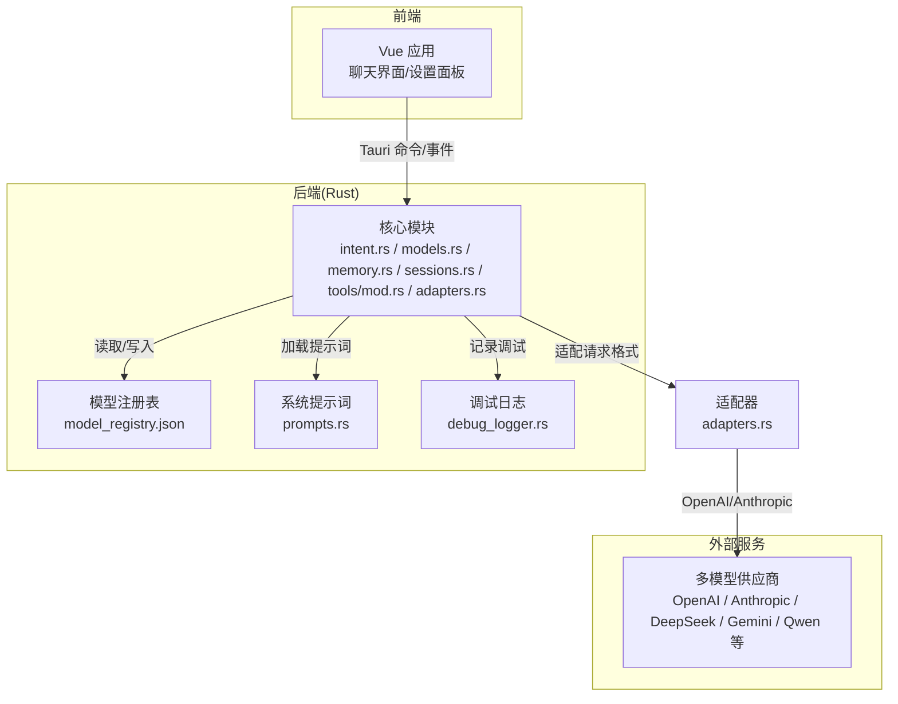
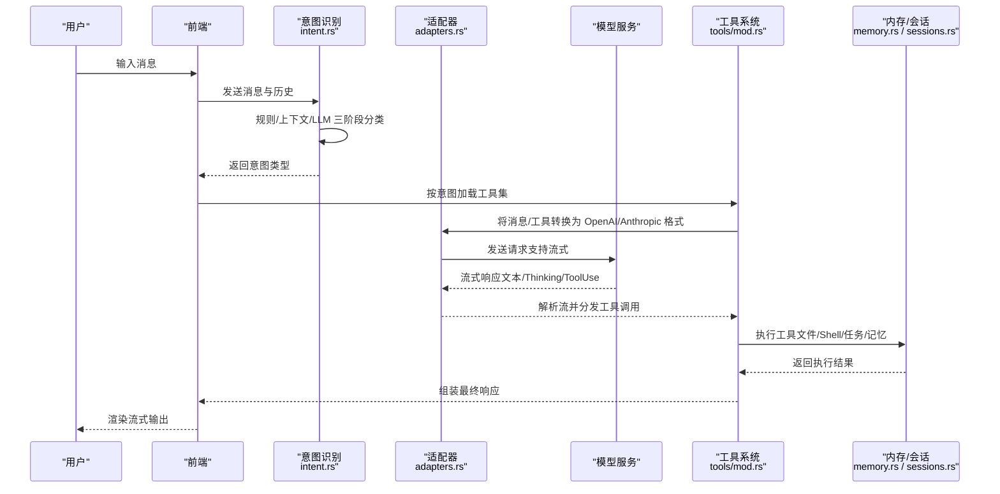
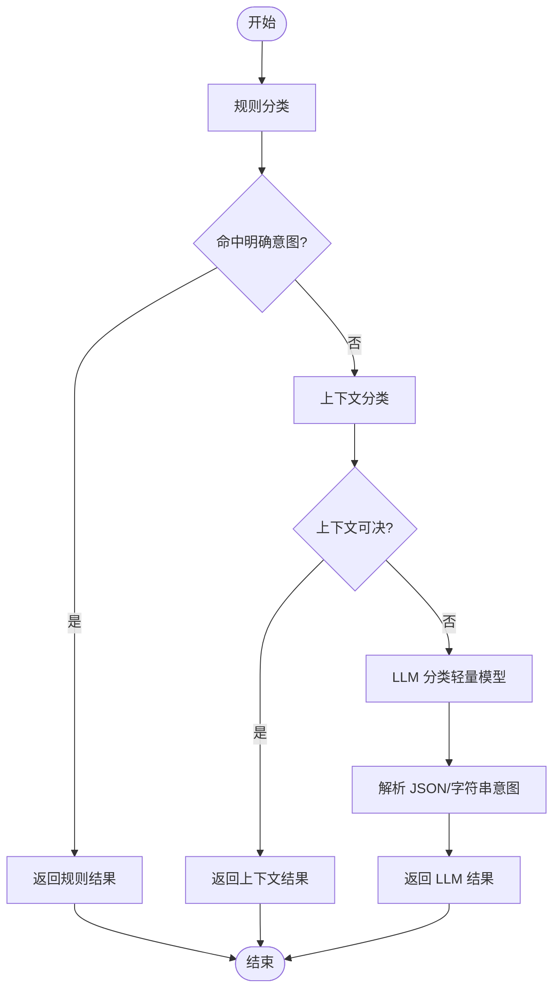
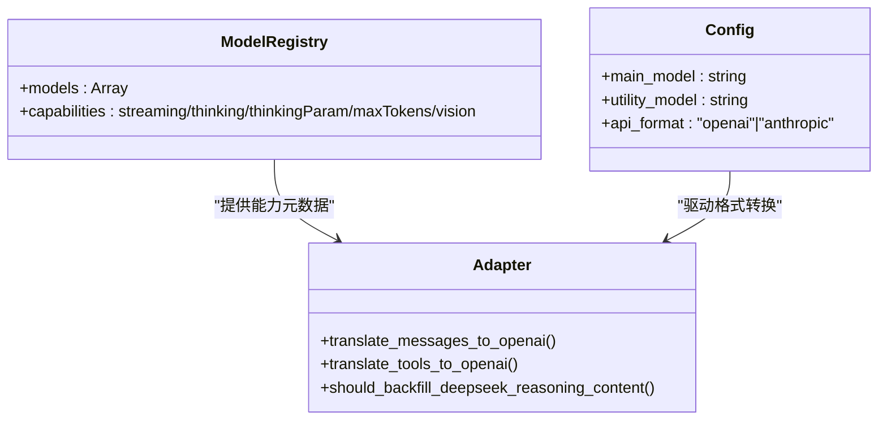
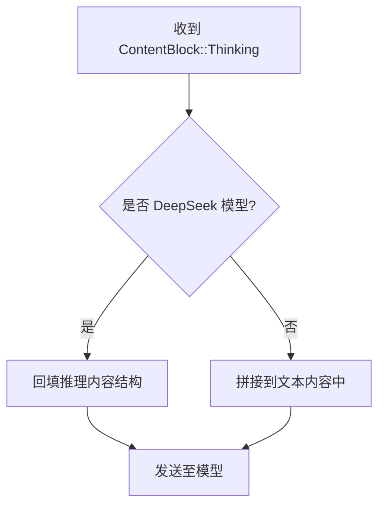
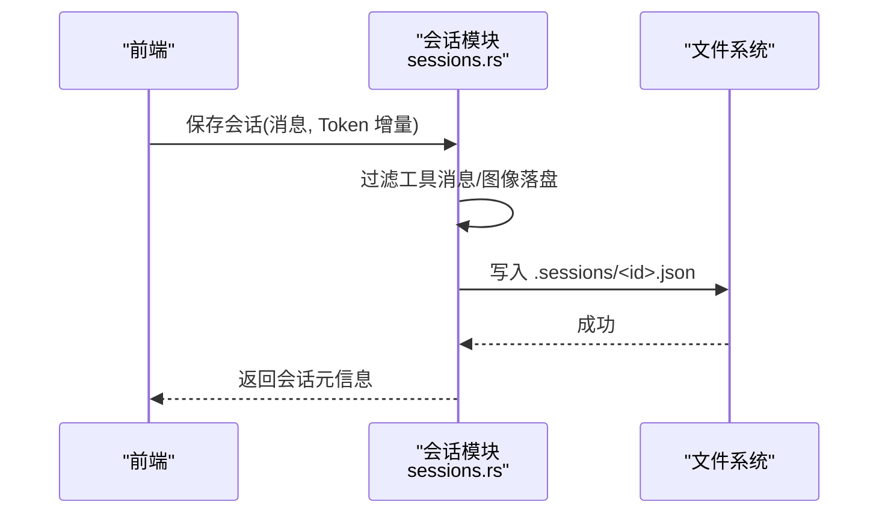
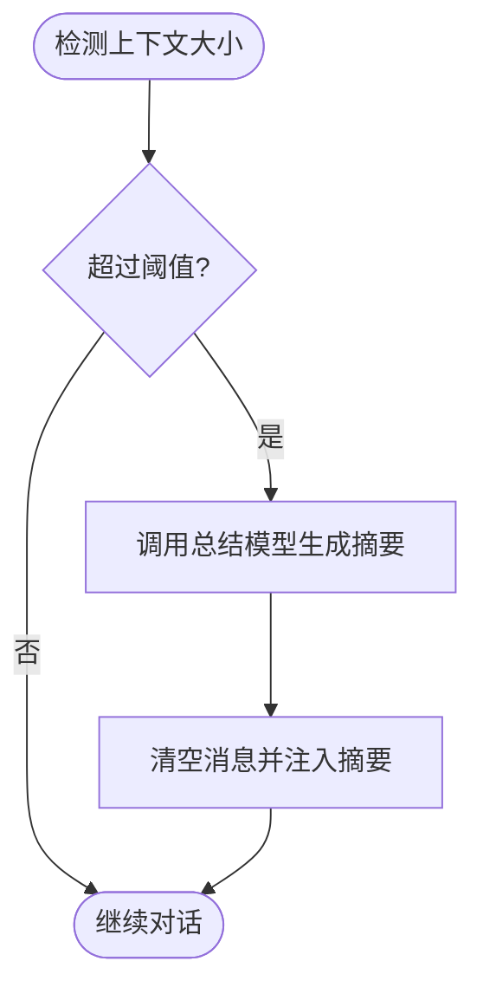
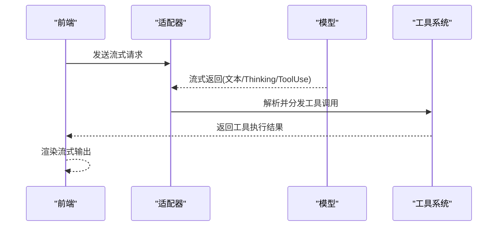
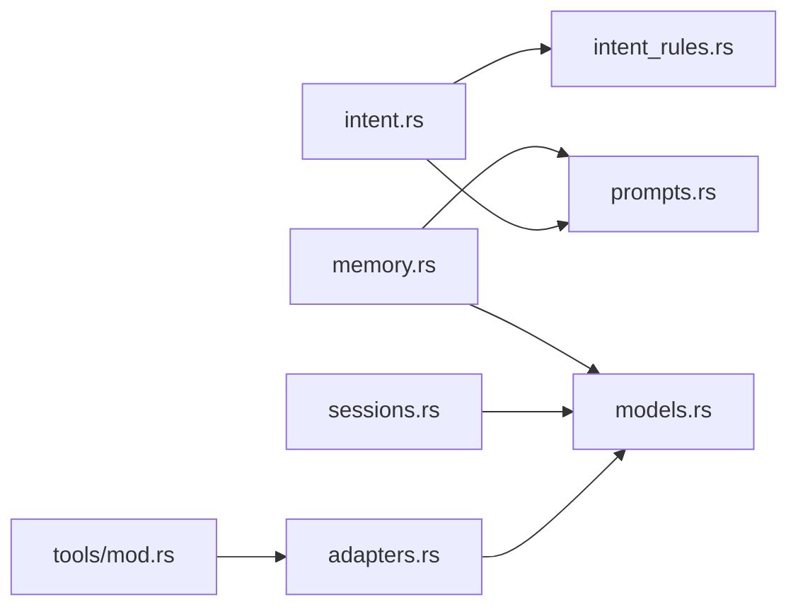

# 智能对话系统

<cite>
**本文引用的文件**
- [intent.rs](file://src-tauri/src/core/intent.rs)
- [intent_rules.rs](file://src-tauri/src/core/intent_rules.rs)
- [models.rs](file://src-tauri/src/core/models.rs)
- [memory.rs](file://src-tauri/src/core/memory.rs)
- [sessions.rs](file://src-tauri/src/core/sessions.rs)
- [adapters.rs](file://src-tauri/src/core/adapters.rs)
- [prompts.rs](file://src-tauri/src/core/prompts.rs)
- [tools/mod.rs](file://src-tauri/src/core/tools/mod.rs)
- [constants.rs](file://src-tauri/src/core/constants.rs)
- [debug_logger.rs](file://src-tauri/src/core/debug_logger.rs)
- [Cargo.toml](file://src-tauri/Cargo.toml)
- [README.md](file://README.md)
- [model_registry.json](file://src-tauri/model_registry.json)
</cite>

## 目录
1. [简介](#简介)
2. [项目结构](#项目结构)
3. [核心组件](#核心组件)
4. [架构总览](#架构总览)
5. [详细组件分析](#详细组件分析)
6. [依赖分析](#依赖分析)
7. [性能考量](#性能考量)
8. [故障排除指南](#故障排除指南)
9. [结论](#结论)
10. [附录](#附录)

## 简介
本文件面向 JarvisAgent 的智能对话系统，围绕“意图识别机制”“多模型支持与切换”“深度思考模式”“会话管理与动态上下文构建”“流式响应与工具调用执行”等关键能力进行系统化说明。文档既提供代码级的结构与流程图示，也给出配置项、性能优化建议与故障排除指引，帮助开发者与使用者高效理解与使用系统。

## 项目结构
JarvisAgent 采用前后端分离架构：前端使用 Vue 3 + Tauri 2.0，后端使用 Rust + Tokio，通过 OpenAI/Anthropic 双格式适配器对接多家模型供应商，并内置工具系统、会话持久化与记忆管理模块。

图表来源
- [README.md: 项目结构:107-160](file://README.md#L107-L160)
- [adapters.rs: OpenAI/Anthropic 适配:84-223](file://src-tauri/src/core/adapters.rs#L84-L223)
- [model_registry.json: 模型能力注册:1-496](file://src-tauri/model_registry.json#L1-L496)

章节来源
- [README.md: 项目结构:107-160](file://README.md#L107-L160)
- [Cargo.toml: 依赖与运行时:20-39](file://src-tauri/Cargo.toml#L20-L39)

## 核心组件
- 意图识别与分类：规则优先 + 上下文 + LLM 三阶段分类，输出意图类型（如 CHAT、PROJECT_ACTION、MEMORY_QUERY、QUESTION、DANGEROUS、UNCLEAR 等）
- 多模型支持与切换：通过模型注册表与适配器，统一 OpenAI/Anthropic 请求格式，动态选择主模型与工具模型
- 深度思考模式：Thinking 内容块处理、推理参数映射（reasoning_effort/thinking/thinkingBudget/enable_thinking）
- 会话管理：SessionMemory、消息历史、标题提取、图片缓存、Token 统计与持久化
- 动态上下文构建：build_dynamic_context（由前端传入）、inject_user_message（注入用户输入）、auto_compact/auto_compact_summary（上下文压缩）
- 流式响应处理：process_stream（SSE/流式解析）、parse_streamed_tool_input（工具输入规范化）
- 工具调用执行：execute_tool_calls（工具路由分发）、handle_tool_call/handle_tool_call_inner（按意图加载工具集）

章节来源
- [intent.rs: 意图分类主流程:4-63](file://src-tauri/src/core/intent.rs#L4-L63)
- [intent_rules.rs: 规则与意图枚举:222-257](file://src-tauri/src/core/intent_rules.rs#L222-L257)
- [adapters.rs: OpenAI/Anthropic 适配与推理回填:84-223](file://src-tauri/src/core/adapters.rs#L84-L223)
- [models.rs: 数据模型与 ThinkingConfig:13-36](file://src-tauri/src/core/models.rs#L13-L36)
- [sessions.rs: 会话持久化与标题提取:127-160](file://src-tauri/src/core/sessions.rs#L127-L160)
- [memory.rs: 上下文压缩与记忆 Agent:101-210](file://src-tauri/src/core/memory.rs#L101-L210)
- [tools/mod.rs: 工具定义与路由:89-379](file://src-tauri/src/core/tools/mod.rs#L89-L379)

## 架构总览
系统采用“意图分类 → 工具集加载 → Agent 循环（思考→工具调用→观察）→ 流式输出”的闭环。前端负责用户交互与渲染，后端负责意图识别、上下文管理、工具调用与流式响应。

图表来源
- [intent.rs: classify_intent 主流程:4-63](file://src-tauri/src/core/intent.rs#L4-L63)
- [adapters.rs: translate_messages_to_openai:84-223](file://src-tauri/src/core/adapters.rs#L84-L223)
- [tools/mod.rs: handle_tool_call_inner:411-453](file://src-tauri/src/core/tools/mod.rs#L411-L453)
- [memory.rs: run_memory_agent:328-463](file://src-tauri/src/core/memory.rs#L328-L463)

## 详细组件分析

### 意图识别机制
- 规则优先：关键词正则匹配，覆盖危险操作、代码读取/写入/审查、任务执行、问题咨询、设置、记忆查询、闲聊等
- 上下文增强：结合上一轮助手动作（项目操作/提问/计划），对“好的/继续”等短回复进行延续意图判定
- LLM 兜底：当规则不确定时，使用轻量模型进行分类，输出 JSON 结构的意图与简短理由
- 输出意图类型：CHAT、PROJECT_ACTION、MEMORY_QUERY、QUESTION、DANGEROUS、UNCLEAR、NEEDS_CONTEXT 等

图表来源
- [intent_rules.rs: classify_by_rules/classify_with_context:291-416](file://src-tauri/src/core/intent_rules.rs#L291-L416)
- [intent.rs: classify_intent:4-63](file://src-tauri/src/core/intent.rs#L4-L63)

章节来源
- [intent_rules.rs: 意图枚举与规则:222-474](file://src-tauri/src/core/intent_rules.rs#L222-L474)
- [intent.rs: LLM 分类与日志记录:65-224](file://src-tauri/src/core/intent.rs#L65-L224)
- [prompts.rs: INTENT_CLASSIFIER_PROMPT_LIGHT:76-81](file://src-tauri/src/core/prompts.rs#L76-L81)

### 多模型支持与切换
- 模型注册表：集中定义各模型的提供商、API 格式、能力（流式、思考参数、最大上下文、视觉等）
- 适配器：将内部消息/工具结构转换为 OpenAI/Anthropic 请求格式；根据模型能力自动启用推理参数（reasoning_effort/thinking/thinkingBudget/enable_thinking）
- 切换策略：主模型用于主代理与子代理；工具模型用于意图分类与记忆 Agent，可选择更便宜的模型以降低成本

图表来源
- [model_registry.json: 模型能力注册:1-496](file://src-tauri/model_registry.json#L1-L496)
- [adapters.rs: translate_messages_to_openai/translate_tools_to_openai:84-258](file://src-tauri/src/core/adapters.rs#L84-L258)
- [adapters.rs: should_backfill_deepseek_reasoning_content:226-238](file://src-tauri/src/core/adapters.rs#L226-L238)

章节来源
- [model_registry.json: 模型能力注册:1-496](file://src-tauri/model_registry.json#L1-L496)
- [adapters.rs: 适配与推理参数映射:84-238](file://src-tauri/src/core/adapters.rs#L84-L238)

### 深度思考模式（Thinking 内容块处理）
- ThinkingConfig：支持开启/关闭与预算参数（不同模型的参数名不同）
- 内容块类型：ContentBlock::Thinking，包含 thinking 文本与签名
- 推理回填：针对 DeepSeek 等模型，将 Thinking 内容回填为推理内容结构，保证跨模型一致性
- 适配器逻辑：在 OpenAI 格式下将 Thinking 转换为推理字段，在 Anthropic 格式下保留原生 thinking 字段

图表来源
- [models.rs: ThinkingConfig/ContentBlock::Thinking:13-178](file://src-tauri/src/core/models.rs#L13-L178)
- [adapters.rs: reasoning_content_from_thinking/backfill:65-82](file://src-tauri/src/core/adapters.rs#L65-L82)
- [adapters.rs: translate_messages_to_openai_with_reasoning_backfill:88-223](file://src-tauri/src/core/adapters.rs#L88-L223)

章节来源
- [models.rs: ThinkingConfig/ContentBlock:13-178](file://src-tauri/src/core/models.rs#L13-L178)
- [adapters.rs: 推理回填与格式转换:64-223](file://src-tauri/src/core/adapters.rs#L64-L223)

### 会话管理与动态上下文构建
- SessionMemory：保存消息、上下文、Agent 步骤、计划文档
- 标题提取：从第一条用户消息提取标题，去除动态注入前缀
- 图片缓存：Base64 编码图片落地为文件，减少 JSON 体积
- 动态上下文注入：前端通过 inject_user_message 注入用户输入（如动态上下文），并参与标题提取与保存
- 保存策略：过滤工具消息，仅保留文本/图像/思维块，大幅降低文件体积

图表来源
- [sessions.rs: save_session 过滤与保存:218-364](file://src-tauri/src/core/sessions.rs#L218-L364)
- [sessions.rs: extract_title 去除动态前缀:127-160](file://src-tauri/src/core/sessions.rs#L127-L160)

章节来源
- [sessions.rs: 会话持久化与标题提取:127-364](file://src-tauri/src/core/sessions.rs#L127-L364)
- [constants.rs: 会话标题长度与阈值:22-29](file://src-tauri/src/core/constants.rs#L22-L29)

### 上下文压缩与记忆 Agent
- 自动压缩：当消息体积过大时，触发 auto_compact，调用总结模型生成摘要并清空历史
- 微型压缩：保留最近若干工具结果，其余工具结果以“简要摘要”形式替代，降低 Token 消耗
- 记忆 Agent：综合全局/项目记忆与最新对话，通过工具更新记忆文件

图表来源
- [memory.rs: auto_compact/auto_compact_summary:101-300](file://src-tauri/src/core/memory.rs#L101-L300)
- [memory.rs: micro_compact:48-87](file://src-tauri/src/core/memory.rs#L48-L87)

章节来源
- [memory.rs: 上下文压缩与记忆 Agent:101-463](file://src-tauri/src/core/memory.rs#L101-L463)
- [constants.rs: 上下文阈值:22-29](file://src-tauri/src/core/constants.rs#L22-L29)

### 流式响应处理与工具调用执行
- 流式解析：parse_streamed_tool_input 规范化流式 JSON，兼容不同模型的流式输出
- 工具路由：handle_tool_call/handle_tool_call_inner 根据工具名分发到具体模块（文件/Shell/任务/代理/系统）
- 工具定义：按意图加载工具集（如 MEMORY_QUERY 加载记忆检索工具，PROJECT_ACTION 加载完整工具集）

图表来源
- [adapters.rs: parse_streamed_tool_input:42-62](file://src-tauri/src/core/adapters.rs#L42-L62)
- [tools/mod.rs: handle_tool_call_inner:411-453](file://src-tauri/src/core/tools/mod.rs#L411-L453)

章节来源
- [adapters.rs: 流式解析与工具输入规范化:42-62](file://src-tauri/src/core/adapters.rs#L42-L62)
- [tools/mod.rs: 工具定义与路由:89-453](file://src-tauri/src/core/tools/mod.rs#L89-L453)

## 依赖分析
- 核心依赖：reqwest（HTTP/流式）、tokio（异步）、regex（规则匹配）、serde/serde_json（序列化）、uuid/base64（会话与图片）、eventsource-stream/futures-util（SSE/流处理）
- 模块耦合：intent.rs 依赖 intent_rules.rs 与 prompts.rs；adapters.rs 依赖 models.rs；tools/mod.rs 依赖各工具模块；sessions.rs 与 memory.rs 共同维护上下文与持久化

图表来源
- [intent.rs: 依赖关系:1-16](file://src-tauri/src/core/intent.rs#L1-L16)
- [adapters.rs: 依赖关系:2-6](file://src-tauri/src/core/adapters.rs#L2-L6)
- [tools/mod.rs: 依赖关系:1-16](file://src-tauri/src/core/tools/mod.rs#L1-L16)

章节来源
- [Cargo.toml: 依赖清单:20-39](file://src-tauri/Cargo.toml#L20-L39)

## 性能考量
- Token 估算：estimate_tokens 基于字符长度估算，用于上下文压缩触发与阈值判断
- 上下文压缩：在消息体量接近阈值时提前 micro_compact，避免进入 auto_compact 的昂贵总结
- 工具模型降本：将意图分类与记忆 Agent 的模型设置为更便宜的工具模型，降低整体成本
- 流式处理：使用 SSE/流式解析，减少等待时间，提升用户体验
- 图片缓存：将 Base64 图片落地为文件，减少 JSON 体积与传输开销

章节来源
- [memory.rs: estimate_tokens/micro_compact:10-87](file://src-tauri/src/core/memory.rs#L10-L87)
- [constants.rs: 上下文阈值:22-29](file://src-tauri/src/core/constants.rs#L22-L29)
- [sessions.rs: 图片落盘:23-40](file://src-tauri/src/core/sessions.rs#L23-L40)

## 故障排除指南
- 意图分类异常
  - 现象：规则无法判定，LLM 分类失败
  - 排查：检查 INTENT_CLASSIFIER_PROMPT_LIGHT 与 LLM 返回格式；查看 debug_logger 中的日志
  - 参考：[intent.rs: LLM 分类与日志:65-224](file://src-tauri/src/core/intent.rs#L65-L224)，[debug_logger.rs: log_intent_classifier:107-141](file://src-tauri/src/core/debug_logger.rs#L107-L141)
- 流式解析失败
  - 现象：工具输入 JSON 不规范导致解析错误
  - 排查：使用 parse_streamed_tool_input 的规范化逻辑，确认模型输出格式
  - 参考：[adapters.rs: parse_streamed_tool_input:42-62](file://src-tauri/src/core/adapters.rs#L42-L62)
- 工具调用失败
  - 现象：未知工具名或权限不足
  - 排查：确认工具定义与权限检查（permission.rs），核对 session 工作目录沙箱限制
  - 参考：[tools/mod.rs: handle_tool_call_inner:411-453](file://src-tauri/src/core/tools/mod.rs#L411-L453)
- 会话保存异常
  - 现象：保存后消息缺失或标题异常
  - 排查：检查 save_session 的过滤逻辑与 extract_title 的动态前缀处理
  - 参考：[sessions.rs: save_session/extract_title:218-364](file://src-tauri/src/core/sessions.rs#L218-L364)
- 记忆更新失败
  - 现象：记忆 Agent 未更新
  - 排查：确认工具模型可用、update_memory 工具调用成功、文件写入权限
  - 参考：[memory.rs: run_memory_agent:328-463](file://src-tauri/src/core/memory.rs#L328-L463)

章节来源
- [debug_logger.rs: 日志记录:107-186](file://src-tauri/src/core/debug_logger.rs#L107-L186)
- [adapters.rs: 流式解析:42-62](file://src-tauri/src/core/adapters.rs#L42-L62)
- [tools/mod.rs: 工具调用路由:411-453](file://src-tauri/src/core/tools/mod.rs#L411-L453)
- [sessions.rs: 保存与标题提取:218-364](file://src-tauri/src/core/sessions.rs#L218-L364)
- [memory.rs: 记忆 Agent:328-463](file://src-tauri/src/core/memory.rs#L328-L463)

## 结论
JarvisAgent 的智能对话系统通过“规则优先 + 上下文增强 + LLM 兜底”的意图识别机制，结合多模型适配与深度思考模式，实现了对复杂任务的稳健处理。配合会话持久化、上下文压缩与工具系统，系统在安全性、可扩展性与性能方面均表现优异。建议在生产环境中充分利用工具模型降本、流式处理与自动压缩策略，并通过调试日志与模型注册表持续优化意图分类与工具调用效果。

## 附录
- 配置项（设置面板）
  - API Key、Base URL、API Format（openai/anthropic）
  - 主模型、工具模型（utility_model）
  - 深度思考开关（ThinkingConfig）
  - 多预设 Profile 管理
- 支持的模型与能力
  - DeepSeek、Claude、GPT、Gemini、Qwen、豆包、MIMO 等 20+ 模型
  - 能力包括：流式、思考参数（reasoning_effort/thinking/thinkingBudget/enable_thinking）、最大上下文、视觉
- 数据存储位置
  - config.json、.sessions、.images、.tasks、.logs、.plans、.transcripts、skills、global_memory.md、thoughts_and_plans.md

章节来源
- [README.md: 配置与模型支持:72-106](file://README.md#L72-L106)
- [model_registry.json: 模型能力注册:1-496](file://src-tauri/model_registry.json#L1-L496)
- [README.md: 数据存储:257-274](file://README.md#L257-L274)