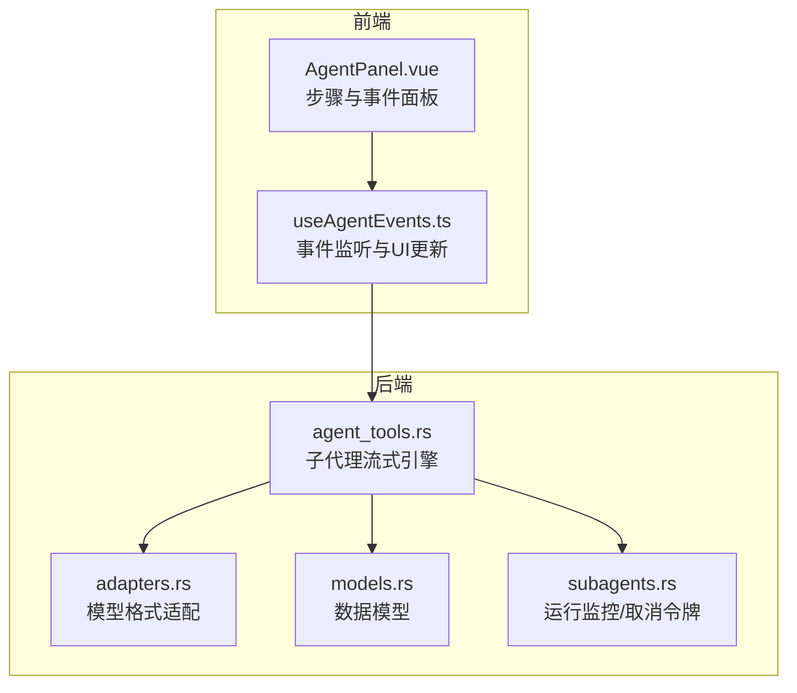
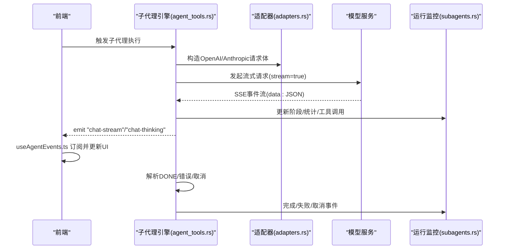
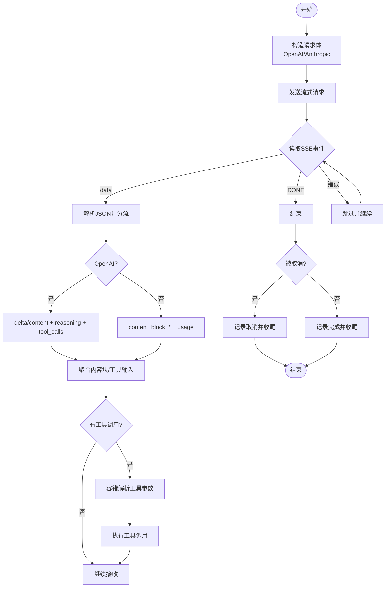
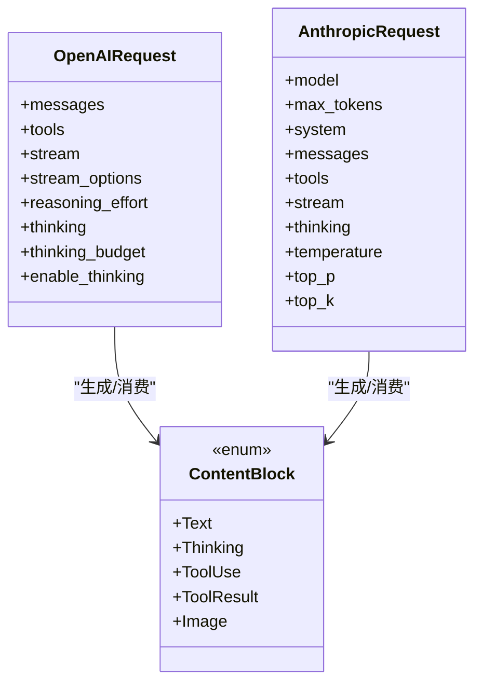
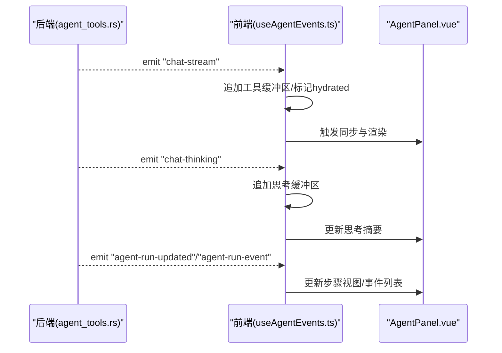
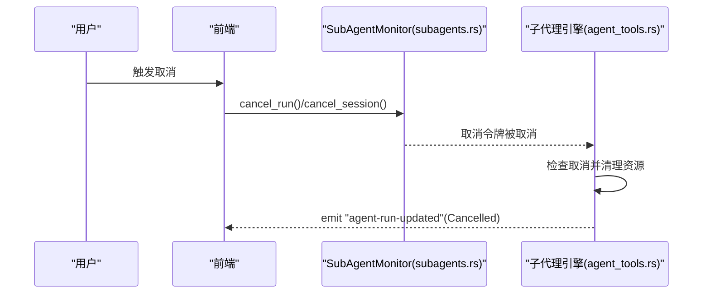
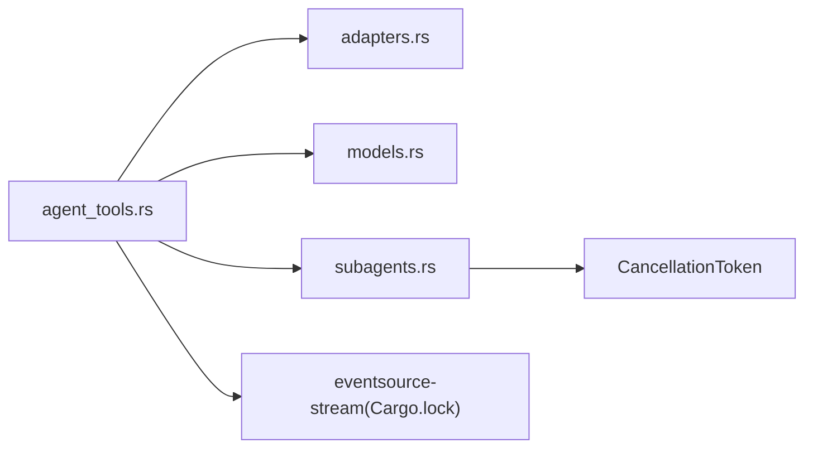

# 流式响应处理

<cite>
**本文引用的文件**
- [agent_tools.rs](file://src-tauri/src/core/tools/agent_tools.rs)
- [adapters.rs](file://src-tauri/src/core/adapters.rs)
- [models.rs](file://src-tauri/src/core/models.rs)
- [subagents.rs](file://src-tauri/src/core/subagents.rs)
- [useAgentEvents.ts](file://src/composables/useAgentEvents.ts)
- [AgentPanel.vue](file://src/components/chat/AgentPanel.vue)
- [Cargo.lock](file://src-tauri/Cargo.lock)
</cite>

## 目录
1. [简介](#简介)
2. [项目结构](#项目结构)
3. [核心组件](#核心组件)
4. [架构总览](#架构总览)
5. [详细组件分析](#详细组件分析)
6. [依赖关系分析](#依赖关系分析)
7. [性能考量](#性能考量)
8. [故障排查指南](#故障排查指南)
9. [结论](#结论)

## 简介
本文件聚焦 JarvisAgent 的流式响应处理系统，围绕 Rust 后端的子代理流式引擎与前端事件监听的协同机制展开，系统性阐述以下主题：
- process_stream 的实现原理与控制流
- SSE 事件流解析与 DONE 结束信号处理
- 不同模型响应格式的统一处理（OpenAI 与 Anthropic）
- 实时传输机制、错误处理与重连策略
- 取消令牌的使用与会话级取消
- 具体示例路径：如何处理 OpenAI 与 Anthropic 的不同响应格式、实现流式 UI 更新、管理流式任务状态
- 性能优化建议、网络异常处理与用户体验改进方案

## 项目结构
本节从“流式处理”视角梳理关键文件与其职责：
- 后端子代理引擎：负责构建请求、发起流式请求、解析 SSE、聚合内容块、触发工具调用、维护运行状态与取消令牌
- 适配器层：负责消息与工具定义的跨模型格式转换、流式工具参数的容错解析
- 前端事件监听：订阅后端发出的流式事件，驱动 UI 即时更新与交互

**图表来源**
- [agent_tools.rs:1-836](file://src-tauri/src/core/tools/agent_tools.rs#L1-L836)
- [adapters.rs:1-259](file://src-tauri/src/core/adapters.rs#L1-L259)
- [models.rs:1-256](file://src-tauri/src/core/models.rs#L1-L256)
- [subagents.rs:1-666](file://src-tauri/src/core/subagents.rs#L1-L666)
- [useAgentEvents.ts:150-324](file://src/composables/useAgentEvents.ts#L150-L324)
- [AgentPanel.vue:126-170](file://src/components/chat/AgentPanel.vue#L126-L170)

**章节来源**
- [agent_tools.rs:1-836](file://src-tauri/src/core/tools/agent_tools.rs#L1-L836)
- [adapters.rs:1-259](file://src-tauri/src/core/adapters.rs#L1-L259)
- [models.rs:1-256](file://src-tauri/src/core/models.rs#L1-L256)
- [subagents.rs:1-666](file://src-tauri/src/core/subagents.rs#L1-L666)
- [useAgentEvents.ts:150-324](file://src/composables/useAgentEvents.ts#L150-L324)
- [AgentPanel.vue:126-170](file://src/components/chat/AgentPanel.vue#L126-L170)

## 核心组件
- 子代理流式引擎（Rust）：封装请求构造、SSE 流解析、内容块聚合、工具调用与事件上报
- 模型适配器（Rust）：OpenAI/Anthropic 格式互转、流式工具参数容错解析
- 运行监控与取消（Rust）：运行状态机、阶段切换、取消令牌、事件持久化
- 前端事件监听（TypeScript/Vue）：订阅 chat-stream、chat-thinking、agent-run-* 等事件，驱动 UI 渲染与交互

**章节来源**
- [agent_tools.rs:61-720](file://src-tauri/src/core/tools/agent_tools.rs#L61-L720)
- [adapters.rs:42-62](file://src-tauri/src/core/adapters.rs#L42-L62)
- [subagents.rs:116-177](file://src-tauri/src/core/subagents.rs#L116-L177)
- [useAgentEvents.ts:293-324](file://src/composables/useAgentEvents.ts#L293-L324)

## 架构总览
下图展示了从请求发起到流式渲染的关键路径，包括 OpenAI 与 Anthropic 的差异化处理。

**图表来源**
- [agent_tools.rs:177-316](file://src-tauri/src/core/tools/agent_tools.rs#L177-L316)
- [adapters.rs:84-223](file://src-tauri/src/core/adapters.rs#L84-L223)
- [subagents.rs:200-232](file://src-tauri/src/core/subagents.rs#L200-L232)
- [useAgentEvents.ts:293-324](file://src/composables/useAgentEvents.ts#L293-L324)

## 详细组件分析

### 子代理流式引擎（process_stream 语义与实现）
- 请求构造与格式选择
  - 根据 API 格式枚举决定使用 OpenAI 或 Anthropic 请求体，并注入工具定义、思考参数等
  - 对 DeepSeek 系列模型在 OpenAI 格式下进行“推理内容回填”
- 流式接收与解析
  - 使用 eventsource-stream 将底层字节流包装为 SSE 事件迭代器
  - 循环读取事件，遇到 [DONE] 结束；对错误事件跳过并继续
  - 分支处理 OpenAI choices.delta 与 Anthropic content_block_* 事件
- 内容块聚合
  - 文本块、思考块、工具调用块分别维护缓冲区，按索引映射
  - 支持 OpenAI 多工具调用分片与 Anthropic partial_json 分片
- 工具调用与参数修复
  - 对流式工具参数进行 JSON 容错解析，必要时规范化后再解析
  - 上报工具调用与结果，更新 UI 与运行监控
- 取消与收尾
  - 监听取消令牌，支持逐轮取消与会话级取消
  - 完成后汇总 token 统计、阶段信息与最终答案

**图表来源**
- [agent_tools.rs:177-316](file://src-tauri/src/core/tools/agent_tools.rs#L177-L316)
- [agent_tools.rs:355-526](file://src-tauri/src/core/tools/agent_tools.rs#L355-L526)
- [agent_tools.rs:540-666](file://src-tauri/src/core/tools/agent_tools.rs#L540-L666)
- [adapters.rs:42-62](file://src-tauri/src/core/adapters.rs#L42-L62)

**章节来源**
- [agent_tools.rs:61-720](file://src-tauri/src/core/tools/agent_tools.rs#L61-L720)
- [adapters.rs:42-62](file://src-tauri/src/core/adapters.rs#L42-L62)

### SSE 事件流解析与 DONE 处理
- 事件迭代：基于 eventsource-stream 的 bytes_stream().eventsource() 包装为可迭代的 SSE 事件
- 数据解析：将 event.data 解析为 JSON，区分 OpenAI 与 Anthropic 的字段差异
- 结束信号：当 data 为 [DONE] 时终止循环
- 错误处理：解析失败或网络异常时跳过该事件，继续消费后续事件

**章节来源**
- [agent_tools.rs:316-353](file://src-tauri/src/core/tools/agent_tools.rs#L316-L353)
- [agent_tools.rs:345-353](file://src-tauri/src/core/tools/agent_tools.rs#L345-L353)

### 不同模型响应格式的统一处理
- OpenAI 格式
  - choices[].delta.content：文本增量
  - choices[].delta.reasoning_content：推理内容（DeepSeek）
  - choices[].delta.tool_calls：工具调用分片
  - usage：token 统计
- Anthropic 格式
  - message_start/message_delta：usage 统计
  - content_block_start/content_block_delta：文本/思考/工具块增量
  - content_block.delta.partial_json：工具参数增量
- 跨模型适配
  - 将 Anthropic 的 Message/ContentBlock 映射为 OpenAI 的消息与工具调用结构
  - 对 DeepSeek 推理内容进行回填或占位处理

**图表来源**
- [models.rs:46-68](file://src-tauri/src/core/models.rs#L46-L68)
- [models.rs:21-36](file://src-tauri/src/core/models.rs#L21-L36)
- [models.rs:158-178](file://src-tauri/src/core/models.rs#L158-L178)
- [adapters.rs:84-223](file://src-tauri/src/core/adapters.rs#L84-L223)

**章节来源**
- [models.rs:46-68](file://src-tauri/src/core/models.rs#L46-L68)
- [models.rs:21-36](file://src-tauri/src/core/models.rs#L21-L36)
- [models.rs:158-178](file://src-tauri/src/core/models.rs#L158-L178)
- [adapters.rs:84-223](file://src-tauri/src/core/adapters.rs#L84-L223)

### 流式 UI 更新与任务状态管理
- 前端事件监听
  - 订阅 chat-stream：将增量文本追加到工具缓冲区，触发渲染
  - 订阅 chat-thinking：将推理片段实时显示在思考区域
  - 订阅 agent-run-*：更新运行状态、阶段与事件日志
- Vue 组件联动
  - AgentPanel 根据事件类型计算步骤视图，匹配工具调用与结果，更新详情与状态

**图表来源**
- [useAgentEvents.ts:293-324](file://src/composables/useAgentEvents.ts#L293-L324)
- [AgentPanel.vue:126-170](file://src/components/chat/AgentPanel.vue#L126-L170)

**章节来源**
- [useAgentEvents.ts:293-324](file://src/composables/useAgentEvents.ts#L293-L324)
- [AgentPanel.vue:126-170](file://src/components/chat/AgentPanel.vue#L126-L170)

### 取消令牌与会话级取消
- 取消令牌
  - 子代理运行时持有 CancellationToken，可在任意轮次检查并响应取消
  - 支持单次运行取消与会话级批量取消
- 运行监控
  - 维护 runs/events/cancel_tokens 三元组，提供 start/update/complete/fail/cancel 等原子操作
  - push_event 将事件持久化到文件并广播

**图表来源**
- [subagents.rs:379-432](file://src-tauri/src/core/subagents.rs#L379-L432)
- [subagents.rs:462-478](file://src-tauri/src/core/subagents.rs#L462-L478)
- [agent_tools.rs:325-343](file://src-tauri/src/core/tools/agent_tools.rs#L325-L343)

**章节来源**
- [subagents.rs:379-432](file://src-tauri/src/core/subagents.rs#L379-L432)
- [subagents.rs:462-478](file://src-tauri/src/core/subagents.rs#L462-L478)
- [agent_tools.rs:325-343](file://src-tauri/src/core/tools/agent_tools.rs#L325-L343)

### 错误处理与重连策略
- 错误处理
  - 网络请求失败：记录失败并返回友好提示
  - SSE 解析失败：跳过该事件，继续消费
  - 工具参数解析失败：记录失败原因与片段，继续流程
- 重连策略
  - 当前实现以“跳过错误事件”为主；如需增强，可在上层调用处引入指数退避与最大重试次数

**章节来源**
- [agent_tools.rs:287-304](file://src-tauri/src/core/tools/agent_tools.rs#L287-L304)
- [agent_tools.rs:345-348](file://src-tauri/src/core/tools/agent_tools.rs#L345-L348)
- [agent_tools.rs:620-663](file://src-tauri/src/core/tools/agent_tools.rs#L620-L663)

## 依赖关系分析
- 外部库
  - eventsource-stream：SSE 事件流解析
  - tokio_util::sync::CancellationToken：取消令牌
- 内部模块
  - models：统一的数据结构
  - adapters：OpenAI/Anthropic 互转与工具参数解析
  - subagents：运行监控与事件持久化

**图表来源**
- [Cargo.lock:956-964](file://src-tauri/Cargo.lock#L956-L964)
- [agent_tools.rs:4-8](file://src-tauri/src/core/tools/agent_tools.rs#L4-L8)
- [subagents.rs:8](file://src-tauri/src/core/subagents.rs#L8)

**章节来源**
- [Cargo.lock:956-964](file://src-tauri/Cargo.lock#L956-L964)
- [agent_tools.rs:4-8](file://src-tauri/src/core/tools/agent_tools.rs#L4-L8)
- [subagents.rs:8](file://src-tauri/src/core/subagents.rs#L8)

## 性能考量
- 流式解析
  - 仅在必要时进行 JSON 解析与字符串拼接，避免大对象复制
  - 对工具参数采用增量拼接与一次性解析，减少中间态
- UI 渲染
  - 使用缓冲区增量更新，避免全量重绘
  - 对长文本与图片内容进行截断与摘要展示
- 资源管理
  - 及时释放取消令牌与事件缓存，防止内存泄漏
  - 控制事件日志数量上限，定期裁剪

## 故障排查指南
- 症状：流式输出卡住或无响应
  - 检查是否收到 [DONE] 结束事件
  - 查看是否有持续的错误事件导致跳过
- 症状：推理内容未显示
  - 确认模型支持思考模式且已启用
  - 检查 chat-thinking 事件是否被前端正确订阅
- 症状：工具调用失败
  - 查看工具参数解析失败日志与片段
  - 确认工具定义与调用签名一致
- 症状：取消无效
  - 确认取消令牌存在且未被移除
  - 检查运行状态是否为 Running

**章节来源**
- [agent_tools.rs:345-353](file://src-tauri/src/core/tools/agent_tools.rs#L345-L353)
- [agent_tools.rs:620-663](file://src-tauri/src/core/tools/agent_tools.rs#L620-L663)
- [subagents.rs:462-478](file://src-tauri/src/core/subagents.rs#L462-L478)

## 结论
本系统通过“后端流式引擎 + 前端事件监听”的协作，实现了对 OpenAI 与 Anthropic 流式响应的统一处理与实时 UI 更新。借助取消令牌与运行监控，系统具备良好的可控性与可观测性。为进一步提升稳定性与体验，建议在上层调用处引入重试与退避策略，并优化长文本与多模态内容的渲染性能。