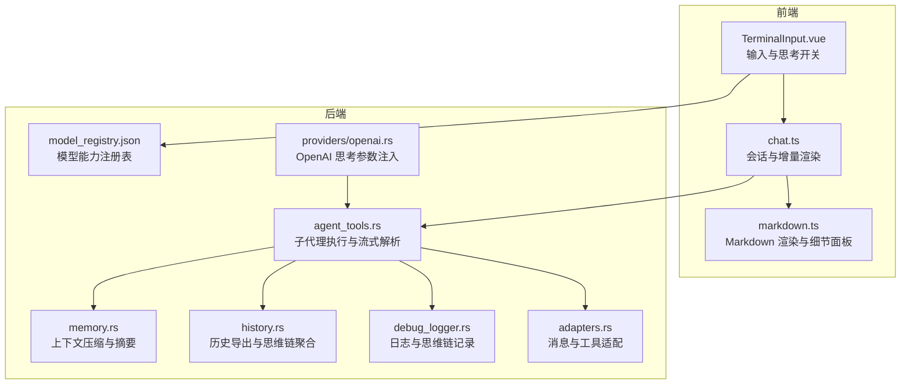
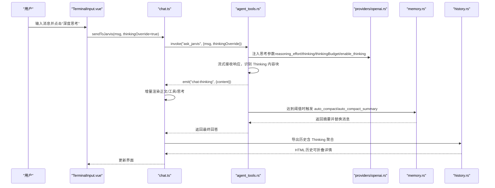
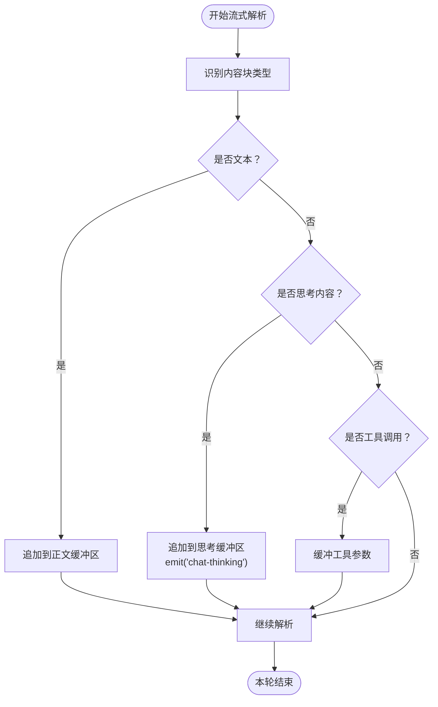
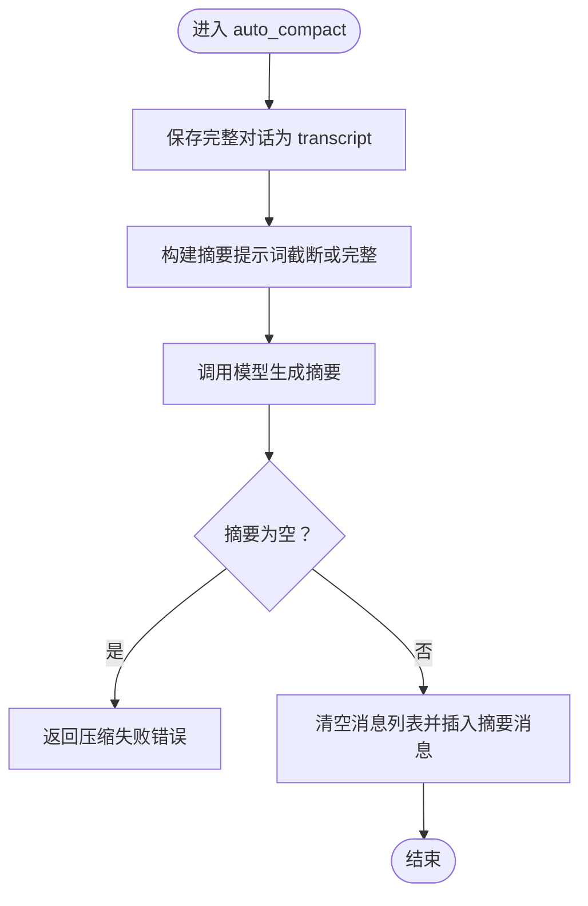
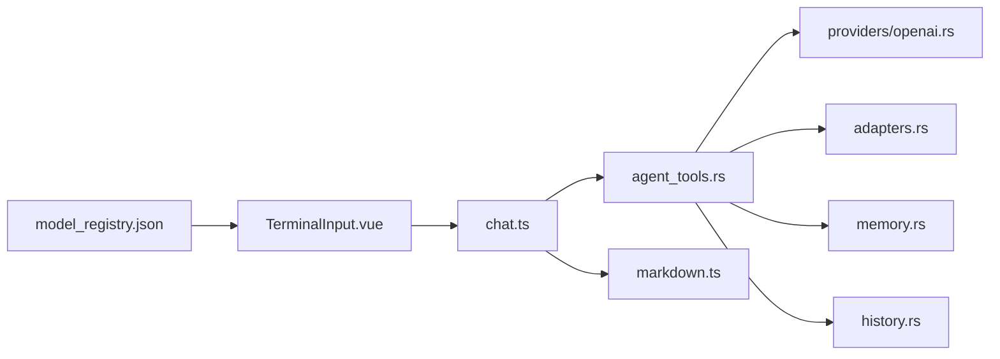

# 深度思考模式

<cite>
**本文引用的文件**
- [src-tauri/src/core/memory.rs](file://src-tauri/src/core/memory.rs)
- [src-tauri/src/core/tools/agent_tools.rs](file://src-tauri/src/core/tools/agent_tools.rs)
- [src-tauri/src/core/commands/history.rs](file://src-tauri/src/core/commands/history.rs)
- [src-tauri/src/core/debug_logger.rs](file://src-tauri/src/core/debug_logger.rs)
- [src-tauri/src/core/adapters.rs](file://src-tauri/src/core/adapters.rs)
- [src-tauri/model_registry.json](file://src-tauri/model_registry.json)
- [src/components/chat/TerminalInput.vue](file://src/components/chat/TerminalInput.vue)
- [src/stores/chat.ts](file://src/stores/chat.ts)
- [src/utils/markdown.ts](file://src/utils/markdown.ts)
- [src-tauri/src/core/providers/openai.rs](file://src-tauri/src/core/providers/openai.rs)
</cite>

## 目录
1. [简介](#简介)
2. [项目结构](#项目结构)
3. [核心组件](#核心组件)
4. [架构总览](#架构总览)
5. [详细组件分析](#详细组件分析)
6. [依赖关系分析](#依赖关系分析)
7. [性能考量](#性能考量)
8. [故障排查指南](#故障排查指南)
9. [结论](#结论)
10. [附录](#附录)

## 简介
本文件系统性阐述 JarvisAgent 的“深度思考模式”（Thinking 模式）。围绕 Thinking 内容块的处理机制、推理过程的可视化展示、上下文压缩与记忆管理进行深入解析，并重点说明 auto_compact_summary 函数的工作原理、思维链输出格式、思考内容的存储与检索方式。同时提供启用深度思考模式的操作指引、自定义提示词的方法、长文本上下文压缩策略，以及性能优化、内存管理与用户体验改进建议。

## 项目结构
与深度思考模式直接相关的代码分布在 Rust 后端与 Vue 前端两部分：
- 后端（Tauri/Rust）负责模型能力检测、深度思考参数注入、流式响应解析、思维链内容块聚合、上下文压缩与记忆归档。
- 前端（Vue）负责用户交互、能力开关、增量渲染、思维链可视化与历史导出。

图示来源
- [src/components/chat/TerminalInput.vue](file://src/components/chat/TerminalInput.vue)
- [src/stores/chat.ts](file://src/stores/chat.ts)
- [src/utils/markdown.ts](file://src/utils/markdown.ts)
- [src-tauri/src/core/tools/agent_tools.rs](file://src-tauri/src/core/tools/agent_tools.rs)
- [src-tauri/src/core/memory.rs](file://src-tauri/src/core/memory.rs)
- [src-tauri/src/core/commands/history.rs](file://src-tauri/src/core/commands/history.rs)
- [src-tauri/src/core/debug_logger.rs](file://src-tauri/src/core/debug_logger.rs)
- [src-tauri/src/core/adapters.rs](file://src-tauri/src/core/adapters.rs)
- [src-tauri/model_registry.json](file://src-tauri/model_registry.json)
- [src-tauri/src/core/providers/openai.rs](file://src-tauri/src/core/providers/openai.rs)

章节来源
- [src/components/chat/TerminalInput.vue](file://src/components/chat/TerminalInput.vue)
- [src/stores/chat.ts](file://src/stores/chat.ts)
- [src/utils/markdown.ts](file://src/utils/markdown.ts)
- [src-tauri/src/core/tools/agent_tools.rs](file://src-tauri/src/core/tools/agent_tools.rs)
- [src-tauri/src/core/memory.rs](file://src-tauri/src/core/memory.rs)
- [src-tauri/src/core/commands/history.rs](file://src-tauri/src/core/commands/history.rs)
- [src-tauri/src/core/debug_logger.rs](file://src-tauri/src/core/debug_logger.rs)
- [src-tauri/src/core/adapters.rs](file://src-tauri/src/core/adapters.rs)
- [src-tauri/model_registry.json](file://src-tauri/model_registry.json)
- [src-tauri/src/core/providers/openai.rs](file://src-tauri/src/core/providers/openai.rs)

## 核心组件
- 模型能力注册与参数注入：通过 model_registry.json 提供统一能力描述；在 OpenAI/Anthropic 等不同 API 格式下注入合适的思考参数（reasoning_effort、thinking、thinkingBudget、enable_thinking）。
- 子代理执行引擎：在 run_subagent 中根据配置决定是否开启深度思考，并在流式响应中识别 Thinking 内容块，实时推送“chat-thinking”事件。
- 上下文压缩与记忆：提供 micro_compact、auto_compact、auto_compact_summary 等函数，按阈值触发压缩，生成摘要并替换消息列表。
- 历史与可视化：history.rs 聚合 Thinking 与正文内容，markdown.ts 将其渲染为可折叠的“决策链”详情面板。
- 增量渲染与用户体验：chat.ts 对正文、工具与思考缓冲区进行增量渲染，降低渲染压力，提升流畅度。

章节来源
- [src-tauri/model_registry.json](file://src-tauri/model_registry.json)
- [src-tauri/src/core/providers/openai.rs](file://src-tauri/src/core/providers/openai.rs)
- [src-tauri/src/core/tools/agent_tools.rs](file://src-tauri/src/core/tools/agent_tools.rs)
- [src-tauri/src/core/memory.rs](file://src-tauri/src/core/memory.rs)
- [src-tauri/src/core/commands/history.rs](file://src-tauri/src/core/commands/history.rs)
- [src-tauri/src/core/debug_logger.rs](file://src-tauri/src/core/debug_logger.rs)
- [src/stores/chat.ts](file://src/stores/chat.ts)
- [src/utils/markdown.ts](file://src/utils/markdown.ts)

## 架构总览
深度思考模式的关键流程如下：

图示来源
- [src/components/chat/TerminalInput.vue](file://src/components/chat/TerminalInput.vue)
- [src/stores/chat.ts](file://src/stores/chat.ts)
- [src-tauri/src/core/tools/agent_tools.rs](file://src-tauri/src/core/tools/agent_tools.rs)
- [src-tauri/src/core/providers/openai.rs](file://src-tauri/src/core/providers/openai.rs)
- [src-tauri/src/core/memory.rs](file://src-tauri/src/core/memory.rs)
- [src-tauri/src/core/commands/history.rs](file://src-tauri/src/core/commands/history.rs)

## 详细组件分析

### 深度思考模式启用与参数注入
- 前端能力检测：TerminalInput.vue 在加载配置时调用 get_model_capabilities 获取模型能力，若模型支持 thinking，则允许用户开启“深度思考”按钮。
- 参数注入策略：
  - OpenAI：根据模型注册表中的 thinkingParam 注入 reasoning_effort、thinking、thinkingBudget 或 enable_thinking。
  - Anthropic：注入 thinking 参数并调整 max_tokens 以容纳思考开销。
- 运行时开关：当用户勾选“深度思考”，chat.ts 将 thinkingOverride 传入 ask_jarvis；后端根据配置与模型能力决定是否开启。

章节来源
- [src/components/chat/TerminalInput.vue](file://src/components/chat/TerminalInput.vue)
- [src-tauri/src/core/providers/openai.rs](file://src-tauri/src/core/providers/openai.rs)
- [src-tauri/model_registry.json](file://src-tauri/model_registry.json)
- [src/stores/chat.ts](file://src/stores/chat.ts)

### Thinking 内容块处理与推理可视化
- 流式解析：agent_tools.rs 在 OpenAI 与 Anthropic 两种流式协议下分别解析 content_block_delta 与 content_block_start/delta，识别 Text、Thinking、ToolUse 三类内容块。
- 实时上报：每当检测到 Thinking 内容块，立即 emit("chat-thinking", {content})，前端 chat.ts 增量更新 thinkingBuffer 并通过 markdown.ts 渲染为“正在思考与执行操作”的详情面板。
- 思维链聚合：history.rs 将所有 Thinking 内容块合并为“决策链”摘要，配合正文内容一并导出为 HTML 历史。

图示来源
- [src-tauri/src/core/tools/agent_tools.rs](file://src-tauri/src/core/tools/agent_tools.rs)
- [src/stores/chat.ts](file://src/stores/chat.ts)
- [src/utils/markdown.ts](file://src/utils/markdown.ts)
- [src-tauri/src/core/commands/history.rs](file://src-tauri/src/core/commands/history.rs)

章节来源
- [src-tauri/src/core/tools/agent_tools.rs](file://src-tauri/src/core/tools/agent_tools.rs)
- [src/stores/chat.ts](file://src/stores/chat.ts)
- [src/utils/markdown.ts](file://src/utils/markdown.ts)
- [src-tauri/src/core/commands/history.rs](file://src-tauri/src/core/commands/history.rs)

### 上下文压缩与记忆管理
- 微压缩（micro_compact）：保留最近若干条工具结果，其余过长结果以“[Previous: used {工具名}]”占位，降低 token 占用。
- 自动压缩（auto_compact）：当消息总长度超过阈值时，先将完整对话转存为 transcript 文件，再调用模型生成摘要，替换消息列表为“[Conversation compressed...] + 摘要 + Assistant 确认”。
- 摘要生成（auto_compact_summary）：独立的摘要函数，用于在需要时直接生成摘要文本，不修改消息列表。
- 记忆归档：memory.rs 提供 run_memory_agent，结合全局/项目记忆文件，通过工具调用更新记忆内容。

图示来源
- [src-tauri/src/core/memory.rs](file://src-tauri/src/core/memory.rs)

章节来源
- [src-tauri/src/core/memory.rs](file://src-tauri/src/core/memory.rs)

### 思维链输出格式与存储检索
- 输出格式：Thinking 内容块在历史导出时被聚合为“决策链”摘要，正文与工具调用信息也一并导出，形成完整的可折叠详情。
- 存储：聊天历史以 HTML 形式保存，其中正文与 Thinking 内容均被渲染并可折叠查看。
- 检索：history.rs 支持按消息遍历，聚合 Thinking 与正文，便于导出与回放。

章节来源
- [src-tauri/src/core/commands/history.rs](file://src-tauri/src/core/commands/history.rs)
- [src-tauri/src/core/debug_logger.rs](file://src-tauri/src/core/debug_logger.rs)

### 如何启用深度思考模式
- 步骤一：在终端输入框中，检查“深度思考”按钮是否可用（由模型能力决定）。
- 步骤二：勾选“深度思考”按钮，随后发送消息。
- 步骤三：在聊天界面观察“正在思考与执行操作”的详情面板，即可看到实时的思维链。
- 步骤四：结束会话后，可在历史中查看“已完成思考与操作”的可折叠详情。

章节来源
- [src/components/chat/TerminalInput.vue](file://src/components/chat/TerminalInput.vue)
- [src/stores/chat.ts](file://src/stores/chat.ts)
- [src/utils/markdown.ts](file://src/utils/markdown.ts)

### 自定义思考提示词
- 当需要对摘要生成进行定制时，可调用 auto_compact_summary 函数传入自定义提示词，由模型生成结构化的摘要文本，再由前端或后端进行后续处理。
- 注意：摘要生成需满足模型能力要求（如支持 reasoning_effort/thinking/thinkingBudget/enable_thinking）。

章节来源
- [src-tauri/src/core/memory.rs](file://src-tauri/src/core/memory.rs)
- [src-tauri/model_registry.json](file://src-tauri/model_registry.json)

### 处理长文本的上下文压缩
- 触发条件：当消息总长度超过阈值（例如超过一定字符数或 token 估算值）时，自动触发压缩。
- 压缩策略：
  - micro_compact：对旧工具结果进行占位压缩；
  - auto_compact：保存 transcript 并生成摘要，替换消息列表；
  - auto_compact_summary：仅生成摘要文本，不修改消息列表。
- 适用场景：无限会话、长时间对话、大量工具结果导致上下文膨胀。

章节来源
- [src-tauri/src/core/memory.rs](file://src-tauri/src/core/memory.rs)

## 依赖关系分析
- 组件耦合：
  - TerminalInput.vue 依赖模型能力注册表与配置，决定“深度思考”按钮可用性。
  - chat.ts 依赖后端事件（chat-thinking）与渲染工具（markdown.ts）实现增量渲染与详情面板。
  - agent_tools.rs 依赖 providers/openai.rs 与 adapters.rs，注入思考参数并解析流式响应。
  - memory.rs 依赖模型能力与 API 格式，调用摘要模型生成摘要。
  - history.rs 依赖 ContentBlock 类型，聚合 Thinking 与正文。
- 外部依赖：
  - model_registry.json 提供统一能力描述，避免硬编码。
  - OpenAI/Anthropic API 格式差异通过 adapters.rs 与 providers/openai.rs 适配。

图示来源
- [src-tauri/model_registry.json](file://src-tauri/model_registry.json)
- [src/components/chat/TerminalInput.vue](file://src/components/chat/TerminalInput.vue)
- [src/stores/chat.ts](file://src/stores/chat.ts)
- [src-tauri/src/core/tools/agent_tools.rs](file://src-tauri/src/core/tools/agent_tools.rs)
- [src-tauri/src/core/providers/openai.rs](file://src-tauri/src/core/providers/openai.rs)
- [src-tauri/src/core/adapters.rs](file://src-tauri/src/core/adapters.rs)
- [src-tauri/src/core/memory.rs](file://src-tauri/src/core/memory.rs)
- [src-tauri/src/core/commands/history.rs](file://src-tauri/src/core/commands/history.rs)
- [src/utils/markdown.ts](file://src/utils/markdown.ts)

章节来源
- [src-tauri/model_registry.json](file://src-tauri/model_registry.json)
- [src-tauri/src/core/tools/agent_tools.rs](file://src-tauri/src/core/tools/agent_tools.rs)
- [src-tauri/src/core/providers/openai.rs](file://src-tauri/src/core/providers/openai.rs)
- [src-tauri/src/core/adapters.rs](file://src-tauri/src/core/adapters.rs)
- [src-tauri/src/core/memory.rs](file://src-tauri/src/core/memory.rs)
- [src-tauri/src/core/commands/history.rs](file://src-tauri/src/core/commands/history.rs)
- [src/stores/chat.ts](file://src/stores/chat.ts)
- [src/utils/markdown.ts](file://src/utils/markdown.ts)

## 性能考量
- 流式解析与增量渲染：前端对正文、工具与思考缓冲区进行增量渲染，减少全量解析与 DOM 更新频率。
- 节流与帧调度：flushCurrentTurnRender 使用 requestAnimationFrame 与最小间隔节流，避免频繁重绘。
- 思考参数优化：根据模型能力选择合适参数（reasoning_effort、thinking、thinkingBudget、enable_thinking），避免不必要的 token 开支。
- 上下文压缩：在达到阈值时及时压缩，防止 token 超限导致请求失败或延迟增加。
- 日志与调试：debug_logger.rs 记录请求/响应与思维链，便于定位性能瓶颈与问题根因。

章节来源
- [src/stores/chat.ts](file://src/stores/chat.ts)
- [src-tauri/src/core/debug_logger.rs](file://src-tauri/src/core/debug_logger.rs)
- [src-tauri/src/core/memory.rs](file://src-tauri/src/core/memory.rs)

## 故障排查指南
- “深度思考”按钮不可用：
  - 检查模型能力注册表中 thinking 与 thinkingParam 设置是否正确。
  - 确认前端已成功调用 get_model_capabilities 并更新 canModelThink。
- 思维链不显示：
  - 检查后端是否正确识别 Thinking 内容块并 emit("chat-thinking")。
  - 确认前端 chat.ts 是否订阅并更新 thinkingBuffer。
- 压缩失败：
  - 检查 auto_compact/auto_compact_summary 的返回值，确认摘要文本非空。
  - 查看 debug_logger.rs 中的请求/响应日志，定位模型调用异常。
- 历史导出缺失思维链：
  - 检查 history.rs 是否正确聚合 Thinking 内容块。
  - 确认 markdown.ts 的 renderToolDetails 是否被调用。

章节来源
- [src-tauri/src/core/tools/agent_tools.rs](file://src-tauri/src/core/tools/agent_tools.rs)
- [src/stores/chat.ts](file://src/stores/chat.ts)
- [src-tauri/src/core/memory.rs](file://src-tauri/src/core/memory.rs)
- [src-tauri/src/core/commands/history.rs](file://src-tauri/src/core/commands/history.rs)
- [src-tauri/src/core/debug_logger.rs](file://src-tauri/src/core/debug_logger.rs)

## 结论
深度思考模式通过“能力检测 + 参数注入 + 流式解析 + 增量渲染 + 上下文压缩 + 历史聚合”的完整链路，实现了可观察、可压缩、可导出的推理过程可视化。借助 model_registry.json 与 providers/adapters 的适配层，系统能够兼容多种模型与 API 格式；通过 micro_compact/auto_compact/auto_compact_summary 的分层压缩策略，保障长会话的稳定性与性能。建议在实际部署中结合业务场景合理设置压缩阈值与渲染节流参数，持续优化用户体验与资源占用。

## 附录
- 关键实现位置参考：
  - 模型能力与参数注入：[providers/openai.rs](file://src-tauri/src/core/providers/openai.rs)，[model_registry.json](file://src-tauri/model_registry.json)
  - 流式解析与思维链推送：[agent_tools.rs](file://src-tauri/src/core/tools/agent_tools.rs)
  - 上下文压缩与摘要：[memory.rs](file://src-tauri/src/core/memory.rs)
  - 历史聚合与导出：[history.rs](file://src-tauri/src/core/commands/history.rs)
  - 增量渲染与详情面板：[chat.ts](file://src/stores/chat.ts)，[markdown.ts](file://src/utils/markdown.ts)
  - 能力检测与开关：[TerminalInput.vue](file://src/components/chat/TerminalInput.vue)