# 核心功能模块

<cite>
**本文引用的文件**
- [README.md](file://README.md)
- [src/main.ts](file://src/main.ts)
- [src-tauri/src/main.rs](file://src-tauri/src/main.rs)
- [src-tauri/Cargo.toml](file://src-tauri/Cargo.toml)
- [package.json](file://package.json)
- [src-tauri/src/lib.rs](file://src-tauri/src/lib.rs)
- [src/composables/useJarvis.ts](file://src/composables/useJarvis.ts)
- [src-tauri/src/core/mod.rs](file://src-tauri/src/core/mod.rs)
- [src-tauri/src/core/intent.rs](file://src-tauri/src/core/intent.rs)
- [src-tauri/src/core/models.rs](file://src-tauri/src/core/models.rs)
- [src-tauri/src/core/tools/mod.rs](file://src-tauri/src/core/tools/mod.rs)
- [src-tauri/src/core/subagents.rs](file://src-tauri/src/core/subagents.rs)
- [src-tauri/src/core/tasks.rs](file://src-tauri/src/core/tasks.rs)
- [src-tauri/src/core/sessions.rs](file://src-tauri/src/core/sessions.rs)
- [src-tauri/src/core/providers/mod.rs](file://src-tauri/src/core/providers/mod.rs)
- [src-tauri/src/core/providers/anthropic.rs](file://src-tauri/src/core/providers/anthropic.rs)
- [src-tauri/src/core/providers/openai.rs](file://src-tauri/src/core/providers/openai.rs)
- [src-tauri/src/core/snapshot_engine/mod.rs](file://src-tauri/src/core/snapshot_engine/mod.rs)
- [src-tauri/src/core/snapshot_engine/snapshot.rs](file://src-tauri/src/core/snapshot_engine/snapshot.rs)
- [src-tauri/src/core/snapshot_engine/journal.rs](file://src-tauri/src/core/snapshot_engine/journal.rs)
- [src-tauri/src/core/snapshot_engine/patch.rs](file://src-tauri/src/core/snapshot_engine/patch.rs)
- [src-tauri/src/core/snapshot_engine/replay.rs](file://src-tauri/src/core/snapshot_engine/replay.rs)
- [src-tauri/src/core/snapshot_engine/gc.rs](file://src-tauri/src/core/snapshot_engine/gc.rs)
- [src-tauri/src/core/snapshot_engine/multi_agent/mod.rs](file://src-tauri/src/core/snapshot_engine/multi_agent/mod.rs)
- [src-tauri/src/core/snapshot_engine/multi_agent/merge.rs](file://src-tauri/src/core/snapshot_engine/multi_agent/merge.rs)
- [src-tauri/src/core/snapshot_engine/multi_agent/sandbox.rs](file://src-tauri/src/core/snapshot_engine/multi_agent/sandbox.rs)
- [src-tauri/src/core/snapshot_manager/mod.rs](file://src-tauri/src/core/snapshot_manager/mod.rs)
- [src-tauri/src/core/snapshot_manager/store.rs](file://src-tauri/src/core/snapshot_manager/store.rs)
- [src-tauri/src/core/snapshot_manager/session_manager.rs](file://src-tauri/src/core/snapshot_manager/session_manager.rs)
- [src-tauri/src/core/commands/checkpoint.rs](file://src-tauri/src/core/commands/checkpoint.rs)
- [src-tauri/src/core/session/checkpoint.rs](file://src-tauri/src/core/session/checkpoint.rs)
- [src-tauri/src/core/traits.rs](file://src-tauri/src/core/traits.rs)
- [src/types/index.ts](file://src/types/index.ts)
</cite>

## 更新摘要
**所做更改**
- 新增统一 Provider 抽象层，支持 Anthropic 和 OpenAI 兼容格式
- 新增快照引擎和检查点系统，提供文件级变更跟踪和回滚能力
- 新增子代理委派机制，支持多智能体协作和任务分配
- 新增方案审批机制，提供提案流程和预览功能
- 更新智能对话系统，增强多模型支持和深度思考模式

## 目录
1. [简介](#简介)
2. [项目结构](#项目结构)
3. [核心组件](#核心组件)
4. [架构总览](#架构总览)
5. [详细组件分析](#详细组件分析)
6. [依赖分析](#依赖分析)
7. [性能考虑](#性能考虑)
8. [故障排查指南](#故障排查指南)
9. [结论](#结论)
10. [附录](#附录)

## 简介
本文件面向 JarvisAgent 的核心功能模块，围绕以下能力进行系统化说明：
- 智能对话系统：意图识别、统一 Provider 抽象、深度思考模式、会话管理
- 文件管理系统：文件读写、搜索、编辑、路径安全控制
- Shell 集成：命令执行、PowerShell 集成、后台任务管理
- Git 集成：版本控制、只读操作
- 任务管理系统：任务看板、进度跟踪、协作功能
- 子代理系统：统一 Provider 抽象、独立执行环境、代理编排、监控
- 快照引擎：文件级变更跟踪、检查点系统、多智能体沙箱隔离
- 方案审批机制：提案流程、预览功能、执行控制

目标是帮助开发者与使用者理解模块职责、调用关系、接口规范与使用模式。

## 项目结构
JarvisAgent 采用前后端分离的桌面应用架构：
- 前端（Vue 3 + TypeScript）负责 UI、事件监听与状态渲染
- 后端（Tauri 2.0 + Rust）负责核心 Agent 循环、工具调用、会话持久化、子代理编排与系统集成

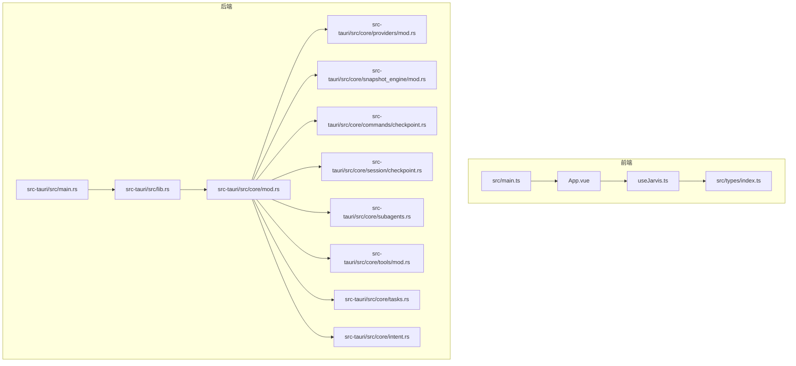

**图表来源**
- [src/main.ts:1-6](file://src/main.ts#L1-L6)
- [src-tauri/src/main.rs:1-7](file://src-tauri/src/main.rs#L1-L7)
- [src-tauri/src/lib.rs:1-186](file://src-tauri/src/lib.rs#L1-L186)
- [src-tauri/src/core/mod.rs:1-60](file://src-tauri/src/core/mod.rs#L1-L60)
- [src-tauri/src/core/providers/mod.rs:1-3](file://src-tauri/src/core/providers/mod.rs#L1-L3)
- [src-tauri/src/core/snapshot_engine/mod.rs:1-14](file://src-tauri/src/core/snapshot_engine/mod.rs#L1-L14)
- [src-tauri/src/core/commands/checkpoint.rs:1-270](file://src-tauri/src/core/commands/checkpoint.rs#L1-L270)
- [src-tauri/src/core/session/checkpoint.rs:1-514](file://src-tauri/src/core/session/checkpoint.rs#L1-L514)

**章节来源**
- [README.md:107-161](file://README.md#L107-L161)
- [src/main.ts:1-6](file://src/main.ts#L1-L6)
- [src-tauri/src/main.rs:1-7](file://src-tauri/src/main.rs#L1-L7)
- [src-tauri/src/lib.rs:1-186](file://src-tauri/src/lib.rs#L1-L186)
- [src-tauri/src/core/mod.rs:1-60](file://src-tauri/src/core/mod.rs#L1-L60)

## 核心组件
- 统一 Provider 抽象：支持 Anthropic 和 OpenAI 兼容格式的统一接口
- 意图识别与分类：根据规则与上下文进行意图判定，必要时回退至 LLM 分类
- 工具系统：按意图动态加载工具集合，统一路由分发
- 会话管理：多会话持久化、标题生成、令牌用量统计、图片缓存
- 子代理系统：统一 Provider 抽象、独立运行环境、心跳监控、取消机制、事件追踪
- 快照引擎：文件级变更跟踪、检查点系统、多智能体沙箱隔离
- 任务管理：任务看板、依赖关系、进度汇总
- Shell/Git 集成：命令执行、后台任务、只读 Git 操作
- 方案审批：提案提交、预览面板、状态流转

**章节来源**
- [src-tauri/src/core/providers/mod.rs:1-3](file://src-tauri/src/core/providers/mod.rs#L1-L3)
- [src-tauri/src/core/providers/anthropic.rs:1-53](file://src-tauri/src/core/providers/anthropic.rs#L1-L53)
- [src-tauri/src/core/providers/openai.rs:1-105](file://src-tauri/src/core/providers/openai.rs#L1-L105)
- [src-tauri/src/core/intent.rs:1-225](file://src-tauri/src/core/intent.rs#L1-L225)
- [src-tauri/src/core/tools/mod.rs:1-454](file://src-tauri/src/core/tools/mod.rs#L1-L454)
- [src-tauri/src/core/sessions.rs:1-499](file://src-tauri/src/core/sessions.rs#L1-L499)
- [src-tauri/src/core/subagents.rs:1-666](file://src-tauri/src/core/subagents.rs#L1-L666)
- [src-tauri/src/core/snapshot_engine/mod.rs:1-14](file://src-tauri/src/core/snapshot_engine/mod.rs#L1-L14)
- [src-tauri/src/core/snapshot_engine/snapshot.rs:1-425](file://src-tauri/src/core/snapshot_engine/snapshot.rs#L1-L425)
- [src-tauri/src/core/tasks.rs:1-241](file://src-tauri/src/core/tasks.rs#L1-L241)
- [src-tauri/src/core/models.rs:1-256](file://src-tauri/src/core/models.rs#L1-L256)
- [src/types/index.ts:1-365](file://src/types/index.ts#L1-L365)

## 架构总览
整体流程：前端发起对话，后端进行意图分类，按意图加载工具集，进入 Agent 循环（思考→工具调用→观察），流式输出到前端；同时会话与子代理状态通过事件驱动在前后端之间同步。新的统一 Provider 抽象层为多模型支持提供了统一接口。

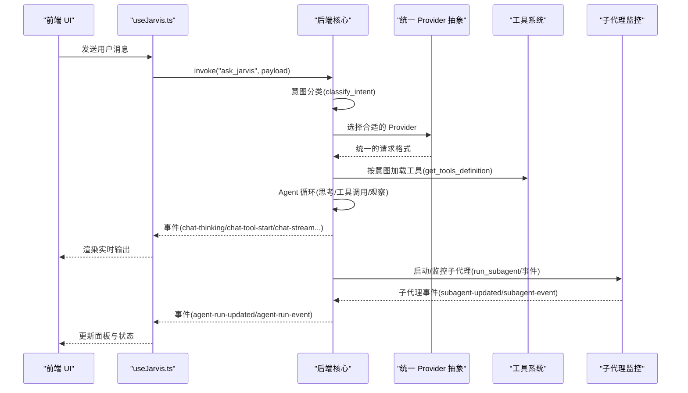

**图表来源**
- [src-tauri/src/lib.rs:102-182](file://src-tauri/src/lib.rs#L102-L182)
- [src-tauri/src/core/intent.rs:1-225](file://src-tauri/src/core/intent.rs#L1-L225)
- [src-tauri/src/core/providers/anthropic.rs:10-51](file://src-tauri/src/core/providers/anthropic.rs#L10-L51)
- [src-tauri/src/core/providers/openai.rs:23-103](file://src-tauri/src/core/providers/openai.rs#L23-L103)
- [src-tauri/src/core/tools/mod.rs:381-453](file://src-tauri/src/core/tools/mod.rs#L381-L453)
- [src-tauri/src/core/subagents.rs:116-177](file://src-tauri/src/core/subagents.rs#L116-L177)
- [src/composables/useJarvis.ts:621-800](file://src/composables/useJarvis.ts#L621-L800)

**章节来源**
- [README.md:162-201](file://README.md#L162-L201)
- [src-tauri/src/lib.rs:102-182](file://src-tauri/src/lib.rs#L102-L182)
- [src/composables/useJarvis.ts:621-800](file://src/composables/useJarvis.ts#L621-L800)

## 详细组件分析

### 统一 Provider 抽象（Anthropic/OpenAI 兼容）
- Provider 接口设计
  - LlmProvider trait 定义统一的抽象接口
  - 支持不同 API 格式的请求体构建
  - 深度思考模式的差异化处理
- Anthropic Provider
  - 直接使用原生 Anthropic API 格式
  - 支持 thinking 配置和预算令牌设置
  - 自动调整最大令牌数以支持深度思考
- OpenAI Provider
  - 支持多种 OpenAI 兼容格式
  - 智能推理努力级别和思考参数适配
  - DeepSeek 模型的特殊处理逻辑

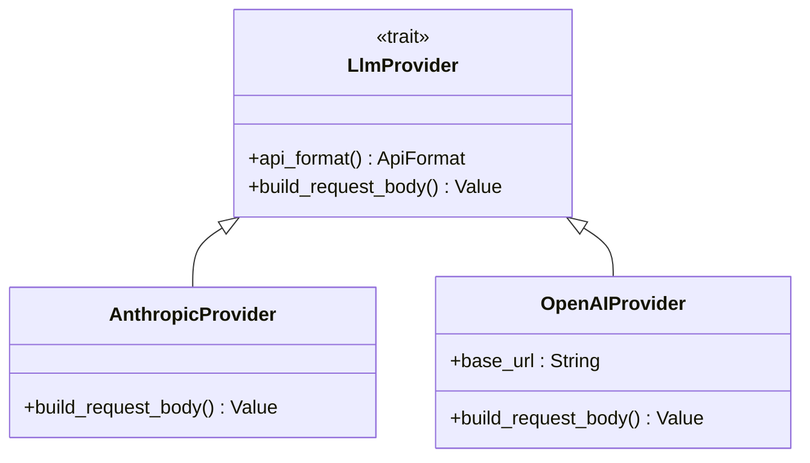

**图表来源**
- [src-tauri/src/core/providers/anthropic.rs:8-51](file://src-tauri/src/core/providers/anthropic.rs#L8-L51)
- [src-tauri/src/core/providers/openai.rs:13-103](file://src-tauri/src/core/providers/openai.rs#L13-L103)
- [src-tauri/src/core/traits.rs](file://src-tauri/src/core/traits.rs)

**章节来源**
- [src-tauri/src/core/providers/mod.rs:1-3](file://src-tauri/src/core/providers/mod.rs#L1-L3)
- [src-tauri/src/core/providers/anthropic.rs:1-53](file://src-tauri/src/core/providers/anthropic.rs#L1-L53)
- [src-tauri/src/core/providers/openai.rs:1-105](file://src-tauri/src/core/providers/openai.rs#L1-L105)
- [src-tauri/src/core/traits.rs](file://src-tauri/src/core/traits.rs)

### 快照引擎与检查点系统
- 快照引擎架构
  - 支持文件级变更跟踪和原子性操作
  - 多智能体沙箱隔离和冲突解决
  - 工作区状态管理和补丁应用
- 检查点系统
  - 树状检查点管理，支持分支和回滚
  - 文件备份和恢复机制
  - 会话元数据清理和修剪
- 核心数据结构
  - Snapshot：单个快照节点，包含补丁和元数据
  - SnapshotTree：快照树结构，支持多分支管理
  - Checkpoint：检查点实体，用于会话回滚
  - WorkspaceState：工作区状态快照

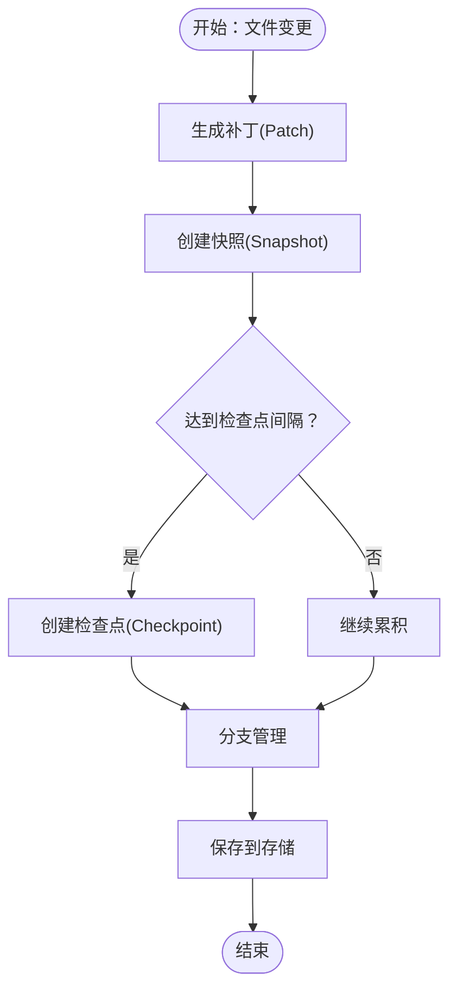

**图表来源**
- [src-tauri/src/core/snapshot_engine/snapshot.rs:218-256](file://src-tauri/src/core/snapshot_engine/snapshot.rs#L218-L256)
- [src-tauri/src/core/commands/checkpoint.rs:240-259](file://src-tauri/src/core/commands/checkpoint.rs#L240-L259)
- [src-tauri/src/core/session/checkpoint.rs:281-314](file://src-tauri/src/core/session/checkpoint.rs#L281-L314)

**章节来源**
- [src-tauri/src/core/snapshot_engine/mod.rs:1-14](file://src-tauri/src/core/snapshot_engine/mod.rs#L1-L14)
- [src-tauri/src/core/snapshot_engine/snapshot.rs:1-425](file://src-tauri/src/core/snapshot_engine/snapshot.rs#L1-L425)
- [src-tauri/src/core/commands/checkpoint.rs:1-270](file://src-tauri/src/core/commands/checkpoint.rs#L1-L270)
- [src-tauri/src/core/session/checkpoint.rs:1-514](file://src-tauri/src/core/session/checkpoint.rs#L1-L514)

### 子代理委派机制
- 生命周期管理
  - 启动：记录运行信息、标签与只读标记
  - 监控：心跳更新、阶段与工具调用事件
  - 结束：成功/失败/取消，生成摘要
- 状态机设计
  - Starting → WaitingModel → Streaming → Thinking
  - CallingTool → ProcessingToolResult → Finalizing
- 取消机制
  - 使用 CancellationToken 实现运行中取消
  - 支持单个子代理取消和会话级取消
- 事件系统
  - subagent-updated：运行状态更新
  - subagent-event：阶段/工具/完成/取消/错误事件

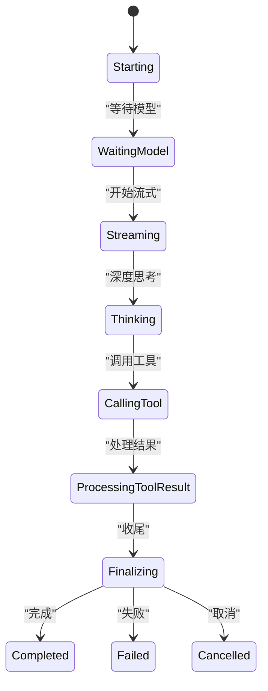

**图表来源**
- [src-tauri/src/core/subagents.rs:10-71](file://src-tauri/src/core/subagents.rs#L10-L71)
- [src-tauri/src/core/subagents.rs:116-177](file://src-tauri/src/core/subagents.rs#L116-L177)
- [src-tauri/src/core/subagents.rs:304-339](file://src-tauri/src/core/subagents.rs#L304-L339)

**章节来源**
- [src-tauri/src/core/subagents.rs:1-666](file://src-tauri/src/core/subagents.rs#L1-L666)

### 智能对话系统（统一 Provider 抽象、深度思考模式、会话管理）
- 意图识别
  - 规则优先：对常见意图进行快速判定
  - 上下文感知：结合最近助手动作进行二次判定
  - LLM 回退：规则与上下文无法确定时，构造上下文并调用 LLM 进行分类
- 统一 Provider 抽象
  - 通过 LlmProvider trait 支持多种模型提供商
  - 自动适配不同 API 格式和参数要求
  - 深度思考模式的差异化处理
- 深度思考模式
  - 在请求体中注入思考配置，驱动模型逐步推理
  - 不同 Provider 的思考参数适配
- 会话管理
  - 会话持久化：按消息过滤保存，仅保留对话与图片等有效内容
  - 标题生成：从第一条用户消息提取标题
  - 令牌用量：累计会话输入/输出 token
  - 图片缓存：Base64 解码后落盘，消息中仅保留文件名

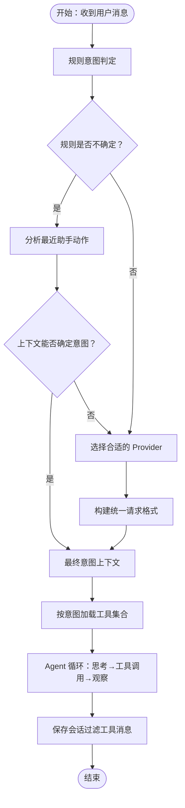

**图表来源**
- [src-tauri/src/core/intent.rs:4-63](file://src-tauri/src/core/intent.rs#L4-L63)
- [src-tauri/src/core/providers/anthropic.rs:15-51](file://src-tauri/src/core/providers/anthropic.rs#L15-L51)
- [src-tauri/src/core/providers/openai.rs:28-103](file://src-tauri/src/core/providers/openai.rs#L28-L103)
- [src-tauri/src/core/sessions.rs:218-364](file://src-tauri/src/core/sessions.rs#L218-L364)

**章节来源**
- [src-tauri/src/core/intent.rs:1-225](file://src-tauri/src/core/intent.rs#L1-L225)
- [src-tauri/src/core/providers/anthropic.rs:1-53](file://src-tauri/src/core/providers/anthropic.rs#L1-L53)
- [src-tauri/src/core/providers/openai.rs:1-105](file://src-tauri/src/core/providers/openai.rs#L1-L105)
- [src-tauri/src/core/models.rs:21-68](file://src-tauri/src/core/models.rs#L21-L68)
- [src-tauri/src/core/sessions.rs:126-160](file://src-tauri/src/core/sessions.rs#L126-L160)

### 文件管理系统（文件读写、搜索、编辑、路径安全控制）
- 工具能力
  - 读取文件、骨架提取、写入、编辑、目录列举、全局搜索
- 路径安全
  - 严格沙箱限制：会话绑定工作目录，路径遍历检测与拦截
  - 权限审批：敏感操作需用户确认
- 搜索策略
  - 自动忽略编译产物与静态资源，提升搜索效率

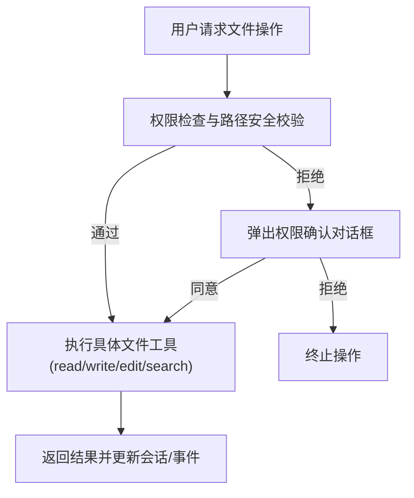

**图表来源**
- [src-tauri/src/core/tools/mod.rs:89-379](file://src-tauri/src/core/tools/mod.rs#L89-L379)
- [src-tauri/src/core/sessions.rs:74-76](file://src-tauri/src/core/sessions.rs#L74-L76)

**章节来源**
- [src-tauri/src/core/tools/mod.rs:148-254](file://src-tauri/src/core/tools/mod.rs#L148-L254)
- [src-tauri/src/core/sessions.rs:74-76](file://src-tauri/src/core/sessions.rs#L74-L76)

### Shell 集成（命令执行、PowerShell 集成、后台任务管理）
- 命令执行
  - run_shell：Windows PowerShell 同步执行（高风险）
  - git_command：只读 Git 操作（status/diff/log）
- 后台任务
  - background_run：长周期任务异步执行，返回任务 ID
  - check_background：查询后台任务状态（严禁轮询）

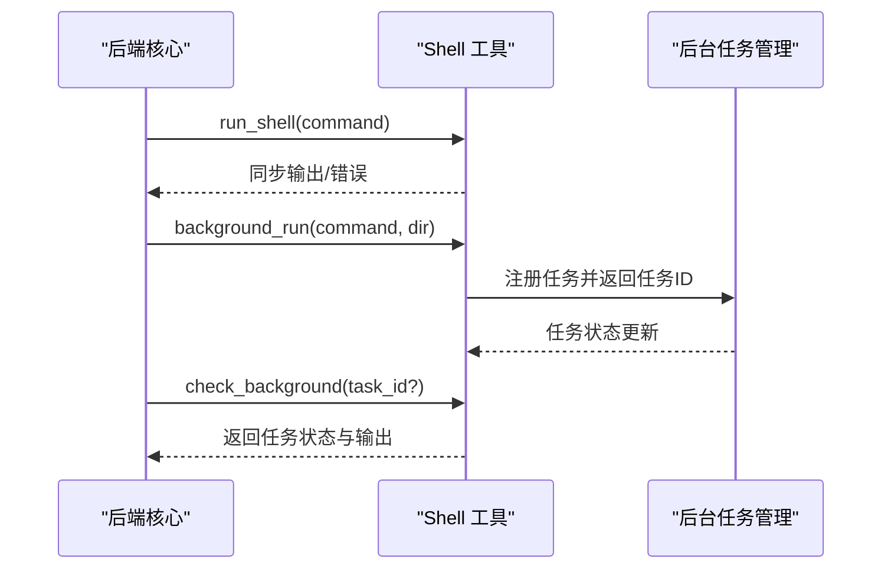

**图表来源**
- [src-tauri/src/core/tools/mod.rs:430-434](file://src-tauri/src/core/tools/mod.rs#L430-L434)
- [src-tauri/src/lib.rs:102-182](file://src-tauri/src/lib.rs#L102-L182)

**章节来源**
- [src-tauri/src/core/tools/mod.rs:172-194](file://src-tauri/src/core/tools/mod.rs#L172-L194)
- [src-tauri/src/core/tools/mod.rs:317-337](file://src-tauri/src/core/tools/mod.rs#L317-L337)

### Git 集成（版本控制、只读操作）
- 仅支持只读 Git 操作，禁止修改历史或推送
- 适用于状态查看、差异对比、日志查询

**章节来源**
- [src-tauri/src/core/tools/mod.rs:172-185](file://src-tauri/src/core/tools/mod.rs#L172-L185)

### 任务管理系统（任务看板、进度跟踪、协作功能）
- 任务 CRUD：创建、更新、查询、列表、摘要
- 依赖关系：blocked_by 与 blocks 字段维护依赖图
- 协作与进度：摘要报告识别瓶颈与可启动任务

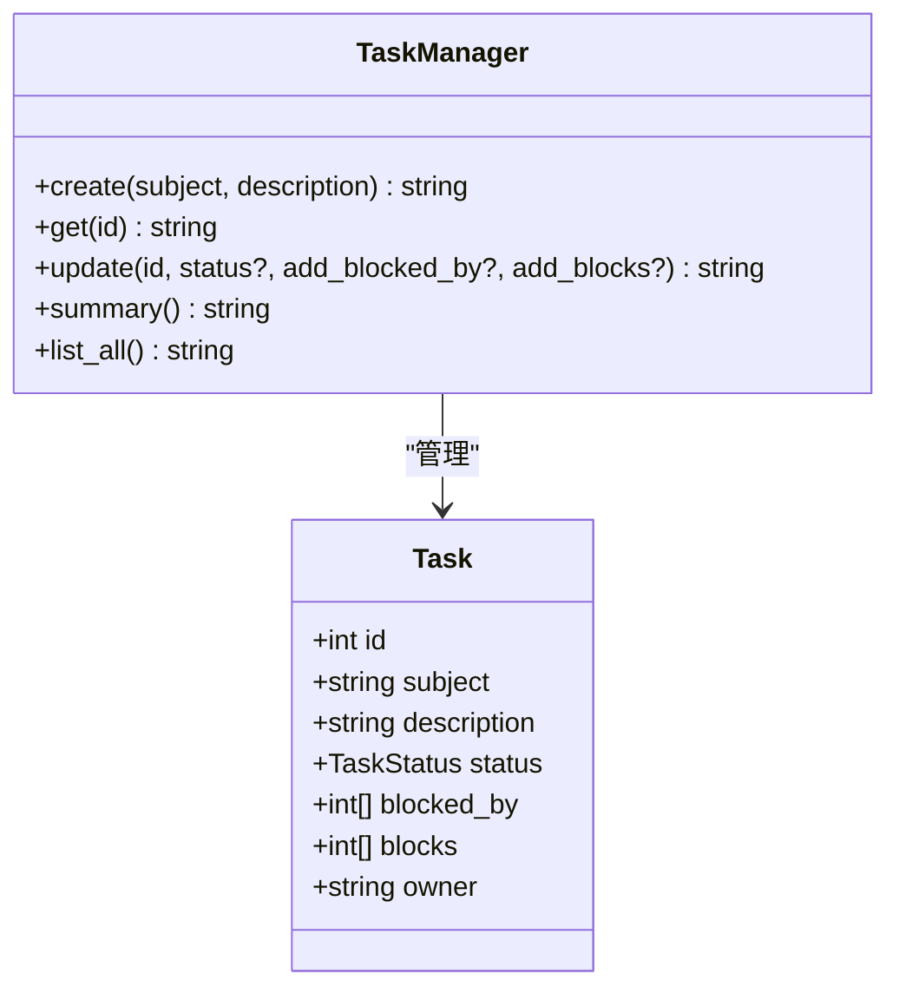

**图表来源**
- [src-tauri/src/core/tasks.rs:6-241](file://src-tauri/src/core/tasks.rs#L6-L241)
- [src-tauri/src/core/models.rs:247-256](file://src-tauri/src/core/models.rs#L247-L256)

**章节来源**
- [src-tauri/src/core/tasks.rs:50-202](file://src-tauri/src/core/tasks.rs#L50-L202)
- [src-tauri/src/core/models.rs:237-256](file://src-tauri/src/core/models.rs#L237-L256)

### 方案审批机制（提案流程、预览功能、执行控制）
- 提案提交：propose_plan 工具提交方案文档
- 预览与决策：前端弹出预览面板，用户同意后创建并执行任务
- 状态流转：方案文档状态由 pending → approved/rejected

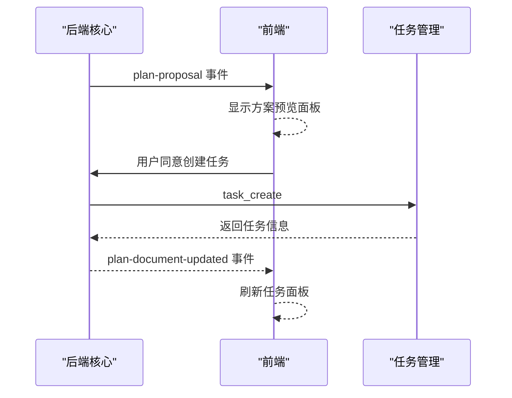

**图表来源**
- [src/composables/useJarvis.ts:634-660](file://src/composables/useJarvis.ts#L634-L660)
- [src-tauri/src/core/tools/mod.rs:354-364](file://src-tauri/src/core/tools/mod.rs#L354-L364)
- [src-tauri/src/core/tasks.rs:50-63](file://src-tauri/src/core/tasks.rs#L50-L63)

**章节来源**
- [README.md:191-201](file://README.md#L191-L201)
- [src/composables/useJarvis.ts:634-660](file://src/composables/useJarvis.ts#L634-L660)
- [src-tauri/src/core/tools/mod.rs:354-364](file://src-tauri/src/core/tools/mod.rs#L354-L364)

## 依赖分析
- 前端依赖
  - @tauri-apps/api：与后端命令通信
  - marked：Markdown 渲染
  - vue：响应式 UI
- 后端依赖
  - tauri、reqwest、tokio、eventsource-stream、futures-util 等
  - 通过 lib.rs 注册命令与状态管理器，暴露 invoke handler
  - 新增统一 Provider 抽象依赖
  - 快照引擎和检查点系统的完整模块依赖

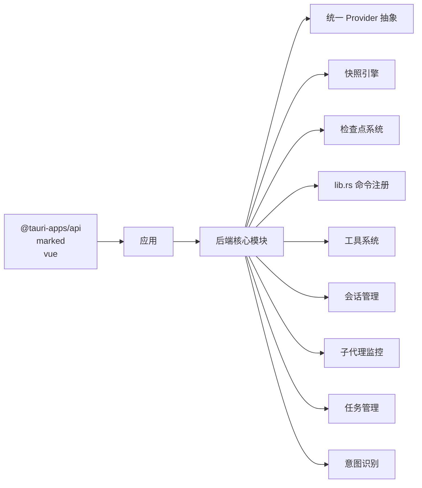

**图表来源**
- [package.json:12-26](file://package.json#L12-L26)
- [src-tauri/Cargo.toml:20-39](file://src-tauri/Cargo.toml#L20-L39)
- [src-tauri/src/lib.rs:102-182](file://src-tauri/src/lib.rs#L102-L182)
- [src-tauri/src/core/providers/mod.rs:1-3](file://src-tauri/src/core/providers/mod.rs#L1-L3)
- [src-tauri/src/core/snapshot_engine/mod.rs:1-14](file://src-tauri/src/core/snapshot_engine/mod.rs#L1-L14)
- [src-tauri/src/core/commands/checkpoint.rs:1-270](file://src-tauri/src/core/commands/checkpoint.rs#L1-L270)

**章节来源**
- [package.json:12-26](file://package.json#L12-L26)
- [src-tauri/Cargo.toml:20-39](file://src-tauri/Cargo.toml#L20-L39)
- [src-tauri/src/lib.rs:102-182](file://src-tauri/src/lib.rs#L102-L182)

## 性能考虑
- 流式输出：SSE/流式 API，前端按帧刷新，降低延迟
- 上下文压缩：提供 compact 工具与自动压缩，控制 token 使用
- 后台任务：长周期任务异步执行，避免阻塞对话
- 事件节流：前端对渲染进行节流，提升滚动与更新性能
- 快照引擎优化：增量快照和检查点间隔控制，减少存储开销
- Provider 抽象：统一接口减少重复适配成本

## 故障排查指南
- 会话异常
  - 检查会话 JSON 是否存在、消息是否为空导致被过滤
  - 关注图片缓存文件是否存在与可读
- 子代理卡住
  - 查看 subagent-event 事件，定位阶段与工具调用
  - 使用 cancel_subagent_run 触发取消
- 工具调用失败
  - 检查路径安全与权限审批
  - 确认后台任务状态（避免轮询）
- 意图误判
  - 调整上下文或增加明确指令，提高规则/LLM 判定准确性
- Provider 配置问题
  - 检查 API 密钥和基础 URL 配置
  - 验证模型兼容性和参数设置
- 快照引擎故障
  - 检查磁盘空间和文件权限
  - 验证快照文件完整性
  - 使用检查点回滚功能恢复

**章节来源**
- [src-tauri/src/core/sessions.rs:444-462](file://src-tauri/src/core/sessions.rs#L444-L462)
- [src-tauri/src/core/subagents.rs:379-432](file://src-tauri/src/core/subagents.rs#L379-L432)
- [src-tauri/src/core/tools/mod.rs:172-194](file://src-tauri/src/core/tools/mod.rs#L172-L194)
- [src-tauri/src/core/providers/openai.rs:70-100](file://src-tauri/src/core/providers/openai.rs#L70-L100)
- [src-tauri/src/core/snapshot_engine/snapshot.rs:412-425](file://src-tauri/src/core/snapshot_engine/snapshot.rs#L412-L425)

## 结论
JarvisAgent 通过"统一 Provider 抽象 + 工具系统 + 子代理编排"的组合，实现了从简单闲聊到复杂工程任务的全栈能力。新的统一 Provider 抽象层为多模型支持提供了统一接口，快照引擎和检查点系统增强了系统的可靠性和可追溯性。会话持久化与事件驱动的前端渲染保证了良好的用户体验；严格的路径安全与权限审批机制保障了安全性；任务看板与方案审批流程提升了协作效率。建议在生产环境中配合日志与监控，持续优化工具链与模型配置。

## 附录
- 数据存储位置与结构参考 README 的"数据存储"章节
- 模型能力注册表位于 model_registry.json，可扩展新模型
- 快照引擎支持多智能体沙箱隔离，适用于复杂的协作场景

**章节来源**
- [README.md:257-274](file://README.md#L257-L274)
- [README.md:105-105](file://README.md#L105-L105)
- [src-tauri/src/core/snapshot_engine/multi_agent/mod.rs](file://src-tauri/src/core/snapshot_engine/multi_agent/mod.rs)