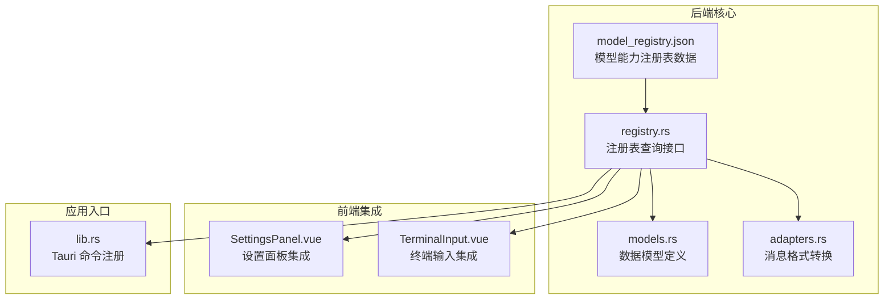
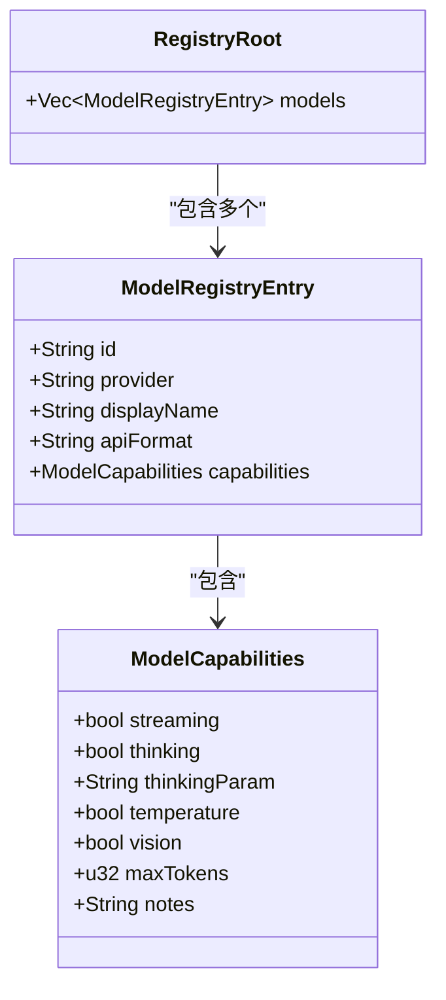
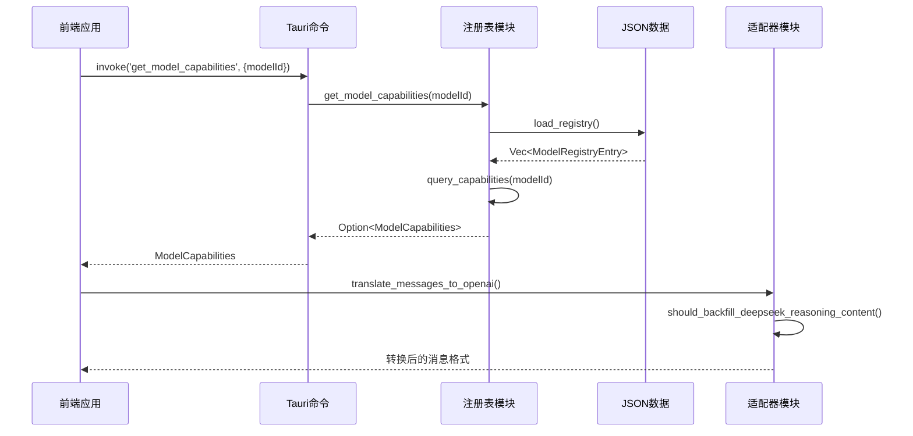
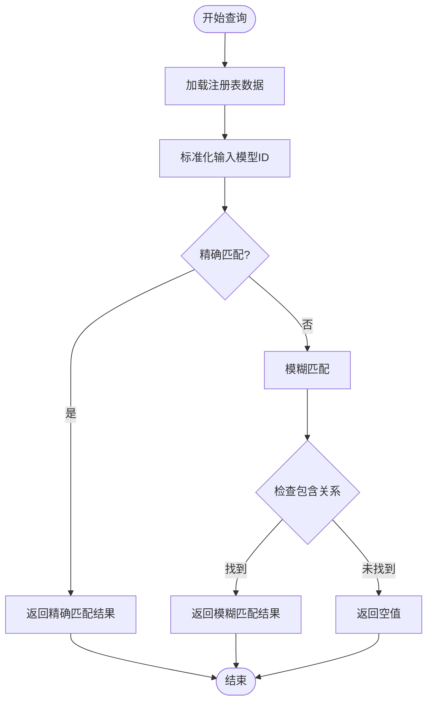
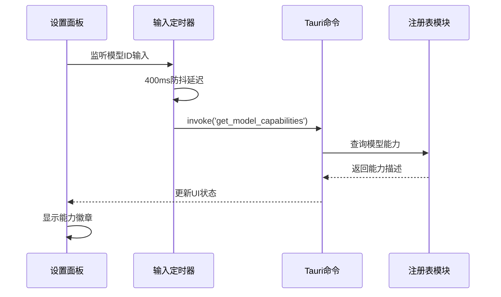
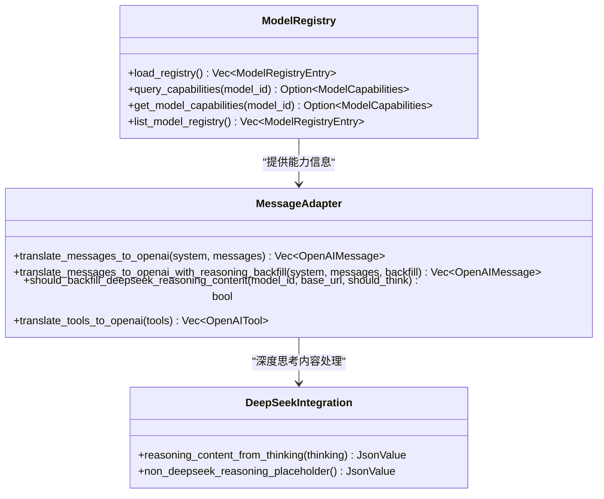
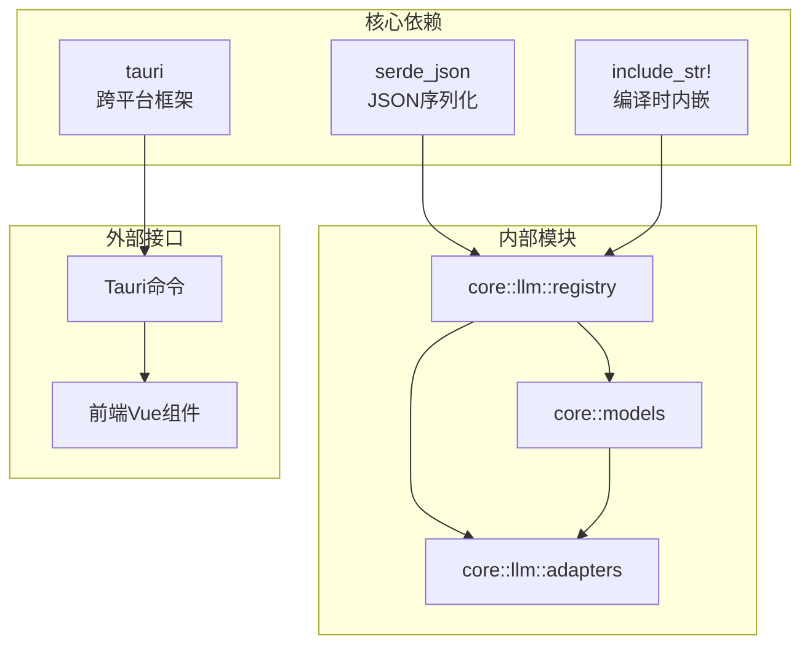

# 模型能力注册表

<cite>
**本文档引用的文件**
- [model_registry.json](file://src-tauri/model_registry.json)
- [models.rs](file://src-tauri/src/core/models.rs)
- [registry.rs](file://src-tauri/src/core/llm/registry.rs)
- [adapters.rs](file://src-tauri/src/core/llm/adapters.rs)
- [lib.rs](file://src-tauri/src/lib.rs)
- [SettingsPanel.vue](file://src/components/settings/SettingsPanel.vue)
- [TerminalInput.vue](file://src/components/chat/TerminalInput.vue)
- [README.md](file://README.md)
</cite>

## 目录
1. [简介](#简介)
2. [项目结构](#项目结构)
3. [核心组件](#核心组件)
4. [架构概览](#架构概览)
5. [详细组件分析](#详细组件分析)
6. [依赖关系分析](#依赖关系分析)
7. [性能考虑](#性能考虑)
8. [故障排除指南](#故障排除指南)
9. [结论](#结论)

## 简介

模型能力注册表是 JarvisAgent 项目中的一个关键组件，用于管理和查询各种 AI 模型的能力特征。该注册表提供了统一的模型能力描述格式，支持流式输出、深度思考模式、温度参数控制、视觉多模态等多种能力的标准化表示。

该项目基于 Tauri 2.0 + Vue 3 + Rust 构建，支持 20+ 主流 LLM 模型，包括 DeepSeek、Claude、GPT、Gemini、Qwen、豆包、MIMO 等多家供应商的模型。

## 项目结构

模型能力注册表主要分布在以下文件中：

**图表来源**
- [model_registry.json:1-496](file://src-tauri/model_registry.json#L1-L496)
- [registry.rs:1-103](file://src-tauri/src/core/llm/registry.rs#L1-L103)
- [lib.rs:220-222](file://src-tauri/src/lib.rs#L220-L222)

**章节来源**
- [README.md:94-95](file://README.md#L94-L95)

## 核心组件

### 模型能力数据结构

模型能力注册表采用标准化的数据结构来描述每个模型的能力特征：

**图表来源**
- [registry.rs:8-45](file://src-tauri/src/core/llm/registry.rs#L8-L45)

### 数据模型映射

后端使用 Rust 结构体来强类型化这些数据：

- `ModelCapabilities`: 描述单个模型的能力特征
- `ModelRegistryEntry`: 注册表中的单条模型记录
- `RegistryRoot`: 注册表根结构

**章节来源**
- [models.rs:1-284](file://src-tauri/src/core/models.rs#L1-L284)
- [registry.rs:7-51](file://src-tauri/src/core/llm/registry.rs#L7-L51)

## 架构概览

模型能力注册表的架构设计体现了以下关键原则：

**图表来源**
- [lib.rs:220-222](file://src-tauri/src/lib.rs#L220-L222)
- [registry.rs:91-96](file://src-tauri/src/core/llm/registry.rs#L91-L96)
- [adapters.rs:241-253](file://src-tauri/src/core/llm/adapters.rs#L241-L253)

## 详细组件分析

### 注册表数据结构

注册表采用 JSON 格式存储，包含以下关键字段：

| 字段名 | 类型 | 描述 | 示例值 |
|--------|------|------|--------|
| id | String | 模型唯一标识符 | "claude-3-5-sonnet-20241022" |
| provider | String | 供应商名称 | "Anthropic" |
| displayName | String | 用户友好显示名称 | "Claude 3.5 Sonnet" |
| apiFormat | String | 推荐的 API 格式 | "anthropic" |
| capabilities.streaming | Boolean | 是否支持流式输出 | true |
| capabilities.thinking | Boolean | 是否支持深度思考模式 | true |
| capabilities.thinkingParam | String | 控制思考的参数名 | "thinking" |
| capabilities.temperature | Boolean | 是否支持温度参数 | false |
| capabilities.vision | Boolean | 是否支持视觉/多模态 | true |
| capabilities.maxTokens | Integer | 最大输出 token 数 | 8096 |
| capabilities.notes | String | 备注说明 | "经典高性能模型，不支持思考模式" |

**章节来源**
- [model_registry.json:1-496](file://src-tauri/model_registry.json#L1-L496)

### 注册表查询机制

注册表实现了智能的查询机制，支持多种匹配策略：

**图表来源**
- [registry.rs:74-89](file://src-tauri/src/core/llm/registry.rs#L74-L89)

### 前端集成实现

前端通过 Tauri 命令与后端进行交互：

**图表来源**
- [SettingsPanel.vue:391-407](file://src/components/settings/SettingsPanel.vue#L391-L407)

**章节来源**
- [SettingsPanel.vue:139-173](file://src/components/settings/SettingsPanel.vue#L139-L173)
- [TerminalInput.vue:74-93](file://src/components/chat/TerminalInput.vue#L74-L93)

### 模型适配器集成

注册表与消息格式转换适配器紧密集成：

**图表来源**
- [registry.rs:57-102](file://src-tauri/src/core/llm/registry.rs#L57-L102)
- [adapters.rs:241-253](file://src-tauri/src/core/llm/adapters.rs#L241-L253)

**章节来源**
- [adapters.rs:84-94](file://src-tauri/src/core/llm/adapters.rs#L84-L94)

## 依赖关系分析

模型能力注册表在整个系统中的依赖关系如下：

**图表来源**
- [registry.rs:5-54](file://src-tauri/src/core/llm/registry.rs#L5-L54)
- [lib.rs:220-222](file://src-tauri/src/lib.rs#L220-L222)

**章节来源**
- [lib.rs:220-222](file://src-tauri/src/lib.rs#L220-L222)

## 性能考虑

### 编译时内嵌优化

注册表采用了编译时内嵌策略，具有以下优势：

- **零运行时依赖**：JSON 数据直接编译到二进制文件中
- **启动性能**：无需文件系统访问，启动速度更快
- **部署简化**：单个二进制文件即可运行
- **可靠性**：避免运行时文件损坏问题

### 查询性能优化

- **内存缓存**：注册表数据在内存中缓存，避免重复解析
- **字符串比较优化**：使用小写化比较减少大小写问题
- **模糊匹配算法**：高效的包含关系检查
- **防抖机制**：前端输入防抖，减少不必要的查询

## 故障排除指南

### 常见问题及解决方案

| 问题类型 | 症状 | 可能原因 | 解决方案 |
|----------|------|----------|----------|
| JSON解析错误 | 应用启动时报错 | model_registry.json格式错误 | 检查JSON语法，使用在线验证工具 |
| 模型ID匹配失败 | 能力查询返回空值 | 模型ID拼写错误或不存在 | 检查模型ID，参考支持的模型列表 |
| 前端显示异常 | 能力徽章不显示 | Tauri命令调用失败 | 检查Tauri命令注册，确认网络连接 |
| 性能问题 | 查询响应缓慢 | 注册表过大或频繁查询 | 实施缓存策略，优化查询频率 |

### 调试方法

1. **检查注册表加载**：确认 `load_registry()` 函数正常执行
2. **验证JSON格式**：使用 `serde_json::from_str` 验证数据完整性
3. **测试查询逻辑**：使用简单模型ID测试匹配算法
4. **监控内存使用**：检查注册表数据的内存占用情况

**章节来源**
- [registry.rs:60-65](file://src-tauri/src/core/llm/registry.rs#L60-L65)

## 结论

模型能力注册表是 JarvisAgent 项目中的关键基础设施组件，它提供了：

1. **标准化的模型能力描述**：统一了不同供应商模型的能力表示
2. **智能的查询机制**：支持精确和模糊匹配，提升用户体验
3. **编译时优化**：确保部署的可靠性和性能
4. **前后端无缝集成**：为前端提供了直观的能力展示接口

该注册表的设计充分考虑了实际应用场景的需求，为 JarvisAgent 的多模型支持和智能路由提供了坚实的基础。通过持续维护和扩展，该系统能够适应不断发展的 AI 模型生态系统。