# 笔记本工具

<cite>
**本文档引用的文件**
- [README.md](file://README.md)
- [App.vue](file://src/App.vue)
- [main.ts](file://src/main.ts)
- [ChatArea.vue](file://src/components/chat/ChatArea.vue)
- [TerminalInput.vue](file://src/components/chat/TerminalInput.vue)
- [chat.ts](file://src/stores/chat.ts)
- [snapshotService.ts](file://src/services/snapshotService.ts)
- [notebook_tools.rs](file://src-tauri/src/core/tools/notebook_tools.rs)
- [notebook_guard.rs](file://src-tauri/src/core/tools/file_tools/notebook_guard.rs)
- [index.ts](file://src/types/index.ts)
- [agentTurnRender.ts](file://src/utils/agentTurnRender.ts)
- [agentTurnState.ts](file://src/utils/agentTurnState.ts)
- [main.rs](file://src-tauri/src/main.rs)
- [package.json](file://package.json)
</cite>

## 目录
1. [简介](#简介)
2. [项目结构](#项目结构)
3. [核心组件](#核心组件)
4. [架构概览](#架构概览)
5. [详细组件分析](#详细组件分析)
6. [依赖关系分析](#依赖关系分析)
7. [性能考虑](#性能考虑)
8. [故障排除指南](#故障排除指南)
9. [结论](#结论)

## 简介

JarvisAgent 是一个基于 Tauri 2.0 + Vue 3 + Rust 构建的 AI 驱动桌面端编程助手。该项目专注于提供强大的笔记本工具功能，特别是针对 Jupyter Notebook (.ipynb) 文件的专用编辑能力。

### 主要特性

- **多模型支持**：支持 20+ 主流 LLM 模型，包括 DeepSeek、Claude、GPT、Gemini、Qwen 等
- **深度思考模式**：Extended Thinking / Reasoning，展示 AI 推理过程
- **完整 Agent 循环**：意图分类 → 工具加载 → 上下文注入 → 自主决策执行 → SSE 流式输出
- **统一 Provider 抽象**：`LlmProvider` trait 抹平 OpenAI / Anthropic API 差异
- **快照引擎**：文件级树形版本控制，原子化回滚，分支管理
- **笔记本专用工具**：cell 级别的 Jupyter Notebook 编辑，避免直接文本修改破坏结构

### 技术栈

- **前端框架**：Vue 3 + TypeScript + Composition API
- **状态管理**：Pinia（4 个 Store：session / chat / agent / permission）
- **桌面框架**：Tauri 2.0（Rust 后端，轻量高性能）
- **后端运行时**：Rust + Tokio（异步运行时，SSE 流式处理）
- **HTTP 客户端**：Reqwest（流式 API 调用，OpenAI / Anthropic 双格式）
- **Markdown**：marked（GFM + 增量渲染）

## 项目结构

项目采用前后端分离的架构设计，前端使用 Vue 3 + TypeScript，后端使用 Rust + Tauri：

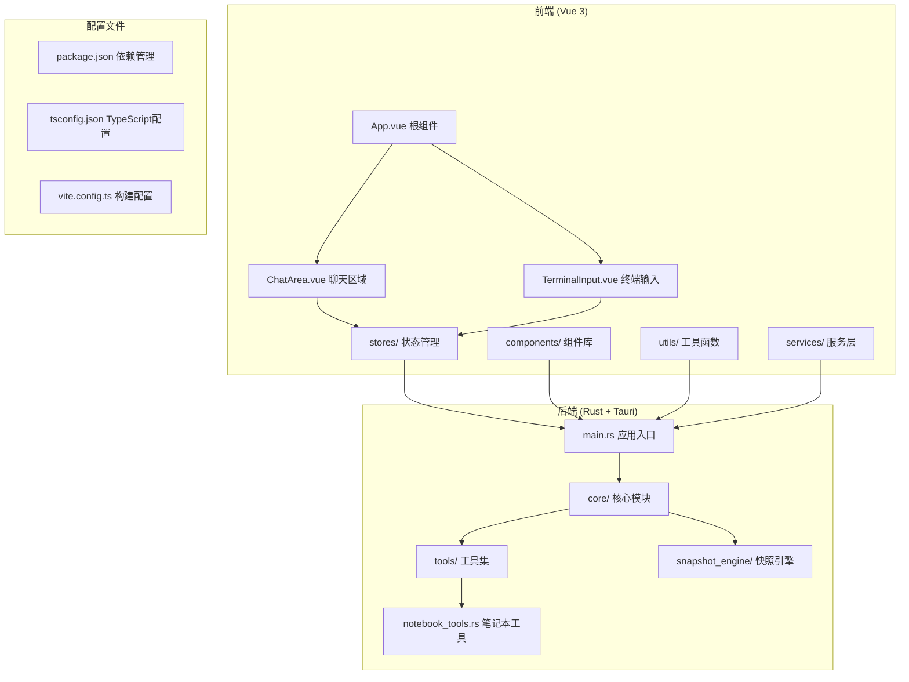

**图表来源**
- [App.vue:1-357](file://src/App.vue#L1-L357)
- [main.rs:1-23](file://src-tauri/src/main.rs#L1-L23)
- [package.json:1-29](file://package.json#L1-L29)

**章节来源**
- [README.md:96-170](file://README.md#L96-L170)
- [package.json:1-29](file://package.json#L1-L29)

## 核心组件

### 笔记本工具系统

笔记本工具系统是本项目的核心特色，专门针对 Jupyter Notebook 文件提供安全的编辑能力：

#### NotebookEdit 工具

`notebook_edit` 工具提供了 cell 级别的编辑能力，避免直接修改 .ipynb JSON 结构：

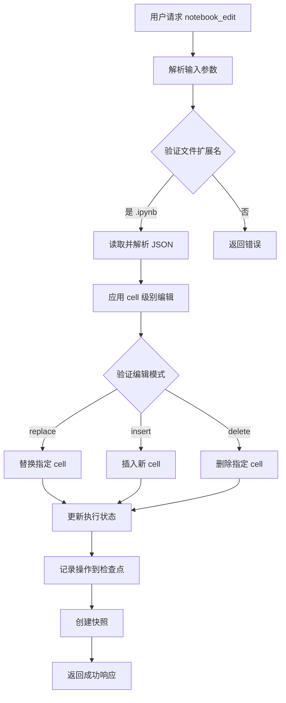

**图表来源**
- [notebook_tools.rs:309-435](file://src-tauri/src/core/tools/notebook_tools.rs#L309-L435)

#### NotebookGuard 保护机制

防止普通文本工具直接修改笔记本文件：

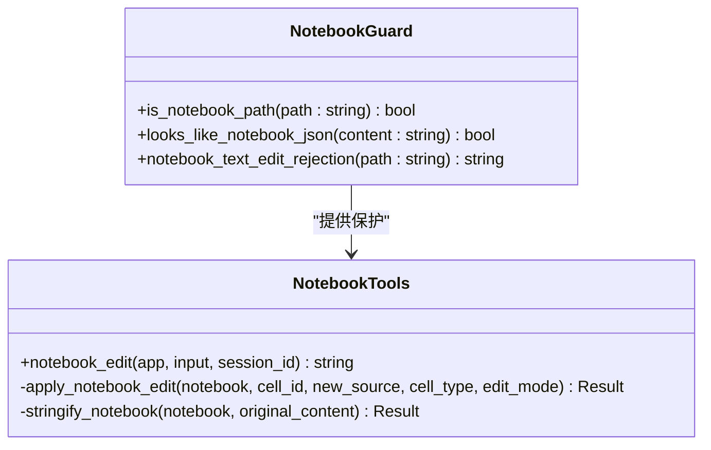

**图表来源**
- [notebook_guard.rs:15-43](file://src-tauri/src/core/tools/file_tools/notebook_guard.rs#L15-L43)
- [notebook_tools.rs:309-435](file://src-tauri/src/core/tools/notebook_tools.rs#L309-L435)

**章节来源**
- [notebook_tools.rs:1-553](file://src-tauri/src/core/tools/notebook_tools.rs#L1-L553)
- [notebook_guard.rs:1-65](file://src-tauri/src/core/tools/file_tools/notebook_guard.rs#L1-L65)

### 聊天交互系统

聊天系统提供了完整的用户交互体验，包括消息发送、流式渲染和撤回功能：

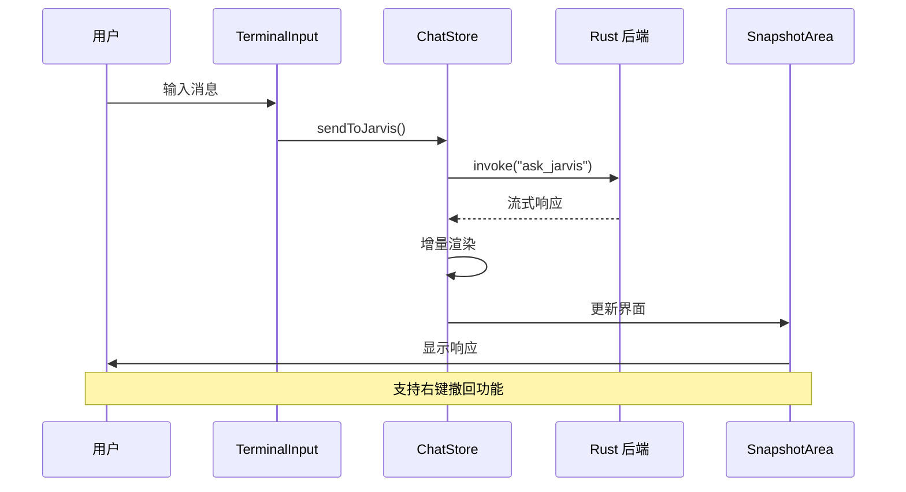

**图表来源**
- [TerminalInput.vue:259-276](file://src/components/chat/TerminalInput.vue#L259-L276)
- [chat.ts:410-613](file://src/stores/chat.ts#L410-L613)

**章节来源**
- [ChatArea.vue:1-800](file://src/components/chat/ChatArea.vue#L1-L800)
- [TerminalInput.vue:1-950](file://src/components/chat/TerminalInput.vue#L1-L950)
- [chat.ts:1-732](file://src/stores/chat.ts#L1-L732)

## 架构概览

### 整体架构设计

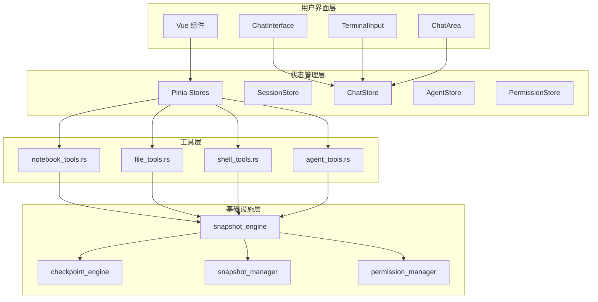

**图表来源**
- [App.vue:1-357](file://src/App.vue#L1-L357)
- [main.ts:1-9](file://src/main.ts#L1-L9)
- [notebook_tools.rs:438-482](file://src-tauri/src/core/tools/notebook_tools.rs#L438-L482)

### 笔记本编辑流程

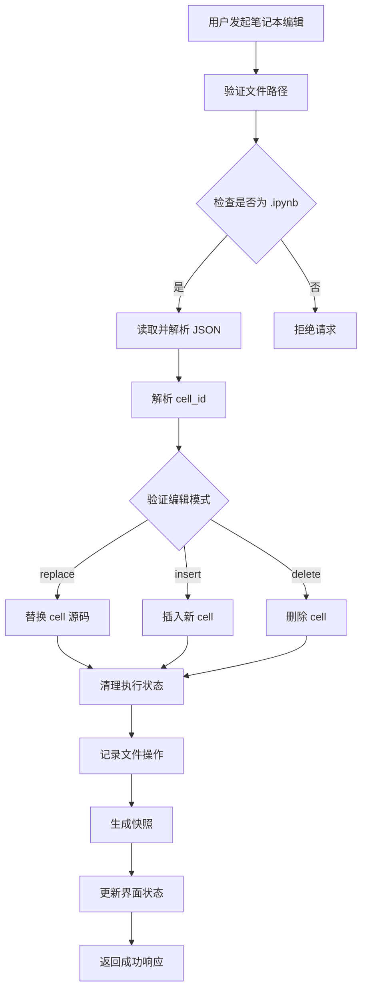

**图表来源**
- [notebook_tools.rs:190-291](file://src-tauri/src/core/tools/notebook_tools.rs#L190-L291)

**章节来源**
- [README.md:172-234](file://README.md#L172-L234)

## 详细组件分析

### 笔记本工具实现

#### 核心数据结构

笔记本工具使用以下核心数据结构来管理笔记本文件：

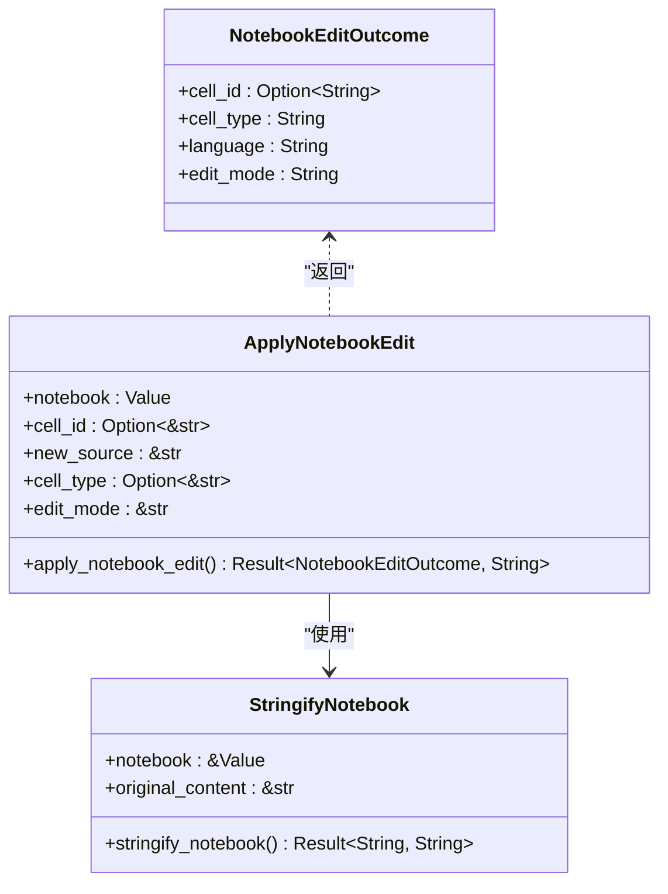

**图表来源**
- [notebook_tools.rs:20-26](file://src-tauri/src/core/tools/notebook_tools.rs#L20-L26)
- [notebook_tools.rs:190-291](file://src-tauri/src/core/tools/notebook_tools.rs#L190-L291)
- [notebook_tools.rs:293-306](file://src-tauri/src/core/tools/notebook_tools.rs#L293-L306)

#### 文件操作保护机制

笔记本工具实现了多层次的文件操作保护：

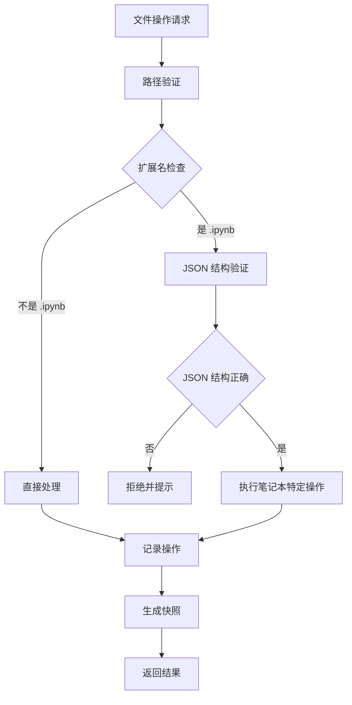

**图表来源**
- [notebook_guard.rs:15-43](file://src-tauri/src/core/tools/file_tools/notebook_guard.rs#L15-L43)

**章节来源**
- [notebook_tools.rs:309-435](file://src-tauri/src/core/tools/notebook_tools.rs#L309-L435)
- [notebook_guard.rs:1-65](file://src-tauri/src/core/tools/file_tools/notebook_guard.rs#L1-L65)

### 聊天交互组件

#### 增量渲染系统

聊天系统实现了高效的增量渲染机制，避免每次全量重新渲染：

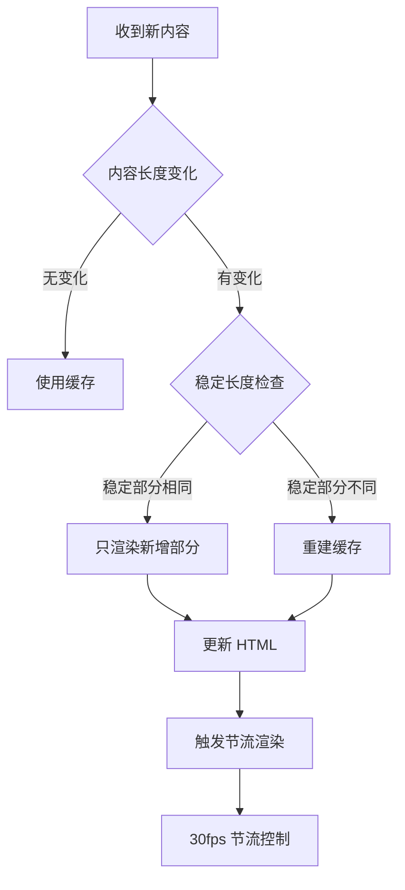

**图表来源**
- [chat.ts:234-293](file://src/stores/chat.ts#L234-L293)

#### 撤回功能实现

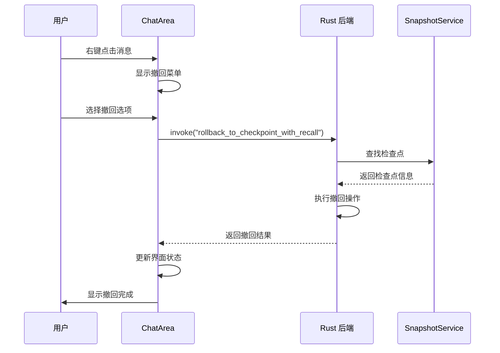

**图表来源**
- [ChatArea.vue:399-468](file://src/components/chat/ChatArea.vue#L399-L468)

**章节来源**
- [ChatArea.vue:1-800](file://src/components/chat/ChatArea.vue#L1-L800)
- [chat.ts:615-665](file://src/stores/chat.ts#L615-L665)

### 快照管理系统

#### 三级缓存架构

快照服务实现了高效的三级缓存机制：

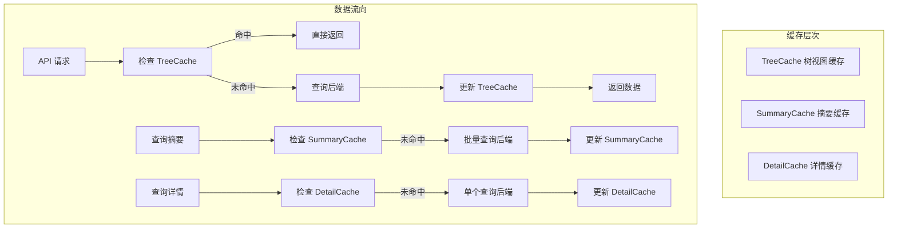

**图表来源**
- [snapshotService.ts:14-60](file://src/services/snapshotService.ts#L14-L60)

**章节来源**
- [snapshotService.ts:1-248](file://src/services/snapshotService.ts#L1-L248)

## 依赖关系分析

### 前端依赖关系

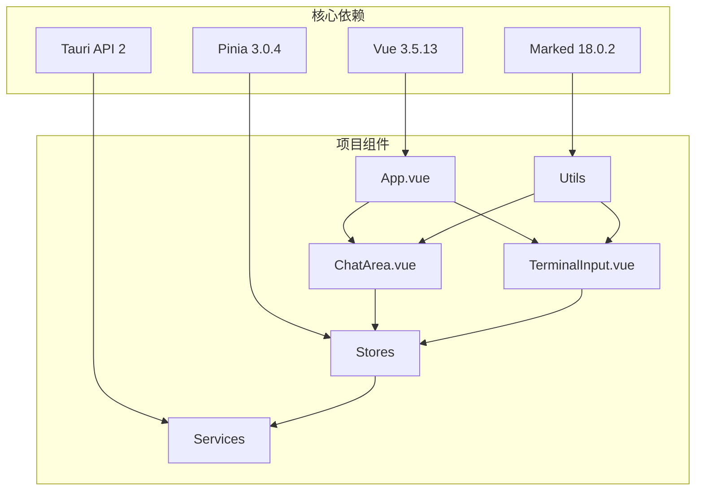

**图表来源**
- [package.json:12-20](file://package.json#L12-L20)
- [main.ts:1-9](file://src/main.ts#L1-L9)

### 后端依赖关系

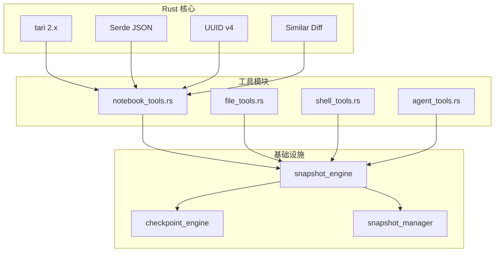

**图表来源**
- [notebook_tools.rs:6-10](file://src-tauri/src/core/tools/notebook_tools.rs#L6-L10)
- [main.rs:1-23](file://src-tauri/src/main.rs#L1-L23)

**章节来源**
- [package.json:12-28](file://package.json#L12-L28)
- [notebook_tools.rs:1-553](file://src-tauri/src/core/tools/notebook_tools.rs#L1-L553)

## 性能考虑

### 增量渲染优化

聊天系统的增量渲染机制显著降低了 CPU 占用：

- **30fps 节流控制**：避免频繁的全量渲染
- **稳定内容缓存**：只渲染新增的文本内容
- **尾部实时重渲染**：优先更新最新内容，提升用户体验

### 笔记本编辑性能

笔记本工具的性能优化包括：

- **JSON 结构验证**：在修改前进行结构完整性检查
- **增量操作**：只修改受影响的 cell，而非整个文件
- **执行状态清理**：自动清理代码 cell 的执行输出

### 内存管理

- **三级缓存**：合理使用内存，避免重复加载
- **异步操作**：非阻塞的文件操作和网络请求
- **资源清理**：及时释放临时资源和缓存

## 故障排除指南

### 常见问题及解决方案

#### 笔记本文件编辑失败

**问题症状**：
- 编辑操作返回错误
- 文件内容未发生变化
- 出现 JSON 解析错误

**排查步骤**：
1. 验证文件扩展名是否为 .ipynb
2. 检查 JSON 结构是否完整
3. 确认 cell_id 是否存在
4. 验证编辑模式参数

**解决方案**：
- 使用 `notebook_edit` 工具替代普通文件编辑
- 确保 cell_id 格式正确（支持数字索引、cell-N 形式）
- 检查文件权限和路径有效性

#### 聊天界面渲染异常

**问题症状**：
- 消息显示不完整
- 界面卡顿
- 增量渲染失效

**排查步骤**：
1. 检查浏览器控制台是否有错误
2. 验证 Markdown 渲染函数
3. 确认节流机制正常工作

**解决方案**：
- 清除浏览器缓存
- 检查网络连接稳定性
- 重启应用以重置状态

#### 快照功能异常

**问题症状**：
- 快照创建失败
- 撤回功能不可用
- 分支切换异常

**排查步骤**：
1. 检查磁盘空间是否充足
2. 验证文件系统权限
3. 确认会话状态正常

**解决方案**：
- 清理不必要的快照
- 检查文件锁定状态
- 重新初始化会话

**章节来源**
- [notebook_tools.rs:320-373](file://src-tauri/src/core/tools/notebook_tools.rs#L320-L373)
- [ChatArea.vue:380-397](file://src/components/chat/ChatArea.vue#L380-L397)
- [chat.ts:592-612](file://src/stores/chat.ts#L592-L612)

## 结论

JarvisAgent 的笔记本工具系统代表了 AI 编程助手领域的一个重要创新。通过专门针对 Jupyter Notebook 文件设计的 cell 级别编辑工具，该项目解决了传统文本编辑器在处理结构化笔记本文件时面临的核心问题。

### 主要优势

1. **安全性**：通过 `notebook_guard` 机制防止直接修改破坏笔记本结构
2. **精确性**：cell 级别的编辑操作确保只修改目标内容
3. **完整性**：自动处理执行状态清理，保持笔记本的一致性
4. **可追溯性**：完整的操作记录和快照功能

### 技术亮点

- **统一抽象**：通过 `LlmProvider` trait 实现多模型支持
- **增量渲染**：30fps 节流控制，显著降低 CPU 占用
- **快照引擎**：文件级树形版本控制，支持原子化回滚
- **多 Agent 沙箱**：并行工作和分支管理能力

### 发展前景

该项目为 AI 驱动的编程工具奠定了坚实基础，未来可以在以下方面进一步发展：

- 扩展对更多笔记本格式的支持
- 增强协作编辑功能
- 优化大型笔记本文件的处理性能
- 集成更多 AI 辅助编程功能

通过持续的技术创新和社区贡献，JarvisAgent 有望成为开发者工具领域的标杆产品。