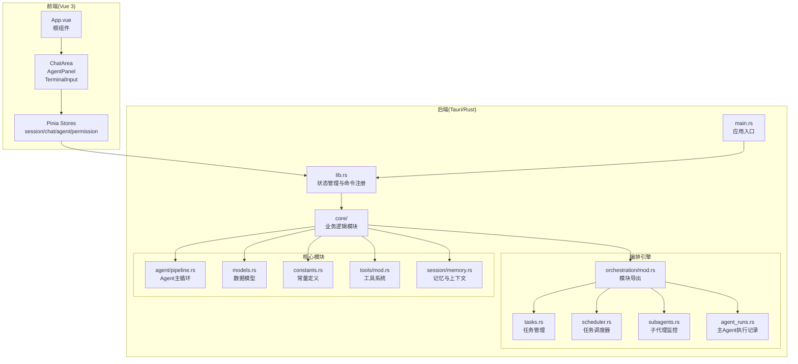
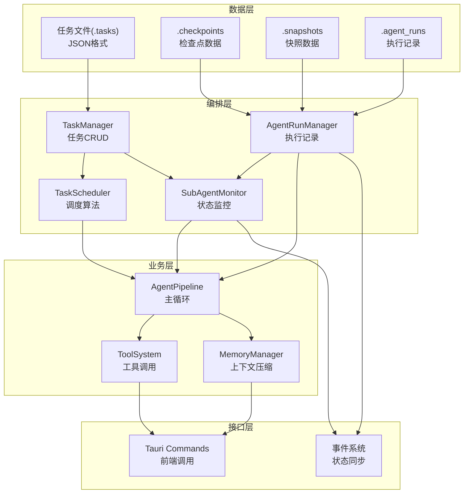
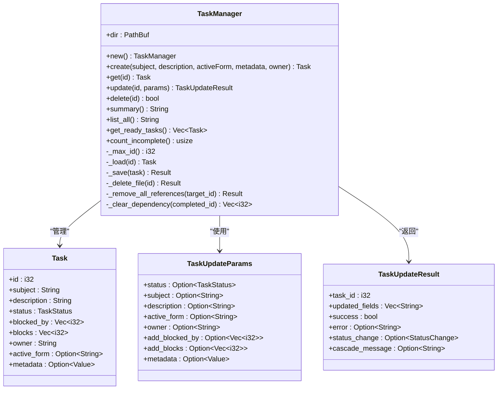
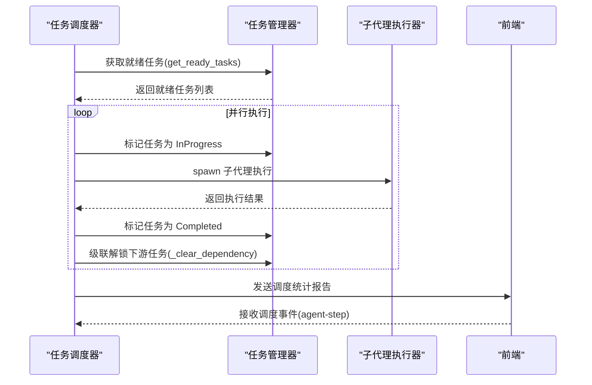
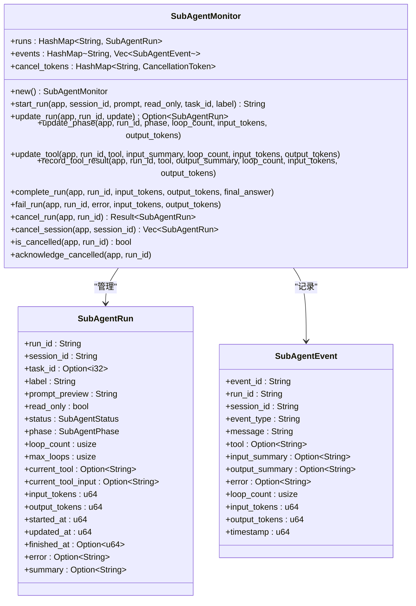
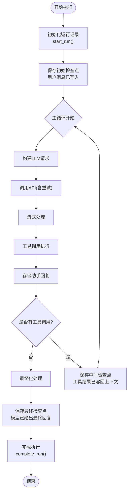
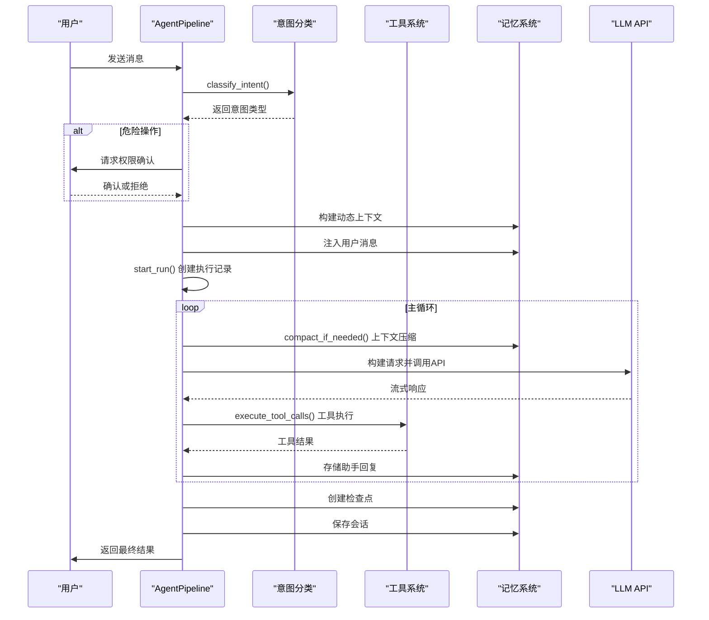
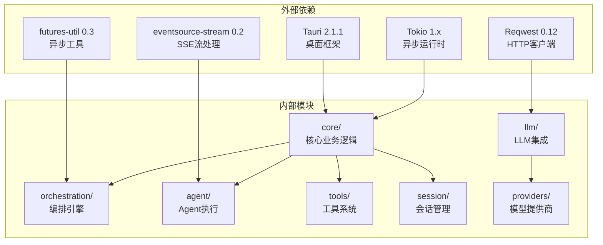
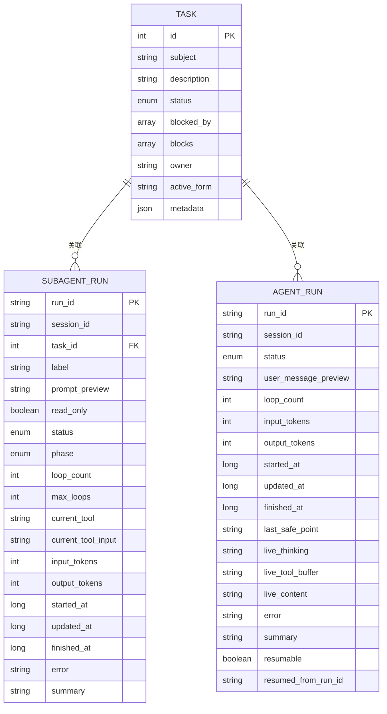

# 编排引擎

<cite>
**本文档引用的文件**
- [README.md](file://README.md)
- [Cargo.toml](file://src-tauri/Cargo.toml)
- [package.json](file://package.json)
- [main.rs](file://src-tauri/src/main.rs)
- [lib.rs](file://src-tauri/src/lib.rs)
- [mod.rs](file://src-tauri/src/core/orchestration/mod.rs)
- [tasks.rs](file://src-tauri/src/core/orchestration/tasks.rs)
- [scheduler.rs](file://src-tauri/src/core/orchestration/scheduler.rs)
- [subagents.rs](file://src-tauri/src/core/orchestration/subagents.rs)
- [agent_runs.rs](file://src-tauri/src/core/orchestration/agent_runs.rs)
- [pipeline.rs](file://src-tauri/src/core/agent/pipeline.rs)
- [models.rs](file://src-tauri/src/core/models.rs)
- [constants.rs](file://src-tauri/src/core/constants.rs)
- [mod.rs](file://src-tauri/src/core/tools/mod.rs)
- [memory.rs](file://src-tauri/src/core/session/memory.rs)
</cite>

## 目录
1. [简介](#简介)
2. [项目结构](#项目结构)
3. [核心组件](#核心组件)
4. [架构总览](#架构总览)
5. [详细组件分析](#详细组件分析)
6. [依赖关系分析](#依赖关系分析)
7. [性能考量](#性能考量)
8. [故障排查指南](#故障排查指南)
9. [结论](#结论)
10. [附录](#附录)

## 简介
本项目是一个基于 Tauri 2.0 + Vue 3 + Rust 的桌面端 AI 编排引擎，提供完整的 Agent 自主循环，支持 20+ 主流 LLM 模型，具备快照版本控制、多 Agent 沙箱、方案审批等企业级能力。编排引擎负责多任务并行调度、子 Agent 生命周期管理、主 Agent 执行记录与检查点管理，形成从意图识别到工具执行再到结果产出的完整流水线。

## 项目结构
项目采用前后端分离架构，Rust 后端通过 Tauri 暴露命令给前端 Vue 应用调用。核心编排逻辑集中在 Rust 后端的 orchestration 模块，包含任务管理、调度器、子代理监控和主 Agent 执行记录四大子系统。

**图表来源**
- [main.rs:1-23](file://src-tauri/src/main.rs#L1-L23)
- [lib.rs:1-227](file://src-tauri/src/lib.rs#L1-L227)
- [mod.rs:1-14](file://src-tauri/src/core/orchestration/mod.rs#L1-L14)

**章节来源**
- [README.md:96-170](file://README.md#L96-L170)
- [main.rs:1-23](file://src-tauri/src/main.rs#L1-L23)
- [lib.rs:1-227](file://src-tauri/src/lib.rs#L1-L227)

## 核心组件
编排引擎由四个核心子系统组成，每个子系统都有明确的职责边界和清晰的接口契约：

### 任务管理系统
负责任务的全生命周期管理，包括创建、更新、删除、依赖关系维护和级联解锁机制。采用文件系统持久化存储，确保任务状态的可靠性。

### 任务调度器
基于依赖图的智能调度器，支持并行执行多个就绪任务，自动处理循环依赖检测和级联解锁，提供完整的调度统计和报告。

### 子代理监控系统
管理子 Agent 的运行状态、事件记录和取消控制，通过 Tauri 事件系统向前端推送实时状态更新，支持心跳检测和批量取消。

### 主 Agent 执行记录
记录主 Agent 每次执行的完整生命周期，支持检查点保存与恢复，用于断点续传和崩溃恢复，事件以 JSONL 格式存储。

**章节来源**
- [tasks.rs:1-449](file://src-tauri/src/core/orchestration/tasks.rs#L1-L449)
- [scheduler.rs:1-184](file://src-tauri/src/core/orchestration/scheduler.rs#L1-L184)
- [subagents.rs:1-679](file://src-tauri/src/core/orchestration/subagents.rs#L1-L679)
- [agent_runs.rs:1-568](file://src-tauri/src/core/orchestration/agent_runs.rs#L1-L568)

## 架构总览
编排引擎采用分层架构设计，从底层的数据存储到上层的业务逻辑，形成了清晰的职责分离和依赖关系。

**图表来源**
- [tasks.rs:12-41](file://src-tauri/src/core/orchestration/tasks.rs#L12-L41)
- [scheduler.rs:15-33](file://src-tauri/src/core/orchestration/scheduler.rs#L15-L33)
- [subagents.rs:81-85](file://src-tauri/src/core/orchestration/subagents.rs#L81-L85)
- [agent_runs.rs:35-54](file://src-tauri/src/core/orchestration/agent_runs.rs#L35-L54)

## 详细组件分析

### 任务管理系统分析
任务管理系统实现了完整的 CRUD 操作和依赖关系管理，支持复杂的任务间依赖和级联解锁机制。

**图表来源**
- [tasks.rs:13-104](file://src-tauri/src/core/orchestration/tasks.rs#L13-L104)
- [tasks.rs:268-288](file://src-tauri/src/core/orchestration/tasks.rs#L268-L288)

任务管理的关键特性包括：
- **依赖关系管理**：支持双向依赖跟踪（blocked_by 和 blocks）
- **级联解锁**：任务完成后自动解锁下游任务
- **元数据合并**：支持增量更新和 JSON 合并
- **状态转换**：完整的状态机管理（Pending → InProgress → Completed）

**章节来源**
- [tasks.rs:1-449](file://src-tauri/src/core/orchestration/tasks.rs#L1-L449)

### 任务调度器分析
任务调度器实现了基于依赖图的智能调度算法，支持并行执行和循环依赖检测。

**图表来源**
- [scheduler.rs:28-182](file://src-tauri/src/core/orchestration/scheduler.rs#L28-L182)

调度器的核心算法：
1. **就绪任务发现**：查找所有 Pending 且 blocked_by 为空的任务
2. **批量标记**：将就绪任务统一标记为 InProgress
3. **并行执行**：使用 tokio::spawn 并行执行所有就绪任务
4. **结果处理**：收集所有子代理执行结果，更新任务状态
5. **级联解锁**：自动解锁因当前任务完成而解除阻塞的下游任务

**章节来源**
- [scheduler.rs:1-184](file://src-tauri/src/core/orchestration/scheduler.rs#L1-L184)

### 子代理监控系统分析
子代理监控系统提供了完整的子 Agent 生命周期管理，包括状态跟踪、事件记录和取消控制。

**图表来源**
- [subagents.rs:81-94](file://src-tauri/src/core/orchestration/subagents.rs#L81-L94)
- [subagents.rs:39-79](file://src-tauri/src/core/orchestration/subagents.rs#L39-L79)

监控系统的关键特性：
- **状态跟踪**：实时跟踪子代理的运行状态和执行阶段
- **事件记录**：完整的事件历史记录，支持最多 300 条事件
- **取消机制**：支持单个子代理取消和会话级批量取消
- **心跳检测**：每 5 秒发送一次心跳，确保前端状态同步

**章节来源**
- [subagents.rs:1-679](file://src-tauri/src/core/orchestration/subagents.rs#L1-L679)

### 主 Agent 执行记录分析
主 Agent 执行记录系统提供了完整的执行生命周期管理，支持检查点保存和断点续传。

**图表来源**
- [agent_runs.rs:98-143](file://src-tauri/src/core/orchestration/agent_runs.rs#L98-L143)
- [agent_runs.rs:317-363](file://src-tauri/src/core/orchestration/agent_runs.rs#L317-L363)

执行记录系统的核心功能：
- **检查点管理**：自动保存执行过程中的关键节点
- **断点续传**：支持从任意检查点恢复执行
- **事件追踪**：完整的执行事件记录和统计
- **状态持久化**：运行状态的可靠持久化存储

**章节来源**
- [agent_runs.rs:1-568](file://src-tauri/src/core/orchestration/agent_runs.rs#L1-L568)

### Agent 主循环分析
Agent 主循环实现了完整的 5 阶段执行流水线，包含意图验证、上下文构建、主循环执行和收尾处理。

**图表来源**
- [pipeline.rs:202-309](file://src-tauri/src/core/agent/pipeline.rs#L202-L309)
- [pipeline.rs:407-639](file://src-tauri/src/core/agent/pipeline.rs#L407-L639)

主循环的关键流程：
1. **意图验证**：检测危险操作并请求用户确认
2. **上下文构建**：动态构建和注入上下文信息
3. **主循环执行**：循环执行思考→工具调用→观察的完整 Agent Loop
4. **检查点创建**：在关键节点创建执行检查点
5. **会话保存**：自动保存会话状态和元数据

**章节来源**
- [pipeline.rs:1-800](file://src-tauri/src/core/agent/pipeline.rs#L1-L800)

## 依赖关系分析

**图表来源**
- [Cargo.toml:20-42](file://src-tauri/Cargo.toml#L20-L42)
- [lib.rs:22-36](file://src-tauri/src/lib.rs#L22-L36)

**章节来源**
- [Cargo.toml:1-42](file://src-tauri/Cargo.toml#L1-L42)
- [lib.rs:1-227](file://src-tauri/src/lib.rs#L1-L227)

## 性能考量
编排引擎在设计时充分考虑了性能优化和资源管理：

### 并行执行优化
- **批量并行**：调度器支持多个就绪任务的并行执行，充分利用系统资源
- **异步处理**：使用 Tokio 异步运行时，避免阻塞主线程
- **内存管理**：采用增量上下文压缩，避免内存泄漏

### 资源限制
- **循环次数限制**：MAX_AGENT_LOOP_BEFORE_CONFIRM 和 MAX_AGENT_LOOP_ABSOLUTE 限制防止无限循环
- **Token 估算**：粗略估算消息长度，避免超出模型上下文限制
- **检查点频率**：定期保存检查点，平衡性能和可靠性

### 缓存策略
- **三级缓存**：前端快照 API 采用三级缓存机制
- **事件限制**：子代理事件最多保留 300 条，避免内存膨胀
- **微压缩**：自动清理旧的工具调用结果，仅保留最近 3 条

## 故障排查指南

### 常见问题诊断
1. **任务调度失败**
   - 检查任务依赖关系是否形成循环
   - 确认任务状态转换是否正确
   - 查看调度器的日志输出

2. **子代理执行异常**
   - 检查取消令牌状态
   - 验证工具调用参数
   - 查看事件历史记录

3. **Agent 执行中断**
   - 检查循环次数限制
   - 验证检查点保存状态
   - 确认会话状态一致性

### 调试工具
- **调试日志**：详细的请求/响应日志记录
- **事件追踪**：完整的执行事件历史
- **状态监控**：实时状态更新和心跳检测

**章节来源**
- [subagents.rs:475-485](file://src-tauri/src/core/orchestration/subagents.rs#L475-L485)
- [constants.rs:35-43](file://src-tauri/src/core/constants.rs#L35-L43)

## 结论
编排引擎通过模块化的架构设计和完善的错误处理机制，为复杂的 AI Agent 系统提供了可靠的执行基础。四个核心子系统各司其职，既保持了高度的内聚性，又通过清晰的接口实现了松耦合的协作。系统支持的并行执行、检查点管理和断点续传等功能，使其能够胜任企业级的复杂应用场景。

## 附录

### 数据模型概览
编排引擎使用统一的数据模型定义，支持多种 LLM API 格式：

**图表来源**
- [models.rs:269-283](file://src-tauri/src/core/models.rs#L269-L283)
- [subagents.rs:41-61](file://src-tauri/src/core/orchestration/subagents.rs#L41-L61)
- [agent_runs.rs:35-54](file://src-tauri/src/core/orchestration/agent_runs.rs#L35-L54)

### 配置选项
系统支持丰富的配置选项，包括：
- **API 配置**：API Key、Base URL、API 格式
- **模型配置**：主模型、工具模型、思考模式
- **安全配置**：深度思考开关、循环检测阈值
- **存储配置**：数据目录、文件命名规范

**章节来源**
- [models.rs:1-284](file://src-tauri/src/core/models.rs#L1-L284)
- [constants.rs:1-43](file://src-tauri/src/core/constants.rs#L1-L43)