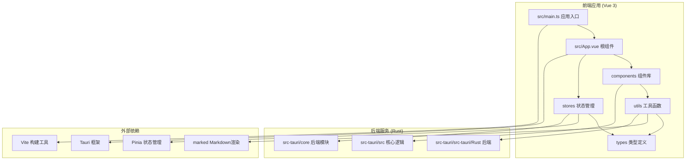
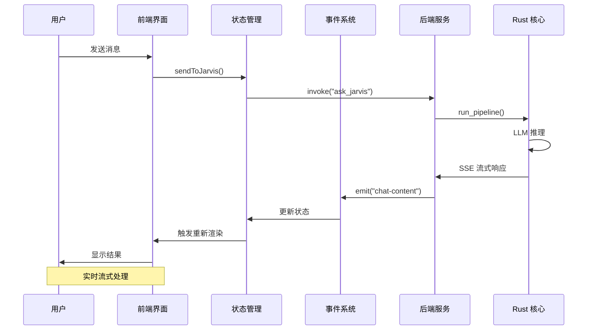
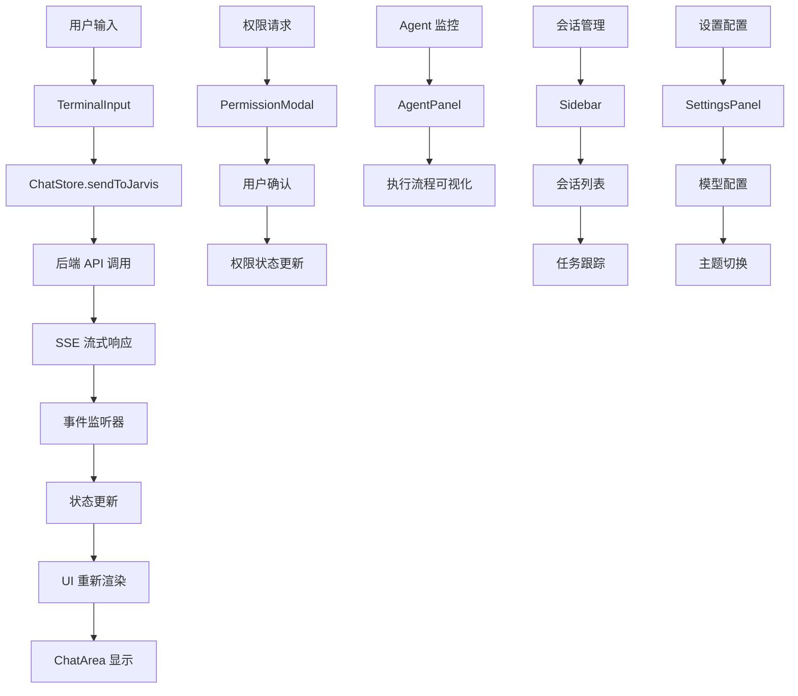
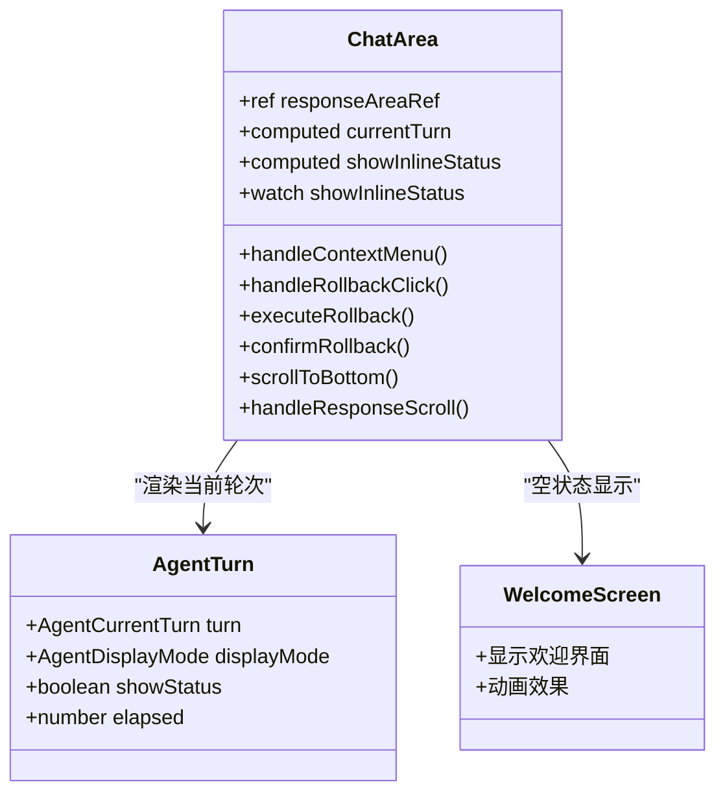
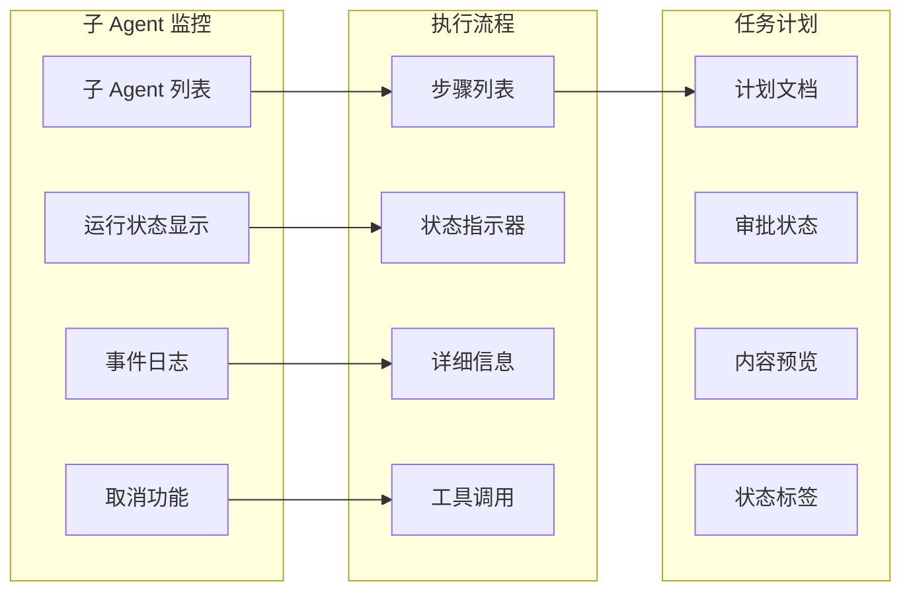
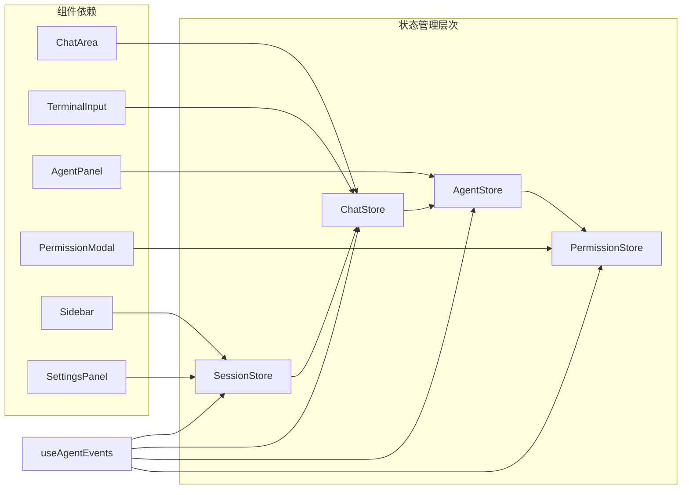

# 前端增强组件

<cite>
**本文档引用的文件**
- [README.md](file://README.md)
- [package.json](file://package.json)
- [vite.config.ts](file://vite.config.ts)
- [src/main.ts](file://src/main.ts)
- [src/App.vue](file://src/App.vue)
- [src/stores/chat.ts](file://src/stores/chat.ts)
- [src/stores/agent.ts](file://src/stores/agent.ts)
- [src/composables/useAgentEvents.ts](file://src/composables/useAgentEvents.ts)
- [src/components/chat/ChatArea.vue](file://src/components/chat/ChatArea.vue)
- [src/components/chat/TerminalInput.vue](file://src/components/chat/TerminalInput.vue)
- [src/components/chat/AgentPanel.vue](file://src/components/chat/AgentPanel.vue)
- [src/components/common/PermissionModal.vue](file://src/components/common/PermissionModal.vue)
- [src/components/settings/SettingsPanel.vue](file://src/components/settings/SettingsPanel.vue)
- [src/components/layout/Sidebar.vue](file://src/components/layout/Sidebar.vue)
- [src/utils/markdown.ts](file://src/utils/markdown.ts)
- [src/utils/agentTurnRender.ts](file://src/utils/agentTurnRender.ts)
- [src/types/index.ts](file://src/types/index.ts)
</cite>

## 更新摘要
**变更内容**
- 全面增强了聊天界面的交互性和视觉效果
- 优化了终端输入处理的多媒体支持和模型能力检测
- 完善了设置面板的配置管理和主题切换功能
- 改进了侧边栏导航的会话管理和任务跟踪
- 增强了权限管理系统的安全确认机制
- 优化了渲染系统的增量更新和性能表现

## 目录
1. [简介](#简介)
2. [项目结构](#项目结构)
3. [核心组件](#核心组件)
4. [架构概览](#架构概览)
5. [详细组件分析](#详细组件分析)
6. [依赖关系分析](#依赖关系分析)
7. [性能考虑](#性能考虑)
8. [故障排除指南](#故障排除指南)
9. [结论](#结论)

## 简介

JarvisAgent 是一个基于 Tauri 2.0 + Vue 3 + Rust 构建的 AI 驱动桌面编程助手。该项目提供了完整的 Agent 自主循环，支持 20+ 主流 LLM 模型，具备快照版本控制、多 Agent 沙箱、方案审批等企业级能力。

该前端增强组件主要负责用户界面交互、实时消息渲染、Agent 执行监控和权限管理等功能。系统采用现代化的 Glassmorphism 设计风格，提供流畅的用户体验和强大的功能特性。

**更新** 本次更新显著增强了聊天界面的多媒体支持、终端输入的模型能力检测、设置面板的配置管理、侧边栏导航的会话管理，以及权限管理系统的安全确认机制。

## 项目结构

项目采用模块化架构设计，主要分为以下几个核心部分：



**图表来源**
- [src/main.ts:1-9](file://src/main.ts#L1-L9)
- [src/App.vue:1-294](file://src/App.vue#L1-L294)

**章节来源**
- [README.md:96-170](file://README.md#L96-L170)
- [package.json:1-29](file://package.json#L1-L29)

## 核心组件

### 状态管理系统

系统采用 Pinia 进行状态管理，包含四个核心 Store：

1. **会话状态 (session)** - 管理会话生命周期和消息缓冲区
2. **聊天状态 (chat)** - 核心交互：发送/取消/撤回/增量渲染
3. **Agent 状态 (agent)** - Agent/子代理运行状态追踪
4. **权限状态 (permission)** - 权限请求 + 方案审批状态

每个 Store 都经过精心设计，确保状态的一致性和可预测性。

### 事件监听系统

`useAgentEvents` 组合式函数是整个前端事件架构的核心，负责：

- 监听来自后端的所有事件
- 将事件分发到相应的 Store
- 处理实时数据流和状态更新
- 管理 HMR（热模块替换）生命周期

**章节来源**
- [src/stores/chat.ts:66-724](file://src/stores/chat.ts#L66-L724)
- [src/stores/agent.ts:12-95](file://src/stores/agent.ts#L12-L95)
- [src/composables/useAgentEvents.ts:66-550](file://src/composables/useAgentEvents.ts#L66-L550)

## 架构概览

系统采用前后端分离架构，通过 Tauri 框架实现原生应用体验：



**图表来源**
- [src/stores/chat.ts:410-605](file://src/stores/chat.ts#L410-L605)
- [src/composables/useAgentEvents.ts:201-549](file://src/composables/useAgentEvents.ts#L201-L549)

### 数据流架构



**图表来源**
- [src/components/chat/TerminalInput.vue:253-270](file://src/components/chat/TerminalInput.vue#L253-L270)
- [src/components/common/PermissionModal.vue:74-120](file://src/components/common/PermissionModal.vue#L74-L120)
- [src/components/chat/AgentPanel.vue:337-497](file://src/components/chat/AgentPanel.vue#L337-L497)
- [src/components/layout/Sidebar.vue:132-178](file://src/components/layout/Sidebar.vue#L132-L178)
- [src/components/settings/SettingsPanel.vue:252-646](file://src/components/settings/SettingsPanel.vue#L252-L646)

## 详细组件分析

### 聊天界面组件

#### ChatArea 组件

ChatArea 是聊天界面的核心组件，负责：

- 实时显示聊天历史和当前对话
- 管理滚动行为和自动滚动
- 处理撤回操作和上下文菜单
- 显示工作目录状态



**图表来源**
- [src/components/chat/ChatArea.vue:1-800](file://src/components/chat/ChatArea.vue#L1-L800)

#### TerminalInput 组件

TerminalInput 提供了丰富的输入功能：

- 多媒体文件拖拽支持（图片、视频）
- 深度思考模式切换
- 模型配置管理
- 实时输入高度调整
- 快捷键支持

**更新** TerminalInput 组件新增了以下重要功能：
- 图片压缩配置支持（最大宽度、高度、质量）
- 模型能力检测（思考模式、视觉模式支持）
- 会话恢复功能（从最近安全点继续执行）
- 撤回编辑功能（取消生成后重新编辑）

**章节来源**
- [src/components/chat/ChatArea.vue:1-800](file://src/components/chat/ChatArea.vue#L1-L800)
- [src/components/chat/TerminalInput.vue:1-888](file://src/components/chat/TerminalInput.vue#L1-L888)

### Agent 监控面板

AgentPanel 提供了完整的 Agent 执行监控功能：



**图表来源**
- [src/components/chat/AgentPanel.vue:1-1094](file://src/components/chat/AgentPanel.vue#L1-L1094)

**章节来源**
- [src/components/chat/AgentPanel.vue:1-1094](file://src/components/chat/AgentPanel.vue#L1-L1094)

### 权限管理系统

PermissionModal 提供了安全的权限管理机制：

- 智能解析权限请求消息
- 支持多种确认方式（键盘快捷键）
- 详细的命令内容展示
- 安全警示界面设计

**更新** 权限管理系统增强了以下功能：
- 智能消息解析（支持 Markdown 代码块和冒号分隔格式）
- 快捷键支持（A-允许一次、S-本次会话、R-拒绝）
- 命令内容精简显示（避免界面溢出）
- 红色警示光晕效果

**章节来源**
- [src/components/common/PermissionModal.vue:1-339](file://src/components/common/PermissionModal.vue#L1-L339)

### 设置面板

SettingsPanel 提供了完整的系统配置管理：

- 配置预设管理（增删改查）
- 模型配置（API 格式、API Key、Base URL）
- 图片压缩配置
- 主题切换功能
- 回复视图模式（普通/开发者）

**更新** 设置面板新增了以下功能：
- 模型能力检测（流式、深度思考、温度调节、多模态）
- 图片压缩参数配置（最大宽度、高度、质量）
- 全局默认预设设置
- 实时配置验证和错误提示
- 预设内容自动保存

**章节来源**
- [src/components/settings/SettingsPanel.vue:1-1330](file://src/components/settings/SettingsPanel.vue#L1-L1330)

### 侧边栏导航

Sidebar 提供了完整的会话管理和任务跟踪：

- 会话列表管理（创建、切换、删除、重命名）
- 任务跟踪显示（待办、进行中、已完成）
- 设置入口访问
- 沙箱会话支持

**更新** 侧边栏导航增强了以下功能：
- 会话运行状态指示（实时运行点闪烁）
- 沙箱会话标识（工作目录显示）
- 任务状态可视化（不同颜色表示）
- 会话操作反馈消息
- 任务焦点跳转功能

**章节来源**
- [src/components/layout/Sidebar.vue:1-778](file://src/components/layout/Sidebar.vue#L1-L778)

### 渲染系统

#### Markdown 渲染引擎

系统使用 marked 库进行 Markdown 渲染，并进行了专门的优化：

- 增量渲染优化，避免全量重新渲染
- 工具状态行的动态生成
- Token 使用量的统计显示
- 历史消息的高效处理

#### Agent 转换渲染

agentTurnRender 模块提供了专门的 Agent 输出渲染功能：

- 支持开发者和用户两种显示模式
- 实时执行日志的可视化
- 工具调用的详细状态跟踪
- 思考过程的结构化展示

**更新** 渲染系统优化了以下方面：
- 增量渲染缓存机制（稳定内容长度跟踪）
- 伪工具调用的智能过滤
- 执行面板的开发者模式增强
- 时间线的精确排序和显示

**章节来源**
- [src/utils/markdown.ts:1-139](file://src/utils/markdown.ts#L1-L139)
- [src/utils/agentTurnRender.ts:1-264](file://src/utils/agentTurnRender.ts#L1-L264)

## 依赖关系分析

### 核心依赖关系

```mermaid
graph TB
subgraph "前端依赖"
A[Vue 3.5.13]
B[Pinia 3.0.4]
C[@tauri-apps/api 2]
D[marked 18.0.2]
E[Vite 6.0.3]
end
subgraph "应用组件"
F[ChatStore]
G[AgentStore]
H[PermissionStore]
I[useAgentEvents]
J[组件系统]
end
subgraph "后端集成"
K[Tauri 命令]
L[Rust 后端]
M[SSE 流]
end
A --> F
B --> G
C --> I
D --> J
E --> F
F --> K
G --> K
H --> K
I --> K
K --> L
L --> M
```

**图表来源**
- [package.json:12-28](file://package.json#L12-L28)
- [src/main.ts:1-9](file://src/main.ts#L1-L9)

### 状态管理依赖



**图表来源**
- [src/stores/chat.ts:66-724](file://src/stores/chat.ts#L66-L724)
- [src/stores/agent.ts:12-95](file://src/stores/agent.ts#L12-L95)
- [src/composables/useAgentEvents.ts:66-550](file://src/composables/useAgentEvents.ts#L66-L550)

**章节来源**
- [package.json:12-28](file://package.json#L12-L28)
- [src/stores/chat.ts:66-724](file://src/stores/chat.ts#L66-L724)

## 性能考虑

### 增量渲染优化

系统实现了高效的增量渲染机制：

- **30fps 节流**：避免频繁的全量 Markdown 解析
- **稳定内容缓存**：只渲染新增的部分内容
- **尾部实时重渲染**：减少 CPU 占用
- **智能滚动管理**：保持用户阅读体验

### 内存管理

- **状态清理**：及时清理不再需要的状态数据
- **事件监听器管理**：防止内存泄漏
- **组件生命周期优化**：合理管理组件的创建和销毁

### 网络优化

- **SSE 流式处理**：实时接收后端响应
- **批量状态更新**：减少不必要的重新渲染
- **防抖机制**：避免频繁的状态更新

**更新** 性能优化新增了以下功能：
- 图像压缩预处理（OffscreenCanvas 处理）
- 模型能力缓存机制
- 会话恢复状态管理
- 预设配置的延迟保存

## 故障排除指南

### 常见问题诊断

#### 事件监听器问题

**症状**：界面不响应后端事件
**解决方案**：
1. 检查 `useAgentEvents.initListeners()` 是否正确初始化
2. 验证 HMR 生命周期管理
3. 确认事件监听器的正确注册和注销

#### 渲染性能问题

**症状**：界面卡顿或渲染缓慢
**解决方案**：
1. 检查增量渲染逻辑是否正常工作
2. 验证节流机制是否生效
3. 确认组件的 `shouldFollowStream` 状态

#### 权限请求问题

**症状**：权限确认对话框不显示
**解决方案**：
1. 检查 `PermissionStore.permissionRequest` 状态
2. 验证事件监听器是否正确处理权限请求
3. 确认用户交互是否触发了正确的权限处理函数

**更新** 故障排除指南新增了以下问题：
- 图像压缩失败：检查文件读取权限和 Canvas 支持
- 模型能力检测失败：验证 API 配置和网络连接
- 会话恢复异常：检查安全点状态和文件权限
- 设置面板保存失败：验证配置格式和权限

**章节来源**
- [src/composables/useAgentEvents.ts:201-549](file://src/composables/useAgentEvents.ts#L201-L549)
- [src/stores/chat.ts:276-293](file://src/stores/chat.ts#L276-L293)
- [src/components/common/PermissionModal.vue:53-71](file://src/components/common/PermissionModal.vue#L53-L71)

## 结论

JarvisAgent 的前端增强组件展现了现代前端开发的最佳实践：

### 技术优势

1. **架构清晰**：模块化设计，职责分离明确
2. **性能优秀**：增量渲染、节流机制等优化措施
3. **用户体验**：流畅的交互和响应式设计
4. **安全性**：完善的权限管理和安全确认机制

### 核心特性

- **实时流式处理**：基于 SSE 的实时通信
- **智能渲染**：增量渲染和缓存优化
- **完整监控**：Agent 执行流程的可视化监控
- **安全可靠**：多层次的权限控制和确认机制
- **多媒体支持**：图片压缩和拖拽上传
- **配置管理**：灵活的模型和主题配置

### 扩展性

系统具有良好的扩展性，支持：
- 新的 LLM 模型集成
- 自定义工具和插件
- 多种显示模式和主题
- 丰富的配置选项

**更新** 本次前端增强显著提升了系统的易用性和功能性，特别是在多媒体处理、配置管理和安全控制方面的改进，为用户提供更加专业和可靠的 AI 编程助手体验。

该前端增强组件为 JarvisAgent 提供了强大而优雅的用户界面，是现代桌面应用开发的优秀范例。