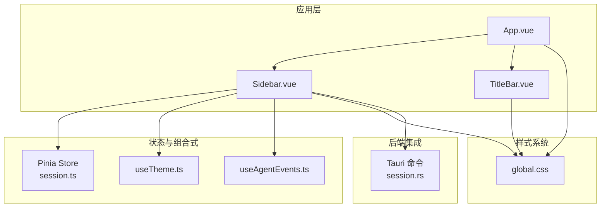
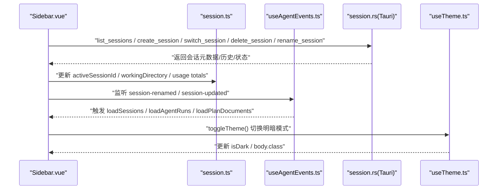
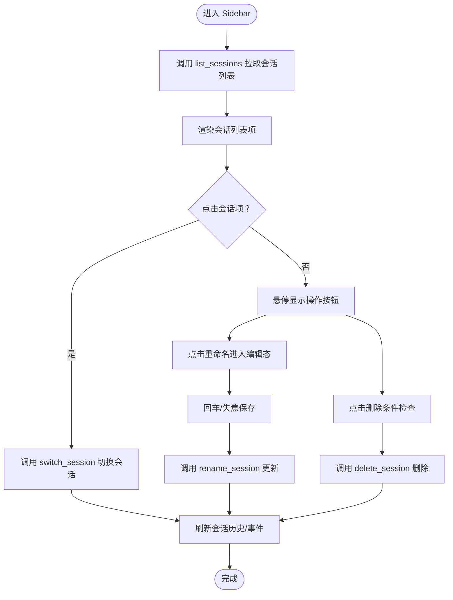
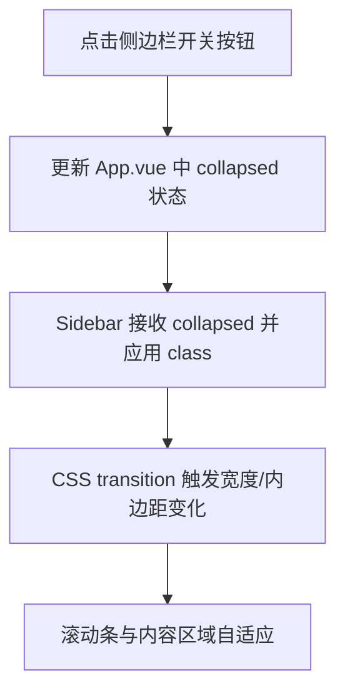
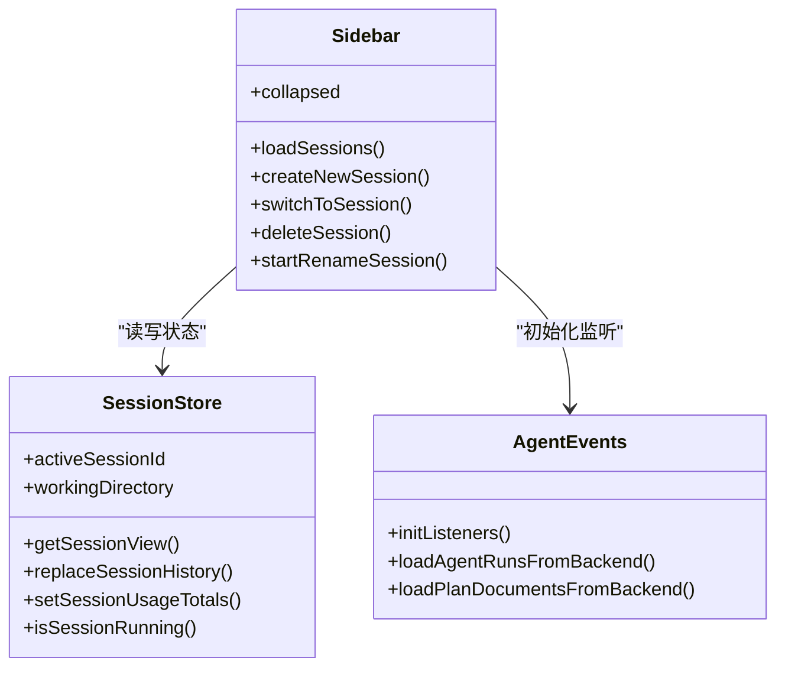
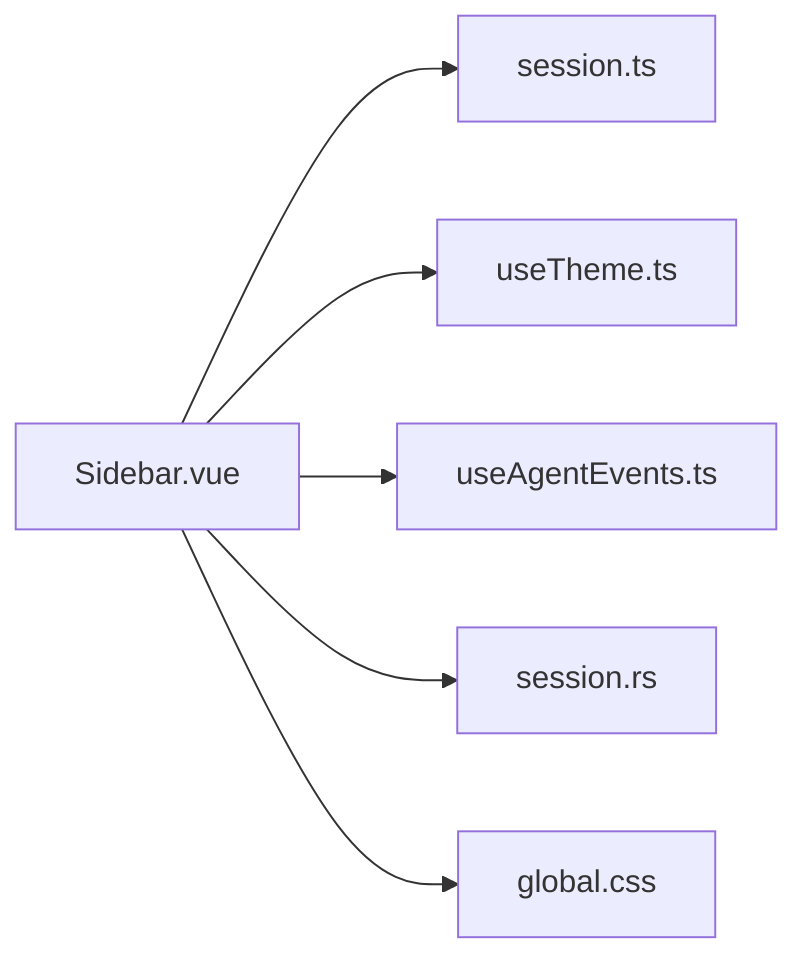

# 侧边栏组件

<cite>
**本文引用的文件**
- [Sidebar.vue](file://src/components/layout/Sidebar.vue)
- [App.vue](file://src/App.vue)
- [main.ts](file://src/main.ts)
- [session.ts](file://src/stores/session.ts)
- [useTheme.ts](file://src/composables/useTheme.ts)
- [global.css](file://src/assets/global.css)
- [TitleBar.vue](file://src/components/layout/TitleBar.vue)
- [useAgentEvents.ts](file://src/composables/useAgentEvents.ts)
- [index.ts](file://src/types/index.ts)
- [session.rs](file://src-tauri/src/core/commands/session.rs)
</cite>

## 目录
1. [简介](#简介)
2. [项目结构](#项目结构)
3. [核心组件](#核心组件)
4. [架构总览](#架构总览)
5. [详细组件分析](#详细组件分析)
6. [依赖关系分析](#依赖关系分析)
7. [性能考量](#性能考量)
8. [故障排查指南](#故障排查指南)
9. [结论](#结论)
10. [附录](#附录)

## 简介
本文件面向 Sidebar 侧边栏组件，围绕其导航菜单实现机制、菜单项动态生成、状态高亮、折叠展开动画、宽度调整与响应式适配、权限控制与条件显示、图标管理、样式系统与主题适配、交互反馈、与路由系统及状态管理的集成进行深入解析，并提供定制指南、样式覆盖方法与功能扩展建议。文档同时给出关键流程的时序图与类图，帮助读者快速把握组件设计与数据流。

## 项目结构
Sidebar 组件位于布局层，与应用根组件、主题切换、会话状态管理、事件监听等模块协同工作。整体采用 Vue 3 + Pinia 的前端架构，配合 Tauri 后端命令实现会话生命周期管理。

图表来源
- [App.vue:1-88](file://src/App.vue#L1-L88)
- [Sidebar.vue:1-789](file://src/components/layout/Sidebar.vue#L1-L789)
- [session.ts:1-163](file://src/stores/session.ts#L1-L163)
- [useTheme.ts:1-35](file://src/composables/useTheme.ts#L1-L35)
- [useAgentEvents.ts:1-452](file://src/composables/useAgentEvents.ts#L1-L452)
- [global.css:1-323](file://src/assets/global.css#L1-L323)
- [session.rs:42-210](file://src-tauri/src/core/commands/session.rs#L42-L210)

章节来源
- [App.vue:1-88](file://src/App.vue#L1-L88)
- [Sidebar.vue:1-789](file://src/components/layout/Sidebar.vue#L1-L789)
- [session.ts:1-163](file://src/stores/session.ts#L1-L163)
- [useTheme.ts:1-35](file://src/composables/useTheme.ts#L1-L35)
- [global.css:1-323](file://src/assets/global.css#L1-L323)
- [useAgentEvents.ts:1-452](file://src/composables/useAgentEvents.ts#L1-L452)
- [session.rs:42-210](file://src-tauri/src/core/commands/session.rs#L42-L210)

## 核心组件
- Sidebar 侧边栏：负责会话列表、任务列表、设置入口与主题切换按钮；支持折叠/展开动画与交互反馈。
- App 根组件：持有侧边栏折叠状态，提供侧边栏开关按钮与标题栏联动。
- Pinia 会话状态：集中管理当前会话、会话视图、运行状态、Token 使用统计等。
- 主题切换 Composable：提供亮/暗色模式切换与持久化。
- 事件监听 Composable：统一订阅后端事件，驱动会话、任务、权限等数据更新。
- 全局样式：提供 CSS 变量、毛玻璃风格、过渡动画与暗色模式变量。

章节来源
- [Sidebar.vue:1-789](file://src/components/layout/Sidebar.vue#L1-L789)
- [App.vue:1-88](file://src/App.vue#L1-L88)
- [session.ts:1-163](file://src/stores/session.ts#L1-L163)
- [useTheme.ts:1-35](file://src/composables/useTheme.ts#L1-L35)
- [useAgentEvents.ts:1-452](file://src/composables/useAgentEvents.ts#L1-L452)
- [global.css:1-323](file://src/assets/global.css#L1-L323)

## 架构总览
Sidebar 通过 Tauri 命令与后端会话系统交互，使用 Pinia 管理会话状态，借助事件监听器实时同步后端状态变化。主题切换通过 Composable 控制 body 类名与本地存储，样式系统基于 CSS 变量实现明暗主题与毛玻璃效果。

图表来源
- [Sidebar.vue:96-286](file://src/components/layout/Sidebar.vue#L96-L286)
- [session.ts:54-163](file://src/stores/session.ts#L54-L163)
- [useAgentEvents.ts:143-441](file://src/composables/useAgentEvents.ts#L143-L441)
- [session.rs:42-210](file://src-tauri/src/core/commands/session.rs#L42-L210)
- [useTheme.ts:19-28](file://src/composables/useTheme.ts#L19-L28)

## 详细组件分析

### 1) 导航菜单与动态生成
- 会话列表动态生成：组件在挂载时通过 Tauri 命令拉取会话列表，渲染为可点击的列表项。每个会话项包含图标、运行状态指示、沙箱徽章、消息计数、重命名与删除按钮。
- 任务列表动态生成：当存在待办任务时渲染 TASKS 区域，根据任务状态显示不同图标与样式。
- 交互行为：
  - 点击会话项：若非当前活动会话则切换至该会话。
  - 重命名：进入编辑态，支持回车保存、ESC 取消、失焦保存。
  - 删除：仅允许删除非活动且未运行的会话。
  - 新建会话：支持普通会话与沙箱会话（可选择工作目录）。

图表来源
- [Sidebar.vue:96-231](file://src/components/layout/Sidebar.vue#L96-L231)
- [session.rs:46-210](file://src-tauri/src/core/commands/session.rs#L46-L210)

章节来源
- [Sidebar.vue:295-427](file://src/components/layout/Sidebar.vue#L295-L427)
- [session.rs:46-210](file://src-tauri/src/core/commands/session.rs#L46-L210)

### 2) 路由跳转与状态高亮
- 当前实现：Sidebar 不直接承担“路由”职责，而是通过会话切换与事件监听实现“状态高亮”。当前活动会话在列表中以高亮样式呈现，运行中的会话带有闪烁指示。
- 状态来源：
  - activeSessionId：Pinia 中的当前会话标识。
  - sessionViews：按会话维护视图状态，包括运行状态、历史、Token 使用等。
- 事件驱动：后端事件（如会话更新、任务变更、权限请求）通过监听器同步到前端，进而触发 UI 重渲染与高亮更新。

章节来源
- [Sidebar.vue:327-328](file://src/components/layout/Sidebar.vue#L327-L328)
- [session.ts:54-163](file://src/stores/session.ts#L54-L163)
- [useAgentEvents.ts:143-441](file://src/composables/useAgentEvents.ts#L143-L441)

### 3) 折叠展开动画与宽度调整
- 折叠控制：父组件通过 props 接收 collapsed 状态，Sidebar 根元素据此切换 class，实现宽度与内边距的平滑过渡。
- 动画细节：宽度、padding 在 0.25 秒内以 ease 缓动曲线变化；滚动条与内容区域自适应隐藏/显示。
- 宽度与响应式：侧边栏基础宽度由 CSS 变量控制，标题栏随侧边栏展开/收起调整标题位置偏移，保证视觉平衡。

图表来源
- [App.vue:17-51](file://src/App.vue#L17-L51)
- [Sidebar.vue:296-449](file://src/components/layout/Sidebar.vue#L296-L449)
- [TitleBar.vue:86-88](file://src/components/layout/TitleBar.vue#L86-L88)

章节来源
- [App.vue:17-51](file://src/App.vue#L17-L51)
- [Sidebar.vue:296-449](file://src/components/layout/Sidebar.vue#L296-L449)
- [TitleBar.vue:86-88](file://src/components/layout/TitleBar.vue#L86-L88)

### 4) 权限控制与条件显示
- 会话删除条件：禁止删除正在运行的会话；删除非活动会话时，前端先检查运行状态再发起删除。
- 任务面板开关：根据是否存在任务或子 Agent 运行、计划文档等条件决定是否显示执行流程面板按钮。
- 会话重命名：输入校验与错误提示，避免空标题。

章节来源
- [Sidebar.vue:217-231](file://src/components/layout/Sidebar.vue#L217-L231)
- [Sidebar.vue:105-131](file://src/components/layout/Sidebar.vue#L105-L131)
- [App.vue:60-73](file://src/App.vue#L60-L73)

### 5) 图标管理与交互反馈
- 图标来源：所有图标采用 SVG，尺寸与描边一致，便于主题适配。
- 交互反馈：
  - 会话操作消息：成功/错误信息在 3.5 秒后自动清除。
  - 按钮悬停：删除/重命名按钮在悬停时淡入显示。
  - 运行指示：运行中会话显示闪烁小圆点，配合动画增强状态感知。
  - 设置与主题：底部操作区提供设置入口与主题切换按钮，支持提示文本。

章节来源
- [Sidebar.vue:316-322](file://src/components/layout/Sidebar.vue#L316-L322)
- [Sidebar.vue:695-741](file://src/components/layout/Sidebar.vue#L695-L741)
- [Sidebar.vue:644-658](file://src/components/layout/Sidebar.vue#L644-L658)

### 6) 样式系统与主题适配
- CSS 变量：通过全局 CSS 变量统一管理背景、边框、强调色、阴影、圆角与过渡时间，支持明/暗两套主题。
- 毛玻璃效果：使用 backdrop-filter 与透明度混合，营造通透感；暗色模式下变量值更柔和。
- 组件样式：Sidebar 内部样式采用 scoped，结合通用 glass 工具类，确保一致性与可维护性。

章节来源
- [global.css:6-114](file://src/assets/global.css#L6-L114)
- [Sidebar.vue:429-788](file://src/components/layout/Sidebar.vue#L429-L788)

### 7) 与路由系统、状态管理、事件处理的集成
- 状态管理：Pinia Store 提供会话视图、活动会话 ID、工作目录、Token 使用统计等；计算属性驱动 UI 状态。
- 事件处理：useAgentEvents 统一监听后端事件（任务、权限、计划、Agent 运行等），并同步到前端状态，触发渲染。
- 路由系统：项目未使用前端路由库，Sidebar 通过会话切换与事件监听实现“页面内导航”的语义。

图表来源
- [session.ts:54-163](file://src/stores/session.ts#L54-L163)
- [useAgentEvents.ts:30-451](file://src/composables/useAgentEvents.ts#L30-L451)
- [Sidebar.vue:1-293](file://src/components/layout/Sidebar.vue#L1-L293)

章节来源
- [session.ts:54-163](file://src/stores/session.ts#L54-L163)
- [useAgentEvents.ts:30-451](file://src/composables/useAgentEvents.ts#L30-L451)
- [Sidebar.vue:1-293](file://src/components/layout/Sidebar.vue#L1-L293)

### 8) 与后端命令的协作
- 会话管理：list_sessions、create_session、switch_session、delete_session、rename_session、get_session_meta、update_session_profile 等命令支撑 Sidebar 的核心能力。
- 生命周期：创建/切换会话后，前端同步 Token 使用、工作目录、会话历史与 Agent 事件；删除会话后触发清理与回退逻辑。

章节来源
- [session.rs:42-210](file://src-tauri/src/core/commands/session.rs#L42-L210)
- [Sidebar.vue:96-286](file://src/components/layout/Sidebar.vue#L96-L286)

## 依赖关系分析
- 组件耦合：
  - Sidebar 对 Pinia 会话状态有强依赖，用于读取/写入活动会话与视图。
  - 对事件监听器有间接依赖，通过事件驱动刷新 UI。
  - 对主题切换有轻量依赖，仅触发切换动作。
- 外部依赖：
  - Tauri 命令：会话 CRUD、元数据查询、配置更新。
  - 全局样式：CSS 变量与毛玻璃工具类。
- 潜在循环依赖：无明显循环，Sidebar 仅消费状态与事件，不反向写回。

图表来源
- [Sidebar.vue:1-25](file://src/components/layout/Sidebar.vue#L1-L25)
- [session.ts:1-163](file://src/stores/session.ts#L1-L163)
- [useTheme.ts:1-35](file://src/composables/useTheme.ts#L1-L35)
- [useAgentEvents.ts:1-452](file://src/composables/useAgentEvents.ts#L1-L452)
- [global.css:1-323](file://src/assets/global.css#L1-L323)
- [session.rs:42-210](file://src-tauri/src/core/commands/session.rs#L42-L210)

章节来源
- [Sidebar.vue:1-25](file://src/components/layout/Sidebar.vue#L1-L25)
- [session.ts:1-163](file://src/stores/session.ts#L1-L163)
- [useTheme.ts:1-35](file://src/composables/useTheme.ts#L1-L35)
- [useAgentEvents.ts:1-452](file://src/composables/useAgentEvents.ts#L1-L452)
- [global.css:1-323](file://src/assets/global.css#L1-L323)
- [session.rs:42-210](file://src-tauri/src/core/commands/session.rs#L42-L210)

## 性能考量
- 渲染优化：
  - 列表项使用 v-for + key，减少不必要的重排。
  - 会话操作消息定时器在组件卸载时清理，避免内存泄漏。
- 事件监听：
  - 事件监听器在挂载时注册，卸载时清理；避免重复注册。
  - 后端事件带去重键，防止重复内容多次追加。
- 动画与滚动：
  - 折叠动画使用 CSS transition，避免 JS 动画阻塞主线程。
  - 滚动条样式与容器自适应，减少布局抖动。

章节来源
- [Sidebar.vue:288-292](file://src/components/layout/Sidebar.vue#L288-L292)
- [useAgentEvents.ts:24-28](file://src/composables/useAgentEvents.ts#L24-L28)

## 故障排查指南
- 无法加载会话列表
  - 检查 Tauri 命令是否可用与返回格式是否正确。
  - 查看控制台错误日志与会话 Action 消息提示。
- 切换会话失败
  - 确认目标会话状态与运行状态；避免在运行中切换。
  - 检查后端 active-session-changed 事件是否正常触发。
- 删除会话报错
  - 确认会话非活动且未运行；查看错误消息并重试。
- 主题切换无效
  - 检查本地存储与 body 类名是否更新；确认 CSS 变量是否正确加载。

章节来源
- [Sidebar.vue:96-231](file://src/components/layout/Sidebar.vue#L96-L231)
- [useAgentEvents.ts:373-440](file://src/composables/useAgentEvents.ts#L373-L440)
- [useTheme.ts:19-28](file://src/composables/useTheme.ts#L19-L28)
- [global.css:72-114](file://src/assets/global.css#L72-L114)

## 结论
Sidebar 通过简洁的模板与脚本实现会话与任务的可视化管理，结合 Pinia 状态与事件监听，形成稳定的前后端协作闭环。其折叠动画、图标系统、主题适配与交互反馈共同构建了良好的用户体验。未来可在以下方面进一步增强：引入前端路由以支持多页面导航、增加菜单项权限与条件渲染的配置化、提供更丰富的图标与主题扩展接口。

## 附录

### A. 组件使用与配置选项
- 属性
  - collapsed: boolean，控制侧边栏折叠状态。
- 事件
  - open-settings: 点击设置按钮时触发，父组件可弹出设置面板。
- 方法（内部）
  - loadSessions、createNewSession、switchToSession、deleteSession、startRenameSession、submitRenameSession、cancelRenameSession、showSessionActionMessage、formatErrorMessage、requestWorkingDirectory。

章节来源
- [Sidebar.vue:12-18](file://src/components/layout/Sidebar.vue#L12-L18)
- [Sidebar.vue:96-231](file://src/components/layout/Sidebar.vue#L96-L231)

### B. 样式覆盖与定制指南
- 修改侧边栏宽度：调整 CSS 变量 --sidebar-width 或 .sidebar 的 width。
- 自定义毛玻璃效果：修改 --glass-bg、--glass-border、--glass-blur 等变量。
- 更换强调色：修改 --accent-* 变量，或针对具体场景覆盖 .active、.hover 等类。
- 动画时长与缓动：调整 --transition-fast、--transition-normal 等变量。

章节来源
- [global.css:60-70](file://src/assets/global.css#L60-L70)
- [Sidebar.vue:430-449](file://src/components/layout/Sidebar.vue#L430-L449)

### C. 功能扩展建议
- 菜单项权限与条件渲染：在会话/任务列表渲染前增加权限判断与条件过滤。
- 多级菜单与分组：为会话/任务添加分组与折叠，提升大列表可读性。
- 快捷操作：为常用会话添加固定/收藏、快捷切换。
- 搜索与筛选：在会话列表顶部增加搜索框，支持按标题/时间/状态筛选。
- 自定义图标：引入图标库（如 Feather、Heroicons），统一图标风格。