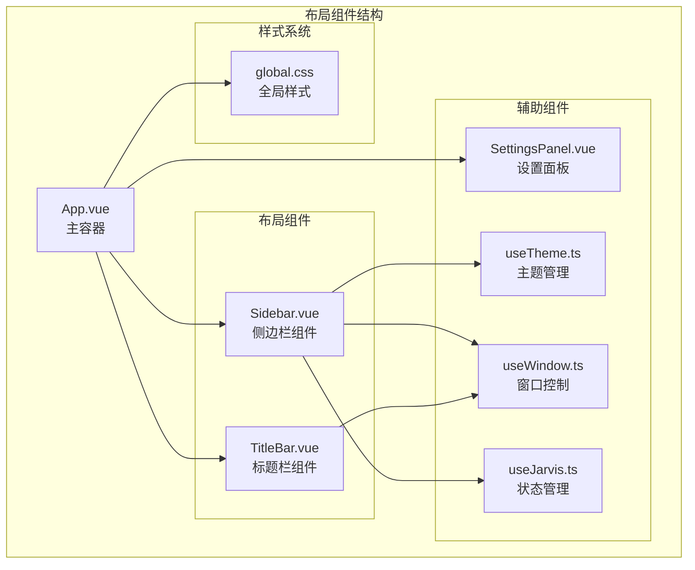
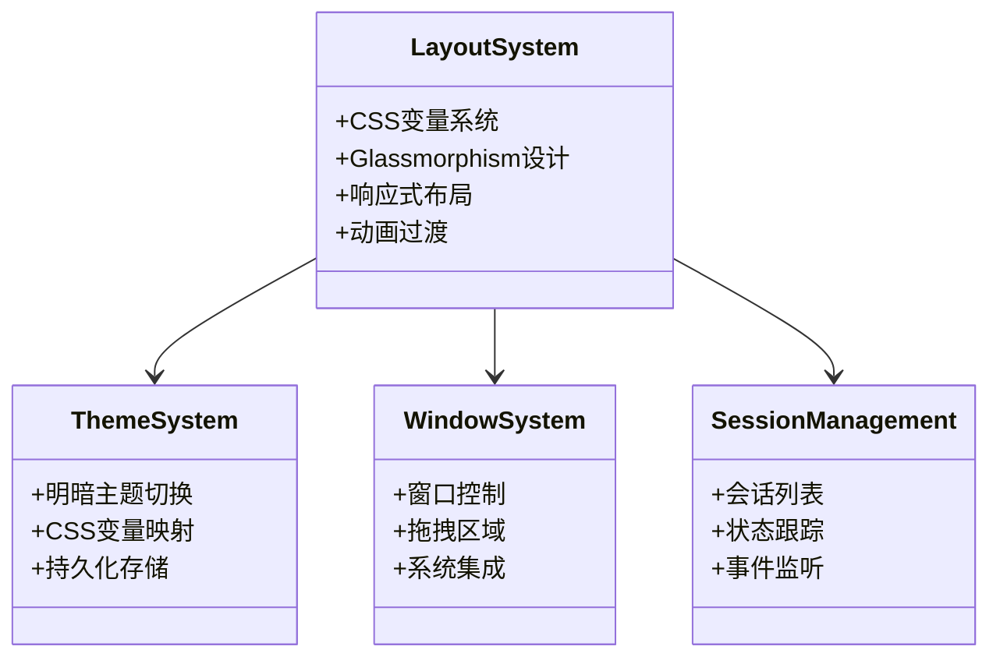
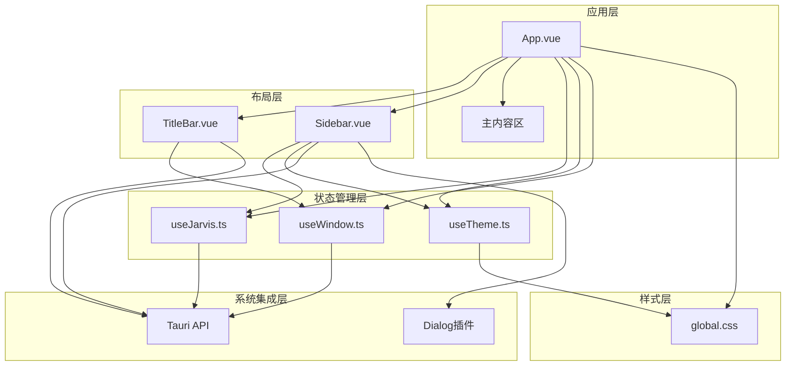
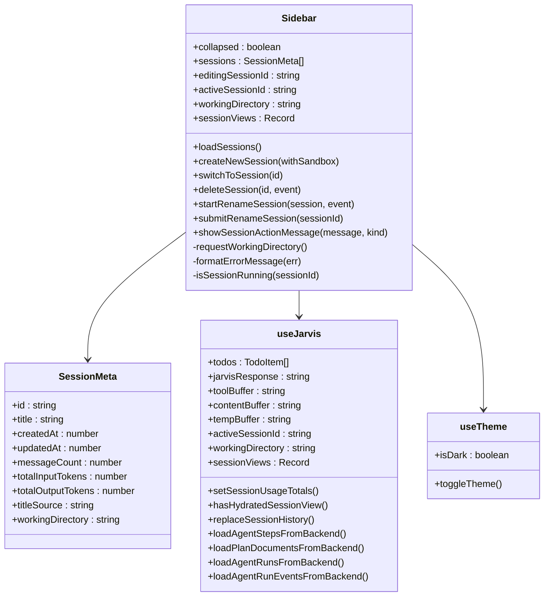
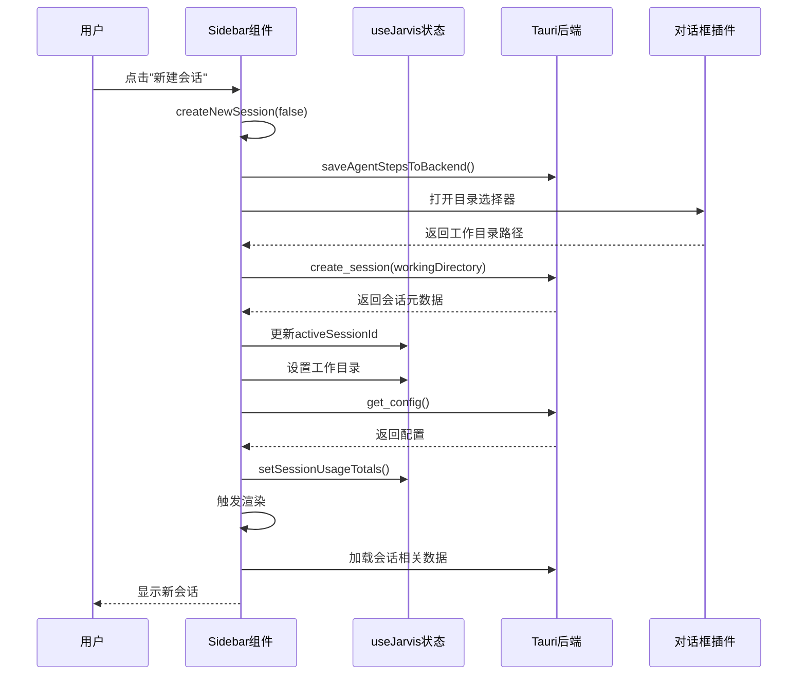
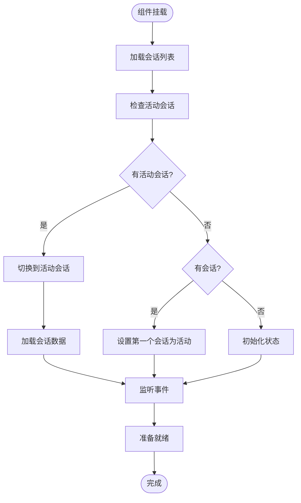
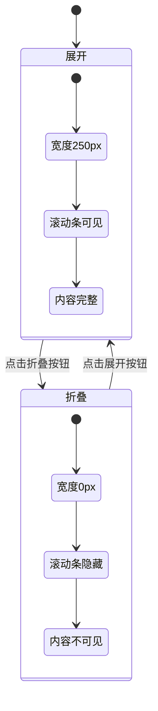
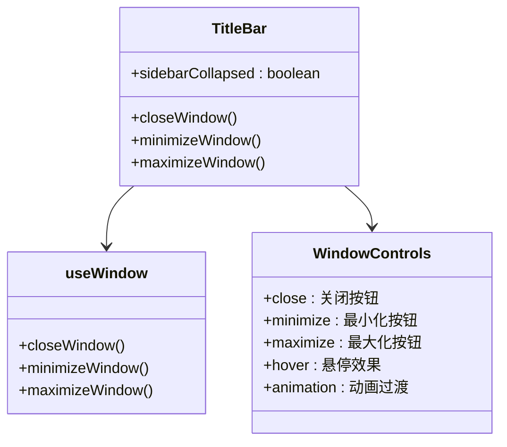
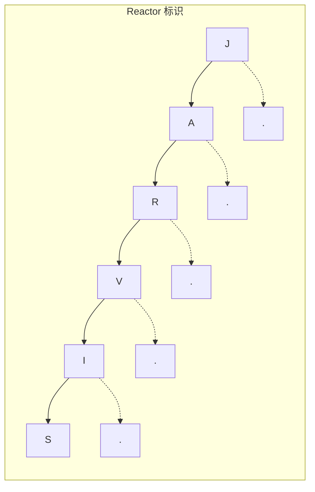

# 布局组件

<cite>
**本文档引用的文件**
- [Sidebar.vue](file://src/components/layout/Sidebar.vue)
- [TitleBar.vue](file://src/components/layout/TitleBar.vue)
- [useTheme.ts](file://src/composables/useTheme.ts)
- [useWindow.ts](file://src/composables/useWindow.ts)
- [useJarvis.ts](file://src/composables/useJarvis.ts)
- [global.css](file://src/assets/global.css)
- [App.vue](file://src/App.vue)
- [SettingsPanel.vue](file://src/components/settings/SettingsPanel.vue)
</cite>

## 目录
1. [简介](#简介)
2. [项目结构](#项目结构)
3. [核心组件](#核心组件)
4. [架构概览](#架构概览)
5. [详细组件分析](#详细组件分析)
6. [依赖关系分析](#依赖关系分析)
7. [性能考虑](#性能考虑)
8. [故障排除指南](#故障排除指南)
9. [结论](#结论)
10. [附录](#附录)

## 简介

JarvisAgent 的布局组件系统采用现代化的 Vue 3 + Tauri 架构，实现了高度可定制的桌面应用程序界面。该系统的核心是两个关键布局组件：Sidebar 侧边栏组件和 TitleBar 标题栏组件，它们共同提供了完整的应用布局解决方案。

系统采用了先进的 Glassmorphism（毛玻璃）设计语言，结合响应式设计和流畅的动画效果，为用户提供沉浸式的桌面体验。组件间通过精心设计的状态管理和事件通信机制实现无缝协作。

## 项目结构

布局组件位于 `src/components/layout/` 目录下，采用模块化设计，每个组件都独立封装了完整的功能逻辑。



**图表来源**
- [App.vue:31-82](file://src/App.vue#L31-L82)
- [Sidebar.vue:1-287](file://src/components/layout/Sidebar.vue#L1-L287)
- [TitleBar.vue:1-109](file://src/components/layout/TitleBar.vue#L1-L109)

**章节来源**
- [App.vue:1-276](file://src/App.vue#L1-L276)
- [global.css:1-308](file://src/assets/global.css#L1-L308)

## 核心组件

### 组件架构概览

布局系统采用分层架构设计，每个组件都有明确的职责分工：

- **App.vue**: 主容器，协调整个应用布局
- **TitleBar.vue**: 窗口控制和应用标识
- **Sidebar.vue**: 会话管理和导航功能
- **useTheme.ts**: 主题状态管理
- **useWindow.ts**: 系统窗口控制
- **useJarvis.ts**: 应用状态管理

### 样式系统基础

系统采用 CSS 自定义属性驱动的设计系统，支持明暗主题切换和响应式布局。



**图表来源**
- [global.css:6-114](file://src/assets/global.css#L6-L114)
- [useTheme.ts:9-34](file://src/composables/useTheme.ts#L9-L34)
- [useWindow.ts:3-24](file://src/composables/useWindow.ts#L3-L24)

**章节来源**
- [global.css:1-308](file://src/assets/global.css#L1-L308)
- [useTheme.ts:1-35](file://src/composables/useTheme.ts#L1-L35)
- [useWindow.ts:1-25](file://src/composables/useWindow.ts#L1-L25)

## 架构概览

布局系统的整体架构体现了现代前端应用的最佳实践，通过组件化设计实现了高度的模块化和可维护性。



**图表来源**
- [App.vue:1-276](file://src/App.vue#L1-L276)
- [Sidebar.vue:1-287](file://src/components/layout/Sidebar.vue#L1-L287)
- [TitleBar.vue:1-109](file://src/components/layout/TitleBar.vue#L1-L109)

## 详细组件分析

### Sidebar 侧边栏组件

Sidebar 组件是布局系统的核心，负责会话管理、导航功能和应用设置访问。

#### 组件架构设计



**图表来源**
- [Sidebar.vue:17-287](file://src/components/layout/Sidebar.vue#L17-L287)
- [useJarvis.ts:121-180](file://src/composables/useJarvis.ts#L121-L180)
- [useTheme.ts:9-34](file://src/composables/useTheme.ts#L9-L34)

#### 导航功能实现

Sidebar 提供了完整的会话导航功能，包括会话创建、切换、重命名和删除。



**图表来源**
- [Sidebar.vue:128-172](file://src/components/layout/Sidebar.vue#L128-L172)
- [Sidebar.vue:175-209](file://src/components/layout/Sidebar.vue#L175-L209)

#### 菜单项管理机制

Sidebar 实现了动态菜单项管理，支持会话列表的实时更新和状态同步。



**图表来源**
- [Sidebar.vue:230-280](file://src/components/layout/Sidebar.vue#L230-L280)

#### 折叠展开机制

Sidebar 支持动态折叠和展开，通过 CSS 过渡动画实现流畅的用户体验。



**图表来源**
- [Sidebar.vue:438-443](file://src/components/layout/Sidebar.vue#L438-L443)
- [App.vue:41-45](file://src/App.vue#L41-L45)

#### 路由切换机制

Sidebar 通过 Tauri 后端 API 实现会话级别的数据切换，确保状态的一致性和完整性。

**章节来源**
- [Sidebar.vue:1-783](file://src/components/layout/Sidebar.vue#L1-L783)
- [useJarvis.ts:121-400](file://src/composables/useJarvis.ts#L121-L400)

### TitleBar 标题栏组件

TitleBar 组件提供了标准的窗口控制功能和应用标识展示。

#### 窗口控制功能



**图表来源**
- [TitleBar.vue:1-109](file://src/components/layout/TitleBar.vue#L1-L109)
- [useWindow.ts:3-24](file://src/composables/useWindow.ts#L3-L24)

#### 应用信息显示

TitleBar 采用独特的 Reactor 标识系统，通过 CSS 动画实现字符脉冲效果。



**图表来源**
- [TitleBar.vue:18-27](file://src/components/layout/TitleBar.vue#L18-L27)
- [TitleBar.vue:89-103](file://src/components/layout/TitleBar.vue#L89-L103)

#### 主题切换集成

TitleBar 与主题系统紧密集成，支持明暗主题的无缝切换。

**章节来源**
- [TitleBar.vue:1-109](file://src/components/layout/TitleBar.vue#L1-L109)
- [useWindow.ts:1-25](file://src/composables/useWindow.ts#L1-L25)

## 依赖关系分析

布局组件之间的依赖关系体现了清晰的关注点分离和模块化设计。

```mermaid
graph TB
subgraph "外部依赖"
Vue[Vue 3]
Tauri[Tauri API]
Dialog[@tauri-apps/plugin-dialog]
Marked[marked]
end
subgraph "内部依赖"
App[App.vue]
TitleBar[TitleBar.vue]
Sidebar[Sidebar.vue]
useJarvis[useJarvis.ts]
useTheme[useTheme.ts]
useWindow[useWindow.ts]
globalCSS[global.css]
end
Vue --> App
Vue --> TitleBar
Vue --> Sidebar
Tauri --> useJarvis
Tauri --> useWindow
Dialog --> Sidebar
Marked --> useJarvis
App --> TitleBar
App --> Sidebar
App --> useJarvis
App --> useTheme
App --> useWindow
App --> globalCSS
Sidebar --> useJarvis
Sidebar --> useTheme
TitleBar --> useWindow
```

**图表来源**
- [package.json:12-26](file://package.json#L12-L26)
- [App.vue:1-276](file://src/App.vue#L1-L276)
- [Sidebar.vue:1-287](file://src/components/layout/Sidebar.vue#L1-L287)
- [TitleBar.vue:1-109](file://src/components/layout/TitleBar.vue#L1-L109)

### 组件间协调机制

布局系统通过多种机制实现组件间的协调和状态共享：

1. **状态提升**: App.vue 作为状态管理中心，向上管理折叠状态
2. **事件通信**: 子组件通过事件向父组件传递用户交互
3. **组合式函数**: useJarvis、useTheme、useWindow 提供跨组件的状态共享
4. **Tauri 集成**: 通过后端 API 实现数据持久化和系统集成

**章节来源**
- [App.vue:14-28](file://src/App.vue#L14-L28)
- [Sidebar.vue:13-18](file://src/components/layout/Sidebar.vue#L13-L18)
- [useJarvis.ts:121-180](file://src/composables/useJarvis.ts#L121-L180)

## 性能考虑

布局系统在设计时充分考虑了性能优化，采用了多种策略确保流畅的用户体验。

### 响应式设计优化

系统采用 CSS Grid 和 Flexbox 实现高效的布局计算，配合媒体查询实现自适应布局。

### 动画性能优化

- 使用 CSS transform 和 opacity 实现硬件加速
- 限制动画属性数量，避免频繁的布局计算
- 使用 requestAnimationFrame 优化动画帧率

### 内存管理

- 合理使用 Vue 3 的响应式系统，避免不必要的响应式转换
- 及时清理事件监听器和定时器
- 使用虚拟滚动处理大量会话列表

## 故障排除指南

### 常见问题及解决方案

#### 会话加载失败

**症状**: 会话列表为空或加载超时

**可能原因**:
- Tauri 后端服务未启动
- 数据库连接异常
- 权限不足

**解决步骤**:
1. 检查后端服务状态
2. 验证数据库连接
3. 确认文件系统权限

#### 窗口控制失效

**症状**: 最小化、最大化、关闭按钮无响应

**可能原因**:
- Tauri 窗口 API 调用失败
- 拖拽区域冲突
- 系统权限限制

**解决步骤**:
1. 检查 Tauri 版本兼容性
2. 验证拖拽区域配置
3. 确认系统权限设置

#### 主题切换异常

**症状**: 明暗主题切换不生效或状态不同步

**可能原因**:
- localStorage 访问受限
- CSS 变量更新失败
- 缓存问题

**解决步骤**:
1. 检查浏览器存储权限
2. 验证 CSS 变量定义
3. 清除浏览器缓存

**章节来源**
- [useTheme.ts:10-28](file://src/composables/useTheme.ts#L10-L28)
- [useWindow.ts:4-17](file://src/composables/useWindow.ts#L4-L17)

## 结论

JarvisAgent 的布局组件系统展现了现代前端应用开发的最佳实践。通过精心设计的组件架构、完善的样式系统和高效的性能优化，为用户提供了优秀的桌面应用体验。

系统的主要优势包括：
- **模块化设计**: 清晰的职责分离和组件边界
- **响应式布局**: 适配不同屏幕尺寸和设备
- **主题系统**: 支持明暗主题的无缝切换
- **性能优化**: 通过多种策略确保流畅体验
- **可扩展性**: 良好的架构设计便于功能扩展

未来可以考虑的改进方向：
- 添加更多的动画效果和过渡
- 增强键盘快捷键支持
- 优化移动端适配
- 扩展主题定制选项

## 附录

### 样式定制指南

#### CSS 变量覆盖

系统支持通过修改 CSS 变量来自定义外观：

```css
:root {
  /* 修改颜色方案 */
  --bg-dark: #your-color;
  --text-main: #your-color;
  
  /* 修改尺寸参数 */
  --header-height: 50px;
  --sidebar-width: 300px;
  
  /* 修改动画参数 */
  --transition-fast: 200ms;
  --transition-normal: 300ms;
}
```

#### 组件样式覆盖

可以通过以下方式覆盖组件样式：

1. **全局样式**: 在 global.css 中添加自定义规则
2. **作用域样式**: 在组件的 style 标签中添加 scoped 样式
3. **CSS 模块**: 使用 CSS Modules 实现局部样式隔离

### 扩展开发建议

#### 新增布局组件

1. **遵循现有模式**: 参考 Sidebar 和 TitleBar 的实现模式
2. **状态管理**: 使用组合式函数管理组件状态
3. **样式系统**: 遵循 Glassmorphism 设计语言
4. **响应式设计**: 确保组件在不同屏幕尺寸下的表现

#### 性能优化建议

1. **懒加载**: 对于大型组件实现懒加载
2. **虚拟滚动**: 对于大量数据使用虚拟滚动
3. **防抖节流**: 对频繁触发的操作使用防抖节流
4. **缓存策略**: 合理使用缓存减少重复计算

#### 测试策略

1. **单元测试**: 为组合式函数编写单元测试
2. **组件测试**: 使用 Vue Test Utils 测试组件行为
3. **集成测试**: 测试组件间的交互
4. **性能测试**: 监控组件的性能指标