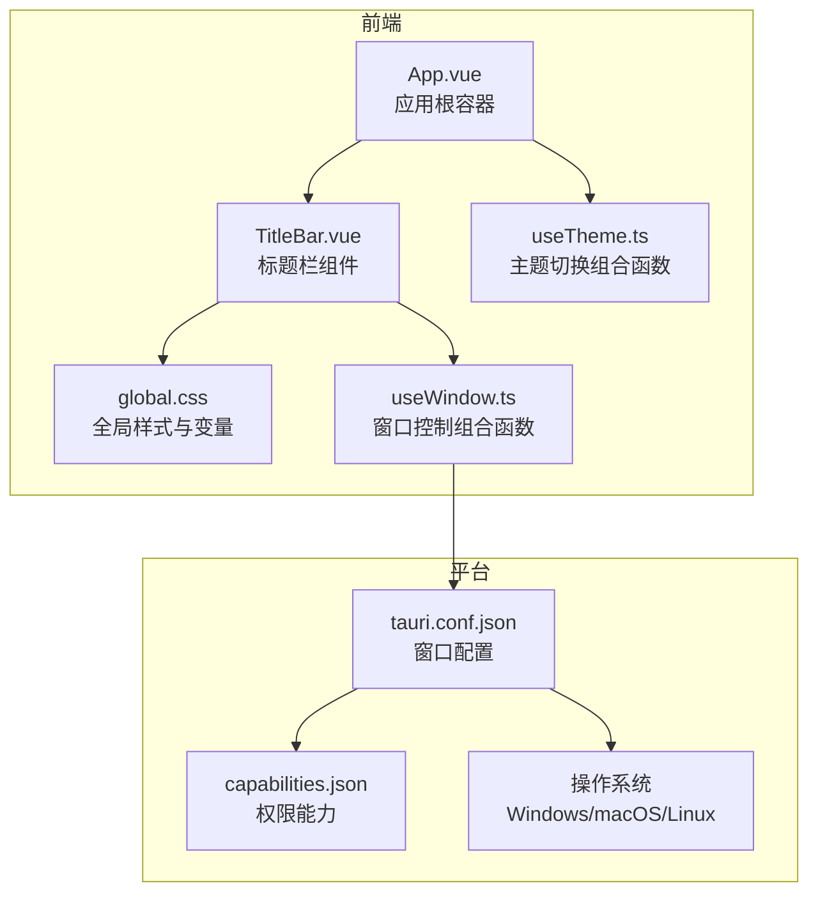
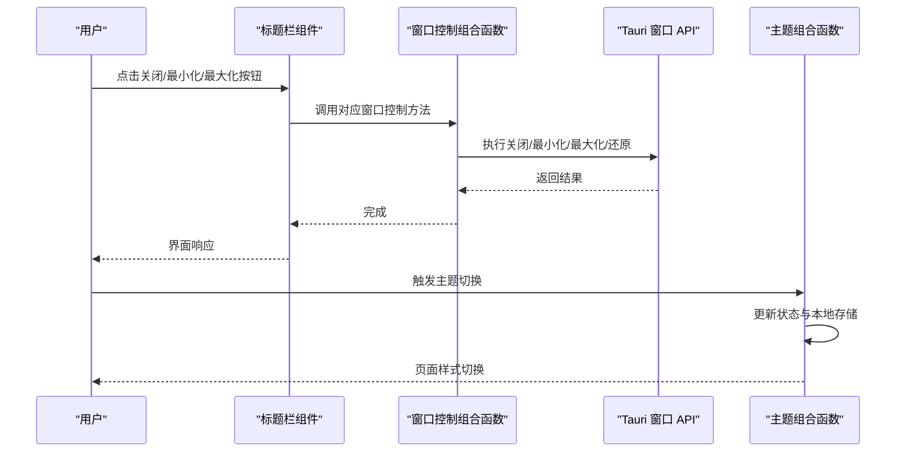
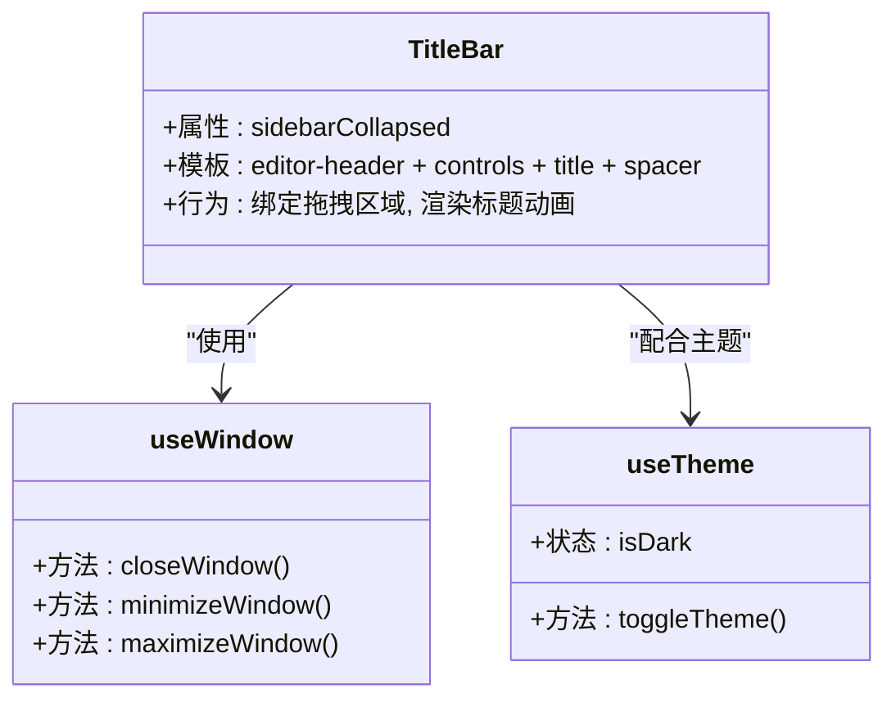
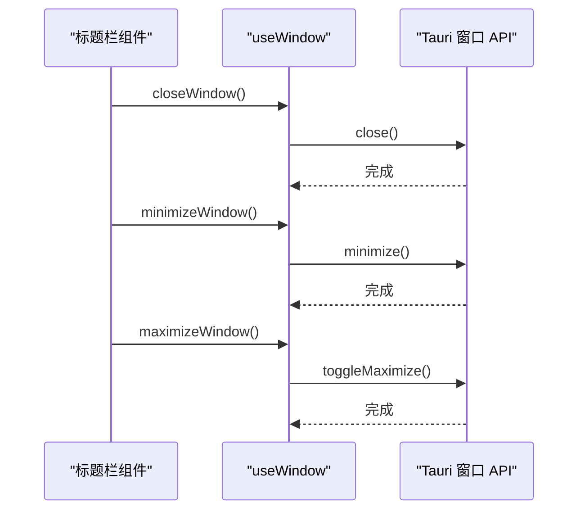
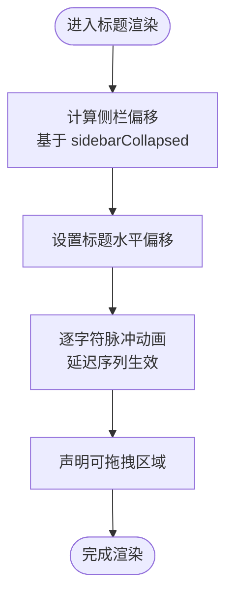
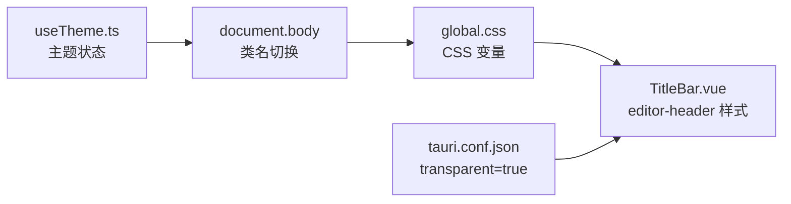
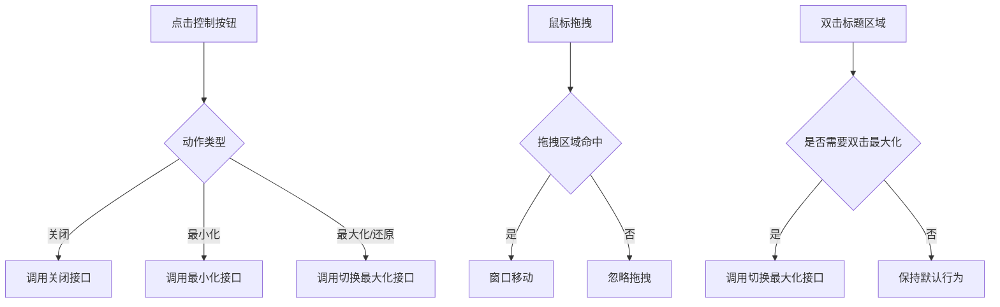
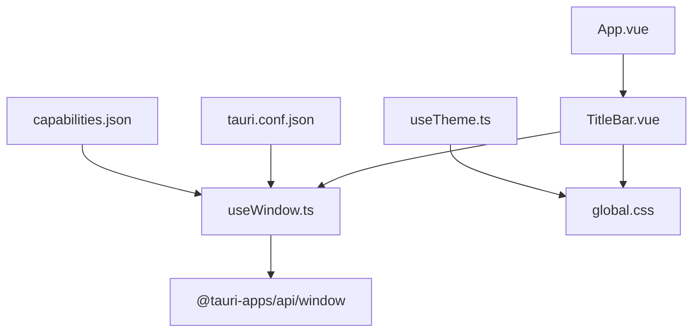

# 标题栏组件

<cite>
**本文引用的文件**
- [TitleBar.vue](file://src/components/layout/TitleBar.vue)
- [useWindow.ts](file://src/composables/useWindow.ts)
- [useTheme.ts](file://src/composables/useTheme.ts)
- [global.css](file://src/assets/global.css)
- [App.vue](file://src/App.vue)
- [tauri.conf.json](file://src-tauri/tauri.conf.json)
- [main.rs](file://src-tauri/src/main.rs)
- [capabilities.json](file://src-tauri/gen/schemas/capabilities.json)
</cite>

## 目录
1. [简介](#简介)
2. [项目结构](#项目结构)
3. [核心组件](#核心组件)
4. [架构总览](#架构总览)
5. [详细组件分析](#详细组件分析)
6. [依赖关系分析](#依赖关系分析)
7. [性能考量](#性能考量)
8. [故障排查指南](#故障排查指南)
9. [结论](#结论)
10. [附录](#附录)

## 简介
本文件针对标题栏组件进行系统化技术文档编写，覆盖窗口控制按钮实现、应用标题显示、系统菜单集成现状与限制、主题切换与颜色适配、透明效果、拖拽区域与双击最大化行为、跨平台兼容性与事件监听等关键主题。同时提供定制指南、样式修改方法与功能扩展建议，并通过图示与路径引用帮助读者快速定位实现细节。

## 项目结构
标题栏组件位于前端布局层，作为应用顶层容器的一部分，与全局样式、窗口控制组合与主题管理协同工作。整体组织如下：
- 组件层：标题栏组件负责渲染窗口控制按钮与应用标题，绑定拖拽区域属性
- 控制层：窗口控制组合函数封装 Tauri 窗口 API 调用
- 样式层：全局 CSS 变量与暗色模式切换，支撑标题栏的毛玻璃与透明效果
- 平台层：Tauri 配置启用无边框与透明背景，配合前端拖拽区域实现可拖拽标题栏

**图表来源**
- [App.vue:37-88](file://src/App.vue#L37-L88)
- [TitleBar.vue:11-30](file://src/components/layout/TitleBar.vue#L11-L30)
- [useWindow.ts:1-25](file://src/composables/useWindow.ts#L1-L25)
- [global.css:1-323](file://src/assets/global.css#L1-L323)
- [tauri.conf.json:12-23](file://src-tauri/tauri.conf.json#L12-L23)
- [capabilities.json:1-1](file://src-tauri/gen/schemas/capabilities.json#L1-L1)

**章节来源**
- [App.vue:37-88](file://src/App.vue#L37-L88)
- [TitleBar.vue:11-30](file://src/components/layout/TitleBar.vue#L11-L30)
- [useWindow.ts:1-25](file://src/composables/useWindow.ts#L1-L25)
- [global.css:1-323](file://src/assets/global.css#L1-L323)
- [tauri.conf.json:12-23](file://src-tauri/tauri.conf.json#L12-L23)
- [capabilities.json:1-1](file://src-tauri/gen/schemas/capabilities.json#L1-L1)

## 核心组件
- 标题栏组件：渲染窗口控制按钮与应用标题，使用数据属性标记可拖拽区域；根据侧栏折叠状态调整标题位置偏移；内置字符逐个脉冲动画以增强视觉层次
- 窗口控制组合函数：封装关闭、最小化、最大化/还原的窗口操作，统一通过 Tauri 当前窗口句柄调用
- 主题切换组合函数：管理亮/暗色模式状态与本地持久化，切换时在根元素添加/移除类名
- 全局样式：提供毛玻璃背景、模糊半径、边框与过渡动画变量，支持浅色/深色两套变量集

关键实现要点
- 拖拽区域：标题栏容器与标题文本区域均标注可拖拽属性，确保在无边框窗口下仍可拖动
- 窗口控制：三个控制按钮分别绑定点击事件，调用组合函数中的对应方法
- 应用标题：采用逐字符动画的“J.A.R.V.I.S”标识，居中显示并随侧栏折叠改变水平偏移
- 透明与毛玻璃：标题栏背景与模糊参数来自全局变量，受主题切换影响

**章节来源**
- [TitleBar.vue:11-30](file://src/components/layout/TitleBar.vue#L11-L30)
- [TitleBar.vue:32-108](file://src/components/layout/TitleBar.vue#L32-L108)
- [useWindow.ts:1-25](file://src/composables/useWindow.ts#L1-L25)
- [useTheme.ts:1-35](file://src/composables/useTheme.ts#L1-L35)
- [global.css:6-114](file://src/assets/global.css#L6-L114)

## 架构总览
标题栏组件在应用生命周期内被挂载于根容器之下，通过组合函数与平台 API 协作，实现窗口控制与主题切换。平台配置决定窗口是否具备原生系统菜单与边框，前端通过拖拽区域属性模拟可拖拽体验。

**图表来源**
- [TitleBar.vue:11-30](file://src/components/layout/TitleBar.vue#L11-L30)
- [useWindow.ts:1-25](file://src/composables/useWindow.ts#L1-L25)
- [useTheme.ts:1-35](file://src/composables/useTheme.ts#L1-L35)

## 详细组件分析

### 标题栏组件结构与职责
- 结构组成：容器、窗口控制区、应用标题区、右侧占位区
- 行为特性：三色圆形按钮用于关闭、最小化、最大化/还原；标题区居中显示“J.A.R.V.I.S”，随侧栏折叠产生水平偏移；三处区域均声明可拖拽
- 样式特性：高度、背景、模糊、边框、过渡由全局变量控制；按钮悬停高亮与阴影；标题字符逐个脉冲动画

**图表来源**
- [TitleBar.vue:11-30](file://src/components/layout/TitleBar.vue#L11-L30)
- [useWindow.ts:1-25](file://src/composables/useWindow.ts#L1-L25)
- [useTheme.ts:1-35](file://src/composables/useTheme.ts#L1-L35)

**章节来源**
- [TitleBar.vue:11-30](file://src/components/layout/TitleBar.vue#L11-L30)
- [TitleBar.vue:32-108](file://src/components/layout/TitleBar.vue#L32-L108)

### 窗口控制按钮实现
- 关闭：调用当前窗口关闭接口
- 最小化：调用当前窗口最小化接口
- 最大化/还原：调用切换最大化状态接口

**图表来源**
- [useWindow.ts:1-25](file://src/composables/useWindow.ts#L1-L25)

**章节来源**
- [useWindow.ts:1-25](file://src/composables/useWindow.ts#L1-L25)

### 应用标题显示与动画
- 标题容器居中定位，随侧栏折叠改变水平偏移，避免与侧栏重叠
- “J.A.R.V.I.S”逐字符脉冲动画，通过延迟序列实现流水灯效果
- 标题区同样声明可拖拽，提升拖拽体验

**图表来源**
- [TitleBar.vue:18-28](file://src/components/layout/TitleBar.vue#L18-L28)
- [TitleBar.vue:86-103](file://src/components/layout/TitleBar.vue#L86-L103)

**章节来源**
- [TitleBar.vue:18-28](file://src/components/layout/TitleBar.vue#L18-L28)
- [TitleBar.vue:86-103](file://src/components/layout/TitleBar.vue#L86-L103)

### 系统菜单集成现状与限制
- 当前实现未直接集成系统菜单（如右键菜单或原生应用菜单），标题栏区域未绑定系统菜单触发逻辑
- 平台配置中未显式声明系统菜单能力，窗口能力文件允许窗口控制与拖拽，但未包含系统菜单相关权限
- 若需系统菜单，可在平台配置中增加相应能力，并在前端绑定菜单事件

**章节来源**
- [capabilities.json:1-1](file://src-tauri/gen/schemas/capabilities.json#L1-L1)

### 主题切换、颜色适配与透明效果
- 主题切换：组合函数维护亮/暗色状态并在挂载时从本地存储恢复；切换时在根元素添加/移除类名
- 颜色适配：全局 CSS 提供浅色/深色两套变量，标题栏背景、模糊、边框与文本颜色随主题自动切换
- 透明效果：窗口配置启用透明背景，标题栏使用毛玻璃背景与模糊参数，营造通透视觉

**图表来源**
- [useTheme.ts:1-35](file://src/composables/useTheme.ts#L1-L35)
- [global.css:6-114](file://src/assets/global.css#L6-L114)
- [TitleBar.vue:33-44](file://src/components/layout/TitleBar.vue#L33-L44)
- [tauri.conf.json:20-22](file://src-tauri/tauri.conf.json#L20-L22)

**章节来源**
- [useTheme.ts:1-35](file://src/composables/useTheme.ts#L1-L35)
- [global.css:6-114](file://src/assets/global.css#L6-L114)
- [TitleBar.vue:33-44](file://src/components/layout/TitleBar.vue#L33-L44)
- [tauri.conf.json:20-22](file://src-tauri/tauri.conf.json#L20-L22)

### 拖拽区域、双击最大化与最小化/关闭
- 拖拽区域：标题栏容器与标题文本区域均声明可拖拽属性，使无边框窗口可被拖动
- 双击最大化：当前实现未绑定双击事件，若需双击标题栏最大化/还原，可在标题文本区域添加双击事件并调用窗口切换最大化方法
- 最小化/关闭：通过三个控制按钮分别触发最小化与关闭

**图表来源**
- [TitleBar.vue:12-28](file://src/components/layout/TitleBar.vue#L12-L28)
- [useWindow.ts:14-17](file://src/composables/useWindow.ts#L14-L17)

**章节来源**
- [TitleBar.vue:12-28](file://src/components/layout/TitleBar.vue#L12-L28)
- [useWindow.ts:14-17](file://src/composables/useWindow.ts#L14-L17)

### 跨平台兼容性与事件监听
- 平台配置：窗口禁用装饰（无边框），启用透明背景；平台入口文件在非调试构建下设置 Windows 子系统
- 事件监听：当前未在标题栏组件中绑定窗口尺寸变化、焦点变化等事件；如需响应窗口状态变化，可在组合函数或根组件中订阅相关事件

**章节来源**
- [tauri.conf.json:12-23](file://src-tauri/tauri.conf.json#L12-L23)
- [main.rs:1-7](file://src-tauri/src/main.rs#L1-L7)

## 依赖关系分析
- 标题栏组件依赖窗口控制组合函数与全局样式变量
- 窗口控制组合函数依赖 Tauri 窗口 API
- 主题组合函数与全局样式共同决定标题栏外观
- 平台配置与能力文件决定窗口行为与权限范围

**图表来源**
- [TitleBar.vue:11-30](file://src/components/layout/TitleBar.vue#L11-L30)
- [useWindow.ts:1-25](file://src/composables/useWindow.ts#L1-L25)
- [global.css:1-323](file://src/assets/global.css#L1-L323)
- [App.vue:37-88](file://src/App.vue#L37-L88)
- [useTheme.ts:1-35](file://src/composables/useTheme.ts#L1-L35)
- [tauri.conf.json:12-23](file://src-tauri/tauri.conf.json#L12-L23)
- [capabilities.json:1-1](file://src-tauri/gen/schemas/capabilities.json#L1-L1)

**章节来源**
- [TitleBar.vue:11-30](file://src/components/layout/TitleBar.vue#L11-L30)
- [useWindow.ts:1-25](file://src/composables/useWindow.ts#L1-L25)
- [global.css:1-323](file://src/assets/global.css#L1-L323)
- [App.vue:37-88](file://src/App.vue#L37-L88)
- [useTheme.ts:1-35](file://src/composables/useTheme.ts#L1-L35)
- [tauri.conf.json:12-23](file://src-tauri/tauri.conf.json#L12-L23)
- [capabilities.json:1-1](file://src-tauri/gen/schemas/capabilities.json#L1-L1)

## 性能考量
- 毛玻璃与模糊：标题栏使用较高模糊半径与背景透明度，建议在低端设备上适度降低模糊强度或减少动画频率
- 动画与过渡：标题字符脉冲动画与过渡时间应考虑用户“减少动态”偏好设置，必要时通过媒体查询减少动画
- 拖拽区域：多处声明可拖拽区域，避免误触导致的拖拽冲突，保持区域边界清晰

[本节为通用指导，不涉及具体文件分析]

## 故障排查指南
- 窗口无法拖动
  - 检查标题栏容器与标题文本区域是否正确声明可拖拽属性
  - 确认窗口装饰已禁用且透明开启
- 窗口控制无效
  - 确认窗口控制方法已正确绑定到按钮点击事件
  - 检查平台能力文件是否包含窗口控制权限
- 标题栏样式异常
  - 检查全局 CSS 变量是否正确加载，主题切换后变量是否更新
  - 确认标题栏背景与模糊参数是否与平台透明设置一致

**章节来源**
- [TitleBar.vue:12-28](file://src/components/layout/TitleBar.vue#L12-L28)
- [tauri.conf.json:20-22](file://src-tauri/tauri.conf.json#L20-L22)
- [capabilities.json:1-1](file://src-tauri/gen/schemas/capabilities.json#L1-L1)
- [global.css:6-114](file://src/assets/global.css#L6-L114)

## 结论
标题栏组件通过简洁的结构与明确的职责划分，实现了窗口控制、应用标题展示与主题适配。结合平台配置与组合函数，组件在不同平台上保持一致的交互体验。未来可扩展系统菜单集成、双击最大化行为与更丰富的窗口状态监听，进一步提升用户体验与可访问性。

[本节为总结性内容，不涉及具体文件分析]

## 附录

### 定制指南与样式修改方法
- 修改标题栏高度与间距：调整全局变量中的头部高度与内边距
- 更改毛玻璃与透明度：调整背景与模糊变量值
- 改变按钮样式：通过类名覆盖按钮背景色与悬停效果
- 动画与过渡：调整过渡时长与缓动曲线，或在媒体查询中减少动画

**章节来源**
- [global.css:6-114](file://src/assets/global.css#L6-L114)
- [TitleBar.vue:33-108](file://src/components/layout/TitleBar.vue#L33-L108)

### 功能扩展建议
- 双击最大化：在标题文本区域绑定双击事件，调用切换最大化方法
- 系统菜单：在平台配置中增加系统菜单能力，并在前端绑定菜单事件
- 窗口状态监听：订阅窗口尺寸变化、焦点变化等事件，动态调整标题栏状态

**章节来源**
- [useWindow.ts:14-17](file://src/composables/useWindow.ts#L14-L17)
- [capabilities.json:1-1](file://src-tauri/gen/schemas/capabilities.json#L1-L1)