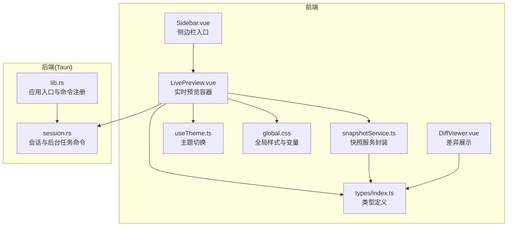
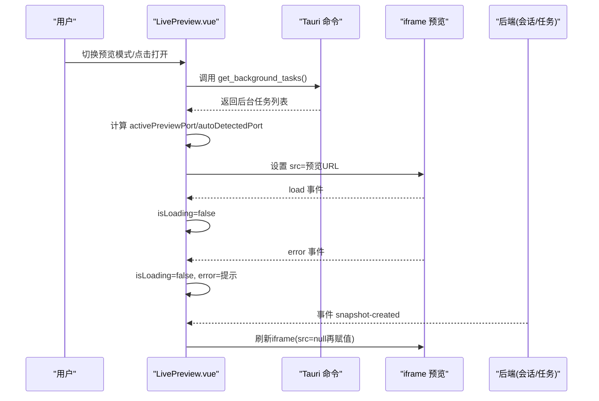
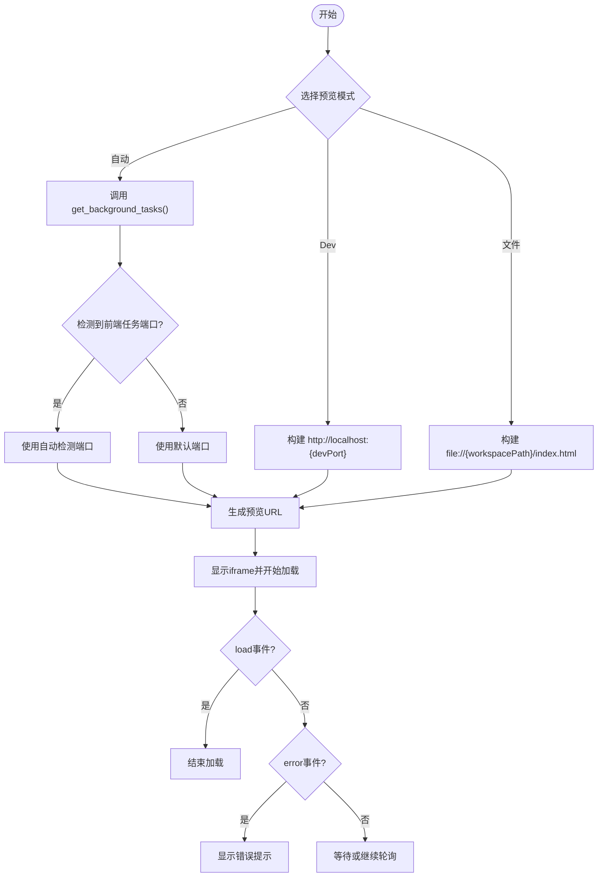
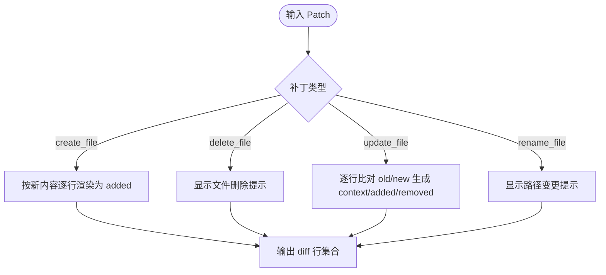
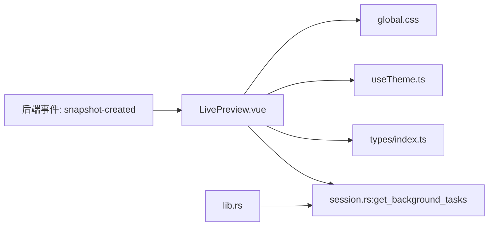

# 实时预览组件

<cite>
**本文引用的文件**
- [LivePreview.vue](file://src/components/snapshot/LivePreview.vue)
- [DiffViewer.vue](file://src/components/snapshot/DiffViewer.vue)
- [snapshotService.ts](file://src/services/snapshotService.ts)
- [index.ts](file://src/types/index.ts)
- [useTheme.ts](file://src/composables/useTheme.ts)
- [global.css](file://src/assets/global.css)
- [session.rs](file://src-tauri/src/core/commands/session.rs)
- [lib.rs](file://src-tauri/src/lib.rs)
- [Sidebar.vue](file://src/components/layout/Sidebar.vue)
</cite>

## 目录
1. [简介](#简介)
2. [项目结构](#项目结构)
3. [核心组件](#核心组件)
4. [架构总览](#架构总览)
5. [组件详细分析](#组件详细分析)
6. [依赖关系分析](#依赖关系分析)
7. [性能考量](#性能考量)
8. [故障排查指南](#故障排查指南)
9. [结论](#结论)
10. [附录](#附录)

## 简介
本文件针对实时预览组件进行深入技术文档编写，重点覆盖以下方面：
- 预览内容的实时更新机制与增量渲染策略
- 内容同步处理与事件驱动刷新
- 预览状态管理、加载状态与错误处理
- 渲染优化、缓存策略与性能监控建议
- 预览内容的格式化、语法高亮与主题适配
- 实时预览使用指南、性能调优方法与扩展开发建议

## 项目结构
实时预览组件位于前端 Vue 单文件组件中，配合 Tauri 后端命令与类型系统协同工作。整体采用“前端组件 + 后端命令 + 类型定义”的分层设计。



图表来源
- [LivePreview.vue:1-430](file://src/components/snapshot/LivePreview.vue#L1-L430)
- [snapshotService.ts:1-248](file://src/services/snapshotService.ts#L1-L248)
- [index.ts:1-371](file://src/types/index.ts#L1-L371)
- [useTheme.ts:1-35](file://src/composables/useTheme.ts#L1-L35)
- [global.css:1-323](file://src/assets/global.css#L1-L323)
- [session.rs:291-297](file://src-tauri/src/core/commands/session.rs#L291-L297)
- [lib.rs:101-182](file://src-tauri/src/lib.rs#L101-L182)
- [Sidebar.vue:1-200](file://src/components/layout/Sidebar.vue#L1-L200)

章节来源
- [LivePreview.vue:1-430](file://src/components/snapshot/LivePreview.vue#L1-L430)
- [session.rs:291-297](file://src-tauri/src/core/commands/session.rs#L291-L297)
- [lib.rs:101-182](file://src-tauri/src/lib.rs#L101-L182)

## 核心组件
- 实时预览容器：负责预览模式切换、URL 构建、加载与错误状态管理、iframe 刷新与事件监听。
- 差异展示组件：用于展示补丁差异，支持增删改与重命名场景的可视化呈现。
- 快照服务封装：提供树视图、摘要与详情的缓存与批量加载能力，支撑预览内容的增量渲染。
- 类型系统：统一定义补丁、快照、差异等核心数据结构，保证前后端一致的数据契约。
- 主题与样式：基于 CSS 变量的主题切换，适配浅色/深色模式，提供毛玻璃风格界面。

章节来源
- [LivePreview.vue:1-430](file://src/components/snapshot/LivePreview.vue#L1-L430)
- [DiffViewer.vue:1-265](file://src/components/snapshot/DiffViewer.vue#L1-L265)
- [snapshotService.ts:1-248](file://src/services/snapshotService.ts#L1-L248)
- [index.ts:224-313](file://src/types/index.ts#L224-L313)
- [useTheme.ts:1-35](file://src/composables/useTheme.ts#L1-L35)
- [global.css:1-323](file://src/assets/global.css#L1-L323)

## 架构总览
实时预览的端到端流程如下：
- 前端组件根据模式构建预览 URL（Dev Server、HTML 文件、自动检测）。
- 通过 Tauri 命令查询后台任务，识别前端开发服务端口并自动注入。
- iframe 加载目标地址，组件监听 load/error 事件以更新加载与错误状态。
- 当后端发出“快照已创建”事件时，组件在文件模式下触发 iframe 刷新，实现增量渲染。



图表来源
- [LivePreview.vue:128-146](file://src/components/snapshot/LivePreview.vue#L128-L146)
- [LivePreview.vue:64-98](file://src/components/snapshot/LivePreview.vue#L64-L98)
- [LivePreview.vue:100-107](file://src/components/snapshot/LivePreview.vue#L100-L107)
- [session.rs:291-297](file://src-tauri/src/core/commands/session.rs#L291-L297)

## 组件详细分析

### 实时预览容器（LivePreview.vue）
- 状态管理
  - 预览模式：支持自动、Dev Server、文件三种模式；自动模式下通过轮询后台任务识别前端开发服务端口。
  - 加载与错误：iframe load/error 事件分别设置加载完成与错误提示。
  - 刷新：通过临时清空 src 并延时重设，强制刷新 iframe 内容。
- 事件与轮询
  - 监听后端“快照已创建”事件，在文件模式下触发刷新。
  - 每隔固定时间轮询后台任务，保持端口信息最新。
- URL 构建
  - Dev Server 模式：使用本地端口 http://localhost:{port}
  - 文件模式：使用 file://{workspacePath}/index.html
  - 自动模式：优先使用自动检测到的前端任务端口，否则回退到默认端口



图表来源
- [LivePreview.vue:45-98](file://src/components/snapshot/LivePreview.vue#L45-L98)
- [LivePreview.vue:128-146](file://src/components/snapshot/LivePreview.vue#L128-L146)

章节来源
- [LivePreview.vue:1-430](file://src/components/snapshot/LivePreview.vue#L1-L430)

### 差异展示组件（DiffViewer.vue）
- 功能概述
  - 支持创建、删除、更新、重命名四种补丁类型的差异展示。
  - 计算新增/删除行数统计，提供直观的 diff 视图。
- 数据流
  - 输入补丁对象，解析旧内容与新内容，生成逐行 diff 结果。
  - 输出标题与统计信息，表格渲染差异行，区分上下/左右行号。



图表来源
- [DiffViewer.vue:16-89](file://src/components/snapshot/DiffViewer.vue#L16-L89)

章节来源
- [DiffViewer.vue:1-265](file://src/components/snapshot/DiffViewer.vue#L1-L265)
- [index.ts:224-290](file://src/types/index.ts#L224-L290)

### 快照服务封装（snapshotService.ts）
- 缓存策略
  - 树视图缓存：首次加载后缓存，后续请求直接返回。
  - 摘要与详情缓存：按 id 缓存，未命中时批量从后端拉取并填充缓存。
- 关键方法
  - loadTree/loadSummaries/loadDetail：提供懒加载与批量加载能力。
  - createSnapshot/createBranch/switchBranch/rollback：围绕快照的生命周期管理。
  - clearCache：清空缓存，触发重新加载。
- 性能影响
  - 通过缓存减少重复网络请求，提升 UI 响应速度。
  - 批量加载摘要时利用一次性请求，降低往返次数。

```mermaid
classDiagram
class SnapshotTimelineService {
-sessionId : string
-treeCache : SnapshotTreeView | null
-summaryCache : Map~string, SnapshotSummary~
-detailCache : Map~string, Snapshot~
+loadTree() SnapshotTreeView
+loadSummaries(ids) SnapshotSummary[]
+loadDetail(id) Snapshot | null
+createSnapshot(patches, message, agentId, workspaceId) Snapshot
+createBranch(branchName, fromSnapshotId, agentId, description) void
+switchBranch(branchName) void
+rollback(snapshotId, targetDir) void
+getCurrent() {branch, snapshotId}
+clearCache() void
}
```

图表来源
- [snapshotService.ts:14-229](file://src/services/snapshotService.ts#L14-L229)

章节来源
- [snapshotService.ts:1-248](file://src/services/snapshotService.ts#L1-L248)

### 类型系统（types/index.ts）
- 核心类型
  - Patch：描述文件操作类型与内容差异，支持 create/delete/update/rename。
  - TextDiff/DiffHunk/DiffLine：文本差异的结构化表示。
  - Snapshot/SnapshotSummary/SnapshotTreeView：快照与树视图的数据模型。
- 作用
  - 为前端组件与后端命令提供一致的数据契约，保障预览与差异展示的正确性。

章节来源
- [index.ts:224-313](file://src/types/index.ts#L224-L313)

### 主题与样式（useTheme.ts, global.css）
- 主题切换
  - 使用组合式函数管理亮/暗色模式，持久化到 localStorage，并在 DOM 上添加/移除 dark-mode 类。
- 样式体系
  - 基于 CSS 变量的毛玻璃风格设计，提供统一的交互色、阴影与过渡动画。
  - 预览容器与 iframe 区域采用 glass 效果，保证视觉一致性。

章节来源
- [useTheme.ts:1-35](file://src/composables/useTheme.ts#L1-L35)
- [global.css:1-323](file://src/assets/global.css#L1-L323)

## 依赖关系分析
- 前端组件依赖
  - Tauri 命令：get_background_tasks 用于自动检测前端开发服务。
  - 类型系统：Patch、Snapshot 等类型确保数据结构一致。
  - 主题与样式：CSS 变量与组合式函数提供主题切换与视觉风格。
- 后端命令
  - lib.rs 注册了 get_background_tasks 命令，session.rs 提供其实现。
- 事件驱动
  - 前端监听 snapshot-created 事件，触发文件模式下的 iframe 刷新。



图表来源
- [LivePreview.vue:128-146](file://src/components/snapshot/LivePreview.vue#L128-L146)
- [session.rs:291-297](file://src-tauri/src/core/commands/session.rs#L291-L297)
- [lib.rs:127](file://src-tauri/src/lib.rs#L127)

章节来源
- [lib.rs:101-182](file://src-tauri/src/lib.rs#L101-L182)
- [session.rs:291-297](file://src-tauri/src/core/commands/session.rs#L291-L297)

## 性能考量
- 渲染优化
  - 使用 iframe 承载外部内容，隔离样式与脚本，避免对主应用造成影响。
  - 刷新策略：通过临时清空 src 再重设，避免缓存导致的旧内容残留。
- 缓存策略
  - 快照服务封装提供多级缓存（树视图、摘要、详情），减少重复请求。
  - 批量加载摘要时一次性拉取，降低网络往返。
- 轮询与事件
  - 后台任务轮询周期为固定间隔，可根据实际场景调整频率，平衡实时性与资源消耗。
  - 事件驱动刷新仅在文件模式下生效，避免不必要的刷新。
- 主题与样式
  - CSS 变量统一管理颜色与阴影，减少样式计算成本；暗色模式切换通过类名切换，避免频繁重排。

章节来源
- [LivePreview.vue:89-98](file://src/components/snapshot/LivePreview.vue#L89-L98)
- [snapshotService.ts:24-60](file://src/services/snapshotService.ts#L24-L60)
- [useTheme.ts:19-28](file://src/composables/useTheme.ts#L19-L28)

## 故障排查指南
- 预览无法加载
  - 检查 Dev Server 是否运行，确认端口配置正确。
  - 若为文件模式，确认工作目录与 index.html 路径有效。
- 自动模式未检测到端口
  - 确认后台任务列表中存在前端任务且状态为运行。
  - 检查 get_background_tasks 返回的任务列表是否包含 port 字段。
- 刷新无效
  - 确认事件监听已注册，后端确有“快照已创建”事件发出。
  - 检查文件模式下是否执行了 iframe 刷新逻辑。
- 错误提示
  - 组件在 iframe error 事件时显示错误提示，便于快速定位问题。

章节来源
- [LivePreview.vue:104-107](file://src/components/snapshot/LivePreview.vue#L104-L107)
- [LivePreview.vue:128-146](file://src/components/snapshot/LivePreview.vue#L128-L146)

## 结论
实时预览组件通过“事件驱动 + 轮询 + 模式切换”的机制，实现了对不同来源内容的统一预览体验。结合快照服务的缓存与批量加载能力，以及主题与样式的统一管理，组件在可用性与性能之间取得了良好平衡。未来可在以下方向进一步增强：
- 增加预览内容的格式化与语法高亮（如 Markdown/HTML），提升阅读体验。
- 提供更细粒度的增量渲染策略，减少不必要的 iframe 刷新。
- 增强性能监控与埋点，辅助定位瓶颈与优化方向。

## 附录
- 使用指南
  - 打开预览：点击预览按钮，组件根据所选模式构建 URL 并加载 iframe。
  - 切换模式：自动模式自动检测前端任务端口；Dev 模式手动配置端口；文件模式直接加载本地 HTML。
  - 刷新预览：点击刷新按钮或触发“快照已创建”事件，组件将强制刷新 iframe。
- 性能调优
  - 调整后台任务轮询间隔，避免过于频繁的请求。
  - 合理使用快照服务缓存，必要时清理缓存以获取最新数据。
  - 在暗色模式下启用合适的对比度与字体大小，减少视觉疲劳。
- 扩展开发建议
  - 新增预览格式：在组件中增加对 Markdown/图片等格式的支持，并在 DiffViewer 中扩展差异展示。
  - 事件扩展：监听更多后端事件，实现更丰富的增量更新策略。
  - 主题扩展：通过 CSS 变量与组合式函数，支持更多主题选项与动态切换。