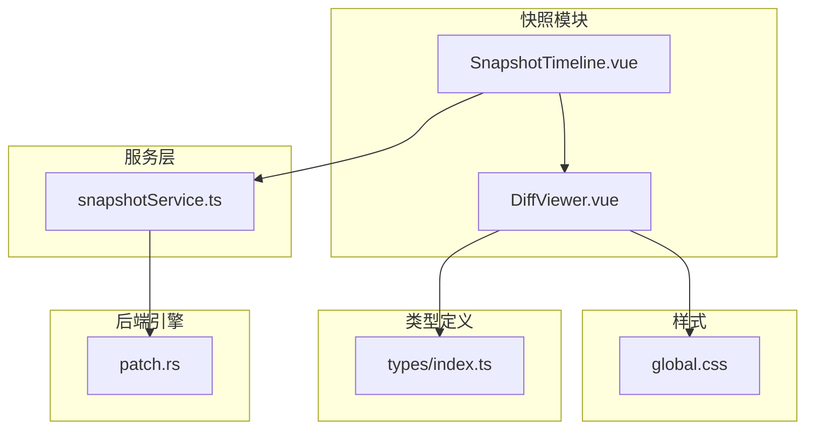
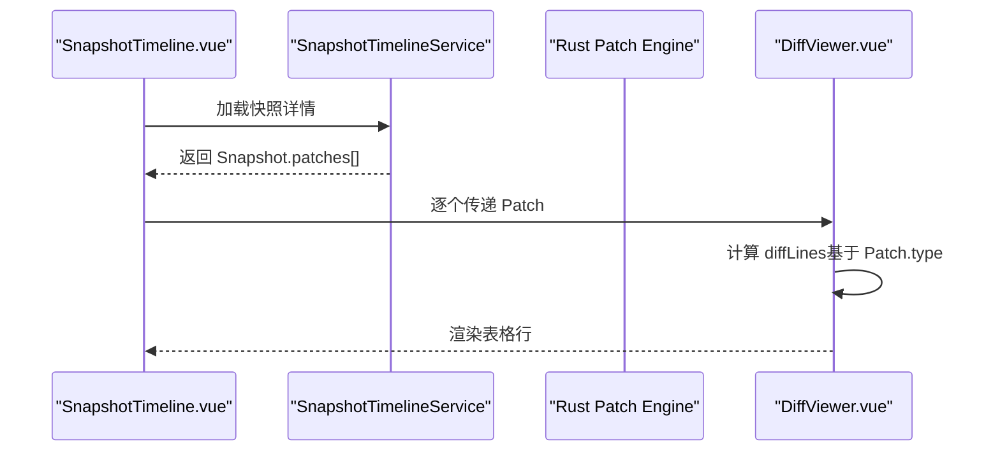
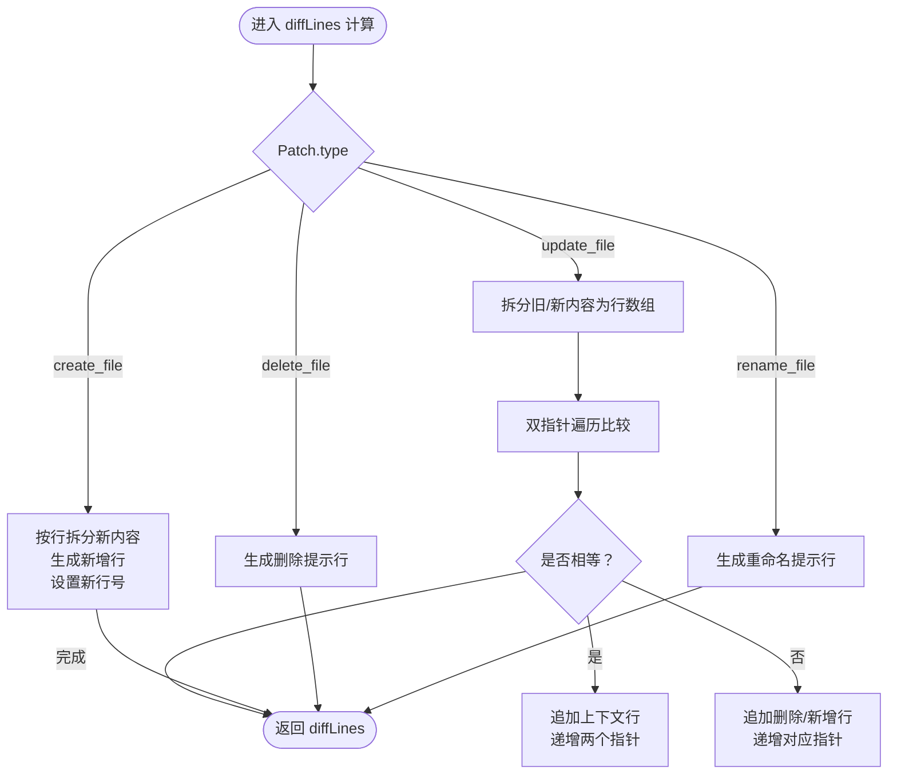
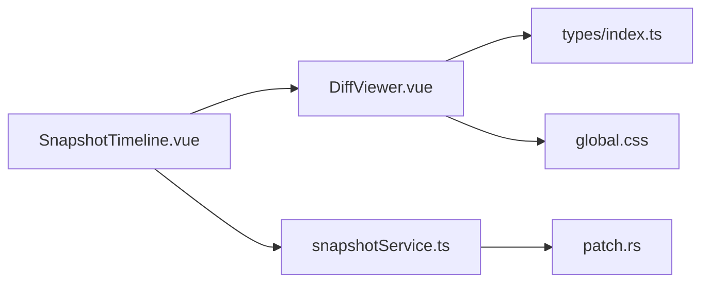

# 差异查看器组件

<cite>
**本文引用的文件列表**
- [DiffViewer.vue](file://src/components/snapshot/DiffViewer.vue)
- [SnapshotTimeline.vue](file://src/components/snapshot/SnapshotTimeline.vue)
- [snapshotService.ts](file://src/services/snapshotService.ts)
- [index.ts](file://src/types/index.ts)
- [patch.rs](file://src-tauri/src/core/snapshot_engine/patch.rs)
- [global.css](file://src/assets/global.css)
- [timeline.ts](file://src/utils/timeline.ts)
</cite>

## 目录
1. [简介](#简介)
2. [项目结构](#项目结构)
3. [核心组件](#核心组件)
4. [架构总览](#架构总览)
5. [详细组件分析](#详细组件分析)
6. [依赖关系分析](#依赖关系分析)
7. [性能考量](#性能考量)
8. [故障排查指南](#故障排查指南)
9. [结论](#结论)
10. [附录](#附录)

## 简介
本文件面向 DiffViewer 差异查看器组件，系统性阐述其在快照差异展示中的职责与实现：包括差异计算算法、差异类型识别、差异高亮渲染、上下文显示；并覆盖布局设计、滚动同步、行号显示、折叠展开功能；解释差异标记的颜色编码与字体样式；说明交互机制、选择复制、搜索定位能力；最后给出差异数据格式化、性能优化与内存管理建议，并提供使用指南、样式定制方法与功能扩展建议。

## 项目结构
DiffViewer 位于快照模块内，作为 SnapshotTimeline 的子组件之一，负责以表格形式渲染单个 Patch 的差异行，支持创建、删除、更新、重命名四类变更的可视化呈现。

图表来源
- [SnapshotTimeline.vue:420-425](file://src/components/snapshot/SnapshotTimeline.vue#L420-L425)
- [DiffViewer.vue:1-265](file://src/components/snapshot/DiffViewer.vue#L1-L265)
- [snapshotService.ts:1-248](file://src/services/snapshotService.ts#L1-L248)
- [index.ts:224-251](file://src/types/index.ts#L224-L251)
- [patch.rs:5-25](file://src-tauri/src/core/snapshot_engine/patch.rs#L5-L25)
- [global.css:1-323](file://src/assets/global/css#L1-L323)

章节来源
- [SnapshotTimeline.vue:420-425](file://src/components/snapshot/SnapshotTimeline.vue#L420-L425)
- [DiffViewer.vue:1-265](file://src/components/snapshot/DiffViewer.vue#L1-L265)
- [snapshotService.ts:1-248](file://src/services/snapshotService.ts#L1-L248)
- [index.ts:224-251](file://src/types/index.ts#L224-L251)
- [patch.rs:5-25](file://src-tauri/src/core/snapshot_engine/patch.rs#L5-L25)
- [global.css:1-323](file://src/assets/global.css#L1-L323)

## 核心组件
- DiffViewer：接收单个 Patch，将其转换为差异行数组，按行渲染为表格，支持四种差异类型（新增、删除、上下文、空行），并提供标题与统计信息。
- SnapshotTimeline：负责加载快照树、汇总、详情，以及在详情弹窗中批量渲染多个 DiffViewer。
- 类型系统：统一定义 Patch、TextDiff、DiffHunk、DiffLine 等结构，确保前后端一致的数据契约。
- 后端引擎：Rust 实现的 Patch 结构与差异模型，用于生成与应用补丁。

章节来源
- [DiffViewer.vue:5-89](file://src/components/snapshot/DiffViewer.vue#L5-L89)
- [SnapshotTimeline.vue:420-425](file://src/components/snapshot/SnapshotTimeline.vue#L420-L425)
- [index.ts:224-251](file://src/types/index.ts#L224-L251)
- [patch.rs:5-47](file://src-tauri/src/core/snapshot_engine/patch.rs#L5-L47)

## 架构总览
DiffViewer 的数据流从 SnapshotTimeline 的快照详情传入，经 DiffViewer 计算为 diffLines，再由模板渲染为表格。样式通过全局 CSS 变量与组件 scoped 样式组合，实现主题适配与视觉一致性。

图表来源
- [SnapshotTimeline.vue:420-425](file://src/components/snapshot/SnapshotTimeline.vue#L420-L425)
- [snapshotService.ts:48-60](file://src/services/snapshotService.ts#L48-L60)
- [DiffViewer.vue:16-89](file://src/components/snapshot/DiffViewer.vue#L16-L89)
- [patch.rs:5-25](file://src-tauri/src/core/snapshot_engine/patch.rs#L5-L25)

## 详细组件分析

### DiffViewer 组件
- 输入与状态
  - 接收属性：patch（类型为 Patch）
  - 计算属性：diffLines（根据 Patch.type 生成差异行数组）、stats（统计新增/删除行数）、patchTitle（标题文案）
- 差异计算算法
  - create_file：直接将新内容按行渲染为“新增”行，行号来自新内容索引
  - delete_file：渲染一条“删除”提示行
  - update_file：对旧内容与新内容进行逐行比对，生成上下文、新增、删除三类行
  - rename_file：渲染一条重命名提示行
- 表格渲染
  - 表头：标题与统计（+新增/-删除）
  - 表体：每行包含旧行号、新行号、前缀符号（+/-/空格）、内容
  - 样式：不同差异类型对应不同的背景色与前缀颜色
- 性能与复杂度
  - update_file 场景采用双指针遍历，时间复杂度 O(max(M,N))，空间复杂度 O(M+N)，其中 M、N 为旧/新内容行数
  - 其他场景为 O(N) 或常数级

图表来源
- [DiffViewer.vue:16-89](file://src/components/snapshot/DiffViewer.vue#L16-L89)

章节来源
- [DiffViewer.vue:5-110](file://src/components/snapshot/DiffViewer.vue#L5-L110)
- [DiffViewer.vue:113-264](file://src/components/snapshot/DiffViewer.vue#L113-L264)

### 布局设计与交互
- 布局
  - 容器：带边框与圆角的玻璃面板，顶部为标题与统计，中部为可滚动表格
  - 表格：紧凑等宽字体，行高适中，行号列右对齐，前缀列窄且居中
- 滚动同步
  - 当前实现为单组件内纵向滚动，未见跨面板滚动同步逻辑
- 行号显示
  - 旧行号仅在非新增行显示，新行号仅在非删除行显示，避免重复与空白
- 折叠展开
  - 该组件不提供行级折叠/展开；折叠展开由上层 SnapshotTimeline 控制（节点展开/收起）

章节来源
- [DiffViewer.vue:113-144](file://src/components/snapshot/DiffViewer.vue#L113-L144)
- [DiffViewer.vue:147-264](file://src/components/snapshot/DiffViewer.vue#L147-L264)
- [SnapshotTimeline.vue:256-358](file://src/components/snapshot/SnapshotTimeline.vue#L256-L358)

### 差异标记与样式
- 差异类型
  - 上下文（context）：透明背景，前缀与内容弱化
  - 新增（added）：浅绿色背景，前缀与内容强调
  - 删除（removed）：浅红色背景，前缀与内容强调
  - 空行（empty）：用于占位，背景与容器一致
- 颜色编码
  - 使用 CSS 变量（如 --accent-green、--accent-red、--glass-bg）实现主题适配
- 字体样式
  - 等宽字体，字号与行高在组件与全局样式中统一配置

章节来源
- [DiffViewer.vue:227-263](file://src/components/snapshot/DiffViewer.vue#L227-L263)
- [global.css:7-114](file://src/assets/global.css#L7-L114)

### 交互机制与可用性
- 选择复制
  - 行内容为纯文本，用户可选中复制；组件未内置快捷键或复制按钮
- 搜索定位
  - 组件未内置搜索输入与定位逻辑；可通过外部工具或上层界面集成
- 事件与通知
  - 上层 SnapshotTimeline 在详情弹窗中渲染多个 DiffViewer，未见组件内部事件派发

章节来源
- [SnapshotTimeline.vue:420-425](file://src/components/snapshot/SnapshotTimeline.vue#L420-L425)

### 数据格式化与类型系统
- Patch 类型
  - create_file/delete_file/update_file/rename_file 四种类型，携带路径、内容或旧/新内容
- TextDiff/DiffHunk/DiffLine
  - Rust 侧定义了更细粒度的差异结构，便于生成与应用差异
- 前后端一致性
  - 前端类型与后端枚举保持语义一致，保证序列化/反序列化稳定

章节来源
- [index.ts:224-251](file://src/types/index.ts#L224-L251)
- [patch.rs:5-47](file://src-tauri/src/core/snapshot_engine/patch.rs#L5-L47)

### 与服务层的集成
- SnapshotTimelineService 提供加载快照详情的能力，DiffViewer 仅消费数据，不直接发起网络请求
- 服务层负责缓存与聚合，组件层专注渲染

章节来源
- [snapshotService.ts:48-60](file://src/services/snapshotService.ts#L48-L60)
- [SnapshotTimeline.vue:62-73](file://src/components/snapshot/SnapshotTimeline.vue#L62-L73)

## 依赖关系分析
- 组件耦合
  - DiffViewer 与 SnapshotTimeline 通过 props 传递 Patch 列表，低耦合
  - DiffViewer 依赖类型系统（types/index.ts），不依赖具体后端实现
- 外部依赖
  - Vue 响应式与模板渲染
  - 全局 CSS 变量（主题系统）
- 潜在循环依赖
  - 未发现循环依赖；组件间为单向数据流

图表来源
- [SnapshotTimeline.vue:420-425](file://src/components/snapshot/SnapshotTimeline.vue#L420-L425)
- [DiffViewer.vue:1-265](file://src/components/snapshot/DiffViewer.vue#L1-L265)
- [index.ts:224-251](file://src/types/index.ts#L224-L251)
- [snapshotService.ts:1-248](file://src/services/snapshotService.ts#L1-L248)
- [patch.rs:5-25](file://src-tauri/src/core/snapshot_engine/patch.rs#L5-L25)
- [global.css:1-323](file://src/assets/global.css#L1-L323)

章节来源
- [SnapshotTimeline.vue:420-425](file://src/components/snapshot/SnapshotTimeline.vue#L420-L425)
- [DiffViewer.vue:1-265](file://src/components/snapshot/DiffViewer.vue#L1-L265)
- [index.ts:224-251](file://src/types/index.ts#L224-L251)
- [snapshotService.ts:1-248](file://src/services/snapshotService.ts#L1-L248)
- [patch.rs:5-25](file://src-tauri/src/core/snapshot_engine/patch.rs#L5-L25)
- [global.css:1-323](file://src/assets/global.css#L1-L323)

## 性能考量
- 时间复杂度
  - update_file 场景为 O(M+N)，适合中等规模文件；大文件建议分页或限制显示行数
- 内存占用
  - diffLines 数组长度与差异行数量成正比；长文件差异可能导致 DOM 行数较多
- 渲染优化
  - 使用 v-for 的 key 为索引，保证列表更新效率
  - 表格使用 white-space: pre，避免多余换行导致的重排
- 主题与样式
  - 使用 CSS 变量减少重绘成本，主题切换时仅需修改变量值

章节来源
- [DiffViewer.vue:16-89](file://src/components/snapshot/DiffViewer.vue#L16-L89)
- [DiffViewer.vue:185-191](file://src/components/snapshot/DiffViewer.vue#L185-L191)

## 故障排查指南
- 无差异数据
  - 检查上层是否正确传入 Patch；确认 SnapshotTimeline 是否成功加载详情
- 显示异常
  - 检查 CSS 变量是否生效；确认等宽字体是否正确加载
- 性能问题
  - 大文件差异导致滚动卡顿：考虑分页或虚拟滚动（见扩展建议）
- 类型不匹配
  - 确认前端 Patch 类型与后端枚举一致；检查序列化字段名

章节来源
- [SnapshotTimeline.vue:62-73](file://src/components/snapshot/SnapshotTimeline.vue#L62-L73)
- [DiffViewer.vue:113-144](file://src/components/snapshot/DiffViewer.vue#L113-L144)
- [index.ts:224-251](file://src/types/index.ts#L224-L251)
- [patch.rs:5-25](file://src-tauri/src/core/snapshot_engine/patch.rs#L5-L25)

## 结论
DiffViewer 以简洁高效的算法实现了四种差异类型的可视化，配合全局主题系统与紧凑的表格布局，满足快照差异浏览的基本需求。若需进一步提升体验，可在现有基础上增加搜索定位、行号跳转、折叠展开、虚拟滚动等能力。

## 附录

### 使用指南
- 在 SnapshotTimeline 的详情弹窗中，将 Snapshot.patches 逐个传给 DiffViewer 即可渲染差异
- 如需自定义标题或统计，可扩展 patchTitle 与 stats 的计算逻辑

章节来源
- [SnapshotTimeline.vue:420-425](file://src/components/snapshot/SnapshotTimeline.vue#L420-L425)
- [DiffViewer.vue:91-110](file://src/components/snapshot/DiffViewer.vue#L91-L110)

### 样式定制方法
- 主题变量
  - 通过修改 CSS 变量（如 --accent-green、--accent-red、--glass-bg）实现主题切换
- 组件样式
  - 在 DiffViewer 的 scoped 样式中调整字体大小、行高、间距与颜色
- 全局样式
  - 等宽字体与滚动条样式由 global.css 提供，可按需调整

章节来源
- [global.css:7-114](file://src/assets/global.css#L7-L114)
- [DiffViewer.vue:147-264](file://src/components/snapshot/DiffViewer.vue#L147-L264)

### 功能扩展建议
- 搜索与定位
  - 在组件内添加搜索框，支持按关键字高亮并滚动到匹配行
- 折叠/展开
  - 支持按 hunk 或按文件折叠/展开，减少长差异的视觉噪音
- 虚拟滚动
  - 对超长差异采用虚拟滚动，限制渲染行数，提升性能
- 交互增强
  - 支持点击行号跳转、复制行内容、一键复制整个差异块
- 上下文控制
  - 允许用户设置上下文行数，平衡差异体积与上下文完整性

[本节为概念性建议，不直接分析具体文件]