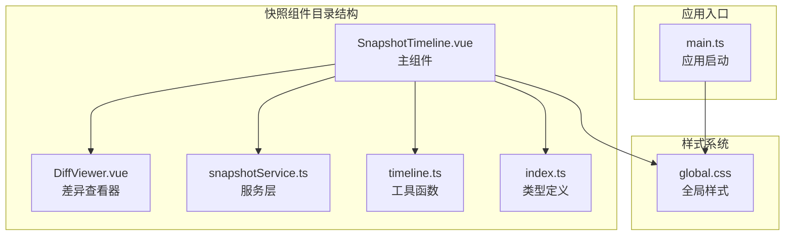
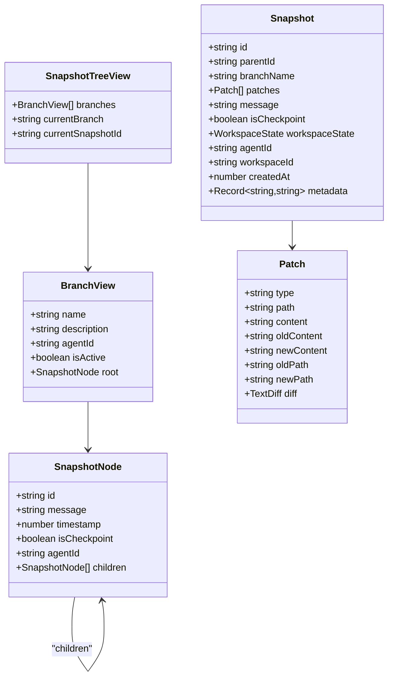
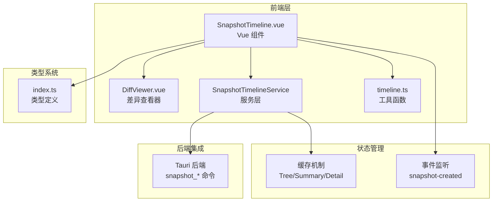
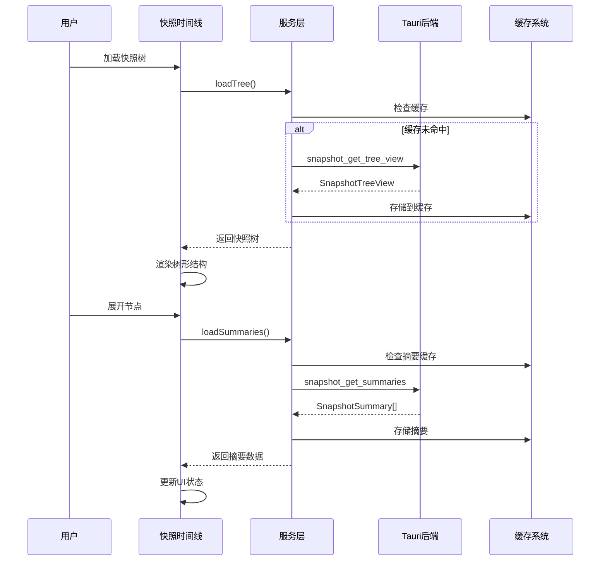
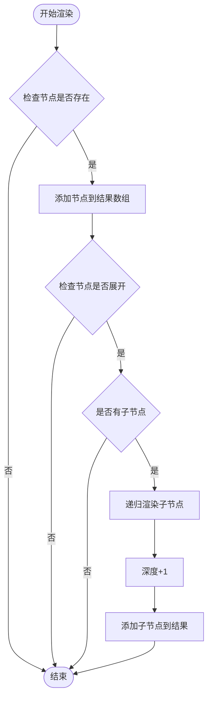
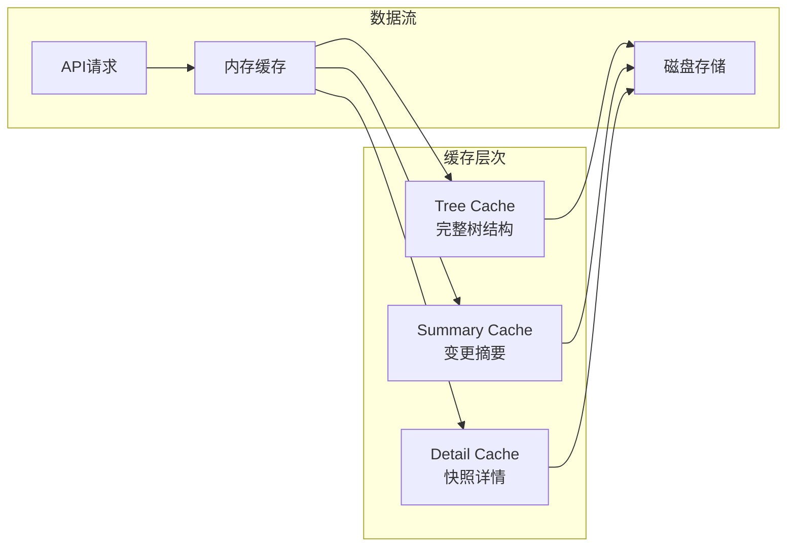
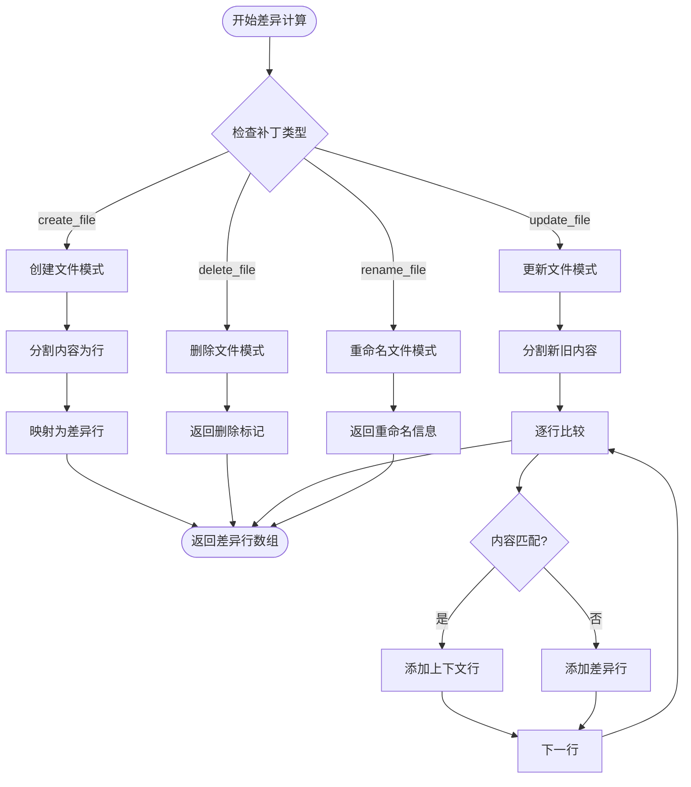
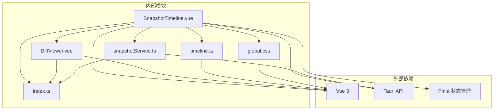
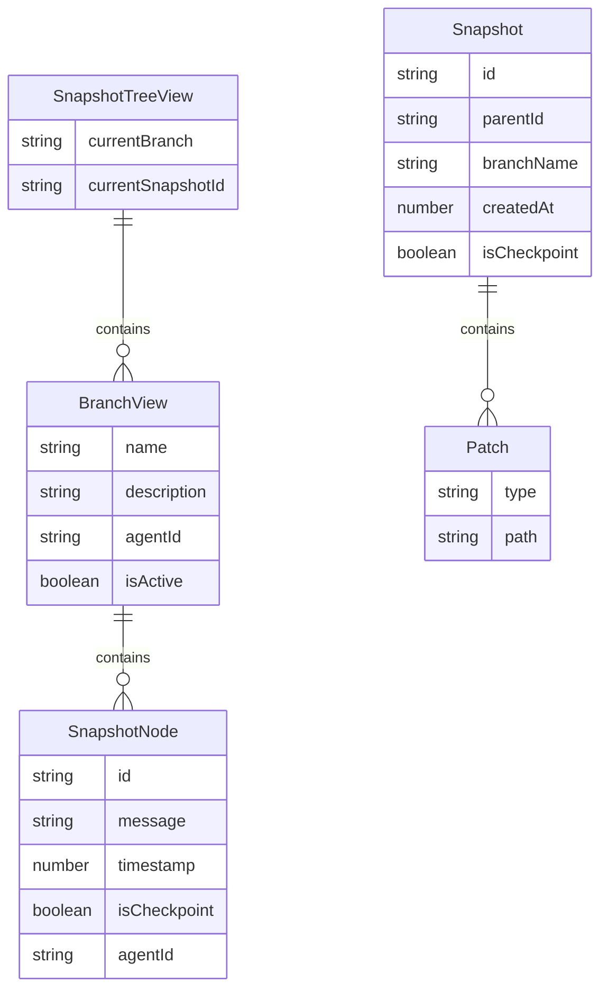

# 快照时间线组件

<cite>
**本文档引用的文件**
- [SnapshotTimeline.vue](file://src/components/snapshot/SnapshotTimeline.vue)
- [snapshotService.ts](file://src/services/snapshotService.ts)
- [index.ts](file://src/types/index.ts)
- [timeline.ts](file://src/utils/timeline.ts)
- [DiffViewer.vue](file://src/components/snapshot/DiffViewer.vue)
- [global.css](file://src/assets/global.css)
- [main.ts](file://src/main.ts)
</cite>

## 目录
1. [简介](#简介)
2. [项目结构](#项目结构)
3. [核心组件](#核心组件)
4. [架构概览](#架构概览)
5. [详细组件分析](#详细组件分析)
6. [依赖关系分析](#依赖关系分析)
7. [性能考虑](#性能考虑)
8. [故障排除指南](#故障排除指南)
9. [结论](#结论)
10. [附录](#附录)

## 简介

SnapshotTimeline 是 JarvisAgent 项目中的核心快照管理组件，用于可视化展示 Agent 在会话过程中创建的文件变更历史。该组件提供了完整的快照浏览、对比、回滚和分支管理功能，支持实时更新和丰富的交互体验。

该组件采用 Vue 3 Composition API 构建，结合 Tauri 后端服务，实现了高性能的快照时间线渲染和管理。通过毛玻璃设计风格，为用户提供了现代化且直观的快照浏览界面。

## 项目结构

SnapshotTimeline 组件位于 `src/components/snapshot/` 目录下，主要包含以下文件：



**图表来源**
- [SnapshotTimeline.vue:1-854](file://src/components/snapshot/SnapshotTimeline.vue#L1-L854)
- [snapshotService.ts:1-248](file://src/services/snapshotService.ts#L1-L248)
- [timeline.ts:1-41](file://src/utils/timeline.ts#L1-L41)

**章节来源**
- [SnapshotTimeline.vue:1-854](file://src/components/snapshot/SnapshotTimeline.vue#L1-L854)
- [snapshotService.ts:1-248](file://src/services/snapshotService.ts#L1-L248)

## 核心组件

### 主要功能特性

SnapshotTimeline 组件提供了以下核心功能：

1. **快照树形展示**：以树形结构展示快照的父子关系
2. **分支管理**：支持多分支快照的切换和管理
3. **实时更新**：监听快照创建事件，自动刷新界面
4. **快照详情**：提供详细的快照信息和差异对比
5. **回滚操作**：支持安全的快照回滚功能
6. **分支创建**：基于指定快照创建新的分支

### 数据模型

组件使用以下核心数据结构：



**图表来源**
- [index.ts:292-313](file://src/types/index.ts#L292-L313)
- [index.ts:259-271](file://src/types/index.ts#L259-L271)
- [index.ts:224-233](file://src/types/index.ts#L224-L233)

**章节来源**
- [index.ts:224-313](file://src/types/index.ts#L224-L313)

## 架构概览

### 整体架构设计



**图表来源**
- [SnapshotTimeline.vue:1-200](file://src/components/snapshot/SnapshotTimeline.vue#L1-L200)
- [snapshotService.ts:14-229](file://src/services/snapshotService.ts#L14-L229)

### 组件交互流程



**图表来源**
- [SnapshotTimeline.vue:40-60](file://src/components/snapshot/SnapshotTimeline.vue#L40-L60)
- [snapshotService.ts:24-46](file://src/services/snapshotService.ts#L24-L46)

**章节来源**
- [SnapshotTimeline.vue:1-200](file://src/components/snapshot/SnapshotTimeline.vue#L1-L200)
- [snapshotService.ts:14-127](file://src/services/snapshotService.ts#L14-L127)

## 详细组件分析

### SnapshotTimeline 主组件

#### 核心状态管理

组件使用 Vue 3 的响应式系统管理核心状态：

| 状态属性 | 类型 | 描述 | 默认值 |
|---------|------|------|--------|
| tree | SnapshotTreeView \| null | 快照树视图数据 | null |
| summaries | Map<string, SnapshotSummary> | 快照摘要缓存 | new Map() |
| selectedSnapshot | Snapshot \| null | 当前选中的快照 | null |
| loading | boolean | 加载状态 | false |
| error | string \| null | 错误信息 | null |
| expandedNodes | Set<string> | 展开的节点ID集合 | new Set() |
| rollbackConfirm | {snapshotId: string, message: string} \| null | 回滚确认对话框状态 | null |

#### 渲染算法实现

组件采用递归渲染算法处理树形结构：



**图表来源**
- [SnapshotTimeline.vue:140-154](file://src/components/snapshot/SnapshotTimeline.vue#L140-L154)

#### 交互功能实现

组件支持多种用户交互：

1. **节点展开/折叠**：通过 `toggleNode()` 方法控制节点显示状态
2. **快照详情查看**：通过 `loadSnapshotDetail()` 获取详细信息
3. **分支切换**：通过 `switchBranch()` 切换活动分支
4. **回滚操作**：通过 `handleRollback()` 执行安全回滚
5. **分支创建**：通过 `createNewBranch()` 基于快照创建新分支

**章节来源**
- [SnapshotTimeline.vue:75-138](file://src/components/snapshot/SnapshotTimeline.vue#L75-L138)

### SnapshotTimelineService 服务层

#### 缓存策略

服务层实现了三层缓存机制：

1. **树形缓存**：缓存完整的快照树结构
2. **摘要缓存**：缓存快照的变更摘要信息
3. **详情缓存**：缓存单个快照的完整详情



**图表来源**
- [snapshotService.ts:14-22](file://src/services/snapshotService.ts#L14-L22)

#### 异步操作管理

服务层提供了完整的异步操作封装：

| 方法名 | 功能描述 | 参数 | 返回值 |
|-------|----------|------|--------|
| loadTree | 加载快照树 | sessionId | Promise<SnapshotTreeView> |
| loadSummaries | 批量加载摘要 | ids: string[] | Promise<SnapshotSummary[]> |
| loadDetail | 加载快照详情 | id: string | Promise<Snapshot\|null> |
| createSnapshot | 创建新快照 | patches, message, agentId | Promise<Snapshot> |
| createBranch | 创建分支 | branchName, fromSnapshotId | Promise<void> |
| switchBranch | 切换分支 | branchName | Promise<void> |
| rollback | 执行回滚 | snapshotId, targetDir | Promise<void> |

**章节来源**
- [snapshotService.ts:24-121](file://src/services/snapshotService.ts#L24-L121)

### DiffViewer 差异查看器

#### 差异算法实现

DiffViewer 使用线性扫描算法处理文件差异：



**图表来源**
- [DiffViewer.vue:16-89](file://src/components/snapshot/DiffViewer.vue#L16-L89)

#### 差异统计功能

组件提供实时的差异统计信息：

- **新增行数**：统计添加的代码行数
- **删除行数**：统计删除的代码行数  
- **文件操作类型**：根据操作类型显示不同图标

**章节来源**
- [DiffViewer.vue:91-110](file://src/components/snapshot/DiffViewer.vue#L91-L110)

### 工具函数模块

#### 时间格式化

工具函数提供了人性化的时间显示：

| 时间范围 | 显示格式 | 示例 |
|---------|----------|------|
| 小于1分钟 | "刚刚" | 刚刚 |
| 1-59分钟 | "X分钟前" | 5分钟前 |
| 1-23小时 | "X小时前" | 2小时前 |
| 跨日显示 | "月 日 时:分" | 12月15日 14:30 |

#### 文件操作图标

支持多种文件操作类型的可视化表示：

| 操作类型 | 图标 | 用途 |
|---------|------|------|
| edit/update | ✏️ | 文件编辑 |
| write | 📝 | 内容写入 |
| create | 📄 | 文件创建 |
| delete | 🗑️ | 文件删除 |
| rename | 📛 | 文件重命名 |
| 其他 | 📁 | 未知操作 |

**章节来源**
- [timeline.ts:1-41](file://src/utils/timeline.ts#L1-L41)

## 依赖关系分析

### 组件依赖图



**图表来源**
- [SnapshotTimeline.vue:1-16](file://src/components/snapshot/SnapshotTimeline.vue#L1-L16)
- [DiffViewer.vue:1-7](file://src/components/snapshot/DiffViewer.vue#L1-L7)
- [snapshotService.ts:1-12](file://src/services/snapshotService.ts#L1-L12)

### 类型依赖关系



**图表来源**
- [index.ts:309-313](file://src/types/index.ts#L309-L313)
- [index.ts:292-307](file://src/types/index.ts#L292-L307)
- [index.ts:259-271](file://src/types/index.ts#L259-L271)
- [index.ts:224-233](file://src/types/index.ts#L224-L233)

**章节来源**
- [index.ts:224-313](file://src/types/index.ts#L224-L313)

## 性能考虑

### 缓存优化策略

1. **智能缓存失效**：当检测到新的快照创建时，自动清理相关缓存
2. **批量数据加载**：使用 `collectAllIdsFromTree()` 收集所有需要的快照ID，一次性加载摘要信息
3. **增量更新**：只更新发生变化的数据，避免全量重新渲染

### 渲染性能优化

1. **虚拟滚动**：对于大量快照的情况，可以考虑实现虚拟滚动以提升渲染性能
2. **懒加载**：仅在用户展开节点时才加载对应的快照详情
3. **防抖处理**：对频繁的用户操作进行防抖处理，减少不必要的重新渲染

### 内存管理

1. **缓存大小限制**：可以考虑实现 LRU 缓存策略，限制缓存数量
2. **垃圾回收**：及时清理不再使用的快照详情缓存
3. **事件监听清理**：组件卸载时自动清理事件监听器

## 故障排除指南

### 常见问题及解决方案

#### 快照加载失败

**症状**：页面显示错误信息，无法加载快照数据

**可能原因**：
1. Tauri 后端服务未启动
2. 会话ID无效或过期
3. 网络连接问题

**解决步骤**：
1. 检查后端服务状态
2. 验证会话ID的有效性
3. 重新初始化服务实例

#### 回滚操作失败

**症状**：回滚按钮点击后无响应或显示错误

**可能原因**：
1. 工作区路径未正确设置
2. 权限不足
3. 目标快照不存在

**解决步骤**：
1. 确保工作区路径配置正确
2. 检查用户权限设置
3. 验证快照ID的有效性

#### 性能问题

**症状**：大量快照时界面卡顿

**优化建议**：
1. 实现虚拟滚动
2. 增加缓存大小限制
3. 优化渲染算法

**章节来源**
- [SnapshotTimeline.vue:54-59](file://src/components/snapshot/SnapshotTimeline.vue#L54-L59)
- [SnapshotTimeline.vue:96-111](file://src/components/snapshot/SnapshotTimeline.vue#L96-L111)

## 结论

SnapshotTimeline 组件是一个功能完整、架构清晰的快照管理解决方案。它成功地将复杂的快照数据转换为直观易用的可视化界面，为用户提供了一站式的快照浏览、管理和操作能力。

组件的主要优势包括：

1. **现代化的设计**：采用毛玻璃设计风格，提供优秀的视觉体验
2. **完整的功能**：涵盖快照浏览、对比、回滚、分支管理等核心功能
3. **良好的性能**：通过多层缓存和智能加载策略优化用户体验
4. **可扩展性**：清晰的架构设计便于后续功能扩展

未来可以考虑的改进方向：
- 实现虚拟滚动以支持超大数据集
- 增加快照筛选和搜索功能
- 提供更多的自定义选项和主题支持

## 附录

### 使用指南

#### 基本使用

```vue
<template>
  <SnapshotTimeline 
    :sessionId="currentSessionId"
    :workspacePath="workspacePath"
  />
</template>
```

#### 样式定制

组件使用 CSS 变量实现主题定制：

| CSS 变量 | 用途 | 默认值 |
|---------|------|--------|
| --glass-bg | 毛玻璃背景色 | rgba(255, 255, 255, 0.45) |
| --accent-blue | 强调蓝色 | #3b82f6 |
| --accent-green | 强调绿色 | #10b981 |
| --accent-red | 强调红色 | #ef4444 |
| --text-main | 主要文本色 | #0f172a |
| --text-muted | 次要文本色 | #64748b |

#### 功能扩展建议

1. **快照筛选**：添加按时间、类型、Agent 等条件的筛选功能
2. **批量操作**：支持多选快照的批量回滚或删除
3. **导出功能**：提供快照数据的导出和导入功能
4. **通知系统**：集成系统通知，及时提醒快照状态变化