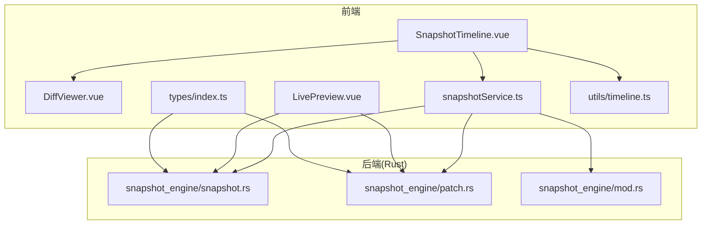
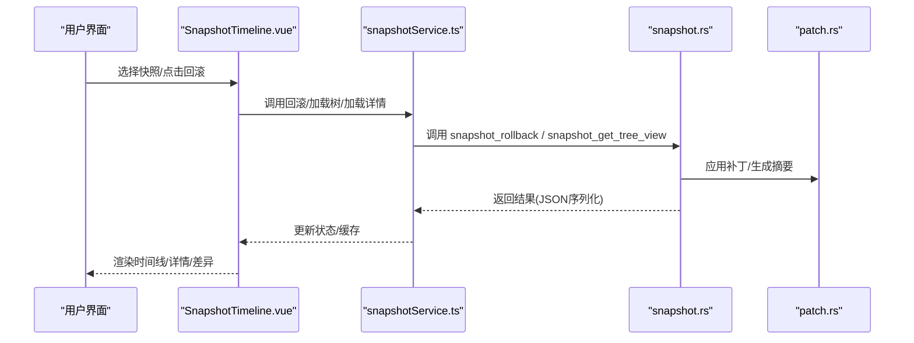
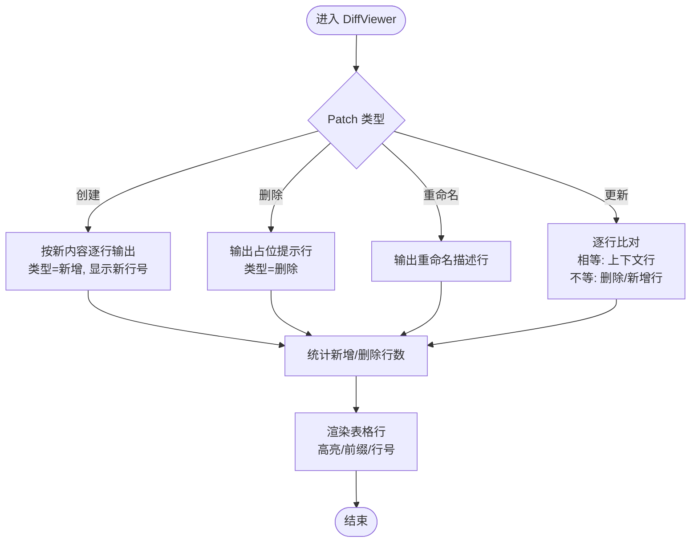
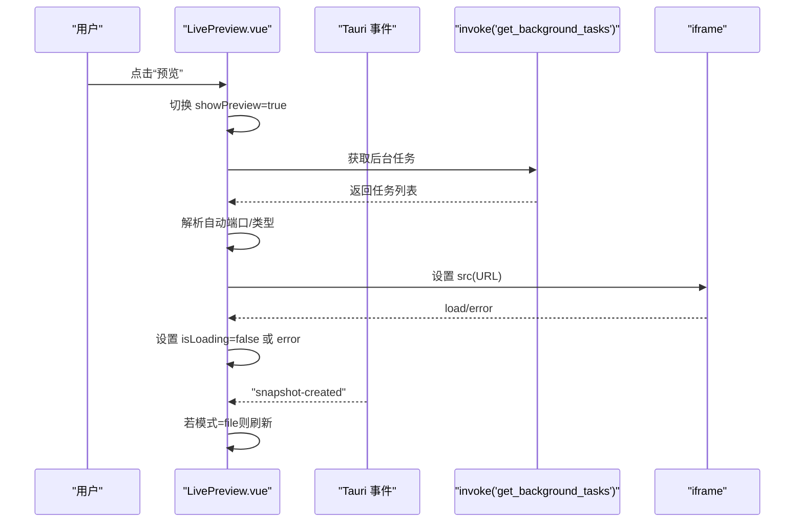
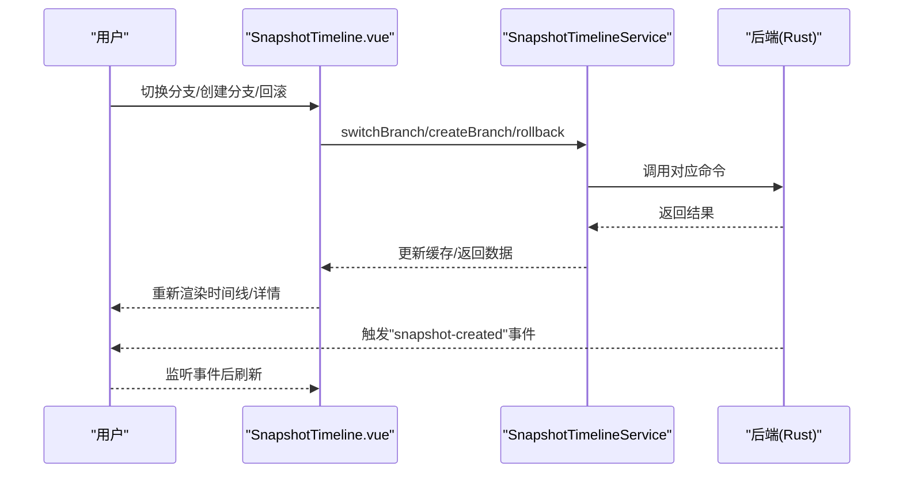
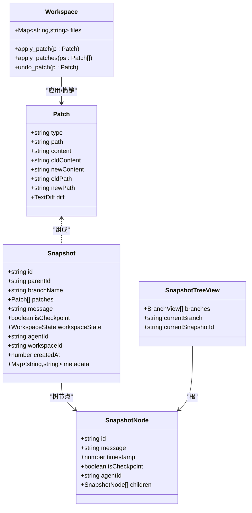
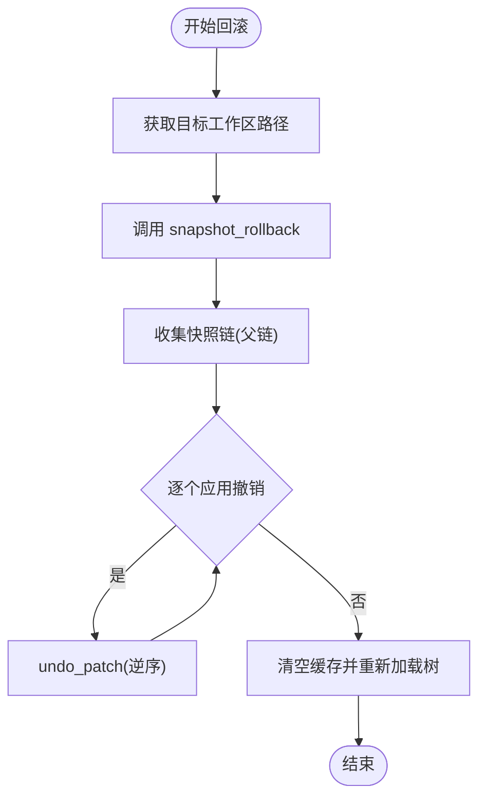
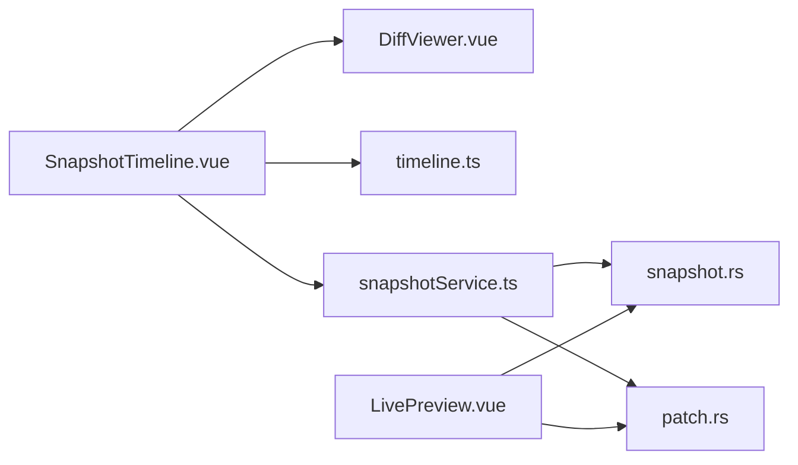

# 快照组件

<cite>
**本文引用的文件**
- [DiffViewer.vue](file://src/components/snapshot/DiffViewer.vue)
- [LivePreview.vue](file://src/components/snapshot/LivePreview.vue)
- [SnapshotTimeline.vue](file://src/components/snapshot/SnapshotTimeline.vue)
- [snapshotService.ts](file://src/services/snapshotService.ts)
- [index.ts](file://src/types/index.ts)
- [timeline.ts](file://src/utils/timeline.ts)
- [snapshot.rs](file://src-tauri/src/core/snapshot_engine/snapshot.rs)
- [patch.rs](file://src-tauri/src/core/snapshot_engine/patch.rs)
- [mod.rs](file://src-tauri/src/core/snapshot_engine/mod.rs)
</cite>

## 目录
1. [简介](#简介)
2. [项目结构](#项目结构)
3. [核心组件](#核心组件)
4. [架构总览](#架构总览)
5. [详细组件分析](#详细组件分析)
6. [依赖关系分析](#依赖关系分析)
7. [性能考量](#性能考量)
8. [故障排查指南](#故障排查指南)
9. [结论](#结论)
10. [附录](#附录)

## 简介
本文件面向 JarvisAgent 的快照组件，系统性解析以下三个核心模块：DiffViewer 差异查看器、LivePreview 实时预览、SnapshotTimeline 快照时间线。内容涵盖：
- 文件差异对比算法与高亮显示策略
- 实时预览的渲染、增量更新与状态管理
- 快照时间线的树形展示、节点交互与快照切换
- 快照数据的序列化、版本控制与回滚机制
- 使用指南、性能优化与扩展开发建议

## 项目结构
快照相关代码主要分布在前端组件层与后端 Rust 引擎层：
- 前端组件：DiffViewer、LivePreview、SnapshotTimeline
- 前端服务：snapshotService 提供对后端命令的封装与缓存
- 类型定义：统一的 Patch、Snapshot、SnapshotTreeView 等类型
- 后端引擎：Rust 实现的快照树、补丁应用与回滚逻辑

图表来源
- [SnapshotTimeline.vue:1-854](file://src/components/snapshot/SnapshotTimeline.vue#L1-L854)
- [DiffViewer.vue:1-265](file://src/components/snapshot/DiffViewer.vue#L1-L265)
- [LivePreview.vue:1-430](file://src/components/snapshot/LivePreview.vue#L1-L430)
- [snapshotService.ts:1-248](file://src/services/snapshotService.ts#L1-L248)
- [index.ts:224-313](file://src/types/index.ts#L224-L313)
- [timeline.ts:1-42](file://src/utils/timeline.ts#L1-L42)
- [snapshot.rs:1-425](file://src-tauri/src/core/snapshot_engine/snapshot.rs#L1-L425)
- [patch.rs:1-124](file://src-tauri/src/core/snapshot_engine/patch.rs#L1-L124)
- [mod.rs:1-14](file://src-tauri/src/core/snapshot_engine/mod.rs#L1-L14)

章节来源
- [SnapshotTimeline.vue:1-854](file://src/components/snapshot/SnapshotTimeline.vue#L1-L854)
- [DiffViewer.vue:1-265](file://src/components/snapshot/DiffViewer.vue#L1-L265)
- [LivePreview.vue:1-430](file://src/components/snapshot/LivePreview.vue#L1-L430)
- [snapshotService.ts:1-248](file://src/services/snapshotService.ts#L1-L248)
- [index.ts:224-313](file://src/types/index.ts#L224-L313)
- [timeline.ts:1-42](file://src/utils/timeline.ts#L1-L42)
- [snapshot.rs:1-425](file://src-tauri/src/core/snapshot_engine/snapshot.rs#L1-L425)
- [patch.rs:1-124](file://src-tauri/src/core/snapshot_engine/patch.rs#L1-L124)
- [mod.rs:1-14](file://src-tauri/src/core/snapshot_engine/mod.rs#L1-L14)

## 核心组件
- DiffViewer：将 Patch 序列转换为可读的差异行，支持创建、删除、更新、重命名四类操作，并以上下文/新增/删除三色高亮展示。
- LivePreview：在本地开发环境或静态 HTML 中预览当前工作区变更，支持自动检测、Dev Server 与文件模式，具备刷新与错误提示。
- SnapshotTimeline：以树形视图展示快照分支与节点，支持展开/折叠、查看详情、回滚、创建分支等操作；通过服务层调用后端命令完成版本控制。

章节来源
- [DiffViewer.vue:1-265](file://src/components/snapshot/DiffViewer.vue#L1-L265)
- [LivePreview.vue:1-430](file://src/components/snapshot/LivePreview.vue#L1-L430)
- [SnapshotTimeline.vue:1-854](file://src/components/snapshot/SnapshotTimeline.vue#L1-L854)
- [snapshotService.ts:1-248](file://src/services/snapshotService.ts#L1-L248)

## 架构总览
前端组件通过 snapshotService 调用后端 Tauri 命令，后端基于 Rust 的快照引擎执行具体操作（创建快照、构建树、回滚、分支切换等），并在需要时返回序列化的数据结构给前端渲染。

图表来源
- [SnapshotTimeline.vue:83-123](file://src/components/snapshot/SnapshotTimeline.vue#L83-L123)
- [snapshotService.ts:104-121](file://src/services/snapshotService.ts#L104-L121)
- [snapshot.rs:180-256](file://src-tauri/src/core/snapshot_engine/snapshot.rs#L180-L256)
- [patch.rs:70-105](file://src-tauri/src/core/snapshot_engine/patch.rs#L70-L105)

## 详细组件分析

### DiffViewer 组件
- 设计要点
  - 接收单个 Patch，根据类型生成差异行集合，包含行号映射与类型标识。
  - 支持四种 Patch 类型：创建、删除、更新、重命名；更新类型采用逐行比对生成上下文/新增/删除三类行。
  - 计算统计信息（新增/删除行数），标题根据类型动态生成。
- 数据流
  - 输入：Patch
  - 输出：diffLines（含类型、内容、旧/新行号）、统计、标题
- 高亮与标记
  - 上下文行：浅色背景，前缀透明
  - 新增行：绿色背景与前景色，前缀“+”
  - 删除行：红色背景与前景色，前缀“-”
  - 空白行：用于视觉分隔

图表来源
- [DiffViewer.vue:16-89](file://src/components/snapshot/DiffViewer.vue#L16-L89)

章节来源
- [DiffViewer.vue:1-265](file://src/components/snapshot/DiffViewer.vue#L1-L265)
- [index.ts:224-250](file://src/types/index.ts#L224-L250)
- [patch.rs:5-25](file://src-tauri/src/core/snapshot_engine/patch.rs#L5-L25)

### LivePreview 组件
- 设计要点
  - 预览模式：自动检测、Dev Server、HTML 文件三种模式，自动模式会轮询后端任务列表以识别前端服务端口。
  - 预览 URL 动态构建：文件模式使用 file:// 协议指向 index.html；Dev 模式使用 http://localhost:port。
  - 生命周期：监听“snapshot-created”事件，当模式为文件时触发刷新；定时轮询后端任务列表保持状态同步。
  - 错误处理：加载失败时显示错误提示；加载完成后清除状态。
- 增量更新
  - 刷新通过 iframe 的 src 重置实现，避免跨域问题；短暂隐藏后重新赋值以触发重新加载。
- 状态管理
  - showPreview、previewMode、devPort、isLoading、error、backgroundTasks、autoDetectedPort/autoDetectedType

图表来源
- [LivePreview.vue:45-146](file://src/components/snapshot/LivePreview.vue#L45-L146)

章节来源
- [LivePreview.vue:1-430](file://src/components/snapshot/LivePreview.vue#L1-L430)

### SnapshotTimeline 组件
- 设计要点
  - 树形视图：通过服务层加载 SnapshotTreeView，渲染分支标签页与快照节点树。
  - 展开/折叠：记录 expandedNodes，递归渲染子节点；当前快照节点高亮。
  - 详情与差异：点击“查看详情”弹出模态框，内部嵌套多个 DiffViewer。
  - 回滚与分支：支持回滚到指定快照（需目标工作区路径）、创建分支、切换分支；回滚后清空缓存并重新加载。
  - 事件驱动：监听“snapshot-created”事件，清理缓存并刷新。
- 服务层协作
  - SnapshotTimelineService 负责树、摘要、详情的缓存与调用；提供创建快照、分支、回滚、当前状态查询等方法。

图表来源
- [SnapshotTimeline.vue:113-199](file://src/components/snapshot/SnapshotTimeline.vue#L113-L199)
- [snapshotService.ts:96-121](file://src/services/snapshotService.ts#L96-L121)

章节来源
- [SnapshotTimeline.vue:1-854](file://src/components/snapshot/SnapshotTimeline.vue#L1-L854)
- [snapshotService.ts:1-248](file://src/services/snapshotService.ts#L1-L248)

### 快照数据模型与序列化
- 前端类型
  - Patch/PatchSummary：描述文件级变更与统计
  - Snapshot/SnapshotSummary/SnapshotTreeView/SnapshotNode：描述快照树与节点
  - WorkspaceState/FileInfo：记录工作区文件哈希与大小
- 后端模型
  - SnapshotTree/Branch/Workspace：构建与维护快照树、分支与工作区状态
  - apply_patch/undo_patch：对 Workspace 应用/撤销补丁，保证一致性
- 序列化
  - 前后端均使用 camelCase 字段名，Rust 结构体标注 serde 序列化属性，确保 JSON 兼容

图表来源
- [index.ts:224-313](file://src/types/index.ts#L224-L313)
- [snapshot.rs:6-87](file://src-tauri/src/core/snapshot_engine/snapshot.rs#L6-L87)
- [patch.rs:5-47](file://src-tauri/src/core/snapshot_engine/patch.rs#L5-L47)

章节来源
- [index.ts:224-313](file://src/types/index.ts#L224-L313)
- [snapshot.rs:1-425](file://src-tauri/src/core/snapshot_engine/snapshot.rs#L1-L425)
- [patch.rs:1-124](file://src-tauri/src/core/snapshot_engine/patch.rs#L1-L124)

### 版本控制与回滚机制
- 版本控制
  - 快照树：每个分支维护 head 快照 ID，当前分支与当前快照 ID 在树结构中记录
  - 分支：支持创建新分支（从指定快照开始）、切换分支
  - 检查点：达到一定补丁数量阈值自动生成检查点，便于快速定位
- 回滚
  - 前端：调用服务层 rollback，传入目标工作区目录
  - 后端：遍历目标快照链，按逆序应用 undo_patch，恢复工作区至目标快照状态
  - 缓存：回滚后清空缓存并重新加载树

图表来源
- [SnapshotTimeline.vue:83-111](file://src/components/snapshot/SnapshotTimeline.vue#L83-L111)
- [snapshotService.ts:104-111](file://src/services/snapshotService.ts#L104-L111)
- [snapshot.rs:157-177](file://src-tauri/src/core/snapshot_engine/snapshot.rs#L157-L177)

章节来源
- [SnapshotTimeline.vue:83-111](file://src/components/snapshot/SnapshotTimeline.vue#L83-L111)
- [snapshotService.ts:104-111](file://src/services/snapshotService.ts#L104-L111)
- [snapshot.rs:157-177](file://src-tauri/src/core/snapshot_engine/snapshot.rs#L157-L177)

## 依赖关系分析
- 组件间依赖
  - SnapshotTimeline 依赖 DiffViewer 渲染差异；依赖 snapshotService 获取树、摘要、详情；依赖 utils/timeline 格式化时间与图标。
  - LivePreview 依赖后端任务查询与事件监听，间接依赖后端快照引擎。
- 类型与服务
  - 前端 types 定义 Patch/Snapshot 等核心类型；snapshotService 对接后端命令；后端 snapshot_engine 提供补丁应用、树构建、回滚等能力。

图表来源
- [SnapshotTimeline.vue:1-854](file://src/components/snapshot/SnapshotTimeline.vue#L1-L854)
- [DiffViewer.vue:1-265](file://src/components/snapshot/DiffViewer.vue#L1-L265)
- [LivePreview.vue:1-430](file://src/components/snapshot/LivePreview.vue#L1-L430)
- [snapshotService.ts:1-248](file://src/services/snapshotService.ts#L1-L248)
- [timeline.ts:1-42](file://src/utils/timeline.ts#L1-L42)
- [snapshot.rs:1-425](file://src-tauri/src/core/snapshot_engine/snapshot.rs#L1-L425)
- [patch.rs:1-124](file://src-tauri/src/core/snapshot_engine/patch.rs#L1-L124)

章节来源
- [SnapshotTimeline.vue:1-854](file://src/components/snapshot/SnapshotTimeline.vue#L1-L854)
- [DiffViewer.vue:1-265](file://src/components/snapshot/DiffViewer.vue#L1-L265)
- [LivePreview.vue:1-430](file://src/components/snapshot/LivePreview.vue#L1-L430)
- [snapshotService.ts:1-248](file://src/services/snapshotService.ts#L1-L248)
- [timeline.ts:1-42](file://src/utils/timeline.ts#L1-L42)
- [snapshot.rs:1-425](file://src-tauri/src/core/snapshot_engine/snapshot.rs#L1-L425)
- [patch.rs:1-124](file://src-tauri/src/core/snapshot_engine/patch.rs#L1-L124)

## 性能考量
- 渲染优化
  - DiffViewer 仅渲染可见区域，限制最大高度并启用垂直滚动，避免长文件差异导致的卡顿。
  - SnapshotTimeline 使用虚拟滚动思想：仅渲染当前展开节点及其子节点，减少 DOM 数量。
- 缓存策略
  - snapshotService 对树、摘要、详情分别缓存，批量请求时利用未命中集合一次性拉取，降低网络往返。
- I/O 与序列化
  - 后端对补丁应用与撤销采用内存 Map 操作，避免频繁磁盘读写；序列化字段统一命名，减少传输体积。
- 预览刷新
  - LivePreview 通过 iframe src 重置实现刷新，避免复杂 DOM 操作；加载状态与错误提示及时反馈。

## 故障排查指南
- 预览加载失败
  - 检查 Dev Server 是否启动且端口正确；若使用自动模式，确认后端任务列表中存在运行中的前端任务。
  - 刷新按钮可强制重新加载；若仍失败，检查网络与防火墙设置。
- 回滚失败
  - 确认目标工作区路径有效；回滚会覆盖当前工作区文件，注意备份。
  - 查看错误提示并重试；必要时清理缓存后重新加载时间线。
- 时间线空白或分支异常
  - 点击刷新按钮重新加载树；检查后端命令是否返回成功。
  - 如长时间无快照，确认 Agent 是否正常修改文件并触发快照创建。

章节来源
- [LivePreview.vue:104-107](file://src/components/snapshot/LivePreview.vue#L104-L107)
- [SnapshotTimeline.vue:107-111](file://src/components/snapshot/SnapshotTimeline.vue#L107-L111)

## 结论
快照组件通过前后端协同实现了完整的版本控制与可视化：前端负责交互与渲染，后端负责数据结构与一致性保障。DiffViewer 提供直观的差异展示，LivePreview 支持即时预览，SnapshotTimeline 提供分支与快照的全生命周期管理。配合缓存与事件驱动机制，整体具备良好的可用性与扩展性。

## 附录
- 使用指南
  - 在 SnapshotTimeline 中浏览快照树，展开节点查看差异摘要；点击“查看详情”查看完整差异。
  - 使用 LivePreview 预览当前工作区变更，自动模式适合多任务开发场景。
  - 回滚前请确认目标工作区路径，谨慎操作以免丢失未保存更改。
- 扩展建议
  - 增加差异搜索与跳转功能，提升大文件差异定位效率。
  - 支持差异导出与对比报告生成，便于团队协作。
  - 优化缓存策略，增加 LRU 或基于时间的失效机制。
  - 增加快照压缩与增量存储，降低磁盘占用。