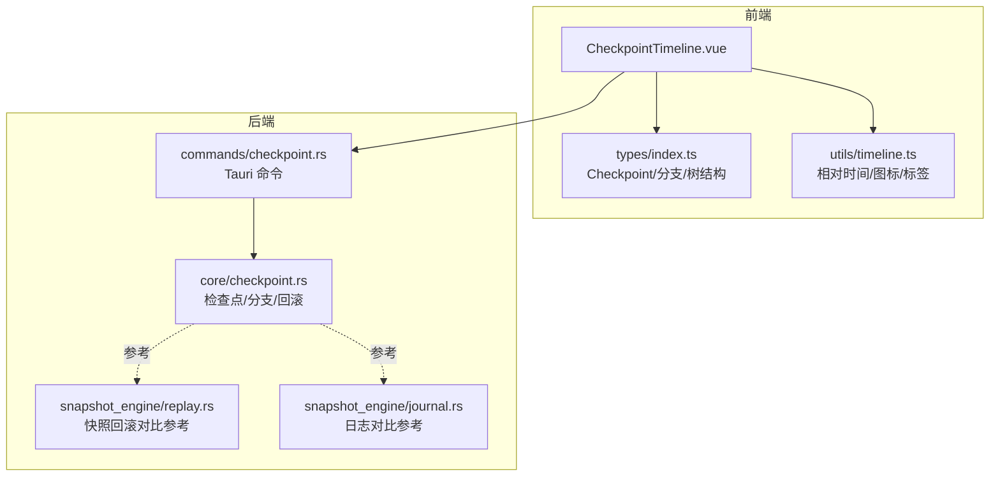
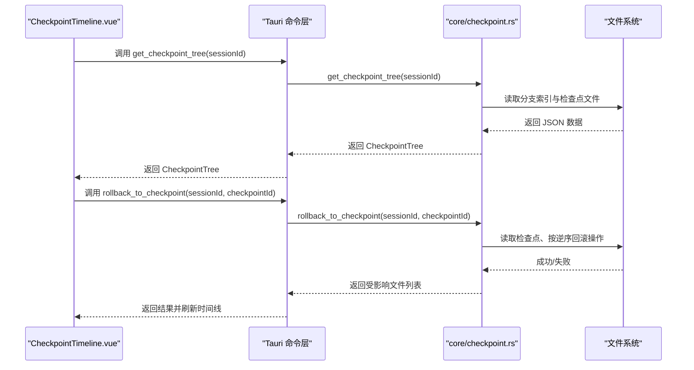
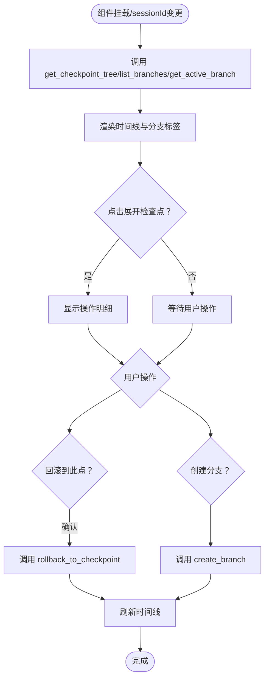
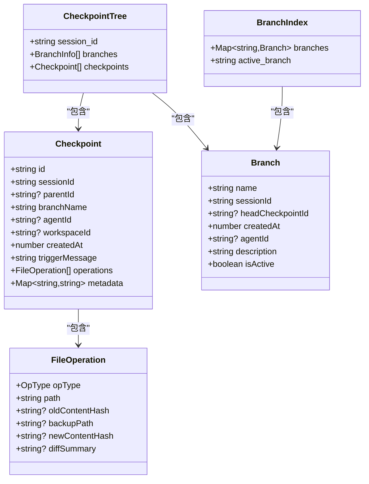
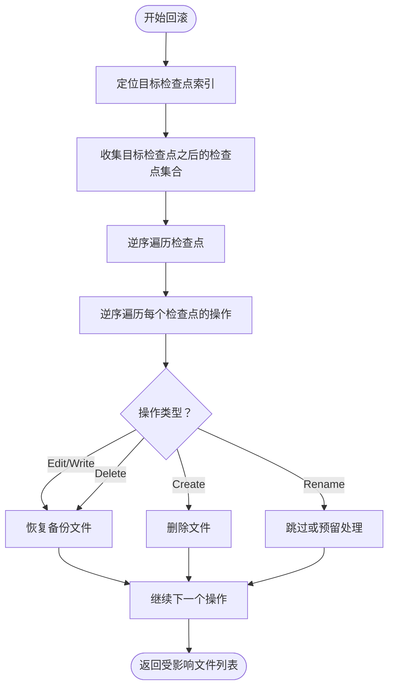
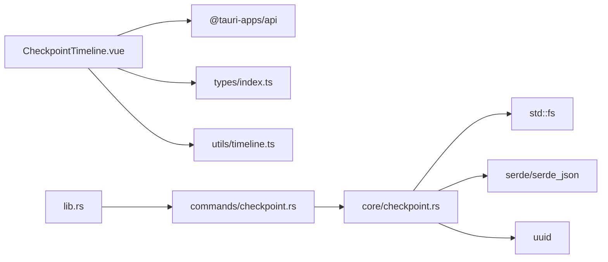

# 检查点组件

<cite>
**本文引用的文件**
- [CheckpointTimeline.vue](file://src/components/checkpoint/CheckpointTimeline.vue)
- [checkpoint.rs](file://src-tauri/src/core/checkpoint.rs)
- [replay.rs](file://src-tauri/src/core/snapshot_engine/replay.rs)
- [journal.rs](file://src-tauri/src/core/snapshot_engine/journal.rs)
- [index.ts](file://src/types/index.ts)
- [timeline.ts](file://src/utils/timeline.ts)
- [checkpoint.rs（命令）](file://src-tauri/src/core/commands/checkpoint.rs)
- [mod.rs（核心模块）](file://src-tauri/src/core/mod.rs)
- [lib.rs（后端入口）](file://src-tauri/src/lib.rs)
</cite>

## 目录
1. [简介](#简介)
2. [项目结构](#项目结构)
3. [核心组件](#核心组件)
4. [架构总览](#架构总览)
5. [组件详细分析](#组件详细分析)
6. [依赖关系分析](#依赖关系分析)
7. [性能考量](#性能考量)
8. [故障排查指南](#故障排查指南)
9. [结论](#结论)
10. [附录](#附录)

## 简介
本文件面向 JarvisAgent 的“检查点组件”，聚焦 CheckpointTimeline 检查点时间线的设计与实现，系统阐述以下内容：
- 检查点的创建机制、状态管理与时间轴展示
- 检查点数据的存储方式、检索算法与历史记录管理
- 时间线渲染优化、性能监控与用户交互
- 检查点回滚功能、状态同步与错误处理
- 使用指南、数据管理方法与扩展开发建议

## 项目结构
检查点组件由前端 Vue 组件与后端 Rust 模块协同完成，前后端通过 Tauri 命令桥接通信。

图表来源
- [CheckpointTimeline.vue:1-616](file://src/components/checkpoint/CheckpointTimeline.vue#L1-L616)
- [checkpoint.rs（命令）:1-167](file://src-tauri/src/core/commands/checkpoint.rs#L1-L167)
- [checkpoint.rs:1-514](file://src-tauri/src/core/checkpoint.rs#L1-L514)
- [replay.rs:1-344](file://src-tauri/src/core/snapshot_engine/replay.rs#L1-L344)
- [journal.rs:1-157](file://src-tauri/src/core/snapshot_engine/journal.rs#L1-L157)
- [index.ts:173-221](file://src/types/index.ts#L173-L221)
- [timeline.ts:1-42](file://src/utils/timeline.ts#L1-L42)

章节来源
- [CheckpointTimeline.vue:1-616](file://src/components/checkpoint/CheckpointTimeline.vue#L1-L616)
- [checkpoint.rs（命令）:1-167](file://src-tauri/src/core/commands/checkpoint.rs#L1-L167)
- [checkpoint.rs:1-514](file://src-tauri/src/core/checkpoint.rs#L1-L514)
- [replay.rs:1-344](file://src-tauri/src/core/snapshot_engine/replay.rs#L1-L344)
- [journal.rs:1-157](file://src-tauri/src/core/snapshot_engine/journal.rs#L1-L157)
- [index.ts:173-221](file://src/types/index.ts#L173-L221)
- [timeline.ts:1-42](file://src/utils/timeline.ts#L1-L42)

## 核心组件
- 前端组件：CheckpointTimeline.vue
  - 负责拉取检查点树、分支列表与当前活跃分支
  - 支持展开查看单个检查点的操作明细
  - 提供回滚确认与分支切换、创建分支等交互
  - 订阅后端事件以自动刷新
- 后端模块：core/checkpoint.rs
  - 定义检查点、分支、分支索引与检查点树的数据结构
  - 实现检查点创建、加载、链路遍历、树聚合与回滚
  - 提供分支创建、切换、列表与删除
  - 文件备份与恢复辅助能力
- 命令层：core/commands/checkpoint.rs
  - 暴露 Tauri 命令给前端调用（如 get_checkpoint_tree、rollback_to_checkpoint、create_branch 等）
  - 协调会话上下文与状态管理器
- 类型与工具：types/index.ts、utils/timeline.ts
  - 统一前后端数据契约（Checkpoint、Branch、CheckpointTree）
  - 提供时间格式化、操作图标与标签映射

章节来源
- [CheckpointTimeline.vue:1-616](file://src/components/checkpoint/CheckpointTimeline.vue#L1-L616)
- [checkpoint.rs:1-514](file://src-tauri/src/core/checkpoint.rs#L1-L514)
- [checkpoint.rs（命令）:1-167](file://src-tauri/src/core/commands/checkpoint.rs#L1-L167)
- [index.ts:173-221](file://src/types/index.ts#L173-L221)
- [timeline.ts:1-42](file://src/utils/timeline.ts#L1-L42)

## 架构总览
前端通过 Tauri invoke 调用后端命令，后端命令委托 core/checkpoint.rs 执行具体逻辑，并返回结果给前端。事件驱动方面，前端监听后端发出的“checkpoint-created”事件以刷新时间线。

图表来源
- [CheckpointTimeline.vue:27-73](file://src/components/checkpoint/CheckpointTimeline.vue#L27-L73)
- [checkpoint.rs（命令）:12-34](file://src-tauri/src/core/commands/checkpoint.rs#L12-L34)
- [checkpoint.rs:381-500](file://src-tauri/src/core/checkpoint.rs#L381-L500)

## 组件详细分析

### CheckpointTimeline 时间线组件
- 数据流
  - 通过 props 接收 sessionId
  - 首次挂载或 sessionId 变更时，调用 get_checkpoint_tree 与 list_branches、get_active_branch
  - 展开检查点时显示操作明细（类型、路径、差异摘要）
  - 回滚时弹出确认模态，确认后调用 rollback_to_checkpoint 并刷新
  - 监听后端事件“checkpoint-created”，自动刷新
- 用户交互
  - 刷新按钮、分支标签页、展开/折叠检查点详情
  - 回滚与创建分支按钮
- 错误处理
  - 统一捕获 invoke 错误，显示错误提示
  - 回滚成功后展示受影响文件列表

图表来源
- [CheckpointTimeline.vue:27-136](file://src/components/checkpoint/CheckpointTimeline.vue#L27-L136)

章节来源
- [CheckpointTimeline.vue:1-616](file://src/components/checkpoint/CheckpointTimeline.vue#L1-L616)

### 后端数据模型与存储
- 数据结构
  - Checkpoint：包含 id、sessionId、parentId、branchName、agentId、workspaceId、createdAt、triggerMessage、operations、metadata
  - FileOperation：opType、path、oldContentHash、backupPath、newContentHash、diffSummary
  - Branch：name、sessionId、headCheckpointId、createdAt、agentId、description、isActive
  - BranchIndex：branches、active_branch
  - CheckpointTree：session_id、branches、checkpoints
- 存储布局
  - 根目录下 .checkpoints/<sessionId>/<branch>/ <checkpointId>.json
  - 分支索引 branches.json
  - 备份目录 backups/<sessionId>/<branch>/ 用于文件备份
- 关键算法
  - get_checkpoint_tree：遍历所有分支，聚合检查点并排序
  - get_checkpoint_chain：沿父指针向上构建链路
  - rollback_to_checkpoint：按逆序遍历检查点与操作进行回滚

图表来源
- [checkpoint.rs:16-86](file://src-tauri/src/core/checkpoint.rs#L16-L86)
- [index.ts:173-221](file://src/types/index.ts#L173-L221)

章节来源
- [checkpoint.rs:1-514](file://src-tauri/src/core/checkpoint.rs#L1-L514)
- [index.ts:173-221](file://src/types/index.ts#L173-L221)

### 回滚机制与状态同步
- 回滚策略
  - 从前端传入的 checkpoint_id 出发，定位该检查点在所有检查点中的位置
  - 逆序遍历该检查点之后的所有检查点与操作，按操作类型执行回滚
  - 对于编辑/写入：恢复备份文件
  - 对于创建：删除对应文件
  - 对于删除：恢复备份文件
  - 对于重命名：预留处理（当前未实现）
- 状态同步
  - 前端调用 rollback_to_checkpoint 后，刷新时间线并展示受影响文件列表
  - 后端通过事件通知前端更新（前端监听“checkpoint-created”）

图表来源
- [checkpoint.rs:455-500](file://src-tauri/src/core/checkpoint.rs#L455-L500)
- [checkpoint.rs（命令）:19-34](file://src-tauri/src/core/commands/checkpoint.rs#L19-L34)

章节来源
- [checkpoint.rs:455-500](file://src-tauri/src/core/checkpoint.rs#L455-L500)
- [checkpoint.rs（命令）:19-34](file://src-tauri/src/core/commands/checkpoint.rs#L19-L34)

### 时间轴展示与渲染优化
- 展示要素
  - 检查点消息、相对时间、操作数量
  - 展开后显示操作类型、路径、差异摘要
  - 分支标签页高亮当前活跃分支
- 渲染优化建议
  - 使用虚拟滚动（如 vue-virtual-scroller）处理大量检查点
  - 按需懒加载检查点详情，仅在展开时请求
  - 缓存分支索引与最近一次时间线结果，减少重复请求
  - 对操作列表进行分页或折叠，避免长列表阻塞

章节来源
- [CheckpointTimeline.vue:187-228](file://src/components/checkpoint/CheckpointTimeline.vue#L187-L228)
- [timeline.ts:1-42](file://src/utils/timeline.ts#L1-L42)

### 性能监控与错误处理
- 性能监控
  - 记录 get_checkpoint_tree/list_branches 的耗时
  - 监控回滚过程中的文件 IO 次数与大小
  - 对大文件备份与恢复进行进度反馈
- 错误处理
  - 前端统一捕获 invoke 错误并提示
  - 后端对文件不存在、权限不足、序列化失败等情况返回明确错误
  - 回滚失败时保留当前状态，允许用户重试或撤销

章节来源
- [CheckpointTimeline.vue:48-72](file://src/components/checkpoint/CheckpointTimeline.vue#L48-L72)
- [checkpoint.rs:442-451](file://src-tauri/src/core/checkpoint.rs#L442-L451)

### 与快照引擎的对比参考
- 快照回滚采用原子回滚与撤销日志，支持增量重放与 LCA（最低共同祖先）计算
- 检查点回滚直接基于文件备份与操作类型进行逆向恢复
- 两者互补：检查点适合人类可读的里程碑式回滚，快照引擎适合细粒度增量回放

章节来源
- [replay.rs:227-245](file://src-tauri/src/core/snapshot_engine/replay.rs#L227-L245)
- [journal.rs:102-151](file://src-tauri/src/core/snapshot_engine/journal.rs#L102-L151)

## 依赖关系分析
- 前端依赖
  - @tauri-apps/api：invoke 与事件监听
  - types/index.ts：数据契约
  - utils/timeline.ts：时间格式化与图标标签
- 后端依赖
  - serde/serde_json：序列化/反序列化
  - uuid：生成唯一标识
  - std::fs：文件系统操作
  - tauri::State：注入会话管理器与状态
- 命令注册
  - lib.rs 中集中注册检查点相关命令，供前端调用

图表来源
- [lib.rs:101-182](file://src-tauri/src/lib.rs#L101-L182)
- [checkpoint.rs（命令）:1-167](file://src-tauri/src/core/commands/checkpoint.rs#L1-L167)
- [checkpoint.rs:1-514](file://src-tauri/src/core/checkpoint.rs#L1-L514)

章节来源
- [lib.rs:101-182](file://src-tauri/src/lib.rs#L101-L182)
- [mod.rs（核心模块）:47-51](file://src-tauri/src/core/mod.rs#L47-L51)

## 性能考量
- I/O 优化
  - 批量读取分支与检查点，避免多次磁盘扫描
  - 对频繁访问的分支索引进行内存缓存
- 算法复杂度
  - get_checkpoint_tree：O(N log N)（N 为检查点总数，排序主导）
  - rollback_to_checkpoint：O(M×K)（M 为检查点数量，K 为平均操作数）
- 前端渲染
  - 大列表使用虚拟滚动
  - 操作详情懒加载，减少首屏压力

## 故障排查指南
- 常见问题
  - “检查点不存在”：确认 sessionId 与 checkpointId 是否匹配
  - “分支不存在”：检查分支索引是否损坏或被删除
  - “回滚失败”：检查备份文件是否存在、目标路径权限与磁盘空间
- 排查步骤
  - 前端：查看错误提示与网络面板
  - 后端：检查 .checkpoints 目录结构与权限
  - 日志：启用调试输出，定位具体失败操作
- 预防措施
  - 定期清理无效备份
  - 对关键文件变更增加 diff 摘要，便于回滚审计

章节来源
- [checkpoint.rs（命令）:36-40](file://src-tauri/src/core/commands/checkpoint.rs#L36-L40)
- [checkpoint.rs:455-500](file://src-tauri/src/core/checkpoint.rs#L455-L500)

## 结论
检查点组件通过清晰的数据模型与命令层设计，实现了会话级检查点的创建、浏览、分支管理与回滚。前端以简洁直观的方式呈现时间线，后端以稳健的文件备份与回滚算法保障数据安全。结合快照引擎的增量回放能力，可满足从里程碑式回滚到细粒度重放的多样化需求。

## 附录

### 使用指南
- 创建检查点
  - 前端：调用 commit_checkpoint，传入 sessionId、triggerMessage、agentId、workspaceId
  - 后端：将 pending_checkpoint 中的操作汇总为新的 Checkpoint
- 查看时间线
  - 前端：传入 sessionId，调用 get_checkpoint_tree 获取 CheckpointTree
- 回滚到指定检查点
  - 前端：调用 rollback_to_checkpoint，确认后刷新时间线
- 分支管理
  - 前端：调用 create_branch、switch_branch、list_branches、delete_branch

章节来源
- [checkpoint.rs（命令）:138-167](file://src-tauri/src/core/commands/checkpoint.rs#L138-L167)
- [checkpoint.rs（命令）:12-34](file://src-tauri/src/core/commands/checkpoint.rs#L12-L34)
- [checkpoint.rs（命令）:19-34](file://src-tauri/src/core/commands/checkpoint.rs#L19-L34)

### 数据管理方法
- 存储策略
  - 检查点文件按分支组织，便于隔离与迁移
  - 备份文件按内容哈希命名，避免重复存储
- 清理策略
  - 删除分支时清理对应目录
  - 定期归档或压缩历史检查点
- 版本兼容
  - 保持 Checkpoint/CheckpointTree 字段稳定，新增字段默认为空

章节来源
- [checkpoint.rs:89-127](file://src-tauri/src/core/checkpoint.rs#L89-L127)
- [checkpoint.rs:406-413](file://src-tauri/src/core/checkpoint.rs#L406-L413)

### 扩展开发建议
- 功能扩展
  - 支持重命名回滚（当前预留）
  - 增加检查点比较与差异可视化
  - 提供批量回滚与预演模式
- 性能增强
  - 引入增量索引与缓存
  - 对大文件采用流式备份与校验
- 可靠性提升
  - 增加回滚前的完整性校验
  - 提供回滚撤销与多级回滚