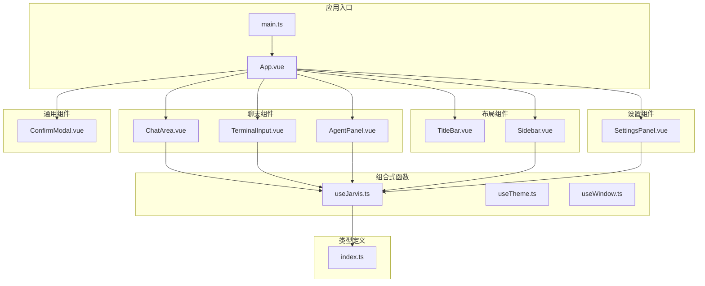
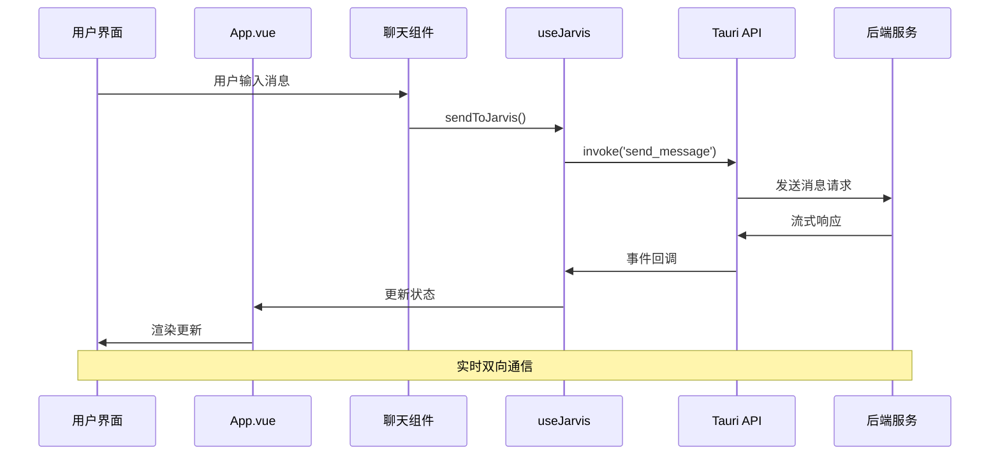
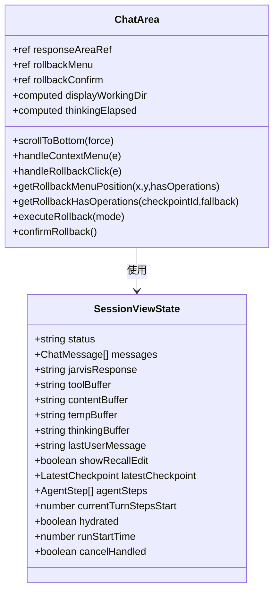
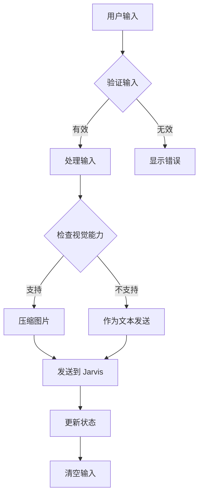
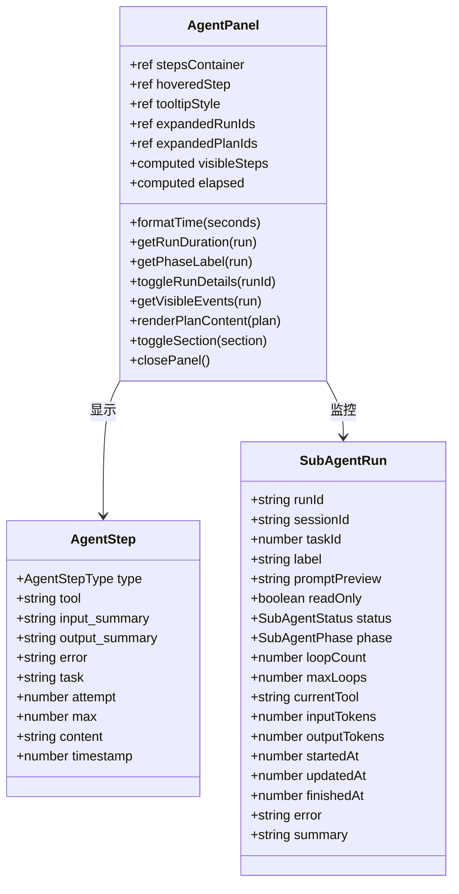
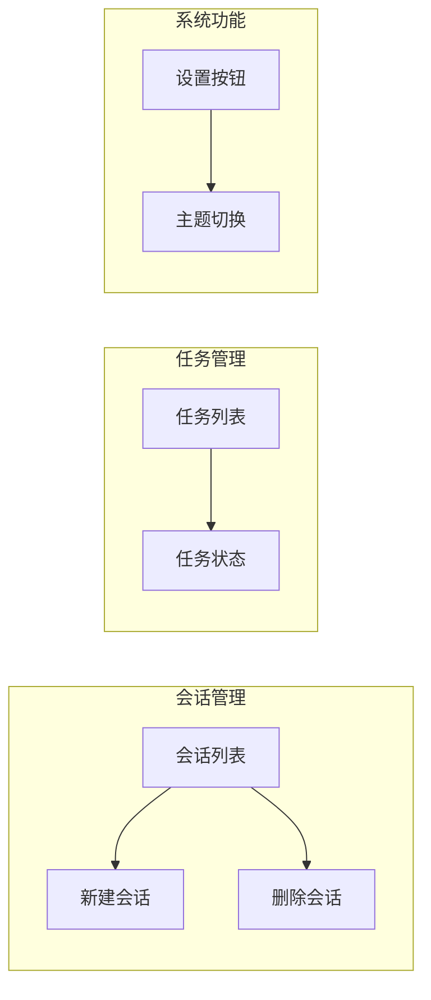
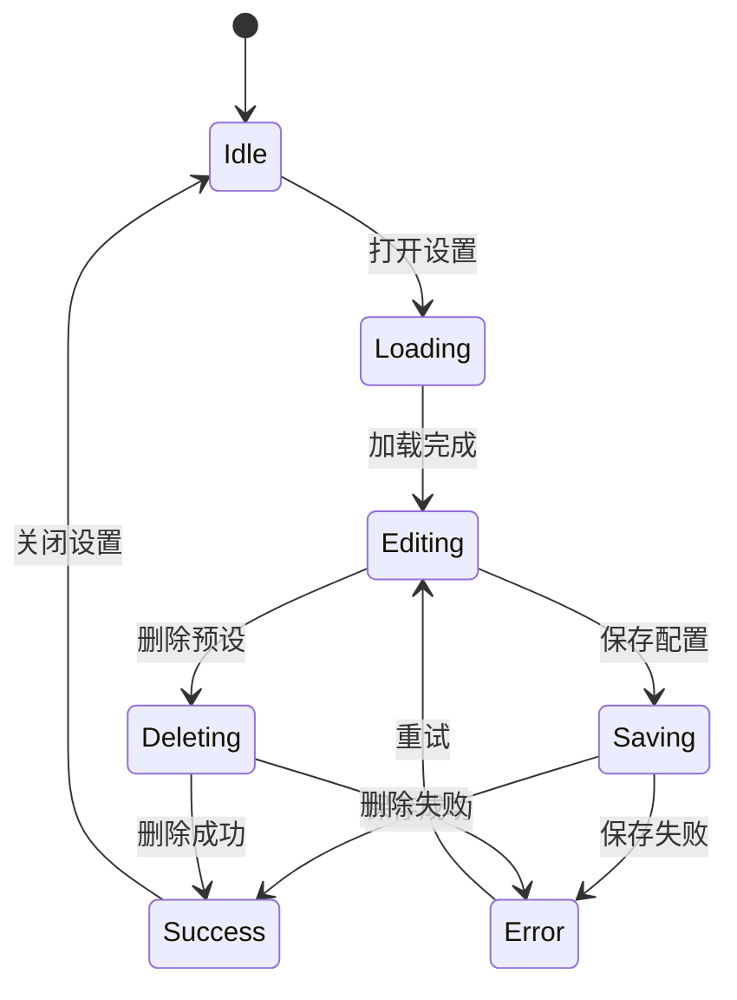
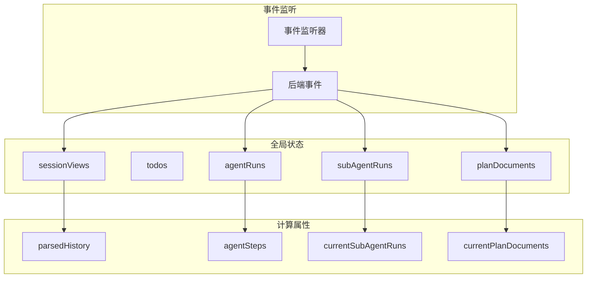

# 组件架构

<cite>
**本文档引用的文件**
- [App.vue](file://src/App.vue)
- [ChatArea.vue](file://src/components/chat/ChatArea.vue)
- [TerminalInput.vue](file://src/components/chat/TerminalInput.vue)
- [AgentPanel.vue](file://src/components/chat/AgentPanel.vue)
- [Sidebar.vue](file://src/components/layout/Sidebar.vue)
- [TitleBar.vue](file://src/components/layout/TitleBar.vue)
- [SettingsPanel.vue](file://src/components/settings/SettingsPanel.vue)
- [useJarvis.ts](file://src/composables/useJarvis.ts)
- [useTheme.ts](file://src/composables/useTheme.ts)
- [useWindow.ts](file://src/composables/useWindow.ts)
- [ConfirmModal.vue](file://src/components/common/ConfirmModal.vue)
- [index.ts](file://src/types/index.ts)
- [main.ts](file://src/main.ts)
</cite>

## 目录
1. [项目概述](#项目概述)
2. [项目结构](#项目结构)
3. [核心组件](#核心组件)
4. [架构概览](#架构概览)
5. [详细组件分析](#详细组件分析)
6. [依赖关系分析](#依赖关系分析)
7. [性能考虑](#性能考虑)
8. [故障排除指南](#故障排除指南)
9. [结论](#结论)

## 项目概述

JarvisAgent 是一个基于 Vue 3 和 Tauri 的智能代理应用，提供了完整的对话、会话管理和代理执行监控功能。该应用采用现代化的组件化架构，通过组合式 API 实现状态管理和组件通信。

## 项目结构

项目采用模块化的文件组织方式，按照功能域进行分层：

**图表来源**
- [main.ts:1-6](file://src/main.ts#L1-L6)
- [App.vue:1-276](file://src/App.vue#L1-L276)

**章节来源**
- [main.ts:1-6](file://src/main.ts#L1-L6)
- [App.vue:1-276](file://src/App.vue#L1-L276)

## 核心组件

### 组件层次结构

应用采用三层架构设计：

1. **容器层**：App.vue 作为根组件，协调整个应用的布局和状态
2. **功能层**：聊天组件、布局组件、设置组件等具体功能模块
3. **基础层**：组合式函数、通用组件、类型定义

### 设计模式

应用实现了多种设计模式：

- **组合式 API 模式**：使用 `useJarvis` 等组合式函数管理复杂状态
- **事件驱动模式**：通过 Tauri 事件系统实现前后端通信
- **响应式数据绑定**：利用 Vue 3 的响应式系统实现数据同步
- **插槽模式**：支持灵活的内容定制和扩展

**章节来源**
- [useJarvis.ts:1-800](file://src/composables/useJarvis.ts#L1-L800)
- [App.vue:1-276](file://src/App.vue#L1-L276)

## 架构概览

应用采用事件驱动的架构模式，通过 Tauri 与后端 Rust 服务进行通信：

**图表来源**
- [useJarvis.ts:620-800](file://src/composables/useJarvis.ts#L620-L800)
- [ChatArea.vue:12-51](file://src/components/chat/ChatArea.vue#L12-L51)

## 详细组件分析

### 聊天组件

#### ChatArea 组件

ChatArea 是聊天界面的核心组件，负责显示对话历史和实时响应：

**图表来源**
- [ChatArea.vue:1-1019](file://src/components/chat/ChatArea.vue#L1-L1019)
- [useJarvis.ts:40-56](file://src/composables/useJarvis.ts#L40-L56)

**章节来源**
- [ChatArea.vue:1-1019](file://src/components/chat/ChatArea.vue#L1-L1019)

#### TerminalInput 组件

TerminalInput 提供用户输入功能，支持拖拽文件、多模态输入和配置管理：

**图表来源**
- [TerminalInput.vue:1-886](file://src/components/chat/TerminalInput.vue#L1-L886)

**章节来源**
- [TerminalInput.vue:1-886](file://src/components/chat/TerminalInput.vue#L1-L886)

#### AgentPanel 组件

AgentPanel 展示代理执行的详细信息，包括子代理运行状态、执行步骤和计划文档：

**图表来源**
- [AgentPanel.vue:1-1015](file://src/components/chat/AgentPanel.vue#L1-L1015)
- [index.ts:54-142](file://src/types/index.ts#L54-L142)

**章节来源**
- [AgentPanel.vue:1-1015](file://src/components/chat/AgentPanel.vue#L1-L1015)

### 布局组件

#### Sidebar 组件

Sidebar 管理会话列表、任务管理和设置入口：

**图表来源**
- [Sidebar.vue:1-783](file://src/components/layout/Sidebar.vue#L1-L783)

**章节来源**
- [Sidebar.vue:1-783](file://src/components/layout/Sidebar.vue#L1-L783)

#### TitleBar 组件

TitleBar 提供窗口控制和标题显示功能：

**章节来源**
- [TitleBar.vue:1-109](file://src/components/layout/TitleBar.vue#L1-L109)

### 设置组件

#### SettingsPanel 组件

SettingsPanel 提供完整的配置管理界面，支持多配置预设和模型能力检测：

**图表来源**
- [SettingsPanel.vue:1-983](file://src/components/settings/SettingsPanel.vue#L1-L983)

**章节来源**
- [SettingsPanel.vue:1-983](file://src/components/settings/SettingsPanel.vue#L1-L983)

## 依赖关系分析

### 组件间通信机制

应用采用多种通信机制：

1. **Props/Events 通信**：父子组件间的标准通信方式
2. **组合式函数共享状态**：useJarvis 提供全局状态管理
3. **事件总线**：Tauri 事件系统实现跨组件通信
4. **Teleport 传送**：用于模态框和上下文菜单的 DOM 传送

### 状态管理架构

**图表来源**
- [useJarvis.ts:121-133](file://src/composables/useJarvis.ts#L121-L133)
- [useJarvis.ts:620-800](file://src/composables/useJarvis.ts#L620-L800)

**章节来源**
- [useJarvis.ts:1-800](file://src/composables/useJarvis.ts#L1-L800)

## 性能考虑

### 渲染优化

1. **虚拟滚动**：对于大量会话和任务列表，考虑实现虚拟滚动
2. **防抖节流**：输入处理和状态更新采用防抖节流机制
3. **懒加载**：大型组件按需加载，减少初始渲染时间
4. **内存管理**：及时清理事件监听器和定时器

### 状态管理优化

1. **细粒度响应式**：使用计算属性避免不必要的重渲染
2. **状态缓存**：对昂贵的计算结果进行缓存
3. **增量更新**：只更新发生变化的部分状态

### 性能监控

- **渲染时间监控**：跟踪组件渲染性能
- **内存使用监控**：监控应用内存占用
- **网络请求监控**：监控 API 调用性能

## 故障排除指南

### 常见问题

1. **组件无法接收事件**
   - 检查事件监听器是否正确注册
   - 验证 Tauri 权限配置
   - 确认组件生命周期正确

2. **状态不同步**
   - 检查 useJarvis 组合式函数的状态更新
   - 验证响应式数据绑定
   - 确认事件处理器正确触发

3. **渲染性能问题**
   - 检查是否有过多的计算属性
   - 优化大型列表的渲染
   - 减少不必要的响应式依赖

### 调试技巧

1. **Vue DevTools**：使用浏览器开发者工具调试组件状态
2. **日志记录**：在关键位置添加日志输出
3. **断点调试**：利用浏览器断点功能逐步调试

**章节来源**
- [useJarvis.ts:620-800](file://src/composables/useJarvis.ts#L620-L800)

## 结论

JarvisAgent 的组件架构展现了现代前端应用的最佳实践：

1. **清晰的层次结构**：合理的组件分层和职责分离
2. **强大的状态管理**：通过组合式函数实现复杂的全局状态管理
3. **灵活的通信机制**：多种通信方式满足不同场景需求
4. **优秀的用户体验**：响应式设计和流畅的交互体验

该架构为后续的功能扩展和维护奠定了坚实的基础，同时保持了良好的性能和可维护性。