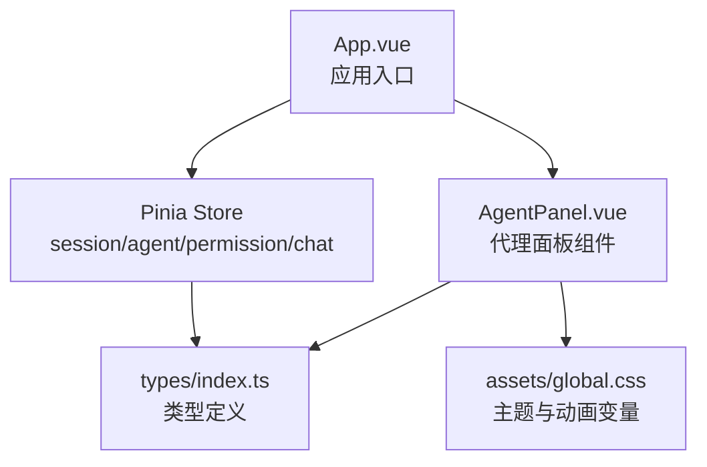
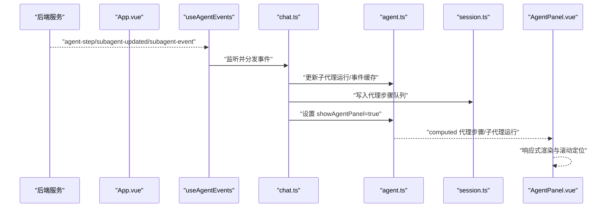
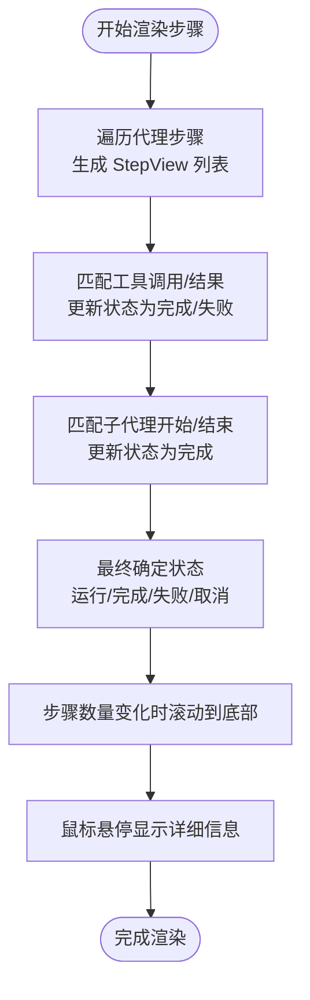
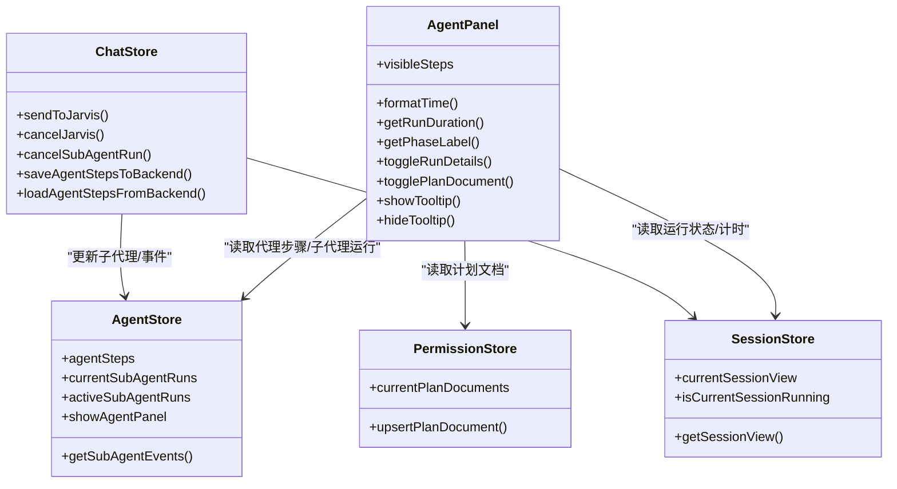

# 代理面板组件

<cite>
**本文档引用的文件**
- [AgentPanel.vue](file://src/components/chat/AgentPanel.vue)
- [index.ts](file://src/types/index.ts)
- [agent.ts](file://src/stores/agent.ts)
- [session.ts](file://src/stores/session.ts)
- [chat.ts](file://src/stores/chat.ts)
- [permission.ts](file://src/stores/permission.ts)
- [App.vue](file://src/App.vue)
- [global.css](file://src/assets/global.css)
</cite>

## 目录
1. [简介](#简介)
2. [项目结构](#项目结构)
3. [核心组件](#核心组件)
4. [架构总览](#架构总览)
5. [详细组件分析](#详细组件分析)
6. [依赖关系分析](#依赖关系分析)
7. [性能考虑](#性能考虑)
8. [故障排除指南](#故障排除指南)
9. [结论](#结论)
10. [附录](#附录)

## 简介
代理面板组件用于在聊天界面右侧展示当前会话的代理执行状态、子代理运行情况、执行流程步骤以及任务计划文档。它通过响应式数据绑定与全局状态管理集成，实现代理状态的实时更新与可视化反馈。组件支持折叠/展开的面板布局、悬浮提示、时间计时、错误状态高亮等交互特性，并提供与权限与计划模块的联动展示。

## 项目结构
代理面板位于聊天功能模块下，与会话、代理、权限等状态存储紧密耦合，同时在应用入口处被统一挂载与控制显示。

图表来源
- [App.vue:37-88](file://src/App.vue#L37-L88)
- [AgentPanel.vue:1-50](file://src/components/chat/AgentPanel.vue#L1-L50)
- [global.css:1-81](file://src/assets/global.css#L1-L81)

章节来源
- [App.vue:1-200](file://src/App.vue#L1-L200)
- [AgentPanel.vue:1-100](file://src/components/chat/AgentPanel.vue#L1-L100)

## 核心组件
- 代理面板（AgentPanel.vue）：负责渲染子代理列表、执行流程步骤、任务计划文档，提供折叠切换、详情展开、悬浮提示、计时显示等交互。
- 类型定义（types/index.ts）：定义代理步骤、子代理运行、事件、计划文档等核心数据结构。
- 状态存储：
  - 会话存储（session.ts）：维护会话视图状态、运行状态、代理步骤队列等。
  - 代理存储（agent.ts）：维护代理运行记录、子代理运行记录、事件缓存、面板开关等。
  - 权限存储（permission.ts）：维护权限请求、计划提案与计划文档集合。
  - 聊天存储（chat.ts）：负责与后端交互、触发面板显示、保存/加载执行流程等。
- 应用入口（App.vue）：初始化事件监听器，控制代理面板的显示/隐藏按钮与整体布局。

章节来源
- [AgentPanel.vue:1-100](file://src/components/chat/AgentPanel.vue#L1-L100)
- [index.ts:45-171](file://src/types/index.ts#L45-L171)
- [agent.ts:12-95](file://src/stores/agent.ts#L12-L95)
- [session.ts:9-163](file://src/stores/session.ts#L9-L163)
- [permission.ts:6-66](file://src/stores/permission.ts#L6-L66)
- [chat.ts:38-658](file://src/stores/chat.ts#L38-L658)
- [App.vue:1-200](file://src/App.vue#L1-L200)

## 架构总览
代理面板采用“组件 + Pinia Store + 类型定义”的分层架构，通过响应式计算属性与侦听器实现数据驱动的UI更新；通过事件监听器从后端推送代理状态，自动触发面板显示与内容刷新。

图表来源
- [App.vue:23-34](file://src/App.vue#L23-L34)
- [chat.ts:327-357](file://src/stores/chat.ts#L327-L357)
- [agent.ts:12-95](file://src/stores/agent.ts#L12-L95)
- [session.ts:54-163](file://src/stores/session.ts#L54-L163)
- [AgentPanel.vue:10-51](file://src/components/chat/AgentPanel.vue#L10-L51)

## 详细组件分析

### 组件数据绑定与状态同步
- 代理步骤来源：由会话存储中的当前会话视图维护，聊天存储在收到后端事件时将其追加到队列并标记为已水化。
- 子代理运行：由代理存储维护，按会话筛选并排序，活跃子代理数量用于顶部计数显示。
- 计时与运行状态：当会话处于运行状态时，组件启动秒表定时器，实时显示累计耗时。
- 面板开关：通过代理存储的 showAgentPanel 控制面板显示/隐藏，初始条件为存在代理步骤或子代理运行或计划文档。

章节来源
- [AgentPanel.vue:10-51](file://src/components/chat/AgentPanel.vue#L10-L51)
- [session.ts:9-48](file://src/stores/session.ts#L9-L48)
- [chat.ts:327-357](file://src/stores/chat.ts#L327-L357)
- [agent.ts:12-37](file://src/stores/agent.ts#L12-L37)

### 执行流程可视化
- 步骤视图生成：遍历代理步骤，根据类型映射到不同的状态（待定/运行/完成/失败/取消），并尝试与工具调用/结果进行配对，形成更直观的步骤序列。
- 步骤样式：根据状态与类型动态生成类名，支持运行中的旋转动画、完成/失败的颜色高亮。
- 自动滚动：当步骤数量变化时，容器自动滚动到底部，确保最新步骤可见。
- 悬浮提示：鼠标悬停在步骤节点上时，显示详细信息（如工具输入摘要、输出摘要、错误信息等）。

图表来源
- [AgentPanel.vue:148-210](file://src/components/chat/AgentPanel.vue#L148-L210)
- [AgentPanel.vue:288-306](file://src/components/chat/AgentPanel.vue#L288-L306)

章节来源
- [AgentPanel.vue:148-210](file://src/components/chat/AgentPanel.vue#L148-L210)
- [AgentPanel.vue:288-306](file://src/components/chat/AgentPanel.vue#L288-L306)

### 子代理运行状态展示
- 列表渲染：按会话筛选当前子代理运行，按启动时间排序，支持展开/折叠详情。
- 运行阶段标签：根据阶段状态显示不同文案（启动中/等待模型/接收输出/思考中/调用工具/处理结果/收尾中）。
- 时间与令牌统计：显示运行时长、轮次/最大轮次、输入/输出令牌总量。
- 错误与摘要：若存在错误或摘要，分别高亮显示。
- 事件流：仅展示最近若干条事件，支持展开查看更多历史事件。

章节来源
- [AgentPanel.vue:339-383](file://src/components/chat/AgentPanel.vue#L339-L383)
- [AgentPanel.vue:103-106](file://src/components/chat/AgentPanel.vue#L103-L106)

### 任务计划文档展示
- 计划文档列表：按会话维护计划文档数组，支持展开/折叠查看内容。
- 状态标签：根据状态（待审批/已同意/已拒绝）显示不同颜色与动画。
- 内容渲染：使用 Markdown 渲染器将文档内容转换为 HTML，限制最大高度并启用垂直滚动。

章节来源
- [AgentPanel.vue:424-450](file://src/components/chat/AgentPanel.vue#L424-L450)
- [AgentPanel.vue:253-275](file://src/components/chat/AgentPanel.vue#L253-L275)
- [AgentPanel.vue:257](file://src/components/chat/AgentPanel.vue#L257)

### 布局设计与视觉反馈
- 面板宽度固定：默认 260px，最小 220px，左侧边框与毛玻璃背景，保证在深浅主题下的可读性。
- 折叠面板：支持三段式折叠（子代理/执行流程/任务计划），展开时占据剩余空间。
- 动画与过渡：面板滑入/滑出过渡、运行指示点呼吸动画、运行中步骤的旋转动画、计划文档状态点的呼吸动画。
- 主题变量：使用全局 CSS 变量统一颜色体系，支持浅色/深色模式切换。

章节来源
- [AgentPanel.vue:456-517](file://src/components/chat/AgentPanel.vue#L456-L517)
- [AgentPanel.vue:539-584](file://src/components/chat/AgentPanel.vue#L539-L584)
- [AgentPanel.vue:987-1009](file://src/components/chat/AgentPanel.vue#L987-L1009)
- [global.css:1-81](file://src/assets/global.css#L1-L81)

### 交互设计
- 关闭按钮：点击关闭面板，隐藏执行监控。
- 折叠切换：点击标题栏切换面板段落展开/折叠，支持键盘导航。
- 任务跳转：子代理运行项可跳转到关联任务。
- 取消子代理：运行中的子代理可一键取消。
- 计时显示：运行中显示累计秒数，便于感知耗时。
- 悬浮提示：步骤节点悬浮显示详细信息，避免信息过载。

章节来源
- [AgentPanel.vue:284-286](file://src/components/chat/AgentPanel.vue#L284-L286)
- [AgentPanel.vue:277-282](file://src/components/chat/AgentPanel.vue#L277-L282)
- [AgentPanel.vue:352-357](file://src/components/chat/AgentPanel.vue#L352-L357)
- [AgentPanel.vue:414-420](file://src/components/chat/AgentPanel.vue#L414-L420)

### 与全局状态管理的集成
- 事件驱动：通过聊天存储监听后端推送的代理步骤、子代理更新与事件，自动写入代理存储与会话存储。
- 面板显示：当存在代理步骤或子代理运行或计划文档时，自动显示面板；发送消息时也强制显示面板。
- 数据一致性：所有渲染数据均来自 Pinia 计算属性，确保组件与全局状态保持一致。

章节来源
- [chat.ts:327-357](file://src/stores/chat.ts#L327-L357)
- [chat.ts:402](file://src/stores/chat.ts#L402)
- [agent.ts:21-37](file://src/stores/agent.ts#L21-L37)

### 错误状态处理
- 子代理错误：错误事件会高亮显示，错误详情在事件区域以红色呈现。
- 工具调用错误：工具调用步骤失败时，自动将对应“调用”步骤标记为失败并显示错误信息。
- 步骤失败高亮：失败状态的步骤点与标签使用红色强调，便于快速识别问题。

章节来源
- [AgentPanel.vue:172-181](file://src/components/chat/AgentPanel.vue#L172-L181)
- [AgentPanel.vue:773-787](file://src/components/chat/AgentPanel.vue#L773-L787)

### 性能优化策略
- 增量渲染：聊天存储对内容与工具状态采用增量渲染，避免全量解析 Markdown，降低渲染压力。
- 节流与帧调度：渲染触发节流至约 30fps，减少频繁解析带来的卡顿。
- 事件缓存：子代理事件按运行 ID 缓存并限制数量，避免内存膨胀。
- 自动滚动：仅在步骤数量变化时滚动到底部，避免不必要的 DOM 操作。

章节来源
- [chat.ts:169-267](file://src/stores/chat.ts#L169-L267)
- [chat.ts:269-285](file://src/stores/chat.ts#L269-L285)
- [chat.ts:349-357](file://src/stores/chat.ts#L349-L357)

## 依赖关系分析

图表来源
- [AgentPanel.vue:10-51](file://src/components/chat/AgentPanel.vue#L10-L51)
- [agent.ts:12-95](file://src/stores/agent.ts#L12-L95)
- [session.ts:54-163](file://src/stores/session.ts#L54-L163)
- [permission.ts:6-66](file://src/stores/permission.ts#L6-L66)
- [chat.ts:38-658](file://src/stores/chat.ts#L38-L658)

## 性能考虑
- 渲染节流：聊天存储对 Markdown 解析进行节流与帧调度，避免高频更新导致的卡顿。
- 事件缓存上限：子代理事件缓存限制为固定数量，避免无限增长。
- 按需展开：步骤与计划文档默认仅显示最近若干条，展开时再加载更多内容。
- DOM 操作最小化：自动滚动仅在必要时触发，悬浮提示基于坐标计算，避免频繁重排。

[本节为通用性能建议，无需特定文件来源]

## 故障排除指南
- 面板不显示：检查是否存在代理步骤、子代理运行或计划文档；确认聊天存储在发送消息时已设置 showAgentPanel。
- 步骤未更新：确认后端事件监听是否正常，检查聊天存储的事件监听回调是否被调用。
- 子代理错误未高亮：检查事件类型与错误字段是否正确传递到事件对象。
- 计时不更新：确认会话运行状态与定时器逻辑，确保在会话开始时启动定时器，在结束时清理。

章节来源
- [App.vue:60-73](file://src/App.vue#L60-L73)
- [chat.ts:327-357](file://src/stores/chat.ts#L327-L357)
- [AgentPanel.vue:39-51](file://src/components/chat/AgentPanel.vue#L39-L51)

## 结论
代理面板组件通过清晰的分层架构与事件驱动机制，实现了对代理执行状态的实时可视化展示。其响应式数据绑定、折叠布局、悬浮提示与主题动画共同提供了良好的用户体验。配合聊天存储的增量渲染与事件缓存策略，组件在复杂场景下仍能保持流畅的交互体验。

[本节为总结性内容，无需特定文件来源]

## 附录

### 使用示例
- 显示/隐藏面板：在应用入口的工具栏按钮点击时切换代理面板显示状态。
- 触发面板显示：发送消息或收到代理步骤事件时，自动显示面板。
- 查看子代理详情：点击子代理运行项展开事件列表，支持取消运行。
- 查看执行流程：滚动查看步骤节点，悬浮显示详细信息。
- 查看计划文档：点击计划文档标题展开内容，支持 Markdown 渲染。

章节来源
- [App.vue:60-73](file://src/App.vue#L60-L73)
- [chat.ts:402](file://src/stores/chat.ts#L402)
- [AgentPanel.vue:340-383](file://src/components/chat/AgentPanel.vue#L340-L383)
- [AgentPanel.vue:414-420](file://src/components/chat/AgentPanel.vue#L414-L420)
- [AgentPanel.vue:440-449](file://src/components/chat/AgentPanel.vue#L440-L449)

### 自定义扩展方法
- 新增步骤类型：在类型定义中扩展 AgentStepType，并在组件中添加对应的标签与详情渲染逻辑。
- 自定义事件展示：在事件枚举中新增类型，组件中添加对应样式与高亮规则。
- 面板行为定制：通过修改面板的折叠状态、计时逻辑与悬浮提示位置计算方式，适配不同布局需求。
- 性能优化：结合业务场景调整事件缓存上限、渲染节流阈值与自动滚动策略。

章节来源
- [index.ts:47-69](file://src/types/index.ts#L47-L69)
- [index.ts:148-171](file://src/types/index.ts#L148-L171)
- [AgentPanel.vue:212-242](file://src/components/chat/AgentPanel.vue#L212-L242)
- [chat.ts:169-267](file://src/stores/chat.ts#L169-L267)