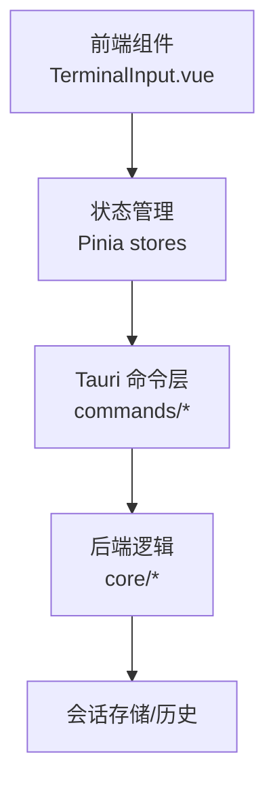
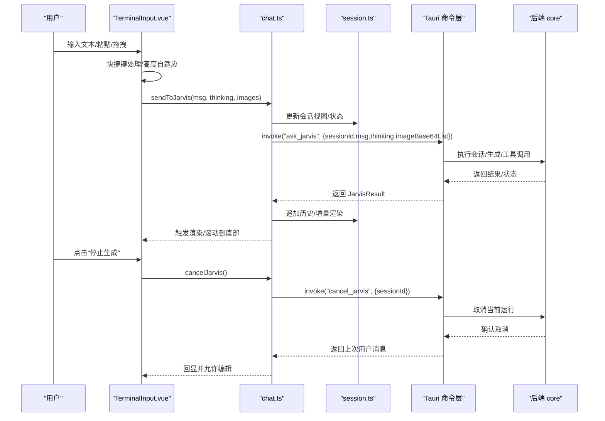
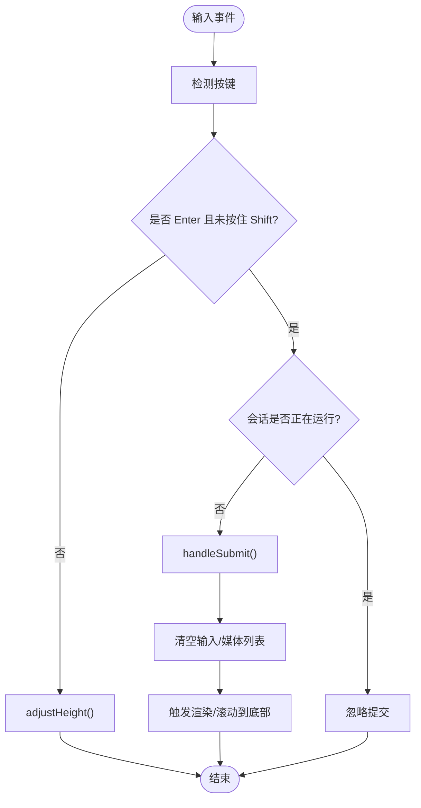
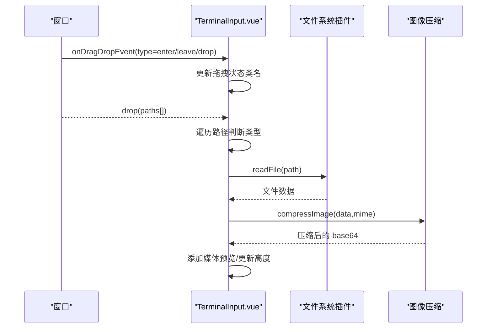
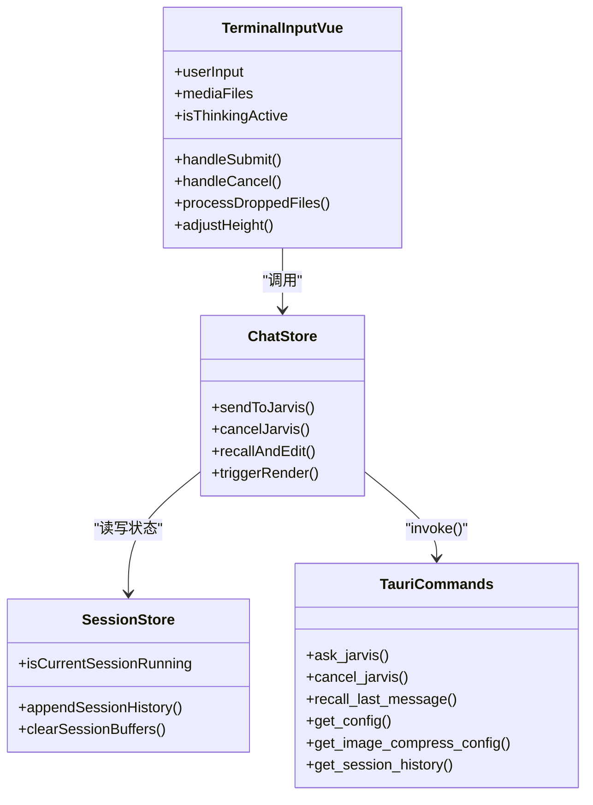
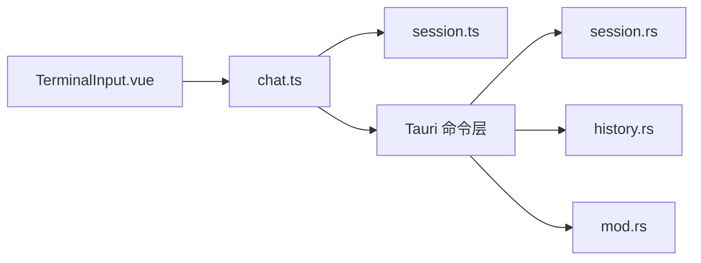

# 终端输入组件

<cite>
**本文档引用的文件**
- [TerminalInput.vue](file://src/components/chat/TerminalInput.vue)
- [chat.ts](file://src/stores/chat.ts)
- [session.ts](file://src/stores/session.ts)
- [history.rs](file://src-tauri/src/core/commands/history.rs)
- [session.rs](file://src-tauri/src/core/commands/session.rs)
- [mod.rs](file://src-tauri/src/core/mod.rs)
- [main.rs](file://src-tauri/src/main.rs)
</cite>

## 目录
1. [简介](#简介)
2. [项目结构](#项目结构)
3. [核心组件](#核心组件)
4. [架构总览](#架构总览)
5. [详细组件分析](#详细组件分析)
6. [依赖关系分析](#依赖关系分析)
7. [性能考虑](#性能考虑)
8. [故障排除指南](#故障排除指南)
9. [结论](#结论)
10. [附录](#附录)

## 简介
本文件为 TerminalInput 终端输入组件的详细技术文档。该组件负责接收用户输入、处理快捷键、支持多行输入与粘贴、管理媒体附件（图片/视频）、触发后端会话交互、处理取消与撤回编辑、以及提供良好的样式与焦点管理体验。文档将从实现机制、快捷键处理、命令历史、自动补全（概念性说明）、多行输入支持、粘贴处理、输入验证、提交机制、样式设计、焦点管理、键盘事件处理、后端通信接口、错误处理与用户体验优化等方面进行系统化阐述，并提供集成示例、自定义配置选项与扩展开发指南。

## 项目结构
TerminalInput 组件位于前端 Vue 单文件组件中，配合 Pinia 状态管理与 Tauri 后端命令调用，形成完整的输入-提交-渲染闭环。其核心职责包括：
- 输入框与多行自适应高度
- 快捷键 Enter 提交、Shift+Enter 换行
- 拖拽/粘贴文件（图片/视频）处理
- 发送消息至后端会话并处理取消/撤回
- 样式与焦点管理

**图表来源**
- [TerminalInput.vue:193-221](file://src/components/chat/TerminalInput.vue#L193-L221)
- [chat.ts:383-540](file://src/stores/chat.ts#L383-L540)
- [session.ts:54-162](file://src/stores/session.ts#L54-L162)
- [session.rs:7-12](file://src-tauri/src/core/commands/session.rs#L7-L12)
- [mod.rs:35-46](file://src-tauri/src/core/mod.rs#L35-L46)

**章节来源**
- [TerminalInput.vue:193-221](file://src/components/chat/TerminalInput.vue#L193-L221)
- [chat.ts:383-540](file://src/stores/chat.ts#L383-L540)
- [session.ts:54-162](file://src/stores/session.ts#L54-L162)

## 核心组件
- TerminalInput.vue：负责输入框、快捷键、拖拽/粘贴、媒体预览、发送/取消按钮、撤销编辑提示条等 UI 与交互逻辑。
- chat.ts：Pinia 聊天状态与后端交互封装，包含发送消息、取消、撤回编辑、增量渲染等。
- session.ts：会话状态管理，跟踪运行状态、消息历史、缓冲区等。
- Tauri 命令层：通过 invoke 调用后端命令，如 ask_jarvis、cancel_jarvis、recall_last_message、get_config、get_image_compress_config 等。
- 后端 core 模块：会话、历史、检查点、快照等核心业务逻辑。

**章节来源**
- [TerminalInput.vue:1-888](file://src/components/chat/TerminalInput.vue#L1-L888)
- [chat.ts:1-658](file://src/stores/chat.ts#L1-L658)
- [session.ts:1-163](file://src/stores/session.ts#L1-L163)
- [session.rs:7-12](file://src-tauri/src/core/commands/session.rs#L7-L12)
- [mod.rs:35-46](file://src-tauri/src/core/mod.rs#L35-L46)

## 架构总览
TerminalInput 与后端的交互通过 Tauri 的 invoke 机制完成，前端调用后端命令，后端执行业务逻辑并返回结果。聊天状态由 Pinia 管理，支持增量渲染与会话历史展示。

**图表来源**
- [TerminalInput.vue:244-270](file://src/components/chat/TerminalInput.vue#L244-L270)
- [chat.ts:383-540](file://src/stores/chat.ts#L383-L540)
- [session.rs:542-563](file://src/stores/chat.ts#L542-L563)
- [session.rs:7-12](file://src-tauri/src/core/commands/session.rs#L7-L12)

## 详细组件分析

### 输入框与多行输入支持
- 使用 textarea 实现多行输入，默认单行，输入时自动调整高度，最大高度限制在 200px。
- 支持 Shift+Enter 换行，Enter 提交；当会话正在运行时，Enter 将被忽略，防止重复提交。
- 自动高度调整函数在输入时触发，确保输入区域随内容增长而增长。

**图表来源**
- [TerminalInput.vue:244-270](file://src/components/chat/TerminalInput.vue#L244-L270)
- [TerminalInput.vue:232-242](file://src/components/chat/TerminalInput.vue#L232-L242)

**章节来源**
- [TerminalInput.vue:232-242](file://src/components/chat/TerminalInput.vue#L232-L242)
- [TerminalInput.vue:244-251](file://src/components/chat/TerminalInput.vue#L244-L251)
- [TerminalInput.vue:253-270](file://src/components/chat/TerminalInput.vue#L253-L270)

### 快捷键处理
- Enter 提交：阻止默认行为，若会话未运行则提交；否则忽略。
- Shift+Enter：原生换行，不触发提交。
- 取消：当会话运行中，点击“停止生成”按钮调用 cancelJarvis，后端取消当前运行并回显上次用户消息供编辑。

**章节来源**
- [TerminalInput.vue:244-251](file://src/components/chat/TerminalInput.vue#L244-L251)
- [chat.ts:542-563](file://src/stores/chat.ts#L542-L563)

### 命令历史与撤回编辑
- 撤回编辑：调用后端 recall_last_message 获取上次用户消息，清理当前轮次的 Agent 步骤，更新 UI 并允许编辑。
- 会话历史：后端提供 get_session_history，将消息与思考内容组合为 HTML，支持检查点按钮与操作标记。

**章节来源**
- [chat.ts:565-592](file://src/stores/chat.ts#L565-L592)
- [session.rs:140-186](file://src-tauri/src/core/commands/session.rs#L140-L186)
- [history.rs:6-151](file://src-tauri/src/core/commands/history.rs#L6-L151)

### 自动补全功能（概念性说明）
- 当前组件未实现自动补全逻辑。建议通过监听输入变化并结合后端命令（如 sandbox_complete）实现命令补全，或在前端维护命令词典并通过键盘事件触发候选列表展示与选择。

[本节为概念性说明，不直接分析具体文件，故无章节来源]

### 粘贴与拖拽处理
- 支持拖拽进入/离开/丢弃事件，显示拖拽状态类名。
- 丢弃文件时，识别图片/视频类型并进行压缩（如启用视觉能力），同时将非媒体文件拼接到输入框。
- 图片预览使用对象 URL，视频/图片移除时释放内存。

**图表来源**
- [TerminalInput.vue:138-191](file://src/components/chat/TerminalInput.vue#L138-L191)
- [TerminalInput.vue:39-72](file://src/components/chat/TerminalInput.vue#L39-L72)

**章节来源**
- [TerminalInput.vue:138-191](file://src/components/chat/TerminalInput.vue#L138-L191)
- [TerminalInput.vue:39-72](file://src/components/chat/TerminalInput.vue#L39-L72)

### 输入验证与提交机制
- 提交前对消息与媒体进行校验：消息为空且无媒体则不提交。
- 发送时将图片以 base64 形式嵌入消息内容，便于后端统一处理。
- 会话状态在提交前后进行更新，保证 UI 与后端一致。

**章节来源**
- [chat.ts:383-425](file://src/stores/chat.ts#L383-L425)
- [chat.ts:426-540](file://src/stores/chat.ts#L426-L540)

### 样式设计与焦点管理
- 使用 CSS 变量实现玻璃拟态风格，聚焦时边框高亮与阴影增强。
- 输入框采用等宽字体，行高与最大高度控制多行显示。
- 焦点管理：点击输入区域或调用 focus()，确保用户可直接编辑。

**章节来源**
- [TerminalInput.vue:443-800](file://src/components/chat/TerminalInput.vue#L443-L800)
- [TerminalInput.vue:412-437](file://src/components/chat/TerminalInput.vue#L412-L437)

### 键盘事件处理
- 监听 keydown 事件，区分 Enter 与 Shift+Enter。
- 在提交过程中禁用重复提交，避免并发问题。

**章节来源**
- [TerminalInput.vue:244-251](file://src/components/chat/TerminalInput.vue#L244-L251)

### 后端通信接口
- 前端通过 invoke 调用后端命令：
  - ask_jarvis：发送消息并接收增量响应。
  - cancel_jarvis：取消当前运行。
  - recall_last_message：撤回上一条用户消息。
  - get_config/get_image_compress_config：加载配置与图像压缩参数。
  - get_session_history：获取会话历史。
- 后端命令导出由 core/mod.rs 统一暴露。

**图表来源**
- [TerminalInput.vue:1-888](file://src/components/chat/TerminalInput.vue#L1-L888)
- [chat.ts:383-658](file://src/stores/chat.ts#L383-L658)
- [session.ts:54-162](file://src/stores/session.ts#L54-L162)
- [mod.rs:35-46](file://src-tauri/src/core/mod.rs#L35-L46)

**章节来源**
- [chat.ts:383-658](file://src/stores/chat.ts#L383-L658)
- [session.rs:7-12](file://src-tauri/src/core/commands/session.rs#L7-L12)
- [mod.rs:35-46](file://src-tauri/src/core/mod.rs#L35-L46)

## 依赖关系分析
- TerminalInput.vue 依赖：
  - Tauri 窗口事件、文件系统插件、invoke 监听
  - Pinia stores（session、chat）
- chat.ts 依赖：
  - Tauri invoke 与后端命令
  - session.ts 状态
- 后端命令：
  - session.rs：会话生命周期、取消、撤回、历史
  - history.rs：历史渲染
  - mod.rs：命令导出

**图表来源**
- [TerminalInput.vue:1-888](file://src/components/chat/TerminalInput.vue#L1-L888)
- [chat.ts:1-658](file://src/stores/chat.ts#L1-L658)
- [session.ts:1-163](file://src/stores/session.ts#L1-L163)
- [session.rs:1-334](file://src-tauri/src/core/commands/session.rs#L1-L334)
- [history.rs:1-151](file://src-tauri/src/core/commands/history.rs#L1-L151)
- [mod.rs:1-64](file://src-tauri/src/core/mod.rs#L1-L64)

**章节来源**
- [TerminalInput.vue:1-888](file://src/components/chat/TerminalInput.vue#L1-L888)
- [chat.ts:1-658](file://src/stores/chat.ts#L1-L658)
- [session.ts:1-163](file://src/stores/session.ts#L1-L163)
- [session.rs:1-334](file://src-tauri/src/core/commands/session.rs#L1-L334)
- [history.rs:1-151](file://src-tauri/src/core/commands/history.rs#L1-L151)
- [mod.rs:1-64](file://src-tauri/src/core/mod.rs#L1-L64)

## 性能考虑
- 增量渲染：chat.ts 对内容与工具状态进行增量渲染，避免全量解析 Markdown，降低 CPU 开销。
- 高度自适应：仅在输入时计算滚动高度，限制最大高度，避免频繁布局抖动。
- 图像压缩：在拖拽上传图片时进行压缩，减少传输体积与内存占用。
- 会话状态缓存：通过 Pinia 管理会话视图，避免重复计算与 DOM 更新。

[本节提供一般性指导，不直接分析具体文件，故无章节来源]

## 故障排除指南
- 提交无效：确认会话 ID 存在且消息非空，或至少包含媒体文件。
- 取消失败：检查会话状态是否为 RUNNING，确保 invoke cancel_jarvis 成功返回。
- 模型不支持视觉：当 canModelVision=false 时，图片/视频仅作为文件路径传递，组件会显示警告并允许用户关闭。
- 拖拽无响应：检查窗口 onDragDropEvent 是否正确绑定，路径数组是否有效。
- 渲染异常：确认增量渲染状态未被外部清空导致偏移，必要时重置渲染状态。

**章节来源**
- [chat.ts:522-540](file://src/stores/chat.ts#L522-L540)
- [TerminalInput.vue:183-185](file://src/components/chat/TerminalInput.vue#L183-L185)
- [TerminalInput.vue:204-220](file://src/components/chat/TerminalInput.vue#L204-L220)

## 结论
TerminalInput 组件通过简洁的输入与快捷键处理、完善的多行与粘贴支持、与后端命令的紧密协作，提供了流畅的终端式交互体验。配合 Pinia 的状态管理与后端的历史/会话/检查点机制，实现了可靠的提交、取消与撤回编辑流程。未来可在自动补全、命令历史检索、输入验证规则等方面进一步扩展，以满足更复杂的终端场景需求。

[本节为总结性内容，不直接分析具体文件，故无章节来源]

## 附录

### 组件集成示例
- 在页面中引入 TerminalInput 组件，确保已初始化会话与配置。
- 监听 config-updated 事件以动态更新模型能力与界面状态。
- 通过 chat.store 的回调注册滚动到底部逻辑，保证新消息可见。

**章节来源**
- [TerminalInput.vue:197-200](file://src/components/chat/TerminalInput.vue#L197-L200)
- [chat.ts:178-184](file://src/stores/chat.ts#L178-L184)

### 自定义配置选项
- 图像压缩参数：通过 get_image_compress_config 动态加载，支持最大宽度、高度与质量。
- 模型能力检测：通过 get_model_capabilities 判断是否支持深度思考与视觉能力，动态禁用相关按钮。
- 配置更新监听：监听 config-updated 事件，自动刷新界面与能力状态。

**章节来源**
- [TerminalInput.vue:30-37](file://src/components/chat/TerminalInput.vue#L30-L37)
- [TerminalInput.vue:74-93](file://src/components/chat/TerminalInput.vue#L74-L93)
- [TerminalInput.vue:197-200](file://src/components/chat/TerminalInput.vue#L197-L200)

### 扩展开发指南
- 自动补全：在 handleInput 中监听输入变化，调用 sandbox_complete 或维护本地命令词典，展示候选列表并支持键盘选择。
- 命令历史：结合 get_session_history 与本地存储，实现上下键浏览与搜索过滤。
- 输入验证：在 handleSubmit 前增加正则/白名单校验，对危险命令进行拦截或二次确认。
- 多媒体增强：支持更多格式（如 PDF、音频），并在 canModelVision=false 时提供替代方案（如文件链接）。

[本节为扩展性建议，不直接分析具体文件，故无章节来源]