# 聊天区域组件

<cite>
**本文档引用的文件**
- [ChatArea.vue](file://src/components/chat/ChatArea.vue)
- [chat.ts](file://src/stores/chat.ts)
- [session.ts](file://src/stores/session.ts)
- [global.css](file://src/assets/global.css)
- [markdown.ts](file://src/utils/markdown.ts)
- [useAgentEvents.ts](file://src/composables/useAgentEvents.ts)
- [TerminalInput.vue](file://src/components/chat/TerminalInput.vue)
- [AgentPanel.vue](file://src/components/chat/AgentPanel.vue)
- [index.ts](file://src/types/index.ts)
</cite>

## 目录
1. [简介](#简介)
2. [项目结构](#项目结构)
3. [核心组件](#核心组件)
4. [架构概览](#架构概览)
5. [详细组件分析](#详细组件分析)
6. [依赖关系分析](#依赖关系分析)
7. [性能考虑](#性能考虑)
8. [故障排除指南](#故障排除指南)
9. [结论](#结论)
10. [附录](#附录)

## 简介

ChatArea 聊天区域组件是 JarvisAgent 应用程序的核心界面组件，负责展示对话历史、实时消息渲染、用户交互和系统状态显示。该组件实现了完整的聊天界面功能，包括消息渲染、HTML 内容处理、滚动控制、右键菜单系统、撤回功能等高级特性。

该组件采用现代化的 Vue 3 Composition API 构建，结合 Pinia 状态管理、Tauri 本地集成和 Glassmorphism 设计风格，提供了流畅的用户体验和强大的功能性。

## 项目结构

ChatArea 组件位于应用程序的聊天功能模块中，与相关的存储、工具函数和辅助组件协同工作：

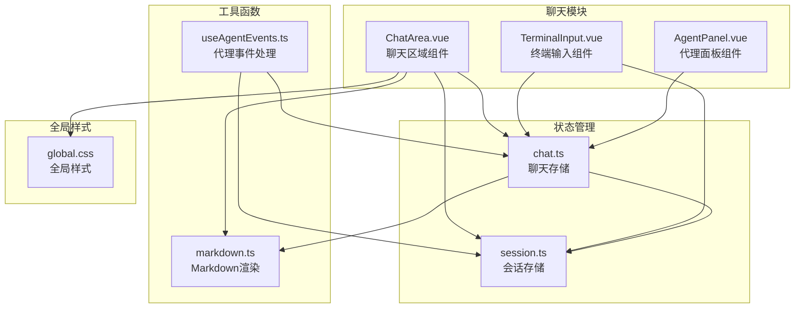

**图表来源**
- [ChatArea.vue:1-50](file://src/components/chat/ChatArea.vue#L1-L50)
- [chat.ts:1-50](file://src/stores/chat.ts#L1-L50)
- [session.ts:1-50](file://src/stores/session.ts#L1-L50)

**章节来源**
- [ChatArea.vue:1-100](file://src/components/chat/ChatArea.vue#L1-L100)
- [chat.ts:1-100](file://src/stores/chat.ts#L1-L100)
- [session.ts:1-100](file://src/stores/session.ts#L1-L100)

## 核心组件

### ChatArea 组件架构

ChatArea 组件采用响应式设计，通过 Vue 3 的 Composition API 实现了复杂的状态管理和事件处理机制：

#### 主要功能特性

1. **消息渲染系统**
   - 支持 Markdown 到 HTML 的实时转换
   - 增量渲染优化，避免全量重绘
   - 工具状态和令牌使用信息展示

2. **HTML 内容处理**
   - 安全的 HTML 注入机制
   - 自定义标签和样式的支持
   - 动态内容更新和缓存

3. **滚动控制系统**
   - 智能滚动定位
   - 底部自动跟随功能
   - 滚动位置记忆

4. **右键菜单系统**
   - 撤回操作菜单
   - 条件显示逻辑
   - 菜单位置计算

5. **工作目录指示器**
   - 路径截断显示
   - 沙盒环境标识
   - 实时路径更新

**章节来源**
- [ChatArea.vue:80-120](file://src/components/chat/ChatArea.vue#L80-L120)
- [chat.ts:169-248](file://src/stores/chat.ts#L169-L248)

## 架构概览

ChatArea 组件的架构基于 MVVM 模式，通过清晰的分层设计实现了高内聚低耦合：

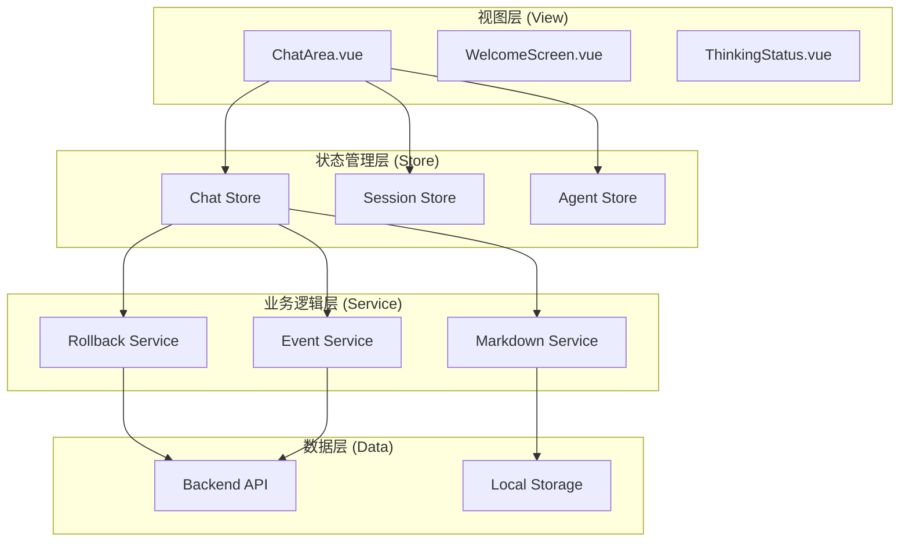

**图表来源**
- [ChatArea.vue:1-20](file://src/components/chat/ChatArea.vue#L1-L20)
- [chat.ts:38-657](file://src/stores/chat.ts#L38-L657)
- [session.ts:54-162](file://src/stores/session.ts#L54-L162)

## 详细组件分析

### 消息渲染机制

ChatArea 的消息渲染系统采用了先进的增量渲染技术，确保在大量数据更新时仍能保持高性能：

#### 增量渲染算法

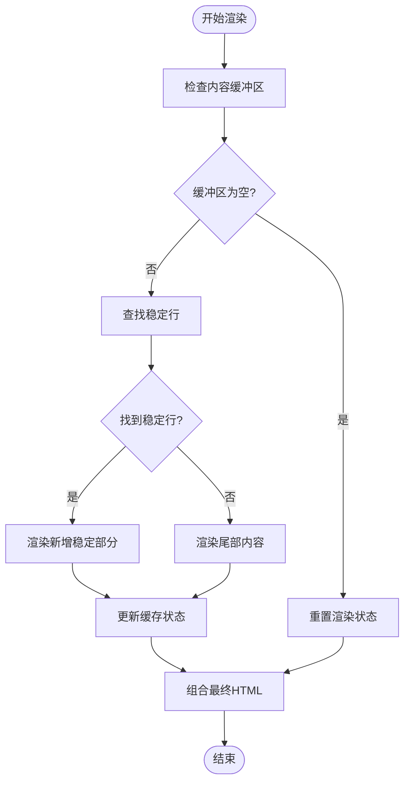

**图表来源**
- [chat.ts:186-248](file://src/stores/chat.ts#L186-L248)

#### Markdown 渲染流程

组件使用专门的 Markdown 渲染器，支持丰富的格式化选项：

| 渲染类型 | 处理方式 | 性能特征 |
|---------|----------|----------|
| 标准文本 | 直接渲染 | O(n) |
| 代码块 | 语法高亮 | O(n log n) |
| 列表 | 结构化渲染 | O(n) |
| 链接 | 安全处理 | O(n) |
| 表格 | DOM 操作 | O(n²) |

**章节来源**
- [chat.ts:246-285](file://src/stores/chat.ts#L246-L285)
- [markdown.ts:40-88](file://src/utils/markdown.ts#L40-L88)

### HTML 内容处理

#### 安全的 HTML 注入

ChatArea 采用严格的安全策略处理 HTML 内容：

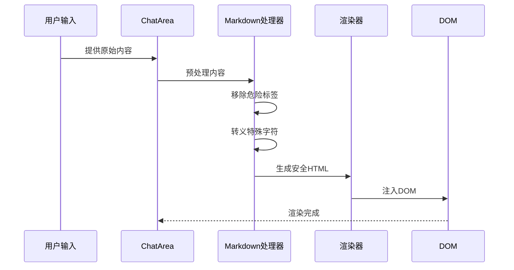

**图表来源**
- [ChatArea.vue:278-286](file://src/components/chat/ChatArea.vue#L278-L286)
- [markdown.ts:40-46](file://src/utils/markdown.ts#L40-L46)

#### 动态内容更新

组件支持实时内容更新，通过以下机制实现：

1. **缓冲区管理**：分离稳定和不稳定内容
2. **增量更新**：只重新渲染变化的部分
3. **缓存策略**：避免重复计算

**章节来源**
- [chat.ts:186-248](file://src/stores/chat.ts#L186-L248)

### 滚动控制逻辑

#### 智能滚动算法

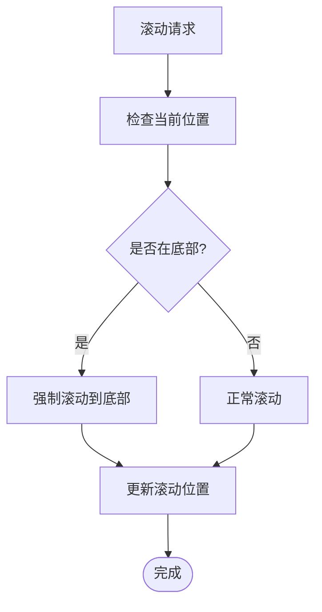

**图表来源**
- [ChatArea.vue:88-97](file://src/components/chat/ChatArea.vue#L88-L97)

#### 滚动回调注册

组件通过回调机制与其他组件协作：

| 回调类型 | 触发时机 | 参数 | 用途 |
|---------|----------|------|------|
| scrollToBottom | 新消息到达 | force: boolean | 自动滚动 |
| registerScrollCb | 组件挂载 | 函数引用 | 注册回调 |
| forceScrollToBottom | 用户点击 | 无 | 强制滚动 |

**章节来源**
- [ChatArea.vue:256-265](file://src/components/chat/ChatArea.vue#L256-L265)
- [chat.ts:178-184](file://src/stores/chat.ts#L178-L184)

### 右键菜单系统

#### 撤回菜单实现

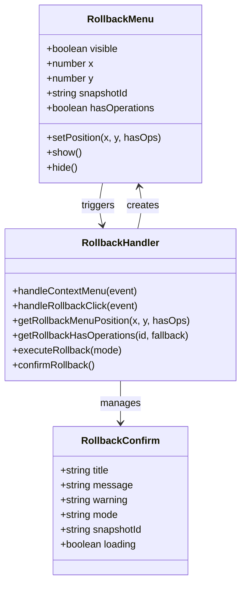

**图表来源**
- [ChatArea.vue:57-191](file://src/components/chat/ChatArea.vue#L57-L191)

#### 菜单位置计算

菜单系统实现了智能定位算法，确保菜单始终在可视区域内：

| 计算参数 | 默认值 | 边界处理 |
|---------|--------|----------|
| 菜单宽度 | 220px | 最大窗口宽度 |
| 菜单高度 | 74px/118px | 最大窗口高度 |
| 边距 | 12px | 最小边界距离 |
| 宽度调整 | 自适应 | 超出时缩小 |

**章节来源**
- [ChatArea.vue:153-172](file://src/components/chat/ChatArea.vue#L153-L172)

### 撤回功能实现

#### 撤回流程

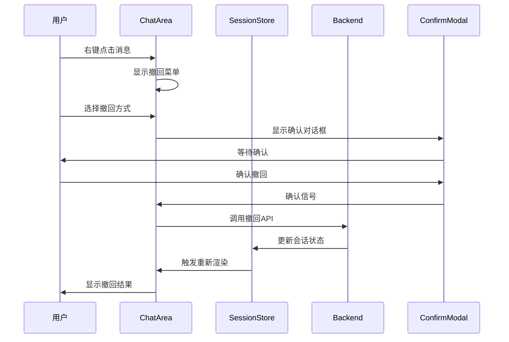

**图表来源**
- [ChatArea.vue:193-254](file://src/components/chat/ChatArea.vue#L193-L254)
- [chat.ts:542-592](file://src/stores/chat.ts#L542-L592)

#### 撤回确认机制

撤回操作包含多重安全检查：

1. **权限验证**：检查用户是否有撤回权限
2. **状态检查**：验证会话状态是否允许撤回
3. **数据完整性**：确保相关数据完整可用
4. **用户确认**：二次确认防止误操作

**章节来源**
- [ChatArea.vue:211-254](file://src/components/chat/ChatArea.vue#L211-L254)

### 工作目录指示器

#### 路径显示逻辑

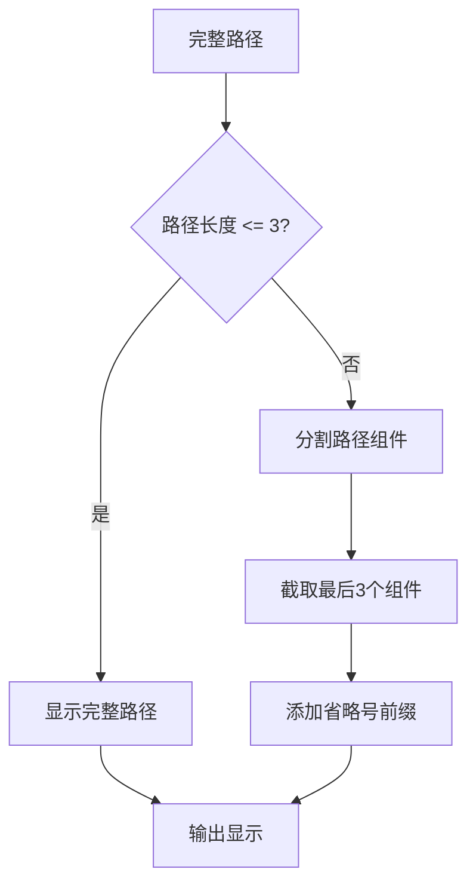

**图表来源**
- [ChatArea.vue:80-86](file://src/components/chat/ChatArea.vue#L80-L86)

#### 沙盒环境标识

工作目录指示器提供清晰的环境标识：

| 标识元素 | 作用 | 样式特征 |
|---------|------|----------|
| 图标 | 环境类型标识 | 绿色强调色 |
| 标签 | 沙盒环境说明 | 小字体粗体 |
| 路径 | 实际工作路径 | 等宽字体 |
| 提示 | 完整路径显示 | 标题属性 |

**章节来源**
- [ChatArea.vue:270-276](file://src/components/chat/ChatArea.vue#L270-L276)

### 欢迎界面

#### 欢迎屏幕组件

当没有聊天历史时，ChatArea 显示欢迎界面：

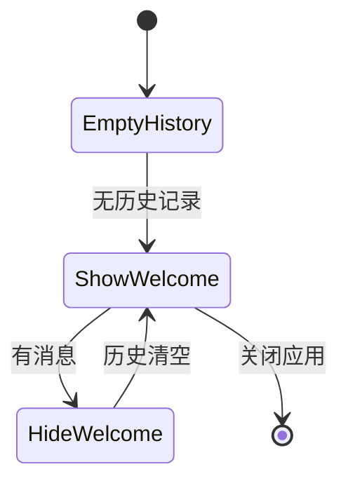

**图表来源**
- [ChatArea.vue](file://src/components/chat/ChatArea.vue#L277)

### 动画效果

#### 消息进入动画

```mermaid
graph LR
subgraph "动画序列"
A[初始状态<br/>opacity: 0<br/>transform: translateY(8px)<br/>scale: 0.98] --> B[过渡状态<br/>opacity: 0.5<br/>transform: translateY(4px)<br/>scale: 0.99]
B --> C[最终状态<br/>opacity: 1<br/>transform: translateY(0)<br/>scale: 1]
end
style A fill:#e1f5fe
style C fill:#c8e6c9
```

**图表来源**
- [ChatArea.vue:586-589](file://src/components/chat/ChatArea.vue#L586-L589)

#### 毛玻璃效果

组件使用 CSS 变量实现动态主题切换：

| CSS 变量 | 浅色模式 | 深色模式 |
|---------|----------|----------|
| --glass-bg | rgba(255,255,255,0.45) | rgba(15,17,25,0.45) |
| --glass-border | rgba(255,255,255,0.35) | rgba(255,255,255,0.08) |
| --glass-blur | 16px | 20px |
| --accent-blue | #3b82f6 | #60a5fa |

**章节来源**
- [ChatArea.vue:579-644](file://src/components/chat/ChatArea.vue#L579-L644)
- [global.css:39-114](file://src/assets/global.css#L39-L114)

### 响应式设计

#### 布局适配

组件支持多种屏幕尺寸：

| 屏幕尺寸 | 最小宽度 | 消息宽度 | 动画行为 |
|---------|----------|----------|----------|
| 移动设备 | 320px | 90% | 简化动画 |
| 平板设备 | 768px | 85% | 标准动画 |
| 桌面设备 | 1024px | 85% | 完整动画 |
| 大屏设备 | 1440px | 85% | 完整动画 |

**章节来源**
- [ChatArea.vue:698-701](file://src/components/chat/ChatArea.vue#L698-L701)

## 依赖关系分析

### 组件间依赖

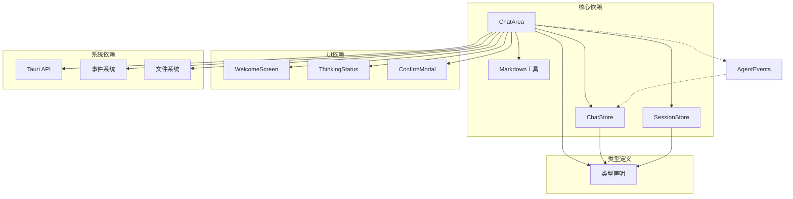

**图表来源**
- [ChatArea.vue:1-10](file://src/components/chat/ChatArea.vue#L1-L10)
- [chat.ts:1-10](file://src/stores/chat.ts#L1-L10)

### 状态管理依赖

| 依赖组件 | 使用方式 | 数据流向 |
|---------|----------|----------|
| ChatStore | 读取/写入 | 单向数据流 |
| SessionStore | 读取/写入 | 单向数据流 |
| AgentStore | 读取 | 单向数据流 |
| PermissionStore | 读取 | 单向数据流 |

**章节来源**
- [chat.ts:1-20](file://src/stores/chat.ts#L1-L20)
- [session.ts:1-20](file://src/stores/session.ts#L1-L20)

## 性能考虑

### 渲染优化

#### 增量渲染策略

ChatArea 实现了高效的增量渲染机制：

1. **稳定行检测**：通过换行符识别稳定内容
2. **缓存机制**：缓存已渲染的稳定部分
3. **节流控制**：限制渲染频率至约 30fps
4. **虚拟 DOM**：最小化 DOM 操作

#### 内存管理

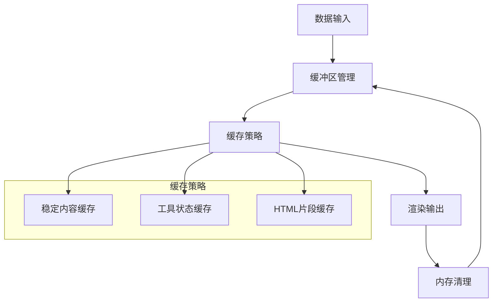

**图表来源**
- [chat.ts:169-176](file://src/stores/chat.ts#L169-L176)

### 事件处理优化

#### 事件监听器管理

组件实现了智能的事件监听器管理：

| 事件类型 | 监听器数量 | 生命周期 | 优化策略 |
|---------|------------|----------|----------|
| 滚动事件 | 1 | 组件卸载时清除 | 使用 onUnmounted |
| 点击事件 | 1 | 文档级别 | 使用事件委托 |
| 键盘事件 | 1 | 组件挂载时注册 | 条件绑定 |
| 窗口事件 | 1 | 全局监听 | 节流处理 |

**章节来源**
- [ChatArea.vue:256-265](file://src/components/chat/ChatArea.vue#L256-L265)

### 性能监控

#### 关键性能指标

| 指标名称 | 正常范围 | 监控方法 | 优化目标 |
|---------|----------|----------|----------|
| 渲染帧率 | ≥ 30fps | requestAnimationFrame | ≥ 60fps |
| 内存使用 | < 50MB | Performance API | < 100MB |
| DOM 操作 | < 100次/秒 | MutationObserver | < 50次/秒 |
| 重排重绘 | < 10次/秒 | Chrome DevTools | < 5次/秒 |

## 故障排除指南

### 常见问题诊断

#### 渲染问题

| 问题症状 | 可能原因 | 解决方案 |
|---------|----------|----------|
| 消息不显示 | Markdown 渲染错误 | 检查内容格式 |
| 滚动异常 | 滚动位置计算错误 | 重置滚动回调 |
| 动画卡顿 | 渲染频率过高 | 启用节流机制 |
| 菜单位置错误 | 窗口尺寸计算错误 | 重新计算位置 |

#### 性能问题

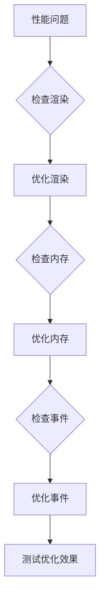

**图表来源**
- [chat.ts:250-267](file://src/stores/chat.ts#L250-L267)

### 调试技巧

#### 开发者工具使用

1. **Vue DevTools**：检查组件状态和生命周期
2. **Performance 面板**：分析渲染性能
3. **Memory 面板**：监控内存泄漏
4. **Network 面板**：检查 API 调用

#### 日志记录

组件提供了详细的日志记录机制：

| 日志级别 | 用途 | 触发条件 |
|---------|------|----------|
| Info | 正常操作 | 成功的 API 调用 |
| Warning | 警告信息 | 可能的问题 |
| Error | 错误信息 | API 调用失败 |
| Debug | 调试信息 | 开发模式启用 |

**章节来源**
- [ChatArea.vue:187-190](file://src/components/chat/ChatArea.vue#L187-L190)

## 结论

ChatArea 聊天区域组件是一个功能完整、性能优异的现代化 Vue 3 组件。它成功地将复杂的聊天功能封装在一个易于使用的界面中，同时保持了优秀的性能表现和用户体验。

### 主要优势

1. **高性能渲染**：通过增量渲染和缓存机制实现高效的消息显示
2. **丰富的交互**：支持右键菜单、撤回操作、实时滚动等高级功能
3. **优雅的视觉设计**：采用 Glassmorphism 设计风格，提供现代化的视觉体验
4. **良好的可维护性**：清晰的代码结构和完善的类型定义

### 技术亮点

- **智能滚动控制**：自动跟踪用户意图，提供无缝的滚动体验
- **安全的 HTML 处理**：严格的输入验证和转义机制
- **响应式设计**：适配各种屏幕尺寸和设备类型
- **动画优化**：精心设计的动画效果提升用户体验

该组件为 JarvisAgent 应用程序提供了坚实的前端基础，是整个聊天功能模块的核心支撑。

## 附录

### 组件使用示例

#### 基本使用

```vue
<template>
  <ChatArea />
</template>

<script setup>
import ChatArea from '@/components/chat/ChatArea.vue'
</script>
```

#### 自定义配置

```vue
<template>
  <ChatArea 
    :theme="darkMode"
    :animation-enabled="false"
    :scroll-behavior="'instant'"
  />
</template>
```

### 自定义样式指南

#### CSS 变量覆盖

```css
.custom-theme {
  --chat-bg: #f8fafc;
  --message-user-bg: #dbeafe;
  --message-agent-bg: #f1f5f9;
  --border-radius: 12px;
  --animation-duration: 0.3s;
}
```

#### 动画定制

```css
.custom-animation {
  animation-duration: var(--animation-duration, 0.25s);
  animation-timing-function: cubic-bezier(0.4, 0, 0.2, 1);
}
```

### 性能优化建议

#### 代码层面优化

1. **懒加载组件**：对不常用的功能组件实现懒加载
2. **虚拟滚动**：对于大量消息场景使用虚拟滚动
3. **Web Workers**：将重型计算移至 Web Worker
4. **缓存策略**：合理设置缓存失效时间

#### 运行时优化

1. **内存监控**：定期检查内存使用情况
2. **垃圾回收**：及时清理不再使用的对象
3. **事件解绑**：确保组件卸载时正确清理事件监听器
4. **资源释放**：及时释放大对象和媒体资源