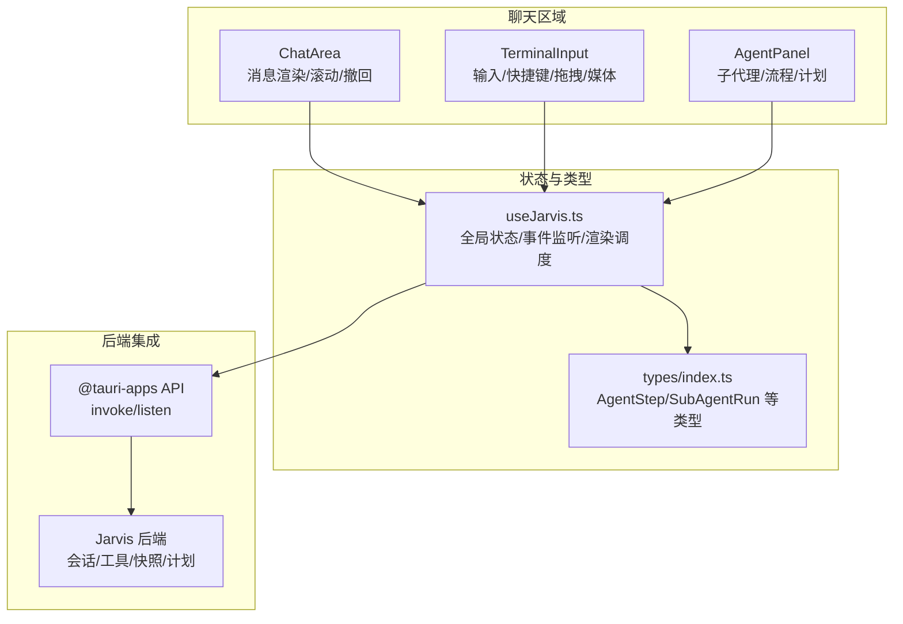
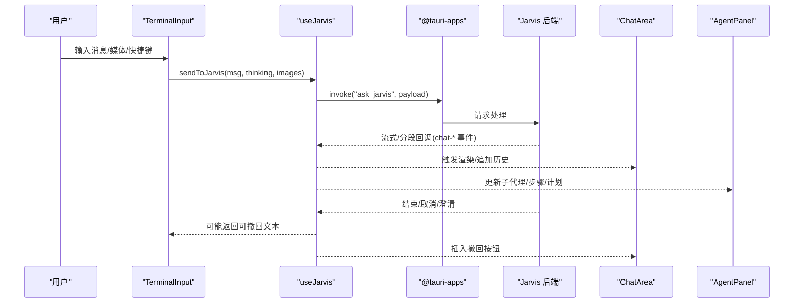
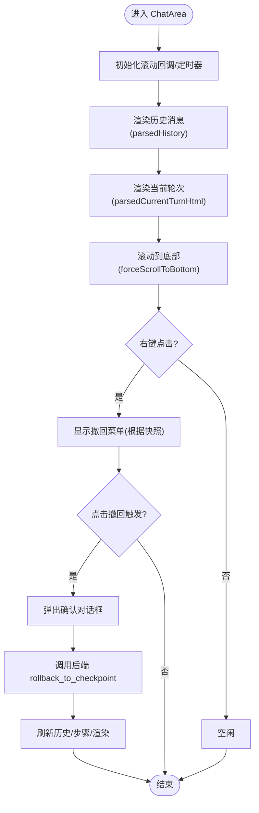
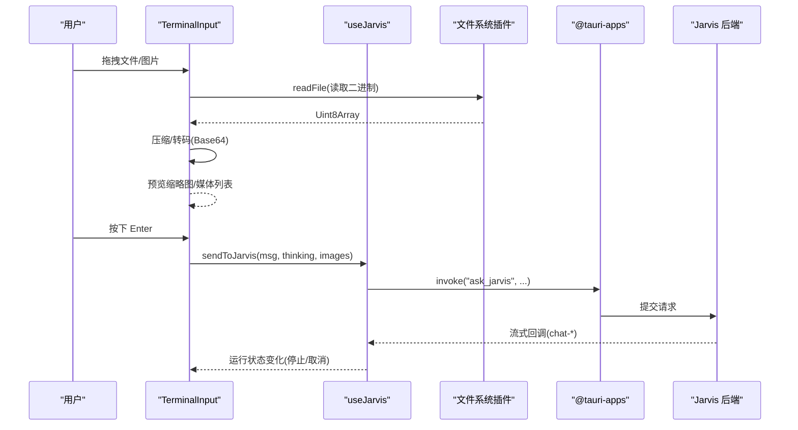
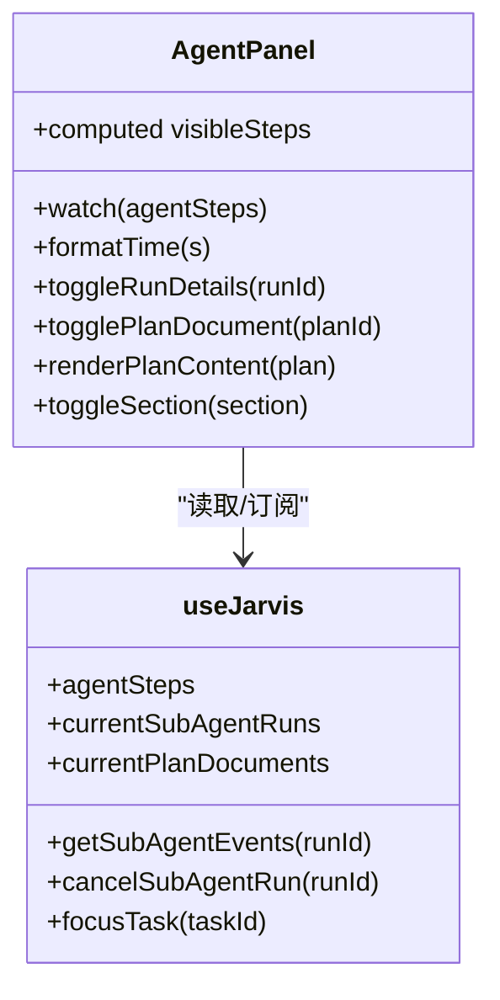
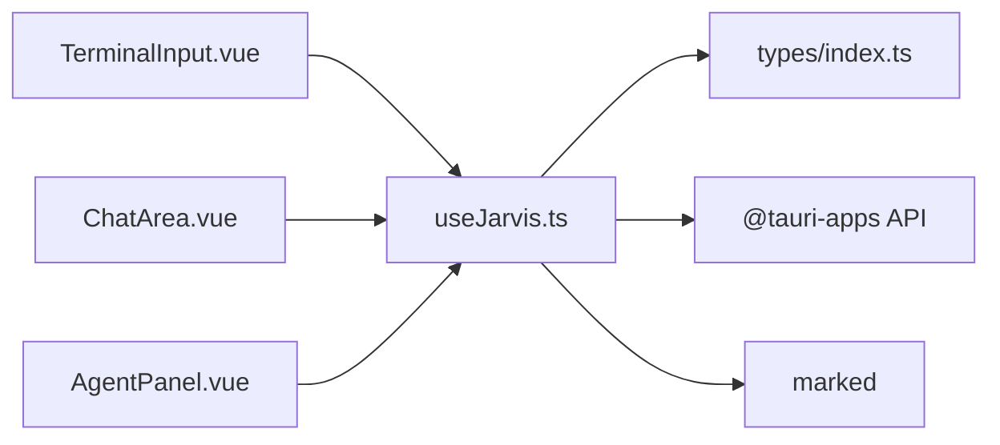

# 聊天组件

<cite>
**本文档引用的文件**
- [ChatArea.vue](file://src/components/chat/ChatArea.vue)
- [TerminalInput.vue](file://src/components/chat/TerminalInput.vue)
- [AgentPanel.vue](file://src/components/chat/AgentPanel.vue)
- [useJarvis.ts](file://src/composables/useJarvis.ts)
- [index.ts](file://src/types/index.ts)
</cite>

## 目录
1. [简介](#简介)
2. [项目结构](#项目结构)
3. [核心组件](#核心组件)
4. [架构总览](#架构总览)
5. [组件详细分析](#组件详细分析)
6. [依赖关系分析](#依赖关系分析)
7. [性能考量](#性能考量)
8. [故障排查指南](#故障排查指南)
9. [结论](#结论)
10. [附录](#附录)

## 简介
本文件面向 JarvisAgent 的聊天组件，围绕 ChatArea、TerminalInput、AgentPanel 三大核心组件进行深入解析。内容涵盖：
- ChatArea 的消息渲染机制、滚动控制、右键撤回功能、工作目录指示器
- TerminalInput 的输入处理、快捷键绑定、拖拽上传、媒体预览、模型能力检测与深度思考开关
- AgentPanel 的代理状态显示、执行进度、思维过程展示、子代理运行面板、任务计划面板
- 组件间通信机制、状态管理、事件处理与样式系统
- 实际使用示例与自定义指南

## 项目结构
聊天组件位于 src/components/chat 目录下，配合全局状态管理 useJarvis.ts 与类型定义 index.ts 使用。整体采用 Vue 3 Composition API 设计，通过 Tauri 事件与后端交互，实现前后端协同的智能对话体验。

图表来源
- [ChatArea.vue:1-1019](file://src/components/chat/ChatArea.vue#L1-L1019)
- [TerminalInput.vue:1-886](file://src/components/chat/TerminalInput.vue#L1-L886)
- [AgentPanel.vue:1-1015](file://src/components/chat/AgentPanel.vue#L1-L1015)
- [useJarvis.ts:1-1354](file://src/composables/useJarvis.ts#L1-L1354)
- [index.ts:1-365](file://src/types/index.ts#L1-L365)

章节来源
- [ChatArea.vue:1-1019](file://src/components/chat/ChatArea.vue#L1-L1019)
- [TerminalInput.vue:1-886](file://src/components/chat/TerminalInput.vue#L1-L886)
- [AgentPanel.vue:1-1015](file://src/components/chat/AgentPanel.vue#L1-L1015)
- [useJarvis.ts:1-1354](file://src/composables/useJarvis.ts#L1-L1354)
- [index.ts:1-365](file://src/types/index.ts#L1-L365)

## 核心组件
- ChatArea：负责历史消息与当前轮次消息的渲染、滚动控制、右键撤回菜单、工作目录指示器与“思考中”状态展示。
- TerminalInput：负责用户输入、快捷键 Enter 发送、Shift+Enter 换行、拖拽文件/媒体、模型能力检测（思考/视觉）、深度思考开关、停止生成与媒体预览。
- AgentPanel：负责子代理运行状态、执行流程步骤、思维过程详情、任务计划文档展示与交互。

章节来源
- [ChatArea.vue:1-1019](file://src/components/chat/ChatArea.vue#L1-L1019)
- [TerminalInput.vue:1-886](file://src/components/chat/TerminalInput.vue#L1-L886)
- [AgentPanel.vue:1-1015](file://src/components/chat/AgentPanel.vue#L1-L1015)

## 架构总览
组件通过 useJarvis 提供的全局状态与事件监听，实现与后端的双向通信。TerminalInput 将用户消息与媒体发送至后端；ChatArea 渲染历史与当前轮次响应，并在需要时插入“撤回”触发按钮；AgentPanel 展示子代理运行、执行步骤与计划文档。

图表来源
- [TerminalInput.vue:251-268](file://src/components/chat/TerminalInput.vue#L251-L268)
- [useJarvis.ts:934-1086](file://src/composables/useJarvis.ts#L934-L1086)
- [useJarvis.ts:679-790](file://src/composables/useJarvis.ts#L679-L790)
- [ChatArea.vue:195-256](file://src/components/chat/ChatArea.vue#L195-L256)

## 组件详细分析

### ChatArea 组件
- 消息渲染
  - 历史消息：通过 computed 的 parsedHistory 渲染存储的历史 HTML 或消息数组，支持 Markdown 解析与工具详情块。
  - 当前轮次：通过 parsedCurrentTurnHtml 动态拼接思考缓冲区与工具缓冲区，结合标记语言渲染，实时展示“思考中”状态与计时器。
  - 计算逻辑：useJarvis 提供的 buffers（thinkingBuffer/toolBuffer/contentBuffer/tempBuffer）与状态（status/runStartTime）驱动渲染。
- 滚动控制
  - 注册滚动回调 registerScrollCb，在渲染或新增消息时自动滚动到底部；支持强制滚动 forceScrollToBottom。
  - 在组件挂载时注册回调，确保首次渲染与后续更新均保持良好阅读体验。
- 右键撤回功能
  - 支持在用户消息气泡上右键弹出菜单，根据快照检查点决定是否显示“会话和代码撤回”选项。
  - 菜单位置动态计算，避免越界；点击后弹出确认框，调用后端接口执行撤回并刷新视图。
- 工作目录指示器
  - 显示当前会话的工作目录，路径过长时以“.../”形式截断，便于识别当前沙盒环境。
- “思考中”状态
  - 当会话处于运行状态时，显示旋转动画与计时器，直观反映代理的思考耗时。

图表来源
- [ChatArea.vue:270-439](file://src/components/chat/ChatArea.vue#L270-L439)
- [ChatArea.vue:90-267](file://src/components/chat/ChatArea.vue#L90-L267)
- [useJarvis.ts:568-596](file://src/composables/useJarvis.ts#L568-L596)

章节来源
- [ChatArea.vue:1-1019](file://src/components/chat/ChatArea.vue#L1-L1019)
- [useJarvis.ts:529-573](file://src/composables/useJarvis.ts#L529-L573)

### TerminalInput 组件
- 输入处理
  - 文本域支持自动高度调整，最大高度限制；支持 Shift+Enter 换行，Enter 发送。
  - 发送时将用户消息与媒体 Base64 列表一并提交，若当前会话运行中则阻止重复发送。
- 快捷键绑定
  - Enter 发送，Shift+Enter 换行；在运行中时显示“停止生成”按钮，支持取消当前会话。
- 模型能力检测与深度思考
  - 从后端查询当前主模型的能力（thinking/vision），动态启用/禁用“深度思考”按钮与视觉警告。
  - 若模型不支持视觉，拖拽图片/视频会显示警告提示。
- 拖拽上传与媒体预览
  - 监听窗口拖拽事件，支持图片/视频拖入；对图片进行压缩与转码，生成缩略图与 Base64 数据。
  - 媒体列表支持移除，自动释放对象 URL。
- 历史回放
  - 监听撤销回放事件，将被撤回的消息文本写入输入框，便于二次编辑。

图表来源
- [TerminalInput.vue:136-189](file://src/components/chat/TerminalInput.vue#L136-L189)
- [TerminalInput.vue:242-268](file://src/components/chat/TerminalInput.vue#L242-L268)
- [useJarvis.ts:934-1086](file://src/composables/useJarvis.ts#L934-L1086)

章节来源
- [TerminalInput.vue:1-886](file://src/components/chat/TerminalInput.vue#L1-L886)
- [useJarvis.ts:898-925](file://src/composables/useJarvis.ts#L898-L925)

### AgentPanel 组件
- 子代理运行面板
  - 展示当前会话下的子代理运行列表，包括状态、阶段、轮次、令牌用量、摘要与错误信息。
  - 支持展开/折叠事件日志，显示时间戳、事件类型与详情；支持取消运行。
- 执行流程面板
  - 将 AgentStep 转换为可视化的步骤流，标注“思考/计划/工具调用/结果/错误/取消”等状态。
  - 最新运行步骤高亮，鼠标悬停显示详细说明；自动滚动至最新步骤。
- 任务计划面板
  - 展示计划文档标题、状态（待审批/已同意/已拒绝）与内容；支持展开查看 Markdown 内容。
- 交互与状态
  - 通过 useJarvis 的 computed 与事件监听，自动更新面板内容；支持用户手动切换面板区域的展开/折叠。

图表来源
- [AgentPanel.vue:153-208](file://src/components/chat/AgentPanel.vue#L153-L208)
- [AgentPanel.vue:400-426](file://src/components/chat/AgentPanel.vue#L400-L426)
- [useJarvis.ts:381-416](file://src/composables/useJarvis.ts#L381-L416)

章节来源
- [AgentPanel.vue:1-1015](file://src/components/chat/AgentPanel.vue#L1-L1015)
- [useJarvis.ts:381-416](file://src/composables/useJarvis.ts#L381-L416)

## 依赖关系分析
- 组件耦合
  - ChatArea 与 TerminalInput 共享 useJarvis 的全局状态与渲染调度；AgentPanel 通过 useJarvis 的 computed 与事件监听独立更新。
- 外部依赖
  - @tauri-apps/api/core 用于后端调用 invoke
  - @tauri-apps/api/event 用于事件监听
  - @tauri-apps/plugin-fs 用于读取本地文件
  - marked 用于 Markdown 渲染
- 类型系统
  - types/index.ts 定义了 AgentStep、SubAgentRun、SubAgentEvent、PlanDocument 等关键类型，保证前后端数据一致性。

图表来源
- [TerminalInput.vue:1-8](file://src/components/chat/TerminalInput.vue#L1-L8)
- [ChatArea.vue:1-6](file://src/components/chat/ChatArea.vue#L1-L6)
- [AgentPanel.vue:1-6](file://src/components/chat/AgentPanel.vue#L1-L6)
- [useJarvis.ts:1-6](file://src/composables/useJarvis.ts#L1-L6)
- [index.ts:1-365](file://src/types/index.ts#L1-L365)

章节来源
- [TerminalInput.vue:1-8](file://src/components/chat/TerminalInput.vue#L1-L8)
- [ChatArea.vue:1-6](file://src/components/chat/ChatArea.vue#L1-L6)
- [AgentPanel.vue:1-6](file://src/components/chat/AgentPanel.vue#L1-L6)
- [useJarvis.ts:1-6](file://src/composables/useJarvis.ts#L1-L6)
- [index.ts:1-365](file://src/types/index.ts#L1-L365)

## 性能考量
- 渲染节流
  - ChatArea 与 useJarvis 对当前轮次渲染采用 requestAnimationFrame 节流，避免频繁 DOM 更新导致卡顿。
- 滚动优化
  - 仅在底部附近或强制滚动时才滚动到底部，减少不必要的滚动计算。
- 媒体处理
  - 图片压缩与 OffscreenCanvas 转码在主线程外进行，降低主线程压力；及时释放对象 URL，避免内存泄漏。
- 事件监听
  - 组件卸载时正确移除事件监听与拖拽监听，防止内存泄漏与重复注册。

章节来源
- [useJarvis.ts:568-573](file://src/composables/useJarvis.ts#L568-L573)
- [TerminalInput.vue:37-70](file://src/components/chat/TerminalInput.vue#L37-L70)
- [TerminalInput.vue:221-228](file://src/components/chat/TerminalInput.vue#L221-L228)

## 故障排查指南
- 无法发送消息
  - 检查 activeSessionId 是否存在；确认 isCurrentSessionRunning 状态；确认输入非空或媒体列表非空。
  - 参考路径：[TerminalInput.vue:251-268](file://src/components/chat/TerminalInput.vue#L251-L268)，[useJarvis.ts:934-939](file://src/composables/useJarvis.ts#L934-L939)
- 撤回无效
  - 确认快照检查点是否存在；检查 hasOperations 字段；确认后端接口调用成功。
  - 参考路径：[ChatArea.vue:176-193](file://src/components/chat/ChatArea.vue#L176-L193)，[ChatArea.vue:213-256](file://src/components/chat/ChatArea.vue#L213-L256)
- 媒体无法显示
  - 检查模型能力（vision）；确认 Base64 编码与缩略图生成；确认对象 URL 释放。
  - 参考路径：[TerminalInput.vue:136-189](file://src/components/chat/TerminalInput.vue#L136-L189)，[TerminalInput.vue:37-70](file://src/components/chat/TerminalInput.vue#L37-L70)
- 子代理状态不更新
  - 检查后端事件监听是否正常；确认 subagent-updated/subagent-event 事件是否到达。
  - 参考路径：[useJarvis.ts:792-814](file://src/composables/useJarvis.ts#L792-L814)，[AgentPanel.vue:344-388](file://src/components/chat/AgentPanel.vue#L344-L388)

章节来源
- [TerminalInput.vue:251-268](file://src/components/chat/TerminalInput.vue#L251-L268)
- [ChatArea.vue:176-193](file://src/components/chat/ChatArea.vue#L176-L193)
- [ChatArea.vue:213-256](file://src/components/chat/ChatArea.vue#L213-L256)
- [TerminalInput.vue:136-189](file://src/components/chat/TerminalInput.vue#L136-L189)
- [TerminalInput.vue:37-70](file://src/components/chat/TerminalInput.vue#L37-L70)
- [useJarvis.ts:792-814](file://src/composables/useJarvis.ts#L792-L814)
- [AgentPanel.vue:344-388](file://src/components/chat/AgentPanel.vue#L344-L388)

## 结论
ChatArea、TerminalInput、AgentPanel 三者通过 useJarvis 的统一状态与事件系统紧密协作，形成完整的聊天交互闭环。ChatArea 提供沉浸式消息展示与便捷的撤回能力；TerminalInput 支持富输入与模型能力适配；AgentPanel 则将抽象的执行过程可视化，帮助用户理解与掌控代理行为。整体设计注重性能与可用性，适合在复杂多轮对话场景中稳定运行。

## 附录
- 实际使用示例
  - 发送消息：在 TerminalInput 中输入文本，按下 Enter 即可发送；若需深度思考，可在发送前开启“深度思考”按钮。
  - 撤回消息：在用户消息气泡上右键，选择“会话和代码撤回”或“会话撤回”，确认后即可撤销。
  - 查看执行过程：打开 AgentPanel，查看“执行流程”面板中的步骤流，悬停可查看详细说明。
- 自定义指南
  - 修改样式：通过 scoped 样式覆盖变量与类名，例如 .response-area、.chat-message、.agent-panel 等。
  - 扩展输入：在 TerminalInput 中扩展拖拽处理逻辑，支持更多文件类型或自定义压缩策略。
  - 增强面板：在 AgentPanel 中增加新的面板区域或事件类型，结合 useJarvis 的事件监听扩展。