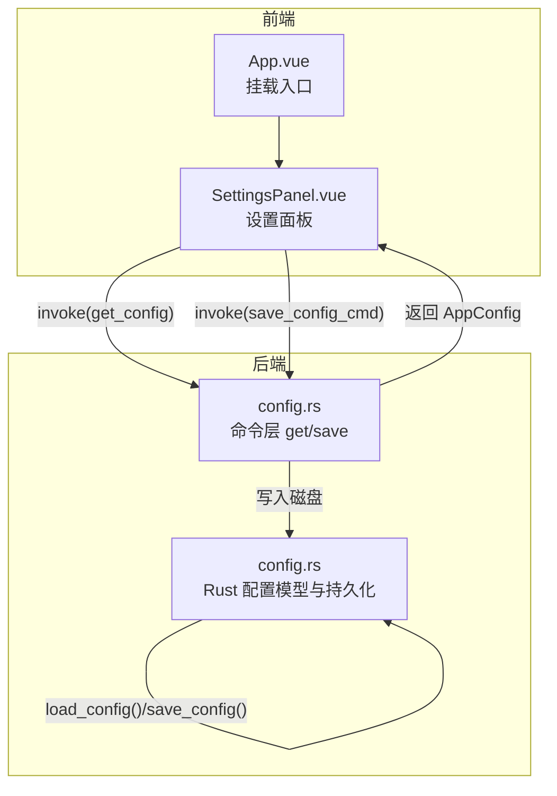
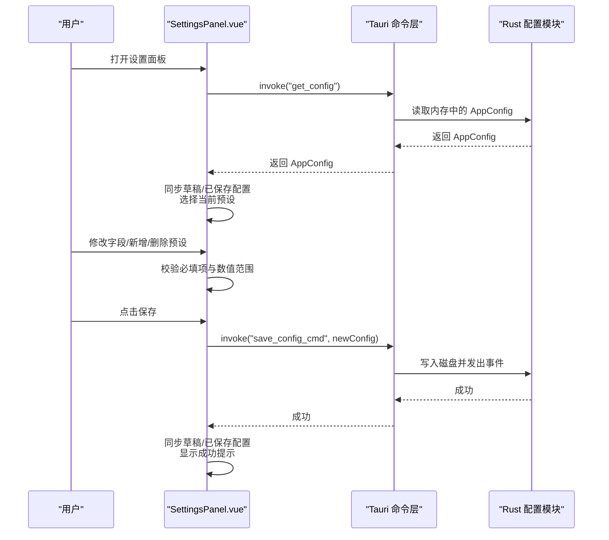
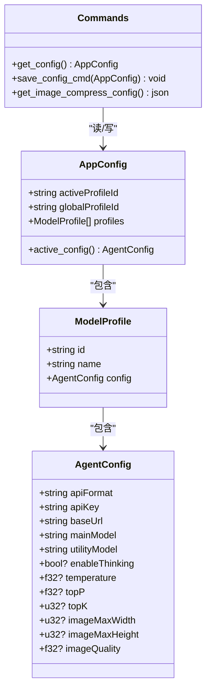

# 设置组件

<cite>
**本文引用的文件**
- [SettingsPanel.vue](file://src/components/settings/SettingsPanel.vue)
- [config.rs](file://src-tauri/src/core/commands/config.rs)
- [config.rs](file://src-tauri/src/core/config.rs)
- [App.vue](file://src/App.vue)
</cite>

## 目录
1. [简介](#简介)
2. [项目结构](#项目结构)
3. [核心组件](#核心组件)
4. [架构总览](#架构总览)
5. [详细组件分析](#详细组件分析)
6. [依赖关系分析](#依赖关系分析)
7. [性能考量](#性能考量)
8. [故障排查指南](#故障排查指南)
9. [结论](#结论)
10. [附录](#附录)

## 简介
本文件面向 JarvisAgent 的设置组件，系统性解析 SettingsPanel 设置面板的设计原理与实现细节。重点覆盖以下方面：
- 设置项的分类管理与布局设计
- 配置项的动态生成与数据绑定
- 表单验证机制与错误提示
- 配置保存逻辑与持久化
- 预设管理（新增、切换、删除）、全局默认预设
- 实时能力探测与模型能力展示
- 默认值处理、类型规范化与兼容迁移
- 扩展指南、自定义配置方法与用户体验优化建议

## 项目结构
设置组件位于前端 Vue 单文件组件中，通过 Tauri 命令与后端 Rust 配置模块交互，最终落盘到本地配置文件。

图表来源
- [App.vue:1-82](file://src/App.vue#L1-L82)
- [SettingsPanel.vue:1-983](file://src/components/settings/SettingsPanel.vue#L1-L983)
- [config.rs:1-41](file://src-tauri/src/core/commands/config.rs#L1-L41)
- [config.rs:1-191](file://src-tauri/src/core/config.rs#L1-L191)

章节来源
- [App.vue:1-82](file://src/App.vue#L1-L82)
- [SettingsPanel.vue:1-983](file://src/components/settings/SettingsPanel.vue#L1-L983)
- [config.rs:1-41](file://src-tauri/src/core/commands/config.rs#L1-L41)
- [config.rs:1-191](file://src-tauri/src/core/config.rs#L1-L191)

## 核心组件
- 设置面板组件：负责渲染侧边预设列表、右侧编辑区、状态提示与保存按钮；内部维护草稿配置与已保存配置的双轨状态，确保撤销与即时预览。
- 命令层：提供读取配置、保存配置、查询图片压缩参数等命令。
- 配置模型：定义 AgentConfig、ModelProfile、AppConfig 结构，支持默认值、URL 规范化与旧配置迁移。

章节来源
- [SettingsPanel.vue:204-533](file://src/components/settings/SettingsPanel.vue#L204-L533)
- [config.rs:4-41](file://src-tauri/src/core/commands/config.rs#L4-L41)
- [config.rs:11-135](file://src-tauri/src/core/config.rs#L11-L135)

## 架构总览
设置面板采用“草稿配置 + 后端持久化”的双轨设计。打开面板时拉取后端配置，编辑时仅修改草稿，保存时统一校验并提交到后端，成功后再同步到已保存状态。

图表来源
- [SettingsPanel.vue:363-532](file://src/components/settings/SettingsPanel.vue#L363-L532)
- [config.rs:4-27](file://src-tauri/src/core/commands/config.rs#L4-L27)
- [config.rs:146-191](file://src-tauri/src/core/config.rs#L146-L191)

## 详细组件分析

### 面板布局与交互
- 侧边栏：展示预设列表，支持添加新预设、切换当前选中、设为全局默认、删除（至少保留一个）。
- 编辑区：按分组展示配置项，包括基础信息、API 配置、模型配置、温度/TopP/TopK、图片压缩等。
- 底部状态栏：显示保存结果（成功/失败），保存按钮禁用条件与加载状态。
- 关闭行为：关闭时回滚草稿到已保存状态，清空确认弹窗与状态提示。

章节来源
- [SettingsPanel.vue:1-202](file://src/components/settings/SettingsPanel.vue#L1-L202)
- [SettingsPanel.vue:380-489](file://src/components/settings/SettingsPanel.vue#L380-L489)

### 数据模型与默认值
- AgentConfig：包含 API 格式、密钥、Base URL、主/工具模型、温度、TopP、TopK、图片压缩宽高与质量等字段；未提供时使用后端默认值。
- ModelProfile：包含 id、name、config。
- AppConfig：包含 active_profile_id、global_profile_id、profiles 列表；默认提供一个名为“默认预设”的预设。
- URL 规范化：根据 API 格式自动补全 Base URL 末尾路径（OpenAI 以 /chat/completions 结尾，Anthropic 以 /messages 结尾）。
- 兼容迁移：若检测到旧版 AgentConfig，自动迁移到新版 AppConfig 的单预设结构。

章节来源
- [config.rs:11-62](file://src-tauri/src/core/config.rs#L11-L62)
- [config.rs:64-85](file://src-tauri/src/core/config.rs#L64-L85)
- [config.rs:77-100](file://src-tauri/src/core/config.rs#L77-L100)
- [config.rs:102-135](file://src-tauri/src/core/config.rs#L102-L135)
- [config.rs:146-178](file://src-tauri/src/core/config.rs#L146-L178)

### 动态生成与数据绑定
- 预设列表：基于 draftConfig.profiles 渲染，点击切换选中项。
- 表单项：使用 v-model 双向绑定，支持字符串、数字、布尔等类型；数值输入带有 min/max/step 约束。
- 条件渲染：如 Top-K 仅在 Anthropic 格式下显示。
- 实时能力探测：主模型输入变更后延迟查询模型能力，展示流式、思考、温度、视觉、最大 Token 等能力徽章与备注。

章节来源
- [SettingsPanel.vue:20-52](file://src/components/settings/SettingsPanel.vue#L20-L52)
- [SettingsPanel.vue:60-175](file://src/components/settings/SettingsPanel.vue#L60-L175)
- [SettingsPanel.vue:318-361](file://src/components/settings/SettingsPanel.vue#L318-L361)

### 表单验证机制
- 必填校验：每个预设的名称、主/工具模型、Base URL 均需非空。
- 数值范围：温度/TopP/TopK/图片尺寸/质量均有限制范围与步进。
- 保存前统一校验，任一不满足则显示错误状态并阻止保存。
- 删除保护：至少保留一个预设，否则抛出错误。

章节来源
- [SettingsPanel.vue:496-513](file://src/components/settings/SettingsPanel.vue#L496-L513)
- [SettingsPanel.vue:442-481](file://src/components/settings/SettingsPanel.vue#L442-L481)

### 配置保存逻辑
- 保存前规范化：将草稿中的数值字段转换为数字类型，确保类型一致。
- 选择性同步：确保 active/global 选中项在删除或切换后仍有效。
- 提交后端：调用 save_config_cmd，后端写入磁盘并发出配置更新事件。
- 成功反馈：显示成功提示并在短暂延时后自动关闭面板。

章节来源
- [SettingsPanel.vue:518-532](file://src/components/settings/SettingsPanel.vue#L518-L532)
- [config.rs:11-27](file://src-tauri/src/core/commands/config.rs#L11-L27)
- [config.rs:180-191](file://src-tauri/src/core/config.rs#L180-L191)

### 预设管理与全局默认
- 新增预设：生成唯一 id，填充默认 AgentConfig，自动选中新预设。
- 切换预设：更新选中 id，触发能力探测。
- 设为全局默认：更新 global_profile_id 并保存，成功后提示。
- 删除预设：弹出二次确认，确保至少保留一个；删除后自动修复 active/global 选中项。

章节来源
- [SettingsPanel.vue:384-406](file://src/components/settings/SettingsPanel.vue#L384-L406)
- [SettingsPanel.vue:408-426](file://src/components/settings/SettingsPanel.vue#L408-L426)
- [SettingsPanel.vue:428-481](file://src/components/settings/SettingsPanel.vue#L428-L481)

### 实时预览与能力探测
- 主模型输入防抖：400ms 延迟查询模型能力，避免频繁请求。
- 能力徽章：展示流式、思考、温度、视觉、最大 Token 等能力，以及可选备注。
- 选择变化联动：切换预设时自动重新探测当前主模型能力。

章节来源
- [SettingsPanel.vue:318-361](file://src/components/settings/SettingsPanel.vue#L318-L361)

### 类型与默认值处理
- 草稿克隆与规范化：深拷贝后将空值字段转为数字类型，保证后端序列化一致性。
- 选择有效性：当 active/global 不在现有预设集合内时，自动回退到首个预设。
- URL 规范化：根据 API 格式自动补齐路径，避免重复拼接。

章节来源
- [SettingsPanel.vue:260-302](file://src/components/settings/SettingsPanel.vue#L260-L302)
- [config.rs:114-135](file://src-tauri/src/core/config.rs#L114-L135)

### 配置导入导出与迁移
- 导入：首次启动或缺失配置时，读取磁盘上的 config.json；若不存在则使用默认配置。
- 迁移：若检测到旧版 AgentConfig，自动迁移到新版 AppConfig 的单预设结构。
- 导出：保存时将 AppConfig 序列化为 JSON 并写入磁盘。

章节来源
- [config.rs:146-178](file://src-tauri/src/core/config.rs#L146-L178)
- [config.rs:180-191](file://src-tauri/src/core/config.rs#L180-L191)

### 用户体验优化建议
- 输入校验：对数值输入增加实时范围提示与错误态样式。
- 加载态：保存与删除操作期间禁用关键按钮并显示加载指示。
- 撤销策略：关闭面板时自动回滚草稿，减少误操作影响。
- 能力提示：在模型输入框旁提供能力徽章与说明，帮助用户理解参数含义。
- 错误定位：保存失败时明确指出是哪条预设或哪个字段导致失败。

章节来源
- [SettingsPanel.vue:321-337](file://src/components/settings/SettingsPanel.vue#L321-L337)
- [SettingsPanel.vue:491-532](file://src/components/settings/SettingsPanel.vue#L491-L532)

## 依赖关系分析
设置面板与后端配置模块通过 Tauri 命令解耦，前端仅感知 AppConfig 结构，后端负责持久化与迁移。

图表来源
- [config.rs:11-135](file://src-tauri/src/core/config.rs#L11-L135)
- [config.rs:4-41](file://src-tauri/src/core/commands/config.rs#L4-L41)

章节来源
- [config.rs:11-135](file://src-tauri/src/core/config.rs#L11-L135)
- [config.rs:4-41](file://src-tauri/src/core/commands/config.rs#L4-L41)

## 性能考量
- 输入防抖：主模型能力探测设置 400ms 防抖，降低频繁请求带来的网络与 UI 抖动。
- 数值规范化：保存前统一转换类型，避免后端序列化异常与多次往返。
- 选择修复：删除/切换预设后自动修复 active/global 选中项，避免无效选择导致的运行时错误。
- 布局与动画：使用玻璃拟态与过渡动画提升交互质感，同时注意在低端设备上适度简化。

章节来源
- [SettingsPanel.vue:339-355](file://src/components/settings/SettingsPanel.vue#L339-L355)
- [SettingsPanel.vue:260-302](file://src/components/settings/SettingsPanel.vue#L260-L302)
- [SettingsPanel.vue:274-295](file://src/components/settings/SettingsPanel.vue#L274-L295)

## 故障排查指南
- 保存失败
  - 现象：保存按钮禁用或显示错误状态。
  - 排查：检查必填字段是否为空、数值是否在允许范围内；查看后端日志确认磁盘写入是否成功。
  - 处理：修正必填项与数值范围后重试。
- 删除失败
  - 现象：删除确认后仍提示失败。
  - 排查：确认是否存在仅剩一个预设；检查后端返回的错误信息。
  - 处理：至少保留一个预设，或先新增其他预设再删除。
- 能力探测异常
  - 现象：主模型输入后无能力徽章或报错。
  - 排查：确认网络可达、模型 ID 正确；检查后端命令是否正常返回。
  - 处理：稍后重试或手动确认模型能力。
- 配置未生效
  - 现象：修改后重启应用仍显示旧值。
  - 排查：确认保存成功并落盘；检查配置文件路径与权限。
  - 处理：重新保存并确认磁盘文件已更新。

章节来源
- [SettingsPanel.vue:491-532](file://src/components/settings/SettingsPanel.vue#L491-L532)
- [SettingsPanel.vue:442-481](file://src/components/settings/SettingsPanel.vue#L442-L481)
- [config.rs:11-27](file://src-tauri/src/core/commands/config.rs#L11-L27)
- [config.rs:180-191](file://src-tauri/src/core/config.rs#L180-L191)

## 结论
SettingsPanel 通过清晰的双轨状态、完善的表单校验与后端命令交互，实现了稳定可靠的配置管理体验。其模块化设计便于扩展新的配置项与预设管理功能，配合默认值与迁移策略，确保了良好的兼容性与可用性。

## 附录

### 设置项分类与字段说明
- 预设基本信息：预设名称
- API 配置：API 格式、API Key、Base URL
- 模型配置：主代理模型、工具代理模型、温度、TopP、TopK（Anthropic 下）
- 图片压缩：最大宽度、最大高度、压缩质量

章节来源
- [SettingsPanel.vue:58-175](file://src/components/settings/SettingsPanel.vue#L58-L175)

### 命令与接口
- get_config：获取当前 AppConfig
- save_config_cmd：保存 AppConfig 并写入磁盘
- get_image_compress_config：获取图片压缩默认参数

章节来源
- [config.rs:4-41](file://src-tauri/src/core/commands/config.rs#L4-L41)