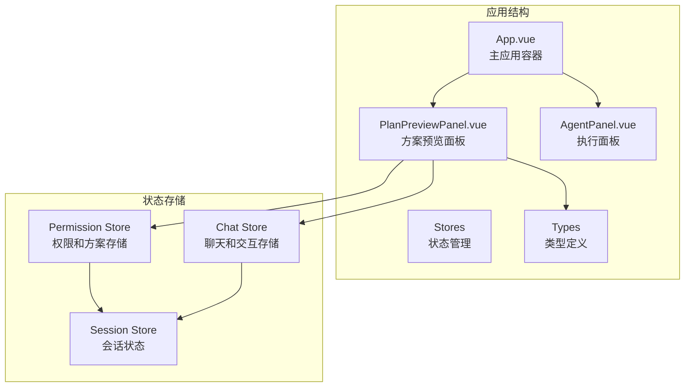
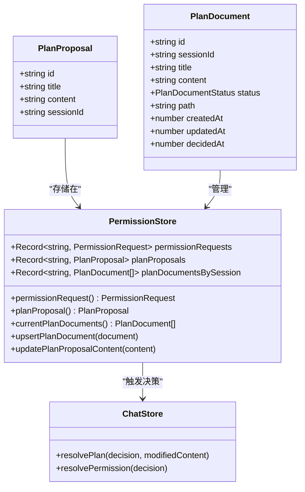
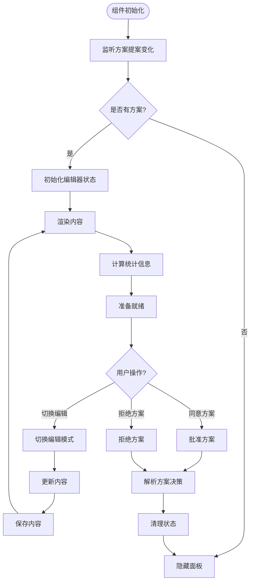
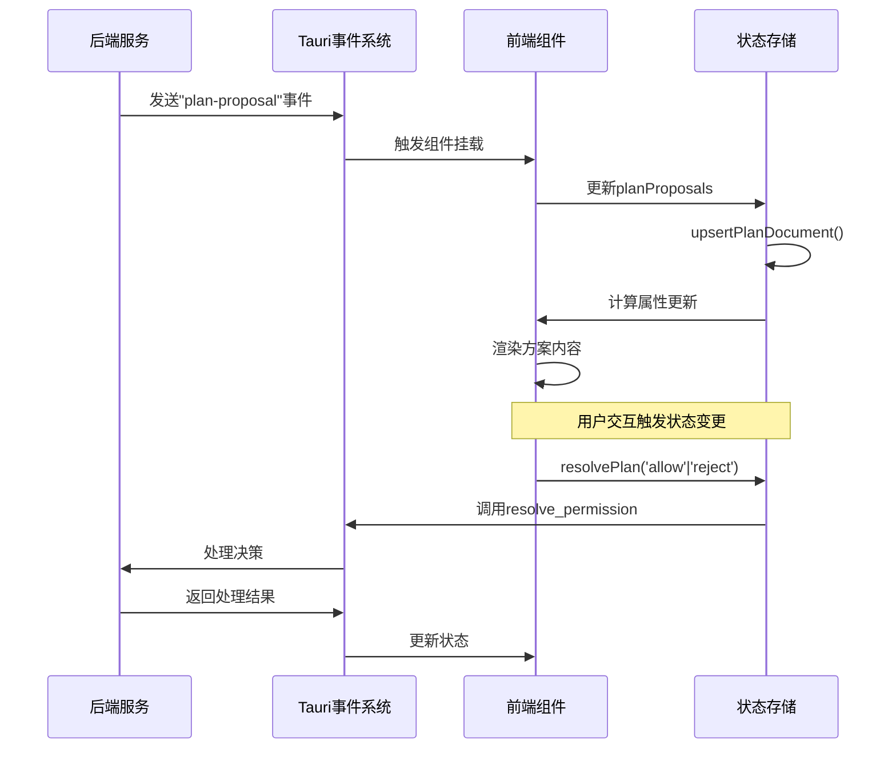
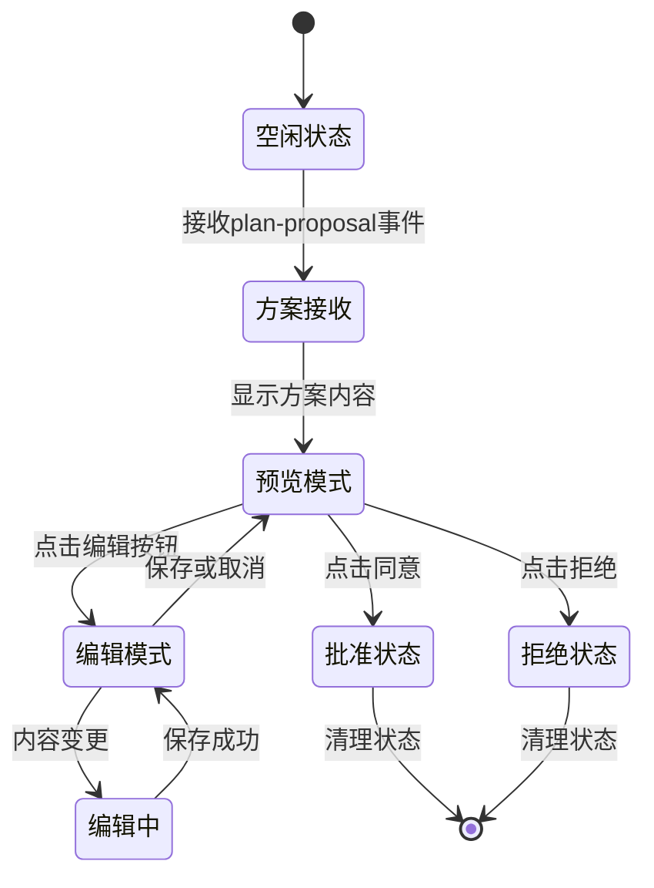
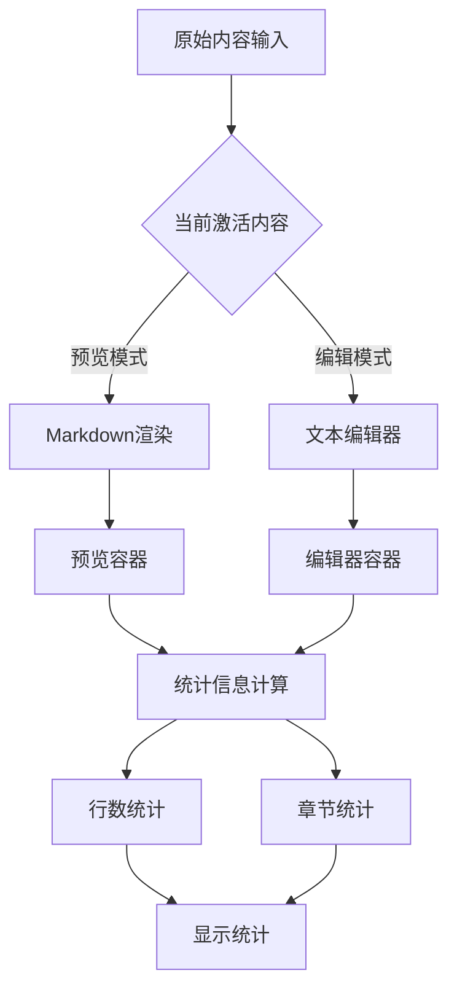
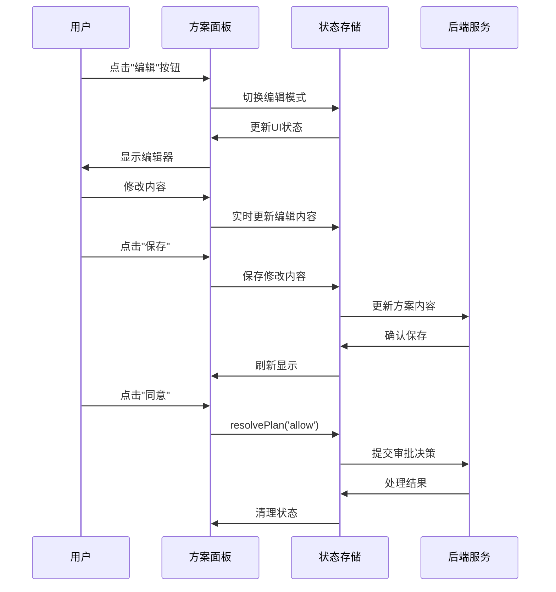
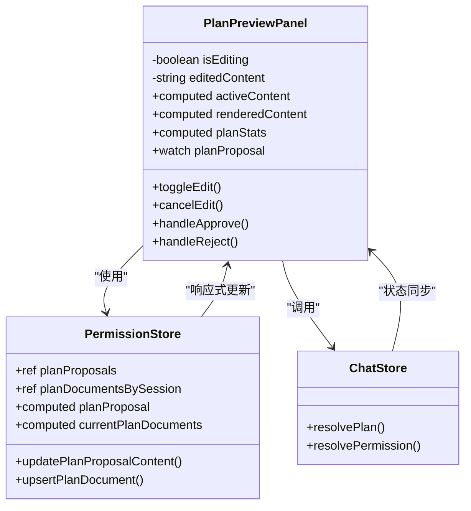
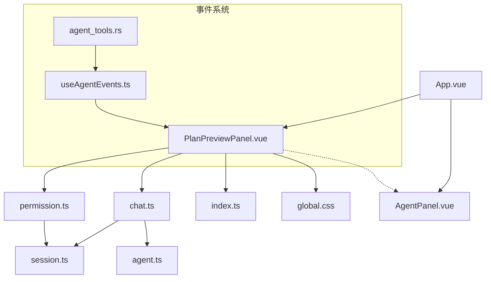

# 方案预览面板组件

<cite>
**本文档引用的文件**
- [PlanPreviewPanel.vue](file://src/components/common/PlanPreviewPanel.vue)
- [permission.ts](file://src/stores/permission.ts)
- [chat.ts](file://src/stores/chat.ts)
- [index.ts](file://src/types/index.ts)
- [App.vue](file://src/App.vue)
- [useAgentEvents.ts](file://src/composables/useAgentEvents.ts)
- [agent_tools.rs](file://src-tauri/src/core/tools/agent_tools.rs)
- [global.css](file://src/assets/global.css)
- [AgentPanel.vue](file://src/components/chat/AgentPanel.vue)
</cite>

## 目录
1. [简介](#简介)
2. [项目结构](#项目结构)
3. [核心组件](#核心组件)
4. [架构概览](#架构概览)
5. [详细组件分析](#详细组件分析)
6. [依赖关系分析](#依赖关系分析)
7. [性能考虑](#性能考虑)
8. [故障排除指南](#故障排除指南)
9. [结论](#结论)
10. [附录](#附录)

## 简介

方案预览面板组件（PlanPreviewPanel）是 JarvisAgent 应用中的关键交互组件，负责展示和管理 AI 生成的执行方案。该组件提供了完整的方案审批工作流，包括方案内容的 Markdown 渲染、实时编辑、状态跟踪和用户交互。

该组件采用现代化的 Vue 3 Composition API 构建，集成了 Pinia 状态管理、Tauri 事件通信和响应式设计原则。组件支持桌面端和移动端的自适应布局，提供流畅的用户体验和丰富的视觉反馈。

## 项目结构

方案预览面板组件位于项目的通用组件目录中，作为独立的功能模块与其他组件协同工作：



**图表来源**
- [App.vue:37-88](file://src/App.vue#L37-L88)
- [PlanPreviewPanel.vue:1-66](file://src/components/common/PlanPreviewPanel.vue#L1-L66)

**章节来源**
- [App.vue:1-282](file://src/App.vue#L1-L282)
- [PlanPreviewPanel.vue:1-840](file://src/components/common/PlanPreviewPanel.vue#L1-L840)

## 核心组件

### 数据模型和类型定义

组件基于清晰的数据结构设计，主要包含以下核心类型：



**图表来源**
- [index.ts:24-43](file://src/types/index.ts#L24-L43)
- [permission.ts:6-65](file://src/stores/permission.ts#L6-L65)
- [chat.ts:325-340](file://src/stores/chat.ts#L325-L340)

### 组件架构设计

组件采用响应式设计和状态驱动的架构模式：



**图表来源**
- [PlanPreviewPanel.vue:13-65](file://src/components/common/PlanPreviewPanel.vue#L13-L65)
- [permission.ts:47-53](file://src/stores/permission.ts#L47-L53)

**章节来源**
- [index.ts:24-43](file://src/types/index.ts#L24-L43)
- [PlanPreviewPanel.vue:1-840](file://src/components/common/PlanPreviewPanel.vue#L1-L840)

## 架构概览

### 事件驱动的数据流

方案预览面板通过 Tauri 事件系统实现前后端通信，形成完整的数据流：



**图表来源**
- [useAgentEvents.ts:164-187](file://src/composables/useAgentEvents.ts#L164-L187)
- [chat.ts:325-340](file://src/stores/chat.ts#L325-L340)
- [agent_tools.rs:794-802](file://src-tauri/src/core/tools/agent_tools.rs#L794-L802)

### 状态管理模式

组件采用单向数据流和响应式状态管理：



**图表来源**
- [PlanPreviewPanel.vue:39-65](file://src/components/common/PlanPreviewPanel.vue#L39-L65)
- [permission.ts:47-53](file://src/stores/permission.ts#L47-L53)

**章节来源**
- [useAgentEvents.ts:150-197](file://src/composables/useAgentEvents.ts#L150-L197)
- [chat.ts:309-340](file://src/stores/chat.ts#L309-L340)

## 详细组件分析

### 布局设计和响应式特性

组件采用灵活的布局系统，支持不同屏幕尺寸的自适应：

```mermaid
graph TB
subgraph "桌面端布局"
Overlay[覆盖层<br/>min(640px, 92vw)]
Panel[面板容器<br/>100%高度]
Header[头部区域<br/>固定高度]
Summary[摘要区域<br/>固定高度]
Toolbar[工具栏<br/>固定高度]
Body[主体内容<br/>弹性增长]
Actions[操作区域<br/>固定高度]
end
subgraph "移动端布局"
MobileOverlay[覆盖层<br/>100%宽度]
MobilePanel[面板容器<br/>无圆角]
MobileHeader[头部区域<br/>紧凑内边距]
MobileSummary[摘要区域<br/>垂直排列]
MobileToolbar[工具栏<br/>垂直排列]
MobileBody[主体内容<br/>紧凑内边距]
MobileActions[操作区域<br/>垂直反转]
end
Overlay -.-> MobileOverlay
Panel -.-> MobilePanel
Header -.-> MobileHeader
Summary -.-> MobileSummary
Toolbar -.-> MobileToolbar
Body -.-> MobileBody
Actions -.-> MobileActions
```

**图表来源**
- [PlanPreviewPanel.vue:186-206](file://src/components/common/PlanPreviewPanel.vue#L186-L206)
- [PlanPreviewPanel.vue:792-838](file://src/components/common/PlanPreviewPanel.vue#L792-L838)

### 内容渲染机制

组件支持 Markdown 内容的实时渲染和编辑：



**图表来源**
- [PlanPreviewPanel.vue:20-37](file://src/components/common/PlanPreviewPanel.vue#L20-L37)
- [PlanPreviewPanel.vue:25-28](file://src/components/common/PlanPreviewPanel.vue#L25-L28)

### 交互操作流程

组件提供完整的用户交互体验：



**图表来源**
- [PlanPreviewPanel.vue:39-65](file://src/components/common/PlanPreviewPanel.vue#L39-L65)
- [chat.ts:325-340](file://src/stores/chat.ts#L325-L340)

**章节来源**
- [PlanPreviewPanel.vue:1-840](file://src/components/common/PlanPreviewPanel.vue#L1-L840)
- [chat.ts:309-340](file://src/stores/chat.ts#L309-L340)

### 数据绑定和实时更新

组件实现了高效的数据绑定机制：



**图表来源**
- [PlanPreviewPanel.vue:1-66](file://src/components/common/PlanPreviewPanel.vue#L1-L66)
- [permission.ts:6-65](file://src/stores/permission.ts#L6-L65)
- [chat.ts:628-657](file://src/stores/chat.ts#L628-L657)

**章节来源**
- [permission.ts:1-66](file://src/stores/permission.ts#L1-L66)
- [PlanPreviewPanel.vue:13-18](file://src/components/common/PlanPreviewPanel.vue#L13-L18)

### 可访问性支持

组件遵循 WCAG 2.1 AA 标准，提供完整的可访问性支持：

- **语义化标签**：使用适当的 HTML 语义标记和 ARIA 属性
- **键盘导航**：完整的键盘操作支持和焦点管理
- **屏幕阅读器**：完善的屏幕阅读器兼容性
- **色彩对比度**：满足对比度要求的设计系统
- **动画控制**：支持减少动画的偏好设置

**章节来源**
- [PlanPreviewPanel.vue:70-94](file://src/components/common/PlanPreviewPanel.vue#L70-L94)
- [global.css:210-215](file://src/assets/global.css#L210-L215)

## 依赖关系分析

### 组件间依赖关系



**图表来源**
- [App.vue:14-15](file://src/App.vue#L14-L15)
- [useAgentEvents.ts:164-187](file://src/composables/useAgentEvents.ts#L164-L187)
- [agent_tools.rs:794-802](file://src-tauri/src/core/tools/agent_tools.rs#L794-L802)

### 外部依赖分析

组件依赖的关键外部库和工具：

- **Vue 3**：组合式 API 和响应式系统
- **Pinia**：状态管理库
- **Marked**：Markdown 解析库
- **Tauri**：跨平台桌面应用框架
- **CSS 变量**：现代 CSS 设计系统

**章节来源**
- [PlanPreviewPanel.vue:2-5](file://src/components/common/PlanPreviewPanel.vue#L2-L5)
- [App.vue:32-34](file://src/App.vue#L32-L34)

## 性能考虑

### 渲染优化策略

组件采用了多项性能优化技术：

1. **条件渲染**：仅在有方案时渲染面板
2. **懒加载**：内容按需渲染
3. **计算属性缓存**：避免重复计算
4. **事件节流**：防止频繁的状态更新

### 内存管理

- **自动清理**：决策完成后自动清理状态
- **引用管理**：合理管理组件生命周期
- **资源释放**：及时释放不必要的内存

## 故障排除指南

### 常见问题和解决方案

#### 方案无法显示
- **原因**：缺少有效的 planProposal 数据
- **解决**：检查事件监听是否正常工作
- **验证**：确认后端服务是否正确发送事件

#### 编辑功能异常
- **原因**：状态同步问题
- **解决**：检查 updatePlanProposalContent 方法
- **验证**：确认 Pinia 状态更新逻辑

#### 决策提交失败
- **原因**：后端服务调用异常
- **解决**：检查 resolvePlan 方法的 Tauri 调用
- **验证**：确认权限服务正常运行

**章节来源**
- [chat.ts:325-340](file://src/stores/chat.ts#L325-L340)
- [permission.ts:47-53](file://src/stores/permission.ts#L47-L53)

## 结论

方案预览面板组件是一个设计精良、功能完整的交互组件，具有以下特点：

1. **架构清晰**：采用响应式设计和状态驱动架构
2. **功能完整**：支持方案预览、编辑、审批等完整工作流
3. **性能优秀**：实现了多项性能优化策略
4. **可维护性强**：代码结构清晰，易于扩展和维护
5. **用户体验佳**：提供流畅的交互体验和良好的视觉效果

该组件为 JarvisAgent 应用提供了强大的方案管理能力，是整个系统的重要组成部分。

## 附录

### 开发最佳实践

1. **状态管理**：使用 Pinia 进行集中状态管理
2. **事件处理**：遵循单向数据流原则
3. **错误处理**：实现完善的错误处理机制
4. **性能监控**：定期进行性能评估和优化
5. **测试覆盖**：确保关键功能有足够的测试覆盖

### 扩展建议

1. **多方案比较**：添加方案对比和差异展示功能
2. **批量操作**：支持多个方案的批量审批
3. **搜索过滤**：添加方案搜索和筛选功能
4. **历史记录**：保存和展示方案变更历史
5. **导出功能**：支持方案内容的导出和分享