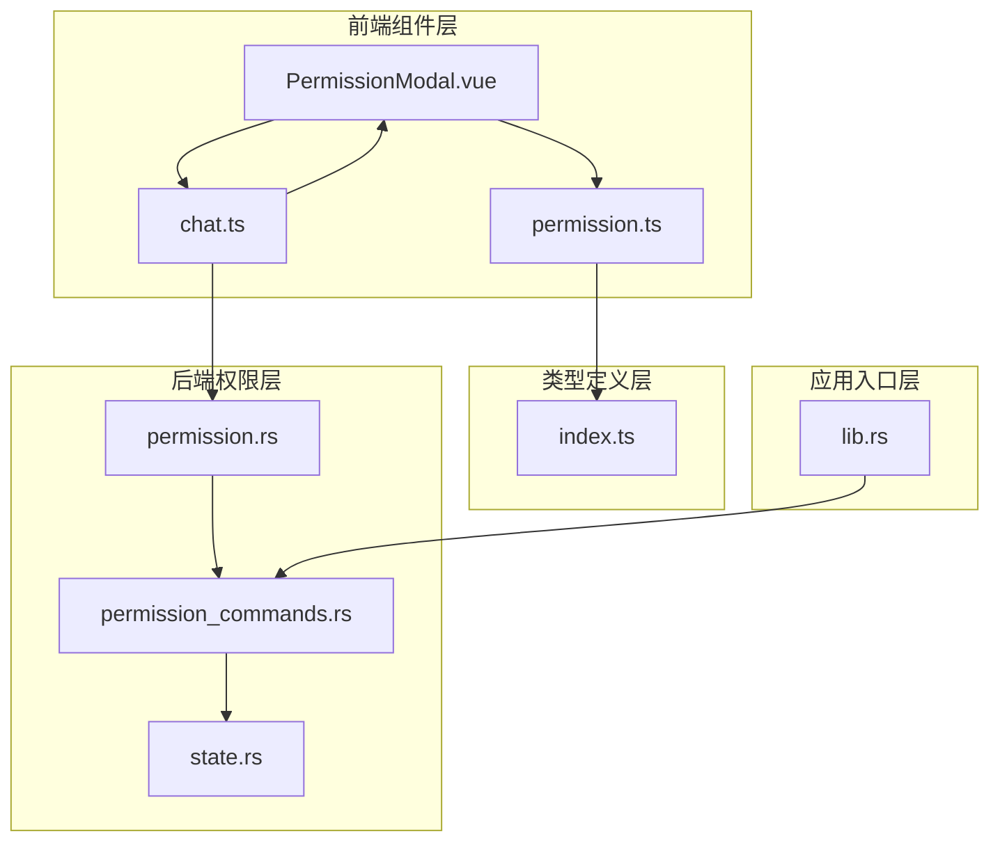
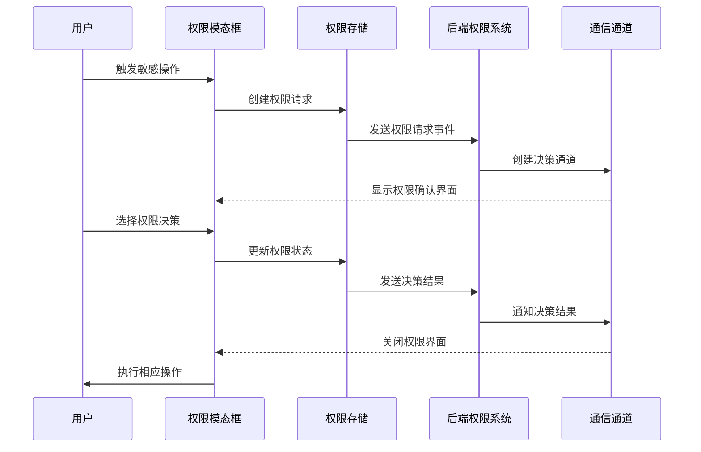
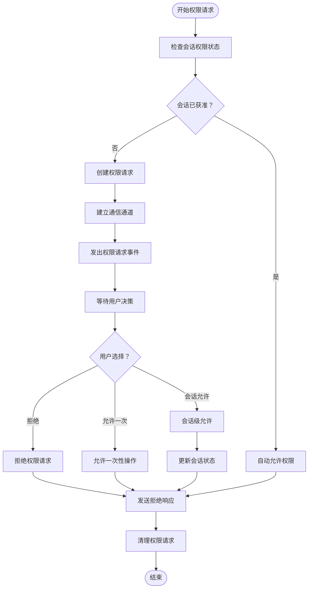
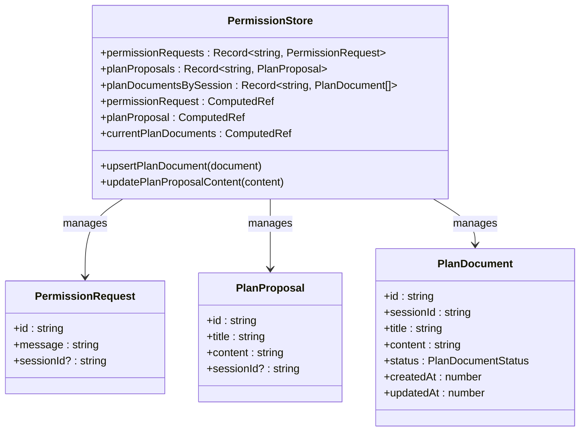
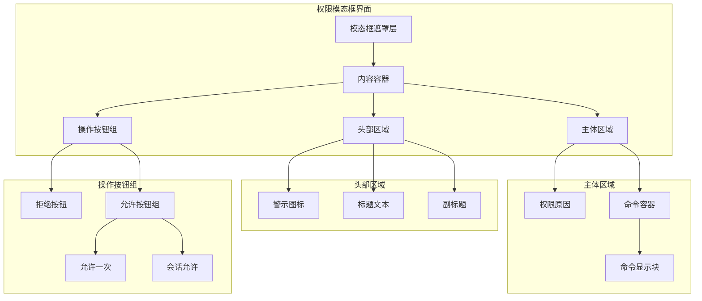
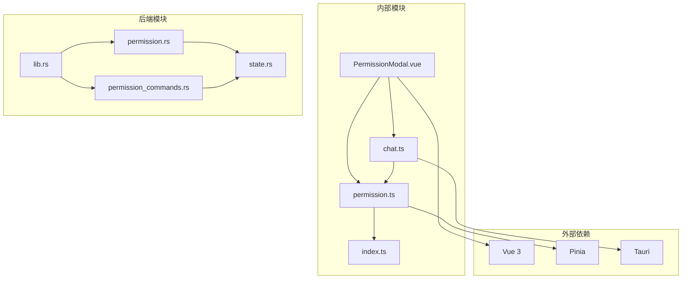

# 权限模态框组件

<cite>
**本文档引用的文件**
- [PermissionModal.vue](file://src/components/common/PermissionModal.vue)
- [permission.ts](file://src/stores/permission.ts)
- [chat.ts](file://src/stores/chat.ts)
- [permission.rs](file://src-tauri/src/core/tools/permission.rs)
- [permission_commands.rs](file://src-tauri/src/core/commands/permission.rs)
- [state.rs](file://src-tauri/src/core/state.rs)
- [index.ts](file://src/types/index.ts)
- [lib.rs](file://src-tauri/src/lib.rs)
</cite>

## 目录
1. [简介](#简介)
2. [项目结构](#项目结构)
3. [核心组件](#核心组件)
4. [架构概览](#架构概览)
5. [详细组件分析](#详细组件分析)
6. [依赖关系分析](#依赖关系分析)
7. [性能考虑](#性能考虑)
8. [故障排除指南](#故障排除指南)
9. [结论](#结论)

## 简介

PermissionModal 是 JarvisAgent 中的核心权限管理组件，负责在用户执行敏感操作时提供安全确认机制。该组件实现了完整的权限请求、验证、展示和响应流程，确保用户对系统操作具有明确的知情同意。

该权限模态框采用前后端分离的架构设计，前端负责用户交互和界面展示，后端负责权限验证和决策处理。组件支持多种权限决策模式，包括一次性允许、会话级允许和拒绝操作，并提供了完善的键盘快捷键支持。

## 项目结构

PermissionModal 组件位于项目的组件层，与状态管理、类型定义和后端权限系统紧密集成：

**图表来源**
- [PermissionModal.vue:1-339](file://src/components/common/PermissionModal.vue#L1-L339)
- [permission.ts:1-66](file://src/stores/permission.ts#L1-L66)
- [chat.ts:309-323](file://src/stores/chat.ts#L309-L323)
- [permission.rs:74-102](file://src-tauri/src/core/tools/permission.rs#L74-L102)
- [permission_commands.rs:4-43](file://src-tauri/src/core/commands/permission.rs#L4-L43)
- [state.rs:19-41](file://src-tauri/src/core/state.rs#L19-L41)
- [lib.rs:102-108](file://src-tauri/src/lib.rs#L102-L108)

**章节来源**
- [PermissionModal.vue:1-339](file://src/components/common/PermissionModal.vue#L1-L339)
- [permission.ts:1-66](file://src/stores/permission.ts#L1-L66)
- [chat.ts:309-323](file://src/stores/chat.ts#L309-L323)

## 核心组件

### PermissionModal 组件

PermissionModal 是一个 Vue 3 组件，负责权限请求的用户界面展示和交互处理。组件具有以下核心特性：

- **智能消息解析**：自动识别和提取权限请求中的原因和命令内容
- **多级权限决策**：支持拒绝、允许一次、本次会话始终允许三种决策模式
- **键盘快捷键支持**：提供 A、S、R 键快速响应权限请求
- **响应式界面**：根据权限请求内容动态调整显示布局

### 权限存储管理

权限状态通过 Pinia store 进行管理，提供以下功能：

- **权限请求队列**：维护每个会话的权限请求状态
- **计划提案管理**：处理计划文档的审批流程
- **会话级权限缓存**：支持会话级别的权限记忆功能

### 后端权限处理

后端权限系统采用异步通道通信机制，确保权限决策的安全性和可靠性：

- **会话上下文管理**：维护每个会话的权限状态和上下文信息
- **权限决策通道**：使用 oneshot 通道实现权限决策的异步传递
- **权限历史记录**：跟踪和记录权限使用历史

**章节来源**
- [PermissionModal.vue:9-71](file://src/components/common/PermissionModal.vue#L9-L71)
- [permission.ts:6-27](file://src/stores/permission.ts#L6-L27)
- [permission.rs:74-102](file://src-tauri/src/core/tools/permission.rs#L74-L102)

## 架构概览

PermissionModal 的整体架构采用分层设计，从前端用户界面到后端权限决策形成完整的权限管理体系：

**图表来源**
- [PermissionModal.vue:74-120](file://src/components/common/PermissionModal.vue#L74-L120)
- [chat.ts:309-323](file://src/stores/chat.ts#L309-L323)
- [permission.rs:74-102](file://src-tauri/src/core/tools/permission.rs#L74-L102)
- [permission_commands.rs:34-42](file://src-tauri/src/core/commands/permission.rs#L34-L42)

该架构确保了权限管理的完整性和安全性，同时提供了良好的用户体验。

## 详细组件分析

### 权限请求处理流程

权限请求的处理流程遵循严格的异步通信模式，确保系统的可靠性和安全性：

**图表来源**
- [permission.rs:74-102](file://src-tauri/src/core/tools/permission.rs#L74-L102)
- [permission_commands.rs:34-42](file://src-tauri/src/core/commands/permission.rs#L34-L42)

### 权限状态管理

权限状态管理系统采用响应式设计，确保权限状态的实时更新和同步：

**图表来源**
- [permission.ts:6-64](file://src/stores/permission.ts#L6-L64)
- [index.ts:18-43](file://src/types/index.ts#L18-L43)

### 用户交互界面设计

权限模态框的用户界面设计注重安全性和易用性：

**图表来源**
- [PermissionModal.vue:74-120](file://src/components/common/PermissionModal.vue#L74-L120)

**章节来源**
- [PermissionModal.vue:74-120](file://src/components/common/PermissionModal.vue#L74-L120)
- [permission.ts:6-64](file://src/stores/permission.ts#L6-L64)
- [index.ts:18-43](file://src/types/index.ts#L18-L43)

## 依赖关系分析

权限模态框组件的依赖关系体现了清晰的分层架构：

**图表来源**
- [PermissionModal.vue:1-8](file://src/components/common/PermissionModal.vue#L1-L8)
- [permission.ts:1-5](file://src/stores/permission.ts#L1-L5)
- [chat.ts:1-8](file://src/stores/chat.ts#L1-L8)
- [permission.rs:1-10](file://src-tauri/src/core/tools/permission.rs#L1-L10)
- [permission_commands.rs:1-3](file://src-tauri/src/core/commands/permission.rs#L1-L3)
- [state.rs:1-7](file://src-tauri/src/core/state.rs#L1-L7)
- [lib.rs:102-108](file://src-tauri/src/lib.rs#L102-L108)

**章节来源**
- [PermissionModal.vue:1-8](file://src/components/common/PermissionModal.vue#L1-L8)
- [permission.ts:1-5](file://src/stores/permission.ts#L1-L5)
- [chat.ts:1-8](file://src/stores/chat.ts#L1-L8)

## 性能考虑

权限模态框组件在设计时充分考虑了性能优化：

### 渲染性能优化
- **条件渲染**：仅在存在权限请求时渲染模态框，避免不必要的 DOM 操作
- **计算属性缓存**：使用 Vue 计算属性缓存解析后的消息内容
- **响应式更新**：精确的状态更新机制，减少不必要的组件重渲染

### 内存管理
- **会话隔离**：每个会话独立的权限状态管理，避免内存泄漏
- **自动清理**：权限决策完成后自动清理相关状态和事件监听器
- **资源释放**：组件卸载时自动移除键盘事件监听器

### 异步处理优化
- **非阻塞通信**：使用异步通道处理权限决策，避免 UI 阻塞
- **超时处理**：合理的超时机制防止权限请求无限等待
- **错误恢复**：完善的错误处理和恢复机制

## 故障排除指南

### 常见问题诊断

**权限请求无响应**
1. 检查后端权限服务是否正常运行
2. 验证 Tauri 事件通信是否正常
3. 确认会话状态是否正确初始化

**权限决策未生效**
1. 检查权限存储状态更新
2. 验证后端权限处理逻辑
3. 确认权限决策通道通信

**界面显示异常**
1. 检查 CSS 样式加载
2. 验证响应式布局适配
3. 确认模态框层级设置

### 调试建议

**前端调试**
- 使用 Vue DevTools 检查权限状态变化
- 监控权限请求的生命周期
- 验证事件监听器的注册和清理

**后端调试**
- 检查权限请求日志输出
- 验证会话上下文状态
- 监控异步通道通信状态

**章节来源**
- [permission.rs:74-102](file://src-tauri/src/core/tools/permission.rs#L74-L102)
- [permission_commands.rs:34-42](file://src-tauri/src/core/commands/permission.rs#L34-L42)
- [chat.ts:309-323](file://src/stores/chat.ts#L309-L323)

## 结论

PermissionModal 权限模态框组件通过精心设计的架构和实现，为 JarvisAgent 提供了强大而安全的权限管理能力。组件不仅实现了完整的权限请求、验证和决策流程，还提供了优秀的用户体验和性能表现。

该组件的关键优势包括：

- **安全性**：完整的权限验证和决策机制，确保敏感操作的安全性
- **易用性**：直观的用户界面和快捷键支持，提升用户体验
- **可靠性**：异步通信和错误处理机制，保证系统的稳定性
- **可扩展性**：模块化的架构设计，便于功能扩展和维护

通过前后端的紧密协作和完善的权限管理体系，PermissionModal 为 JarvisAgent 的安全运行提供了坚实的基础。