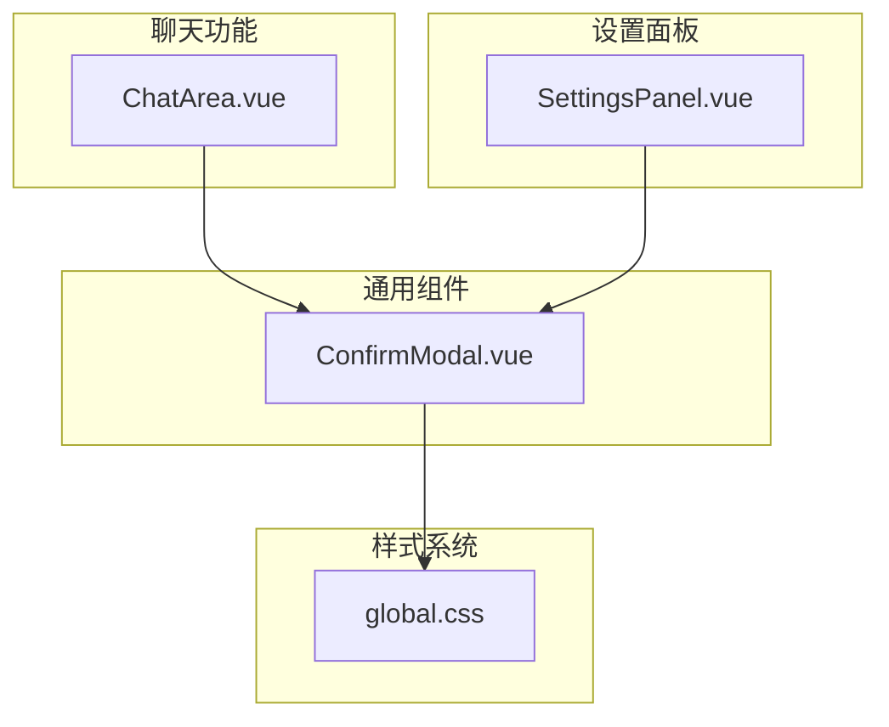
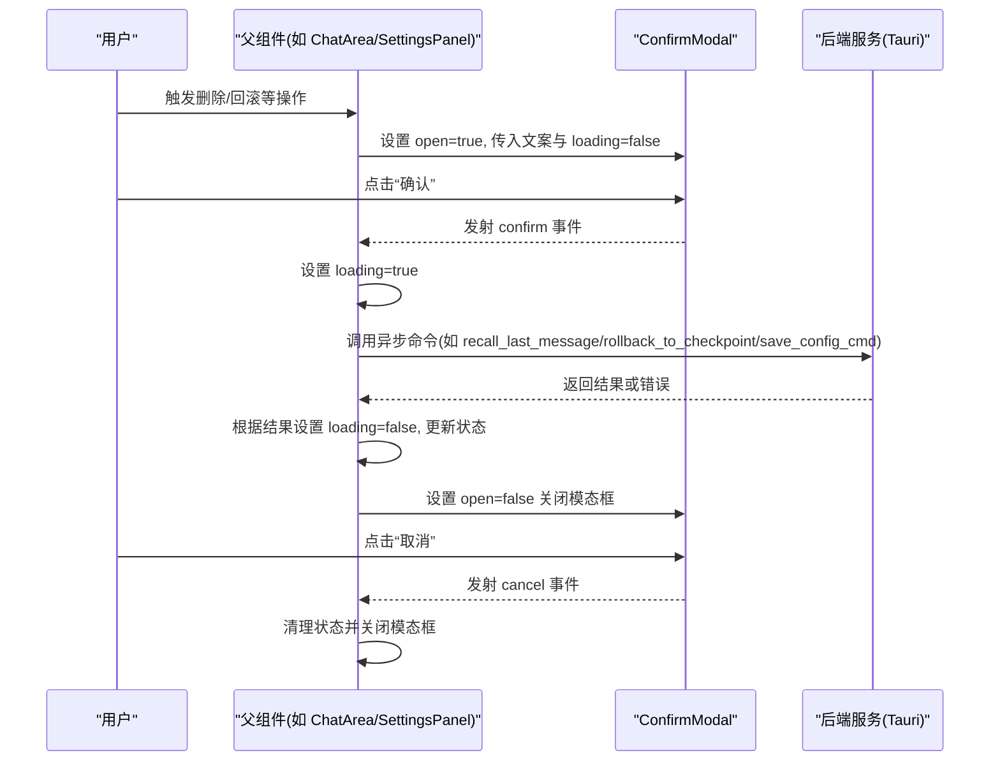
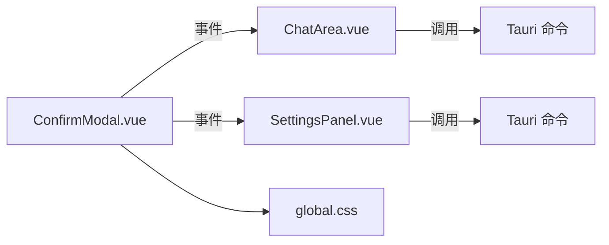

# 确认模态框组件

<cite>
**本文引用的文件**
- [ConfirmModal.vue](file://src/components/common/ConfirmModal.vue)
- [ChatArea.vue](file://src/components/chat/ChatArea.vue)
- [SettingsPanel.vue](file://src/components/settings/SettingsPanel.vue)
- [global.css](file://src/assets/global.css)
- [RollbackConfirmModal.vue](file://src/components/common/RollbackConfirmModal.vue)
- [ThinkingStatus.vue](file://src/components/chat/ThinkingStatus.vue)
</cite>

## 目录
1. [简介](#简介)
2. [项目结构](#项目结构)
3. [核心组件](#核心组件)
4. [架构总览](#架构总览)
5. [详细组件分析](#详细组件分析)
6. [依赖关系分析](#依赖关系分析)
7. [性能考量](#性能考量)
8. [故障排查指南](#故障排查指南)
9. [结论](#结论)
10. [附录：API 与使用示例](#附录api-与使用示例)

## 简介
本文件针对 ConfirmModal 确认模态框组件进行系统化文档化说明，涵盖显示控制、确认/取消逻辑、加载状态处理、错误提示机制；参数配置、事件回调、样式定制；动画与遮罩层处理、键盘事件监听；组件复用性设计、数据传递与状态管理；以及使用示例、样式覆盖方法与扩展开发指南。同时重点解释 confirm() 调用方式、Promise 返回值处理与异步操作支持，并提供完整的组件 API 文档与实际应用场景示例。

## 项目结构
ConfirmModal 位于通用组件目录下，作为跨页面可复用的确认对话框，通过 Teleport 将 DOM 挂载至 body，确保层级与定位不受父容器影响。其在聊天区域与设置面板中被广泛使用，分别用于“会话回滚”和“删除配置预设”的二次确认场景。

图表来源
- [ConfirmModal.vue:1-157](file://src/components/common/ConfirmModal.vue#L1-L157)
- [ChatArea.vue:306-317](file://src/components/chat/ChatArea.vue#L306-L317)
- [SettingsPanel.vue:189-200](file://src/components/settings/SettingsPanel.vue#L189-L200)
- [global.css:1-200](file://src/assets/global.css#L1-L200)

章节来源
- [ConfirmModal.vue:1-157](file://src/components/common/ConfirmModal.vue#L1-L157)
- [ChatArea.vue:306-317](file://src/components/chat/ChatArea.vue#L306-L317)
- [SettingsPanel.vue:189-200](file://src/components/settings/SettingsPanel.vue#L189-L200)
- [global.css:1-200](file://src/assets/global.css#L1-L200)

## 核心组件
- 组件名称：ConfirmModal
- 组件类型：通用确认对话框（无状态展示 + 事件发射）
- 主要职责：
  - 展示标题、消息与警告信息
  - 提供确认/取消两个动作按钮
  - 支持危险样式（danger）与普通样式（primary）
  - 支持加载状态禁用按钮，防止重复提交
  - 通过 Teleport 挂载到 body，避免层级与定位问题

章节来源
- [ConfirmModal.vue:1-157](file://src/components/common/ConfirmModal.vue#L1-L157)

## 架构总览
ConfirmModal 采用“属性驱动 + 事件发射”的轻量设计，不维护内部状态，完全由父组件传入 open、title、message、warning、confirmText、cancelText、confirmKind、loading 等属性，并通过 confirm/cancel 事件与父组件通信。父组件负责：
- 控制 open 属性以显示/隐藏
- 处理 confirm/cancel 回调，执行业务逻辑
- 在异步操作期间设置 loading，阻断用户重复点击
- 错误时通过警告区展示提示信息

图表来源
- [ConfirmModal.vue:25-46](file://src/components/common/ConfirmModal.vue#L25-L46)
- [ChatArea.vue:211-254](file://src/components/chat/ChatArea.vue#L211-L254)
- [SettingsPanel.vue:442-481](file://src/components/settings/SettingsPanel.vue#L442-L481)

## 详细组件分析

### 组件属性与事件
- 属性
  - open: 是否显示模态框
  - title: 标题文本
  - message: 主要提示信息
  - warning: 警告信息（可选）
  - confirmText: 确认按钮文案（默认“确认”）
  - cancelText: 取消按钮文案（默认“取消”）
  - confirmKind: 样式类型，'primary' 或 'danger'
  - loading: 加载状态，控制按钮禁用与文案
- 事件
  - confirm: 用户点击确认时触发
  - cancel: 用户点击取消或遮罩时触发（当 loading 为 false）

章节来源
- [ConfirmModal.vue:2-17](file://src/components/common/ConfirmModal.vue#L2-L17)
- [ConfirmModal.vue:19-22](file://src/components/common/ConfirmModal.vue#L19-L22)

### 显示控制与遮罩层
- 使用 Teleport 将模态框挂载到 body，保证层级最高
- overlay 容器全屏遮罩，点击遮罩触发 cancel（loading 为 false 时）
- 内容容器居中显示，支持响应式宽度与毛玻璃背景

章节来源
- [ConfirmModal.vue:26-45](file://src/components/common/ConfirmModal.vue#L26-L45)

### 确认/取消逻辑与加载状态
- 确认按钮根据 confirmKind 应用 primary/danger 样式
- loading 为 true 时禁用两个按钮，文案切换为“处理中…”
- 点击取消或遮罩时，若非 loading 状态则触发 cancel

章节来源
- [ConfirmModal.vue:33-41](file://src/components/common/ConfirmModal.vue#L33-L41)
- [ConfirmModal.vue:27](file://src/components/common/ConfirmModal.vue#L27)

### 错误提示机制
- warning 区域用于展示高风险或重要提示信息
- 通过 role="alert" 提升可访问性
- 父组件在异步失败时可将错误信息注入 warning，增强用户感知

章节来源
- [ConfirmModal.vue:31](file://src/components/common/ConfirmModal.vue#L31)
- [ConfirmModal.vue:90-101](file://src/components/common/ConfirmModal.vue#L90-L101)

### 动画与样式定制
- 模态框采用毛玻璃背景与阴影，结合 CSS 变量实现主题适配
- 按钮 hover 效果与过渡动画遵循全局过渡变量
- danger 样式强调危险操作，primary 样式用于常规确认

章节来源
- [ConfirmModal.vue:64-73](file://src/components/common/ConfirmModal.vue#L64-L73)
- [ConfirmModal.vue:132-149](file://src/components/common/ConfirmModal.vue#L132-L149)
- [global.css:1-200](file://src/assets/global.css#L1-L200)

### 复用性设计与数据传递
- 通过属性传入文案与行为控制，无需在组件内维护状态
- confirm/cancel 事件解耦 UI 与业务逻辑，便于在不同页面复用
- loading 状态由父组件统一管理，避免并发操作

章节来源
- [ConfirmModal.vue:2-17](file://src/components/common/ConfirmModal.vue#L2-L17)
- [ConfirmModal.vue:19-22](file://src/components/common/ConfirmModal.vue#L19-L22)

### 实际应用场景
- 聊天区域回滚：在 ChatArea 中弹出确认，执行 Tauri 命令完成回滚，并在 finally 中重置 loading
- 设置面板删除：在 SettingsPanel 中弹出确认，执行保存配置命令，成功后关闭模态框

章节来源
- [ChatArea.vue:306-317](file://src/components/chat/ChatArea.vue#L306-L317)
- [ChatArea.vue:211-254](file://src/components/chat/ChatArea.vue#L211-L254)
- [SettingsPanel.vue:189-200](file://src/components/settings/SettingsPanel.vue#L189-L200)
- [SettingsPanel.vue:442-481](file://src/components/settings/SettingsPanel.vue#L442-L481)

### 键盘事件监听
- 当前版本未内置键盘事件监听（Esc 取消）。建议在父组件中添加键盘监听，结合 open 状态实现 Esc 关闭。

章节来源
- [ConfirmModal.vue:27](file://src/components/common/ConfirmModal.vue#L27)

### 与 RollbackConfirmModal 的对比
- ConfirmModal 更通用，适合一般确认/取消场景
- RollbackConfirmModal 专用于回滚场景，包含“操作详情”列表，适合复杂变更的可视化说明

章节来源
- [RollbackConfirmModal.vue:1-121](file://src/components/common/RollbackConfirmModal.vue#L1-L121)

## 依赖关系分析
- 依赖关系
  - 无外部库依赖，纯 Vue 组合式 API
  - 通过 Teleport 与全局样式变量协作
- 耦合度
  - 低耦合：仅通过属性与事件与父组件交互
- 外部集成
  - 与 Tauri 命令交互（如 recall_last_message、rollback_to_checkpoint、save_config_cmd），由父组件负责调用与错误处理

图表来源
- [ConfirmModal.vue:25-46](file://src/components/common/ConfirmModal.vue#L25-L46)
- [ChatArea.vue:211-254](file://src/components/chat/ChatArea.vue#L211-L254)
- [SettingsPanel.vue:442-481](file://src/components/settings/SettingsPanel.vue#L442-L481)
- [global.css:1-200](file://src/assets/global.css#L1-L200)

章节来源
- [ConfirmModal.vue:1-157](file://src/components/common/ConfirmModal.vue#L1-L157)
- [ChatArea.vue:211-254](file://src/components/chat/ChatArea.vue#L211-L254)
- [SettingsPanel.vue:442-481](file://src/components/settings/SettingsPanel.vue#L442-L481)
- [global.css:1-200](file://src/assets/global.css#L1-L200)

## 性能考量
- 渲染开销极低：无内部状态，仅根据 props 渲染
- 事件绑定简单：仅在按钮与遮罩上绑定 click 事件
- DOM 结构扁平：Teleport 减少层级嵌套带来的布局抖动
- 建议
  - 在高频弹窗场景中，尽量延迟渲染（v-if）而非 v-show
  - 对 confirm/cancel 事件回调中的异步操作使用节流/防抖，避免重复触发

## 故障排查指南
- 模态框无法关闭
  - 检查父组件是否正确设置 open=false
  - 确认 loading 未被长期置为 true
- 确认按钮无效
  - 检查 confirmKind 与 confirm 事件绑定是否正确
  - 确认 confirm 回调中未抛出未捕获异常导致流程中断
- 遮罩点击无效
  - 确认 loading 为 false，否则不会触发 cancel
- 样式异常
  - 检查 global.css 中的 CSS 变量是否生效
  - 确认未被其他样式覆盖关键选择器

章节来源
- [ConfirmModal.vue:27](file://src/components/common/ConfirmModal.vue#L27)
- [ConfirmModal.vue:33-41](file://src/components/common/ConfirmModal.vue#L33-L41)
- [global.css:1-200](file://src/assets/global.css#L1-L200)

## 结论
ConfirmModal 是一个设计简洁、职责单一的通用确认对话框组件。它通过属性与事件与父组件解耦，配合 loading 状态有效避免重复提交，适用于多种业务确认场景。建议在父组件中完善键盘事件与错误提示，进一步提升用户体验与可访问性。

## 附录：API 与使用示例

### 组件 API
- 属性
  - open: boolean
  - title: string
  - message: string
  - warning: string（可选）
  - confirmText: string（可选，默认“确认”）
  - cancelText: string（可选，默认“取消”）
  - confirmKind: 'primary' | 'danger'（可选，默认 'primary'）
  - loading: boolean（可选，默认 false）
- 事件
  - confirm: 无参
  - cancel: 无参

章节来源
- [ConfirmModal.vue:2-17](file://src/components/common/ConfirmModal.vue#L2-L17)
- [ConfirmModal.vue:19-22](file://src/components/common/ConfirmModal.vue#L19-L22)

### 使用示例与最佳实践
- 聊天回滚场景（ChatArea）
  - 打开条件：用户选择回滚方式后，将回滚信息注入 ConfirmModal 的 title/message/warning
  - 行为：confirm 回调中调用 Tauri 命令执行回滚，finally 中重置 loading 并关闭模态框
  - 参考路径
    - [ChatArea.vue:306-317](file://src/components/chat/ChatArea.vue#L306-L317)
    - [ChatArea.vue:211-254](file://src/components/chat/ChatArea.vue#L211-L254)
- 删除配置预设（SettingsPanel）
  - 打开条件：点击删除按钮后，将删除信息注入 ConfirmModal
  - 行为：confirm 回调中调用保存配置命令，成功后关闭模态框并提示
  - 参考路径
    - [SettingsPanel.vue:189-200](file://src/components/settings/SettingsPanel.vue#L189-L200)
    - [SettingsPanel.vue:442-481](file://src/components/settings/SettingsPanel.vue#L442-L481)

### Promise 返回值与异步支持
- 当前组件不直接返回 Promise，而是通过 confirm/cancel 事件与父组件通信
- 父组件可在 confirm 回调中执行异步操作（如 Tauri 命令），并在 finally 中清理 loading
- 若需 Promise 化封装，可在父组件中对 confirm 回调进行包装，返回 Promise 以便上层等待

章节来源
- [ConfirmModal.vue:19-22](file://src/components/common/ConfirmModal.vue#L19-L22)
- [ChatArea.vue:211-254](file://src/components/chat/ChatArea.vue#L211-L254)
- [SettingsPanel.vue:442-481](file://src/components/settings/SettingsPanel.vue#L442-L481)

### 样式覆盖方法
- 可通过自定义类名或深度选择器覆盖按钮与遮罩样式
- 推荐使用 CSS 变量与全局样式保持一致的主题风格
- 注意：danger 样式与 primary 样式在组件内通过类名切换，覆盖时需保持类名一致性

章节来源
- [ConfirmModal.vue:132-149](file://src/components/common/ConfirmModal.vue#L132-L149)
- [global.css:1-200](file://src/assets/global.css#L1-L200)

### 扩展开发指南
- 新增快捷键支持：在父组件中监听键盘事件，结合 open 状态实现 Esc 关闭
- 新增多语言：将 confirmText/cancelText/warning 等文案改为 i18n 注入
- 新增动画：在父组件中为 ConfirmModal 添加过渡动画，或在组件内引入 Transition
- 新增键盘导航：为按钮添加 tabindex 与键盘激活逻辑，提升可访问性

章节来源
- [ConfirmModal.vue:27](file://src/components/common/ConfirmModal.vue#L27)
- [ThinkingStatus.vue:1-54](file://src/components/chat/ThinkingStatus.vue#L1-L54)