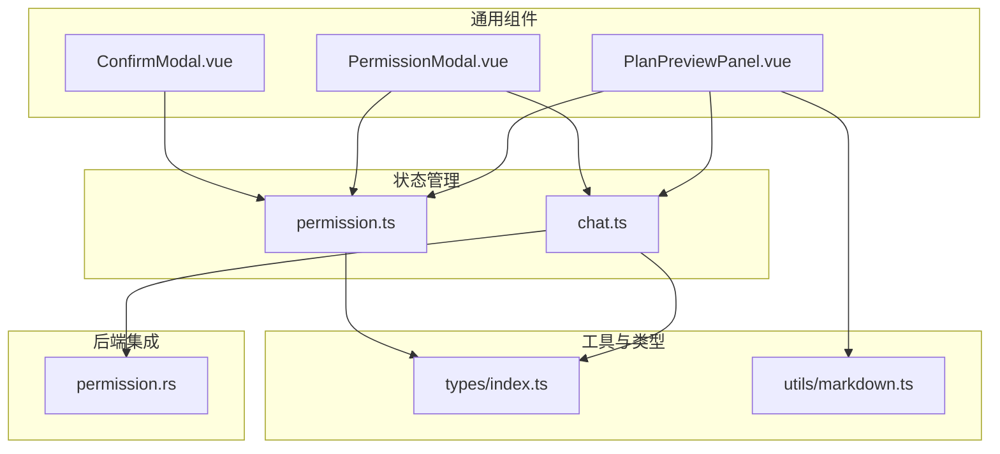
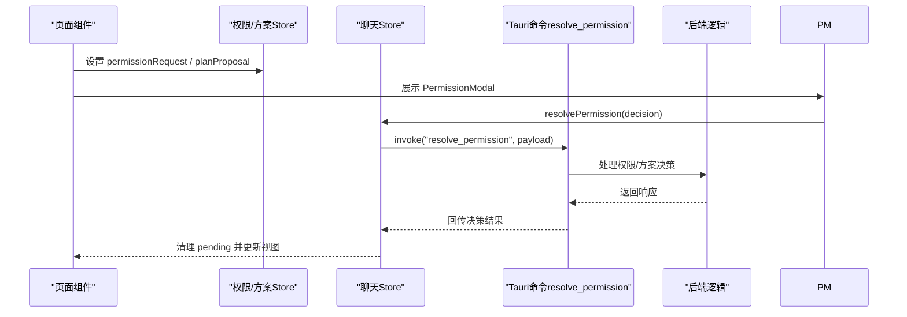
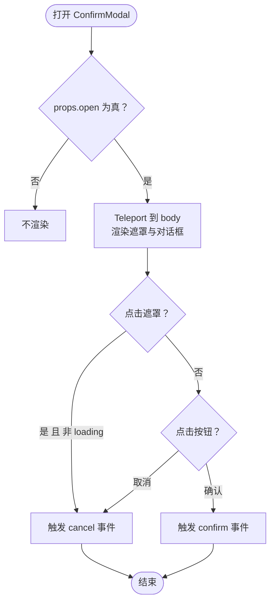
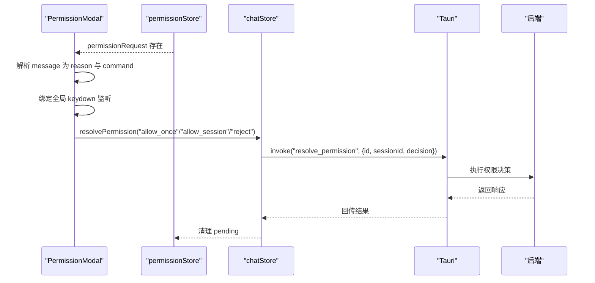
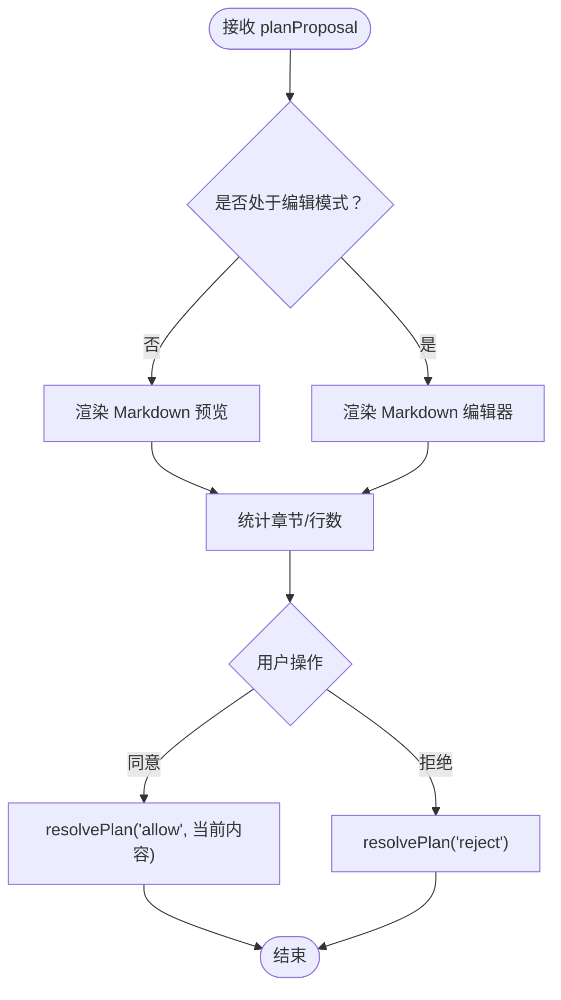
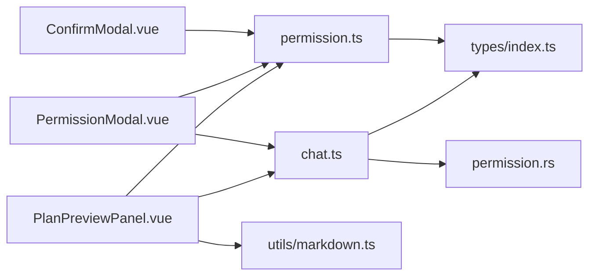

# 通用组件

<cite>
**本文引用的文件**
- [ConfirmModal.vue](file://src/components/common/ConfirmModal.vue)
- [PermissionModal.vue](file://src/components/common/PermissionModal.vue)
- [PlanPreviewPanel.vue](file://src/components/common/PlanPreviewPanel.vue)
- [permission.ts](file://src/stores/permission.ts)
- [chat.ts](file://src/stores/chat.ts)
- [index.ts](file://src/types/index.ts)
- [markdown.ts](file://src/utils/markdown.ts)
- [permission.rs](file://src-tauri/src/core/commands/permission.rs)
</cite>

## 目录
1. [简介](#简介)
2. [项目结构](#项目结构)
3. [核心组件](#核心组件)
4. [架构总览](#架构总览)
5. [详细组件分析](#详细组件分析)
6. [依赖关系分析](#依赖关系分析)
7. [性能考量](#性能考量)
8. [故障排查指南](#故障排查指南)
9. [结论](#结论)
10. [附录](#附录)

## 简介
本文件面向 JarvisAgent 的通用组件，围绕 ConfirmModal 确认模态框、PermissionModal 权限模态框、PlanPreviewPanel 方案预览面板展开，系统性阐述其设计原理、实现细节与最佳实践。重点覆盖：
- 显示/隐藏机制与遮罩层处理
- 键盘事件与点击外部关闭策略
- 权限控制与验证流程
- 方案预览的数据展示、格式化与交互
- 组件复用性、参数传递与事件回调
- 使用指南、样式定制与扩展建议

## 项目结构
通用组件位于 src/components/common 目录，配合 Pinia 状态管理（permission.ts、chat.ts）、类型定义（types/index.ts）以及 Markdown 渲染工具（utils/markdown.ts）共同工作；后端通过 Tauri 命令 resolve_permission 协调权限与方案决策。

图表来源
- [ConfirmModal.vue](file://src/components/common/ConfirmModal.vue)
- [PermissionModal.vue](file://src/components/common/PermissionModal.vue)
- [PlanPreviewPanel.vue](file://src/components/common/PlanPreviewPanel.vue)
- [permission.ts](file://src/stores/permission.ts)
- [chat.ts](file://src/stores/chat.ts)
- [index.ts](file://src/types/index.ts)
- [markdown.ts](file://src/utils/markdown.ts)
- [permission.rs](file://src-tauri/src/core/commands/permission.rs)

章节来源
- [ConfirmModal.vue](file://src/components/common/ConfirmModal.vue)
- [PermissionModal.vue](file://src/components/common/PermissionModal.vue)
- [PlanPreviewPanel.vue](file://src/components/common/PlanPreviewPanel.vue)
- [permission.ts](file://src/stores/permission.ts)
- [chat.ts](file://src/stores/chat.ts)
- [index.ts](file://src/types/index.ts)
- [markdown.ts](file://src/utils/markdown.ts)
- [permission.rs](file://src-tauri/src/core/commands/permission.rs)

## 核心组件
- ConfirmModal：轻量确认对话框，支持标题、消息、警告提示、主/危险按钮样式、加载态禁用与 Teleport 出口挂载。
- PermissionModal：安全权限确认弹窗，解析并展示敏感指令，提供键盘快捷键与三类决策路径（拒绝、允许一次、本次会话始终允许）。
- PlanPreviewPanel：方案预览与审批面板，支持 Markdown 预览/编辑、统计信息、同意/拒绝操作，并与后端持久化方案文档。

章节来源
- [ConfirmModal.vue](file://src/components/common/ConfirmModal.vue)
- [PermissionModal.vue](file://src/components/common/PermissionModal.vue)
- [PlanPreviewPanel.vue](file://src/components/common/PlanPreviewPanel.vue)

## 架构总览
通用组件通过 Pinia Store 与后端命令桥接，形成“前端展示—状态驱动—后端决策”的闭环。权限与方案均以会话维度管理，保证多会话隔离与一致性。

图表来源
- [chat.ts](file://src/stores/chat.ts)
- [permission.rs](file://src-tauri/src/core/commands/permission.rs)

章节来源
- [chat.ts](file://src/stores/chat.ts)
- [permission.rs](file://src-tauri/src/core/commands/permission.rs)

## 详细组件分析

### ConfirmModal 确认模态框
- 显示/隐藏与遮罩
  - 使用 Teleport 将容器挂载至 body，确保层级最高；通过 props.open 控制显隐。
  - 遮罩层背景半透明，点击遮罩触发取消事件（非 loading 状态下）。
- 交互与事件
  - 提供 confirm/cancel 两类事件，按钮 disabled 由 loading 控制。
- 样式与主题
  - 使用 CSS 变量与模糊滤镜实现玻璃拟态风格，适配明暗主题。

图表来源
- [ConfirmModal.vue](file://src/components/common/ConfirmModal.vue)

章节来源
- [ConfirmModal.vue](file://src/components/common/ConfirmModal.vue)

### PermissionModal 权限模态框
- 数据解析与展示
  - 从 permissionStore.permissionRequest.message 中解析“原因”与“待执行指令”，支持 Markdown 风格反引号与冒号分隔两种模式，并对超长内容进行截断与精简。
- 键盘快捷键
  - 支持 A（允许一次）、S（本次会话始终允许）、R/Esc（拒绝），阻止默认行为并立即派发决策。
- 决策流程
  - 通过 chatStore.resolvePermission 将决策下发至后端命令 resolve_permission，随后清理 pending 请求。

图表来源
- [PermissionModal.vue](file://src/components/common/PermissionModal.vue)
- [permission.ts](file://src/stores/permission.ts)
- [chat.ts](file://src/stores/chat.ts)
- [permission.rs](file://src-tauri/src/core/commands/permission.rs)

章节来源
- [PermissionModal.vue](file://src/components/common/PermissionModal.vue)
- [permission.ts](file://src/stores/permission.ts)
- [chat.ts](file://src/stores/chat.ts)
- [permission.rs](file://src-tauri/src/core/commands/permission.rs)

### PlanPreviewPanel 方案预览面板
- 数据与状态
  - 读取 permissionStore.planProposal，支持预览与编辑两种模式；编辑时可保存修改内容。
- Markdown 渲染与统计
  - 使用 marked 进行渲染；统计章节数与有效行数，辅助用户快速评估方案体量。
- 交互与回调
  - 同意：将当前内容（编辑态优先）提交给 chatStore.resolvePlan；拒绝：仅拒绝当前提案。
- 样式与响应式
  - 采用玻璃拟态与渐变背景，深色模式适配；移动端折叠为全宽面板并调整布局。

图表来源
- [PlanPreviewPanel.vue](file://src/components/common/PlanPreviewPanel.vue)
- [permission.ts](file://src/stores/permission.ts)
- [chat.ts](file://src/stores/chat.ts)
- [markdown.ts](file://src/utils/markdown.ts)

章节来源
- [PlanPreviewPanel.vue](file://src/components/common/PlanPreviewPanel.vue)
- [permission.ts](file://src/stores/permission.ts)
- [chat.ts](file://src/stores/chat.ts)
- [markdown.ts](file://src/utils/markdown.ts)

## 依赖关系分析
- 组件依赖
  - ConfirmModal 依赖 props 与 Teleport，无额外依赖。
  - PermissionModal 依赖 permissionStore 与 chatStore，解析消息并绑定全局键盘事件。
  - PlanPreviewPanel 依赖 permissionStore、chatStore 与 marked 渲染。
- 状态与类型
  - permissionStore 维护 per-session 的 permissionRequest 与 planProposal，提供 upsert 与更新方法。
  - chatStore 提供 resolvePermission/resolvePlan、取消与回溯等能力。
  - types/index.ts 定义 PermissionRequest、PlanProposal、PlanDocument 等核心类型。
- 后端集成
  - permission.rs 接收 resolve_permission 调用，更新方案文档状态并回传决策结果。

图表来源
- [ConfirmModal.vue](file://src/components/common/ConfirmModal.vue)
- [PermissionModal.vue](file://src/components/common/PermissionModal.vue)
- [PlanPreviewPanel.vue](file://src/components/common/PlanPreviewPanel.vue)
- [permission.ts](file://src/stores/permission.ts)
- [chat.ts](file://src/stores/chat.ts)
- [index.ts](file://src/types/index.ts)
- [markdown.ts](file://src/utils/markdown.ts)
- [permission.rs](file://src-tauri/src/core/commands/permission.rs)

章节来源
- [permission.ts](file://src/stores/permission.ts)
- [chat.ts](file://src/stores/chat.ts)
- [index.ts](file://src/types/index.ts)
- [permission.rs](file://src-tauri/src/core/commands/permission.rs)

## 性能考量
- ConfirmModal
  - 通过 Teleport 避免 DOM 层级影响，仅在 open 时渲染，减少不必要的计算。
- PermissionModal
  - 全局 keydown 监听仅在组件挂载期间生效，避免内存泄漏；解析逻辑对超长内容进行截断，降低渲染压力。
- PlanPreviewPanel
  - 使用 marked 渲染，结合 computed 缓存与按需切换编辑/预览模式；滚动区域设置为自动滚动，避免大文档导致卡顿。

[本节为通用指导，无需特定文件引用]

## 故障排查指南
- 点击遮罩无法关闭
  - 确认未处于 loading 状态；检查遮罩点击事件绑定与 @click.stop 是否正确。
- 键盘快捷键无效
  - 确保 PermissionModal 处于激活状态且 permissionRequest 存在；检查 keydown 监听是否在 mounted/unmounted 正确注册。
- 权限/方案决策未生效
  - 检查 chatStore.resolvePermission/resolvePlan 是否被调用；确认 Tauri 命令 resolve_permission 是否返回成功；查看 permission.rs 的日志输出。
- 方案内容未更新
  - 确认 isEditing 切换逻辑与 perm.updatePlanProposalContent 是否被调用；检查 v-model 与 watch 的联动。

章节来源
- [ConfirmModal.vue](file://src/components/common/ConfirmModal.vue)
- [PermissionModal.vue](file://src/components/common/PermissionModal.vue)
- [PlanPreviewPanel.vue](file://src/components/common/PlanPreviewPanel.vue)
- [chat.ts](file://src/stores/chat.ts)
- [permission.rs](file://src-tauri/src/core/commands/permission.rs)

## 结论
三个通用组件以统一的状态与事件机制串联前后端，形成清晰的权限与方案治理闭环。ConfirmModal 提供一致的确认体验；PermissionModal 在安全与效率间取得平衡；PlanPreviewPanel 则兼顾可读性与可控性。通过合理的参数化与事件回调，组件具备良好的复用性与扩展空间。

[本节为总结，无需特定文件引用]

## 附录

### 组件参数与事件清单
- ConfirmModal
  - 参数：open、title、message、warning、confirmText、cancelText、confirmKind、loading
  - 事件：confirm、cancel
- PermissionModal
  - 依赖：permissionStore.permissionRequest、chatStore.resolvePermission
  - 事件：键盘 A/S/R/Esc
- PlanPreviewPanel
  - 依赖：permissionStore.planProposal、chatStore.resolvePlan、marked
  - 事件：同意、拒绝、切换编辑/预览

章节来源
- [ConfirmModal.vue](file://src/components/common/ConfirmModal.vue)
- [PermissionModal.vue](file://src/components/common/PermissionModal.vue)
- [PlanPreviewPanel.vue](file://src/components/common/PlanPreviewPanel.vue)

### 样式定制与主题适配
- 通用变量
  - 使用 CSS 变量（如 --surface-*、--glass-*、--text-*）实现主题切换与一致性。
- 模态框与面板
  - 通过 backdrop-filter、box-shadow、渐变背景与圆角实现视觉层次；深色模式下提供独立样式分支。
- 响应式
  - 移动端宽度与布局自适应，按钮与工具栏在窄屏下垂直堆叠。

章节来源
- [ConfirmModal.vue](file://src/components/common/ConfirmModal.vue)
- [PermissionModal.vue](file://src/components/common/PermissionModal.vue)
- [PlanPreviewPanel.vue](file://src/components/common/PlanPreviewPanel.vue)

### 扩展开发建议
- 复用性增强
  - 将 ConfirmModal 的 Teleport 与事件封装为可复用的组合式函数，便于其他弹窗组件复用。
- 权限与方案
  - 对 PermissionModal 的消息解析规则进行配置化，支持更多格式；对 PlanPreviewPanel 增加“导出/导入”能力。
- 性能优化
  - 对 PlanPreviewPanel 的 Markdown 渲染增加节流/防抖；对 PermissionModal 的解析逻辑加入缓存。
- 可访问性
  - 为所有按钮添加 aria-label；为模态框添加 role="dialog" 与 aria-modal；确保键盘导航与焦点管理。

[本节为通用建议，无需特定文件引用]