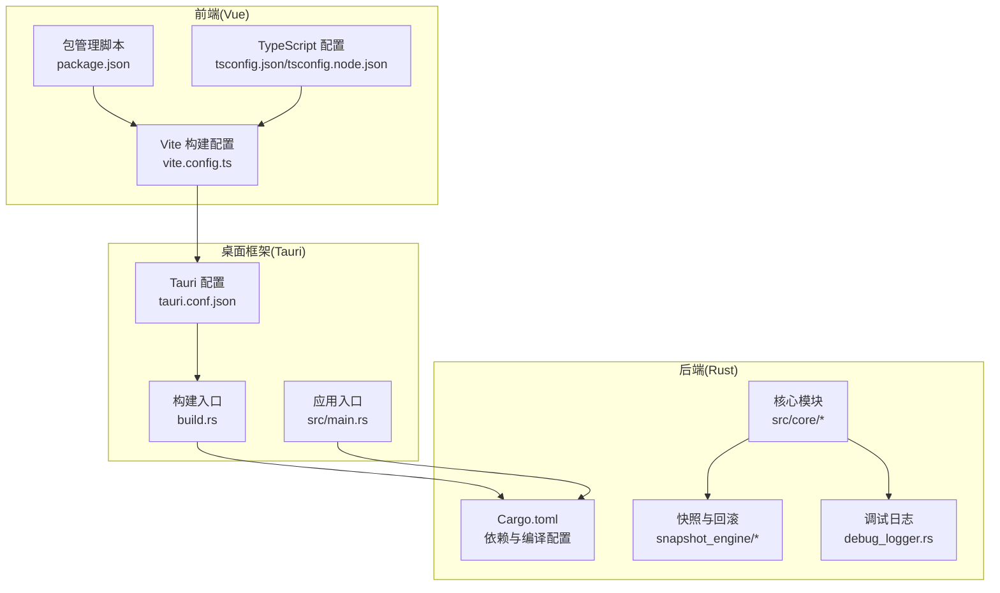
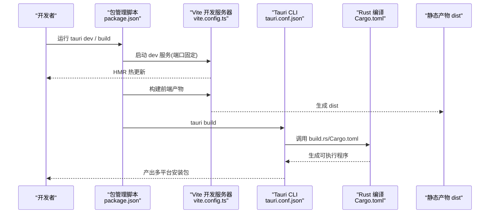
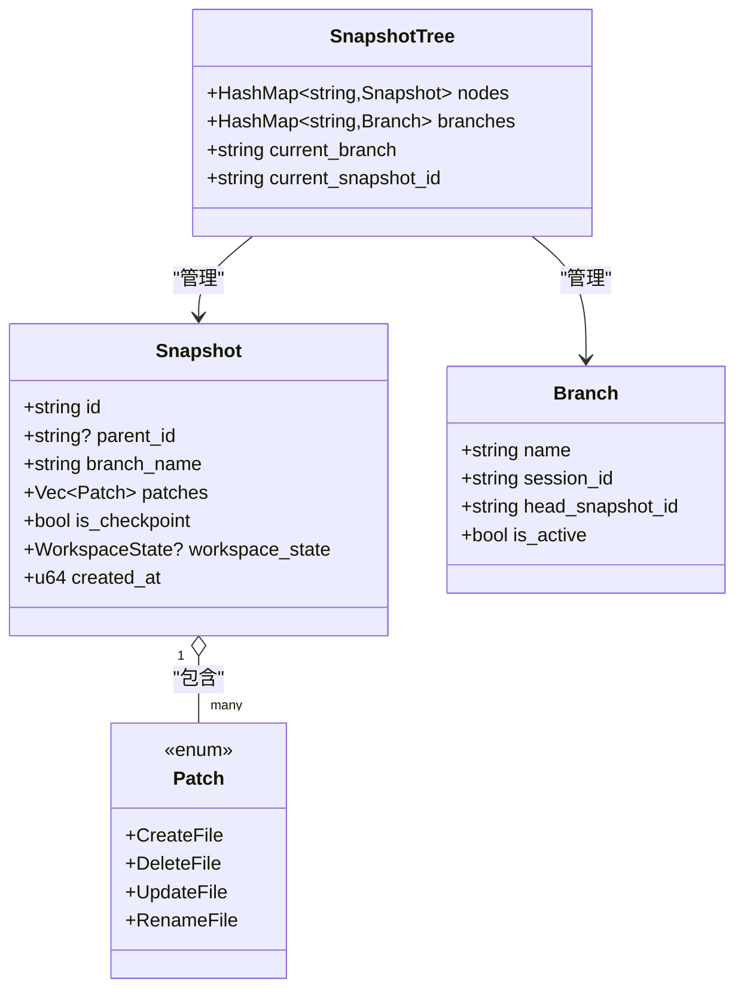
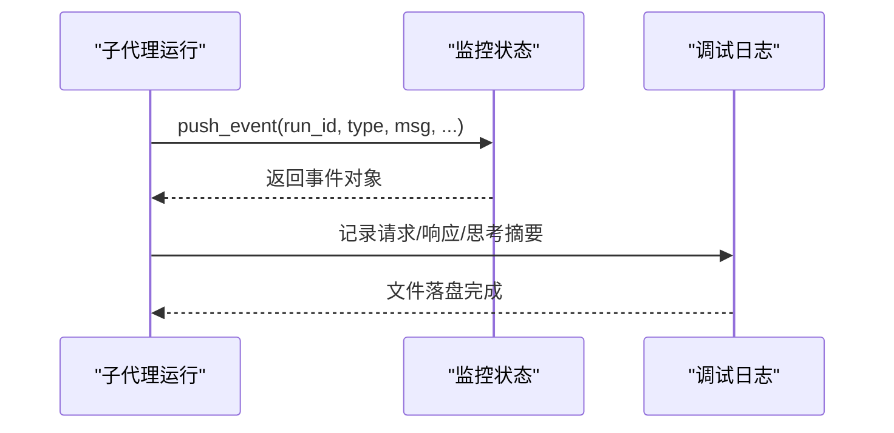
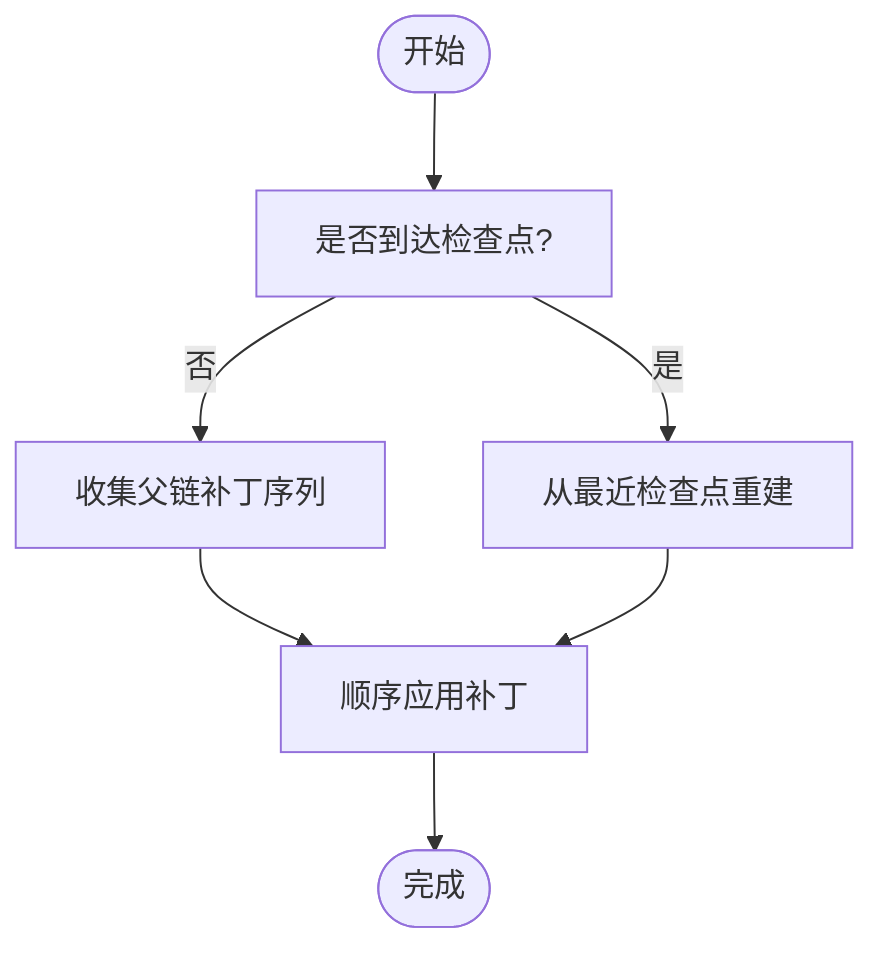
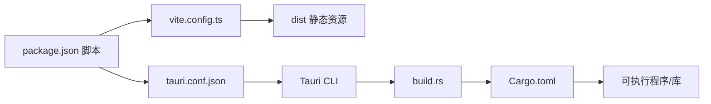

# 部署与运维

<cite>
**本文引用的文件**
- [vite.config.ts](file://vite.config.ts)
- [package.json](file://package.json)
- [tsconfig.json](file://tsconfig.json)
- [tsconfig.node.json](file://tsconfig.node.json)
- [src-tauri/Cargo.toml](file://src-tauri/Cargo.toml)
- [src-tauri/build.rs](file://src-tauri/build.rs)
- [src-tauri/src/main.rs](file://src-tauri/src/main.rs)
- [src-tauri/tauri.conf.json](file://src-tauri/tauri.conf.json)
- [src-tauri/model_registry.json](file://src-tauri/model_registry.json)
- [src-tauri/src/core/debug_logger.rs](file://src-tauri/src/core/debug_logger.rs)
- [src-tauri/src/core/subagents.rs](file://src-tauri/src/core/subagents.rs)
- [src-tauri/src/core/snapshot_engine/journal.rs](file://src-tauri/src/core/snapshot_engine/journal.rs)
- [doc/回滚架构-融合方案.md](file://doc/回滚架构-融合方案.md)
- [README.md](file://README.md)
</cite>

## 目录
1. [简介](#简介)
2. [项目结构](#项目结构)
3. [核心组件](#核心组件)
4. [架构总览](#架构总览)
5. [详细组件分析](#详细组件分析)
6. [依赖关系分析](#依赖关系分析)
7. [性能考虑](#性能考虑)
8. [故障排查指南](#故障排查指南)
9. [结论](#结论)
10. [附录](#附录)

## 简介
本文件面向 JarvisAgent 的部署与运维团队，提供从构建配置、打包发布到性能优化、监控日志、版本与回滚策略以及生产安全加固的完整实践指南。内容覆盖前端 Vite 构建、Rust 编译、Tauri 打包配置，并结合项目实际代码与文档，给出可落地的操作步骤与最佳实践。

## 项目结构
JarvisAgent 采用“前端 Vue + Tauri + Rust 后端”的混合架构。前端通过 Vite 构建，Tauri 在开发与生产阶段分别对接 Vite 服务与静态产物；Rust 后端负责核心 Agent 能力、工具集、快照与回滚引擎等。

图表来源
- [vite.config.ts:1-33](file://vite.config.ts#L1-L33)
- [package.json:1-28](file://package.json#L1-L28)
- [tsconfig.json:1-26](file://tsconfig.json#L1-L26)
- [tsconfig.node.json:1-11](file://tsconfig.node.json#L1-L11)
- [src-tauri/tauri.conf.json:1-40](file://src-tauri/tauri.conf.json#L1-L40)
- [src-tauri/build.rs:1-4](file://src-tauri/build.rs#L1-L4)
- [src-tauri/src/main.rs:1-7](file://src-tauri/src/main.rs#L1-L7)
- [src-tauri/Cargo.toml:1-41](file://src-tauri/Cargo.toml#L1-L41)

章节来源
- [README.md:107-160](file://README.md#L107-L160)

## 核心组件
- 前端构建与开发服务器
  - Vite 配置固定开发端口、禁用清屏、HMR 适配、忽略特定目录监听。
  - TypeScript 配置采用 bundler 模式，严格类型检查。
  - 包脚本提供 dev、build、preview、tauri。
- Tauri 打包与应用配置
  - 开发/构建 URL、前置命令、产物目录。
  - 窗口尺寸、透明无边框、安全策略（CSP 置空）。
  - 打包目标为 all，图标清单。
- Rust 后端
  - 多 crate 类型（staticlib/cdylib/rlib）以适配 Tauri 插件生态。
  - 关键依赖：tauri、reqwest、tokio、serde、uuid、eventsource-stream、futures-util 等。
  - 应用入口在 Windows Release 下隐藏控制台。

章节来源
- [vite.config.ts:8-32](file://vite.config.ts#L8-L32)
- [package.json:6-11](file://package.json#L6-L11)
- [tsconfig.json:9-22](file://tsconfig.json#L9-L22)
- [tsconfig.node.json:2-8](file://tsconfig.node.json#L2-L8)
- [src-tauri/tauri.conf.json:6-11](file://src-tauri/tauri.conf.json#L6-L11)
- [src-tauri/tauri.conf.json:12-27](file://src-tauri/tauri.conf.json#L12-L27)
- [src-tauri/tauri.conf.json:28-38](file://src-tauri/tauri.conf.json#L28-L38)
- [src-tauri/Cargo.toml:10-15](file://src-tauri/Cargo.toml#L10-L15)
- [src-tauri/Cargo.toml:20-39](file://src-tauri/Cargo.toml#L20-L39)
- [src-tauri/src/main.rs:1-7](file://src-tauri/src/main.rs#L1-L7)

## 架构总览
下图展示从开发到打包的关键流程与组件交互：

图表来源
- [package.json:6-11](file://package.json#L6-L11)
- [vite.config.ts:16-31](file://vite.config.ts#L16-L31)
- [src-tauri/tauri.conf.json:6-11](file://src-tauri/tauri.conf.json#L6-L11)
- [src-tauri/build.rs:1-4](file://src-tauri/build.rs#L1-L4)
- [src-tauri/Cargo.toml:1-41](file://src-tauri/Cargo.toml#L1-L41)

## 详细组件分析

### Vite 构建配置
- 固定开发端口与严格端口策略，确保 Tauri dev 与 HMR 协同。
- HMR 支持远程主机（通过环境变量），便于跨设备联调。
- 忽略 src-tauri 与特定日志文件，减少无效监听开销。
- 生产构建由脚本统一触发，配合 TypeScript 类型检查。

章节来源
- [vite.config.ts:16-31](file://vite.config.ts#L16-L31)
- [package.json:7-10](file://package.json#L7-L10)

### TypeScript 编译配置
- 使用 bundler 模式，启用 JSX 保留，JSON 模块解析。
- 严格模式与未使用变量/参数检查，提升代码质量。
- Node 环境配置聚焦于 Vite 配置文件解析。

章节来源
- [tsconfig.json:9-22](file://tsconfig.json#L9-L22)
- [tsconfig.node.json:2-8](file://tsconfig.node.json#L2-L8)

### Tauri 打包配置
- beforeDevCommand / beforeBuildCommand 明确前后端联动。
- devUrl 固定为 Vite 开发端口，保证 HMR 通道。
- 前端产物目录指向 dist，确保构建一致性。
- 窗口透明与无装饰风格，满足现代 UI 设计。
- 安全策略 CSP 置空，便于开发调试；生产建议按需收紧。
- 打包 targets 为 all，生成多平台安装包；图标清单齐全。

章节来源
- [src-tauri/tauri.conf.json:6-11](file://src-tauri/tauri.conf.json#L6-L11)
- [src-tauri/tauri.conf.json:12-27](file://src-tauri/tauri.conf.json#L12-L27)
- [src-tauri/tauri.conf.json:28-38](file://src-tauri/tauri.conf.json#L28-L38)

### Rust 编译与依赖
- 多 crate 类型组合，适配插件与动态库需求。
- 关键依赖：tauri、reqwest（流式 API）、tokio（异步）、eventsource-stream（SSE）、futures-util（流控制）、uuid、regex、thiserror 等。
- 应用入口在 Release 下隐藏控制台，避免多余窗口。

章节来源
- [src-tauri/Cargo.toml:10-15](file://src-tauri/Cargo.toml#L10-L15)
- [src-tauri/Cargo.toml:20-39](file://src-tauri/Cargo.toml#L20-L39)
- [src-tauri/src/main.rs:1-7](file://src-tauri/src/main.rs#L1-L7)

### 模型能力注册表
- 以 JSON 维护模型能力清单，包含流式、思考模式、最大 Token、视觉等元数据。
- 通过 include_str!() 编译时内嵌，减少运行时文件依赖。

章节来源
- [src-tauri/model_registry.json:1-496](file://src-tauri/model_registry.json#L1-L496)

### 快照与回滚引擎（代码级）

图表来源
- [doc/回滚架构-融合方案.md:101-211](file://doc/回滚架构-融合方案.md#L101-L211)

章节来源
- [doc/回滚架构-融合方案.md:101-211](file://doc/回滚架构-融合方案.md#L101-L211)

### 子代理事件监控（代码级）

图表来源
- [src-tauri/src/core/subagents.rs:565-608](file://src-tauri/src/core/subagents.rs#L565-L608)
- [src-tauri/src/core/debug_logger.rs:29-63](file://src-tauri/src/core/debug_logger.rs#L29-L63)

章节来源
- [src-tauri/src/core/subagents.rs:565-608](file://src-tauri/src/core/subagents.rs#L565-L608)
- [src-tauri/src/core/debug_logger.rs:29-63](file://src-tauri/src/core/debug_logger.rs#L29-L63)

### 快照时间线与回放（算法级）

图表来源
- [doc/回滚架构-融合方案.md:320-377](file://doc/回滚架构-融合方案.md#L320-L377)

章节来源
- [doc/回滚架构-融合方案.md:320-377](file://doc/回滚架构-融合方案.md#L320-L377)

## 依赖关系分析
- 前端依赖
  - Vue 3 + TypeScript + Vite，构建脚本与类型检查分离。
  - Tauri 插件系列（dialog/fs/opener）用于系统能力桥接。
- 后端依赖
  - tauri 作为桌面框架核心；reqwest 用于流式 API；tokio 提供异步运行时；eventsource-stream 处理 SSE。
  - serde/serde_json 用于数据序列化；uuid/regex/thiserror 提升工程健壮性。
- 构建链路
  - package.json 脚本驱动 Vite 构建与 Tauri 打包；build.rs 调用 tauri_build；Cargo.toml 定义 Rust 产物类型与依赖。

图表来源
- [package.json:6-11](file://package.json#L6-L11)
- [vite.config.ts:1-33](file://vite.config.ts#L1-L33)
- [src-tauri/tauri.conf.json:1-40](file://src-tauri/tauri.conf.json#L1-L40)
- [src-tauri/build.rs:1-4](file://src-tauri/build.rs#L1-L4)
- [src-tauri/Cargo.toml:1-41](file://src-tauri/Cargo.toml#L1-L41)

章节来源
- [package.json:12-26](file://package.json#L12-L26)
- [src-tauri/Cargo.toml:20-39](file://src-tauri/Cargo.toml#L20-L39)

## 性能考虑
- 启动与首屏
  - 固定开发端口与 HMR，缩短热更新延迟；生产构建前先进行类型检查，降低运行期异常。
  - Tauri 窗口透明与无装饰减少渲染层级，配合前端动画与懒加载优化首屏体验。
- 资源与体积
  - 前端构建产物由 Vite 管理，建议在生产构建时启用压缩与最小化（Vite 默认行为）。
  - Rust 产物类型包含 staticlib/cdylib/rlib，利于插件与动态库复用，减少重复链接开销。
- 异步与流式
  - 后端使用 tokio 与 reqwest 流式处理，降低内存峰值与延迟；SSE 流适配多模型响应。
- 回滚与快照
  - 混合存储（检查点 + 补丁链）减少回放成本；懒重建（基于 LCA）在频繁切换分支时显著提速。

章节来源
- [vite.config.ts:16-31](file://vite.config.ts#L16-L31)
- [src-tauri/Cargo.toml:28-32](file://src-tauri/Cargo.toml#L28-L32)
- [doc/回滚架构-融合方案.md:589-639](file://doc/回滚架构-融合方案.md#L589-L639)

## 故障排查指南
- 开发阶段
  - 端口占用：Vite 严格端口策略会阻止启动，优先释放 1420/1421 或调整配置。
  - HMR 不生效：确认 TAURI_DEV_HOST 环境变量与 host 一致，或关闭远程 HMR。
- 构建阶段
  - 类型检查失败：先执行类型检查脚本，修复 TS 错误后再进行生产构建。
  - Tauri 打包失败：检查 beforeBuildCommand 与前端 dist 生成路径是否一致。
- 运行阶段
  - 日志定位：调试日志写入运行目录下的日志文件，包含请求/响应与思考摘要。
  - 子代理事件：事件队列上限控制，关注事件溢出与丢失风险。
  - 快照回放：若回滚后文件不一致，检查 UndoLog 与磁盘原子回滚流程。

章节来源
- [vite.config.ts:16-26](file://vite.config.ts#L16-L26)
- [package.json:7-10](file://package.json#L7-L10)
- [src-tauri/src/core/debug_logger.rs:29-63](file://src-tauri/src/core/debug_logger.rs#L29-L63)
- [src-tauri/src/core/subagents.rs:603-607](file://src-tauri/src/core/subagents.rs#L603-L607)
- [src-tauri/src/core/snapshot_engine/journal.rs:76-83](file://src-tauri/src/core/snapshot_engine/journal.rs#L76-L83)

## 结论
本指南基于项目现有配置与代码，给出了从构建到打包、从性能优化到监控日志与回滚策略的运维实践。建议在生产环境中进一步收紧安全策略（如 CSP）、完善自动化测试与发布流水线，并持续优化快照与回滚的性能与可靠性。

## 附录

### 打包发布流程（多平台）
- 开发模式
  - 使用 Tauri 开发命令启动，Vite 提供热更新与固定端口。
- 生产构建
  - 先执行类型检查，再执行前端构建，最后执行 Tauri 打包。
- 多平台产物
  - 配置已启用 all 目标，生成多平台安装包；可根据需要细化目标。

章节来源
- [README.md:60-71](file://README.md#L60-L71)
- [package.json:7-10](file://package.json#L7-L10)
- [src-tauri/tauri.conf.json:28-38](file://src-tauri/tauri.conf.json#L28-L38)

### 版本管理与回滚策略
- 版本号
  - 前端与后端均维护版本号，建议统一管理并在 CI 中校验。
- 回滚
  - 基于快照树与补丁链的混合存储，支持原子性回滚与懒重建，降低回滚成本。
  - 建议在关键节点创建检查点，定期清理旧分支与冗余快照。

章节来源
- [src-tauri/tauri.conf.json:3-5](file://src-tauri/tauri.conf.json#L3-L5)
- [doc/回滚架构-融合方案.md:589-639](file://doc/回滚架构-融合方案.md#L589-L639)

### 监控与日志
- 调试日志
  - 请求/响应/思考摘要落盘，便于问题复现与性能分析。
- 子代理事件
  - 事件队列记录运行状态、Token 使用、错误信息，支持事件上限控制。
- 快照时间线
  - 通过时间线与回放能力验证变更影响范围。

章节来源
- [src-tauri/src/core/debug_logger.rs:29-105](file://src-tauri/src/core/debug_logger.rs#L29-L105)
- [src-tauri/src/core/subagents.rs:565-608](file://src-tauri/src/core/subagents.rs#L565-L608)
- [src-tauri/src/core/snapshot_engine/journal.rs:76-96](file://src-tauri/src/core/snapshot_engine/journal.rs#L76-L96)

### 安全加固建议
- CSP 策略
  - 开发阶段 CSP 置空便于调试；生产阶段建议明确白名单，限制外链与内联脚本。
- 窗口与透明
  - 透明窗口可能带来额外合成开销，建议在性能敏感场景关闭透明。
- 模型与凭据
  - 模型能力注册表集中管理，避免硬编码；API 凭据通过安全渠道注入。

章节来源
- [src-tauri/tauri.conf.json:24-26](file://src-tauri/tauri.conf.json#L24-L26)
- [src-tauri/tauri.conf.json:12-23](file://src-tauri/tauri.conf.json#L12-L23)
- [src-tauri/model_registry.json:1-4](file://src-tauri/model_registry.json#L1-L4)