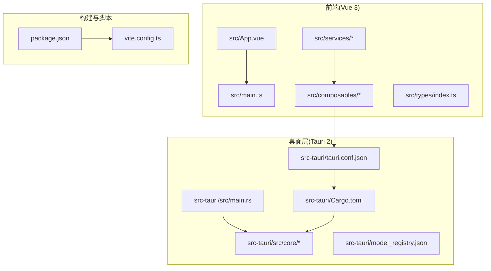
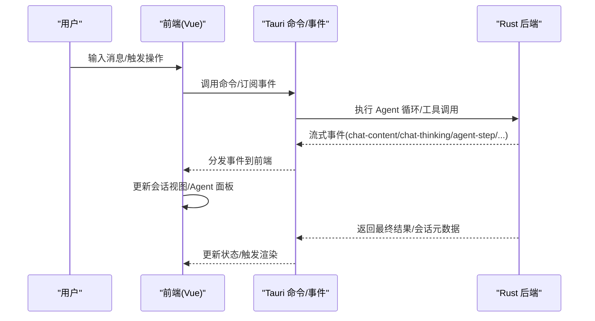
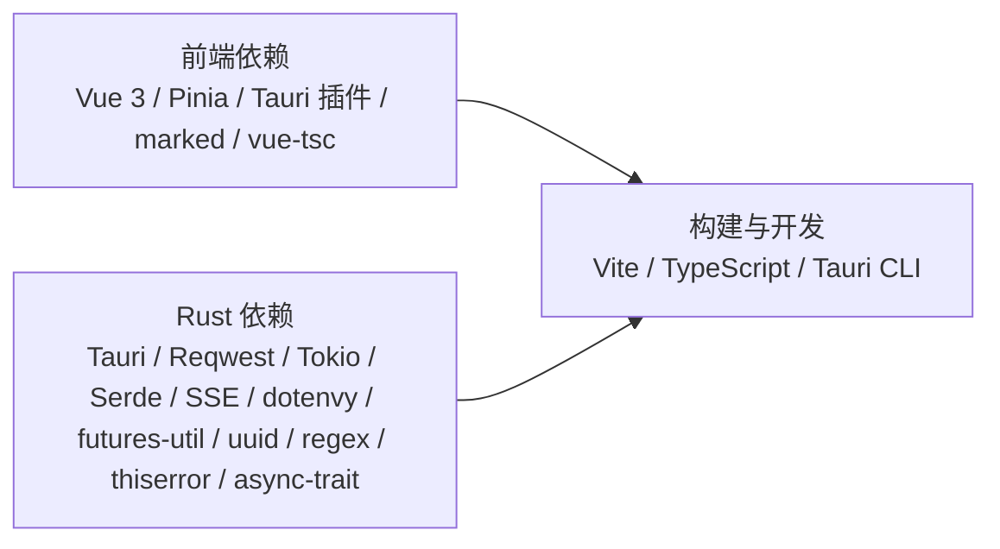

# 快速开始

<cite>
**本文引用的文件**
- [README.md](file://README.md)
- [package.json](file://package.json)
- [vite.config.ts](file://vite.config.ts)
- [src-tauri/Cargo.toml](file://src-tauri/Cargo.toml)
- [src-tauri/tauri.conf.json](file://src-tauri/tauri.conf.json)
- [src-tauri/src/main.rs](file://src-tauri/src/main.rs)
- [src/App.vue](file://src/App.vue)
- [src/main.ts](file://src/main.ts)
- [src/services/snapshotService.ts](file://src/services/snapshotService.ts)
- [src/composables/useAgentEvents.ts](file://src/composables/useAgentEvents.ts)
- [src/stores/session.ts](file://src/stores/session.ts)
- [src/stores/agent.ts](file://src/stores/agent.ts)
- [src/types/index.ts](file://src/types/index.ts)
- [src-tauri/model_registry.json](file://src-tauri/model_registry.json)
</cite>

## 目录
1. [简介](#简介)
2. [项目结构](#项目结构)
3. [核心组件](#核心组件)
4. [架构总览](#架构总览)
5. [详细组件分析](#详细组件分析)
6. [依赖分析](#依赖分析)
7. [性能考虑](#性能考虑)
8. [故障排除指南](#故障排除指南)
9. [结论](#结论)
10. [附录](#附录)

## 简介
本指南面向首次接触 JarvisAgent 的开发者与用户，帮助你在本地完成环境准备、依赖安装、开发与构建，并在首次运行时完成基础配置。项目采用 Tauri 2 + Vue 3 技术栈，前端使用 Vite 提供热重载开发体验，后端以 Rust 实现，支持多模型大语言模型（LLM）与丰富的工具集，具备会话管理、子代理委派、方案审批、快照与沙箱等功能。

## 项目结构
JarvisAgent 采用前后端分离的工程组织方式：
- 前端（Vue 3 + TypeScript）位于 src 目录，使用 Vite 构建与热重载
- 桌面层（Tauri 2）位于 src-tauri 目录，Rust 后端负责核心 Agent 循环、工具调用、会话与快照管理
- 根目录包含包管理脚本、构建配置与模型能力注册表

图表来源
- [src/App.vue](file://src/App.vue)
- [src/main.ts](file://src/main.ts)
- [src-tauri/tauri.conf.json](file://src-tauri/tauri.conf.json)
- [src-tauri/Cargo.toml](file://src-tauri/Cargo.toml)
- [src-tauri/src/main.rs](file://src-tauri/src/main.rs)
- [package.json](file://package.json)
- [vite.config.ts](file://vite.config.ts)

章节来源
- [README.md: 第107-160行:107-160](file://README.md#L107-L160)

## 核心组件
- 前端应用入口与根组件：应用启动、状态注入与布局渲染
- 事件监听与会话状态：负责接收后端事件、维护会话视图与 Agent 执行状态
- 会话与 Agent 状态管理：Pinia Store 管理当前会话、Agent 运行记录与子代理状态
- 快照服务：封装对后端快照与沙箱相关命令的调用
- 模型能力注册表：集中管理支持的模型及其参数与能力

章节来源
- [src/main.ts: 1-9:1-9](file://src/main.ts#L1-L9)
- [src/App.vue: 1-35:1-35](file://src/App.vue#L1-L35)
- [src/composables/useAgentEvents.ts: 1-452:1-452](file://src/composables/useAgentEvents.ts#L1-L452)
- [src/stores/session.ts: 1-163:1-163](file://src/stores/session.ts#L1-L163)
- [src/stores/agent.ts: 1-95:1-95](file://src/stores/agent.ts#L1-L95)
- [src/services/snapshotService.ts: 1-248:1-248](file://src/services/snapshotService.ts#L1-L248)
- [src-tauri/model_registry.json: 1-496:1-496](file://src-tauri/model_registry.json#L1-L496)

## 架构总览
JarvisAgent 的运行时由前端 Vue 应用与 Rust 后端协作构成。前端通过 Tauri 事件与命令与后端通信，后端负责模型调用、工具执行、会话与快照管理，并通过 SSE 流式返回结果。

图表来源
- [src/composables/useAgentEvents.ts: 143-441:143-441](file://src/composables/useAgentEvents.ts#L143-L441)
- [src/services/snapshotService.ts: 14-229:14-229](file://src/services/snapshotService.ts#L14-L229)
- [src-tauri/tauri.conf.json: 6-11:6-11](file://src-tauri/tauri.conf.json#L6-L11)

## 详细组件分析

### 环境准备与安装
- 前端依赖安装
  - 使用 pnpm 或 npm 安装前端依赖，Rust 依赖将在首次构建时自动安装
- 开发模式
  - 使用 Tauri 的开发命令启动热重载
- 生产构建
  - 使用 Tauri 的构建命令生成可分发包

章节来源
- [README.md: 第43-71行:43-71](file://README.md#L43-L71)
- [package.json: 6-11:6-11](file://package.json#L6-L11)

### 首次运行与基本配置
- 首次运行时，点击右上角设置按钮进行配置：
  - API Key：你的 LLM API 密钥
  - Base URL：API 端点地址（自动补全路径）
  - API Format：选择 openai 或 anthropic 格式
  - 主模型：用于主代理和子代理的模型
  - 工具模型：用于意图分类和记忆管理的轻量模型（可选更便宜的模型）
  - 深度思考：开启/关闭思考模式
- 支持多预设（Profile）管理，可为不同场景切换配置

章节来源
- [README.md: 第72-84行:72-84](file://README.md#L72-L84)

### 开发模式与构建命令
- 开发模式（热重载）
  - 使用 Tauri 开发命令启动前端与后端联调
- 类型检查
  - 使用构建脚本同时执行类型检查
- 生产构建
  - 使用 Tauri 构建命令生成应用包

章节来源
- [README.md: 第244-255行:244-255](file://README.md#L244-L255)
- [package.json: 6-11:6-11](file://package.json#L6-L11)

### 数据存储与工作目录
- 应用数据存储在运行目录下，包含配置、会话、任务、日志、快照、技能与记忆等
- 首次运行会创建工作区路径记录，后续可通过系统工具设置工作目录

章节来源
- [README.md: 第257-274行:257-274](file://README.md#L257-L274)

### 模型支持与能力注册
- 支持多家模型供应商与多款模型，覆盖推理、思考、视觉等能力
- 模型能力注册表集中管理模型参数与能力，便于扩展新模型

章节来源
- [README.md: 第85-105行:85-105](file://README.md#L85-L105)
- [src-tauri/model_registry.json: 1-496:1-496](file://src-tauri/model_registry.json#L1-L496)

### Agent 循环与子代理委派
- Agent 循环：用户输入 → 意图分类 → 加载工具集 → Agent 循环（思考→工具调用→观察）→ 流式输出
- 子代理委派：主代理编排任务，子代理在独立上下文中执行，避免污染主对话

章节来源
- [README.md: 第164-187行:164-187](file://README.md#L164-L187)

### 方案审批流程
- 复杂任务执行流程：AI 提交方案 → 前端弹出预览面板（Markdown 渲染）→ 用户审阅并决策（同意/拒绝）→ 同意后创建任务执行

章节来源
- [README.md: 第191-201行:191-201](file://README.md#L191-L201)

### 上下文管理与安全特性
- 自动压缩：对话超过阈值时自动触发压缩，保留近期上下文
- 手动压缩：通过 compact 工具主动清理
- 记忆归档：dream 工具将碎片记忆提炼为结构化用户画像
- 安全特性：沙箱限制、权限审批、循环检测、危险操作拦截、Git 安全、路径安全

章节来源
- [README.md: 第202-243行:202-243](file://README.md#L202-L243)

## 依赖分析
- 前端依赖
  - Vue 3、Pinia、Tauri 插件（fs、dialog、opener）、marked、vue-tsc 等
- Rust 依赖
  - Tauri 2、Reqwest（HTTP 客户端）、Tokio（异步运行时）、Serde（序列化）、eventsource-stream（SSE）、dotenvy（.env）、futures-util、uuid、regex、thiserror、async-trait 等
- 构建与开发
  - Vite、TypeScript、Vue 3 插件、Tauri CLI

图表来源
- [package.json: 12-27:12-27](file://package.json#L12-L27)
- [src-tauri/Cargo.toml: 20-40:20-40](file://src-tauri/Cargo.toml#L20-L40)

章节来源
- [package.json: 12-27:12-27](file://package.json#L12-L27)
- [src-tauri/Cargo.toml: 20-40:20-40](file://src-tauri/Cargo.toml#L20-L40)

## 性能考虑
- 前端热重载与最小化错误屏蔽，提升开发效率
- 后端使用异步运行时与流式处理，降低延迟并提高吞吐
- 会话与上下文的自动压缩减少内存占用
- 建议在开发阶段使用工具模型以降低成本，生产阶段根据需求选择更高性能的主模型

## 故障排除指南
- 端口冲突
  - Tauri 开发使用固定端口，若被占用会导致启动失败。请确保端口可用或调整配置
- 环境版本不满足
  - 确保 Node.js、Rust 与 pnpm/npm 版本满足最低要求
- 模型配置错误
  - 确认 API Key、Base URL、API Format 与所选模型一致
- 权限与沙箱限制
  - 敏感操作需要用户确认；沙箱限制会拦截越权路径与危险命令
- 事件重复或丢失
  - 前端事件监听包含去重逻辑，若出现异常可尝试重启应用或检查后端事件流

章节来源
- [vite.config.ts: 14-31:14-31](file://vite.config.ts#L14-L31)
- [README.md: 第45-50行:45-50](file://README.md#L45-L50)
- [README.md: 第235-243行:235-243](file://README.md#L235-L243)
- [src/composables/useAgentEvents.ts: 24-29:24-29](file://src/composables/useAgentEvents.ts#L24-L29)

## 结论
通过本快速开始指南，你可以在本地完成环境准备、依赖安装与开发调试，并在首次运行时完成基础配置。随着对项目结构与核心组件的深入理解，你可以进一步探索模型扩展、工具集成与快照/沙箱等高级功能。

## 附录

### 开发与构建命令清单
- 安装依赖：前端依赖安装，Rust 依赖在首次构建时自动安装
- 开发模式：启动热重载开发
- 类型检查：执行类型检查
- 生产构建：生成应用包

章节来源
- [README.md: 第43-71行:43-71](file://README.md#L43-L71)
- [README.md: 第244-255行:244-255](file://README.md#L244-L255)
- [package.json: 6-11:6-11](file://package.json#L6-L11)

### 首次运行配置清单
- API Key、Base URL、API Format
- 主模型与工具模型
- 深度思考模式开关
- 多预设管理

章节来源
- [README.md: 第72-84行:72-84](file://README.md#L72-L84)