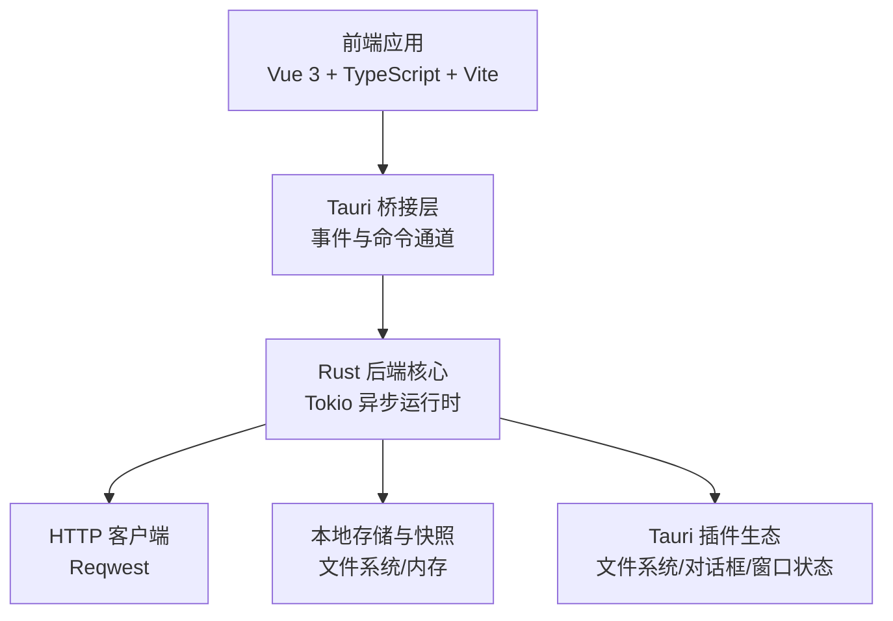
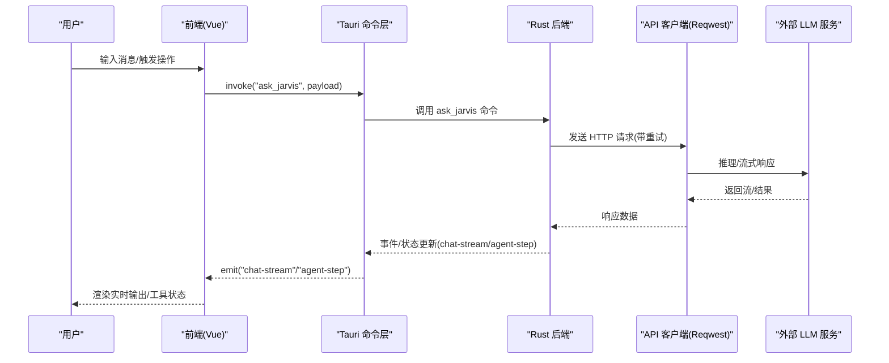
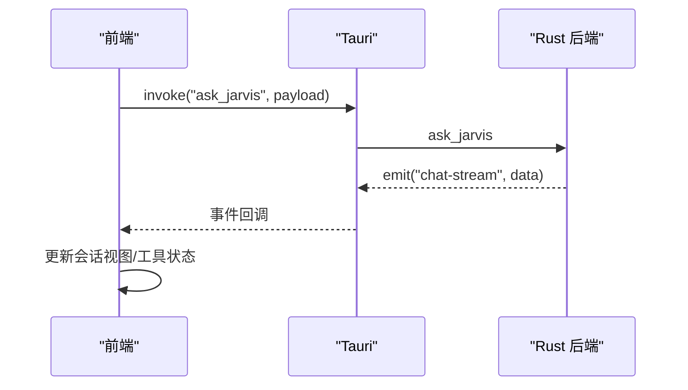
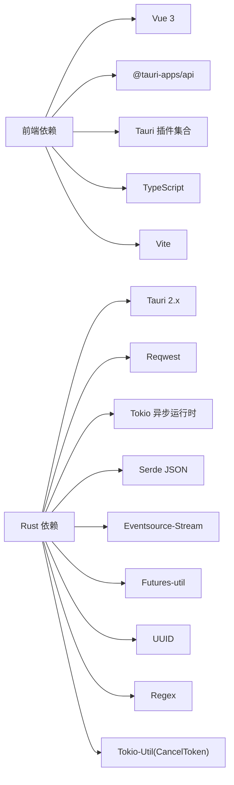

# 技术栈

<cite>
**本文引用的文件**
- [package.json](file://package.json)
- [vite.config.ts](file://vite.config.ts)
- [tsconfig.json](file://tsconfig.json)
- [src-tauri/Cargo.toml](file://src-tauri/Cargo.toml)
- [src-tauri/tauri.conf.json](file://src-tauri/tauri.conf.json)
- [src/main.ts](file://src/main.ts)
- [src/App.vue](file://src/App.vue)
- [src/composables/useJarvis.ts](file://src/composables/useJarvis.ts)
- [src/types/index.ts](file://src/types/index.ts)
- [src-tauri/src/main.rs](file://src-tauri/src/main.rs)
- [src-tauri/src/lib.rs](file://src-tauri/src/lib.rs)
- [src-tauri/src/core/agent.rs](file://src-tauri/src/core/agent.rs)
- [src-tauri/src/core/api_client.rs](file://src-tauri/src/core/api_client.rs)
</cite>

## 目录
1. [引言](#引言)
2. [项目结构](#项目结构)
3. [核心组件](#核心组件)
4. [架构总览](#架构总览)
5. [详细组件分析](#详细组件分析)
6. [依赖关系分析](#依赖关系分析)
7. [性能考量](#性能考量)
8. [故障排查指南](#故障排查指南)
9. [结论](#结论)
10. [附录](#附录)

## 引言
本文件系统性梳理 JarvisAgent 的技术栈与架构设计，覆盖前端技术栈（Vue 3 + TypeScript + Vite）、桌面框架（Tauri 2.0）、后端技术（Rust + Tokio 异步运行时）、HTTP 客户端（Reqwest）以及数据库与存储方案。文档解释每项技术的选择原因、技术优势及其在项目中的具体作用，阐明技术栈之间的协作关系与数据流向，并提供版本要求与兼容性信息，帮助开发者快速理解并高效参与开发。

## 项目结构
JarvisAgent 采用“前端 Vue 应用 + Tauri 桌面桥接 + Rust 后端”的分层架构：
- 前端层：基于 Vue 3 + TypeScript + Vite，负责用户界面与交互逻辑。
- 桥接层：Tauri 2.0 将前端渲染与 Rust 后端能力绑定，提供安全的原生能力调用通道。
- 后端层：Rust 实现的业务核心，包含会话管理、快照引擎、工具调用、权限控制、LLM 适配与事件流处理等。

图表来源
- [src-tauri/src/lib.rs:87-185](file://src-tauri/src/lib.rs#L87-L185)
- [src-tauri/src/main.rs:4-6](file://src-tauri/src/main.rs#L4-L6)
- [src-tauri/Cargo.toml:20-39](file://src-tauri/Cargo.toml#L20-L39)

章节来源
- [package.json:12-26](file://package.json#L12-L26)
- [vite.config.ts:1-33](file://vite.config.ts#L1-L33)
- [tsconfig.json:1-26](file://tsconfig.json#L1-L26)
- [src-tauri/tauri.conf.json:6-11](file://src-tauri/tauri.conf.json#L6-L11)
- [src-tauri/src/lib.rs:87-185](file://src-tauri/src/lib.rs#L87-L185)

## 核心组件
- 前端入口与应用结构
  - 入口文件负责创建 Vue 应用并挂载根组件，全局样式在入口处统一引入。
  - 应用根组件组织布局、侧边栏、聊天区域、终端输入、代理执行面板等模块。
- 前端状态与事件
  - 使用组合式函数封装与后端通信、事件监听、会话状态管理、工具执行状态与 Markdown 渲染等。
  - 类型定义集中于类型文件，保证前后端数据契约一致。
- Tauri 配置与构建
  - 前端开发服务器端口固定，便于 Tauri 以固定 URL 拉起前端。
  - Tauri 配置声明应用名称、窗口尺寸、安全策略与打包图标等。
- Rust 后端入口
  - 通过 Tauri Builder 注册状态管理器与命令处理器，加载插件，暴露给前端调用。
- HTTP 客户端与 LLM 适配
  - 使用 Reqwest 发送请求，支持 OpenAI/Antrophic 等格式，内置指数退避重试与 SSE 流式响应处理。

章节来源
- [src/main.ts:1-6](file://src/main.ts#L1-L6)
- [src/App.vue:1-82](file://src/App.vue#L1-L82)
- [src/composables/useJarvis.ts:620-800](file://src/composables/useJarvis.ts#L620-L800)
- [src/types/index.ts:1-167](file://src/types/index.ts#L1-L167)
- [src-tauri/src/main.rs:4-6](file://src-tauri/src/main.rs#L4-L6)
- [src-tauri/src/lib.rs:57-185](file://src-tauri/src/lib.rs#L57-L185)
- [src-tauri/src/core/api_client.rs:4-75](file://src-tauri/src/core/api_client.rs#L4-L75)

## 架构总览
下图展示从用户输入到 LLM 推理再到工具执行与事件回传的完整数据流：

图表来源
- [src-tauri/src/lib.rs:102-182](file://src-tauri/src/lib.rs#L102-L182)
- [src-tauri/src/core/agent.rs:560-600](file://src-tauri/src/core/agent.rs#L560-L600)
- [src-tauri/src/core/api_client.rs:4-75](file://src-tauri/src/core/api_client.rs#L4-L75)
- [src/composables/useJarvis.ts:620-790](file://src/composables/useJarvis.ts#L620-L790)

## 详细组件分析

### 前端技术栈：Vue 3 + TypeScript + Vite
- 选择原因与优势
  - Vue 3：组合式 API、更好的 Tree-shaking、更佳的开发体验与生态。
  - TypeScript：强类型保障、完善 IDE 支持、降低协作成本。
  - Vite：极速冷启动、按需编译、热更新稳定。
- 在项目中的作用
  - 应用入口负责创建根实例与全局样式。
  - 根组件组织页面布局与功能模块。
  - 组合式函数封装与后端的事件通信、状态管理与渲染优化。
- 版本与兼容性
  - Vue 3、TypeScript ~5.6、Vite ~6.0、TS 编译器选项采用 ESNext 模块解析与严格模式。

章节来源
- [src/main.ts:1-6](file://src/main.ts#L1-L6)
- [src/App.vue:1-82](file://src/App.vue#L1-L82)
- [src/composables/useJarvis.ts:1-120](file://src/composables/useJarvis.ts#L1-L120)
- [package.json:12-26](file://package.json#L12-L26)
- [vite.config.ts:1-33](file://vite.config.ts#L1-L33)
- [tsconfig.json:1-26](file://tsconfig.json#L1-L26)

### 桌面框架：Tauri 2.0
- 选择原因与优势
  - 更小的二进制体积、更强的安全模型、更低的资源占用。
  - 与前端无缝集成，通过 invoke/emit 提供命令与事件通道。
- 在项目中的作用
  - 作为桥接层承载前端与 Rust 后端的通信，注册状态管理器与命令处理器。
  - 提供官方插件（文件系统、对话框、窗口状态等）增强原生能力。
- 版本与兼容性
  - Tauri CLI 与核心库版本在依赖中明确指定，前端开发服务器端口固定以便 Tauri 拉起。

章节来源
- [src-tauri/src/lib.rs:87-185](file://src-tauri/src/lib.rs#L87-L185)
- [src-tauri/tauri.conf.json:6-11](file://src-tauri/tauri.conf.json#L6-L11)
- [package.json:20-26](file://package.json#L20-L26)

### 后端技术：Rust + Tokio 异步运行时
- 选择原因与优势
  - 内存安全、零成本抽象、高并发与低延迟。
  - Tokio 提供成熟的异步运行时与任务取消机制。
- 在项目中的作用
  - 实现会话管理、快照引擎、工具调用、权限控制、意图识别与 LLM 适配。
  - 通过 Reqwest 进行 HTTP 请求，支持 SSE 流式响应与指数退避重试。
- 版本与兼容性
  - Rust 语言特性与标准库结合 Tokio 异步生态，满足高性能与可靠性需求。

章节来源
- [src-tauri/src/lib.rs:28-46](file://src-tauri/src/lib.rs#L28-L46)
- [src-tauri/src/core/agent.rs:1-20](file://src-tauri/src/core/agent.rs#L1-L20)
- [src-tauri/src/core/api_client.rs:1-20](file://src-tauri/src/core/api_client.rs#L1-L20)
- [src-tauri/Cargo.toml:28-39](file://src-tauri/Cargo.toml#L28-L39)

### HTTP 客户端：Reqwest
- 选择原因与优势
  - 异步、类型安全、支持 JSON 与流式传输，适合 LLM 推理与事件流处理。
- 在项目中的作用
  - 统一封装 LLM 请求，支持 OpenAI/Antrophic 协议头与消息体转换。
  - 内置指数退避重试与错误分类，提升鲁棒性。
- 版本与兼容性
  - 明确版本约束，配合 Tokio 与 SSE 流处理库协同工作。

章节来源
- [src-tauri/src/core/api_client.rs:4-75](file://src-tauri/src/core/api_client.rs#L4-L75)
- [src-tauri/src/core/agent.rs:206-227](file://src-tauri/src/core/agent.rs#L206-L227)

### 数据库与存储方案
- 文件系统与本地存储
  - 项目主要依赖文件系统进行工作目录、会话元数据、快照与临时文件的持久化。
  - 通过 Tauri 插件提供受控的文件系统访问能力。
- 内存与缓存
  - 会话状态、工具执行状态与事件在内存中维护，结合前端渲染与事件驱动更新。
- 快照与检查点
  - 快照引擎与检查点机制用于版本控制与回滚，数据结构在类型定义中清晰描述。

章节来源
- [src-tauri/src/lib.rs:13-25](file://src-tauri/src/lib.rs#L13-L25)
- [src/types/index.ts:216-307](file://src/types/index.ts#L216-L307)

### 事件与命令通道（前端 ↔ 后端）
- 前端通过 Tauri 的 invoke 调用后端命令，后端通过 emit 向前端推送事件。
- 关键事件包括聊天流、工具状态、代理步骤、计划文档与子代理运行状态等。
- 前端组合式函数对事件进行聚合、渲染与状态同步。

图表来源
- [src-tauri/src/lib.rs:102-182](file://src-tauri/src/lib.rs#L102-L182)
- [src/composables/useJarvis.ts:620-790](file://src/composables/useJarvis.ts#L620-L790)

章节来源
- [src/composables/useJarvis.ts:620-800](file://src/composables/useJarvis.ts#L620-L800)
- [src-tauri/src/lib.rs:102-182](file://src-tauri/src/lib.rs#L102-L182)

## 依赖关系分析
- 前端依赖
  - Vue 3、@tauri-apps/api、@tauri-apps 插件生态、marked、TypeScript、Vite。
- Rust 依赖
  - Tauri 2.x、Reqwest、Tokio、Serde、UUID、Regex、Eventsource-Stream、Futures-util、Tokio-Util 等。
- 构建与运行
  - Vite 固定端口与 HMR 配置，Tauri 配置声明开发 URL 与构建产物路径。

图表来源
- [package.json:12-26](file://package.json#L12-L26)
- [src-tauri/Cargo.toml:20-39](file://src-tauri/Cargo.toml#L20-L39)

章节来源
- [package.json:12-26](file://package.json#L12-L26)
- [src-tauri/Cargo.toml:20-39](file://src-tauri/Cargo.toml#L20-L39)
- [vite.config.ts:16-31](file://vite.config.ts#L16-L31)
- [src-tauri/tauri.conf.json:6-11](file://src-tauri/tauri.conf.json#L6-L11)

## 性能考量
- 异步与并发
  - 后端使用 Tokio 异步运行时处理 LLM 推理与工具调用，避免阻塞主线程。
- 流式响应
  - 通过 SSE 与 Reqwest 流式传输，前端按帧渲染，降低首帧延迟。
- 事件驱动渲染
  - 前端组合式函数对事件进行节流与增量渲染，减少不必要的重绘。
- 资源占用
  - Tauri 2.0 相比传统 Electron 有更低的内存与 CPU 开销，适合长时间运行的 AI 辅助工具。

## 故障排查指南
- 前端无法连接后端
  - 检查 Vite 服务器端口与 Tauri 配置是否一致，确认开发 URL 正确。
- LLM 请求失败
  - 查看重试日志与错误分类，确认 API Key、协议头与基础 URL 配置。
- 事件未到达前端
  - 确认命令注册列表包含对应命令，检查事件名与 payload 结构。
- 文件系统权限问题
  - 使用 Tauri 文件系统插件提供的受控接口，避免越权访问。

章节来源
- [vite.config.ts:16-31](file://vite.config.ts#L16-L31)
- [src-tauri/tauri.conf.json:6-11](file://src-tauri/tauri.conf.json#L6-L11)
- [src-tauri/src/core/api_client.rs:4-75](file://src-tauri/src/core/api_client.rs#L4-L75)
- [src-tauri/src/lib.rs:102-182](file://src-tauri/src/lib.rs#L102-L182)

## 结论
JarvisAgent 采用现代、高效且安全的技术栈：前端以 Vue 3 + TypeScript + Vite 构建，桌面桥接由 Tauri 2.0 提供，后端以 Rust + Tokio 实现高性能异步处理，HTTP 客户端使用 Reqwest 并具备稳健的重试与流式处理能力。该架构在保证开发效率的同时，兼顾性能与安全性，适合构建复杂的 AI 辅助工具。

## 附录
- 版本与兼容性要点
  - 前端：Vue 3、TypeScript ~5.6、Vite ~6.0、Bundler 模式。
  - 桌面：Tauri 2.x、CLI 与插件版本在依赖中明确。
  - 后端：Rust 生态与 Tokio 异步运行时、Reqwest、Serde、SSE 流处理。
- 关键配置参考
  - 前端开发服务器端口与 HMR、忽略目录。
  - Tauri 开发 URL、构建产物路径与窗口配置。
  - Rust 依赖清单与特性启用。

章节来源
- [package.json:12-26](file://package.json#L12-L26)
- [vite.config.ts:16-31](file://vite.config.ts#L16-L31)
- [src-tauri/tauri.conf.json:6-27](file://src-tauri/tauri.conf.json#L6-L27)
- [src-tauri/Cargo.toml:20-39](file://src-tauri/Cargo.toml#L20-L39)