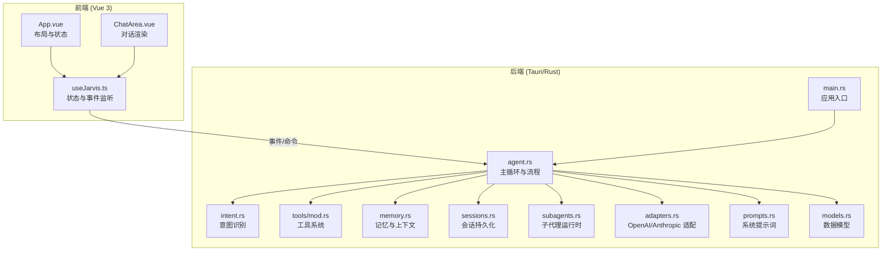
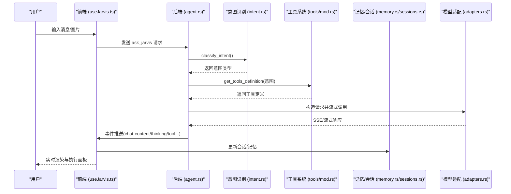
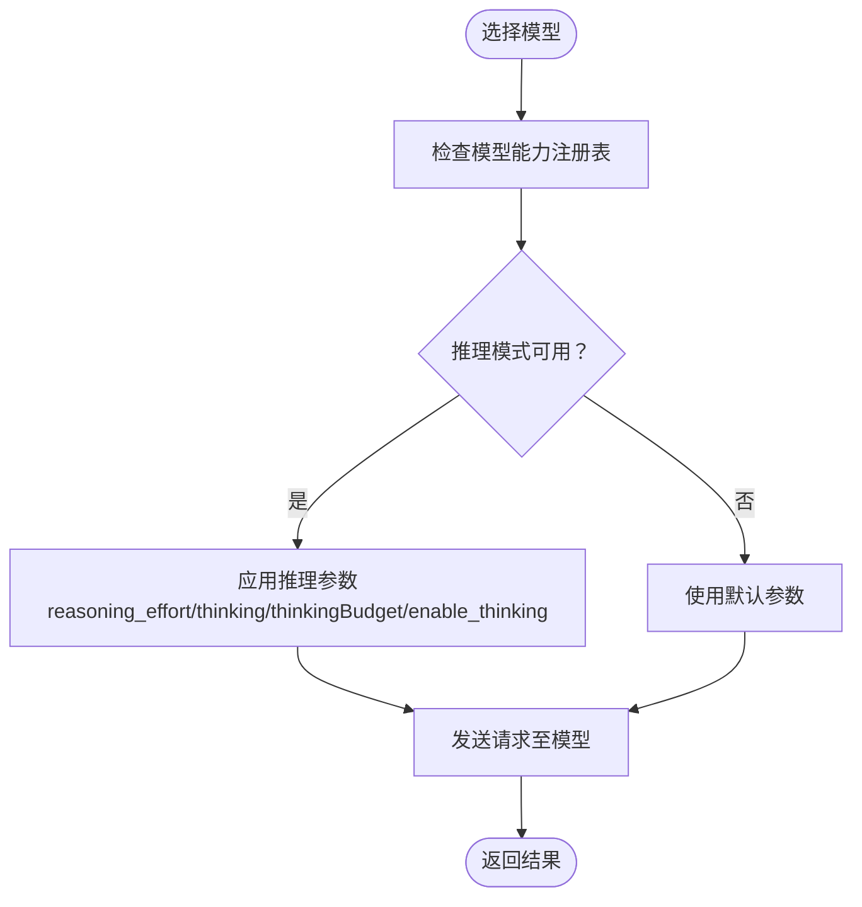
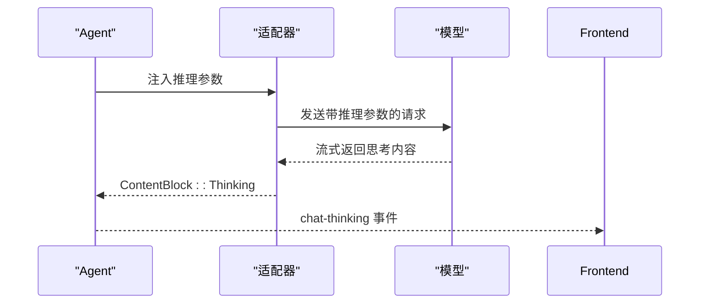
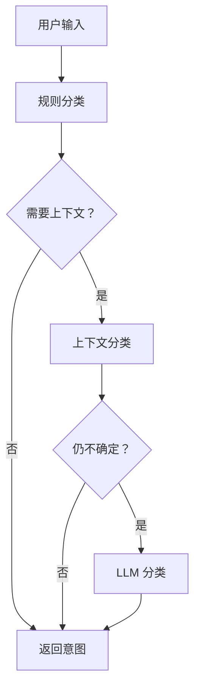
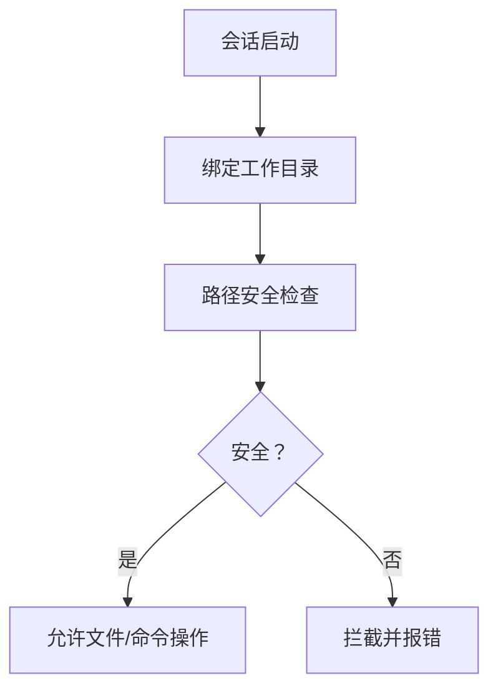
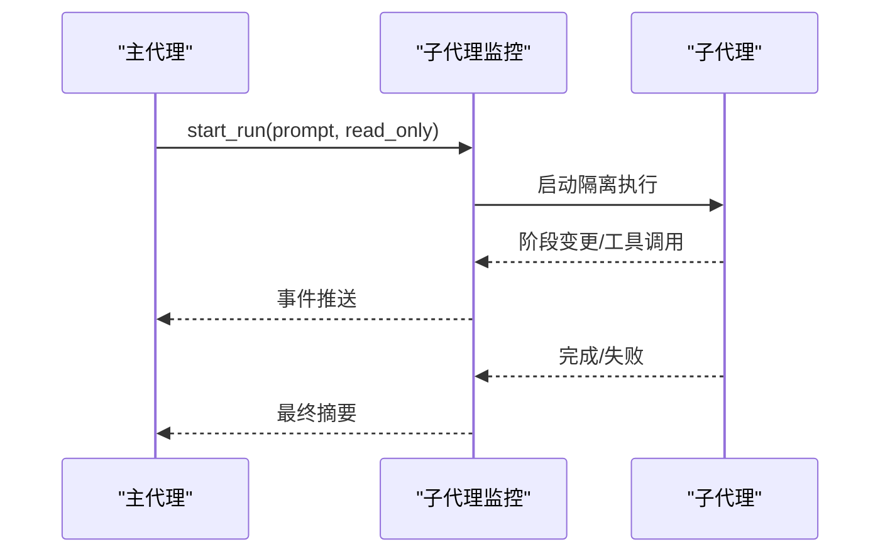
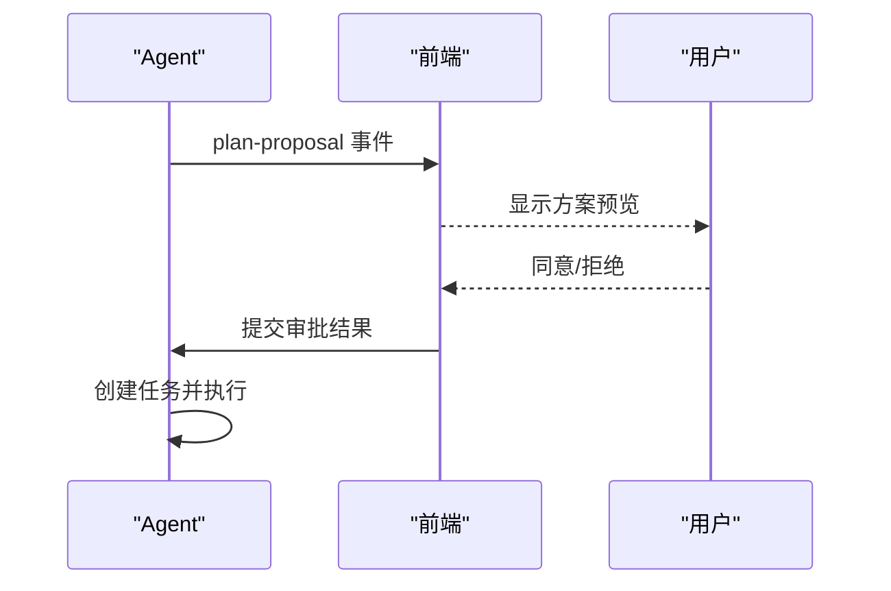
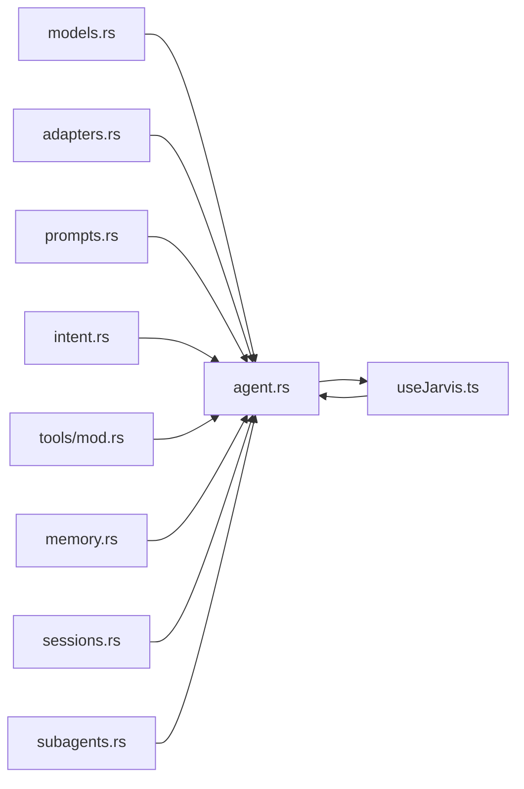

# 核心特性

<cite>
**本文引用的文件**
- [README.md](file://README.md)
- [src-tauri/src/main.rs](file://src-tauri/src/main.rs)
- [src-tauri/model_registry.json](file://src-tauri/model_registry.json)
- [src-tauri/src/core/models.rs](file://src-tauri/src/core/models.rs)
- [src-tauri/src/core/intent.rs](file://src-tauri/src/core/intent.rs)
- [src-tauri/src/core/sessions.rs](file://src-tauri/src/core/sessions.rs)
- [src-tauri/src/core/memory.rs](file://src-tauri/src/core/memory.rs)
- [src-tauri/src/core/tools/mod.rs](file://src-tauri/src/core/tools/mod.rs)
- [src-tauri/src/core/subagents.rs](file://src-tauri/src/core/subagents.rs)
- [src-tauri/src/core/adapters.rs](file://src-tauri/src/core/adapters.rs)
- [src-tauri/src/core/prompts.rs](file://src-tauri/src/core/prompts.rs)
- [src/App.vue](file://src/App.vue)
- [src/components/chat/ChatArea.vue](file://src/components/chat/ChatArea.vue)
- [src/composables/useJarvis.ts](file://src/composables/useJarvis.ts)
</cite>

## 目录
1. [简介](#简介)
2. [项目结构](#项目结构)
3. [核心组件](#核心组件)
4. [架构总览](#架构总览)
5. [详细特性分析](#详细特性分析)
6. [依赖关系分析](#依赖关系分析)
7. [性能考量](#性能考量)
8. [故障排查指南](#故障排查指南)
9. [结论](#结论)

## 简介
JarvisAgent 是一个基于 Tauri 2.0 + Vue 3 的桌面端 AI 编程助手，支持 20+ 主流 LLM 模型，具备深度思考模式、智能意图识别、沙箱工作目录、丰富的工具集、子代理委派、方案审批机制、会话持久化、记忆系统、现代 UI 界面等企业级 Agent 能力。本文聚焦于项目的核心特性，解释其工作原理、使用场景与价值，并提供可操作的使用示例与效果说明。

## 项目结构
项目采用前后端分离架构：前端使用 Vue 3 + TypeScript，后端使用 Rust + Tokio，通过 Tauri 桥接实现桌面端能力；核心业务逻辑集中在 src-tauri 下，前端通过事件与命令与后端交互。

**图表来源**
- [src-tauri/src/main.rs:1-7](file://src-tauri/src/main.rs#L1-L7)
- [src-tauri/src/core/agent.rs:1-1261](file://src-tauri/src/core/agent.rs#L1-L1261)
- [src-tauri/src/core/intent.rs:1-225](file://src-tauri/src/core/intent.rs#L1-L225)
- [src-tauri/src/core/tools/mod.rs:1-454](file://src-tauri/src/core/tools/mod.rs#L1-L454)
- [src-tauri/src/core/memory.rs:1-464](file://src-tauri/src/core/memory.rs#L1-L464)
- [src-tauri/src/core/sessions.rs:1-499](file://src-tauri/src/core/sessions.rs#L1-L499)
- [src-tauri/src/core/subagents.rs:1-666](file://src-tauri/src/core/subagents.rs#L1-L666)
- [src-tauri/src/core/adapters.rs:1-259](file://src-tauri/src/core/adapters.rs#L1-L259)
- [src-tauri/src/core/prompts.rs:1-82](file://src-tauri/src/core/prompts.rs#L1-L82)
- [src-tauri/src/core/models.rs:1-256](file://src-tauri/src/core/models.rs#L1-L256)
- [src/App.vue:1-276](file://src/App.vue#L1-L276)
- [src/components/chat/ChatArea.vue:1-1019](file://src/components/chat/ChatArea.vue#L1-L1019)
- [src/composables/useJarvis.ts:1-1354](file://src/composables/useJarvis.ts#L1-L1354)

**章节来源**
- [README.md:107-161](file://README.md#L107-L161)
- [src-tauri/src/main.rs:1-7](file://src-tauri/src/main.rs#L1-L7)

## 核心组件
- 模型与适配层：统一 OpenAI/Anthropic 格式，支持 20+ 模型的参数映射与推理模式控制。
- 意图识别：基于规则、上下文与 LLM 的三层分类，自动区分闲聊、项目操作、记忆查询、危险操作。
- 工具系统：文件读写、Shell 命令、Git、任务管理、子代理委派、方案审批等 20+ 工具。
- 子代理运行时：隔离上下文、独立对话历史、可取消、可观测的子任务执行引擎。
- 记忆与上下文：自动压缩、记忆整理、全局/项目记忆、会话转录与摘要。
- 会话持久化：多会话管理、标题智能命名、图片缓存、令牌用量统计。
- 前端 UI：IDE 风格界面、执行流程面板、权限弹窗、方案预览、主题切换。

**章节来源**
- [src-tauri/src/core/models.rs:1-256](file://src-tauri/src/core/models.rs#L1-L256)
- [src-tauri/src/core/adapters.rs:1-259](file://src-tauri/src/core/adapters.rs#L1-L259)
- [src-tauri/src/core/intent.rs:1-225](file://src-tauri/src/core/intent.rs#L1-L225)
- [src-tauri/src/core/tools/mod.rs:1-454](file://src-tauri/src/core/tools/mod.rs#L1-L454)
- [src-tauri/src/core/subagents.rs:1-666](file://src-tauri/src/core/subagents.rs#L1-L666)
- [src-tauri/src/core/memory.rs:1-464](file://src-tauri/src/core/memory.rs#L1-L464)
- [src-tauri/src/core/sessions.rs:1-499](file://src-tauri/src/core/sessions.rs#L1-L499)
- [src/App.vue:1-276](file://src/App.vue#L1-L276)
- [src/components/chat/ChatArea.vue:1-1019](file://src/components/chat/ChatArea.vue#L1-L1019)
- [src/composables/useJarvis.ts:1-1354](file://src/composables/useJarvis.ts#L1-L1354)

## 架构总览
JarvisAgent 的核心执行循环由“意图识别 → 加载工具集 → Agent 循环（思考→工具调用→观察）→ 流式输出”构成。前端负责渲染与交互，后端负责模型调用、工具执行、状态管理与持久化。

**图表来源**
- [src-tauri/src/core/agent.rs:560-800](file://src-tauri/src/core/agent.rs#L560-L800)
- [src-tauri/src/core/intent.rs:1-225](file://src-tauri/src/core/intent.rs#L1-L225)
- [src-tauri/src/core/tools/mod.rs:89-379](file://src-tauri/src/core/tools/mod.rs#L89-L379)
- [src-tauri/src/core/adapters.rs:84-259](file://src-tauri/src/core/adapters.rs#L84-L259)
- [src/composables/useJarvis.ts:619-800](file://src/composables/useJarvis.ts#L619-L800)

**章节来源**
- [README.md:162-201](file://README.md#L162-L201)

## 详细特性分析

### 多模型支持（20+ 主流 LLM 模型）
- 能力注册：通过模型能力注册表集中管理模型参数、推理模式、视觉支持等能力字段，便于扩展与统一配置。
- 适配层：统一 OpenAI/Anthropic 格式，自动处理推理参数（reasoning_effort、thinking、thinkingBudget、enable_thinking）与温度/采样参数。
- 使用场景：根据任务复杂度选择主模型与工具模型；在需要深度推理时启用相应参数；在多模态场景下启用视觉能力。
- 示例：在设置中选择主模型与工具模型，即可在不同意图下自动切换；新增模型只需在注册表中补充能力字段。

**图表来源**
- [src-tauri/model_registry.json:1-496](file://src-tauri/model_registry.json#L1-L496)
- [src-tauri/src/core/adapters.rs:225-259](file://src-tauri/src/core/adapters.rs#L225-L259)
- [src-tauri/src/core/models.rs:13-68](file://src-tauri/src/core/models.rs#L13-L68)

**章节来源**
- [README.md:85-106](file://README.md#L85-L106)
- [src-tauri/model_registry.json:1-496](file://src-tauri/model_registry.json#L1-L496)
- [src-tauri/src/core/adapters.rs:84-259](file://src-tauri/src/core/adapters.rs#L84-L259)

### 深度思考模式
- 工作原理：根据模型能力与用户配置，自动注入推理参数，使模型在回答中展示内部思考过程（ContentBlock::Thinking）。
- 使用场景：复杂问题求解、代码审查、架构设计等需要可解释性的任务。
- 示例：开启深度思考后，前端将实时展示“思考”阶段内容，便于用户理解 AI 的推理链。

**图表来源**
- [src-tauri/src/core/agent.rs:207-419](file://src-tauri/src/core/agent.rs#L207-L419)
- [src-tauri/src/core/adapters.rs:84-223](file://src-tauri/src/core/adapters.rs#L84-L223)
- [src-tauri/src/core/models.rs:160-178](file://src-tauri/src/core/models.rs#L160-L178)

**章节来源**
- [src-tauri/src/core/agent.rs:207-419](file://src-tauri/src/core/agent.rs#L207-L419)
- [src-tauri/src/core/adapters.rs:84-223](file://src-tauri/src/core/adapters.rs#L84-L223)

### 智能意图识别
- 分类流程：规则 → 上下文 → LLM 三阶段，优先使用规则与上下文，必要时借助工具模型进行分类。
- 意图类型：GENERAL_CHAT、PROJECT_ACTION、MEMORY_QUERY、DANGEROUS 等，分别决定是否加载工具与是否需要权限确认。
- 示例：用户输入“帮我读取 README”，意图识别为 PROJECT_ACTION，自动加载文件工具集；输入“今天天气如何”，识别为 CHAT，直接回复。

**图表来源**
- [src-tauri/src/core/intent.rs:1-225](file://src-tauri/src/core/intent.rs#L1-L225)

**章节来源**
- [src-tauri/src/core/intent.rs:1-225](file://src-tauri/src/core/intent.rs#L1-L225)
- [src-tauri/src/core/prompts.rs:76-82](file://src-tauri/src/core/prompts.rs#L76-L82)

### 沙箱工作目录
- 功能：为会话绑定工作目录，限制文件操作与命令执行范围，防止路径穿越与越权访问。
- 安全：对路径进行安全检查，拦截包含 “..” 的路径；Git 操作仅允许只读命令。
- 示例：在设置中为会话绑定工作目录，后续所有文件读写与 Shell 命令均受限于此目录。

**图表来源**
- [src-tauri/src/core/sessions.rs:74-77](file://src-tauri/src/core/sessions.rs#L74-L77)
- [src-tauri/src/core/tools/mod.rs:18-19](file://src-tauri/src/core/tools/mod.rs#L18-L19)

**章节来源**
- [README.md:235-243](file://README.md#L235-L243)
- [src-tauri/src/core/sessions.rs:74-77](file://src-tauri/src/core/sessions.rs#L74-L77)

### 丰富的工具集
- 工具分类：文件工具（读写、骨架提取、搜索）、Shell 工具（命令执行、后台任务）、系统工具（工作区、系统信息）、任务工具（增删改查、看板）、代理工具（子代理、压缩、记忆、方案）。
- 按需加载：根据意图动态返回工具定义，避免无关工具干扰。
- 示例：PROJECT_ACTION 意图下加载全部工具；MEMORY_QUERY 意图下仅加载记忆相关工具。

**章节来源**
- [README.md:208-234](file://README.md#L208-L234)
- [src-tauri/src/core/tools/mod.rs:89-379](file://src-tauri/src/core/tools/mod.rs#L89-L379)

### 子代理委派
- 设计：主代理负责编排，子代理在隔离上下文中执行具体任务，共享文件系统但不共享对话历史。
- 生命周期：启动/阶段变更/工具调用/结果记录/完成/取消，全程可观测与可回溯。
- 示例：使用 task 工具委派子代理执行“修改文件并验证”，子代理完成后返回摘要与 token 统计。

**图表来源**
- [src-tauri/src/core/subagents.rs:116-377](file://src-tauri/src/core/subagents.rs#L116-L377)
- [src-tauri/src/core/tools/mod.rs:382-408](file://src-tauri/src/core/tools/mod.rs#L382-L408)

**章节来源**
- [README.md:177-189](file://README.md#L177-L189)
- [src-tauri/src/core/subagents.rs:1-666](file://src-tauri/src/core/subagents.rs#L1-L666)
- [src-tauri/src/core/tools/mod.rs:305-315](file://src-tauri/src/core/tools/mod.rs#L305-L315)

### 方案审批机制
- 流程：AI 提交方案 → 前端弹出预览面板 → 用户审阅并决策 → 同意后创建任务执行。
- 价值：对复杂任务进行前置治理，降低误操作风险，提升协作透明度。
- 示例：使用 propose_plan 工具提交“重构模块”的方案，用户在前端确认后，系统创建任务并交由子代理执行。

**图表来源**
- [src/composables/useJarvis.ts:634-661](file://src/composables/useJarvis.ts#L634-L661)
- [src-tauri/src/core/tools/mod.rs:354-364](file://src-tauri/src/core/tools/mod.rs#L354-L364)

**章节来源**
- [README.md:191-201](file://README.md#L191-L201)
- [src/composables/useJarvis.ts:634-661](file://src/composables/useJarvis.ts#L634-L661)

### 会话持久化
- 功能：自动保存对话历史、图片缓存、令牌用量、标题智能命名、多会话管理与切换。
- 机制：过滤工具调用与工具结果，仅保留有意义的对话内容，大幅减少文件体积；支持最后活跃会话记录。
- 示例：新建会话后自动命名“新会话”，随着对话推进自动更新标题；关闭应用后重启可继续同一会话。

**章节来源**
- [README.md:26-28](file://README.md#L26-L28)
- [src-tauri/src/core/sessions.rs:162-499](file://src-tauri/src/core/sessions.rs#L162-L499)

### 记忆系统
- 全局与项目记忆：分别记录用户偏好与项目上下文，通过记忆 Agent 自动更新。
- 上下文压缩：超过阈值时自动触发 micro_compact 与 auto_compact，保留近期上下文并生成摘要。
- 示例：使用 dream 工具触发记忆整理，将碎片记忆提炼为结构化用户画像；使用 compact 手动压缩上下文。

**章节来源**
- [README.md:26-28](file://README.md#L26-L28)
- [src-tauri/src/core/memory.rs:1-464](file://src-tauri/src/core/memory.rs#L1-L464)

### 现代 UI 界面
- 设计：IDE 风格布局，无边框窗口，支持明暗主题切换；右侧执行流程面板可折叠。
- 交互：实时渲染“思考/工具/内容”三段式输出；支持会话与代码撤回、权限弹窗、方案预览。
- 示例：在 ChatArea 中查看“思考”阶段与工具调用状态；通过 AgentPanel 查看子代理运行详情。

**章节来源**
- [src/App.vue:1-276](file://src/App.vue#L1-L276)
- [src/components/chat/ChatArea.vue:1-1019](file://src/components/chat/ChatArea.vue#L1-L1019)
- [src/composables/useJarvis.ts:1-800](file://src/composables/useJarvis.ts#L1-L800)

## 依赖关系分析

**图表来源**
- [src-tauri/src/core/models.rs:1-256](file://src-tauri/src/core/models.rs#L1-L256)
- [src-tauri/src/core/agent.rs:1-1261](file://src-tauri/src/core/agent.rs#L1-L1261)
- [src-tauri/src/core/adapters.rs:1-259](file://src-tauri/src/core/adapters.rs#L1-L259)
- [src-tauri/src/core/prompts.rs:1-82](file://src-tauri/src/core/prompts.rs#L1-L82)
- [src-tauri/src/core/intent.rs:1-225](file://src-tauri/src/core/intent.rs#L1-L225)
- [src-tauri/src/core/tools/mod.rs:1-454](file://src-tauri/src/core/tools/mod.rs#L1-L454)
- [src-tauri/src/core/memory.rs:1-464](file://src-tauri/src/core/memory.rs#L1-L464)
- [src-tauri/src/core/sessions.rs:1-499](file://src-tauri/src/core/sessions.rs#L1-L499)
- [src-tauri/src/core/subagents.rs:1-666](file://src-tauri/src/core/subagents.rs#L1-L666)
- [src/composables/useJarvis.ts:1-1354](file://src/composables/useJarvis.ts#L1-L1354)

**章节来源**
- [src-tauri/src/core/agent.rs:1-1261](file://src-tauri/src/core/agent.rs#L1-L1261)
- [src/composables/useJarvis.ts:619-800](file://src/composables/useJarvis.ts#L619-L800)

## 性能考量
- 流式输出：SSE 流式传输，前端按块渲染，降低首帧延迟与内存占用。
- 上下文压缩：定期触发 auto_compact 与 micro_compact，避免上下文膨胀导致的性能下降。
- 工具调用：参数解析与工具执行异步化，支持取消令牌中断，避免阻塞。
- 图片处理：图片输入自动压缩与缓存，减少重复传输与磁盘 IO。

[本节为通用指导，不直接分析具体文件]

## 故障排查指南
- API 调用失败：检查 API Key、Base URL 与 API Format 是否正确；关注指数退避与重试机制。
- 意图识别异常：若出现 UNCLEAR，前端会提示澄清；可在设置中调整工具模型以提升分类准确率。
- 危险操作拦截：检测到 DANGEROUS 意图时会弹出权限确认；用户拒绝将终止执行。
- 子代理卡住：通过取消令牌中断；查看子代理事件面板定位问题。
- 会话历史异常：检查会话文件完整性与图片缓存；必要时使用撤回功能恢复。

**章节来源**
- [src-tauri/src/core/agent.rs:621-644](file://src-tauri/src/core/agent.rs#L621-L644)
- [src-tauri/src/core/subagents.rs:379-432](file://src-tauri/src/core/subagents.rs#L379-L432)
- [src-tauri/src/core/sessions.rs:444-462](file://src-tauri/src/core/sessions.rs#L444-L462)

## 结论
JarvisAgent 通过“意图识别 + 工具系统 + 子代理委派 + 记忆与会话持久化”的组合，实现了从闲聊到复杂工程任务的全场景覆盖。其多模型支持、深度思考模式、沙箱安全、方案审批与现代 UI 等特性，既保证了易用性，也满足了企业级 Agent 的安全性与可控性需求。建议在生产环境中结合模型能力注册表与工具模型配置，持续优化意图识别与工具调用效率。