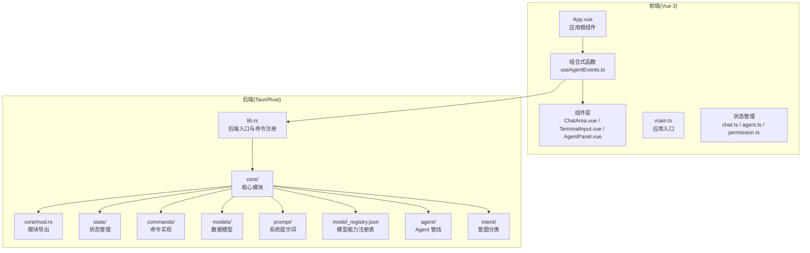
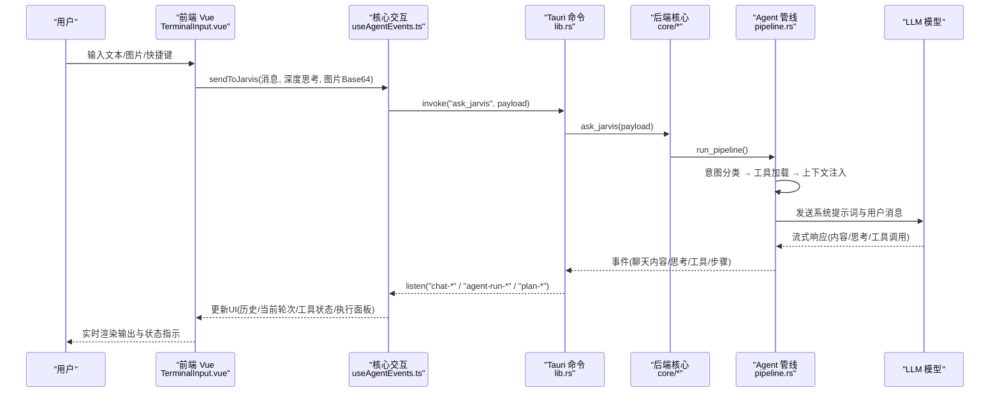
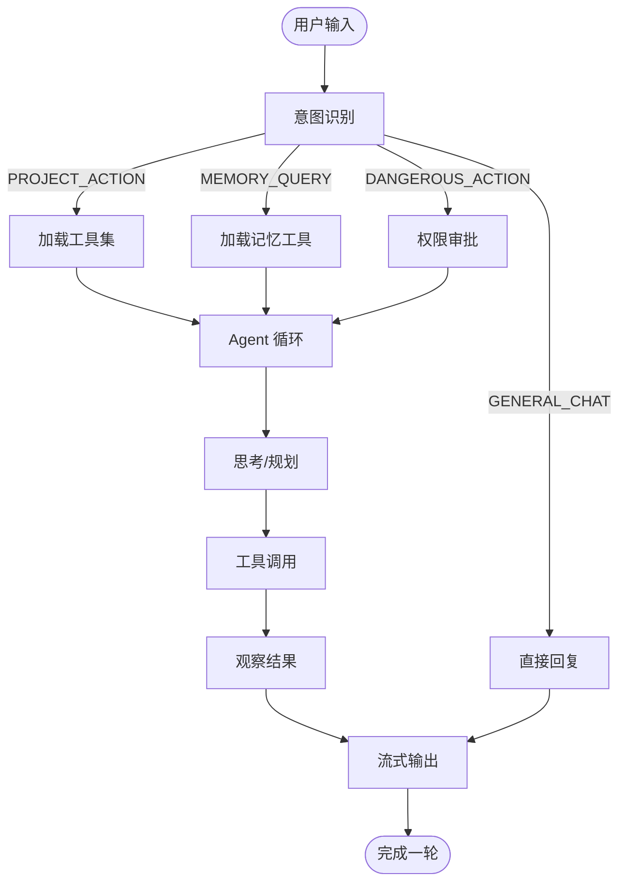
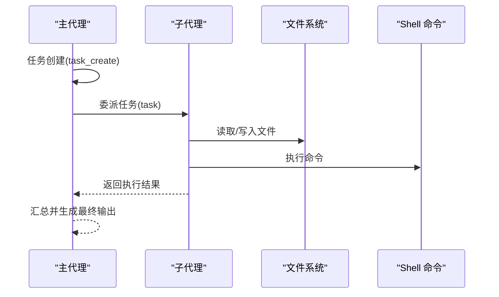
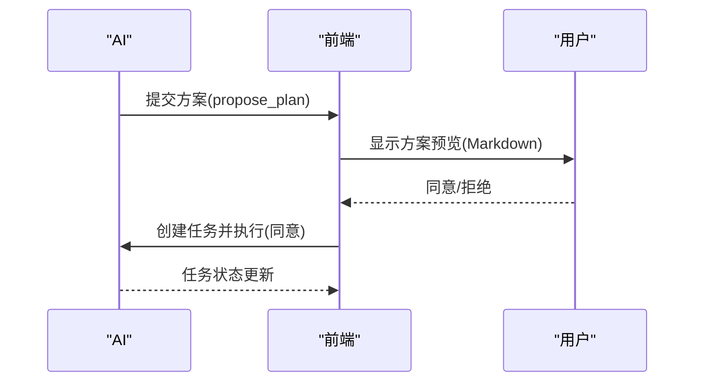
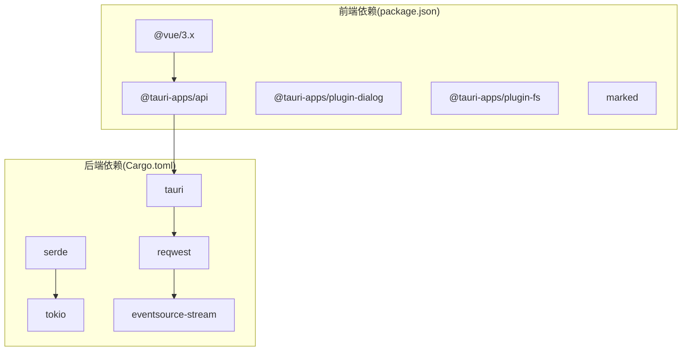

# 项目介绍

<cite>
**本文档引用的文件**
- [README.md](file://README.md)
- [package.json](file://package.json)
- [Cargo.toml](file://src-tauri/Cargo.toml)
- [App.vue](file://src/App.vue)
- [main.ts](file://src/main.ts)
- [useAgentEvents.ts](file://src/composables/useAgentEvents.ts)
- [ChatArea.vue](file://src/components/chat/ChatArea.vue)
- [TerminalInput.vue](file://src/components/chat/TerminalInput.vue)
- [lib.rs](file://src-tauri/src/lib.rs)
- [main.rs](file://src-tauri/src/main.rs)
- [mod.rs](file://src-tauri/src/core/mod.rs)
- [model_registry.json](file://src-tauri/model_registry.json)
- [index.ts](file://src/types/index.ts)
- [pipeline.rs](file://src-tauri/src/core/agent/pipeline.rs)
- [mod.rs](file://src-tauri/src/core/intent/mod.rs)
- [chat.ts](file://src/stores/chat.ts)
</cite>

## 更新摘要
**所做更改**
- 更新项目定位描述，从"强大的 AI 编程助手桌面应用"改为"AI 驱动的桌面端编程助手"
- 强调 AI 驱动的自主能力，突出完整的 Agent 自主循环
- 更新核心价值主张，重点体现 AI 的自主决策和执行能力
- 优化项目愿景表述，更好地反映 AI 驱动的编程助手特性

## 目录
1. [引言](#引言)
2. [项目结构](#项目结构)
3. [核心组件](#核心组件)
4. [架构总览](#架构总览)
5. [详细组件分析](#详细组件分析)
6. [依赖关系分析](#依赖关系分析)
7. [性能考量](#性能考量)
8. [故障排除指南](#故障排除指南)
9. [结论](#结论)

## 引言

JarvisAgent 是一个基于 Tauri 2.0 + Vue 3 + Rust 构建的 AI 驱动的桌面端编程助手，旨在为开发者提供智能化、自主化的 AI 协作体验。项目采用完整的 Agent 自主循环架构，支持 20+ 主流大语言模型，具备深度思考模式、智能意图识别、子代理委派、方案审批、会话持久化、记忆系统、沙箱工作目录、丰富的工具集等企业级能力。

### 为什么需要这样一个 AI 驱动的桌面端编程助手？

- **提升开发效率**：通过自然语言与 AI 协作，AI 能够自主完成代码编写、重构、调试、文档生成等复杂任务，无需人工持续干预。
- **降低学习成本**：统一的桌面应用界面，减少在多个平台间切换的成本，AI 以更直观的方式展示其思考过程和执行步骤。
- **改善开发体验**：提供 IDE 风格的交互体验，支持多模态输入（文本、图片）、实时流式输出、执行状态可视化，AI 能够自主决策和执行。
- **保障开发安全**：通过沙箱工作目录、权限审批、危险操作拦截等机制，确保 AI 在可控范围内自主工作，降低误操作风险。

### 主要目标用户群体

- **个人开发者**：希望借助 AI 的自主能力提升编码速度与质量，减少重复劳动，专注于创造性工作。
- **技术团队**：需要在团队内部推广 AI 自主协作规范，统一开发流程与质量标准，提高整体研发效率。
- **技术管理者**：关注开发效率与安全性，希望通过 AI 的自主决策能力提升整体研发效能和质量控制。

### 解决的实际痛点

- **多模型适配困难**：通过统一的模型注册表与适配层，简化多模型接入与切换，AI 能够根据任务需求自主选择合适的模型。
- **执行过程不可见**：通过 Agent 步骤可视化、工具状态展示、思考过程摘要，让用户随时掌握 AI 的自主决策过程和执行进度。
- **误操作风险高**：通过权限审批、危险操作拦截、会话与代码双轨撤回机制，降低 AI 自主执行带来的潜在风险。
- **上下文混乱**：通过会话持久化、记忆系统、自动上下文压缩，保持 AI 思考和任务执行的连贯性。

### 项目在 AI 辅助编程领域的定位与价值主张

- **定位**：面向开发者的 AI 驱动的桌面端编程助手，强调"智能、自主、安全、可控"。
- **价值主张**：
  - **智能**：完整的 Agent 自主循环，AI 能够自主决策、规划和执行复杂任务。
  - **安全**：沙箱限制、权限审批、循环检测、Git 安全策略，保障 AI 自主执行的安全性。
  - **可控**：方案审批、执行撤销、上下文压缩、记忆归档，让 AI 在可控范围内自主工作。
  - **易用**：IDE 风格界面、多模态输入、实时反馈、主题切换，提供舒适的 AI 协作体验。

## 项目结构

JarvisAgent 采用前后端分离的桌面应用架构，前端基于 Vue 3 + TypeScript，后端基于 Rust + Tauri，通过事件与命令机制进行通信。AI 的自主能力通过完整的 Agent 循环实现，从前端交互到后端执行形成闭环。

**图表来源**
- [App.vue:1-82](file://src/App.vue#L1-L82)
- [main.ts:1-6](file://src/main.ts#L1-L6)
- [useAgentEvents.ts:620-800](file://src/composables/useAgentEvents.ts#L620-L800)
- [lib.rs:102-182](file://src-tauri/src/lib.rs#L102-L182)
- [mod.rs:1-60](file://src-tauri/src/core/mod.rs#L1-L60)
- [pipeline.rs:185-293](file://src-tauri/src/core/agent/pipeline.rs#L185-L293)
- [mod.rs:1-60](file://src-tauri/src/core/intent/mod.rs#L1-L241)

**章节来源**
- [README.md:107-161](file://README.md#L107-L161)
- [package.json:1-28](file://package.json#L1-L28)
- [Cargo.toml:1-41](file://src-tauri/Cargo.toml#L1-L41)

## 核心组件

- **前端应用入口与布局**
  - App.vue：应用根组件，负责标题栏、侧边栏、聊天区域、输入区域、Agent 步骤面板、设置面板等的整体布局与状态展示。
  - main.ts：Vue 应用入口，挂载根组件并引入全局样式。

- **核心交互逻辑**
  - useAgentEvents.ts：封装了与后端的通信、事件监听、会话状态管理、渲染逻辑、工具状态展示、权限请求与方案审批等核心逻辑，支撑 AI 的自主决策和执行。

- **聊天与输入组件**
  - ChatArea.vue：负责渲染历史消息、当前轮次输出、思考计时、工作目录指示、右键菜单与撤回操作等。
  - TerminalInput.vue：负责用户输入、多模态文件拖拽、模型能力检测、深度思考模式切换、发送与取消操作等。

- **后端入口与命令注册**
  - lib.rs：Tauri 后端入口，初始化环境、恢复会话、注册状态管理器与命令处理器。
  - main.rs：Rust 程序入口，调用 lib.rs 的 run 函数启动应用。

- **核心模块与数据模型**
  - core/mod.rs：导出状态管理、Agent 循环、工具、会话、快照、沙盒、合并等模块。
  - types/index.ts：定义了会话视图、消息、Agent 步骤、运行状态、子代理运行、文件操作、快照与分支等数据类型。

**章节来源**
- [App.vue:1-82](file://src/App.vue#L1-L82)
- [main.ts:1-6](file://src/main.ts#L1-L6)
- [useAgentEvents.ts:1-1354](file://src/composables/useAgentEvents.ts#L1-L1354)
- [ChatArea.vue:1-1019](file://src/components/chat/ChatArea.vue#L1-L1019)
- [TerminalInput.vue:1-886](file://src/components/chat/TerminalInput.vue#L1-L886)
- [lib.rs:57-186](file://src-tauri/src/lib.rs#L57-L186)
- [main.rs:1-7](file://src-tauri/src/main.rs#L1-L7)
- [mod.rs:1-60](file://src-tauri/src/core/mod.rs#L1-L60)
- [index.ts:1-365](file://src/types/index.ts#L1-L365)

## 架构总览

JarvisAgent 采用"前端 Vue + 后端 Rust + Tauri 命令/事件通信"的架构。前端通过 @tauri-apps/api 与后端进行双向通信，后端通过 generate_handler 注册命令，前端通过 invoke 调用，通过 listen 监听事件。AI 的自主能力通过完整的 Agent 循环实现，从前端交互到后端执行形成闭环。

**图表来源**
- [useAgentEvents.ts:620-800](file://src/composables/useAgentEvents.ts#L620-L800)
- [lib.rs:102-182](file://src-tauri/src/lib.rs#L102-L182)
- [mod.rs:31-42](file://src-tauri/src/core/mod.rs#L31-L42)
- [pipeline.rs:391-623](file://src-tauri/src/core/agent/pipeline.rs#L391-L623)

**章节来源**
- [README.md:162-201](file://README.md#L162-L201)
- [lib.rs:88-182](file://src-tauri/src/lib.rs#L88-L182)

## 详细组件分析

### Agent 循环与 AI 自主能力

- **Agent 循环**：用户输入 → 意图分类 → 加载工具集 → Agent 循环（思考 → 工具调用 → 观察）→ 流式输出。AI 能够自主决策和执行，无需人工持续干预。
- **意图类型**：
  - GENERAL_CHAT：无工具，直接回复
  - PROJECT_ACTION：完整工具集 + 子代理
  - MEMORY_QUERY：记忆检索工具
  - DANGEROUS_ACTION：需要用户确认

**图表来源**
- [README.md:164-175](file://README.md#L164-L175)
- [pipeline.rs:185-293](file://src-tauri/src/core/agent/pipeline.rs#L185-L293)
- [mod.rs:1-241](file://src-tauri/src/core/intent/mod.rs#L1-L241)

**章节来源**
- [README.md:164-201](file://README.md#L164-L201)
- [pipeline.rs:185-293](file://src-tauri/src/core/agent/pipeline.rs#L185-L293)
- [mod.rs:1-241](file://src-tauri/src/core/intent/mod.rs#L1-L241)

### 子代理委派机制

- 主代理负责任务规划与编排，将具体任务委派给子代理执行。
- 子代理在独立上下文中运行，拥有完整的文件与 Shell 工具，但不共享主对话历史，支持只读模式。

**图表来源**
- [README.md:177-189](file://README.md#L177-L189)

**章节来源**
- [README.md:177-189](file://README.md#L177-L189)

### 方案审批流程

- 复杂任务需要 AI 提交方案，前端弹出预览面板，用户审阅并决定是否执行。
- 审批通过后创建任务并执行，未通过则终止。

**图表来源**
- [README.md:191-201](file://README.md#L191-L201)

**章节来源**
- [README.md:191-201](file://README.md#L191-L201)

### 上下文管理与记忆系统

- **自动压缩**：对话超过阈值时自动触发 micro_compact，保留近期上下文。
- **手动压缩**：通过 compact 工具主动清理。
- **记忆归档**：通过 dream 工具将碎片记忆提炼为结构化用户画像。

**章节来源**
- [README.md:202-207](file://README.md#L202-L207)

### 内置工具一览

- 文件：读取、写入、骨架提取、搜索、目录浏览
- Shell：命令执行、后台任务、Git 操作
- 系统：系统信息、工作区设置
- 任务：任务创建、更新、列表、获取、总结
- 代理：子代理委派、技能加载、上下文压缩、记忆整理、方案提交

**章节来源**
- [README.md:208-234](file://README.md#L208-L234)

### 安全特性

- **沙箱限制**：会话绑定工作目录，路径遍历攻击自动拦截。
- **权限审批**：敏感操作（如 Shell 命令）需用户确认。
- **循环检测**：Agent 循环超过 30 轮暂停等待确认，绝对上限 500 轮。
- **危险操作拦截**：自动识别并拦截潜在危险指令。
- **Git 安全**：仅允许只读 Git 操作，禁止修改历史或推送。
- **路径安全**：自动检测并拒绝包含 .. 的路径遍历。

**章节来源**
- [README.md:235-243](file://README.md#L235-L243)

### 模型能力与注册表

- model_registry.json 定义了各模型的能力（流式、思考模式、视觉等），支持动态扩展。
- 前端通过 invoke("get_model_capabilities") 查询当前模型能力，动态禁用或启用相关功能。

**章节来源**
- [model_registry.json:1-496](file://src-tauri/model_registry.json#L1-L496)
- [TerminalInput.vue:72-91](file://src/components/chat/TerminalInput.vue#L72-L91)

### 数据存储与会话管理

- 应用数据存储在运行目录下，包含配置、会话、任务、日志、方案、快照、技能、记忆等。
- 会话持久化支持多会话管理与切换，支持会话历史恢复与 Agent 步骤保存。

**章节来源**
- [README.md:257-274](file://README.md#L257-L274)

## 依赖关系分析

**图表来源**
- [package.json:12-26](file://package.json#L12-L26)
- [Cargo.toml:20-39](file://src-tauri/Cargo.toml#L20-L39)

**章节来源**
- [package.json:12-26](file://package.json#L12-L26)
- [Cargo.toml:20-39](file://src-tauri/Cargo.toml#L20-L39)

## 性能考量

- **前端渲染优化**：通过虚拟滚动、增量渲染、防抖与节流，减少不必要的 DOM 更新。
- **后端异步处理**：Rust + Tokio 异步运行时，SSE 流式处理，降低延迟与内存占用。
- **模型选择策略**：提供"主模型"和"工具模型"的配置，针对不同场景选择合适模型以平衡性能与成本。
- **上下文压缩**：自动与手动压缩机制，避免上下文膨胀导致性能下降。
- **缓存与本地存储**：图片压缩配置、主题偏好、会话状态等本地持久化，减少重复计算与网络请求。

## 故障排除指南

- **模型能力不匹配**：当前模型不支持深度思考或多模态时，界面会自动禁用相关按钮并提示。可通过切换模型或调整配置解决。
- **权限审批未响应**：检查是否有权限请求弹窗未处理，或后端命令未正确注册。
- **会话历史异常**：尝试重启应用或删除异常会话，查看日志目录排查问题。
- **文件操作失败**：确认工作目录是否在沙箱范围内，是否存在路径遍历或危险操作被拦截。
- **任务执行中断**：利用"撤回会话与代码"功能恢复到最近检查点，重新执行任务。

**章节来源**
- [TerminalInput.vue:132-135](file://src/components/chat/TerminalInput.vue#L132-L135)
- [ChatArea.vue:195-256](file://src/components/chat/ChatArea.vue#L195-L256)
- [lib.rs:102-182](file://src-tauri/src/lib.rs#L102-L182)

## 结论

JarvisAgent 通过"多模型支持 + 深度思考 + 子代理委派 + 方案审批 + 沙箱安全 + 记忆系统"的综合能力，为开发者提供了一个 AI 驱动的桌面端编程助手。它不仅能够显著提升开发效率，还能通过完善的权限控制与执行可视化，帮助团队建立规范化的 AI 协作流程。无论是个人开发者还是技术团队，都能在 JarvisAgent 的帮助下，更专注于创造性工作，释放 AI 的巨大潜力。

项目的核心优势在于其 AI 驱动的自主能力，完整的 Agent 自主循环使 AI 能够独立思考、规划和执行复杂任务，同时保持安全可控的执行环境。这种设计不仅提高了开发效率，还降低了学习成本，改善了开发体验，是现代软件开发环境中不可或缺的智能助手。