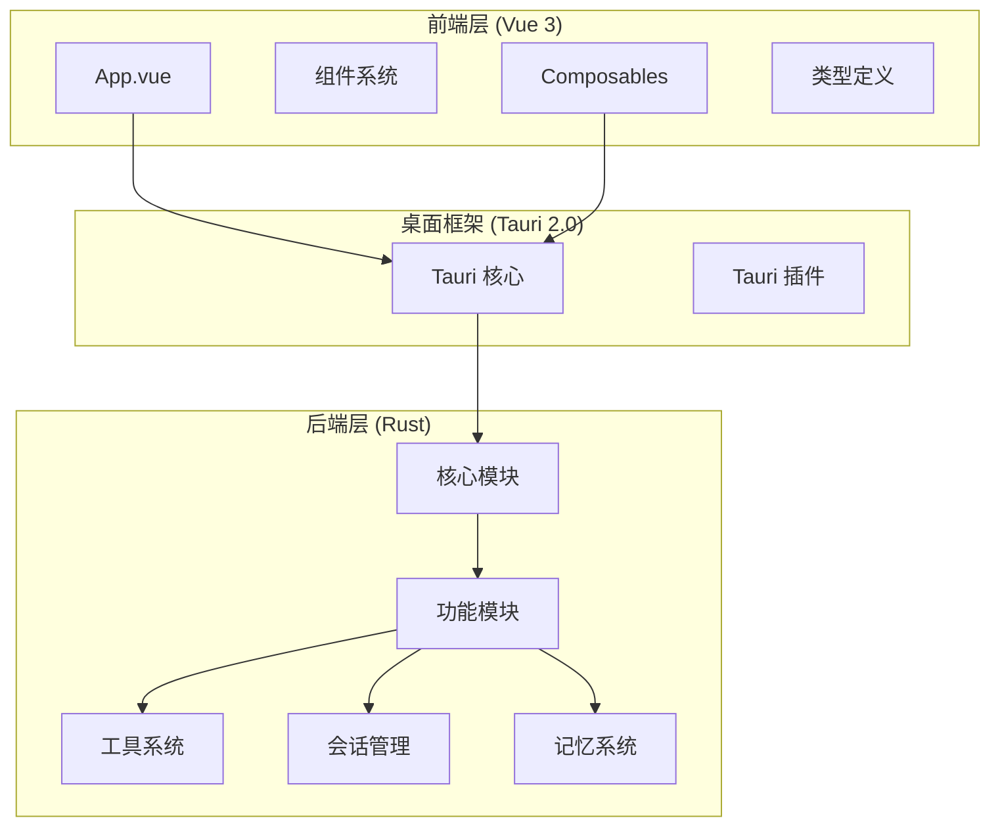
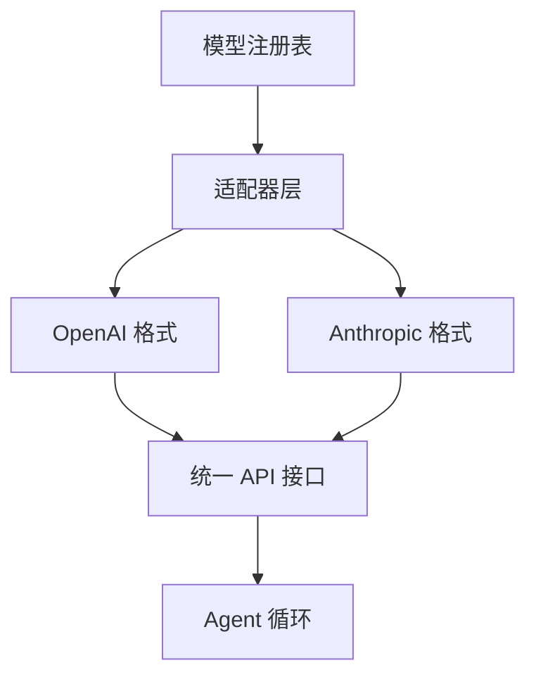
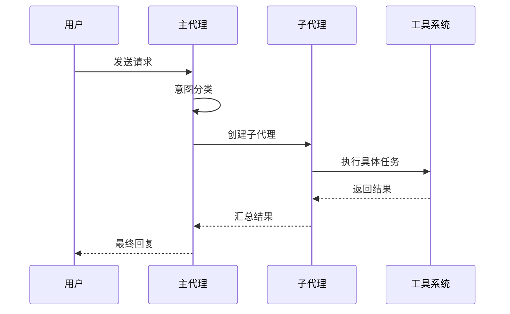
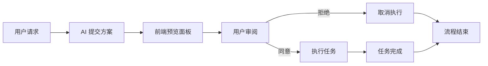
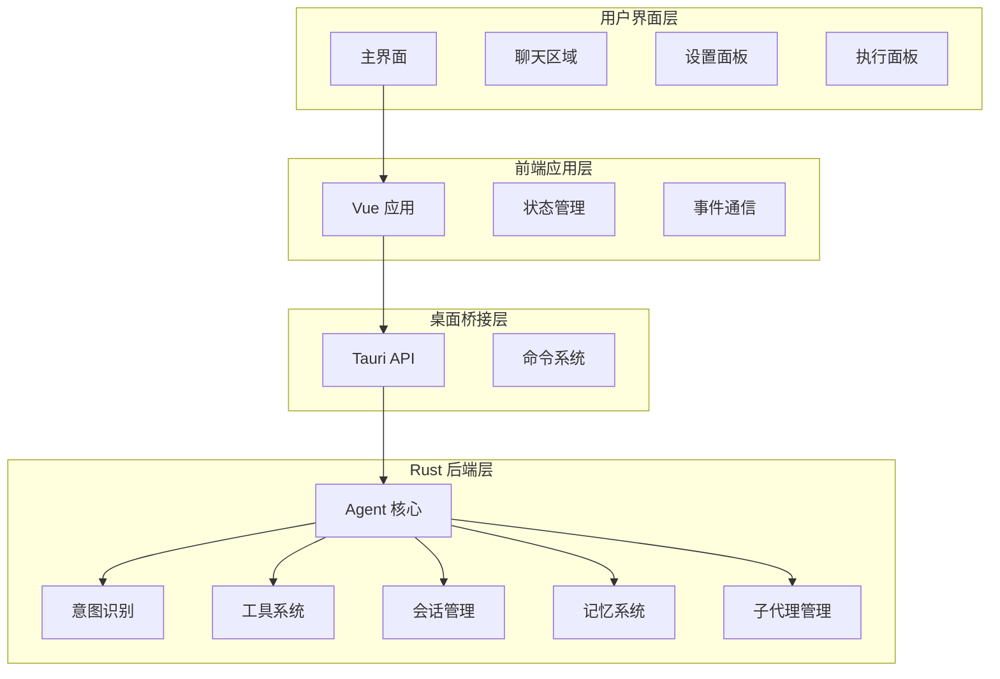
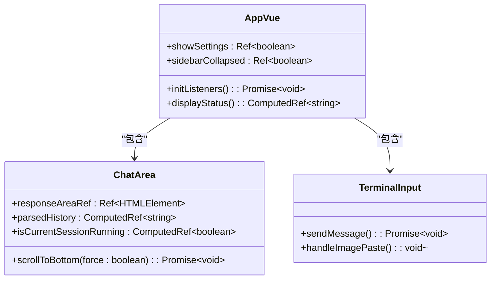
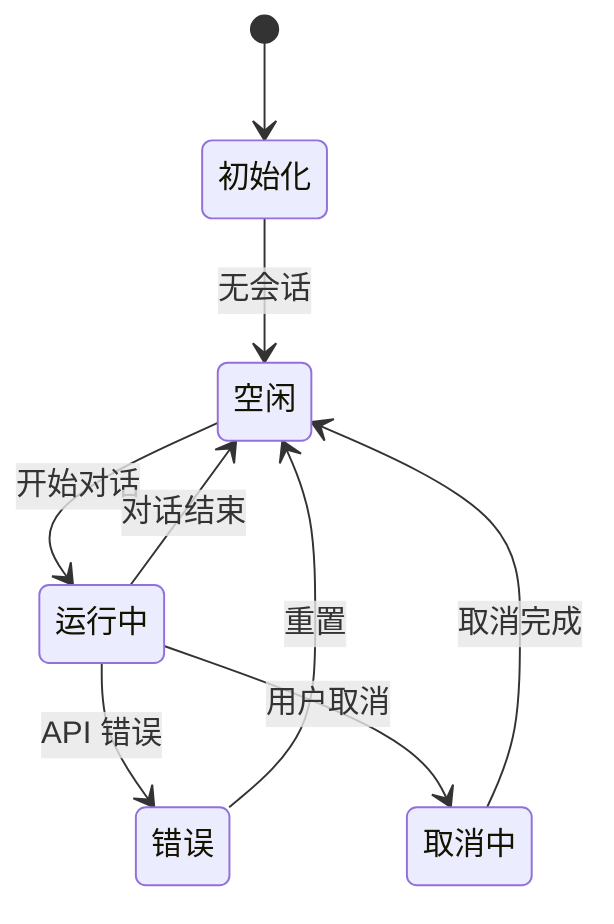
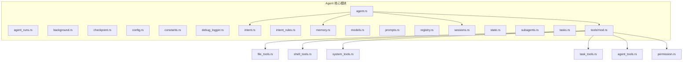
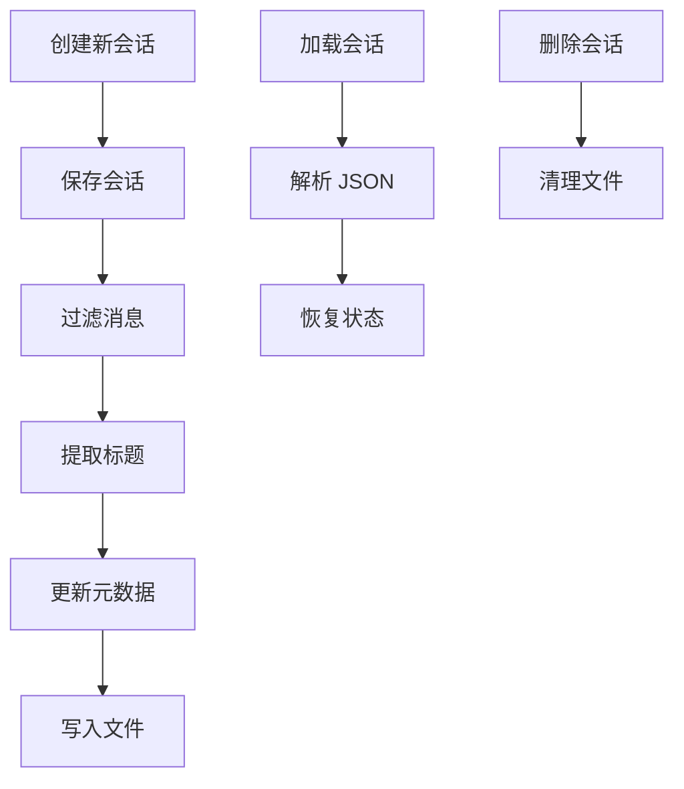
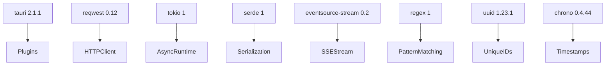

# 项目概述

<cite>
**本文档引用的文件**
- [README.md](file://README.md)
- [package.json](file://package.json)
- [Cargo.toml](file://src-tauri/Cargo.toml)
- [tauri.conf.json](file://src-tauri/tauri.conf.json)
- [App.vue](file://src/App.vue)
- [main.ts](file://src/main.ts)
- [useJarvis.ts](file://src/composables/useJarvis.ts)
- [model_registry.json](file://src-tauri/model_registry.json)
- [index.ts](file://src/types/index.ts)
- [core/mod.rs](file://src-tauri/src/core/mod.rs)
- [intent.rs](file://src-tauri/src/core/intent.rs)
- [tools/mod.rs](file://src-tauri/src/core/tools/mod.rs)
- [subagents.rs](file://src-tauri/src/core/subagents.rs)
- [sessions.rs](file://src-tauri/src/core/sessions.rs)
- [memory.rs](file://src-tauri/src/core/memory.rs)
- [adapters.rs](file://src-tauri/src/core/adapters.rs)
- [ChatArea.vue](file://src/components/chat/ChatArea.vue)
</cite>

## 目录
1. [项目简介](#项目简介)
2. [项目结构](#项目结构)
3. [核心特性](#核心特性)
4. [架构总览](#架构总览)
5. [详细组件分析](#详细组件分析)
6. [依赖关系分析](#依赖关系分析)
7. [性能考虑](#性能考虑)
8. [故障排除指南](#故障排除指南)
9. [结论](#结论)

## 项目简介

JarvisAgent 是一个基于 Tauri 2.0 + Vue 3 构建的企业级 AI 编程助手桌面应用，支持 20+ 主流 LLM 模型，具备多模型适配、深度思考模式、智能意图识别、沙箱工作目录、丰富的工具集、子代理委派、方案审批机制等关键能力。

### 主要特性

- **多模型支持** - 支持 DeepSeek、Claude、GPT、Gemini、Qwen、豆包、MIMO 等 20+ 主流 LLM 模型
- **深度思考模式** - 支持 Extended Thinking / Reasoning 模式，让 AI 展示推理过程
- **智能意图识别** - 自动区分闲聊、项目操作、记忆查询等不同意图，按需加载工具
- **沙箱工作目录** - 支持会话级别的目录限制，确保操作安全
- **丰富的工具集** - 文件读写、Shell 命令、Git 操作、代码搜索、任务管理等 20+ 内置工具
- **子代理委派** - 主代理编排任务，子代理在干净上下文中执行，避免污染主对话
- **方案审批机制** - 复杂任务需提交方案，用户预览确认后执行
- **会话持久化** - 自动保存对话历史，支持多会话管理与切换
- **记忆系统** - 全局记忆与项目记忆，长期记住用户偏好与项目上下文

### 技术栈概览

- **前端** - Vue 3 + TypeScript，响应式 UI，Composition API
- **桌面框架** - Tauri 2.0，Rust 后端，轻量高性能
- **后端** - Rust + Tokio，异步运行时，SSE 流式处理
- **HTTP** - Reqwest，流式 API 调用，支持 OpenAI / Anthropic 格式
- **构建** - Vite，极速 HMR 开发体验

## 项目结构



**图表来源**
- [App.vue:1-276](file://src/App.vue#L1-L276)
- [main.ts:1-6](file://src/main.ts#L1-L6)
- [core/mod.rs:1-60](file://src-tauri/src/core/mod.rs#L1-L60)

**章节来源**
- [README.md:107-161](file://README.md#L107-L161)
- [package.json:1-28](file://package.json#L1-L28)
- [Cargo.toml:1-41](file://src-tauri/Cargo.toml#L1-L41)

## 核心特性

### 多模型支持与适配

项目通过统一的模型注册表和适配器实现对多家 LLM 提供商的支持：



**图表来源**
- [model_registry.json:1-496](file://src-tauri/model_registry.json#L1-L496)
- [adapters.rs:84-223](file://src-tauri/src/core/adapters.rs#L84-L223)

### 智能意图识别

系统采用三层意图识别机制：

1. **规则基础分类** - 基于预定义规则快速判断
2. **上下文感知分类** - 结合对话上下文进行判断
3. **LLM 辅助分类** - 当前两种方法无法确定时使用 LLM

**章节来源**
- [intent.rs:4-63](file://src-tauri/src/core/intent.rs#L4-L63)
- [README.md:17-32](file://README.md#L17-L32)

### 子代理委派机制

主代理负责编排，子代理负责执行，形成清晰的职责分离：



**图表来源**
- [subagents.rs:116-177](file://src-tauri/src/core/subagents.rs#L116-L177)
- [tools/mod.rs:382-408](file://src-tauri/src/core/tools/mod.rs#L382-L408)

**章节来源**
- [README.md:177-189](file://README.md#L177-L189)
- [subagents.rs:1-666](file://src-tauri/src/core/subagents.rs#L1-L666)

### 方案审批流程

复杂任务执行前的双重保障机制：



**图表来源**
- [README.md:191-201](file://README.md#L191-L201)

**章节来源**
- [README.md:191-201](file://README.md#L191-L201)
- [tools/mod.rs:354-364](file://src-tauri/src/core/tools/mod.rs#L354-L364)

## 架构总览

JarvisAgent 采用前后端分离的桌面应用架构，结合了现代 Web 技术与 Rust 后端的优势：



**图表来源**
- [App.vue:1-276](file://src/App.vue#L1-L276)
- [useJarvis.ts:620-800](file://src/composables/useJarvis.ts#L620-L800)
- [core/mod.rs:25-60](file://src-tauri/src/core/mod.rs#L25-L60)

**章节来源**
- [README.md:162-201](file://README.md#L162-L201)
- [tauri.conf.json:1-40](file://src-tauri/tauri.conf.json#L1-L40)

## 详细组件分析

### 前端核心组件

#### 主应用组件 (App.vue)

主应用组件负责整体布局和状态管理：



**图表来源**
- [App.vue:1-276](file://src/App.vue#L1-L276)
- [ChatArea.vue:1-800](file://src/components/chat/ChatArea.vue#L1-L800)

**章节来源**
- [App.vue:1-276](file://src/App.vue#L1-L276)
- [main.ts:1-6](file://src/main.ts#L1-L6)

#### 状态管理 (useJarvis.ts)

前端状态管理是整个应用的核心枢纽：



**图表来源**
- [useJarvis.ts:390-401](file://src/composables/useJarvis.ts#L390-L401)

**章节来源**
- [useJarvis.ts:1-800](file://src/composables/useJarvis.ts#L1-L800)

### 后端核心模块

#### Agent 核心模块

后端采用模块化设计，每个功能模块都有明确的职责边界：



**图表来源**
- [core/mod.rs:1-24](file://src-tauri/src/core/mod.rs#L1-L24)

**章节来源**
- [core/mod.rs:1-60](file://src-tauri/src/core/mod.rs#L1-L60)

#### 会话管理系统

会话持久化采用 JSON 文件存储，支持多会话管理和智能标题生成：



**图表来源**
- [sessions.rs:191-216](file://src-tauri/src/core/sessions.rs#L191-L216)
- [sessions.rs:366-377](file://src-tauri/src/core/sessions.rs#L366-L377)

**章节来源**
- [sessions.rs:1-499](file://src-tauri/src/core/sessions.rs#L1-L499)

#### 工具系统

工具系统提供 20+ 内置工具，按意图动态加载：

**章节来源**
- [tools/mod.rs:89-379](file://src-tauri/src/core/tools/mod.rs#L89-L379)
- [README.md:208-234](file://README.md#L208-L234)

### 数据模型

系统使用 TypeScript 定义了完整的数据模型体系：

**章节来源**
- [index.ts:1-365](file://src/types/index.ts#L1-L365)

## 依赖关系分析

### 前端依赖

```mermaid
graph TB
Vue[Vue 3.5.13] --> TauriAPI[@tauri-apps/api]
Vue --> Marked[marked 18.0.2]
TauriAPI --> Dialog[@tauri-apps/plugin-dialog]
TauriAPI --> FS[@tauri-apps/plugin-fs]
TauriAPI --> Opener[@tauri-apps/plugin-opener]
Vite[Vite 6.0.3] --> DevDependencies
TypeScript[TypeScript 5.6.2] --> DevDependencies
```

**图表来源**
- [package.json:12-26](file://package.json#L12-L26)

**章节来源**
- [package.json:1-28](file://package.json#L1-L28)

### 后端依赖



**图表来源**
- [Cargo.toml:20-39](file://src-tauri/Cargo.toml#L20-L39)

**章节来源**
- [Cargo.toml:1-41](file://src-tauri/Cargo.toml#L1-L41)

## 性能考虑

### 异步处理与并发

系统采用 Rust + Tokio 实现高效的异步处理：

- **流式响应** - 使用 SSE 流式传输，实时显示 AI 回复
- **并发执行** - 子代理并行处理多个任务
- **内存管理** - 自动上下文压缩，防止内存泄漏

### 前端性能优化

- **虚拟滚动** - 大量历史消息的高效渲染
- **懒加载** - 组件按需加载，减少初始包大小
- **状态缓存** - 本地状态缓存，提升用户体验

## 故障排除指南

### 常见问题诊断

#### API 连接问题

1. **检查 API 密钥配置**
   - 确认 API Key 格式正确
   - 验证 Base URL 地址可用性

2. **网络连接测试**
   - 使用浏览器访问 API 端点
   - 检查防火墙设置

#### 性能问题

1. **内存使用过高**
   - 检查会话历史长度
   - 触发手动上下文压缩

2. **响应缓慢**
   - 检查网络延迟
   - 考虑使用更便宜的工具模型

**章节来源**
- [README.md:355-373](file://README.md#L355-L373)

### 安全特性

系统实现了多层次的安全防护：

- **沙箱限制** - 会话可绑定工作目录，路径遍历攻击自动拦截
- **权限审批** - 敏感操作需用户确认
- **循环检测** - Agent 循环超过 30 轮暂停等待确认
- **危险操作拦截** - 自动识别并拦截潜在危险指令

**章节来源**
- [README.md:235-243](file://README.md#L235-L243)

## 结论

JarvisAgent 项目展现了现代桌面 AI 应用的最佳实践，通过精心设计的架构和丰富的功能特性，为用户提供了强大而安全的 AI 编程助手体验。项目的主要优势包括：

1. **技术架构先进** - 前后端分离，模块化设计，易于维护和扩展
2. **功能丰富完整** - 从多模型支持到子代理委派，覆盖了企业级应用的各个方面
3. **安全性强** - 多层次安全防护，确保用户数据和系统安全
4. **用户体验优秀** - 流畅的交互体验，实时响应机制

对于初学者，建议从理解项目的基本架构开始，逐步学习各个模块的功能；对于有经验的开发者，可以重点关注 Rust 后端的实现细节和性能优化策略。项目提供了完善的开发文档和示例，便于快速上手和贡献代码。