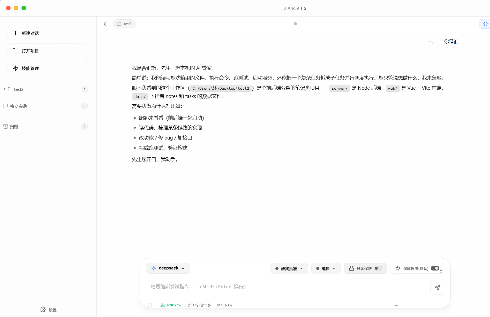
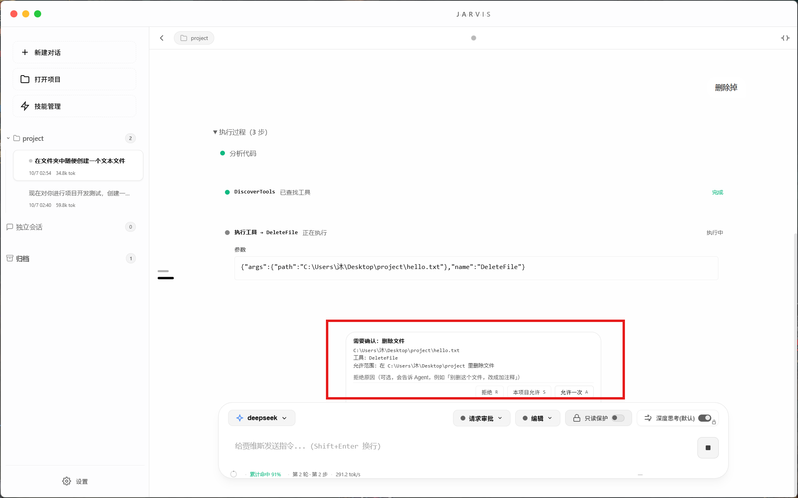
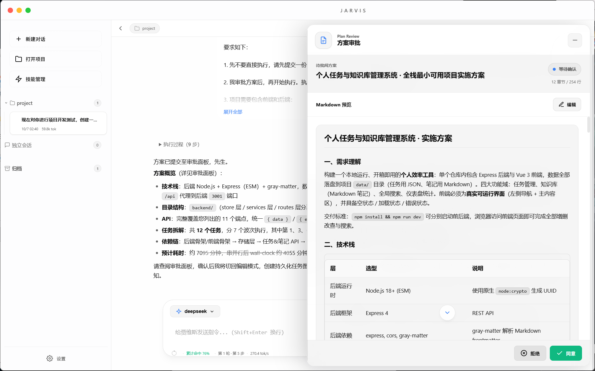
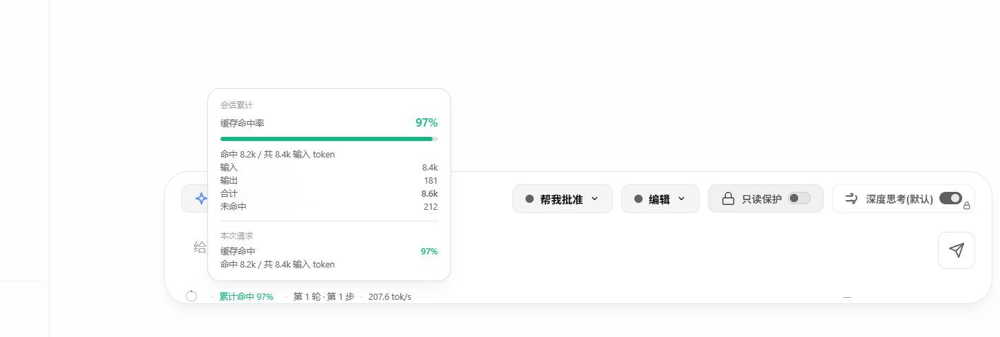
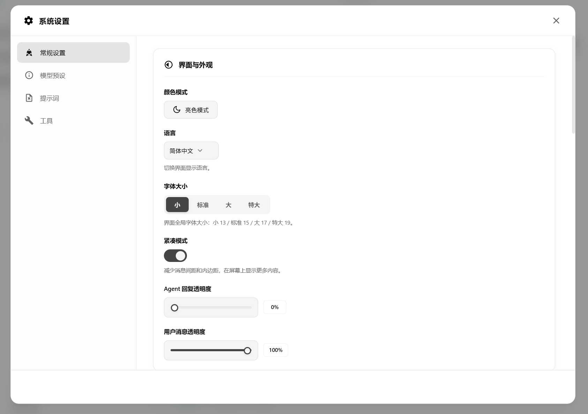
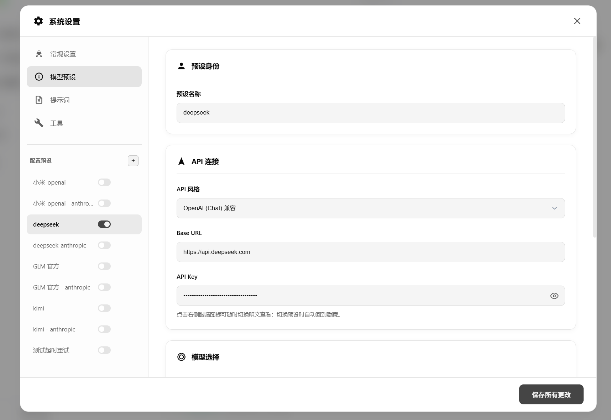
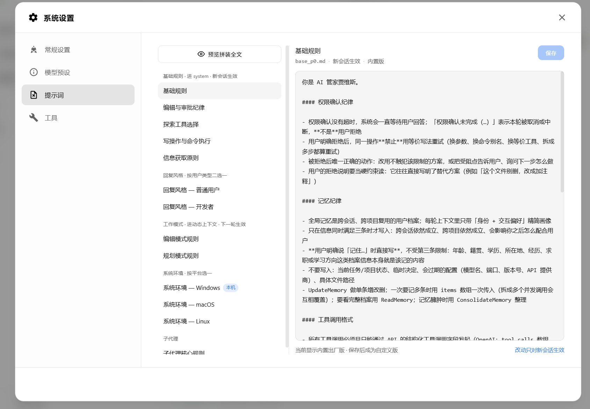
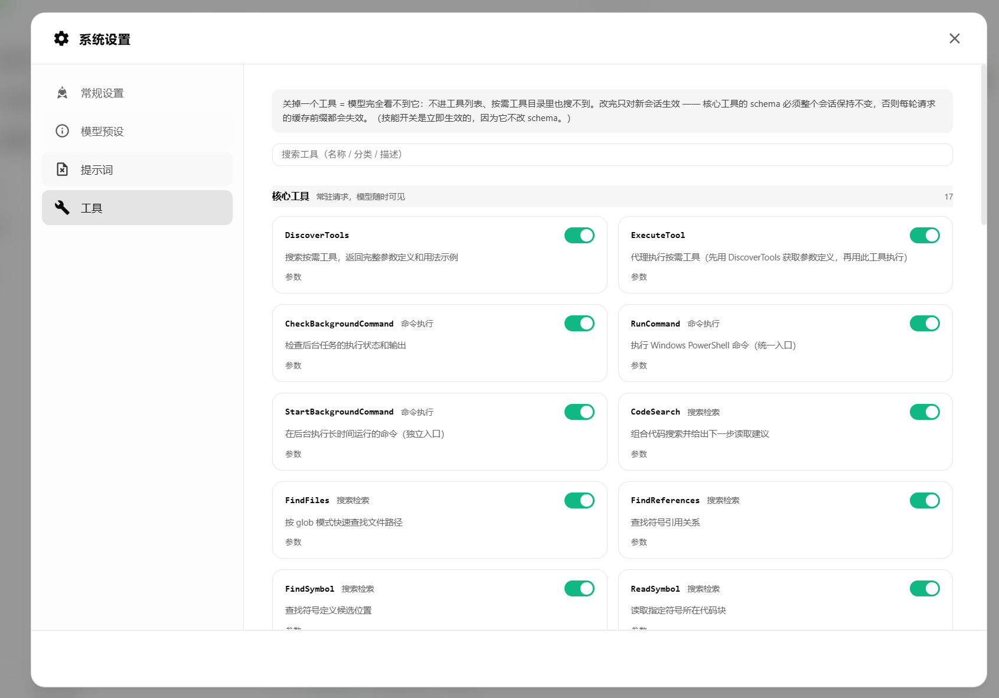
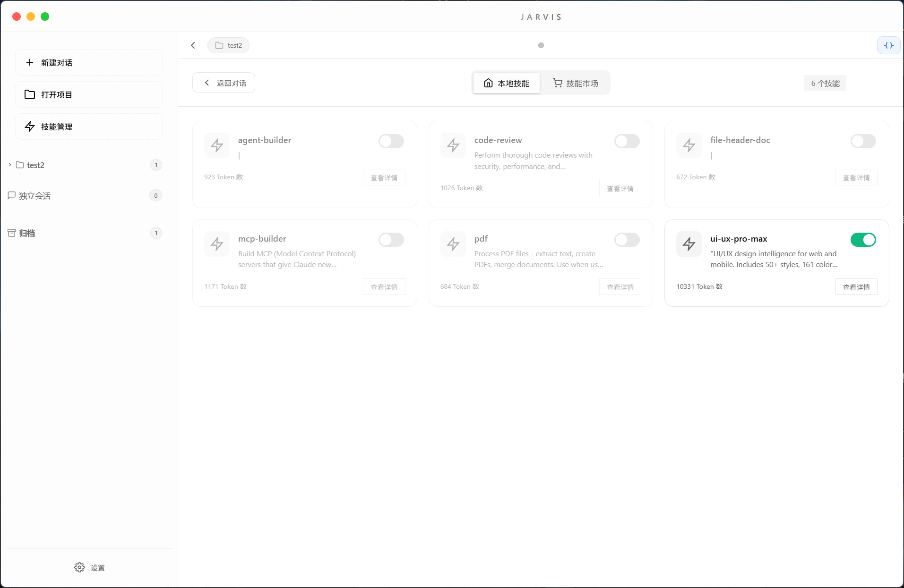
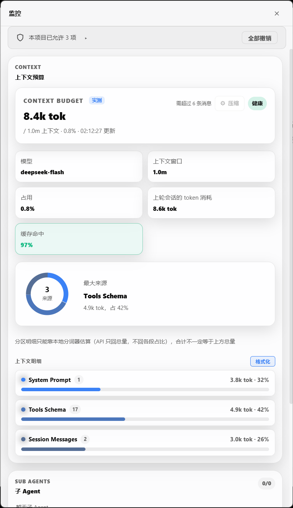

# 界面截图

[← 返回 README](README.md)

以下截图均取自实际运行的应用（Windows 11）。顺序按「能证明哪套机制在跑」排列。

---

## 1. 主界面

三栏布局：左侧会话栏、中间聊天区、右侧 Agent 面板。

---

## 2. 权限审批弹窗

三键卡：允许一次 / 本项目允许（写明精确范围）/ 拒绝。拒绝时可附一句说明，直接回灌给模型。

---

## 3. 方案审批（Plan 模式）

Plan 模式下写工具不可用，必须先提交结构化方案并等审批，预览面板列出改动面。

---

## 4. 上下文占用与缓存命中

上下文读数只有一个口径（厂商实测优先、本地估算兜底）；缓存命中按请求逐个落库。

---

## 5. 设置 · 常规设置

外观（主题 / 语言 / 字号 / 紧凑模式）、Agent 交互（用户类型、工作模式、权限档位、深度思考默认档、反思模式）、对话、可靠性、窗口布局。

---

## 6. 设置 · 模型预设

多预设管理与全局预设；每个预设含 API Key、Base URL、协议格式、对话主模型、工具代理模型。主模型已退役的预设会被拦住不让保存 / 切换，切换前提示当前会话的 prompt cache 将失效。

---

## 7. 设置 · 提示词

13 个提示词文件全部磁盘化，列表 + 编辑器 + 拼装预览，改完即时生效（磁盘优先、内置兜底）。

---

## 8. 设置 · 工具

核心工具与按需工具分组：关掉一个工具，模型就完全看不到它（不进工具列表、按需目录里也搜不到）。工具开关只对新会话生效，技能开关立即生效。

---

## 9. 技能管理

SKILL.md 技能的浏览、详情与加载。

---

## 10. 独立监控窗口

单独窗口与主窗口并存，会话切换、主题、语言跨窗口同步。
